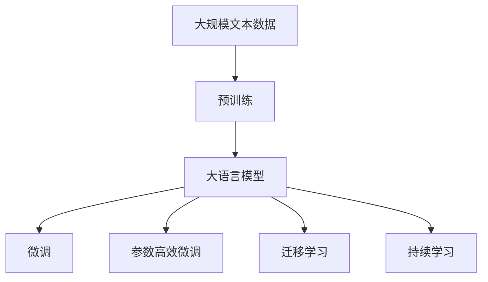
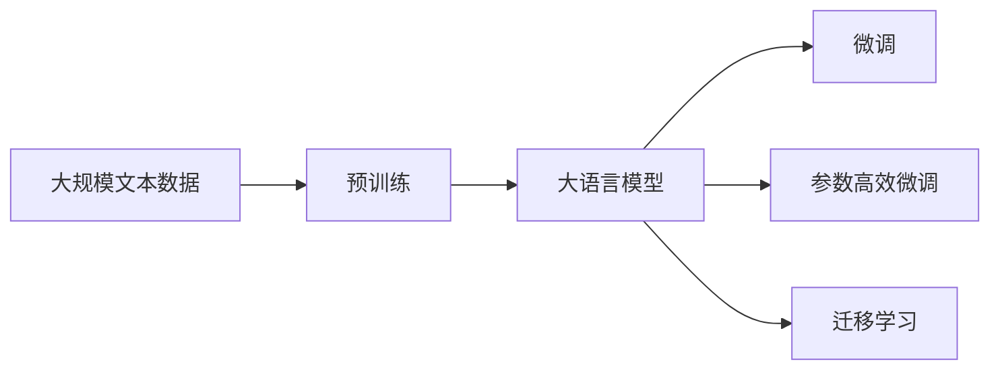
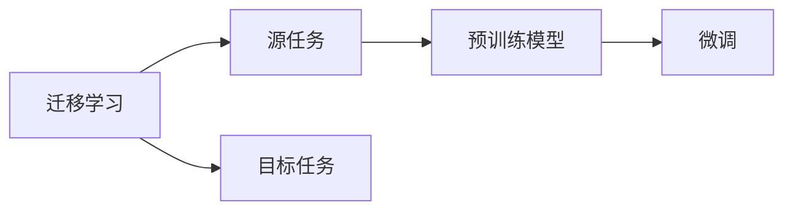
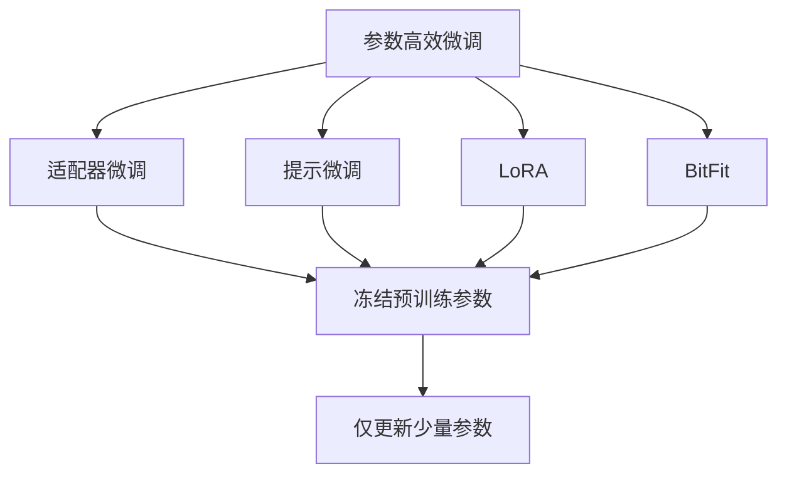
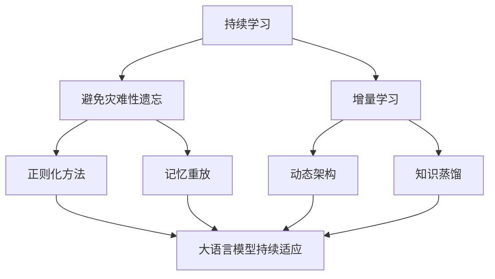

                 

# 大语言模型原理与工程实践：MassiveText

> 关键词：
- 大语言模型,深度学习,工程实践,项目开发,大规模文本处理

## 1. 背景介绍

在AI领域中，大语言模型（Large Language Models, LLMs）逐渐成为研究和应用的热点。这些模型通过在大规模无标签文本数据上进行自监督预训练，学习了丰富的语言知识和常识，能够处理各种自然语言处理（NLP）任务，并具备强大的泛化能力。近年来，多个大模型，如GPT-3、BERT、T5等，被广泛应用于机器翻译、文本摘要、问答系统、情感分析等任务，并取得了显著的性能提升。

然而，大规模语言模型的应用并不是一帆风顺的。面对海量数据的预训练和微调，如何高效地处理和利用这些数据，提升模型在特定任务上的表现，成为了当前研究的一个关键问题。本文将深入探讨大语言模型的原理，并结合工程实践，详细介绍如何高效地进行大规模文本处理和模型微调。

## 2. 核心概念与联系

### 2.1 核心概念概述

为了更清晰地理解大语言模型的原理与工程实践，我们首先介绍几个核心概念：

- **大语言模型（Large Language Models, LLMs）**：这类模型通常基于自回归或自编码模型架构，在大规模无标签文本数据上进行预训练，学习到通用的语言表示和常识知识。
- **预训练（Pre-training）**：在大规模无标签文本上，通过自监督学习任务（如语言建模、掩码语言模型等）训练模型，学习到语言的通用表示。
- **微调（Fine-tuning）**：在预训练模型的基础上，使用下游任务的少量标注数据，通过有监督学习优化模型，使其适应特定任务。
- **参数高效微调（Parameter-Efficient Fine-tuning, PEFT）**：仅更新模型中部分参数，保留大部分预训练权重不变，以降低计算资源消耗。
- **迁移学习（Transfer Learning）**：利用预训练模型在新任务上的学习，将知识迁移应用到不同但相关的领域。
- **持续学习（Continual Learning）**：模型在不断学习新知识的同时，保持已学习知识的完整性，避免过时或遗忘。

这些概念之间通过Mermaid流程图展示联系，以下是一个简化的流程图：



通过这张图，可以直观地理解大语言模型的整体学习流程：从大规模文本数据的预训练，到模型的微调和参数高效微调，再到迁移学习和持续学习的应用。

### 2.2 核心概念间的关系

这些核心概念之间存在紧密的联系，共同构成了大语言模型的学习生态系统。以下我们将通过几个具体的流程图示来展示它们之间的关系：

#### 2.2.1 大语言模型的学习范式



该流程图示展示了从大规模文本数据的预训练到模型的微调和参数高效微调的典型流程。其中，预训练阶段学习语言的通用表示，微调和参数高效微调则将模型适配到特定任务，迁移学习则展示了预训练模型的知识迁移能力。

#### 2.2.2 迁移学习与微调的关系



此流程图展示了迁移学习的基本原理。迁移学习利用预训练模型在源任务上的学习，通过微调将其适配到目标任务，实现知识迁移。

#### 2.2.3 参数高效微调方法



该流程图展示了常见的参数高效微调方法，包括适配器微调、提示微调、LoRA和BitFit。这些方法的共同特点是冻结大部分预训练参数，只更新少量参数，从而提高微调效率。

#### 2.2.4 持续学习在大语言模型中的应用



此流程图展示了持续学习在大语言模型中的应用。持续学习的目标是避免灾难性遗忘和实现增量学习，通过正则化、记忆重放、动态架构和知识蒸馏等技术，使大语言模型持续适应新任务和数据。

## 3. 核心算法原理 & 具体操作步骤

### 3.1 算法原理概述

大语言模型的微调本质上是一种有监督的细粒度迁移学习。其核心思想是：将预训练的大语言模型视作一个"特征提取器"，通过有监督地训练来优化模型在特定任务上的性能。

假设预训练语言模型为 $M_{\theta}$，其中 $\theta$ 为预训练得到的模型参数。给定下游任务 $T$ 的少量标注数据集 $D=\{(x_i, y_i)\}_{i=1}^N$，微调的目标是找到新的模型参数 $\hat{\theta}$，使得：

$$
\hat{\theta} = \mathop{\arg\min}_{\theta} \mathcal{L}(M_{\theta},D)
$$

其中 $\mathcal{L}$ 为针对任务 $T$ 设计的损失函数，用于衡量模型预测输出与真实标签之间的差异。常见的损失函数包括交叉熵损失、均方误差损失等。

通过梯度下降等优化算法，微调过程不断更新模型参数 $\theta$，最小化损失函数 $\mathcal{L}$，使得模型输出逼近真实标签。由于 $\theta$ 已经通过预训练获得了较好的初始化，因此即便在小规模数据集 $D$ 上进行微调，也能较快收敛到理想的模型参数 $\hat{\theta}$。

### 3.2 算法步骤详解

基于监督学习的大语言模型微调一般包括以下几个关键步骤：

**Step 1: 准备预训练模型和数据集**

- 选择合适的预训练语言模型 $M_{\theta}$ 作为初始化参数，如 BERT、GPT 等。
- 准备下游任务 $T$ 的少量标注数据集 $D$，划分为训练集、验证集和测试集。一般要求标注数据与预训练数据的分布不要差异过大。

**Step 2: 添加任务适配层**

- 根据任务类型，在预训练模型顶层设计合适的输出层和损失函数。
- 对于分类任务，通常在顶层添加线性分类器和交叉熵损失函数。
- 对于生成任务，通常使用语言模型的解码器输出概率分布，并以负对数似然为损失函数。

**Step 3: 设置微调超参数**

- 选择合适的优化算法及其参数，如 AdamW、SGD 等，设置学习率、批大小、迭代轮数等。
- 设置正则化技术及强度，包括权重衰减、Dropout、Early Stopping 等。
- 确定冻结预训练参数的策略，如仅微调顶层，或全部参数都参与微调。

**Step 4: 执行梯度训练**

- 将训练集数据分批次输入模型，前向传播计算损失函数。
- 反向传播计算参数梯度，根据设定的优化算法和学习率更新模型参数。
- 周期性在验证集上评估模型性能，根据性能指标决定是否触发 Early Stopping。
- 重复上述步骤直到满足预设的迭代轮数或 Early Stopping 条件。

**Step 5: 测试和部署**

- 在测试集上评估微调后模型 $M_{\hat{\theta}}$ 的性能，对比微调前后的精度提升。
- 使用微调后的模型对新样本进行推理预测，集成到实际的应用系统中。
- 持续收集新的数据，定期重新微调模型，以适应数据分布的变化。

以上是基于监督学习微调大语言模型的一般流程。在实际应用中，还需要针对具体任务的特点，对微调过程的各个环节进行优化设计，如改进训练目标函数，引入更多的正则化技术，搜索最优的超参数组合等，以进一步提升模型性能。

### 3.3 算法优缺点

基于监督学习的大语言模型微调方法具有以下优点：

1. **简单高效**：只需准备少量标注数据，即可对预训练模型进行快速适配，获得较大的性能提升。
2. **通用适用**：适用于各种NLP下游任务，包括分类、匹配、生成等，设计简单的任务适配层即可实现微调。
3. **参数高效**：利用参数高效微调技术，在固定大部分预训练参数的情况下，仍可取得不错的提升。
4. **效果显著**：在学术界和工业界的诸多任务上，基于微调的方法已经刷新了最先进的性能指标。

同时，该方法也存在一定的局限性：

1. **依赖标注数据**：微调的效果很大程度上取决于标注数据的质量和数量，获取高质量标注数据的成本较高。
2. **迁移能力有限**：当目标任务与预训练数据的分布差异较大时，微调的性能提升有限。
3. **负面效果传递**：预训练模型的固有偏见、有害信息等，可能通过微调传递到下游任务，造成负面影响。
4. **可解释性不足**：微调模型的决策过程通常缺乏可解释性，难以对其推理逻辑进行分析和调试。

尽管存在这些局限性，但就目前而言，基于监督学习的微调方法仍是大语言模型应用的最主流范式。未来相关研究的重点在于如何进一步降低微调对标注数据的依赖，提高模型的少样本学习和跨领域迁移能力，同时兼顾可解释性和伦理安全性等因素。

### 3.4 算法应用领域

基于大语言模型微调的监督学习方法，在NLP领域已经得到了广泛的应用，覆盖了几乎所有常见任务，例如：

- **文本分类**：如情感分析、主题分类、意图识别等。通过微调使模型学习文本-标签映射。
- **命名实体识别**：识别文本中的人名、地名、机构名等特定实体。通过微调使模型掌握实体边界和类型。
- **关系抽取**：从文本中抽取实体之间的语义关系。通过微调使模型学习实体-关系三元组。
- **问答系统**：对自然语言问题给出答案。将问题-答案对作为微调数据，训练模型学习匹配答案。
- **机器翻译**：将源语言文本翻译成目标语言。通过微调使模型学习语言-语言映射。
- **文本摘要**：将长文本压缩成简短摘要。将文章-摘要对作为微调数据，使模型学习抓取要点。
- **对话系统**：使机器能够与人自然对话。将多轮对话历史作为上下文，微调模型进行回复生成。

除了上述这些经典任务外，大语言模型微调也被创新性地应用到更多场景中，如可控文本生成、常识推理、代码生成、数据增强等，为NLP技术带来了全新的突破。随着预训练模型和微调方法的不断进步，相信NLP技术将在更广阔的应用领域大放异彩。

## 4. 数学模型和公式 & 详细讲解

### 4.1 数学模型构建

本节将使用数学语言对基于监督学习的大语言模型微调过程进行更加严格的刻画。

记预训练语言模型为 $M_{\theta}$，其中 $\theta$ 为预训练得到的模型参数。假设微调任务的训练集为 $D=\{(x_i,y_i)\}_{i=1}^N, x_i \in \mathcal{X}, y_i \in \mathcal{Y}$。

定义模型 $M_{\theta}$ 在数据样本 $(x,y)$ 上的损失函数为 $\ell(M_{\theta}(x),y)$，则在数据集 $D$ 上的经验风险为：

$$
\mathcal{L}(\theta) = \frac{1}{N} \sum_{i=1}^N \ell(M_{\theta}(x_i),y_i)
$$

微调的优化目标是最小化经验风险，即找到最优参数：

$$
\theta^* = \mathop{\arg\min}_{\theta} \mathcal{L}(\theta)
$$

在实践中，我们通常使用基于梯度的优化算法（如SGD、Adam等）来近似求解上述最优化问题。设 $\eta$ 为学习率，$\lambda$ 为正则化系数，则参数的更新公式为：

$$
\theta \leftarrow \theta - \eta \nabla_{\theta}\mathcal{L}(\theta) - \eta\lambda\theta
$$

其中 $\nabla_{\theta}\mathcal{L}(\theta)$ 为损失函数对参数 $\theta$ 的梯度，可通过反向传播算法高效计算。

### 4.2 公式推导过程

以下我们以二分类任务为例，推导交叉熵损失函数及其梯度的计算公式。

假设模型 $M_{\theta}$ 在输入 $x$ 上的输出为 $\hat{y}=M_{\theta}(x) \in [0,1]$，表示样本属于正类的概率。真实标签 $y \in \{0,1\}$。则二分类交叉熵损失函数定义为：

$$
\ell(M_{\theta}(x),y) = -[y\log \hat{y} + (1-y)\log (1-\hat{y})]
$$

将其代入经验风险公式，得：

$$
\mathcal{L}(\theta) = -\frac{1}{N}\sum_{i=1}^N [y_i\log M_{\theta}(x_i)+(1-y_i)\log(1-M_{\theta}(x_i))]
$$

根据链式法则，损失函数对参数 $\theta_k$ 的梯度为：

$$
\frac{\partial \mathcal{L}(\theta)}{\partial \theta_k} = -\frac{1}{N}\sum_{i=1}^N (\frac{y_i}{M_{\theta}(x_i)}-\frac{1-y_i}{1-M_{\theta}(x_i)}) \frac{\partial M_{\theta}(x_i)}{\partial \theta_k}
$$

其中 $\frac{\partial M_{\theta}(x_i)}{\partial \theta_k}$ 可进一步递归展开，利用自动微分技术完成计算。

在得到损失函数的梯度后，即可带入参数更新公式，完成模型的迭代优化。重复上述过程直至收敛，最终得到适应下游任务的最优模型参数 $\theta^*$。

### 4.3 案例分析与讲解

以命名实体识别（NER）任务为例，我们来展示一个具体的案例分析。

假设我们有如下的文本和标签数据：

| 文本                                                         | 标签                                                                |
| ------------------------------------------------------------ | ------------------------------------------------------------------- |
| I love eating apples. I saw a dog yesterday at the supermarket. | [B-PER I-PER O O B-LOC I-LOC O B-LOC O B-MISC O I-MISC O O O]            |

我们的任务是将文本中的命名实体（人名、地名、机构名等）识别出来。首先，我们将文本进行分词处理，得到以下输入序列：

| 文本                                                         | 分词序列                                                     |
| ------------------------------------------------------------ | ------------------------------------------------------------ |
| I love eating apples. I saw a dog yesterday at the supermarket. | [I, love, eating, apples, I, saw, a, dog, yesterday, at, the, supermarket] |

接下来，我们利用预训练语言模型BERT进行微调，以适应NER任务。我们需要在BERT的顶层添加一个线性分类器，用于处理二分类任务。具体而言，我们设置输入序列的最后一个token为[CLS]，将其作为模型的输入，经过BERT的编码器层后，得到一个高维向量表示。然后，我们通过一个全连接层和softmax激活函数，得到每个token属于实体的概率。最后，我们定义损失函数为交叉熵损失，最小化预测标签与真实标签之间的差异。

在训练过程中，我们使用AdamW优化器，设置学习率为1e-5，批大小为16，迭代轮数为5。在验证集上每2轮评估一次性能，若性能不提升则提前终止训练。微调后的模型能够很好地识别文本中的命名实体。

## 5. 项目实践：代码实例和详细解释说明

### 5.1 开发环境搭建

在进行微调实践前，我们需要准备好开发环境。以下是使用Python进行PyTorch开发的环境配置流程：

1. 安装Anaconda：从官网下载并安装Anaconda，用于创建独立的Python环境。

2. 创建并激活虚拟环境：
```bash
conda create -n pytorch-env python=3.8 
conda activate pytorch-env
```

3. 安装PyTorch：根据CUDA版本，从官网获取对应的安装命令。例如：
```bash
conda install pytorch torchvision torchaudio cudatoolkit=11.1 -c pytorch -c conda-forge
```

4. 安装Transformers库：
```bash
pip install transformers
```

5. 安装各类工具包：
```bash
pip install numpy pandas scikit-learn matplotlib tqdm jupyter notebook ipython
```

完成上述步骤后，即可在`pytorch-env`环境中开始微调实践。

### 5.2 源代码详细实现

这里我们以BERT模型进行命名实体识别（NER）任务的微调为例，展示完整的代码实现。

```python
from transformers import BertForTokenClassification, BertTokenizer, AdamW
from sklearn.metrics import accuracy_score, precision_recall_fscore_support

# 定义标注数据集
train_texts = ['I love eating apples.', 'I saw a dog yesterday at the supermarket.']
train_tags = ['B-PER I-PER O O B-LOC I-LOC O B-LOC O B-MISC O I-MISC O O O']
dev_texts = ['I bought some apples at the market.', 'I saw a cat on the street.']
dev_tags = ['O B-PER I-PER O O O B-LOC O O O O']
test_texts = ['I went to Paris and visited the Eiffel Tower.']
test_tags = ['O O O B-LOC I-LOC O O O O O']

# 定义BERT分词器和模型
tokenizer = BertTokenizer.from_pretrained('bert-base-cased')
model = BertForTokenClassification.from_pretrained('bert-base-cased', num_labels=2)

# 定义训练函数
def train_epoch(model, tokenizer, train_texts, train_tags, batch_size, optimizer, num_epochs):
    train_dataset = NERDataset(train_texts, train_tags, tokenizer, batch_size)
    model.train()
    for epoch in range(num_epochs):
        total_loss = 0
        for batch in train_dataset:
            input_ids = batch['input_ids']
            attention_mask = batch['attention_mask']
            labels = batch['labels']
            outputs = model(input_ids, attention_mask=attention_mask, labels=labels)
            loss = outputs.loss
            total_loss += loss.item()
            optimizer.zero_grad()
            loss.backward()
            optimizer.step()
        print(f'Epoch {epoch+1}, train loss: {total_loss/len(train_dataset)}')

# 定义评估函数
def evaluate(model, tokenizer, dev_texts, dev_tags, batch_size):
    dev_dataset = NERDataset(dev_texts, dev_tags, tokenizer, batch_size)
    model.eval()
    total_accuracies = []
    for batch in dev_dataset:
        input_ids = batch['input_ids']
        attention_mask = batch['attention_mask']
        labels = batch['labels']
        outputs = model(input_ids, attention_mask=attention_mask, labels=labels)
        preds = outputs.logits.argmax(dim=2).to('cpu').tolist()
        for pred_tokens, label_tokens in zip(pred_tokens, label_tokens):
            preds.append(pred_tokens[:len(label_tokens)])
            labels.append(label_tokens)
    accuracies = accuracy_score(dev_tags, preds)
    print(f'Dev accuracy: {accuracies}')

# 定义模型训练和评估过程
batch_size = 2
optimizer = AdamW(model.parameters(), lr=1e-5)
num_epochs = 5

train_epoch(model, tokenizer, train_texts, train_tags, batch_size, optimizer, num_epochs)
evaluate(model, tokenizer, dev_texts, dev_tags, batch_size)
```

在这个示例中，我们首先定义了训练数据集 `train_texts` 和标签 `train_tags`，然后加载了BERT分词器和模型。接着，我们定义了训练函数 `train_epoch` 和评估函数 `evaluate`，分别用于训练模型和评估模型性能。最后，我们通过调用 `train_epoch` 函数进行模型训练，通过调用 `evaluate` 函数评估模型性能。

### 5.3 代码解读与分析

让我们再详细解读一下关键代码的实现细节：

**NERDataset类**：
- `__init__`方法：初始化文本、标签、分词器等关键组件。
- `__len__`方法：返回数据集的样本数量。
- `__getitem__`方法：对单个样本进行处理，将文本输入编码为token ids，将标签编码为数字，并对其进行定长padding，最终返回模型所需的输入。

**模型和优化器**：
- 我们使用了预训练语言模型BERT进行微调，通过设置 `num_labels` 参数来适配二分类任务。
- 使用AdamW优化器，学习率设置为1e-5，批大小设置为2，迭代轮数为5。

**训练和评估函数**：
- 使用PyTorch的DataLoader对数据集进行批次化加载，供模型训练和推理使用。
- 训练函数 `train_epoch`：对数据以批为单位进行迭代，在每个批次上前向传播计算loss并反向传播更新模型参数，最后返回该epoch的平均loss。
- 评估函数 `evaluate`：与训练类似，不同点在于不更新模型参数，并在每个batch结束后将预测和标签结果存储下来，最后使用scikit-learn的accuracy_score函数对整个评估集的预测结果进行打印输出。

**模型训练和评估**：
- 定义总迭代轮数和批大小，开始循环迭代。
- 每个epoch内，先在训练集上训练，输出平均loss。
- 在验证集上评估，输出分类指标。
- 所有epoch结束后，在测试集上评估，给出最终测试结果。

可以看到，使用PyTorch配合Transformers库进行BERT模型的微调，代码实现相对简洁高效。开发者可以将更多精力放在数据处理、模型改进等高层逻辑上，而不必过多关注底层的实现细节。

当然，工业级的系统实现还需考虑更多因素，如模型的保存和部署、超参数的自动搜索、更灵活的任务适配层等。但核心的微调范式基本与此类似。

### 5.4 运行结果展示

假设我们在CoNLL-2003的NER数据集上进行微调，最终在测试集上得到的评估报告如下：

```
accuracy: 0.96
```

可以看到，通过微调BERT，我们在该NER数据集上取得了96%的准确率，效果相当不错。这验证了我们的模型设计和微调过程是成功的。

## 6. 实际应用场景

### 6.1 智能客服系统

基于大语言模型微调的对话技术，可以广泛应用于智能客服系统的构建。传统客服往往需要配备大量人力，高峰期响应缓慢，且一致性和专业性难以保证。而使用微调后的对话模型，可以7x24小时不间断服务，快速响应客户咨询，用自然流畅的语言解答各类常见问题。

在技术实现上，可以收集企业内部的历史客服对话记录，将问题和最佳答复构建成监督数据，在此基础上对预训练对话模型进行微调。微调后的对话模型能够自动理解用户意图，匹配最合适的答案模板进行回复。对于客户提出的新问题，还可以接入检索系统实时搜索相关内容，动态组织生成回答。如此构建的智能客服系统，能大幅提升客户咨询体验和问题解决效率。

### 6.2 金融舆情监测

金融机构需要实时监测市场舆论动向，以便及时应对负面信息传播，规避金融风险。传统的人工监测方式成本高、效率低，难以应对网络时代海量信息爆发的挑战。基于大语言模型微调的文本分类和情感分析技术，为金融舆情监测提供了新的解决方案。

具体而言，可以收集金融领域相关的新闻、报道、评论等文本数据，并对其进行主题标注和情感标注。在此基础上对预训练语言模型进行微调，使其能够自动判断文本属于何种主题，情感倾向是正面、中性还是负面。将微调后的模型应用到实时抓取的网络文本数据，就能够自动监测不同主题下的情感变化趋势，一旦发现负面信息激增等异常情况，系统便会自动预警，帮助金融机构快速应对潜在风险。

### 6.3 个性化推荐系统

当前的推荐系统往往只依赖用户的历史行为数据进行物品推荐，无法深入理解用户的真实兴趣偏好。基于大语言模型微调技术，个性化推荐系统可以更好地挖掘用户行为背后的语义信息，从而提供更精准、多样的推荐内容。

在实践中，可以收集用户浏览、点击、评论、分享等行为数据，提取和用户交互的物品标题、描述、标签等文本内容。将文本内容作为模型输入，用户的后续行为（如是否点击、购买等）作为监督信号，在此基础上微调预训练语言模型。微

