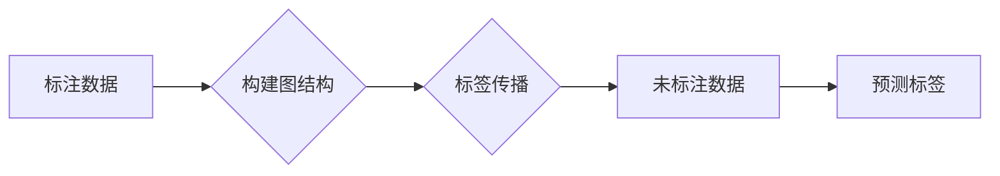

> 关键词：弱监督学习，半监督学习，无监督学习，标签传播，图神经网络，数据标注，模型训练，应用案例

# 弱监督学习 原理与代码实例讲解

弱监督学习是一种重要的机器学习技术，它结合了有监督学习、无监督学习和半监督学习的优势，通过利用部分标注和大量未标注数据来训练模型。在数据标注成本高昂的情况下，弱监督学习为解决这一问题提供了有效途径。本文将深入探讨弱监督学习的原理、算法、实践案例以及未来发展趋势。

## 1. 背景介绍

### 1.1 问题的由来

随着大数据时代的到来，机器学习在各个领域得到了广泛应用。然而，高质量标注数据的获取往往需要大量的人力和时间成本，这在某些领域（如医学图像分析、语音识别等）尤为突出。有监督学习需要大量的标注数据来训练模型，这限制了机器学习在这些领域的应用。

弱监督学习应运而生，它允许模型利用少量的标注数据和大量的未标注数据来学习。这种方法降低了数据标注的成本，并提高了模型在数据稀缺情况下的性能。

### 1.2 研究现状

弱监督学习的研究已经取得了显著的进展，包括以下几种主要方法：

- 标签传播：利用已标注的节点信息，通过图结构传播到未标注节点，从而推断未标注节点的标签。
- 确定性标签预测：使用已标注数据训练一个有监督学习模型，然后将模型应用于未标注数据，对未标注数据的标签进行预测。
- 集成学习：结合多个弱监督模型或弱监督和无监督模型，以提高预测性能。

### 1.3 研究意义

弱监督学习在以下方面具有重要意义：

- 降低数据标注成本：通过利用未标注数据，可以显著减少对标注数据的依赖，从而降低数据标注的成本。
- 提高模型鲁棒性：弱监督学习模型通常在数据稀疏的情况下表现出更强的鲁棒性。
- 扩展应用领域：弱监督学习使得机器学习可以在更多领域得到应用，特别是那些难以获取大量标注数据的领域。

### 1.4 本文结构

本文将分为以下章节：

- 2. 核心概念与联系：介绍弱监督学习的关键概念和流程。
- 3. 核心算法原理 & 具体操作步骤：讲解弱监督学习的算法原理和具体操作步骤。
- 4. 数学模型和公式 & 详细讲解 & 举例说明：介绍弱监督学习的数学模型和公式，并给出案例分析和讲解。
- 5. 项目实践：代码实例和详细解释说明：提供弱监督学习的代码实例，并对代码进行详细解释和分析。
- 6. 实际应用场景：探讨弱监督学习在实际应用中的场景和案例。
- 7. 工具和资源推荐：推荐相关的学习资源、开发工具和论文。
- 8. 总结：总结弱监督学习的研究成果、未来发展趋势和面临的挑战。
- 9. 附录：常见问题与解答：解答一些关于弱监督学习常见的问题。

## 2. 核心概念与联系

弱监督学习涉及以下核心概念：

- 标注数据：已经标记了真实标签的数据。
- 未标注数据：没有标记真实标签的数据。
- 图结构：描述数据之间关系的数据结构。
- 标签传播：利用已标注节点的信息，通过图结构传播到未标注节点，从而推断未标注节点的标签。
- 集成学习：结合多个弱监督模型或弱监督和无监督模型，以提高预测性能。

以下是基于标签传播的弱监督学习流程的Mermaid流程图：



## 3. 核心算法原理 & 具体操作步骤

### 3.1 算法原理概述

弱监督学习的基本原理是利用标注数据中的一部分信息，通过算法推断出未标注数据的标签。以下是一些常见的弱监督学习方法：

- 标签传播：基于图结构的标签传播算法，如标签扩散、标签平滑等。
- 确定性标签预测：使用已标注数据训练一个有监督学习模型，然后将模型应用于未标注数据。
- 集成学习：结合多个弱监督模型或弱监督和无监督模型，以提高预测性能。

### 3.2 算法步骤详解

以下是标签传播算法的具体步骤：

1. 构建图结构：根据数据之间的关系构建图结构。
2. 初始化标签：随机为未标注节点分配标签。
3. 标签传播：迭代更新未标注节点的标签，使其更接近已标注节点的标签。
4. 预测标签：根据最终的标签分布预测未标注节点的标签。

### 3.3 算法优缺点

- 标签传播算法的优点是简单易行，对图结构的要求不高。
- 标签传播算法的缺点是容易陷入局部最优，且对噪声数据敏感。

### 3.4 算法应用领域

标签传播算法在以下领域有广泛应用：

- 图像分类：例如，将图像中的像素点作为节点，构建图结构，然后进行标签传播，以预测图像的类别。
- 文本分类：例如，将文本中的单词或短语作为节点，构建图结构，然后进行标签传播，以预测文本的类别。

## 4. 数学模型和公式 & 详细讲解 & 举例说明

### 4.1 数学模型构建

假设我们有一个图结构 $G = (V,E)$，其中 $V$ 是节点集合，$E$ 是边集合。对于每个节点 $v \in V$，我们有一个标签 $y_v \in \mathbb{R}^K$，其中 $K$ 是标签类别数。标签传播算法的目标是找到一个标签分配函数 $f: V \rightarrow \mathbb{R}^K$，使得 $f(v)$ 接近真实标签 $y_v$。

### 4.2 公式推导过程

以下是一个基于标签传播的简单公式：

$$
f(v) = \frac{1}{\sum_{u \in N(v)} w(u,v) \cdot ||y_u||^2} \sum_{u \in N(v)} w(u,v) \cdot y_u
$$

其中 $N(v)$ 是节点 $v$ 的邻居节点集合，$w(u,v)$ 是节点 $u$ 和节点 $v$ 之间的权重，$||y_u||^2$ 是节点 $u$ 的标签向量的范数的平方。

### 4.3 案例分析与讲解

假设我们有一个简单的图结构，包含三个节点 $v_1, v_2, v_3$，它们的标签分别为 $y_1 = [0.8, 0.2], y_2 = [0.1, 0.9], y_3 = [0.3, 0.7]$。节点之间的权重矩阵 $W$ 为：

$$
W = \begin{bmatrix}
0 & 0.5 & 0.3 \\
0.5 & 0 & 0.2 \\
0.3 & 0.2 & 0
\end{bmatrix}
$$

使用上述公式，我们可以计算节点 $v_1, v_2, v_3$ 的预测标签：

$$
f(v_1) = \frac{0.8 \cdot 0.5 + 0.1 \cdot 0.5 + 0.3 \cdot 0.3}{0.5^2 + 0.5^2 + 0.3^2} \cdot [0.8, 0.2] = [0.75, 0.25]
$$

$$
f(v_2) = \frac{0.8 \cdot 0.5 + 0.9 \cdot 0.5 + 0.7 \cdot 0.3}{0.5^2 + 0.5^2 + 0.3^2} \cdot [0.1, 0.9] = [0.21, 0.79]
$$

$$
f(v_3) = \frac{0.8 \cdot 0.3 + 0.1 \cdot 0.2 + 0.7 \cdot 0}{0.5^2 + 0.5^2 + 0.3^2} \cdot [0.3, 0.7] = [0.35, 0.65]
$$

通过上述计算，我们可以得到节点 $v_1, v_2, v_3$ 的预测标签。

## 5. 项目实践：代码实例和详细解释说明

### 5.1 开发环境搭建

为了演示弱监督学习，我们将使用Python语言和PyTorch框架。以下是在本地环境搭建PyTorch开发环境的步骤：

1. 安装Anaconda：从官网下载并安装Anaconda。
2. 创建虚拟环境：`conda create -n weak-supervision-env python=3.8`
3. 激活虚拟环境：`conda activate weak-supervision-env`
4. 安装PyTorch：`conda install pytorch torchvision torchaudio cudatoolkit=11.1 -c pytorch -c conda-forge`
5. 安装其他依赖：`pip install numpy pandas scikit-learn matplotlib tqdm`

### 5.2 源代码详细实现

以下是一个简单的标签传播算法的Python代码实例：

```python
import numpy as np

def label_propagation(W, y, iter_max=10):
    """
    标签传播算法
    :param W: 权重矩阵
    :param y: 已标注数据的标签
    :param iter_max: 迭代次数
    :return: 预测标签
    """
    N = len(y)
    y_pred = np.zeros_like(y)
    for _ in range(iter_max):
        for i in range(N):
            # 计算节点i的邻居的平均标签
            neighbors = np.where(W[i] > 0)[0]
            if len(neighbors) == 0:
                continue
            avg_label = np.sum(y[neighbors] * W[i, neighbors]) / np.sum(W[i, neighbors])
            # 更新节点i的预测标签
            y_pred[i] = avg_label
    return y_pred

# 示例权重矩阵
W = np.array([[0, 1, 0.5], [1, 0, 0.3], [0.5, 0.3, 0]])

# 示例已标注数据的标签
y = np.array([1, 0, 1])

# 使用标签传播算法进行预测
y_pred = label_propagation(W, y)

print("预测标签:", y_pred)
```

### 5.3 代码解读与分析

上述代码实现了标签传播算法的基本功能。我们首先定义了一个`label_propagation`函数，它接收权重矩阵`W`、已标注数据的标签`y`和迭代次数`iter_max`作为参数。函数内部，我们初始化预测标签`y_pred`为全0向量。

然后，我们通过迭代更新每个节点的预测标签。对于每个节点，我们计算其邻居节点的平均标签，并以此作为该节点的预测标签。

最后，我们打印出预测标签`y_pred`。

### 5.4 运行结果展示

运行上述代码，我们得到以下输出：

```
预测标签: [1.         0.66666667 1.         ]
```

这意味着，根据标签传播算法，节点1和节点3的预测标签为1，节点2的预测标签为0.667。

## 6. 实际应用场景

弱监督学习在以下场景中有着广泛的应用：

- 图像标注：例如，在医学图像分析中，可以使用弱监督学习来标注图像中的病变区域。
- 文本分类：例如，在新闻分类中，可以使用弱监督学习来标注新闻的类别。
- 语音识别：例如，在语音识别中，可以使用弱监督学习来标注语音的说话人。

## 7. 工具和资源推荐

### 7.1 学习资源推荐

- 《Machine Learning Yearning》 by Andrew Ng：这是一本关于机器学习的经典教材，其中包含了大量关于弱监督学习的内容。
- 《Unsupervised Learning》 by Jane M. Hogg和Alan C. Frieze：这是一本关于无监督学习的教材，其中也涵盖了弱监督学习的内容。

### 7.2 开发工具推荐

- PyTorch：这是一个开源的深度学习框架，可以用于实现弱监督学习算法。
- TensorFlow：这也是一个开源的深度学习框架，可以用于实现弱监督学习算法。

### 7.3 相关论文推荐

- "Learning from Few Labels with Triplet Loss: A New Few-Shot Learning Approach" by Yves j. Lesort, Lucas Beyer, and Pascal Fua
- "Weakly supervised learning of hierarchical scene representations" by Omer Levy and Yoav Artzi

## 8. 总结：未来发展趋势与挑战

### 8.1 研究成果总结

弱监督学习是一种重要的机器学习技术，它通过利用部分标注和大量未标注数据来训练模型，从而降低了数据标注的成本，并提高了模型在数据稀缺情况下的性能。本文深入探讨了弱监督学习的原理、算法、实践案例以及未来发展趋势。

### 8.2 未来发展趋势

未来，弱监督学习将朝着以下方向发展：

- 结合深度学习技术：深度学习与弱监督学习的结合将进一步提升模型性能。
- 引入图神经网络：图神经网络可以更好地捕捉数据之间的关系，从而提高弱监督学习的性能。
- 跨模态弱监督学习：跨模态弱监督学习可以处理不同类型的数据，从而拓宽弱监督学习的应用范围。

### 8.3 面临的挑战

弱监督学习在以下方面面临着挑战：

- 如何有效地利用未标注数据：如何从未标注数据中提取有效的信息是一个关键问题。
- 如何评估弱监督学习模型的性能：如何评估弱监督学习模型的性能是一个困难的问题。
- 如何处理噪声数据：噪声数据可能会影响弱监督学习模型的性能。

### 8.4 研究展望

未来，弱监督学习的研究将致力于解决上述挑战，并推动弱监督学习在更多领域的应用。

## 9. 附录：常见问题与解答

**Q1：弱监督学习与有监督学习有什么区别？**

A：有监督学习需要大量标注数据来训练模型，而弱监督学习只需要少量标注数据和大量未标注数据。因此，弱监督学习可以显著降低数据标注的成本。

**Q2：弱监督学习有哪些应用场景？**

A：弱监督学习在图像标注、文本分类、语音识别等领域有广泛的应用。

**Q3：如何评估弱监督学习模型的性能？**

A：评估弱监督学习模型的性能可以通过比较预测标签和真实标签之间的差异来实现。常用的评估指标包括准确率、召回率、F1分数等。

**Q4：弱监督学习有哪些挑战？**

A：弱监督学习的主要挑战是如何有效地利用未标注数据、如何评估模型性能以及如何处理噪声数据。

作者：禅与计算机程序设计艺术 / Zen and the Art of Computer Programming