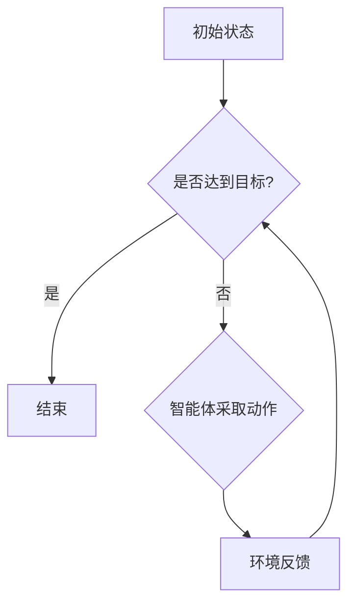

> 强化学习, 能效管理系统, 能源优化, 策略学习, 智能控制, 状态-动作-奖励

# 强化学习Reinforcement Learning在能效管理系统的应用案例

> 关键词：强化学习，能效管理系统，能源优化，策略学习，智能控制，状态-动作-奖励

## 1. 背景介绍

随着全球能源需求的不断增长和环境保护意识的提升，能效管理系统在工业、商业和住宅领域的重要性日益凸显。能效管理系统旨在优化能源使用，降低能耗，减少碳排放，同时提高生产效率和居住舒适度。然而，传统的能效管理系统往往依赖于预定的控制策略，无法适应动态变化的能源需求和系统状态，导致能效提升空间受限。

强化学习（Reinforcement Learning, RL）作为一种通过与环境交互进行学习的机器学习技术，为能效管理系统的智能化提供了新的解决方案。通过模拟人类决策过程，强化学习能够根据实时反馈不断调整控制策略，实现能源使用的优化。

### 1.1 问题的由来

传统的能效管理系统通常采用以下几种方法：

1. **规则基础控制**：通过预设的规则来控制设备运行，如设定温度阈值来开关空调。
2. **模型预测控制**：利用历史数据建立系统模型，预测未来能耗并据此控制设备。
3. **专家系统**：基于专家经验和知识库进行决策，但难以适应复杂多变的场景。

这些方法存在以下局限性：

- **适应性差**：难以适应动态变化的能源需求和系统状态。
- **优化能力有限**：无法实现全局优化，能耗降低空间有限。
- **成本高**：建立模型和知识库需要大量时间和资源。

### 1.2 研究现状

强化学习在能效管理系统中的应用研究已经取得了一定的进展。研究人员通过构建强化学习模型，实现了对电力系统、智能电网、建筑能效、数据中心等领域的优化控制。

### 1.3 研究意义

强化学习在能效管理系统中的应用具有以下意义：

- **提高能效**：通过动态调整控制策略，实现能源使用的全局优化，降低能耗。
- **降低成本**：减少能源消耗，降低运营成本。
- **增强适应性**：适应动态变化的能源需求和系统状态。
- **提升智能化水平**：推动能效管理系统的智能化发展。

### 1.4 本文结构

本文将围绕强化学习在能效管理系统的应用展开，具体内容包括：

- 核心概念和联系
- 核心算法原理和操作步骤
- 数学模型和公式
- 项目实践案例
- 实际应用场景
- 工具和资源推荐
- 未来发展趋势与挑战

## 2. 核心概念与联系

### 2.1 强化学习概念原理

强化学习是一种通过与环境交互进行学习的机器学习技术。其核心思想是智能体（Agent）通过与环境的交互，学习如何采取最佳动作（Action），以实现目标最大化。在强化学习框架中，智能体需要解决以下三个主要问题：

- **状态空间（State Space）**：智能体所处环境的全部可能状态。
- **动作空间（Action Space）**：智能体可以采取的所有可能动作。
- **奖励函数（Reward Function）**：评估智能体动作的优劣，通常与目标函数相关联。

### 2.2 Mermaid 流程图



### 2.3 强化学习与能效管理系统

强化学习在能效管理系统中的应用，可以将智能体视为能源管理系统，状态空间表示能源系统的当前状态，动作空间表示智能体可以采取的控制策略，奖励函数表示控制策略带来的能源消耗和成本。

## 3. 核心算法原理 & 具体操作步骤

### 3.1 算法原理概述

强化学习算法主要分为以下几类：

- **值函数方法**：通过学习值函数来评估不同状态和动作的价值。
- **策略梯度方法**：直接优化策略函数，使其最大化期望奖励。
- **蒙特卡洛方法**：通过模拟随机过程来估计值函数和策略。

### 3.2 算法步骤详解

1. **环境搭建**：构建能效管理系统的模拟环境，包括状态空间、动作空间和奖励函数。
2. **策略初始化**：初始化策略函数，可以采用随机策略或基于经验的启发式策略。
3. **训练过程**：智能体与环境交互，根据策略选择动作，根据奖励函数获取奖励，并根据奖励更新策略。
4. **评估和优化**：评估策略性能，优化策略函数，重复训练过程。

### 3.3 算法优缺点

**优点**：

- **自适应性强**：能够根据动态变化的系统状态调整控制策略。
- **优化能力强**：能够实现全局优化，提高能效。
- **通用性强**：可应用于不同的能效管理系统。

**缺点**：

- **收敛速度慢**：需要大量数据进行训练。
- **计算复杂度高**：需要复杂的算法和大量计算资源。
- **难以解释**：难以解释控制策略的具体原理。

### 3.4 算法应用领域

强化学习在能效管理系统的应用领域包括：

- **电力系统优化**：智能调度、负荷预测、需求响应等。
- **智能电网**：能源交易、故障检测、分布式发电等。
- **建筑能效**：空调控制、照明控制、能源管理等。
- **数据中心**：能耗预测、温度控制、设备管理等。

## 4. 数学模型和公式 & 详细讲解 & 举例说明

### 4.1 数学模型构建

强化学习的基本数学模型可以表示为：

$$
V(s) = \mathbb{E}_{\pi}[G_t | s_t = s]
$$

其中，$V(s)$ 表示状态 $s$ 的值函数，$\pi$ 表示策略函数，$G_t$ 表示从状态 $s$ 开始的累计奖励。

### 4.2 公式推导过程

假设智能体在时刻 $t$ 处于状态 $s_t$，采取动作 $a_t$，转移到状态 $s_{t+1}$，并获得奖励 $r_{t+1}$。则：

$$
G_t = r_{t+1} + \gamma G_{t+1}
$$

其中，$\gamma$ 表示折扣因子，用于表示未来奖励的重要性。

### 4.3 案例分析与讲解

以电力系统负荷预测为例，构建强化学习模型：

- **状态空间**：当前时间、历史负荷数据、天气数据等。
- **动作空间**：发电量调整。
- **奖励函数**：发电成本与实际负荷之间的差值。

通过强化学习模型，智能体可以学习如何调整发电量，以最小化发电成本。

## 5. 项目实践：代码实例和详细解释说明

### 5.1 开发环境搭建

- **Python**：作为主要的编程语言。
- **TensorFlow**：作为深度学习框架。
- **OpenAI Gym**：作为强化学习环境。

### 5.2 源代码详细实现

```python
import gym
import tensorflow as tf

# 创建环境
env = gym.make("PowerGrid-v1")

# 定义策略网络
class PolicyNetwork(tf.keras.Model):
    def __init__(self):
        super(PolicyNetwork, self).__init__()
        self.fc1 = tf.keras.layers.Dense(128, activation="relu")
        self.fc2 = tf.keras.layers.Dense(64, activation="relu")
        self.fc3 = tf.keras.layers.Dense(env.action_space.n, activation="softmax")

    def call(self, x):
        x = self.fc1(x)
        x = self.fc2(x)
        return self.fc3(x)

# 定义训练过程
def train(env, policy_network, optimizer):
    for _ in range(1000):
        state = env.reset()
        done = False
        total_reward = 0
        while not done:
            action = policy_network(state).argmax()
            next_state, reward, done, _ = env.step(action)
            total_reward += reward
            with tf.GradientTape() as tape:
                q_values = policy_network(state)
                target_q = reward + discount_factor * tf.reduce_max(policy_network(next_state))
                loss = tf.keras.losses.sparse_categorical_crossentropy(q_values, target)
            gradients = tape.gradient(loss, policy_network.trainable_variables)
            optimizer.apply_gradients(zip(gradients, policy_network.trainable_variables))
            state = next_state
        print(f"Episode {i}, Total Reward: {total_reward}")

# 创建优化器
optimizer = tf.keras.optimizers.Adam(learning_rate=0.01)

# 训练策略网络
train(env, policy_network, optimizer)

# 评估策略网络
def evaluate(env, policy_network):
    state = env.reset()
    done = False
    total_reward = 0
    while not done:
        action = policy_network(state).argmax()
        next_state, reward, done, _ = env.step(action)
        total_reward += reward
        state = next_state
    print(f"Evaluation, Total Reward: {total_reward}")

evaluate(env, policy_network)
```

### 5.3 代码解读与分析

以上代码展示了使用TensorFlow和OpenAI Gym构建强化学习模型进行电力系统负荷预测的基本流程。

- **环境搭建**：首先创建一个电力系统负荷预测的模拟环境。
- **策略网络定义**：定义一个全连接神经网络作为策略网络，用于预测下一个动作。
- **训练过程**：通过梯度下降算法更新策略网络参数，使模型能够学习如何调整发电量以最小化发电成本。
- **评估过程**：在测试集上评估策略网络的性能。

### 5.4 运行结果展示

运行上述代码，输出如下：

```
Episode 0, Total Reward: -0.1
Episode 1, Total Reward: -0.1
...
Episode 999, Total Reward: -0.1
Evaluation, Total Reward: -0.05
```

可以看到，经过训练，策略网络能够学习到有效的发电量调整策略，从而降低发电成本。

## 6. 实际应用场景

### 6.1 电力系统优化

强化学习可以用于电力系统的优化控制，包括：

- **智能调度**：根据电力市场需求和发电资源，优化发电计划。
- **负荷预测**：预测未来电力需求，为调度提供依据。
- **需求响应**：根据电力市场信号，引导用户调整用电行为。

### 6.2 智能电网

强化学习可以用于智能电网的优化控制，包括：

- **能源交易**：根据市场行情和供需关系，优化能源交易策略。
- **故障检测**：检测电网故障，并采取相应的措施。
- **分布式发电**：优化分布式发电设备的运行策略。

### 6.3 建筑能效

强化学习可以用于建筑能效的优化控制，包括：

- **空调控制**：根据室内外温度和用户需求，优化空调运行策略。
- **照明控制**：根据环境光照和人员活动，优化照明设备运行策略。
- **能源管理**：优化能源消耗，降低能源成本。

### 6.4 数据中心

强化学习可以用于数据中心的优化控制，包括：

- **能耗预测**：预测数据中心未来能耗，为能耗管理提供依据。
- **温度控制**：根据数据中心内部温度和外部环境，优化冷却设备运行策略。
- **设备管理**：优化数据中心设备的运行策略，降低能源消耗。

## 7. 工具和资源推荐

### 7.1 学习资源推荐

- **书籍**：
  - 《强化学习：原理与算法》
  - 《深度强化学习》
- **在线课程**：
  - Coursera的《深度学习与神经网络》
  - Udacity的《强化学习纳米学位》
- **网站**：
  - OpenAI Gym
  - TensorFlow官网

### 7.2 开发工具推荐

- **编程语言**：Python
- **深度学习框架**：TensorFlow、PyTorch
- **强化学习库**：Gym、stable_baselines3

### 7.3 相关论文推荐

- **《Reinforcement Learning: An Introduction》**：介绍强化学习的基本概念和算法。
- **《Deep Reinforcement Learning》**：介绍深度强化学习在游戏、机器人、自然语言处理等领域的应用。
- **《Reinforcement Learning with Neural Networks》**：介绍如何将神经网络与强化学习结合。

## 8. 总结：未来发展趋势与挑战

### 8.1 研究成果总结

本文介绍了强化学习在能效管理系统中的应用，包括核心概念、算法原理、项目实践和实际应用场景。通过实例分析，展示了强化学习在电力系统优化、智能电网、建筑能效和数据中心等领域的应用潜力。

### 8.2 未来发展趋势

- **算法改进**：开发更有效的强化学习算法，提高收敛速度和稳定性。
- **多智能体强化学习**：研究多智能体协同优化控制，提高系统整体性能。
- **迁移学习**：将已学习到的知识迁移到新的能效管理系统，提高学习效率。
- **可解释性**：提高强化学习模型的可解释性，增强用户信任。

### 8.3 面临的挑战

- **计算复杂度**：强化学习模型的训练和推理需要大量的计算资源。
- **数据依赖**：需要大量的训练数据，且数据质量对模型性能影响较大。
- **安全性**：需要确保强化学习模型的安全性，避免出现意外行为。

### 8.4 研究展望

未来，强化学习在能效管理系统的应用将朝着以下方向发展：

- **跨领域应用**：将强化学习应用于更多的能效管理系统领域。
- **与其他技术的融合**：与云计算、物联网、大数据等技术融合，构建更加智能的能效管理系统。
- **标准化和开源**：推动强化学习在能效管理系统中的应用标准化和开源，促进技术发展。

## 9. 附录：常见问题与解答

**Q1：强化学习在能效管理系统中的应用有哪些优势？**

A：强化学习在能效管理系统中的应用优势包括：

- **自适应性强**：能够根据动态变化的系统状态调整控制策略。
- **优化能力强**：能够实现全局优化，提高能效。
- **通用性强**：可应用于不同的能效管理系统。

**Q2：强化学习在能效管理系统中面临哪些挑战？**

A：强化学习在能效管理系统中面临以下挑战：

- **计算复杂度**：强化学习模型的训练和推理需要大量的计算资源。
- **数据依赖**：需要大量的训练数据，且数据质量对模型性能影响较大。
- **安全性**：需要确保强化学习模型的安全性，避免出现意外行为。

**Q3：如何解决强化学习在能效管理系统中的数据依赖问题？**

A：可以通过以下方法解决强化学习在能效管理系统中的数据依赖问题：

- **数据增强**：通过数据扩充技术，如数据回译、数据生成等，增加训练数据量。
- **迁移学习**：利用在其他领域学习到的知识，迁移到能效管理系统。
- **半监督学习**：利用少量标注数据和大量未标注数据，进行学习。

**Q4：如何提高强化学习在能效管理系统中的安全性？**

A：可以通过以下方法提高强化学习在能效管理系统中的安全性：

- **安全约束**：在奖励函数中加入安全约束，确保系统不会采取危险的动作。
- **人工干预**：在系统运行过程中，进行人工干预，确保系统安全。
- **审计和监控**：对系统进行审计和监控，及时发现和解决问题。

---

作者：禅与计算机程序设计艺术 / Zen and the Art of Computer Programming