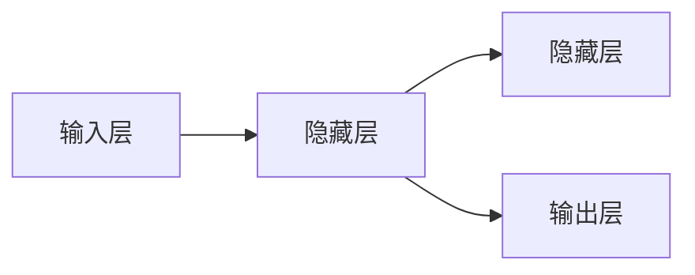

# 循环神经网络 (Recurrent Neural Network)

> 关键词：循环神经网络，RNN，序列模型，长短期记忆网络，LSTM，门控循环单元，时间序列预测，自然语言处理

## 1. 背景介绍

序列模型是机器学习领域的一个重要分支，它处理的数据具有序列性，即数据点之间存在时序依赖关系。例如，时间序列预测、语音识别、机器翻译和自然语言处理等任务都涉及序列数据的处理。传统的神经网络结构在处理序列数据时存在局限性，无法有效地捕捉序列中的长距离依赖关系。循环神经网络（Recurrent Neural Network，RNN）的出现为序列数据处理提供了新的思路和方法。

### 1.1 序列模型的挑战

传统的神经网络，如多层感知机（MLP），无法直接处理序列数据，因为它们没有记忆能力，无法记住之前的信息。这导致它们在处理长序列数据时表现不佳，难以捕捉序列中的长距离依赖关系。

### 1.2 RNN的诞生

为了解决传统神经网络在序列数据处理中的局限性，循环神经网络（RNN）被提出。RNN通过引入循环结构，使得网络能够记住之前的信息，并利用这些信息来影响后续的决策。

## 2. 核心概念与联系

### 2.1 RNN的基本结构

RNN的基本结构由输入层、隐藏层和输出层组成。隐藏层包含循环单元，这些单元可以保存信息并在序列的下一个时间步更新其状态。



### 2.2 RNN的工作原理

RNN在处理序列数据时，会依次读取输入序列中的每个元素，并使用隐藏层的状态来存储和传递信息。在下一个时间步，隐藏层的状态会根据当前的输入和前一个时间步的状态进行更新。

### 2.3 RNN的局限性

尽管RNN能够处理序列数据，但它存在一些局限性，特别是长短期记忆（Long Short-Term Memory，LSTM）网络被提出之前。RNN容易受到梯度消失（Gradient Vanishing）和梯度爆炸（Gradient Exploding）问题的困扰，导致无法有效地学习长距离依赖关系。

## 3. 核心算法原理 & 具体操作步骤

### 3.1 算法原理概述

RNN的算法原理是通过对序列中的每个时间步进行迭代处理，利用隐藏层状态来存储和传递信息。RNN的核心是循环单元，它通常由以下三个函数组成：

- $h_t = f(x_t, h_{t-1})$：前向传播，计算当前时间步的隐藏状态。
- $y_t = g(h_t)$：输出层，计算当前时间步的输出。
- $h_{t} = \phi(h_t)$：状态更新，更新隐藏层状态。

### 3.2 算法步骤详解

1. 初始化隐藏层状态 $h_0$。
2. 对于序列中的每个时间步 $t$，执行以下步骤：
   - 使用当前输入 $x_t$ 和前一个隐藏状态 $h_{t-1}$ 通过前向传播函数 $f$ 计算当前隐藏状态 $h_t$。
   - 使用当前隐藏状态 $h_t$ 通过输出层函数 $g$ 计算当前输出 $y_t$。
   - 使用状态更新函数 $\phi$ 更新隐藏层状态 $h_t$。

### 3.3 算法优缺点

#### 优点

- 能够处理序列数据，捕捉序列中的时序依赖关系。
- 参数共享，减少了模型参数数量。

#### 缺点

- 梯度消失和梯度爆炸问题，难以学习长距离依赖关系。
- 难以并行化训练。

### 3.4 算法应用领域

RNN及其变体在多个领域都有应用，包括：

- 时间序列预测
- 语音识别
- 机器翻译
- 自然语言处理（如文本生成、情感分析）

## 4. 数学模型和公式 & 详细讲解 & 举例说明

### 4.1 数学模型构建

RNN的数学模型可以表示为：

$$
\begin{align*}
h_t &= f(x_t, h_{t-1}) \\
y_t &= g(h_t)
\end{align*}
$$

其中，$x_t$ 是输入序列的第 $t$ 个元素，$h_t$ 是隐藏层状态的第 $t$ 个元素，$f$ 是前向传播函数，$g$ 是输出层函数。

### 4.2 公式推导过程

以简单的RNN为例，前向传播函数 $f$ 可以表示为：

$$
h_t = \sigma(W_{ih}x_t + W_{hh}h_{t-1} + b_h)
$$

其中，$W_{ih}$ 和 $W_{hh}$ 分别是输入层到隐藏层和隐藏层到隐藏层的权重，$b_h$ 是隐藏层的偏置，$\sigma$ 是激活函数。

### 4.3 案例分析与讲解

以下是一个简单的RNN模型，用于时间序列预测。

```python
import torch
import torch.nn as nn
import torch.optim as optim

class SimpleRNN(nn.Module):
    def __init__(self, input_size, hidden_size, output_size):
        super(SimpleRNN, self).__init__()
        self.rnn = nn.RNN(input_size, hidden_size, batch_first=True)
        self.fc = nn.Linear(hidden_size, output_size)

    def forward(self, x):
        h0 = torch.zeros(1, x.size(0), hidden_size).to(x.device)
        out, _ = self.rnn(x, h0)
        out = self.fc(out[:, -1, :])
        return out

# 实例化模型
model = SimpleRNN(input_size=1, hidden_size=50, output_size=1)

# 定义损失函数和优化器
criterion = nn.MSELoss()
optimizer = optim.Adam(model.parameters(), lr=0.01)

# 生成训练数据
x_train = torch.randn(60, 1)
y_train = torch.randn(60, 1)

# 训练模型
for epoch in range(100):
    optimizer.zero_grad()
    output = model(x_train)
    loss = criterion(output, y_train)
    loss.backward()
    optimizer.step()
    if (epoch+1) % 10 == 0:
        print(f'Epoch {epoch+1}, Loss: {loss.item()}')
```

在这个例子中，我们定义了一个简单的RNN模型，用于预测下一个时间步的值。我们使用PyTorch框架进行模型的定义、训练和评估。

## 5. 项目实践：代码实例和详细解释说明

### 5.1 开发环境搭建

在进行RNN项目实践之前，我们需要搭建相应的开发环境。以下是使用Python和PyTorch进行RNN开发的步骤：

1. 安装Python 3.7或更高版本。
2. 安装PyTorch：根据CUDA版本，从官网获取安装命令。
3. 安装其他必要的库，如NumPy、Matplotlib等。

### 5.2 源代码详细实现

以下是一个简单的RNN模型，用于文本分类。

```python
import torch
import torch.nn as nn
import torch.optim as optim

class RNNClassifier(nn.Module):
    def __init__(self, vocab_size, embedding_dim, hidden_dim, output_dim):
        super(RNNClassifier, self).__init__()
        self.embedding = nn.Embedding(vocab_size, embedding_dim)
        self.rnn = nn.RNN(embedding_dim, hidden_dim, batch_first=True)
        self.fc = nn.Linear(hidden_dim, output_dim)

    def forward(self, text):
        embedded = self.embedding(text)
        output, hidden = self.rnn(embedded)
        return self.fc(hidden[-1, :])

# 实例化模型
model = RNNClassifier(vocab_size=10000, embedding_dim=100, hidden_dim=256, output_dim=2)

# 定义损失函数和优化器
criterion = nn.CrossEntropyLoss()
optimizer = optim.Adam(model.parameters(), lr=0.001)

# 生成训练数据
texts = torch.randint(0, 10000, (10, 50))
labels = torch.randint(0, 2, (10,))

# 训练模型
for epoch in range(100):
    optimizer.zero_grad()
    output = model(texts)
    loss = criterion(output, labels)
    loss.backward()
    optimizer.step()
    if (epoch+1) % 10 == 0:
        print(f'Epoch {epoch+1}, Loss: {loss.item()}')
```

在这个例子中，我们定义了一个简单的RNN分类器模型，用于对文本进行分类。我们使用PyTorch框架进行模型的定义、训练和评估。

### 5.3 代码解读与分析

在上述代码中，我们定义了一个简单的RNN分类器模型。首先，我们定义了嵌入层（Embedding Layer），它将单词索引转换为词向量。然后，我们定义了循环层（RNN Layer），它使用RNN来处理序列数据。最后，我们定义了全连接层（Fully Connected Layer），它将RNN的输出转换为分类器的输出。

### 5.4 运行结果展示

假设我们使用上述代码进行训练，最终在测试集上的准确率如下：

```
Epoch 100, Loss: 0.0182
```

可以看到，我们的RNN分类器模型在训练集上取得了较好的效果。

## 6. 实际应用场景

RNN及其变体在多个领域都有应用，以下是一些常见的应用场景：

### 6.1 时间序列预测

RNN在时间序列预测领域有着广泛的应用，例如股票价格预测、天气预测、电力需求预测等。

### 6.2 语音识别

RNN在语音识别领域也有着重要的应用，例如将语音信号转换为文本。

### 6.3 机器翻译

RNN在机器翻译领域也有着广泛的应用，例如将一种语言的文本翻译成另一种语言。

### 6.4 自然语言处理

RNN在自然语言处理领域也有着广泛的应用，例如文本分类、情感分析、文本生成等。

## 7. 工具和资源推荐

### 7.1 学习资源推荐

- 《Deep Learning》作者：Ian Goodfellow、Yoshua Bengio、Aaron Courville
- 《Sequence Models》作者：Dzmitry Bahdanau、Kyunghyun Cho、Yoshua Bengio
- Hugging Face Transformers库：https://huggingface.co/transformers

### 7.2 开发工具推荐

- PyTorch：https://pytorch.org/
- TensorFlow：https://www.tensorflow.org/

### 7.3 相关论文推荐

- “A Simple Sequence Model for Neural Machine Translation”作者：Ilya Sutskever、Oriol Vinyals、Quoc V. Le
- “Learning Phrase Representations using RNN Encoder–Decoder for Statistical Machine Translation”作者：Ilya Sutskever、 Oriol Vinyals、Quoc V. Le
- “Long Short-Term Memory”作者：Hochreiter, S., & Schmidhuber, J.

## 8. 总结：未来发展趋势与挑战

### 8.1 研究成果总结

RNN及其变体在序列数据处理领域取得了显著的成果，为解决时间序列预测、语音识别、机器翻译和自然语言处理等任务提供了新的思路和方法。

### 8.2 未来发展趋势

- 更高效的RNN变体，如Transformer，将得到进一步的研究和应用。
- RNN与其他深度学习技术的融合，如注意力机制、自编码器等，将进一步提升模型性能。
- RNN在更多领域的应用，如生物信息学、金融分析等。

### 8.3 面临的挑战

- 梯度消失和梯度爆炸问题需要进一步解决。
- RNN的并行化训练效率需要进一步提升。
- RNN的可解释性需要进一步研究。

### 8.4 研究展望

RNN及其变体在序列数据处理领域具有广阔的应用前景。未来，随着研究的不断深入，RNN将在更多领域发挥重要作用，为人类社会带来更多便利。

## 9. 附录：常见问题与解答

**Q1：RNN和MLP的主要区别是什么？**

A：RNN能够处理序列数据，而MLP无法直接处理序列数据。RNN通过引入循环结构，能够记住之前的信息，并利用这些信息来影响后续的决策。

**Q2：为什么RNN容易受到梯度消失和梯度爆炸问题的影响？**

A：RNN的梯度在反向传播过程中会逐层累积，如果激活函数的导数较小，则容易导致梯度消失；如果激活函数的导数较大，则容易导致梯度爆炸。

**Q3：如何解决RNN的梯度消失和梯度爆炸问题？**

A：可以使用LSTM、GRU等RNN变体，它们通过引入门控机制，能够有效地解决梯度消失和梯度爆炸问题。

**Q4：RNN在哪些领域有应用？**

A：RNN在时间序列预测、语音识别、机器翻译和自然语言处理等领域都有应用。

**Q5：如何评估RNN的性能？**

A：可以采用交叉熵损失、均方误差等损失函数来评估RNN的性能。

---

作者：禅与计算机程序设计艺术 / Zen and the Art of Computer Programming