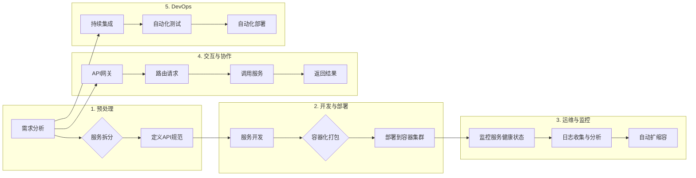

# 微服务架构的设计与实现

> 关键词：微服务，架构设计，服务拆分，分布式系统，容器化，DevOps，API网关，持续集成与持续部署（CI/CD）

## 1. 背景介绍

随着互联网的快速发展，大型软件系统越来越复杂。传统的单体架构在处理高并发、高可用、高扩展性等需求时面临着巨大的挑战。为了应对这些挑战，微服务架构应运而生。微服务架构将应用程序拆分为多个独立的服务，每个服务负责特定的功能，通过轻量级通信机制（如RESTful API）进行交互。

### 1.1 单体架构的局限性

单体架构的特点是将所有功能集中在一个单一的系统中，具有以下局限性：

- **技术栈限制**：整个系统使用相同的技术栈，难以引入新技术。
- **扩展性差**：系统扩展通常依赖于整体架构的升级，难以实现水平扩展。
- **部署难度大**：部署和更新整个系统需要重启，影响用户体验。
- **代码管理复杂**：随着系统规模扩大，代码管理变得困难。

### 1.2 微服务架构的优势

微服务架构具有以下优势：

- **技术栈灵活性**：每个服务可以使用不同的技术栈，更容易引入新技术。
- **扩展性强**：可以独立扩展需要更多资源的特定服务。
- **部署灵活**：服务可以独立部署，无需重启整个系统。
- **代码管理简化**：服务之间界限清晰，代码管理更简单。

## 2. 核心概念与联系

### 2.1 核心概念

- **服务（Service）**：微服务架构中最小的功能单元，通常由一个应用组件组成。
- **服务拆分（Service Decomposition）**：将大型应用拆分为多个独立的服务。
- **通信机制（Communication Mechanism）**：服务之间进行交互的机制，如RESTful API、gRPC等。
- **容器化（Containerization）**：使用容器技术（如Docker）打包服务，实现轻量级部署。
- **DevOps（开发与运维）**：将开发、测试和运维紧密结合，提高软件交付效率。
- **API网关（API Gateway）**：统一接入点，负责路由、协议转换、安全控制等功能。
- **持续集成与持续部署（CI/CD）**：自动化构建、测试和部署流程。

### 2.2 架构原理和架构的 Mermaid 流程图



## 3. 核心算法原理 & 具体操作步骤

### 3.1 算法原理概述

微服务架构的设计与实现涉及多个方面，包括：

- **服务拆分策略**：如何将大型应用拆分为多个独立的服务。
- **服务发现与注册**：服务如何发现其他服务并进行注册。
- **负载均衡**：如何将请求分配到不同的服务实例。
- **服务容错与降级**：如何处理服务故障和资源不足的情况。
- **数据一致性与事务管理**：如何在分布式系统中保证数据的一致性和事务性。

### 3.2 算法步骤详解

以下是微服务架构设计与实现的步骤：

1. **需求分析**：分析业务需求，确定系统功能模块。
2. **服务拆分**：根据业务需求将应用拆分为多个独立的服务。
3. **定义API规范**：定义服务间的通信接口规范，如RESTful API。
4. **服务开发**：使用不同的技术栈开发每个服务。
5. **容器化打包**：使用容器技术（如Docker）打包每个服务。
6. **部署到容器集群**：将容器部署到容器集群（如Kubernetes）中。
7. **服务发现与注册**：实现服务发现与注册机制，使服务能够相互发现和通信。
8. **负载均衡**：实现负载均衡机制，将请求分配到不同的服务实例。
9. **服务容错与降级**：实现服务容错与降级机制，处理服务故障和资源不足的情况。
10. **数据一致性与事务管理**：实现数据一致性与事务管理机制，保证数据的一致性和事务性。
11. **监控与日志**：监控服务健康状态和日志，及时发现和解决问题。
12. **持续集成与持续部署**：实现自动化构建、测试和部署流程。

### 3.3 算法优缺点

**优点**：

- **技术栈灵活**：每个服务可以使用不同的技术栈，更容易引入新技术。
- **扩展性强**：可以独立扩展需要更多资源的特定服务。
- **部署灵活**：服务可以独立部署，无需重启整个系统。
- **代码管理简化**：服务之间界限清晰，代码管理更简单。
- **快速迭代**：服务之间松耦合，更容易实现快速迭代。

**缺点**：

- **架构复杂性**：系统架构更加复杂，需要更多的维护和管理工作。
- **服务治理**：需要实现服务发现、注册、监控、日志等功能。
- **数据一致性**：分布式系统中的数据一致性是一个挑战。
- **分布式事务**：分布式系统中的事务管理是一个挑战。

### 3.4 算法应用领域

微服务架构适用于以下场景：

- **大型企业级应用**：需要高性能、高可用、高扩展性的系统。
- **互联网应用**：需要快速迭代、灵活扩展的系统。
- **多团队协作项目**：需要独立开发、部署和维护的多个服务。
- **异构系统**：需要使用不同技术栈的系统。

## 4. 数学模型和公式 & 详细讲解 & 举例说明

### 4.1 数学模型构建

微服务架构的数学模型主要涉及以下几个方面：

- **服务数量**：$N$ 表示服务的数量。
- **服务实例数量**：$M_i$ 表示第 $i$ 个服务的实例数量。
- **请求量**：$Q$ 表示系统接收的请求量。
- **响应时间**：$T$ 表示系统处理请求的平均响应时间。

### 4.2 公式推导过程

- **服务实例数量**：$M_i = \frac{Q_i}{R_i}$，其中 $Q_i$ 表示第 $i$ 个服务的请求量，$R_i$ 表示第 $i$ 个服务的响应时间。
- **平均响应时间**：$T = \frac{1}{Q} \sum_{i=1}^N R_i$。

### 4.3 案例分析与讲解

假设一个电商系统，包含用户服务、商品服务、订单服务和支付服务四个微服务。每个服务都有5个实例，系统平均每秒接收100个请求。

- **服务实例数量**：$M_1 = M_2 = M_3 = M_4 = \frac{100}{5} = 20$
- **平均响应时间**：$T = \frac{1}{100} \times (20 \times 0.1 + 20 \times 0.2 + 20 \times 0.3 + 20 \times 0.2) = 0.16$ 秒

## 5. 项目实践：代码实例和详细解释说明

### 5.1 开发环境搭建

以下是一个使用Spring Cloud和Docker进行微服务架构实践的项目示例。

1. **创建Spring Boot项目**：使用Spring Initializr创建用户服务、商品服务、订单服务和支付服务四个Spring Boot项目。
2. **添加依赖**：在四个项目中的`pom.xml`文件中添加Spring Cloud和Docker依赖。
3. **编写代码**：实现各个服务的功能，并定义RESTful API。
4. **编写Dockerfile**：为每个服务创建Dockerfile，用于打包和运行Docker容器。
5. **编写docker-compose.yml**：定义各个服务的配置，包括Docker镜像、容器名、端口映射等。

### 5.2 源代码详细实现

以下是一个简单的用户服务Dockerfile示例：

```Dockerfile
FROM openjdk:8-jdk-alpine
VOLUME /tmp
ADD target/user-service.jar /app/user-service.jar
EXPOSE 8080
ENTRYPOINT ["java","-Djava.security.egd=file:/dev/./urandom","-jar","/app/user-service.jar"]
```

### 5.3 代码解读与分析

Dockerfile中的指令含义如下：

- `FROM openjdk:8-jdk-alpine`：使用OpenJDK 8 Alpine Linux作为基础镜像。
- `VOLUME /tmp`：创建一个名为`/tmp`的挂载点。
- `ADD target/user-service.jar /app/user-service.jar`：将编译好的用户服务jar包复制到容器中。
- `EXPOSE 8080`：暴露8080端口。
- `ENTRYPOINT ["java","-Djava.security.egd=file:/dev/./urandom","-jar","/app/user-service.jar"]`：设置容器启动命令，启动用户服务。

### 5.4 运行结果展示

运行`docker-compose up -d`命令启动所有服务，并在浏览器中访问http://localhost:8080/，即可看到用户服务的欢迎界面。

## 6. 实际应用场景

### 6.1 电商系统

电商系统通常包含用户、商品、订单、支付等多个模块，可以使用微服务架构实现。

- **用户服务**：负责用户注册、登录、个人信息管理等。
- **商品服务**：负责商品信息管理、分类、检索等。
- **订单服务**：负责订单创建、修改、支付等。
- **支付服务**：负责处理支付请求、生成支付凭证等。

### 6.2 金融系统

金融系统通常包含账户、交易、风控、合规等多个模块，可以使用微服务架构实现。

- **账户服务**：负责用户账户管理、资金流水等。
- **交易服务**：负责交易订单管理、资金划拨等。
- **风控服务**：负责风险监测、预警等。
- **合规服务**：负责合规审查、报告生成等。

### 6.4 未来应用展望

随着云计算、容器化等技术的发展，微服务架构将在更多领域得到应用。以下是一些未来应用展望：

- **物联网（IoT）**：微服务架构可以应用于物联网设备管理、数据采集与分析等领域。
- **边缘计算**：微服务架构可以应用于边缘计算节点，实现实时数据处理和决策。
- **区块链**：微服务架构可以应用于区块链应用开发，实现去中心化、分布式应用。

## 7. 工具和资源推荐

### 7.1 学习资源推荐

- **《微服务设计》**：Martin Fowlers的经典著作，详细介绍了微服务架构的设计原则和实践。
- **《Spring Cloud微服务实战》**：基于Spring Cloud框架，介绍了微服务架构的实现方法。
- **《微服务架构：设计与实现》**：详细介绍了微服务架构的设计与实现，包括服务拆分、通信机制、服务治理等。

### 7.2 开发工具推荐

- **Spring Cloud**：Spring Cloud是一套基于Spring Boot的微服务框架，提供了服务发现、配置中心、链路跟踪等功能。
- **Docker**：Docker是一种开源的应用容器引擎，可以将应用及其依赖环境打包为容器，实现轻量级部署。
- **Kubernetes**：Kubernetes是一个开源的容器编排平台，用于部署、调度和管理容器化应用程序。

### 7.3 相关论文推荐

- **《Microservices: A Platform for Continuous Deployment》**：介绍了微服务架构的设计原则和实现方法。
- **《Microservice Architecture: Designing fine-grained systems》**：详细介绍了微服务架构的设计与实现。
- **《The Principles of Service Design》**：介绍了服务设计的原则和方法。

## 8. 总结：未来发展趋势与挑战

### 8.1 研究成果总结

微服务架构作为一种新兴的软件架构模式，已经在多个领域得到了广泛应用。通过将大型应用拆分为多个独立的服务，微服务架构提高了系统的可扩展性、可维护性和可复用性。

### 8.2 未来发展趋势

- **服务网格（Service Mesh）**：服务网格提供了一种更加灵活的服务通信方式，可以简化微服务架构的通信管理。
- **函数即服务（Function as a Service, FaaS）**：函数即服务将微服务架构进一步细化为函数，提高了系统的可扩展性和可复用性。
- **云原生技术**：云原生技术将微服务架构与云平台紧密结合，提高了系统的弹性、可扩展性和可移植性。

### 8.3 面临的挑战

- **服务治理**：随着服务数量的增加，服务治理成为一个挑战。
- **数据一致性**：分布式系统中的数据一致性是一个挑战。
- **分布式事务**：分布式系统中的事务管理是一个挑战。
- **安全性与隐私**：微服务架构中的安全性和隐私保护是一个挑战。

### 8.4 研究展望

未来，微服务架构的研究将重点关注以下几个方面：

- **服务治理**：研究更高效的服务治理方法，提高服务管理的自动化程度。
- **数据一致性**：研究分布式系统中的数据一致性解决方案，保证数据的一致性和可靠性。
- **分布式事务**：研究分布式事务管理方法，提高分布式系统的可靠性。
- **安全性与隐私**：研究微服务架构中的安全性和隐私保护方法，确保系统的安全性和用户隐私。

## 9. 附录：常见问题与解答

**Q1：微服务架构与单体架构的区别是什么？**

A1：微服务架构将大型应用拆分为多个独立的服务，每个服务负责特定的功能，通过轻量级通信机制进行交互。而单体架构将所有功能集中在一个单一的系统中，具有统一的技术栈。

**Q2：如何进行服务拆分？**

A2：服务拆分需要考虑业务需求、技术选型、团队协作等因素。一般来说，可以将具有相似功能、低耦合、高内聚的模块拆分为独立的服务。

**Q3：如何保证微服务架构的安全性？**

A3：为了保证微服务架构的安全性，可以采取以下措施：

- 使用OAuth 2.0、JWT等认证机制。
- 实现服务级别的访问控制。
- 对敏感数据进行加密存储和传输。
- 定期进行安全审计和漏洞扫描。

**Q4：微服务架构如何保证数据一致性？**

A4：微服务架构中的数据一致性可以通过以下方式保证：

- 使用分布式数据库，如Apache Cassandra、Amazon DynamoDB等。
- 使用分布式事务框架，如SAGA、Choreography等。
- 使用消息队列，如Apache Kafka、RabbitMQ等，实现异步通信和数据一致性。

**Q5：微服务架构与DevOps的关系是什么？**

A5：DevOps是一种将开发、测试和运维紧密结合的文化和流程。微服务架构与DevOps的关系是相辅相成的，微服务架构为DevOps提供了更好的基础设施和工具，而DevOps则帮助微服务架构更好地落地实施。

作者：禅与计算机程序设计艺术 / Zen and the Art of Computer Programming