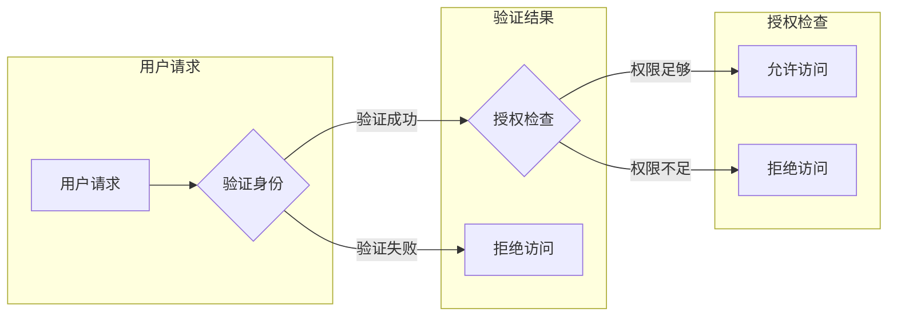

# 授权：遵循最小权限原则

> 关键词：授权，最小权限原则，安全，访问控制，权限管理，身份验证，访问控制策略

## 1. 背景介绍

在信息技术领域，授权是确保系统安全性的关键组成部分。授权涉及到为用户或系统进程分配特定的权限，以控制他们能够访问或执行哪些资源。随着信息系统的复杂性和规模的增长，如何有效地进行授权管理，成为了一个重要的议题。最小权限原则（Principle of Least Privilege，简称POLP）是授权管理中的一个核心概念，它强调授予用户或进程完成其任务所需的最小权限，以降低安全风险。

### 1.1 问题的由来

随着网络攻击手段的不断进化，传统的授权方式已无法满足现代信息系统的安全需求。未经授权的访问和操作可能导致数据泄露、系统崩溃、业务中断等严重后果。因此，遵循最小权限原则，实现细粒度的访问控制，成为保障信息系统安全的关键。

### 1.2 研究现状

在授权领域，研究人员已经提出了多种访问控制模型，如访问控制列表（ACL）、基于角色的访问控制（RBAC）、基于属性的访问控制（ABAC）等。这些模型和策略旨在提供更加灵活和安全的授权方案。然而，如何将最小权限原则融入到这些模型中，并有效地实现，仍是一个挑战。

### 1.3 研究意义

遵循最小权限原则进行授权管理，具有以下重要意义：

- 降低安全风险：通过最小化用户权限，减少未经授权的访问和操作，从而降低安全风险。
- 提高效率：简化授权流程，减少不必要的权限检查，提高系统运行效率。
- 便于管理：实现细粒度的权限控制，便于权限的管理和审计。

### 1.4 本文结构

本文将围绕最小权限原则，探讨授权管理的核心概念、算法原理、实现方法以及实际应用。文章结构如下：

- 第2部分，介绍最小权限原则的核心概念与联系。
- 第3部分，阐述最小权限原则的具体算法原理和操作步骤。
- 第4部分，分析最小权限原则的数学模型和公式，并结合案例进行讲解。
- 第5部分，通过代码实例展示最小权限原则在项目中的应用。
- 第6部分，探讨最小权限原则在实际应用场景中的表现和未来展望。
- 第7部分，推荐相关学习资源、开发工具和论文。
- 第8部分，总结研究成果，展望未来发展趋势与挑战。
- 第9部分，提供常见问题与解答。

## 2. 核心概念与联系

### 2.1 最小权限原则

最小权限原则是指，为用户或进程分配完成其任务所需的最小权限集合，以减少潜在的安全风险。简单来说，就是“只给需要的，不给多余的”。

### 2.2 访问控制模型

访问控制模型是用于管理访问权限的一种框架，常见的模型包括：

- **访问控制列表（ACL）**：基于对象的访问控制，为每个对象定义一组访问权限。
- **基于角色的访问控制（RBAC）**：基于角色的访问控制，将用户分配到不同的角色，每个角色对应一组权限。
- **基于属性的访问控制（ABAC）**：基于属性的访问控制，根据用户的属性和资源的属性来决定访问权限。

### 2.3 Mermaid 流程图

以下是最小权限原则的Mermaid流程图：



## 3. 核心算法原理 & 具体操作步骤

### 3.1 算法原理概述

最小权限原则的核心算法原理是，根据用户的角色、任务和资源属性，动态地分配和调整权限。具体步骤如下：

1. 收集用户角色、任务和资源属性信息。
2. 分析用户任务所需的权限。
3. 根据最小权限原则，为用户分配所需的权限集合。
4. 实现权限检查机制，确保用户只能访问和执行被授权的操作。

### 3.2 算法步骤详解

1. **收集信息**：收集用户的角色、任务和资源属性信息。例如，用户的角色可以是“管理员”、“普通用户”等，任务可以是“读取文件”、“写入文件”等，资源属性可以是“文件类型”、“文件大小”等。
2. **分析任务**：分析用户任务所需的权限。例如，如果用户需要读取文件，则需要读取权限。
3. **分配权限**：根据最小权限原则，为用户分配所需的权限集合。例如，如果用户需要读取文件，则只分配读取权限，不分配写入权限。
4. **权限检查**：实现权限检查机制，确保用户只能访问和执行被授权的操作。例如，在用户尝试访问文件时，系统会检查用户是否有读取权限。

### 3.3 算法优缺点

**优点**：

- **降低安全风险**：通过最小化用户权限，减少潜在的安全风险。
- **提高效率**：简化授权流程，减少不必要的权限检查，提高系统运行效率。
- **便于管理**：实现细粒度的权限控制，便于权限的管理和审计。

**缺点**：

- **管理复杂**：需要收集和更新大量的用户、角色、任务和资源属性信息。
- **实施困难**：需要开发复杂的权限检查机制。

### 3.4 算法应用领域

最小权限原则在以下领域有广泛的应用：

- **操作系统**：用于控制文件、目录和设备的访问权限。
- **数据库**：用于控制用户对数据库表的访问权限。
- **网络**：用于控制用户对网络的访问权限。
- **应用系统**：用于控制用户对应用系统的访问权限。

## 4. 数学模型和公式 & 详细讲解 & 举例说明

### 4.1 数学模型构建

最小权限原则的数学模型可以表示为：

$$
\text{授权集} = \text{任务权限} \cap \text{最小权限集}
$$

其中，任务权限是用户完成特定任务所需的权限集合，最小权限集是用户在系统中能够获得的最小权限集合。

### 4.2 公式推导过程

假设用户 $U$ 有角色 $R$，角色 $R$ 对资源 $R$ 的访问权限为 $P(R)$，则用户 $U$ 对资源 $R$ 的访问权限为：

$$
P(U, R) = \text{任务权限}(U) \cap \text{角色权限}(R)
$$

其中，任务权限是用户完成特定任务所需的权限集合，角色权限是角色对资源拥有的权限集合。

根据最小权限原则，用户 $U$ 对资源 $R$ 的访问权限应等于其在系统中的最小权限集，即：

$$
P(U, R) = \text{最小权限集}(U)
$$

### 4.3 案例分析与讲解

假设有一个文件管理系统，系统中有两种角色：管理员和普通用户。管理员有读取、写入和删除文件的权限，而普通用户只有读取文件的权限。

现在，一个用户 $U$ 需要访问文件 $R$。根据最小权限原则，我们需要为用户 $U$ 分配最小权限集。

- **任务权限**：用户 $U$ 需要读取文件 $R$，因此任务权限为“读取”。
- **角色权限**：用户 $U$ 的角色是普通用户，因此角色权限为“读取”。
- **最小权限集**：根据最小权限原则，用户 $U$ 的最小权限集为“读取”。

因此，用户 $U$ 对文件 $R$ 的访问权限为“读取”。

## 5. 项目实践：代码实例和详细解释说明

### 5.1 开发环境搭建

本例使用Python语言和Python的内置库实现最小权限原则的授权机制。

```bash
pip install Flask
```

### 5.2 源代码详细实现

以下是一个简单的基于最小权限原则的授权代码示例：

```python
from flask import Flask, request, jsonify

app = Flask(__name__)

# 用户角色和权限
ROLES = {
    'admin': ['read', 'write', 'delete'],
    'user': ['read']
}

# 资源和权限
RESOURCE_PERMISSIONS = {
    'file1': ['read', 'write'],
    'file2': ['read']
}

@app.route('/access', methods=['POST'])
def access():
    user = request.json['user']
    resource = request.json['resource']
    action = request.json['action']

    # 获取用户角色和权限
    role_permissions = ROLES.get(user, [])
    resource_permissions = RESOURCE_PERMISSIONS.get(resource, [])

    # 检查用户是否有执行操作的权限
    if action in role_permissions and action in resource_permissions:
        return jsonify({'status': 'allowed'})
    else:
        return jsonify({'status': 'denied'})

if __name__ == '__main__':
    app.run(debug=True)
```

### 5.3 代码解读与分析

- 用户通过HTTP POST请求发送授权请求，包含用户名、资源和操作类型。
- 服务器根据用户名获取用户角色和权限，根据资源获取资源权限。
- 检查用户是否有执行操作的权限。如果有，则返回“allowed”，否则返回“denied”。

### 5.4 运行结果展示

假设用户名为"user"的请求读取文件"file1"：

```bash
curl -X POST -H "Content-Type: application/json" -d '{"user": "user", "resource": "file1", "action": "read"}' http://localhost:5000/access
```

返回结果：

```json
{"status": "allowed"}
```

## 6. 实际应用场景

最小权限原则在以下实际应用场景中具有重要价值：

- **操作系统**：用于控制文件、目录和设备的访问权限。
- **数据库**：用于控制用户对数据库表的访问权限。
- **网络**：用于控制用户对网络的访问权限。
- **应用系统**：用于控制用户对应用系统的访问权限。

### 6.4 未来应用展望

随着信息系统的不断发展和安全形势的变化，最小权限原则在未来将发挥更加重要的作用。以下是一些未来的应用展望：

- **自动化权限管理**：利用人工智能技术，实现自动化权限管理，提高授权效率。
- **动态权限调整**：根据用户的行为和资源属性，动态调整用户权限。
- **跨域访问控制**：实现跨域访问控制，保护跨域资源的安全。

## 7. 工具和资源推荐

### 7.1 学习资源推荐

- **书籍**：
  - 《计算机安全基础》
  - 《网络安全技术与应用》
  - 《操作系统安全》
- **在线课程**：
  - Coursera的《网络安全》课程
  - edX的《计算机安全与隐私》课程
  - Udemy的《Python编程：网络安全与渗透测试》课程

### 7.2 开发工具推荐

- **编程语言**：
  - Python
  - Java
  - C/C++
- **开发框架**：
  - Flask
  - Django
  - Spring Security

### 7.3 相关论文推荐

- **《最小权限原则》**
- **《基于角色的访问控制》**
- **《基于属性的访问控制》**

## 8. 总结：未来发展趋势与挑战

### 8.1 研究成果总结

本文对最小权限原则进行了深入的探讨，包括核心概念、算法原理、实现方法和实际应用。通过实例演示，展示了最小权限原则在项目中的应用，并分析了其在实际应用场景中的价值和挑战。

### 8.2 未来发展趋势

随着信息技术的不断发展，最小权限原则在未来将呈现以下发展趋势：

- **智能化**：利用人工智能技术，实现自动化权限管理，提高授权效率。
- **动态化**：根据用户的行为和资源属性，动态调整用户权限。
- **多样化**：适应不同领域和场景，提供更加灵活的授权方案。

### 8.3 面临的挑战

最小权限原则在实施过程中面临着以下挑战：

- **复杂性**：授权管理涉及到大量的用户、角色、任务和资源，管理复杂。
- **灵活性**：如何实现灵活的权限管理，满足不同场景的需求。
- **可扩展性**：如何保证授权机制的可扩展性，适应不断变化的业务需求。

### 8.4 研究展望

为了应对上述挑战，未来的研究需要在以下方面展开：

- **简化授权管理**：研究更加简洁的授权管理方案，降低管理复杂度。
- **提高授权灵活性**：研究更加灵活的授权机制，满足不同场景的需求。
- **增强授权可扩展性**：研究可扩展的授权机制，适应不断变化的业务需求。

通过不断的研究和创新，最小权限原则将在保障信息系统安全方面发挥更加重要的作用。

## 9. 附录：常见问题与解答

**Q1：最小权限原则是否会导致效率低下？**

A：遵循最小权限原则确实需要一定的管理成本，但通过合理的权限管理和自动化工具，可以有效地降低管理成本，同时提高系统运行效率。

**Q2：最小权限原则是否适用于所有组织？**

A：最小权限原则适用于大多数组织，特别是对安全性要求较高的组织。

**Q3：如何实施最小权限原则？**

A：实施最小权限原则需要以下步骤：
1. 收集用户、角色、任务和资源信息。
2. 分析用户任务所需的权限。
3. 根据最小权限原则，为用户分配所需的权限集合。
4. 实现权限检查机制，确保用户只能访问和执行被授权的操作。

**Q4：如何评估最小权限原则的有效性？**

A：可以通过以下方法评估最小权限原则的有效性：
1. 定期进行安全审计。
2. 监控安全事件。
3. 评估系统性能。

**Q5：最小权限原则与其他安全原则有何关联？**

A：最小权限原则与其他安全原则，如最小化信任原则、最小化暴露原则等，共同构成了信息安全的基本原则。这些原则相互补充，共同保障信息系统的安全。