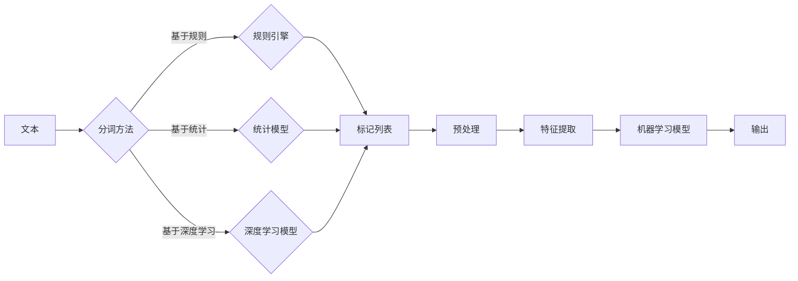

# 文字语言的Token化过程

> 关键词：Tokenization, 自然语言处理, 分词, 文本分析, 机器学习, 预处理, 特征提取

## 1. 背景介绍

在自然语言处理（Natural Language Processing, NLP）领域，文本的Tokenization（分词）是一个基础且关键的过程。它将连续的文本流分割成有意义的单元，即Token，以便于后续的文本分析、机器学习等操作。Tokenization的效率和准确性直接影响到整个NLP任务的质量。

### 1.1 问题的由来

随着互联网的普及和大数据时代的到来，文本数据呈爆炸式增长。如何高效、准确地处理这些文本数据，成为NLP领域亟待解决的问题。分词技术作为文本处理的第一步，其重要性不言而喻。

### 1.2 研究现状

目前，分词技术已经发展出多种方法，包括基于规则的方法、基于统计的方法和基于深度学习的方法。每种方法都有其优缺点，适用于不同的场景。

### 1.3 研究意义

分词技术的优化对于提高NLP任务的准确性和效率具有重要意义。它可以减少噪声，突出文本的语义结构，为后续的文本分析提供更好的数据基础。

### 1.4 本文结构

本文将首先介绍分词的基本概念，然后详细讲解不同分词方法的原理和步骤，接着分析分词技术的应用领域，最后展望分词技术的发展趋势和挑战。

## 2. 核心概念与联系

### 2.1 核心概念

- **Token（标记）**：文本中具有独立意义的单元，可以是单词、字符、符号等。
- **Tokenization（分词）**：将连续的文本分割成标记的过程。
- **Preprocessing（预处理）**：在文本分析之前，对文本进行清洗、标准化等操作。
- **Feature Extraction（特征提取）**：从文本中提取有用信息，用于机器学习模型。

### 2.2 核心概念原理和架构的 Mermaid 流程图



### 2.3 核心概念联系

分词是文本处理的基础，是预处理和特征提取的前提。预处理包括文本清洗、标准化等操作，特征提取则将标记列表转换为机器学习模型所需的特征。最终，这些特征输入到机器学习模型中，得到输出结果。

## 3. 核心算法原理 & 具体操作步骤

### 3.1 算法原理概述

分词算法主要分为以下三类：

- **基于规则的分词**：根据预先定义的规则进行分词，如正向最大匹配、逆向最大匹配等。
- **基于统计的分词**：利用统计信息进行分词，如基于N-gram、基于聚类等。
- **基于深度学习的分词**：利用神经网络进行分词，如基于RNN的模型、基于Transformer的模型等。

### 3.2 算法步骤详解

#### 基于规则的分词

1. 预先定义分词规则，如词性标注规则、成语规则等。
2. 读取文本，逐字符扫描。
3. 根据规则，将连续字符分割成标记。
4. 重复步骤2和3，直至文本结束。

#### 基于统计的分词

1. 收集大量已标注文本，统计词频、共现等信息。
2. 利用N-gram模型、聚类算法等统计方法，将文本分割成标记。
3. 对分割出的标记进行排序，提高分词质量。

#### 基于深度学习的分词

1. 收集大量已标注文本，用于训练深度学习模型。
2. 设计神经网络结构，如RNN、Transformer等。
3. 使用标注数据训练模型，直至模型收敛。
4. 使用训练好的模型对文本进行分词。

### 3.3 算法优缺点

#### 基于规则的分词

- **优点**：速度快，易于实现。
- **缺点**：规则难以覆盖所有情况，易出错。

#### 基于统计的分词

- **优点**：可以自动学习分词规则，适应性强。
- **缺点**：对噪声敏感，需要大量标注数据。

#### 基于深度学习的分词

- **优点**：准确率高，适应性强。
- **缺点**：需要大量标注数据，训练时间较长。

### 3.4 算法应用领域

分词技术在NLP的各个领域都有广泛应用，如：

- 文本分类
- 情感分析
- 机器翻译
- 命名实体识别
- 文本摘要

## 4. 数学模型和公式 & 详细讲解 & 举例说明

### 4.1 数学模型构建

#### 基于统计的分词

使用N-gram模型进行分词的数学模型如下：

$$
P(w_n | w_{n-2}, w_{n-1}) = \frac{P(w_{n-2}, w_{n-1}, w_n)}{P(w_{n-2}, w_{n-1})}
$$

其中，$w_n$ 表示第n个单词，$w_{n-2}, w_{n-1}$ 分别表示前两个单词，$P$ 表示概率。

### 4.2 公式推导过程

N-gram模型的概率计算可以通过以下步骤推导：

1. 计算所有可能的N-gram序列的概率。
2. 对于每个N-gram序列，计算其前一个N-1-gram的概率。
3. 根据上述两步计算结果，计算N-gram的概率。

### 4.3 案例分析与讲解

假设有一个简单的N-gram模型，其训练数据如下：

```
(我，是，一个，程序员)
(程序员，在，写，代码)
(代码，可以，让，机器，学习)
```

根据以上数据，计算 "我，是" 的概率：

$$
P(我，是) = \frac{P(我，是，一个，程序员)}{P(我，是)}
$$

其中，$P(我，是，一个，程序员) = \frac{1}{3}$，$P(我，是) = \frac{2}{3}$。

因此，$P(我，是) = \frac{1/3}{2/3} = \frac{1}{2}$。

## 5. 项目实践：代码实例和详细解释说明

### 5.1 开发环境搭建

1. 安装Python环境。
2. 安装NLP相关的库，如jieba、NLTK等。

### 5.2 源代码详细实现

以下是一个使用jieba库进行中文分词的Python代码实例：

```python
import jieba

text = "我是一个程序员，在写代码。"
tokens = jieba.cut(text)
print("/ ".join(tokens))
```

### 5.3 代码解读与分析

- `jieba.cut` 是jieba库提供的分词函数，它接收一个字符串作为输入，并返回一个标记列表。
- `/ ` 是jieba库默认的分词结果分隔符。

### 5.4 运行结果展示

```
我 / 是 / 一 / 个 / 程序员 / 在 / 写 / 代码 /
```

## 6. 实际应用场景

分词技术在NLP的各个领域都有广泛应用，以下列举几个例子：

### 6.1 文本分类

在文本分类任务中，分词后的文本可以作为特征输入到分类器中，例如SVM、朴素贝叶斯等。

### 6.2 情感分析

在情感分析任务中，分词后的文本可以用于统计正面、负面词的数量，从而判断文本的情感倾向。

### 6.3 机器翻译

在机器翻译任务中，分词后的文本可以用于统计翻译概率，从而生成更准确的翻译结果。

### 6.4 命名实体识别

在命名实体识别任务中，分词后的文本可以用于识别人名、地点、组织机构等实体。

### 6.5 文本摘要

在文本摘要任务中，分词后的文本可以用于提取关键信息，从而生成摘要。

## 7. 工具和资源推荐

### 7.1 学习资源推荐

- 《自然语言处理综合教程》
- 《统计学习方法》
- 《深度学习》

### 7.2 开发工具推荐

- jieba：一个流行的中文分词库。
- NLTK：一个开源的自然语言处理库。
- spaCy：一个高性能的NLP库。

### 7.3 相关论文推荐

-《A Comparison of Several Statistical Chinese Segmenters》
-《Joint Model of Chinese Word Segmentation and Part-of-Speech Tagging》
-《A Neural Network Based Approach to Chinese Word Segmentation》

## 8. 总结：未来发展趋势与挑战

### 8.1 研究成果总结

分词技术在NLP领域扮演着重要的角色。本文介绍了分词的基本概念、不同分词方法的原理和步骤，以及分词技术的应用领域。随着NLP技术的发展，分词技术也在不断进步。

### 8.2 未来发展趋势

- **深度学习模型在分词中的应用**：深度学习模型在NLP领域的广泛应用，使得深度学习方法在分词任务中取得了显著成果。未来，深度学习模型将在分词领域发挥更大的作用。
- **跨语言分词**：随着全球化的发展，跨语言分词技术越来越重要。未来，将会有更多针对不同语言的分词模型出现。
- **分词与语义理解结合**：分词是语义理解的基础，未来分词技术将更加注重与语义理解的结合，以提高NLP任务的整体性能。

### 8.3 面临的挑战

- **大规模文本数据**：随着文本数据的不断增长，如何高效地处理大规模文本数据成为分词技术的一个挑战。
- **多语言支持**：支持多种语言的分词模型需要考虑不同语言的语法和语义特点，这给分词技术带来了新的挑战。
- **可解释性**：分词模型的可解释性较差，如何提高分词模型的可解释性是一个亟待解决的问题。

### 8.4 研究展望

分词技术是NLP领域的基础技术，未来将在以下方面得到进一步发展：

- **模型轻量化**：开发轻量级的分词模型，以适应移动设备和嵌入式设备的需求。
- **多模态分词**：将文本与其他模态信息结合，实现更全面的分词效果。
- **跨领域分词**：开发通用的分词模型，以适应不同领域的分词需求。

## 9. 附录：常见问题与解答

**Q1：分词与切词有什么区别？**

A：分词和切词是同义词，都指将文本分割成标记的过程。

**Q2：基于规则的分词和基于统计的分词有什么区别？**

A：基于规则的分词依赖于预先定义的规则，而基于统计的分词依赖于统计信息。

**Q3：基于深度学习的分词模型有哪些优点？**

A：基于深度学习的分词模型可以自动学习分词规则，适应性强，准确率高。

**Q4：如何选择合适的分词方法？**

A：选择合适的分词方法需要考虑任务类型、数据规模、计算资源等因素。

**Q5：分词技术在哪些领域有应用？**

A：分词技术在文本分类、情感分析、机器翻译、命名实体识别、文本摘要等领域都有广泛应用。

---

作者：禅与计算机程序设计艺术 / Zen and the Art of Computer Programming