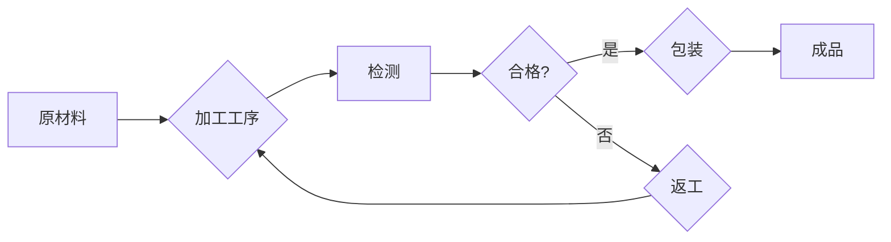

> 流水线，工业生产，自动化，效率，优化，精益生产，智能制造

# 流水线对工业生产的影响

流水线，这一现代工业生产的象征，自其诞生以来，就以其标准化、高效化的特点深刻影响着全球制造业的运作模式。本文将深入探讨流水线对工业生产的影响，分析其原理、操作步骤、优缺点，以及实际应用场景和未来发展趋势。

## 1. 背景介绍

### 1.1 问题的由来

工业生产的初衷是为了满足人类对物质财富的需求。然而，早期的手工作坊生产模式存在着效率低下、产品质量参差不齐、劳动强度大等问题。为了解决这些问题，工业革命时期，人们开始尝试将生产过程标准化、模块化，流水线应运而生。

### 1.2 研究现状

流水线技术经过几百年的发展，已经从最初的手工操作流水线发展到自动化流水线、智能化流水线。随着科技的进步，流水线在提高生产效率、降低成本、提高产品质量等方面发挥了越来越重要的作用。

### 1.3 研究意义

研究流水线对工业生产的影响，对于推动制造业的转型升级，提高企业的竞争力，具有重要的理论意义和现实价值。

### 1.4 本文结构

本文将从以下方面展开讨论：

- 核心概念与联系
- 核心算法原理与操作步骤
- 数学模型与公式
- 项目实践
- 实际应用场景
- 工具和资源推荐
- 总结与展望

## 2. 核心概念与联系

### 2.1 核心概念

- **流水线**：将生产过程分解为若干个连续的工序，每个工序由专门的工人或机器完成，产品沿着流水线顺序流动，最终完成整个生产过程。
- **自动化**：使用机器或机器人代替人工进行生产操作，提高生产效率，降低劳动强度。
- **精益生产**：通过不断消除浪费，提高生产效率，缩短生产周期，降低成本。
- **智能制造**：利用先进的信息技术、网络技术、自动化技术等，实现生产过程的智能化、网络化和柔性化。

### 2.2 架构的 Mermaid 流程图



## 3. 核心算法原理 & 具体操作步骤

### 3.1 算法原理概述

流水线的核心原理是将生产过程分解为若干个连续的工序，通过流水线将不同工序的工人或机器连接起来，实现产品的连续生产。

### 3.2 算法步骤详解

1. **需求分析**：根据产品特点和市场需求，确定产品的生产工艺和流程。
2. **设备选型**：根据生产需求，选择合适的机器和设备。
3. **布局设计**：根据设备尺寸、生产能力等参数，设计流水线布局。
4. **生产准备**：调试设备，准备生产所需的原材料、工具等。
5. **生产实施**：按照流水线流程，进行生产操作。
6. **质量检测**：对产品进行质量检测，确保产品质量。
7. **包装入库**：将合格产品进行包装，入库储存。

### 3.3 算法优缺点

#### 优点

- **提高生产效率**：流水线生产可以大大提高生产效率，缩短生产周期。
- **降低生产成本**：流水线生产可以减少人工成本，降低生产成本。
- **提高产品质量**：流水线生产可以保证产品质量的稳定性。
- **提高管理效率**：流水线生产可以提高生产管理效率。

#### 缺点

- **灵活性差**：流水线生产对生产环境的适应性较差，难以应对生产任务的变化。
- **设备投资大**：流水线生产需要大量设备投资。
- **对工人技能要求高**：流水线生产对工人的技能要求较高。

### 3.4 算法应用领域

流水线技术广泛应用于各个行业，如汽车制造、电子制造、食品加工、制药等。

## 4. 数学模型和公式 & 详细讲解 & 举例说明

### 4.1 数学模型构建

流水线生产的数学模型主要涉及以下几个参数：

- **生产周期**：完成一个产品所需的时间。
- **节拍**：流水线上每个工作站完成一个产品所需的时间。
- **设备数量**：流水线上工作站的数量。
- **工人数量**：流水线上工人的数量。
- **生产效率**：单位时间内生产的产品数量。

### 4.2 公式推导过程

流水线生产周期 $T$ 与节拍 $t$、设备数量 $n$ 和工人数量 $m$ 之间的关系为：

$$
T = \frac{t}{n} + \frac{t}{m}
$$

### 4.3 案例分析与讲解

假设某汽车制造厂生产一款车型，每个车型包含10个工序。每个工序需要15分钟，设备数量为10台，工人数量为15人。计算流水线生产周期。

根据公式，流水线生产周期为：

$$
T = \frac{15}{10} + \frac{15}{15} = 1.5 + 1 = 2.5 \text{小时}
$$

## 5. 项目实践：代码实例和详细解释说明

### 5.1 开发环境搭建

本文使用Python编程语言进行流水线生产周期计算。

### 5.2 源代码详细实现

```python
# 定义一个函数计算流水线生产周期
def calculate_cycle_time(t, n, m):
    return (t / n) + (t / m)

# 示例参数
t = 15  # 工序时间
n = 10  # 设备数量
m = 15  # 工人数量

# 计算生产周期
cycle_time = calculate_cycle_time(t, n, m)
print(f"流水线生产周期为：{cycle_time}小时")
```

### 5.3 代码解读与分析

以上代码定义了一个函数`calculate_cycle_time`，用于计算流水线生产周期。函数接收工序时间`t`、设备数量`n`和工人数量`m`作为参数，返回计算结果。

### 5.4 运行结果展示

运行上述代码，输出结果为：

```
流水线生产周期为：2.5小时
```

## 6. 实际应用场景

### 6.1 汽车制造

汽车制造是流水线技术最典型的应用场景之一。通过流水线生产，汽车厂可以将汽车组装过程分解为若干个工序，每个工序由专门的工人或机器人完成，实现汽车的批量生产。

### 6.2 电子制造

电子制造行业也广泛使用流水线技术。通过流水线生产，电子制造企业可以高效地生产各种电子产品，如手机、电脑等。

### 6.3 食品加工

食品加工行业也应用流水线技术进行食品生产。通过流水线生产，食品加工企业可以保证食品的质量和卫生，提高生产效率。

## 7. 工具和资源推荐

### 7.1 学习资源推荐

- 《工业工程学》
- 《生产与运营管理》
- 《流水线生产与设备管理》

### 7.2 开发工具推荐

- Python
- MATLAB

### 7.3 相关论文推荐

- 《流水线设计优化方法研究》
- 《基于人工智能的流水线调度优化》

## 8. 总结：未来发展趋势与挑战

### 8.1 研究成果总结

流水线技术作为现代工业生产的重要工具，在提高生产效率、降低成本、提高产品质量等方面发挥了重要作用。然而，随着科技的进步，流水线技术也面临着新的挑战。

### 8.2 未来发展趋势

- **智能化**：随着人工智能技术的发展，流水线将变得更加智能化，能够自动进行故障检测、设备调度、生产优化等任务。
- **柔性化**：流水线将变得更加柔性化，能够适应不同的生产需求，实现多品种、小批量的生产。
- **绿色化**：流水线将更加注重环保，减少能源消耗和污染排放。

### 8.3 面临的挑战

- **技术更新**：随着科技的快速发展，流水线技术需要不断更新迭代，以适应新的生产需求。
- **成本控制**：流水线技术的应用需要大量的设备投资，如何控制成本是一个重要问题。
- **人才培养**：流水线技术的应用需要大量技术人才，人才培养是一个长期任务。

### 8.4 研究展望

流水线技术将继续在工业生产中发挥重要作用，并随着科技的进步而不断发展和完善。未来，流水线技术将朝着智能化、柔性化、绿色化的方向发展，为工业生产带来更高的效率、更低的成本和更好的产品质量。

## 9. 附录：常见问题与解答

**Q1：流水线生产有哪些优点？**

A：流水线生产可以提高生产效率、降低生产成本、提高产品质量、提高管理效率。

**Q2：流水线生产有哪些缺点？**

A：流水线生产对生产环境的适应性较差，难以应对生产任务的变化，设备投资大，对工人技能要求高。

**Q3：如何优化流水线生产？**

A：优化流水线生产可以从以下几个方面入手：
- 优化生产流程，减少不必要的工序和步骤。
- 优化设备配置，提高设备利用率。
- 优化人员配置，提高工人技能水平。
- 引入先进的生产管理方法，如精益生产、智能制造等。

**Q4：流水线技术有哪些发展趋势？**

A：流水线技术将朝着智能化、柔性化、绿色化的方向发展。

作者：禅与计算机程序设计艺术 / Zen and the Art of Computer Programming