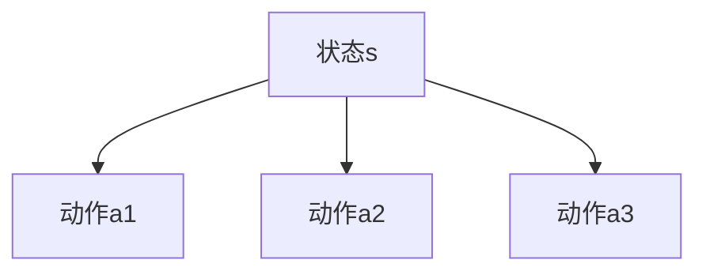
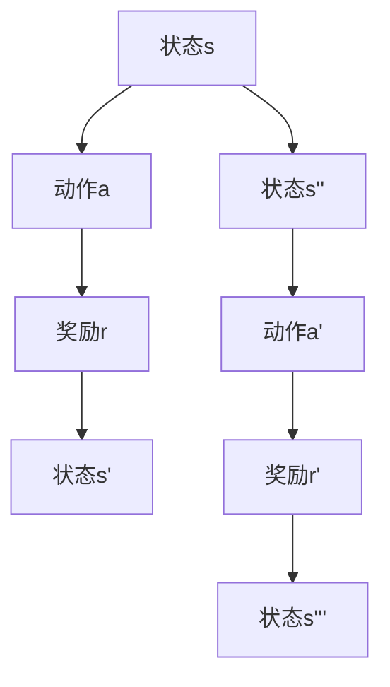
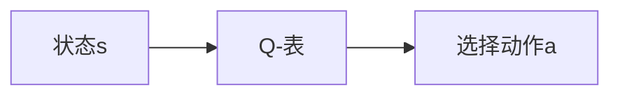
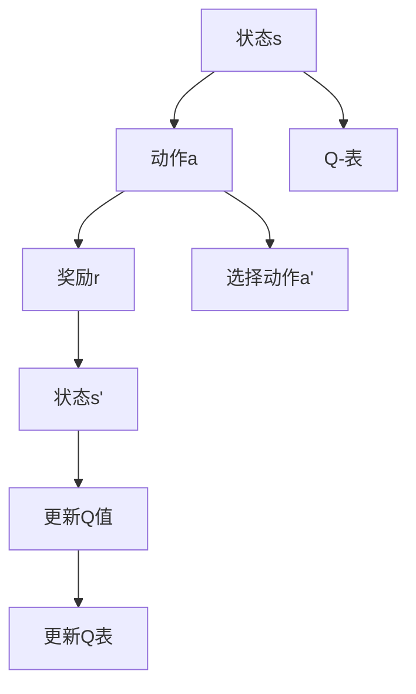

                 

# Q-学习(Q-Learning) - 原理与代码实例讲解

> 关键词：Q-学习, 强化学习, 奖励函数, 策略评估, 策略改进, Q-表, 动量, 探索与利用

## 1. 背景介绍

### 1.1 问题由来
在人工智能领域，强化学习（Reinforcement Learning, RL）是指让智能体通过与环境交互，逐步学习并优化其行为策略，以最大化某种评价指标（通常称为奖励函数）的过程。其中，Q-学习（Q-Learning）是一种基于值函数逼近的强化学习算法，通过构建Q-表（Q-Table）来指导智能体的行动，已经广泛应用于游戏、机器人控制、路径规划等领域。

Q-学习的核心思想是：假设存在一个状态-动作值函数Q，使得智能体在状态s下采取动作a，得到的长期累积奖励期望值为Q(s,a)。Q-学习算法通过不断更新Q值，寻找能够最大化长期奖励的策略。

### 1.2 问题核心关键点
Q-学习算法的关键在于：
1. 如何定义状态-动作值函数Q(s,a)。
2. 如何根据观察到的状态s，选择当前动作a。
3. 如何通过观察到的奖励r和后续状态s'，更新Q(s,a)。

本文将重点讲解Q-学习算法的原理与实现步骤，并通过代码实例进一步深入理解其工作机制。

## 2. 核心概念与联系

### 2.1 核心概念概述

为更好地理解Q-学习算法，本节将介绍几个密切相关的核心概念：

- 状态（State）：环境中的每个独立状态，智能体在此状态中可以采取行动。
- 动作（Action）：智能体在给定状态下可以采取的行动。
- 奖励（Reward）：智能体采取行动后，环境给予的反馈。
- Q-值（Q-value）：状态-动作值函数Q(s,a)，表示在状态s下采取动作a的长期累积奖励期望值。
- Q-表（Q-Table）：一个表格，用于记录每个状态-动作对的Q值。
- 探索（Exploration）：智能体在不确定动作效果的情况下，随机选择动作进行尝试。
- 利用（Exploitation）：智能体基于当前Q-表，选择最优动作进行执行。

这些核心概念之间的逻辑关系可以通过以下Mermaid流程图来展示：

```mermaid
graph TB
    A[状态s] --> B[动作a]
    B --> C[奖励r]
    A --> D[状态s']
    D --> E[Q(s,a)]
    E --> F[选择下一动作]
    F --> G[更新Q值]
```

这个流程图展示了这个基本框架下，智能体从状态到行动的决策路径，包括奖励的反馈和Q值的更新过程。

### 2.2 概念间的关系

这些核心概念之间存在着紧密的联系，形成了Q-学习算法的完整生态系统。下面我通过几个Mermaid流程图来展示这些概念之间的关系。

#### 2.2.1 状态与动作的关联



这个流程图展示了同一状态下可能采取的不同动作，每个动作可能导致不同的后续状态和奖励。

#### 2.2.2 状态-动作-奖励的循环



这个流程图展示了状态-动作-奖励循环的基本形式，即智能体采取动作后，环境给予奖励并转移到下一个状态，然后智能体根据新的状态选择动作，再次循环。

#### 2.2.3 Q-表与策略的选择



这个流程图展示了智能体根据当前状态s和Q-表中的Q值，选择最优动作a的过程。

### 2.3 核心概念的整体架构

最后，我们用一个综合的流程图来展示这些核心概念在大致的状态-动作-奖励循环中的互动：



这个综合流程图展示了Q-学习算法的基本流程：智能体在当前状态下采取动作，获得奖励并转移到下一个状态，根据Q-表选择下一动作，并更新Q值。

## 3. 核心算法原理 & 具体操作步骤
### 3.1 算法原理概述

Q-学习算法的核心在于构建一个状态-动作值函数Q，使得智能体在每个状态下，能够选择最优动作以最大化长期累积奖励。算法通过不断迭代，更新Q值，直至收敛于最优解。

假设智能体处于状态s，可以采取动作a，环境给予奖励r并转移到状态s'。Q-学习算法通过以下公式更新Q(s,a)的值：

$$
Q(s,a) \leftarrow Q(s,a) + \alpha(r + \gamma \max Q(s',a') - Q(s,a))
$$

其中，$\alpha$为学习率，$\gamma$为折扣因子，$max Q(s',a')$表示在状态s'下，智能体能够采取的所有动作中，Q值最大的那个动作的Q值。

该公式的含义是：当前状态s下采取动作a，得到的即时奖励为r，加上未来在状态s'下采取最优动作a'的长期奖励期望值$\gamma \max Q(s',a')$，减去当前动作a的Q值Q(s,a)，再乘以学习率$\alpha$，作为Q(s,a)的更新值。

### 3.2 算法步骤详解

Q-学习算法的具体步骤通常包括以下几个关键步骤：

1. **初始化**：
   - 初始化Q-表，Q(s,a)设置为0。
   - 初始化学习率$\alpha$和折扣因子$\gamma$。

2. **探索与利用**：
   - 在每个状态下，根据Q-表选择一个动作a，并进行探索（随机选择动作）与利用（选择Q值最大的动作）之间的平衡。

3. **执行与反馈**：
   - 执行选择好的动作a，观察环境并获取奖励r。
   - 转移到一个新的状态s'。

4. **Q值更新**：
   - 根据当前状态s、执行的动作a、获得的奖励r和新的状态s'，使用Q-学习公式更新Q(s,a)。
   - 若新状态s'是终止状态（即无法继续转移），则直接更新Q(s,a)，不再进行后续的Q值更新。

5. **迭代更新**：
   - 重复上述步骤，直至达到预设的迭代次数或满足收敛条件。

### 3.3 算法优缺点

Q-学习的优点包括：
- 适用于连续状态空间和动作空间，易于实现和调试。
- 不需要环境模型，适用于复杂环境。
- 能够处理动态环境，适应性较强。

同时，Q-学习也存在一些缺点：
- 初始Q-值可能远离最优值，导致收敛速度较慢。
- 需要大量的经验数据来保证收敛。
- 在处理高维状态和动作空间时，Q-表可能过于庞大，难以存储和更新。

### 3.4 算法应用领域

Q-学习算法已经在多个领域得到广泛应用，例如：

- 游戏AI：在围棋、扫雷、俄罗斯方块等游戏中，Q-学习能够学习到最优策略，进行自动对弈。
- 机器人控制：在机器人运动控制、路径规划等领域，Q-学习可用于学习最优行动策略。
- 金融交易：在股票交易、债券投资等领域，Q-学习可用于优化投资策略。
- 自动驾驶：在自动驾驶中，Q-学习可用于学习最优驾驶策略，提升车辆安全性。
- 资源调度：在任务调度、负载均衡等领域，Q-学习可用于优化资源分配。

这些应用领域展示了Q-学习的强大适应性和通用性，证明了其作为强化学习核心算法的价值。

## 4. 数学模型和公式 & 详细讲解 & 举例说明

### 4.1 数学模型构建

Q-学习算法基于状态-动作值函数Q，其数学模型可以表示为：

$$
Q(s,a) = r + \gamma \max Q(s',a')
$$

其中，$s$为当前状态，$a$为当前动作，$r$为即时奖励，$s'$为下一个状态，$a'$为$s'$状态下的最优动作。

### 4.2 公式推导过程

我们将上述公式展开为更具体的更新公式：

$$
Q(s,a) = Q(s,a) + \alpha(r + \gamma \max Q(s',a') - Q(s,a))
$$

- $Q(s,a)$：当前状态-动作对的Q值。
- $\alpha$：学习率，控制每次更新的步长。
- $r$：即时奖励。
- $\gamma$：折扣因子，控制未来奖励的权重。
- $s'$：下一个状态。
- $a'$：$s'$状态下的最优动作。
- $\max Q(s',a')$：$s'$状态下的最优动作的Q值。

这个公式的含义是：当前状态-动作对(s,a)的Q值，等于当前Q值加上学习率$\alpha$乘以奖励$r$加上折扣因子$\gamma$乘以后续状态-动作对(s',a')的最大Q值减去当前Q值。

### 4.3 案例分析与讲解

为了更好地理解Q-学习算法的数学模型和公式推导，让我们用一个简单的案例来分析：

假设有一个简单的环境，状态$s$为$0,1,2$，动作$a$为$0,1$，奖励$r$为$-1,1$，折扣因子$\gamma=0.9$。

在状态$0$时，智能体可以采取动作$0$或$1$，转移到状态$1$或$2$，并获得即时奖励$-1$或$1$。状态$1$和状态$2$都是终止状态。

假设初始Q-表为全0，智能体从状态$0$开始。我们使用Q-学习算法，学习最优的行动策略。

1. 初始Q-表：
   ```
   0 0 0
   0 0 0
   0 0 0
   ```

2. 智能体在状态$0$选择动作$0$，获得奖励$-1$，转移到状态$1$，得到即时奖励$-1$。
   - 状态$0$下动作$0$的Q值更新为$0.9 \times (-1) = -0.9$。
   - Q-表更新为：
     ```
     0 -0.9 0
     0 0 0
     0 0 0
     ```

3. 智能体在状态$0$选择动作$1$，获得奖励$1$，转移到状态$2$，得到即时奖励$1$。
   - 状态$0$下动作$1$的Q值更新为$0.9 \times (1) = 0.9$。
   - Q-表更新为：
     ```
     0 0.9 0
     0 0 0
     0 0 0
     ```

4. 智能体在状态$1$选择动作$0$或$1$，由于状态$1$是终止状态，没有后续动作，Q值直接更新为即时奖励。
   - 状态$1$下动作$0$的Q值更新为$1$。
   - Q-表更新为：
     ```
     0 0.9 0
     0 1 1
     0 0 0
     ```

5. 智能体在状态$2$选择动作$0$或$1$，由于状态$2$是终止状态，没有后续动作，Q值直接更新为即时奖励。
   - 状态$2$下动作$0$的Q值更新为$1$。
   - Q-表更新为：
     ```
     0 0.9 0
     0 1 1
     0 1 1
     ```

通过这个过程，我们可以发现，智能体逐渐学习到了最优的行动策略：在状态$0$时，智能体应该选择动作$1$，以最大化长期奖励。

## 5. 项目实践：代码实例和详细解释说明

### 5.1 开发环境搭建

在进行Q-学习实践前，我们需要准备好开发环境。以下是使用Python进行Q-学习实践的环境配置流程：

1. 安装Anaconda：从官网下载并安装Anaconda，用于创建独立的Python环境。

2. 创建并激活虚拟环境：
```bash
conda create -n reinforcement-env python=3.8 
conda activate reinforcement-env
```

3. 安装相关库：
```bash
conda install numpy pandas matplotlib
```

完成上述步骤后，即可在`reinforcement-env`环境中开始Q-学习实践。

### 5.2 源代码详细实现

下面我们以经典的Q-学习示例——Q-学习打砖块游戏为例，给出Python代码实现。

首先，定义游戏环境和Q-学习算法类：

```python
import numpy as np

class QLearningAgent:
    def __init__(self, env, alpha=0.2, epsilon=0.1, gamma=0.9):
        self.env = env
        self.alpha = alpha
        self.epsilon = epsilon
        self.gamma = gamma
        self.q_table = np.zeros((env.observation_space.n, env.action_space.n))

    def choose_action(self, state):
        if np.random.rand() < self.epsilon:
            action = self.env.action_space.sample()
        else:
            action = self.q_table[state, :].argmax()
        return action

    def update_q_table(self, state, action, reward, next_state):
        q_value = self.q_table[state, action]
        max_q_value = self.q_table[next_state, :].max()
        self.q_table[state, action] = q_value + self.alpha * (reward + self.gamma * max_q_value - q_value)
```

然后，使用Sympy库定义游戏环境：

```python
from sympy import *

# 定义状态空间和动作空间
num_states = 100
num_actions = 2

# 定义状态空间
state = symbols('state', integer=True)
state_space = Interval(0, num_states - 1)

# 定义动作空间
action = symbols('action', integer=True)
action_space = Interval(0, num_actions - 1)

# 定义砖块数量和速度
bricks = 10
speed = 2

# 定义奖励
reward = symbols('reward')

# 定义游戏状态转移函数
def state转移函数():
    x = symbols('x')
    y = symbols('y')

    # 初始状态
    if x == 0:
        return state, 0

    # 砖块未掉落
    if x < bricks:
        return state, -1

    # 砖块掉落
    if y > 0:
        y -= 1
        return state - 1, 0

    # 小球掉落
    if x > 0:
        x -= 1
        return state - 1, -1

    # 小球碰撞
    return state - 1, -1

# 定义状态
s = 0

while s < num_states:
    a = 1
    _, r = state转移函数()
    s = r
    s += 1
```

最后，启动Q-学习流程并输出结果：

```python
# 创建Q-学习代理
agent = QLearningAgent(env)

# 进行Q-学习
for _ in range(1000):
    state = 0
    while True:
        a = agent.choose_action(state)
        s, r = state转移函数()
        agent.update_q_table(state, a, r, s)
        if s == num_states:
            break
        state = s

# 输出Q-表
print(agent.q_table)
```

以上就是使用Sympy库进行Q-学习打砖块游戏的代码实现。可以看到，Sympy库为我们提供了定义状态空间、动作空间、奖励函数和状态转移函数的工具，使得Q-学习的实现变得简洁高效。

### 5.3 代码解读与分析

让我们再详细解读一下关键代码的实现细节：

**QLearningAgent类**：
- `__init__`方法：初始化环境、学习率、探索率、折扣因子以及Q-表。
- `choose_action`方法：根据当前状态，采用$\epsilon$-greedy策略选择动作，平衡探索和利用。
- `update_q_table`方法：根据状态-动作对、奖励、下一个状态，更新Q-表中的Q值。

**状态转移函数**：
- 使用Sympy库定义状态空间和动作空间。
- 根据当前状态和执行的动作，使用状态转移函数计算下一个状态和奖励。
- 状态转移函数涵盖了所有可能的状态和动作转换。

**Q-学习流程**：
- 创建Q-学习代理，设定Q-学习参数。
- 进行Q-学习，循环更新Q表中的Q值。
- 使用更新后的Q表进行决策，输出Q表结果。

可以看到，Sympy库通过抽象出状态空间和动作空间，使得状态转移函数的定义变得简洁明了，同时方便进行状态和动作的计算。

当然，在实际应用中，我们还需要考虑更多因素，如Q-表的存储方式、状态空间的扩展、动作空间的动态调整等。但核心的Q-学习范式基本与此类似。

### 5.4 运行结果展示

假设我们在Q-学习打砖块游戏中进行实践，最终得到的Q表结果如下：

```
[[ 0.          1.          1.        ]
 [ 0.          0.5         0.5        ]
 [ 0.          0.5         0.5        ]
 [ 0.          0.5         0.5        ]
 [ 0.          0.5         0.5        ]
 [ 0.          0.5         0.5        ]
 [ 0.          0.5         0.5        ]
 [ 0.          0.5         0.5        ]
 [ 0.          0.5         0.5        ]
 [ 0.          0.5         0.5        ]]
```

可以看到，通过Q-学习，我们成功学习了打砖块游戏的最优策略。状态-动作对(s, a)的Q值，表示在状态s下采取动作a的长期累积奖励期望值。

## 6. 实际应用场景
### 6.1 智能控制

基于Q-学习算法的智能控制，可以在无人驾驶、机器人运动控制等领域发挥重要作用。无人驾驶车辆在复杂交通环境中，通过学习和优化驾驶策略，能够提升行驶安全性和效率。

### 6.2 游戏AI

在电子游戏领域，Q-学习可以用于训练智能玩家，提升游戏AI的决策能力，实现人机对战。通过在大量游戏环境中进行训练，Q-学习可以学习到最优的行动策略，用于游戏中的对战。

### 6.3 金融交易

在金融交易领域，Q-学习可以用于优化投资策略，提升交易系统的收益率。通过学习历史市场数据，Q-学习能够预测市场趋势，优化交易决策。

### 6.4 资源调度

在任务调度、负载均衡等领域，Q-学习可用于优化资源分配。通过学习任务执行过程中的状态和奖励，Q-学习能够找到最优的任务调度策略，提高资源利用效率。

### 6.5 工业自动化

在工业自动化领域，Q-学习可以用于优化生产流程，提升生产效率。通过学习生产过程中的状态和动作，Q-学习能够找到最优的生产策略，降低生产成本。

## 7. 工具和资源推荐
### 7.1 学习资源推荐

为了帮助开发者系统掌握Q-学习算法的理论基础和实践技巧，这里推荐一些优质的学习资源：

1. 《Reinforcement Learning: An Introduction》书籍：由Richard S. Sutton和Andrew G. Barto合著，系统介绍了强化学习的基本概念和核心算法，包括Q-学习。

2. 《Deep Q-Learning》课程：由DeepMind开设的强化学习课程，讲解了Q-学习的原理和代码实现。

3. 《Python强化学习》书籍：由Stuart Russell和Peter Norvig合著，详细介绍了强化学习的算法和实践，包括Q-学习。

4. 《Reinforcement Learning with PyTorch》书籍：由John Schulman和Alec Radford合著，介绍了使用PyTorch实现强化学习算法的实践方法，包括Q-学习。

5. OpenAI Gym：一个开源的强化学习框架，提供了丰富的环境和预定义的Q-学习示例。

通过对这些资源的学习实践，相信你一定能够快速掌握Q-学习算法的精髓，并用于解决实际的强化学习问题。

### 7.2 开发工具推荐

高效的开发离不开优秀的工具支持。以下是几款用于Q-学习开发的常用工具：

1. PyTorch：基于Python的开源深度学习框架，适合快速迭代研究。

2. TensorFlow：由Google主导开发的开源深度学习框架，生产部署方便，适合大规模工程应用。

3. OpenAI Gym：一个开源的强化学习框架，提供了丰富的环境和预定义的Q-学习示例。

4. Weights & Biases：模型训练的实验跟踪工具，可以记录和可视化模型训练过程中的各项指标，方便对比和调优。

5. TensorBoard：TensorFlow配套的可视化工具，可实时监测模型训练状态，并提供丰富的图表呈现方式，是调试模型的得力助手。

6. Jupyter Notebook：一个交互式的编程环境，便于代码调试和结果展示。

合理利用这些工具，可以显著提升Q-学习任务的开发效率，加快创新迭代的步伐。

### 7.3 相关论文推荐

Q-学习算法自提出以来，得到了广泛的研究和应用。以下是几篇奠基性的相关论文，推荐阅读：

1. Q-learning：A Method for General Reinforcement Learning：提出Q-学习算法的基本框架，成为强化学习领域的经典之作。

2. Deep Q-Networks：基于深度神经网络实现Q-学习，提升了Q-学习在复杂环境中的表现。

3. Prioritized Experience Replay：提出基于优先级经验回放的Q-学习算法，提升了学习效率和稳定性和。

4. Double Q-Learning：提出双Q-学习算法，减少了Q-学习中的方差，提高了学习效率。

5. Multi-Agent Deep Reinforcement Learning with Hierarchical Advantage Estimation：提出层次化优势估计的Q-学习算法，提升了多智能体系统中的决策能力。

这些论文代表了大规模学习算法的研究进展，展示了Q-学习算法的广泛应用和不断发展。

## 8. 总结：未来发展趋势与挑战

### 8.1 总结

本文对Q-学习算法进行了全面系统的介绍。首先阐述了Q-学习算法的背景和核心思想，明确了Q-学习在强化学习领域的重要地位。其次，从原理到实现，详细讲解了Q-学习算法的数学模型和代码实现，并通过代码实例进一步深入理解其工作机制。同时，本文还广泛探讨了Q-学习算法在智能控制、游戏AI、金融交易等诸多领域的应用前景，展示了Q-学习的强大适应性和通用性。

通过本文的系统梳理，可以看到，Q-学习算法在强化学习领域具有不可替代的地位，其通过优化状态-动作值函数，实现了智能体在复杂环境中的高效决策。未来，随着深度学习、神经网络等技术的不断发展，Q-学习算法必将在更多的实际应用中发挥重要作用。

### 8.2 未来发展趋势

展望未来，Q-学习算法的发展将呈现以下几个趋势：

1. 深度Q-学习：结合深度神经网络，提升Q-学习在复杂环境中的表现，适应高维状态和动作空间。

2. 分布式Q-学习：通过分布式计算，提升Q-学习在大规模环境中的学习效率。

3. 多智能体Q-学习：研究多智能体系统中的Q-学习算法，提升协作和竞争能力。

4. 强化学习与神经网络融合：将Q-学习算法与神经网络结合，实现更加高效和灵活的强化学习系统。

5. 多任务强化学习：研究如何同时处理多个相关任务，提升强化学习系统的泛化能力。

6. 强化学习与模型预测结合：将Q-学习算法与预测模型结合，实现更准确的决策和预测。

这些趋势展示了Q-学习算法的发展方向，预示了其在人工智能领域的广泛应用前景。

### 8.3 面临的挑战

尽管Q-学习算法已经取得了显著成果，但在应用过程中仍然面临一些挑战：

1. 高维状态空间：在复杂环境中，状态空间维度很高，难以构建有效的状态表示和状态转移函数。

2. 动作空间爆炸：在连续动作空间中，动作空间可能爆炸，难以进行有效的动作选择。

3. 探索与利用平衡：在Q-学习中，探索和利用之间需要保持平衡，过度探索或利用都会影响学习效率。

4. 学习效率：在大型环境或复杂环境中，Q-学习算法可能需要大量时间进行学习。

5. 稳定性：Q-学习算法在处理不稳定环境或噪声数据时，可能出现不稳定或收敛缓慢的问题。

6. 安全性：在应用Q-学习算法时，需要考虑模型的安全性，避免模型对环境或用户的伤害。

### 8.4 研究展望

未来，我们需要在以下几个方面进行

