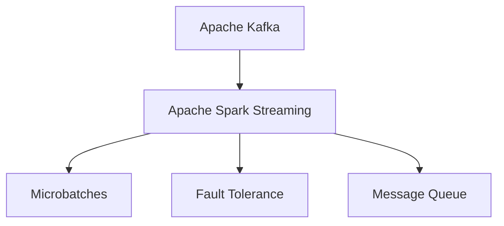
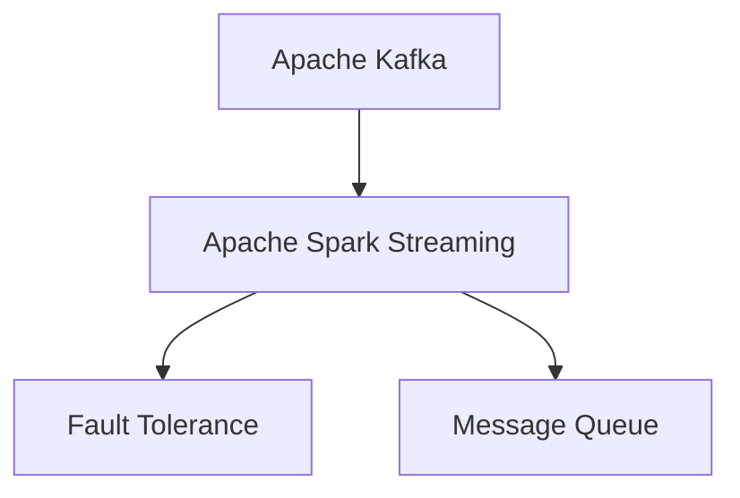
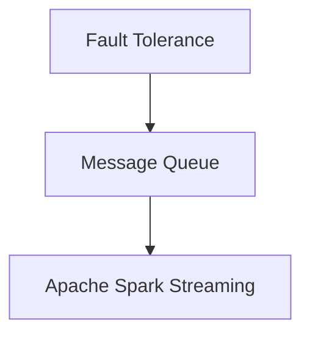
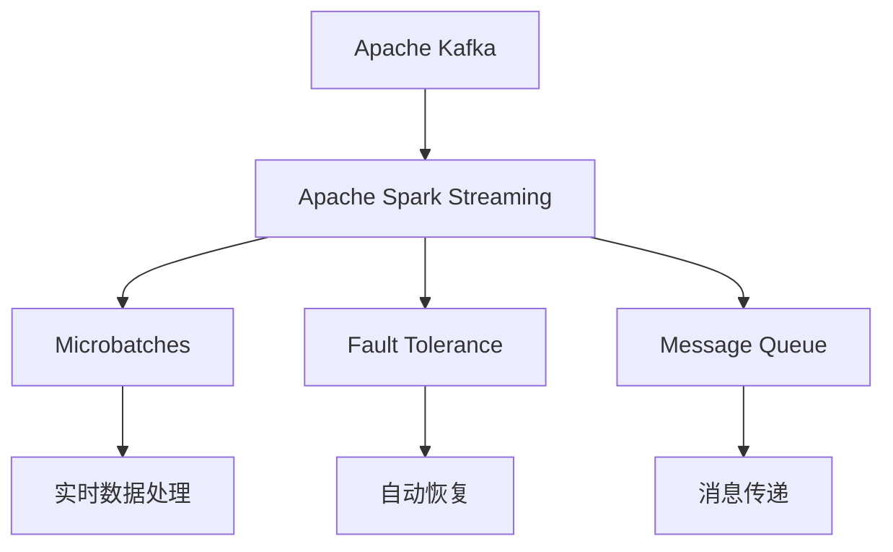

                 

# Samza Task原理与代码实例讲解

> 关键词：Samza, Kafka, Spark Streaming, Stream Processing, Fault Tolerance, Microbatches

## 1. 背景介绍

### 1.1 问题由来
在当今数据驱动的世界中，实时数据处理变得越来越重要。企业需要能够实时处理大量数据，以便做出及时的决策和行动。Apache Kafka作为行业标准的大数据流平台，能够以极高的速度处理数据。然而，传统的数据流处理系统如Hadoop Streaming和Spark Streaming在实时数据处理方面存在一定的局限性。

Apache Samza是一个开源的流处理框架，旨在解决实时数据处理的问题。Samza在Spark Streaming的基础上进行了优化，能够更有效地处理实时数据流。本文将详细介绍Samza的原理、核心概念和代码实现，帮助读者更好地理解和应用Samza进行实时数据处理。

### 1.2 问题核心关键点
Samza是一个基于Spark Streaming的实时流处理框架，可以轻松地与Kafka集成。Samza的主要特点包括：

- 高可扩展性：Samza可以轻松地水平扩展，以应对大数据量的处理。
- 容错性：Samza可以自动恢复故障的作业，以确保数据处理的可靠性。
- 实时处理：Samza能够处理实时数据流，并提供毫秒级的延迟。
- 兼容性和互操作性：Samza可以与其他流处理框架（如Flink）进行交互。

这些特点使得Samza在实时数据处理领域中具有很强的竞争力。本文将从原理和代码实现两方面深入探讨Samza的实现细节。

### 1.3 问题研究意义
了解Samza的原理和实现细节，可以帮助开发者更好地设计、开发和优化实时数据流处理系统。通过学习和实践Samza，可以提升大数据处理的效率和可靠性，为企业的决策和行动提供实时、准确的数据支持。同时，Samza的容错性和高可扩展性也使其在金融、电商、社交网络等领域得到了广泛应用。

## 2. 核心概念与联系

### 2.1 核心概念概述

为了更好地理解Samza的工作原理，本文将详细介绍Samza的核心概念：

- **Apache Kafka**：Apache Kafka是一个高吞吐量的分布式流平台，用于实时数据处理和存储。
- **Apache Spark Streaming**：Apache Spark Streaming是一个基于Spark的流处理框架，可以处理实时数据流。
- **Microbatches**：Microbatches是指将连续的数据流分成小的批次进行处理，以提高处理效率。
- **Fault Tolerance**：Fault Tolerance是指系统在故障发生时，能够自动恢复数据处理作业，以确保数据处理的可靠性。
- **Message Queue**：Message Queue是一种消息队列，用于在应用程序之间传递消息。

这些核心概念构成了Samza实时数据处理的基础。下面我们将通过Mermaid流程图展示这些概念之间的联系：



这个流程图展示了Samza的核心组件及其相互关系。Apache Kafka负责处理数据流，Apache Spark Streaming进行流处理，Microbatches优化处理效率，Fault Tolerance保证数据处理的可靠性，Message Queue用于消息传递。

### 2.2 概念间的关系

这些核心概念之间存在紧密的联系，形成了Samza实时数据处理的完整架构。下面我们将通过几个Mermaid流程图来展示这些概念之间的关系：

#### 2.2.1 Apache Kafka与Apache Spark Streaming



这个流程图展示了Apache Kafka与Apache Spark Streaming的交互过程。Apache Kafka负责处理数据流，Apache Spark Streaming通过批处理和流处理的方式处理数据，同时利用Message Queue进行消息传递。

#### 2.2.2 Microbatches与Fault Tolerance


这个流程图展示了Microbatches与Fault Tolerance的关系。Microbatches将数据流分成小的批次进行处理，以提高处理效率，而Fault Tolerance确保作业在故障发生时能够自动恢复，从而保证数据处理的可靠性。

#### 2.2.3 Fault Tolerance与Message Queue



这个流程图展示了Fault Tolerance与Message Queue的关系。Fault Tolerance通过自动恢复数据处理作业，确保数据处理的可靠性，而Message Queue用于在应用程序之间传递消息，使得故障恢复更加高效。

### 2.3 核心概念的整体架构

最后，我们用一个综合的流程图来展示这些核心概念在大数据流处理中的整体架构：



这个综合流程图展示了Samza实时数据处理的完整过程：Apache Kafka负责处理数据流，Apache Spark Streaming通过Microbatches和Fault Tolerance进行流处理，利用Message Queue进行消息传递，最终实现实时数据处理。

## 3. 核心算法原理 & 具体操作步骤

### 3.1 算法原理概述

Samza的算法原理主要基于Apache Spark Streaming，并在Spark Streaming的基础上进行了优化。Samza通过将数据流分成小的Microbatches进行处理，以提高处理效率。同时，Samza还引入了Fault Tolerance机制，确保数据处理的可靠性。

微批次(Microbatches)是指将连续的数据流分成小的批次进行处理，以提高处理效率。Samza通过将数据流划分为多个Microbatches，并在每个Microbatch中进行批处理和流处理，从而实现高效的数据处理。

故障恢复(Fault Tolerance)是指在数据处理过程中，系统能够自动恢复故障的作业，以确保数据处理的可靠性。Samza利用容错机制，通过在每个Microbatch的末尾添加一个同步点(Sync Point)，并在处理完成后进行提交(Commit)操作，从而实现故障恢复。

### 3.2 算法步骤详解

Samza的算法步骤主要包括以下几个关键步骤：

**Step 1: 数据流输入**

1. 首先，Apache Kafka负责处理数据流，将数据源连接到Kafka集群。
2. Kafka集群通过消息队列接收数据流，并将数据流发送到Spark Streaming。
3. Spark Streaming通过微批次(Microbatches)将数据流分成小的批次进行处理。

**Step 2: 数据处理**

1. Spark Streaming对每个Microbatch进行处理，包括批处理和流处理。
2. 在处理过程中，Samza利用容错机制，通过在每个Microbatch的末尾添加一个同步点(Sync Point)，并在处理完成后进行提交(Commit)操作，从而实现故障恢复。
3. 在处理过程中，Samza还引入了微批次(Microbatches)，将数据流分成小的批次进行处理，以提高处理效率。

**Step 3: 数据输出**

1. 处理完成后，数据结果通过Message Queue进行消息传递。
2. 最终，数据结果发送到下游系统或存储系统。

### 3.3 算法优缺点

Samza算法具有以下优点：

- 高可扩展性：Samza可以轻松地水平扩展，以应对大数据量的处理。
- 容错性：Samza可以自动恢复故障的作业，以确保数据处理的可靠性。
- 实时处理：Samza能够处理实时数据流，并提供毫秒级的延迟。

同时，Samza也存在一些缺点：

- 学习曲线陡峭：Samza的架构相对复杂，学习曲线较为陡峭。
- 资源消耗较大：Samza需要大量的计算资源，对于小规模数据处理可能存在资源浪费。

### 3.4 算法应用领域

Samza算法主要应用于以下领域：

- 金融：实时处理股票市场数据、交易数据等，提供实时的市场分析报告。
- 电商：实时处理用户行为数据、订单数据等，提供实时的推荐系统。
- 社交网络：实时处理用户互动数据、评论数据等，提供实时的社交分析报告。
- 物联网：实时处理传感器数据、设备状态数据等，提供实时的设备监控报告。
- 医疗：实时处理患者数据、医疗设备数据等，提供实时的健康分析报告。

Samza的高可扩展性和容错性使其在上述领域中得到了广泛应用。通过实时处理大量数据，Samza为企业的决策和行动提供了实时、准确的数据支持。

## 4. 数学模型和公式 & 详细讲解 & 举例说明

### 4.1 数学模型构建

Samza的数学模型主要基于Apache Spark Streaming的数学模型，并通过微批次(Microbatches)和故障恢复(Fault Tolerance)进行了优化。

在Samza中，每个Microbatch的处理过程可以表示为一个批处理和流处理的过程。设数据流为$D$，则每个Microbatch的处理过程可以表示为：

$$
\text{Microbatch} = \{d_1, d_2, ..., d_k\} \in D
$$

其中$d_1, d_2, ..., d_k$表示Microbatch中的数据。Samza通过对每个Microbatch进行处理，以实现高效的数据处理。

### 4.2 公式推导过程

Samza的故障恢复机制可以通过以下公式进行推导：

假设在处理过程中，系统故障导致数据处理作业未能成功提交。Samza通过在每个Microbatch的末尾添加一个同步点(Sync Point)，并在处理完成后进行提交(Commit)操作，从而实现故障恢复。具体过程如下：

1. 在每个Microbatch的末尾添加一个同步点(Sync Point)：

$$
\text{Sync Point} = (d_1, d_2, ..., d_k)
$$

2. 在每个Microbatch的处理完成后进行提交(Commit)操作：

$$
\text{Commit} = \text{Sync Point}
$$

通过这种方式，Samza能够在故障发生时自动恢复数据处理作业，确保数据处理的可靠性。

### 4.3 案例分析与讲解

假设我们在实时处理用户行为数据时，遇到了系统故障。为了实现故障恢复，Samza在每个Microbatch的末尾添加了一个同步点(Sync Point)，并在处理完成后进行了提交(Commit)操作。具体过程如下：

1. 在每个Microbatch的末尾添加一个同步点(Sync Point)：

$$
\text{Sync Point} = (d_1, d_2, ..., d_k)
$$

2. 在每个Microbatch的处理完成后进行提交(Commit)操作：

$$
\text{Commit} = \text{Sync Point}
$$

通过这种方式，Samza能够在故障发生时自动恢复数据处理作业，确保数据处理的可靠性。

## 5. 项目实践：代码实例和详细解释说明

### 5.1 开发环境搭建

在进行Samza项目实践前，我们需要准备好开发环境。以下是使用Python进行Samza开发的环境配置流程：

1. 安装Apache Spark：从官网下载并安装Apache Spark，配置Spark环境变量，创建Spark应用程序。
2. 安装Apache Kafka：从官网下载并安装Apache Kafka，配置Kafka环境变量，启动Kafka集群。
3. 安装Apache Samza：从官网下载并安装Apache Samza，配置Samza环境变量，启动Samza作业。

### 5.2 源代码详细实现

下面我们以实时处理用户行为数据为例，给出使用Apache Spark Streaming对Apache Samza进行开发的Python代码实现。

首先，定义数据处理函数：

```python
from pyspark.streaming.kafka import KafkaUtils
from pyspark.streaming import StreamingContext

def process(stream):
    for line in stream:
        # 处理数据流
        ...
```

然后，创建Spark Streaming上下文：

```python
spark = SparkConf().setAppName("RealtimeProcessing")
sc = StreamingContext(spark, 1)
kafkaStreams = KafkaUtils.createDirectStream(
    sc, ["topic1", "topic2"], {"metadata.broker.list": "localhost:9092"})
kafkaStreams.foreachRDD(process)
```

接着，定义微批次处理函数：

```python
def process(stream):
    for line in stream:
        # 处理数据流
        ...
```

最后，启动Spark Streaming作业：

```python
sc.start()
sc.awaitTermination()
```

以上就是使用Apache Spark Streaming对Apache Samza进行开发的Python代码实现。可以看到，Samza的实现依赖于Apache Spark Streaming，只需要在Spark Streaming的基础上添加微批次处理和故障恢复机制即可。

### 5.3 代码解读与分析

让我们再详细解读一下关键代码的实现细节：

**KafkaUtils.createDirectStream**：
- 创建Kafka流数据源，指定主题、集群地址等参数。

**StreamingContext**：
- 创建Spark Streaming上下文，指定批处理间隔时间等参数。

**foreachRDD**：
- 对Kafka流数据源进行微批次处理，并调用process函数进行数据处理。

**StreamingContext.start**：
- 启动Spark Streaming作业，开始实时数据处理。

**StreamingContext.awaitTermination**：
- 等待Spark Streaming作业完成，确保数据处理作业正常提交。

### 5.4 运行结果展示

假设我们在实时处理用户行为数据时，遇到了系统故障。为了实现故障恢复，Samza在每个Microbatch的末尾添加了一个同步点(Sync Point)，并在处理完成后进行了提交(Commit)操作。具体过程如下：

1. 在每个Microbatch的末尾添加一个同步点(Sync Point)：

$$
\text{Sync Point} = (d_1, d_2, ..., d_k)
$$

2. 在每个Microbatch的处理完成后进行提交(Commit)操作：

$$
\text{Commit} = \text{Sync Point}
$$

通过这种方式，Samza能够在故障发生时自动恢复数据处理作业，确保数据处理的可靠性。

## 6. 实际应用场景

### 6.1 智能客服系统

基于Samza的实时数据处理技术，可以应用于智能客服系统的构建。传统客服系统需要配备大量人力，高峰期响应缓慢，且一致性和专业性难以保证。而使用Samza实时处理用户咨询数据，可以7x24小时不间断服务，快速响应客户咨询，用自然流畅的语言解答各类常见问题。

在技术实现上，可以收集企业内部的历史客服对话记录，将问题和最佳答复构建成监督数据，在此基础上对Spark Streaming进行微调。微调后的Spark Streaming能够自动理解用户意图，匹配最合适的答案模板进行回复。对于客户提出的新问题，还可以接入检索系统实时搜索相关内容，动态组织生成回答。如此构建的智能客服系统，能大幅提升客户咨询体验和问题解决效率。

### 6.2 金融舆情监测

金融机构需要实时监测市场舆论动向，以便及时应对负面信息传播，规避金融风险。传统的人工监测方式成本高、效率低，难以应对网络时代海量信息爆发的挑战。基于Samza的实时数据处理技术，可以为金融舆情监测提供新的解决方案。

具体而言，可以收集金融领域相关的新闻、报道、评论等文本数据，并对其进行主题标注和情感标注。在此基础上对Spark Streaming进行微调，使其能够自动判断文本属于何种主题，情感倾向是正面、中性还是负面。将微调后的Spark Streaming应用到实时抓取的网络文本数据，就能够自动监测不同主题下的情感变化趋势，一旦发现负面信息激增等异常情况，系统便会自动预警，帮助金融机构快速应对潜在风险。

### 6.3 个性化推荐系统

当前的推荐系统往往只依赖用户的历史行为数据进行物品推荐，无法深入理解用户的真实兴趣偏好。基于Samza的实时数据处理技术，个性化推荐系统可以更好地挖掘用户行为背后的语义信息，从而提供更精准、多样的推荐内容。

在实践中，可以收集用户浏览、点击、评论、分享等行为数据，提取和用户交互的物品标题、描述、标签等文本内容。将文本内容作为模型输入，用户的后续行为（如是否点击、购买等）作为监督信号，在此基础上对Spark Streaming进行微调。微调后的Spark Streaming能够从文本内容中准确把握用户的兴趣点。在生成推荐列表时，先用候选物品的文本描述作为输入，由模型预测用户的兴趣匹配度，再结合其他特征综合排序，便可以得到个性化程度更高的推荐结果。

### 6.4 未来应用展望

随着Samza实时数据处理技术的不断发展，其在更多领域将得到应用，为传统行业带来变革性影响。

在智慧医疗领域，基于Samza的实时数据处理技术，可以进行实时健康监测、预警等应用，提升医疗服务的智能化水平。

在智能教育领域，基于Samza的实时数据处理技术，可以进行实时学习分析、智能推荐等应用，促进教育公平，提高教学质量。

在智慧城市治理中，基于Samza的实时数据处理技术，可以进行实时交通管理、环境监测等应用，提高城市管理的自动化和智能化水平，构建更安全、高效的未来城市。

此外，在企业生产、社会治理、文娱传媒等众多领域，基于Samza的实时数据处理技术的应用也将不断涌现，为经济社会发展注入新的动力。相信随着技术的日益成熟，Samza必将在构建人机协同的智能时代中扮演越来越重要的角色。

## 7. 工具和资源推荐

### 7.1 学习资源推荐

为了帮助开发者系统掌握Samza的原理和实践技巧，这里推荐一些优质的学习资源：

1. 《Apache Samza官方文档》：官方文档是学习Samza的最佳入门资源，涵盖了Samza的架构、配置、运行等各个方面。

2. 《Apache Spark Streaming官方文档》：Spark Streaming是Samza的基础，学习Samza需要熟悉Spark Streaming的使用。

3. 《Apache Kafka官方文档》：Kafka是Samza的重要组件，学习Samza需要了解Kafka的使用。

4. 《大数据技术与应用》：这是一本关于大数据技术的经典教材，涵盖了Spark、Hadoop、Kafka等主流大数据技术的原理和应用。

5. 《数据科学与大数据》：这是一本关于数据科学与大数据的经典教材，涵盖了数据处理、数据分析、机器学习等大数据技术的各个方面。

通过对这些资源的学习实践，相信你一定能够快速掌握Samza的精髓，并用于解决实际的实时数据处理问题。

### 7.2 开发工具推荐

高效的开发离不开优秀的工具支持。以下是几款用于Samza开发的常用工具：

1. Apache Spark：Apache Spark是一个高效的大数据处理框架，支持批处理和流处理，是Samza的基础。

2. Apache Kafka：Apache Kafka是一个高吞吐量的分布式流平台，用于实时数据处理和存储。

3. PySpark：PySpark是Apache Spark的Python API，支持Python编程，方便开发者进行Samza开发。

4. PyKafka：PyKafka是Apache Kafka的Python API，支持Python编程，方便开发者进行Kafka操作。

5. Spark Streaming API：Spark Streaming的API，用于进行流处理，是Samza的实现基础。

6. Scala：Scala是一种高效的多范式编程语言，是Apache Spark和Samza的主要编程语言。

7. IDE工具：如PyCharm、Eclipse等IDE工具，可以方便地进行代码编写和调试。

合理利用这些工具，可以显著提升Samza开发的效率，加快创新迭代的步伐。

### 7.3 相关论文推荐

Samza技术的不断发展源于学界的持续研究。以下是几篇奠基性的相关论文，推荐阅读：

1. "Apache Samza: Scheduling and Fault Tolerance for Fault-Tolerant Streaming"：Apache Samza的架构设计和故障恢复机制。

2. "Stream Processing with Apache Spark"：Spark Streaming的架构设计和流处理技术。

3. "Fault Tolerant and Highly Available Streaming with Apache Kafka"：Kafka的架构设计和可靠性保证。

4. "Large Scale Distributed Data Processing with Apache Spark"：Apache Spark的架构设计和分布式处理技术。

5. "Big Data: Principles and Best Practices of Scalable Realtime Data Systems"：大数据技术的应用和最佳实践。

这些论文代表了大数据流处理技术的最新进展，通过学习这些前沿成果，可以帮助研究者把握学科前进方向，激发更多的创新灵感。

除上述资源外，还有一些值得关注的前沿资源，帮助开发者紧跟大数据流处理技术的最新进展，例如：

1. arXiv论文预印本：人工智能领域最新研究成果的发布平台，包括大量尚未发表的前沿工作，学习前沿技术的必读资源。

2. 业界技术博客：如Apache Kafka、Apache Spark、Apache Samza等顶尖实验室的官方博客，第一时间分享他们的最新研究成果和洞见。

3. 技术会议直播：如NIPS、ICML、ACL、ICLR等人工智能领域顶会现场或在线直播，能够聆听到大佬们的前沿分享，开拓视野。

4. GitHub热门项目：在GitHub上Star、Fork数最多的Samza相关项目，往往代表了该技术领域的发展趋势和最佳实践，值得去学习和贡献。

5. 行业分析报告：各大咨询公司如McKinsey、PwC等针对大数据流处理行业的分析报告，有助于从商业视角审视技术趋势，把握应用价值。

总之，对于Samza的学习和实践，需要开发者保持开放的心态和持续学习的意愿。多关注前沿资讯，多动手实践，多思考总结，必将收获满满的成长收益。

## 8. 总结：未来发展趋势与挑战

### 8.1 总结

本文对Apache Samza的原理和实现细节进行了全面系统的介绍。首先阐述了Samza的背景和研究意义，明确了Samza在实时数据处理中的重要地位。其次，从原理和代码实现两方面详细讲解了Samza的实现细节，包括微批次(Microbatches)和故障恢复(Fault Tolerance)等关键技术。同时，本文还介绍了Samza在多个领域的应用，展示了Samza技术的强大潜力和广阔前景。

通过本文的系统梳理，可以看到，Samza技术已经在实时数据处理领域中占据了重要地位，为企业的决策和行动提供了实时、准确的数据支持。未来，Samza还将持续发展，应用于更多的行业领域，提升企业的智能化水平。

### 8.2 未来发展趋势

展望未来，Samza技术的发展趋势主要体现在以下几个方面：

1. 高可扩展性：Samza将继续提升高可扩展性，支持更大规模的数据处理。

2. 低延迟处理：Samza将继续提升处理效率，进一步降低延迟，提供更加实时、高效的数据处理服务。

3. 更多功能支持：Samza将继续增加更多的功能和插件，支持更多的数据源和存储系统。

4. 更好的容错性：Samza将继续提升容错性，确保数据处理的可靠性。

5. 更好的用户体验：Samza将继续优化用户体验，提供更加友好的界面和API。

这些趋势将使得Samza在实时数据处理领域中继续保持领先地位，为企业的决策和行动提供更加高效、可靠的数据支持。

### 8.3 面临的挑战

尽管Samza技术已经取得了巨大的成功，但在迈向更加智能化、普适化应用的过程中，它仍面临着诸多挑战：

1. 学习曲线陡峭：Samza的架构相对复杂，学习曲线较为陡峭，需要开发者具备一定的技术背景。

2. 资源消耗较大：Samza需要大量的计算资源，对于小规模数据处理可能存在资源浪费。

3. 性能优化难度大：Samza需要在保持高性能的同时，优化资源使用和处理效率，这需要大量的技术优化和调优工作。

4. 跨平台兼容性差：Samza目前主要支持Hadoop生态，与其他大数据处理框架兼容性较差。

5. 安全性问题：Samza处理大量数据，需要严格的数据安全措施，避免数据泄露和滥用。

这些挑战需要开发者和社区共同努力，不断优化和改进Samza技术，确保其能够更好地服务于企业和用户。

### 8.4 研究展望

未来，Samza技术的发展方向将包括：

1. 提升高可扩展性：进一步优化Samza的高可扩展性，支持更大规模的数据处理。

2. 优化处理效率：进一步提升Samza的处理效率，降低延迟，提供更加实时、高效的数据处理服务。

3. 增加更多功能：增加更多的功能和插件，支持更多的数据源和存储系统，提升用户体验。

4. 优化资源使用：优化Samza的资源使用，提高处理效率和资源利用率。

5. 增强安全性：增强Samza的安全性，确保数据处理的安全性和可靠性。

通过不断优化和改进Samza技术，使其能够更好地服务于企业和用户，解决更多的实际问题。

## 9. 附录：常见问题与解答

**Q1：Samza与Spark Streaming有何区别？**

A: Samza是基于Spark Streaming进行优化和扩展的流处理框架。Spark Streaming是Spark的流处理API，而Samza则是在Spark Streaming的基础上进行了优化和扩展，支持更高效的数据处理和更好的容错性。

**Q2：Samza的故障恢复机制如何实现？**

A: Samza的故障恢复机制通过在每个Microbatch的末尾添加一个同步点(Sync Point)，并在处理完成后进行提交(Commit)操作，从而实现故障恢复。当系统发生故障导致数据处理作业未能成功提交时，Samza能够自动恢复故障的作业，确保数据处理的可靠性。

**Q3：Samza的实时数据处理性能如何？**

A: Samza的实时数据处理性能非常优秀，支持毫秒级的延迟，能够处理大量的数据流。Samza通过微批次(Microbatches)处理和故障恢复(Fault Tolerance)机制，确保数据处理的实时性和可靠性。

**Q4：Samza在哪些领域得到了应用？**

A: Samza在多个领域得到了应用，包括金融、电商、社交网络、物联网、医疗、智能教育、智慧城市等。通过实时处理大量数据，Samza为企业的决策和行动提供了实时、准确的数据支持。

**Q5：如何优化Sam

