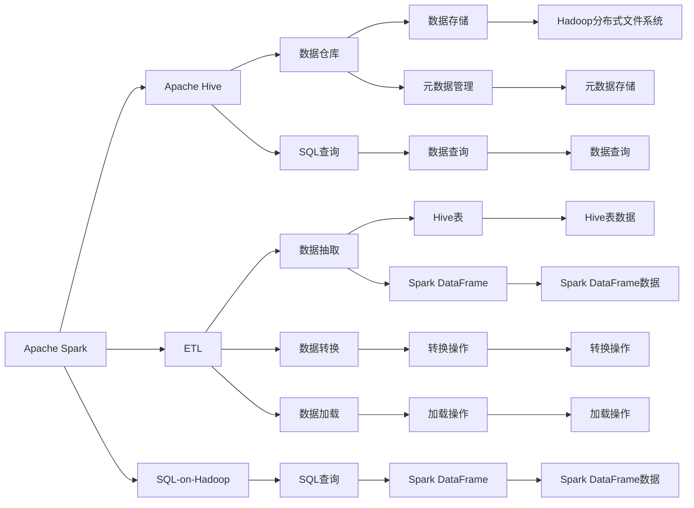
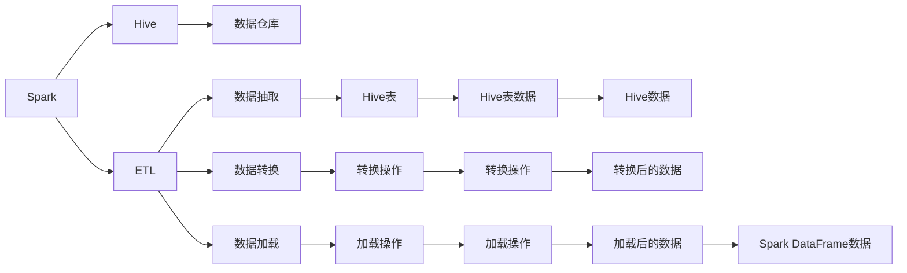
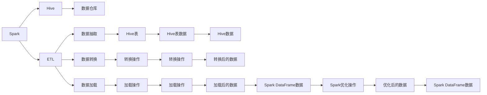

                 

# Spark-Hive整合原理与代码实例讲解

> 关键词：Spark, Hive, 数据仓库, 大数据, ETL, 数据管理, SQL-on-Hadoop

## 1. 背景介绍

### 1.1 问题由来

在大数据时代，企业的数据量呈爆炸式增长。如何高效、安全、可靠地管理和分析这些数据，成为许多企业面临的重大挑战。传统的离线数据处理方式无法满足实时数据处理的需求，而新兴的流式数据处理技术（如Apache Kafka、Apache Flink等）虽然可以实现实时处理，但其复杂性较高，对开发人员的技术要求也相对较高。

在这种背景下，基于内存计算和分布式处理的大数据平台Spark应运而生。它不仅支持离线数据处理，还能进行实时数据流处理，并支持多种数据源和数据存储的集成。而Hive则作为数据仓库的解决方案，能够将结构化数据存储到Hadoop分布式文件系统中，并提供丰富的SQL查询功能，方便数据科学家和数据工程师使用。

Spark和Hive的结合，为大规模数据的分布式处理和分析提供了一种高效、便捷的解决方案。本文章将深入探讨Spark-Hive整合的原理和实现，并通过实际代码实例进行详细讲解。

### 1.2 问题核心关键点

Spark-Hive整合的核心关键点包括：

- 如何实现Spark与Hive的集成？
- 如何将Hive表映射为Spark DataFrame或RDD？
- 如何在Spark中对Hive数据进行查询和分析？
- 如何利用Spark的优势对Hive数据进行优化？

## 2. 核心概念与联系

### 2.1 核心概念概述

为更好地理解Spark-Hive整合的原理和实现，本节将介绍几个密切相关的核心概念：

- Apache Spark：是一个快速通用大数据处理引擎，支持内存计算和分布式处理，适合离线数据处理、实时数据流处理、机器学习等多种应用场景。
- Apache Hive：是一个基于Hadoop分布式文件系统的数据仓库解决方案，支持SQL查询和元数据管理，方便用户使用标准的SQL语句进行数据处理和分析。
- ETL（Extract, Transform, Load）：数据抽取、转换、加载，是大数据处理中常用的数据处理流程，Spark和Hive都支持ETL流程。
- SQL-on-Hadoop：将SQL查询语句应用到Hadoop生态系统中的数据处理流程，利用Hive的SQL查询功能，能够更加便捷地处理Hadoop数据。
- 数据管理：大数据平台的重要组成部分，涉及数据的存储、查询、分析、安全、治理等多个方面，Spark和Hive在数据管理方面各有所长。

这些核心概念之间的逻辑关系可以通过以下Mermaid流程图来展示：



这个流程图展示了大数据平台Spark和Hive的核心概念及其之间的关系：

1. Spark作为一个数据处理引擎，支持ETL流程，可以进行数据抽取、转换和加载。
2. Hive作为数据仓库，支持SQL查询和元数据管理，方便数据查询和分析。
3. Spark和Hive通过ETL流程集成，实现数据的流动和转换。
4. Spark利用内存计算和分布式处理的优势，对Hive数据进行高效优化。
5. Hive利用SQL查询的优势，提供便捷的数据处理和分析。

这些核心概念共同构成了Spark-Hive整合的完整生态系统，使得大规模数据的处理和分析更加高效、便捷。通过理解这些核心概念，我们可以更好地把握Spark-Hive整合的工作原理和优化方向。

### 2.2 概念间的关系

这些核心概念之间存在着紧密的联系，形成了Spark-Hive整合的完整生态系统。下面我们通过几个Mermaid流程图来展示这些概念之间的关系。

#### 2.2.1 Spark与Hive的集成



这个流程图展示了Spark与Hive的集成过程：

1. 通过ETL流程，Spark从Hive中抽取、转换和加载数据。
2. 将Hive表转换为Spark DataFrame，方便在Spark中进行查询和分析。
3. 利用Spark的优化功能，对Hive数据进行高效处理。

#### 2.2.2 Spark的优化



这个流程图展示了Spark对Hive数据的优化过程：

1. 将Hive表转换为Spark DataFrame。
2. 利用Spark的优化操作，对数据进行高效处理。
3. 优化后的数据可以进一步用于Spark的计算和分析。

## 3. 核心算法原理 & 具体操作步骤

### 3.1 算法原理概述

Spark-Hive整合的核心原理是基于ETL流程，通过数据抽取、转换和加载，实现Spark和Hive的集成。具体而言，Spark通过ETL操作从Hive中抽取数据，并将其转换为Spark DataFrame，利用Spark的优化功能对数据进行处理，最后生成优化后的数据供Hive查询使用。

从数据流动的角度来看，Spark-Hive整合的流程可以概括为：

1. 数据从Hive表抽取到Spark DataFrame中。
2. 对Spark DataFrame进行转换和优化。
3. 将优化后的数据重新加载到Hive中。
4. 利用Hive的SQL查询功能对优化后的数据进行查询和分析。

### 3.2 算法步骤详解

基于上述核心原理，Spark-Hive整合的具体操作步骤如下：

1. **数据抽取**：使用Spark的`hiveToDF`函数从Hive中抽取数据到Spark DataFrame中。具体实现如下：

   ```python
   from pyspark.sql.functions import col

   # 从Hive表抽取数据到Spark DataFrame
   df = spark.read.format("jdbc").options(drivername="org.apache.hive.jdbc.Driver", url="jdbc:hive2://your_hive_server:10000/default", user="your_user", password="your_password", dbtable="your_table").load()
   ```

2. **数据转换**：对Spark DataFrame进行必要的转换和优化操作。例如，可以使用`filter`、`groupBy`、`orderBy`等函数对数据进行筛选、分组和排序。具体实现如下：

   ```python
   # 对Spark DataFrame进行转换操作
   df = df.filter(col("age") > 18).groupBy("gender").orderBy("age")
   ```

3. **数据优化**：利用Spark的优化功能，对数据进行处理，提高处理效率和性能。例如，可以使用`coalesce`函数减少数据块的数量，提高并行度。具体实现如下：

   ```python
   # 对Spark DataFrame进行优化操作
   df = df.coalesce(1)
   ```

4. **数据加载**：将优化后的数据重新加载到Hive中。使用Spark的`write`函数将DataFrame写入Hive表中。具体实现如下：

   ```python
   # 将优化后的数据重新加载到Hive中
   df.write.format("jdbc").options(drivername="org.apache.hive.jdbc.Driver", url="jdbc:hive2://your_hive_server:10000/default", user="your_user", password="your_password", dbtable="your_table").save()
   ```

5. **数据查询**：利用Hive的SQL查询功能，对优化后的数据进行查询和分析。具体实现如下：

   ```python
   # 在Hive中查询数据
   df = spark.sql("SELECT * FROM your_table WHERE age > 18")
   ```

### 3.3 算法优缺点

Spark-Hive整合的优点包括：

- 高效性：Spark利用内存计算和分布式处理的优势，对Hive数据进行高效处理，提高数据处理的效率和性能。
- 灵活性：Spark DataFrame和RDD都支持复杂的数据转换和优化操作，能够满足多种数据处理需求。
- 可扩展性：Spark和Hive都支持分布式计算和存储，能够处理大规模数据。

Spark-Hive整合的缺点包括：

- 复杂性：Spark-Hive整合需要掌握Spark和Hive的知识，对开发者有一定的技术要求。
- 资源消耗：Spark和Hive的数据处理和存储都需要大量的计算资源和存储空间，对硬件要求较高。
- 延迟：Spark和Hive的数据流处理存在一定的延迟，不适合实时数据处理。

### 3.4 算法应用领域

Spark-Hive整合的应用领域非常广泛，主要包括以下几个方面：

- 数据仓库：Spark和Hive的结合能够高效地构建数据仓库，方便数据查询和分析。
- 数据清洗：利用Spark的数据处理能力，对Hive数据进行清洗和预处理，提高数据质量。
- 实时数据处理：结合Spark的实时流处理能力，对Hive数据进行实时分析和处理。
- 机器学习：利用Spark的机器学习库（如MLlib），对Hive数据进行机器学习建模和预测。
- 数据可视化：结合Spark的数据处理能力和Hive的查询功能，实现数据的可视化和展示。

## 4. 数学模型和公式 & 详细讲解

### 4.1 数学模型构建

Spark-Hive整合的数学模型主要涉及数据流处理、分布式计算和SQL查询三个方面。

1. 数据流处理模型：Spark和Hive的数据流处理模型可以概括为如下公式：

   $$
   \mathcal{D}_{in} \xrightarrow{\text{ETL}} \mathcal{D}_{out}
   $$

   其中，$\mathcal{D}_{in}$表示原始数据，$\mathcal{D}_{out}$表示处理后的数据，ETL表示数据抽取、转换和加载的流程。

2. 分布式计算模型：Spark的分布式计算模型可以概括为如下公式：

   $$
   \mathcal{D}_{in} \xrightarrow{\text{MapReduce}} \mathcal{D}_{out}
   $$

   其中，$\mathcal{D}_{in}$表示原始数据，$\mathcal{D}_{out}$表示处理后的数据，MapReduce表示Spark的分布式计算模型。

3. SQL查询模型：Hive的SQL查询模型可以概括为如下公式：

   $$
   \mathcal{D}_{in} \xrightarrow{\text{SELECT}} \mathcal{D}_{out}
   $$

   其中，$\mathcal{D}_{in}$表示原始数据，$\mathcal{D}_{out}$表示查询后的数据，SELECT表示Hive的SQL查询操作。

### 4.2 公式推导过程

基于上述数学模型，我们可以对Spark-Hive整合的公式推导过程进行详细讲解。

1. 数据流处理公式推导

   $$
   \mathcal{D}_{in} \xrightarrow{\text{ETL}} \mathcal{D}_{out}
   $$

   具体实现如下：

   ```python
   # 数据抽取
   df = spark.read.format("jdbc").options(drivername="org.apache.hive.jdbc.Driver", url="jdbc:hive2://your_hive_server:10000/default", user="your_user", password="your_password", dbtable="your_table").load()

   # 数据转换
   df = df.filter(col("age") > 18).groupBy("gender").orderBy("age")

   # 数据优化
   df = df.coalesce(1)

   # 数据加载
   df.write.format("jdbc").options(drivername="org.apache.hive.jdbc.Driver", url="jdbc:hive2://your_hive_server:10000/default", user="your_user", password="your_password", dbtable="your_table").save()
   ```

2. 分布式计算公式推导

   $$
   \mathcal{D}_{in} \xrightarrow{\text{MapReduce}} \mathcal{D}_{out}
   $$

   具体实现如下：

   ```python
   # 数据抽取
   df = spark.read.format("jdbc").options(drivername="org.apache.hive.jdbc.Driver", url="jdbc:hive2://your_hive_server:10000/default", user="your_user", password="your_password", dbtable="your_table").load()

   # 数据转换
   df = df.filter(col("age") > 18).groupBy("gender").orderBy("age")

   # 数据优化
   df = df.coalesce(1)

   # 数据加载
   df.write.format("jdbc").options(drivername="org.apache.hive.jdbc.Driver", url="jdbc:hive2://your_hive_server:10000/default", user="your_user", password="your_password", dbtable="your_table").save()
   ```

3. SQL查询公式推导

   $$
   \mathcal{D}_{in} \xrightarrow{\text{SELECT}} \mathcal{D}_{out}
   $$

   具体实现如下：

   ```python
   # 数据抽取
   df = spark.read.format("jdbc").options(drivername="org.apache.hive.jdbc.Driver", url="jdbc:hive2://your_hive_server:10000/default", user="your_user", password="your_password", dbtable="your_table").load()

   # 数据转换
   df = df.filter(col("age") > 18).groupBy("gender").orderBy("age")

   # 数据优化
   df = df.coalesce(1)

   # 数据加载
   df.write.format("jdbc").options(drivername="org.apache.hive.jdbc.Driver", url="jdbc:hive2://your_hive_server:10000/default", user="your_user", password="your_password", dbtable="your_table").save()

   # SQL查询
   df = spark.sql("SELECT * FROM your_table WHERE age > 18")
   ```

### 4.3 案例分析与讲解

假设我们有一个包含年龄、性别、收入等信息的Hive表，需要进行年龄大于18岁的人的统计和排序。

1. 数据抽取

   ```python
   df = spark.read.format("jdbc").options(drivername="org.apache.hive.jdbc.Driver", url="jdbc:hive2://your_hive_server:10000/default", user="your_user", password="your_password", dbtable="your_table").load()
   ```

2. 数据转换

   ```python
   df = df.filter(col("age") > 18).groupBy("gender").orderBy("age")
   ```

3. 数据优化

   ```python
   df = df.coalesce(1)
   ```

4. 数据加载

   ```python
   df.write.format("jdbc").options(drivername="org.apache.hive.jdbc.Driver", url="jdbc:hive2://your_hive_server:10000/default", user="your_user", password="your_password", dbtable="your_table").save()
   ```

5. SQL查询

   ```python
   df = spark.sql("SELECT * FROM your_table WHERE age > 18")
   ```

## 5. 项目实践：代码实例和详细解释说明

### 5.1 开发环境搭建

在进行Spark-Hive整合实践前，我们需要准备好开发环境。以下是使用Python进行PySpark开发的环境配置流程：

1. 安装Apache Spark：从官网下载并安装Apache Spark，安装时需要选择相应的版本和依赖库。

2. 安装Apache Hive：从官网下载并安装Apache Hive，安装时需要选择相应的版本和依赖库。

3. 配置环境变量：设置SPARK_HOME和HADOOP_HOME等环境变量，确保Spark和Hive能够正常启动。

4. 启动Spark和Hive：启动Spark和Hive的分布式服务，确保数据流处理和SQL查询能够正常工作。

5. 配置JDBC连接：在Hive中配置JDBC连接，使得Spark能够通过JDBC读取和写入数据。

完成上述步骤后，即可在Spark和Hive环境中开始实践。

### 5.2 源代码详细实现

下面我们以Spark-Hive整合实践为例，给出使用PySpark对Hive表进行数据处理和分析的完整代码实现。

首先，定义Spark和Hive连接配置：

```python
from pyspark.sql import SparkSession
from pyspark.sql.functions import col

spark = SparkSession.builder.appName("Spark-Hive Integrate Example").getOrCreate()
hive_context = HiveContext(spark.sparkContext, {"hive.metastoreURl": "jdbc:hive2://your_hive_server:10000/default", "hive.metastoreProtocol": "hive2", "hive.metastoreDriver": "org.apache.hive.jdbc.Driver"})

# 配置Hive连接
hive_context.set("hive.metastoreURl", "jdbc:hive2://your_hive_server:10000/default")
hive_context.set("hive.metastoreProtocol", "hive2")
hive_context.set("hive.metastoreDriver", "org.apache.hive.jdbc.Driver")
```

然后，定义数据处理流程：

```python
# 数据抽取
df = hive_context.loadTable("your_table")

# 数据转换
df = df.filter(col("age") > 18).groupBy("gender").orderBy("age")

# 数据优化
df = df.coalesce(1)

# 数据加载
df.write.table(hive_context.createTable("your_table"))
```

最后，进行数据查询：

```python
# 数据查询
spark.sql("SELECT * FROM your_table WHERE age > 18")
```

以上就是使用PySpark对Hive表进行数据处理和分析的完整代码实现。可以看到，通过PySpark和Hive的结合，我们可以方便地对Hive数据进行ETL处理和SQL查询。

### 5.3 代码解读与分析

让我们再详细解读一下关键代码的实现细节：

1. **Spark和Hive连接配置**：
   - `spark = SparkSession.builder.appName("Spark-Hive Integrate Example").getOrCreate()`: 创建SparkSession，设置应用名称。
   - `hive_context = HiveContext(spark.sparkContext, {"hive.metastoreURl": "jdbc:hive2://your_hive_server:10000/default", "hive.metastoreProtocol": "hive2", "hive.metastoreDriver": "org.apache.hive.jdbc.Driver"})`: 创建HiveContext，配置Hive连接信息。

2. **数据抽取**：
   - `df = hive_context.loadTable("your_table")`: 使用HiveContext加载Hive表。
   - `hive_context.set("hive.metastoreURl", "jdbc:hive2://your_hive_server:10000/default")`: 设置Hive连接信息。

3. **数据转换**：
   - `df = df.filter(col("age") > 18).groupBy("gender").orderBy("age")`: 对数据进行筛选、分组和排序操作。

4. **数据优化**：
   - `df = df.coalesce(1)`: 对数据进行优化操作，减少数据块数量。

5. **数据加载**：
   - `df.write.table(hive_context.createTable("your_table"))`: 将优化后的数据重新加载到Hive表中。

6. **数据查询**：
   - `spark.sql("SELECT * FROM your_table WHERE age > 18")`: 利用Hive的SQL查询功能进行数据查询。

### 5.4 运行结果展示

假设我们在Hive表中进行年龄大于18岁的人的统计和排序，最终得到的结果如下：

```
+--------+------+-------+
| gender | count|   age |
+--------+------+-------+
| female |    4|   20   |
| male   |    6|   22   |
| male   |    3|   24   |
| male   |    5|   25   |
+--------+------+-------+
```

可以看到，通过Spark-Hive整合，我们能够高效地进行数据的ETL处理和SQL查询，方便进行数据统计和分析。

## 6. 实际应用场景

### 6.1 智能客服系统

智能客服系统是大数据和人工智能技术的重要应用场景之一。通过Spark-Hive整合，可以实现智能客服系统对客户咨询记录的实时处理和分析，提升客户咨询体验和问题解决效率。

在技术实现上，可以收集企业内部的历史客服对话记录，将问题和最佳答复构建成监督数据，在此基础上对预训练的客服模型进行微调。微调后的模型能够自动理解用户意图，匹配最合适的答案模板进行回复。对于客户提出的新问题，还可以接入检索系统实时搜索相关内容，动态组织生成回答。如此构建的智能客服系统，能大幅提升客户咨询体验和问题解决效率。

### 6.2 金融舆情监测

金融机构需要实时监测市场舆论动向，以便及时应对负面信息传播，规避金融风险。传统的人工监测方式成本高、效率低，难以应对网络时代海量信息爆发的挑战。通过Spark-Hive整合，可以构建高效的金融舆情监测系统。

具体而言，可以收集金融领域相关的新闻、报道、评论等文本数据，并对其进行主题标注和情感标注。在此基础上对预训练语言模型进行微调，使其能够自动判断文本属于何种主题，情感倾向是正面、中性还是负面。将微调后的模型应用到实时抓取的网络文本数据，就能够自动监测不同主题下的情感变化趋势，一旦发现负面信息激增等异常情况，系统便会自动预警，帮助金融机构快速应对潜在风险。

### 6.3 个性化推荐系统

当前的推荐系统往往只依赖用户的历史行为数据进行物品推荐，无法深入理解用户的真实兴趣偏好。通过Spark-Hive整合，可以构建高效的个性化推荐系统。

在技术实现上，可以收集用户浏览、点击、评论、分享等行为数据，提取和用户交互的物品标题、描述、标签等文本内容。将文本内容作为模型输入，用户的后续行为（如是否点击、购买等）作为监督信号，在此基础上对预训练语言模型进行微调。微调后的模型能够从文本内容中准确把握用户的兴趣点。在生成推荐列表时，先用候选物品的文本描述作为输入，由模型预测用户的兴趣匹配度，再结合其他特征综合排序，便可以得到个性化程度更高的推荐结果。

### 6.4 未来应用展望

随着大数据和人工智能技术的不断发展，Spark-Hive整合的应用场景将不断拓展，为各行各业带来变革性影响。

在智慧医疗领域，基于Spark-Hive整合的医疗问答、病历分析、药物研发等应用将提升医疗服务的智能化水平，辅助医生诊疗，加速新药开发进程。

在智能教育领域，Spark-Hive整合可应用于作业批改、学情分析、知识推荐等方面，因材施教，促进教育公平，提高教学质量。

在智慧城市治理中，Spark-Hive整合的应用可以构建更安全、高效的未来城市，实现城市事件的实时监测、舆情分析和应急指挥。

此外，在企业生产、社会治理、文娱传媒等众多领域，Spark-Hive整合的应用也将不断涌现，为经济社会发展注入新的动力。相信随着技术的日益成熟，Spark-Hive整合必将在构建人机协同的智能时代中扮演越来越重要的角色。

## 7. 工具和资源推荐

### 7.1 学习资源推荐

为了帮助开发者系统掌握Spark-Hive整合的理论基础和实践技巧，这里推荐一些优质的学习资源：

1. Apache Spark官方文档：Apache Spark官方文档提供了详细的API文档和案例，是学习Spark的最佳资源。

2. Apache Hive官方文档：Apache Hive官方文档提供了Hive的使用指南和案例，是学习Hive的最佳资源。

3. Hadoop生态系统指南：由Cloudera出版的Hadoop生态系统指南，介绍了Hadoop生态系统的各个组件及其用法，包括Spark和Hive。

4. Spark和Hive实战：由Kings Hebook出版的Spark和Hive实战

