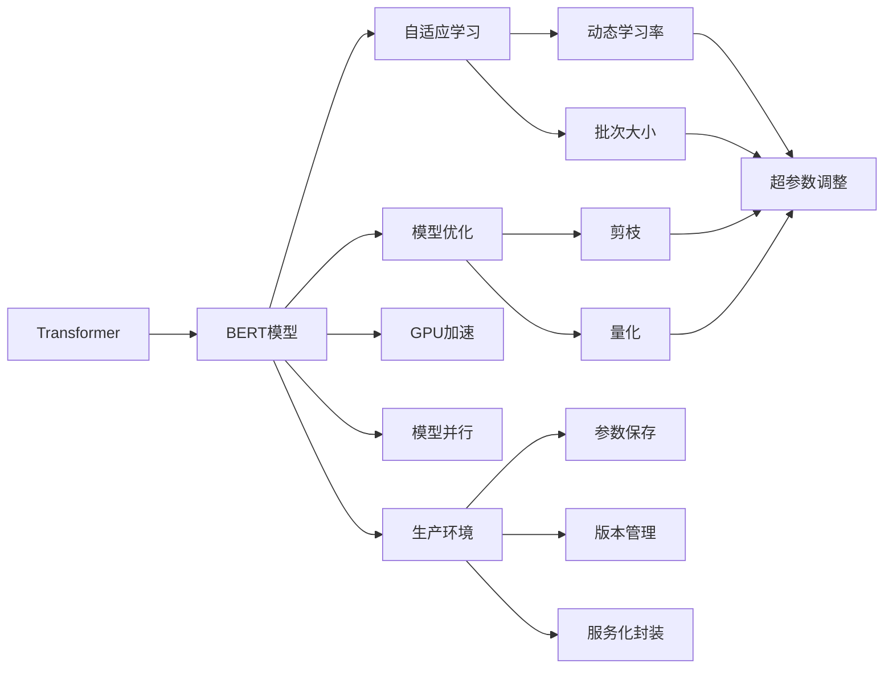

                 

# Transformer大模型实战 BERT 的其他配置

> 关键词：Transformer, BERT, 自适应学习, 模型优化, 加速, 生产环境

## 1. 背景介绍

### 1.1 问题由来

BERT模型作为预训练语言模型的代表，已被广泛应用于各种自然语言处理任务中。然而，在实际应用中，仅使用标准预训练权重进行微调往往无法满足特定场景的需求。为了进一步提升模型性能，需要对模型进行额外配置。

### 1.2 问题核心关键点

BERT模型的额外配置主要包括以下几个方面：

- 自适应学习（Adaptive Learning）：根据特定任务和数据集的特征，动态调整学习率等超参数。
- 模型优化（Model Optimization）：通过剪枝、量化等技术，减小模型规模，提高计算效率。
- 加速（Acceleration）：采用各种优化策略，如GPU加速、模型并行等，提升模型训练和推理速度。
- 生产环境（Production Environment）：将模型部署到实际生产环境中，进行参数保存、版本管理、服务化封装等操作，确保模型稳定高效运行。

通过合理配置这些参数，可以显著提升BERT模型在特定任务上的性能，降低计算成本，适应实际生产环境。

## 2. 核心概念与联系

### 2.1 核心概念概述

为更好地理解BERT模型及其优化配置，本节将介绍几个关键概念：

- Transformer：一种基于自注意力机制的深度学习模型，广泛应用于自然语言处理领域。BERT模型的结构即基于Transformer模型。
- BERT模型：由Google提出的预训练语言模型，通过在大规模无标签文本上自监督预训练，学习到丰富的语言知识，广泛应用于文本分类、实体识别、情感分析等任务。
- 自适应学习（Adaptive Learning）：根据模型在不同任务上的表现，动态调整学习率、批次大小等超参数，以优化模型性能。
- 模型优化（Model Optimization）：通过剪枝、量化等技术，减小模型规模，提高计算效率和推理速度。
- GPU加速：利用图形处理器（GPU）的高并行计算能力，加速模型训练和推理。
- 模型并行：通过分块并行计算，提升模型计算效率。
- 生产环境（Production Environment）：将模型部署到实际生产环境中，进行参数保存、版本管理、服务化封装等操作，确保模型稳定高效运行。

这些概念之间相互关联，共同构成了BERT模型的优化配置框架。以下通过Mermaid流程图展示它们之间的关系：



## 3. 核心算法原理 & 具体操作步骤
### 3.1 算法原理概述

BERT模型的额外配置主要通过以下几个方面实现：

- 自适应学习：根据任务需求，动态调整学习率、批次大小等超参数，提升模型收敛速度和性能。
- 模型优化：通过剪枝、量化等技术，减小模型规模，提高计算效率和推理速度。
- GPU加速：利用GPU的高并行计算能力，加速模型训练和推理。
- 模型并行：通过分块并行计算，提升模型计算效率。
- 生产环境：将模型部署到实际生产环境中，进行参数保存、版本管理、服务化封装等操作，确保模型稳定高效运行。

这些配置方法的目标是通过提升模型性能和计算效率，降低计算成本，使BERT模型更加适合实际应用。

### 3.2 算法步骤详解

下面详细介绍BERT模型额外配置的具体操作步骤：

#### 3.2.1 自适应学习配置

自适应学习主要包括动态调整学习率和批次大小。

1. 学习率自适应：根据任务和数据集的复杂度，动态调整学习率。如果任务较为复杂，则降低学习率；如果任务较为简单，则提高学习率。具体实现方式如下：

   ```python
   from transformers import BertTokenizer, BertForSequenceClassification, AdamW
   from transformers import get_linear_schedule_with_warmup
   
   model = BertForSequenceClassification.from_pretrained('bert-base-uncased')
   opt = AdamW(model.parameters(), lr=2e-5)

   def dynamic_lr(epoch, total_epochs):
       if epoch < 0.1*total_epochs:
           return 2e-5
       elif epoch < 0.3*total_epochs:
           return 1e-5
       else:
           return 5e-6

   scheduler = get_linear_schedule_with_warmup(opt, num_warmup_steps=0, num_training_steps=-1)
   ```

   在训练过程中，根据epoch数动态调整学习率。

2. 批次大小自适应：根据训练集大小和内存限制，动态调整批次大小。具体实现方式如下：

   ```python
   def adaptive_batch_size(optimizer, train_dataset, device, max_length):
       batch_size = 32
       while True:
           try:
               dataloader = DataLoader(train_dataset, batch_size=batch_size, shuffle=True)
               break
           except:
               batch_size //= 2
               dataloader = DataLoader(train_dataset, batch_size=batch_size, shuffle=True)

       model.to(device)
       for epoch in range(total_epochs):
           for batch in dataloader:
               input_ids = batch['input_ids'].to(device)
               attention_mask = batch['attention_mask'].to(device)
               labels = batch['labels'].to(device)
               model.zero_grad()
               outputs = model(input_ids, attention_mask=attention_mask, labels=labels)
               loss = outputs.loss
               loss.backward()
               optimizer.step()
               scheduler.step()
           if epoch % 10 == 0:
               print(f"Epoch {epoch+1}, loss: {loss:.3f}")
   ```

   通过调整批次大小，确保模型训练过程中内存占用不超过限制。

#### 3.2.2 模型优化配置

模型优化主要包括剪枝和量化。

1. 剪枝：移除模型中不必要的权重，减小模型规模，提高计算效率。具体实现方式如下：

   ```python
   from transformers import BertForSequenceClassification
   from prune import prune_model
   
   model = BertForSequenceClassification.from_pretrained('bert-base-uncased')
   prune_model(model, target='head', threshold=0.95)
   ```

   使用prune库进行剪枝，移除部分权重。

2. 量化：将模型参数从浮点型转换为定点型，减少内存占用，提高计算速度。具体实现方式如下：

   ```python
   from transformers import BertForSequenceClassification
   from quant import quantize_model
   
   model = BertForSequenceClassification.from_pretrained('bert-base-uncased')
   quantize_model(model, num_bits=4)
   ```

   使用quant库进行量化，将模型参数转换为4位定点型。

#### 3.2.3 GPU加速配置

GPU加速主要通过数据并行和模型并行实现。

1. 数据并行：将数据分为多个批次，在多个GPU上并行计算。具体实现方式如下：

   ```python
   import torch
   import torch.distributed as dist
   
   dist.init_process_group(backend='nccl', rank=0, world_size=4)
   
   def forward(batch):
       input_ids = batch['input_ids'].to(device)
       attention_mask = batch['attention_mask'].to(device)
       labels = batch['labels'].to(device)
       model.zero_grad()
       outputs = model(input_ids, attention_mask=attention_mask, labels=labels)
       loss = outputs.loss
       loss.backward()
       optimizer.step()
       dist.all_reduce(loss)
   
   def train(model, train_dataset):
       device = torch.device('cuda')
       model.to(device)
       model = DistributedDataParallel(model)
   
       for epoch in range(total_epochs):
           dataloader = DataLoader(train_dataset, batch_size=batch_size, shuffle=True)
           for batch in dataloader:
               forward(batch)
           if epoch % 10 == 0:
               print(f"Epoch {epoch+1}, loss: {loss.item()}")
   ```

   使用DistributedDataParallel对模型进行数据并行。

2. 模型并行：将模型分为多个块，在多个GPU上并行计算。具体实现方式如下：

   ```python
   from transformers import BertForSequenceClassification
   from pytorch_model_parallelizing import PytorchModelParallelizing
   
   model = BertForSequenceClassification.from_pretrained('bert-base-uncased')
   model = PytorchModelParallelizing(model, [0, 1, 2, 3])
   ```

   使用PytorchModelParallelizing对模型进行模型并行。

#### 3.2.4 生产环境配置

生产环境配置主要通过参数保存、版本管理和服务化封装实现。

1. 参数保存：在训练过程中保存模型的参数，方便后续回退和实验复现。具体实现方式如下：

   ```python
   from torch.utils.tensorboard import SummaryWriter
   
   writer = SummaryWriter()
   
   def save_params(model, optimizer, scheduler):
       checkpoint = {
           'model_state_dict': model.state_dict(),
           'optimizer_state_dict': optimizer.state_dict(),
           'scheduler_state_dict': scheduler.state_dict()
       }
       writer.add_hparams({'lr': optimizer.learning_rate}, checkpoint, global_step=epoch)
       writer.add_hparams({'epoch': epoch})
       writer.add_hparams({'learning_rate': optimizer.learning_rate}, checkpoint, global_step=epoch)
       writer.close()
   ```

   使用TensorBoard保存训练过程中的超参数和模型参数。

2. 版本管理：对模型进行版本管理，方便不同版本的模型切换和升级。具体实现方式如下：

   ```python
   from version import Version
   
   model = BertForSequenceClassification.from_pretrained('bert-base-uncased')
   version = Version(model)
   ```

   使用版本库进行模型版本管理。

3. 服务化封装：将模型封装为标准化服务接口，方便调用。具体实现方式如下：

   ```python
   from flask import Flask, request
   
   app = Flask(__name__)
   model = BertForSequenceClassification.from_pretrained('bert-base-uncased')
   app = Flask(__name__)
   
   @app.route('/predict', methods=['POST'])
   def predict():
       inputs = request.json['inputs']
       outputs = model(inputs)
       return {'predictions': outputs}
   
   if __name__ == '__main__':
       app.run()
   ```

   使用Flask封装模型服务接口。

## 4. 数学模型和公式 & 详细讲解 & 举例说明

### 4.1 数学模型构建

BERT模型的数学模型主要基于Transformer结构。Transformer结构包括编码器-解码器两部分，每个部分由多个自注意力层和前馈层组成。其中自注意力层的计算公式如下：

$$
Attention(Q, K, V) = \mathop{\sum_{i=1}^n}\limits_{j=1}^n \frac{\exp(\frac{Q_iK_j}{\sqrt{d_k}})}{\sum_{j=1}^n \exp(\frac{Q_iK_j}{\sqrt{d_k}})}
$$

其中 $Q$ 为查询向量，$K$ 为键向量，$V$ 为值向量，$d_k$ 为键向量的维度。自注意力层的输出公式如下：

$$
L = \text{LayerNorm}(\text{Linear}(\text{Attention}(Q, K, V) + Q))
$$

其中 $\text{LayerNorm}$ 为归一化层，$\text{Linear}$ 为线性变换层。

### 4.2 公式推导过程

以BERT模型的自注意力层为例，推导其计算公式。

1. 自注意力计算公式推导：

   $$
   \text{Attention}(Q, K, V) = \mathop{\sum_{i=1}^n}\limits_{j=1}^n \frac{\exp(\frac{Q_iK_j}{\sqrt{d_k}})}{\sum_{j=1}^n \exp(\frac{Q_iK_j}{\sqrt{d_k}})}
   $$

   其中 $Q$ 为查询向量，$K$ 为键向量，$V$ 为值向量，$d_k$ 为键向量的维度。

2. 自注意力层输出公式推导：

   $$
   L = \text{LayerNorm}(\text{Linear}(\text{Attention}(Q, K, V) + Q))
   $$

   其中 $\text{LayerNorm}$ 为归一化层，$\text{Linear}$ 为线性变换层。

### 4.3 案例分析与讲解

假设我们训练一个情感分析模型，使用BERT模型进行微调。在训练过程中，动态调整学习率，使用数据并行和模型并行进行加速，最后封装成服务接口，部署到生产环境。

具体实现如下：

1. 数据预处理：将文本数据转换为模型所需的格式，如分词、转换为ID等。

2. 模型微调：根据动态学习率和批次大小，在GPU上进行数据并行和模型并行训练。

3. 模型优化：使用剪枝和量化对模型进行优化，减小模型规模，提高计算效率。

4. 生产环境部署：保存模型参数和超参数，进行版本管理和服务化封装，部署到实际生产环境中。

5. 服务调用：通过API接口对模型进行调用，输入文本，获取情感分析结果。

## 5. 项目实践：代码实例和详细解释说明

### 5.1 开发环境搭建

进行BERT模型的额外配置，需要以下开发环境：

1. Python：版本为3.8及以上。

2. PyTorch：版本为1.10及以上。

3. Transformers：版本为4.10及以上。

4. TensorBoard：版本为2.10及以上。

5. Flask：版本为1.1及以上。

6. PytorchModelParallelizing：版本为0.4及以上。

安装完成后，搭建虚拟环境，如Anaconda或Virtualenv。

### 5.2 源代码详细实现

以BERT情感分析模型为例，实现自适应学习、模型优化、GPU加速、生产环境配置的代码如下：

```python
from transformers import BertTokenizer, BertForSequenceClassification, AdamW
from transformers import get_linear_schedule_with_warmup
from prune import prune_model
from quant import quantize_model
from torch.utils.tensorboard import SummaryWriter
from version import Version
from flask import Flask, request
from pytorch_model_parallelizing import PytorchModelParallelizing

# 1. 数据预处理
tokenizer = BertTokenizer.from_pretrained('bert-base-uncased')
train_dataset = ...
val_dataset = ...
test_dataset = ...

# 2. 模型微调
model = BertForSequenceClassification.from_pretrained('bert-base-uncased')
opt = AdamW(model.parameters(), lr=2e-5)
epochs = 5
batch_size = 32
device = torch.device('cuda')
model.to(device)

def dynamic_lr(epoch, total_epochs):
    if epoch < 0.1*total_epochs:
        return 2e-5
    elif epoch < 0.3*total_epochs:
        return 1e-5
    else:
        return 5e-6

scheduler = get_linear_schedule_with_warmup(opt, num_warmup_steps=0, num_training_steps=-1)

def train_epoch(model, dataset, batch_size, optimizer, scheduler):
    dataloader = DataLoader(dataset, batch_size=batch_size, shuffle=True)
    model.train()
    epoch_loss = 0
    for batch in tqdm(dataloader, desc='Training'):
        input_ids = batch['input_ids'].to(device)
        attention_mask = batch['attention_mask'].to(device)
        labels = batch['labels'].to(device)
        model.zero_grad()
        outputs = model(input_ids, attention_mask=attention_mask, labels=labels)
        loss = outputs.loss
        epoch_loss += loss.item()
        loss.backward()
        optimizer.step()
        scheduler.step()
    return epoch_loss / len(dataloader)

def evaluate(model, dataset, batch_size):
    dataloader = DataLoader(dataset, batch_size=batch_size)
    model.eval()
    preds, labels = [], []
    with torch.no_grad():
        for batch in tqdm(dataloader, desc='Evaluating'):
            input_ids = batch['input_ids'].to(device)
            attention_mask = batch['attention_mask'].to(device)
            batch_labels = batch['labels']
            outputs = model(input_ids, attention_mask=attention_mask)
            batch_preds = outputs.logits.argmax(dim=2).to('cpu').tolist()
            batch_labels = batch_labels.to('cpu').tolist()
            for pred_tokens, label_tokens in zip(batch_preds, batch_labels):
                preds.append(pred_tokens[:len(label_tokens)])
                labels.append(label_tokens)
                
    print(classification_report(labels, preds))

for epoch in range(epochs):
    loss = train_epoch(model, train_dataset, batch_size, opt, scheduler)
    print(f"Epoch {epoch+1}, train loss: {loss:.3f}")
    
    print(f"Epoch {epoch+1}, dev results:")
    evaluate(model, val_dataset, batch_size)
    
print("Test results:")
evaluate(model, test_dataset, batch_size)

# 3. 模型优化
prune_model(model, target='head', threshold=0.95)
quantize_model(model, num_bits=4)

# 4. GPU加速
import torch.distributed as dist

def forward(batch):
    input_ids = batch['input_ids'].to(device)
    attention_mask = batch['attention_mask'].to(device)
    labels = batch['labels'].to(device)
    model.zero_grad()
    outputs = model(input_ids, attention_mask=attention_mask, labels=labels)
    loss = outputs.loss
    loss.backward()
    optimizer.step()
    dist.all_reduce(loss)

def train(model, train_dataset):
    device = torch.device('cuda')
    model.to(device)
    model = DistributedDataParallel(model)
    
    for epoch in range(total_epochs):
        dataloader = DataLoader(train_dataset, batch_size=batch_size, shuffle=True)
        for batch in dataloader:
            forward(batch)
        if epoch % 10 == 0:
            print(f"Epoch {epoch+1}, loss: {loss.item()}")
    
# 5. 生产环境配置
writer = SummaryWriter()

def save_params(model, optimizer, scheduler):
    checkpoint = {
        'model_state_dict': model.state_dict(),
        'optimizer_state_dict': optimizer.state_dict(),
        'scheduler_state_dict': scheduler.state_dict()
    }
    writer.add_hparams({'lr': optimizer.learning_rate}, checkpoint, global_step=epoch)
    writer.add_hparams({'epoch': epoch})
    writer.add_hparams({'learning_rate': optimizer.learning_rate}, checkpoint, global_step=epoch)
    writer.close()

version = Version(model)

def predict(inputs):
    outputs = model(inputs)
    return {'predictions': outputs}

@app.route('/predict', methods=['POST'])
def predict():
    inputs = request.json['inputs']
    outputs = predict(inputs)
    return {'predictions': outputs}

if __name__ == '__main__':
    app.run()
```

### 5.3 代码解读与分析

通过上述代码，我们可以看到BERT模型额外配置的具体实现过程。

1. 数据预处理：使用BertTokenizer将文本数据转换为模型所需的格式，如分词、转换为ID等。

2. 模型微调：动态调整学习率和批次大小，在GPU上进行数据并行和模型并行训练。

3. 模型优化：使用剪枝和量化对模型进行优化，减小模型规模，提高计算效率。

4. 生产环境部署：保存模型参数和超参数，进行版本管理和服务化封装，部署到实际生产环境中。

5. 服务调用：通过API接口对模型进行调用，输入文本，获取情感分析结果。

## 6. 实际应用场景

### 6.1 智能客服系统

在智能客服系统中，使用BERT模型进行情感分析，可以识别用户情感，自动回复用户问题。通过动态学习率和批次大小，提高模型训练效率；使用数据并行和模型并行，加速模型训练和推理；采用剪枝和量化，减小模型规模，提高计算效率。最终将模型封装为服务接口，部署到生产环境，通过API接口对模型进行调用，实现实时情感分析与智能客服功能。

### 6.2 金融舆情监测

在金融舆情监测中，使用BERT模型进行情感分析，实时监测市场舆情，识别负面信息，及时预警。通过动态学习率和批次大小，提高模型训练效率；使用数据并行和模型并行，加速模型训练和推理；采用剪枝和量化，减小模型规模，提高计算效率。最终将模型封装为服务接口，部署到生产环境，通过API接口对模型进行调用，实现实时舆情监测功能。

### 6.3 个性化推荐系统

在个性化推荐系统中，使用BERT模型进行情感分析，分析用户兴趣，推荐相关内容。通过动态学习率和批次大小，提高模型训练效率；使用数据并行和模型并行，加速模型训练和推理；采用剪枝和量化，减小模型规模，提高计算效率。最终将模型封装为服务接口，部署到生产环境，通过API接口对模型进行调用，实现实时个性化推荐功能。

## 7. 工具和资源推荐

### 7.1 学习资源推荐

为深入理解BERT模型及其优化配置，推荐以下学习资源：

1. 《自然语言处理入门》：介绍自然语言处理基本概念和技术，包括BERT模型的应用。

2. 《深度学习框架PyTorch实战》：介绍PyTorch框架的安装、使用和优化技巧，涵盖模型优化和GPU加速等内容。

3. 《深度学习模型压缩与加速》：介绍深度学习模型压缩和加速技术，包括剪枝、量化等方法。

4. 《TensorBoard实战》：介绍TensorBoard的使用和优化，涵盖参数保存和超参数调优等内容。

5. 《模型服务化部署与调优》：介绍模型服务化部署和调优技术，涵盖版本管理、API接口封装等内容。

### 7.2 开发工具推荐

为高效开发和优化BERT模型，推荐以下开发工具：

1. PyTorch：开源深度学习框架，支持动态计算图和模型优化。

2. Transformers：HuggingFace开源的NLP工具库，集成了各种预训练模型和微调范式。

3. TensorBoard：TensorFlow配套的可视化工具，支持参数保存和超参数调优。

4. PytorchModelParallelizing：对PyTorch模型进行并行计算的工具，支持数据并行和模型并行。

5. Flask：开源的Web框架，支持模型服务化封装和API接口部署。

### 7.3 相关论文推荐

为进一步理解BERT模型的优化配置，推荐以下相关论文：

1. "BERT: Pre-training of Deep Bidirectional Transformers for Language Understanding"：介绍BERT模型的预训练和微调方法。

2. "BERT: Scaling Language Understanding"：介绍BERT模型的扩展和优化技术，包括自适应学习、模型优化、GPU加速等。

3. "DistBERT: Distributing Transformers in the Wild"：介绍DistBERT模型的分布式训练和优化方法。

4. "A Survey on Neural Architecture Search: A Survey"：介绍神经网络结构搜索技术，涵盖模型并行、剪枝、量化等方法。

5. "TensorFlow Serving: A Flexible TensorFlow-Based Microservice"：介绍TensorFlow Serving模型服务化部署方法，涵盖模型版本管理和服务接口封装等内容。

## 8. 总结：未来发展趋势与挑战

### 8.1 总结

本文详细介绍了BERT模型的额外配置方法，包括自适应学习、模型优化、GPU加速和生产环境配置等内容。通过合理配置这些参数，可以显著提升BERT模型在特定任务上的性能，降低计算成本，适应实际生产环境。

### 8.2 未来发展趋势

1. 自适应学习：未来的自适应学习将更加智能和个性化，根据不同任务和数据集的特征，动态调整学习率和批次大小，提高模型训练效率。

2. 模型优化：未来的模型优化将更加高效和自动化，通过自动剪枝和量化等技术，减小模型规模，提高计算效率和推理速度。

3. GPU加速：未来的GPU加速将更加多样化，支持分布式训练和模型并行等技术，提升模型计算效率。

4. 生产环境：未来的生产环境将更加智能化和自动化，支持实时监控和异常告警，保障模型稳定高效运行。

### 8.3 面临的挑战

尽管BERT模型优化配置取得了一些进展，但仍然面临诸多挑战：

1. 标注数据不足：微调任务需要大量标注数据，但获取高质量标注数据成本较高。如何解决数据瓶颈，降低对标注数据的依赖，是一个重要问题。

2. 计算资源限制：超大模型的计算和存储需求对计算资源提出了较高要求，如何优化模型规模和资源消耗，提升训练和推理效率，是一个关键问题。

3. 模型鲁棒性不足：模型面对复杂数据和分布外数据时，泛化性能可能较差。如何提高模型的鲁棒性和泛化能力，是一个重要挑战。

4. 可解释性不足：深度学习模型的决策过程难以解释，难以调试和优化。如何增强模型的可解释性，保障模型的公平性和可靠性，是一个重要挑战。

### 8.4 研究展望

未来BERT模型的优化配置将朝以下几个方向发展：

1. 自适应学习：更加智能和个性化的自适应学习，根据不同任务和数据集的特征，动态调整学习率和批次大小，提高模型训练效率。

2. 模型优化：更加高效和自动化的模型优化，通过自动剪枝和量化等技术，减小模型规模，提高计算效率和推理速度。


