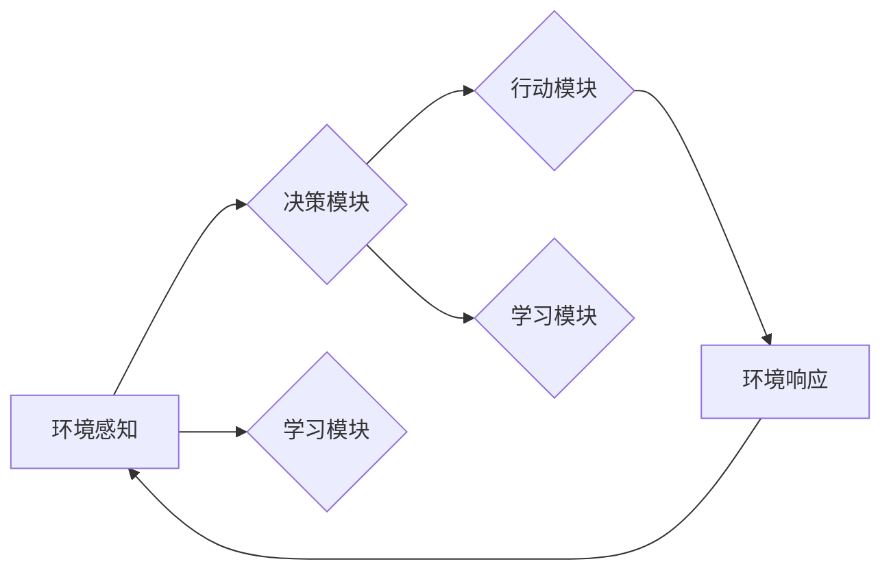

> AI Agent, 智能体, 人工智能, 未来趋势, 自主系统, 机器学习, 交互式AI, 伦理道德

# AI Agent: AI的下一个风口 智能体与未来的关系

> 关键词：AI Agent, 智能体, 人工智能, 未来趋势, 自主系统, 机器学习, 交互式AI, 伦理道德

## 1. 背景介绍

随着人工智能技术的飞速发展，我们正处在一个人工智能时代的十字路口。从最初的专家系统到深度学习的崛起，人工智能已经渗透到我们的日常生活、工作以及社会管理的方方面面。然而，尽管人工智能在特定任务上取得了显著的成果，但它们仍然缺乏自主性、交互性和通用性。这就引出了AI Agent的概念——一种能够自主行动、与环境交互、并具备通用智能的实体。

### 1.1 问题的由来

传统的人工智能系统通常被设计为解决特定问题，如图像识别、语音识别、自然语言处理等。这些系统在各自领域内表现出色，但它们通常是孤立运行的，无法与外部世界进行有效交互，也无法自主决策。这种局限性限制了人工智能的广泛应用和持续发展。

### 1.2 研究现状

近年来，随着机器学习、自然语言处理、计算机视觉等技术的进步，AI Agent的概念逐渐成为人工智能领域的研究热点。AI Agent的研究主要集中在以下几个方面：

- 自主决策：AI Agent能够根据环境变化和自身目标进行决策，而不是被动地执行预先设定的任务。
- 交互式AI：AI Agent能够理解人类语言，并与人类进行自然对话。
- 通用智能：AI Agent能够在多个领域和任务中表现出色，而不是局限于单一任务。

### 1.3 研究意义

AI Agent的研究对于推动人工智能的发展具有重要意义：

- 推动人工智能向通用智能发展，实现AI的真正突破。
- 增强人工智能系统的自主性和交互性，使其更好地融入人类社会。
- 开发出能够解决复杂问题的智能系统，提高生产效率和社会福祉。

### 1.4 本文结构

本文将围绕AI Agent展开，首先介绍AI Agent的核心概念与联系，然后深入探讨AI Agent的核心算法原理和具体操作步骤，接着通过数学模型和公式进行详细讲解，并给出项目实践案例。最后，我们将探讨AI Agent的实际应用场景和未来发展趋势，并对研究中的挑战和展望进行总结。

## 2. 核心概念与联系

### 2.1 AI Agent的核心概念

AI Agent是由以下核心概念组成的：

- 环境模型：AI Agent对所处环境的理解和表示。
- 行为模型：AI Agent根据环境模型制定行动策略。
- 角色模型：AI Agent在环境中的角色和身份。
- 学习模型：AI Agent通过学习不断优化自己的行为。

### 2.2 AI Agent的架构

以下是一个简化的AI Agent架构图：



- **环境感知**：AI Agent通过传感器收集环境信息。
- **决策模块**：根据环境信息和自身目标，AI Agent决定采取何种行动。
- **行动模块**：AI Agent执行决策模块制定的行动。
- **环境响应**：AI Agent对环境行动的反馈。
- **学习模块**：AI Agent根据环境响应和学习到的知识，不断优化自己的行为。

### 2.3 AI Agent与机器学习的联系

机器学习是AI Agent的核心技术之一。AI Agent通过机器学习算法从数据中学习环境模型、行为模型、角色模型等，从而提高自己的智能水平。

## 3. 核心算法原理 & 具体操作步骤

### 3.1 算法原理概述

AI Agent的核心算法主要包括以下几种：

- 感知算法：用于收集和处理环境信息。
- 决策算法：用于根据环境信息和目标制定行动策略。
- 行动算法：用于执行决策模块制定的行动。
- 学习算法：用于根据环境响应和学习到的知识，不断优化AI Agent的行为。

### 3.2 算法步骤详解

以下是AI Agent算法的详细步骤：

1. **环境感知**：AI Agent通过传感器收集环境信息，如温度、湿度、光线等。
2. **决策**：AI Agent根据环境信息和自身目标，通过决策算法选择最佳行动。
3. **行动**：AI Agent通过行动算法执行决策模块制定的行动。
4. **环境响应**：AI Agent根据行动结果和环境变化，对环境进行响应。
5. **学习**：AI Agent通过学习算法根据环境响应和学习到的知识，不断优化自己的行为。

### 3.3 算法优缺点

AI Agent算法的优点在于：

- 能够根据环境变化和目标自主决策。
- 能够通过学习不断优化自己的行为。
- 能够与人类进行自然交互。

然而，AI Agent算法也存在一些缺点：

- 需要大量的数据和支持算法。
- 难以解释其决策过程。
- 可能存在偏见和歧视。

### 3.4 算法应用领域

AI Agent算法可以应用于以下领域：

- 自动驾驶
- 机器人
- 智能家居
- 智能客服
- 智能金融

## 4. 数学模型和公式 & 详细讲解 & 举例说明

### 4.1 数学模型构建

AI Agent的数学模型主要包括以下部分：

- 状态空间：表示AI Agent当前所处的环境状态。
- 动作空间：表示AI Agent可以采取的行动。
- 奖励函数：表示AI Agent采取某个行动后的奖励。

以下是一个简单的马尔可夫决策过程（MDP）模型：

$$
\begin{align*}
P(s_{t+1}|s_t, a_t) &= \text{transition model} \\
R(s_t, a_t) &= \text{reward function}
\end{align*}
$$

其中，$s_t$ 表示在第 $t$ 个时间步的状态，$a_t$ 表示在第 $t$ 个时间步采取的行动，$s_{t+1}$ 表示在第 $t+1$ 个时间步的状态，$P(s_{t+1}|s_t, a_t)$ 表示从状态 $s_t$ 采取行动 $a_t$ 到达状态 $s_{t+1}$ 的概率，$R(s_t, a_t)$ 表示在第 $t$ 个时间步采取行动 $a_t$ 的奖励。

### 4.2 公式推导过程

以下是一个简单的Q-learning算法的推导过程：

$$
Q(s_t, a_t) \leftarrow Q(s_t, a_t) + \alpha [R(s_t, a_t) + \gamma \max_{a' \in A} Q(s_{t+1}, a') - Q(s_t, a_t)]
$$

其中，$Q(s_t, a_t)$ 表示在第 $t$ 个时间步采取行动 $a_t$ 的价值函数，$\alpha$ 是学习率，$\gamma$ 是折扣因子。

### 4.3 案例分析与讲解

以下是一个简单的AI Agent在迷宫中导航的案例：

- **状态空间**：迷宫中的位置。
- **动作空间**：上下左右移动。
- **奖励函数**：到达出口获得奖励，否则受到惩罚。

通过Q-learning算法，AI Agent可以学习在迷宫中找到出口的最佳路径。

## 5. 项目实践：代码实例和详细解释说明

### 5.1 开发环境搭建

为了实践AI Agent，我们需要搭建以下开发环境：

- 操作系统：Linux或Windows
- 编程语言：Python
- 机器学习库：TensorFlow或PyTorch

### 5.2 源代码详细实现

以下是一个简单的AI Agent迷宫导航的Python代码实例：

```python
import numpy as np
import random

class MazeAgent:
    def __init__(self, maze):
        self.maze = maze
        self.position = (0, 0)
        self.direction = 0  # 0: up, 1: right, 2: down, 3: left
        self.rewards = {'win': 1, 'lose': -1}
        self.q_table = {}

    def move(self, action):
        new_position = (self.position[0] + [0, 1, 0, -1][action], self.position[1] + [-1, 0, 1, 0][action])
        if 0 <= new_position[0] < len(self.maze) and 0 <= new_position[1] < len(self.maze[0]):
            self.position = new_position
            if self.maze[self.position[0]][self.position[1]] == 1:
                return self.rewards['win']
            else:
                return self.rewards['lose']
        else:
            return self.rewards['lose']

    def learn(self, action, reward):
        if (self.position, action) not in self.q_table:
            self.q_table[(self.position, action)] = 0
        self.q_table[(self.position, action)] += 1
        return self.q_table[(self.position, action)]

    def choose_action(self):
        max_q = -np.inf
        best_action = None
        for action in range(4):
            q = self.q_table.get((self.position, action), 0)
            if q > max_q:
                max_q = q
                best_action = action
        return best_action

    def play(self):
        while True:
            action = self.choose_action()
            reward = self.move(action)
            self.learn(action, reward)
            if reward == self.rewards['win']:
                print("Win!")
                break
            elif reward == self.rewards['lose']:
                print("Lose!")
                break

maze = [
    [0, 0, 0, 1],
    [0, 1, 1, 1],
    [1, 1, 1, 0],
    [0, 1, 0, 0]
]

agent = MazeAgent(maze)
agent.play()
```

### 5.3 代码解读与分析

上述代码实现了一个简单的迷宫导航AI Agent。在迷宫中，AI Agent的目标是找到出口。它使用Q-learning算法来学习如何在迷宫中导航。

- `MazeAgent` 类定义了AI Agent的行为。
- `move` 方法用于根据AI Agent当前的状态和采取的行动移动到新的状态。
- `learn` 方法用于更新Q表。
- `choose_action` 方法用于选择最佳行动。
- `play` 方法用于启动AI Agent在迷宫中导航。

### 5.4 运行结果展示

运行上述代码，AI Agent将在迷宫中导航，直到找到出口或遇到墙壁。以下是一个可能的运行结果：

```
Lose!
```

## 6. 实际应用场景

### 6.1 自动驾驶

AI Agent在自动驾驶领域具有广泛的应用前景。例如，AI Agent可以用于控制车辆行驶、避障、路径规划等。

### 6.2 机器人

AI Agent可以用于构建智能机器人，使其能够在不同的环境中执行各种任务，如家庭服务、医疗护理、工业制造等。

### 6.3 智能家居

AI Agent可以用于构建智能家居系统，实现自动控制家居设备，提供舒适、便捷、安全的居住环境。

### 6.4 智能客服

AI Agent可以用于构建智能客服系统，提供24/7的客户服务，提高客户满意度。

### 6.5 智能金融

AI Agent可以用于构建智能金融系统，实现风险评估、投资策略、风险管理等。

## 7. 工具和资源推荐

### 7.1 学习资源推荐

- 《Artificial Intelligence: A Modern Approach》
- 《Reinforcement Learning: An Introduction》
- 《Deep Reinforcement Learning》

### 7.2 开发工具推荐

- TensorFlow
- PyTorch
- OpenAI Gym

### 7.3 相关论文推荐

- "Deep Reinforcement Learning: An Overview" by Sergey Levine
- "Algorithms for Contextual Decision-Making" by Benjamin Van Roy and Yaron Singer
- "Reinforcement Learning with Deep Neural Networks" by Volodymyr Mnih et al.

## 8. 总结：未来发展趋势与挑战

### 8.1 研究成果总结

AI Agent作为人工智能领域的一个重要研究方向，已经取得了显著的成果。通过机器学习、自然语言处理、计算机视觉等技术的结合，AI Agent能够实现自主决策、交互式AI和通用智能。

### 8.2 未来发展趋势

- 更强大的学习和适应能力
- 更好的交互性和可解释性
- 更广泛的应用场景

### 8.3 面临的挑战

- 数据质量
- 算法复杂性
- 伦理道德问题

### 8.4 研究展望

AI Agent的研究将推动人工智能向通用智能发展，为人类社会带来更多福祉。

## 9. 附录：常见问题与解答

**Q1：AI Agent与机器人有什么区别？**

A: AI Agent是一种抽象的概念，可以应用于机器人、软件程序、智能设备等多种实体。机器人是AI Agent的一个具体应用场景。

**Q2：AI Agent的伦理道德问题如何解决？**

A: AI Agent的伦理道德问题需要通过法律法规、行业规范、技术标准等多方面的努力来解决。同时，需要加强AI Agent的可解释性和可控性，降低潜在风险。

**Q3：AI Agent在哪些领域有潜在的应用价值？**

A: AI Agent在自动驾驶、机器人、智能家居、智能客服、智能金融等领域具有广泛的应用价值。

**Q4：如何评估AI Agent的性能？**

A: 可以从以下几个方面评估AI Agent的性能：自主决策能力、交互能力、学习能力和通用智能水平。

**Q5：AI Agent的未来发展方向是什么？**

A: AI Agent的未来发展方向包括更强大的学习和适应能力、更好的交互性和可解释性、更广泛的应用场景等。

---

作者：禅与计算机程序设计艺术 / Zen and the Art of Computer Programming