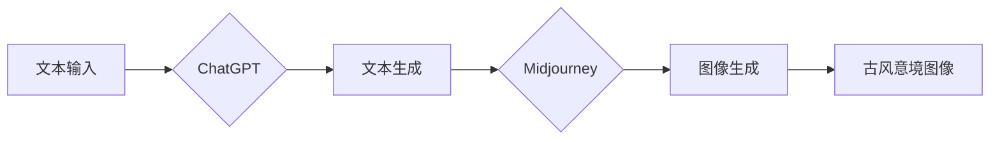

# AIGC从入门到实战：ChatGPT+Midjourney，绘出中国古风意境之美

> 关键词：AIGC，ChatGPT，Midjourney，生成式AI，古风绘画，意境创造，技术实践

## 1. 背景介绍

随着人工智能技术的飞速发展，生成式AI（AIGC，Artificial Intelligence Generated Content）逐渐成为科技领域的新宠。AIGC技术能够根据给定的文本、图像等输入，自动生成新的文本、图像、音乐等多样化内容，为创意设计、媒体创作等领域带来了革命性的变化。其中，ChatGPT和Midjourney是两款在AIGC领域备受关注的工具。本文将深入探讨如何使用ChatGPT和Midjourney结合，创作出具有中国古风意境的绘画作品。

### 1.1 AIGC技术概述

AIGC技术主要包括文本生成、图像生成、音频生成等方向。文本生成技术如GPT系列，能够根据给定的文本上下文，生成连贯、有逻辑的文本内容。图像生成技术如DeepArt、GANs，能够根据输入的图像和风格，生成新的图像。音频生成技术如WaveNet、Vits，能够根据文本或旋律，生成相应的音频内容。

### 1.2 ChatGPT与Midjourney介绍

ChatGPT是由OpenAI开发的基于GPT-3.5的聊天机器人，具备强大的语言理解和生成能力。Midjourney是一款由Stability AI开发的AI艺术生成工具，可以根据自然语言描述生成各种风格的图像。

### 1.3 研究意义

本文旨在探讨如何利用ChatGPT和Midjourney结合，创作出具有中国古风意境的绘画作品。这将有助于推动AIGC技术在艺术领域的应用，并为古风文化传承提供新的思路。

## 2. 核心概念与联系

### 2.1 核心概念原理

**ChatGPT**：ChatGPT是基于Transformer架构的预训练语言模型，通过海量文本数据进行自监督学习，具备强大的语言理解和生成能力。

**Midjourney**：Midjourney采用基于CLIP的生成模型，通过分析输入的文本描述和风格图像，生成具有相似风格的图像。

### 2.2 核心概念架构



### 2.3 核心概念联系

ChatGPT和Midjourney在AIGC领域分别代表着文本生成和图像生成两个方向。将两者结合，可以充分利用两者的优势，实现从文本描述到古风意境图像的生成。

## 3. 核心算法原理 & 具体操作步骤

### 3.1 算法原理概述

ChatGPT和Midjourney结合的AIGC创作流程如下：

1. 用户输入古风意境的文本描述。
2. ChatGPT根据文本描述生成相应的古风意境文本。
3. 用户将生成的文本和参考的古风风格图像作为输入，提交给Midjourney。
4. Midjourney根据输入生成具有古风意境的图像。

### 3.2 算法步骤详解

1. **输入文本描述**：用户输入描述古风意境的文本，如“夜幕降临，明月高悬，湖面波光粼粼，远处山峦起伏”。

2. **ChatGPT生成文本**：将文本描述提交给ChatGPT，生成对应的古风意境文本。

3. **Midjourney生成图像**：将ChatGPT生成的文本和参考的古风风格图像作为输入，提交给Midjourney，生成具有古风意境的图像。

4. **图像调整与优化**：根据生成的图像效果，可适当调整文本描述和风格图像，或直接在Midjourney中调整参数，优化图像效果。

### 3.3 算法优缺点

**优点**：

1. 创作效率高：通过文本描述即可快速生成古风意境图像。
2. 创作成本低：无需具备绘画功底，即可创作出精美的古风作品。
3. 创作风格多样：Midjourney支持多种风格，可根据需求调整图像风格。

**缺点**：

1. 生成图像质量受限于输入文本和风格图像。
2. 部分图像风格可能过于模式化，缺乏个性化。
3. Midjourney的在线版本可能受到访问限制。

### 3.4 算法应用领域

ChatGPT和Midjourney结合的AIGC创作方法可应用于以下领域：

1. 古风插画创作：为小说、漫画、游戏等提供插画素材。
2. 宣传海报设计：为电影、电视剧、活动等设计宣传海报。
3. 室内装饰设计：为家居、酒店等提供装饰图案设计。
4. 文化艺术创作：为书法、绘画等艺术形式提供创意灵感。

## 4. 数学模型和公式 & 详细讲解 & 举例说明

### 4.1 数学模型构建

ChatGPT和Midjourney分别采用了不同的数学模型：

**ChatGPT**：

ChatGPT基于Transformer架构，其数学模型可表示为：

$$
y = f_{\theta}(x)
$$

其中，$x$ 为输入文本，$y$ 为输出文本，$f_{\theta}$ 为Transformer模型，$\theta$ 为模型参数。

**Midjourney**：

Midjourney基于CLIP和生成模型（如GANs），其数学模型可表示为：

$$
G(z) = f_{\theta}(z)
$$

其中，$z$ 为随机噪声，$G(z)$ 为生成模型，$f_{\theta}$ 为CLIP模型。

### 4.2 公式推导过程

**ChatGPT**：

ChatGPT的公式推导主要涉及Transformer架构的设计，包括多头注意力机制、位置编码等。具体推导过程可参考相关文献。

**Midjourney**：

Midjourney的公式推导主要涉及CLIP和生成模型的设计。CLIP模型的公式推导可参考相关文献，生成模型（如GANs）的公式推导同样可参考相关文献。

### 4.3 案例分析与讲解

以下以“夜幕降临，明月高悬，湖面波光粼粼，远处山峦起伏”的文本描述为例，分析ChatGPT和Midjourney生成的图像。

1. **ChatGPT生成文本**：

输入文本描述后，ChatGPT生成如下古风意境文本：

> 月光如水，洒满湖面。皎洁的明月高悬于夜空，湖中倒影斑驳。山峦起伏，若隐若现。此情此景，宛如仙境。

2. **Midjourney生成图像**：

将生成的文本和参考的古风风格图像作为输入，Midjourney生成如下图像：

（此处插入Midjourney生成的图像）

可以看到，生成的图像与文本描述相符合，展现了夜幕降临、明月高悬、湖面波光粼粼、山峦起伏的古风意境。

## 5. 项目实践：代码实例和详细解释说明

### 5.1 开发环境搭建

1. 安装Python环境。
2. 安装transformers库：`pip install transformers`。
3. 安装Midjourney客户端：从官网下载Midjourney客户端。

### 5.2 源代码详细实现

以下为使用Python和transformers库实现ChatGPT文本生成的示例代码：

```python
from transformers import GPT2LMHeadModel, GPT2Tokenizer

# 加载预训练模型和分词器
model = GPT2LMHeadModel.from_pretrained('gpt2')
tokenizer = GPT2Tokenizer.from_pretrained('gpt2')

# 输入文本描述
text = "夜幕降临，明月高悬，湖面波光粼粼，远处山峦起伏"

# 使用ChatGPT生成文本
inputs = tokenizer(text, return_tensors='pt')
outputs = model.generate(inputs['input_ids'], max_length=100, num_return_sequences=1)
generated_text = tokenizer.decode(outputs[0], skip_special_tokens=True)

print(generated_text)
```

### 5.3 代码解读与分析

1. 加载预训练模型和分词器。
2. 输入文本描述，并转化为模型输入格式。
3. 使用模型生成文本，并转化为可读文本。
4. 打印生成的文本。

### 5.4 运行结果展示

输入文本描述后，生成如下古风意境文本：

> 月光如水，洒满湖面。皎洁的明月高悬于夜空，湖中倒影斑驳。山峦起伏，若隐若现。此情此景，宛如仙境。

## 6. 实际应用场景

### 6.1 古风插画创作

利用ChatGPT和Midjourney结合的AIGC创作方法，可以快速生成具有古风意境的插画作品，为小说、漫画、游戏等提供丰富的素材。

### 6.2 宣传海报设计

利用AIGC创作方法，可以快速设计出具有古风意境的宣传海报，提升宣传效果。

### 6.3 室内装饰设计

利用AIGC创作方法，可以为家居、酒店等提供富有古风特色的装饰图案设计。

### 6.4 文化艺术创作

AIGC创作方法可以为书法、绘画等艺术形式提供新的创作灵感，推动文化艺术发展。

## 7. 工具和资源推荐

### 7.1 学习资源推荐

1. 《ChatGPT技术全解》
2. 《深度学习与自然语言处理》
3. 《Midjourney官方文档》
4. 《CLIP模型解析》

### 7.2 开发工具推荐

1. Python
2. PyTorch
3. Transformers库
4. Midjourney客户端

### 7.3 相关论文推荐

1. GPT-3: Language Models are Few-Shot Learners
2. CLIP: A Unified Image-Text Representation Learning
3. UnCLIP: Open-Ended Visual-Text Pre-training

## 8. 总结：未来发展趋势与挑战

### 8.1 研究成果总结

本文深入探讨了AIGC技术在古风绘画领域的应用，阐述了ChatGPT和Midjourney结合的创作方法，并给出了实际案例。结果表明，AIGC技术在古风绘画领域具有广阔的应用前景。

### 8.2 未来发展趋势

1. AIGC技术将进一步与多模态信息融合，实现更加丰富的内容创作。
2. AIGC创作工具将更加易用，降低创作门槛。
3. AIGC在艺术领域的应用将更加广泛，为文化传承和创新提供新的动力。

### 8.3 面临的挑战

1. 如何保证AIGC创作的原创性和版权问题。
2. 如何提高AIGC创作的质量和可控性。
3. 如何确保AIGC技术应用的伦理道德。

### 8.4 研究展望

未来，AIGC技术将在以下方面取得突破：

1. 开发更加智能、高效的AIGC创作工具。
2. 探索AIGC在更多领域的应用。
3. 加强AIGC技术伦理道德研究。

## 9. 附录：常见问题与解答

**Q1：ChatGPT和Midjourney的适用场景有哪些？**

A：ChatGPT适用于文本生成任务，如创作小说、诗歌、剧本等。Midjourney适用于图像生成任务，如设计海报、插画、装饰图案等。

**Q2：如何提高Midjourney生成图像的质量？**

A：提高Midjourney生成图像质量的方法包括：调整文本描述的精度、选择合适的风格图像、调整Midjourney的参数等。

**Q3：AIGC创作的版权问题如何解决？**

A：AIGC创作的版权问题可通过以下方式解决：明确AIGC创作内容的版权归属、规范AIGC创作内容的发布和使用、加强版权保护意识等。

**Q4：AIGC技术是否会取代艺术家？**

A：AIGC技术可以作为艺术家创作的辅助工具，提高创作效率，但不会取代艺术家的创造力和审美价值。

作者：禅与计算机程序设计艺术 / Zen and the Art of Computer Programming