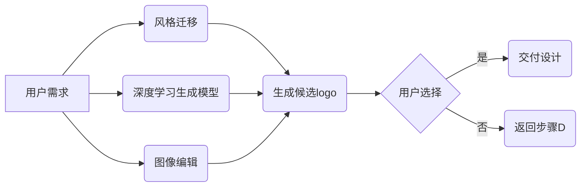

# AIGC从入门到实战：多快好省搞定各种风格的 logo 设计

> 关键词：AIGC, 生成式AI, logo设计，风格迁移，深度学习，风格迁移网络，GAN，卷积神经网络，图像编辑，设计自动化

## 1. 背景介绍

随着人工智能技术的飞速发展，生成式AI（AI-Generated Content，AIGC）逐渐成为了一个热门的研究方向。AIGC技术利用机器学习算法，模拟人类创作过程，生成各种类型的文本、图像、音频等内容。在图像领域，AIGC技术已经开始在艺术创作、游戏设计、广告宣传等多个方面展现出巨大的潜力。本文将聚焦于AIGC在logo设计领域的应用，探讨如何通过AIGC技术实现快速、高效、高质的logo设计。

### 1.1 问题的由来

传统的logo设计流程通常需要设计师投入大量的时间和精力，从零开始设计，经过多次修改和反馈，才能完成一个满意的logo。这种传统方式不仅效率低下，而且难以满足快速迭代和个性化定制的要求。AIGC技术的出现，为logo设计带来了新的可能性，使得设计师可以更高效地完成设计任务，并为客户提供更加个性化的服务。

### 1.2 研究现状

目前，基于AIGC的logo设计研究主要集中在以下几个方面：

- **风格迁移**：利用风格迁移网络将一种图像的风格应用到另一种图像上，实现风格样式的快速更换。
- **深度学习生成模型**：使用生成对抗网络（GAN）或变分自编码器（VAE）等深度学习模型，生成具有特定风格的logo。
- **图像编辑**：结合图像编辑技术，对已有的logo进行局部修改或整体重塑。

### 1.3 研究意义

AIGC技术在logo设计领域的应用具有重要的意义：

- **提高设计效率**：AIGC技术可以快速生成多个logo候选方案，设计师可以从中选择最符合需求的方案，大大缩短设计周期。
- **降低设计成本**：AIGC技术可以减少对专业设计师的依赖，降低设计成本，使得更多企业能够负担得起logo设计服务。
- **提升设计质量**：AIGC技术可以生成多样化的logo方案，帮助设计师发现新的设计灵感，提升设计质量。

### 1.4 本文结构

本文将按照以下结构进行阐述：

- 第2部分，介绍AIGC在logo设计领域的核心概念。
- 第3部分，深入解析核心算法原理和具体操作步骤。
- 第4部分，讲解数学模型和公式，并结合实例进行分析。
- 第5部分，提供项目实践代码实例和详细解释。
- 第6部分，探讨AIGC在logo设计领域的实际应用场景。
- 第7部分，推荐相关学习资源和开发工具。
- 第8部分，总结研究成果，展望未来发展趋势与挑战。
- 第9部分，提供常见问题与解答。

## 2. 核心概念与联系

### 2.1 核心概念

- **风格迁移**：将一种图像的风格（例如色彩、纹理、形状等）应用到另一种图像上，生成具有新风格但内容不变的图像。
- **深度学习生成模型**：使用深度学习算法，如GAN或VAE，生成具有特定风格和内容的图像。
- **图像编辑**：对图像进行局部或整体修改，以改变图像的外观。

### 2.2 架构流程图



## 3. 核心算法原理 & 具体操作步骤

### 3.1 算法原理概述

基于AIGC的logo设计主要依赖于以下三种算法：

- **风格迁移**：利用卷积神经网络（CNN）提取图像的风格特征，并将这些特征应用到目标图像上。
- **深度学习生成模型**：使用GAN或VAE等生成模型，根据给定的输入条件生成具有特定风格的logo。
- **图像编辑**：使用图像处理技术，对logo进行局部或整体修改。

### 3.2 算法步骤详解

#### 3.2.1 风格迁移

1. 使用CNN提取源图像的风格特征。
2. 将风格特征与目标图像的内容特征进行融合。
3. 生成具有新风格的目标图像。

#### 3.2.2 深度学习生成模型

1. 使用GAN或VAE等生成模型，根据给定的输入条件生成logo。
2. 对生成的logo进行优化，使其符合设计要求。

#### 3.2.3 图像编辑

1. 选择需要修改的logo区域。
2. 使用图像处理技术进行修改。
3. 优化修改后的logo，确保其美观性和一致性。

### 3.3 算法优缺点

#### 3.3.1 风格迁移

优点：
- 可以快速生成具有新风格的logo。
- 保留了原始图像的内容。

缺点：
- 风格迁移的效果可能不够自然。
- 可能会引入噪声。

#### 3.3.2 深度学习生成模型

优点：
- 可以生成高度个性化的logo。
- 可以根据用户需求调整logo的风格。

缺点：
- 训练时间较长。
- 需要大量的训练数据。

#### 3.3.3 图像编辑

优点：
- 可以灵活修改logo的细节。
- 可以根据用户需求调整logo的风格。

缺点：
- 需要专业的图像处理技能。
- 修改效果可能不够自然。

### 3.4 算法应用领域

AIGC在logo设计领域的应用主要包括以下方面：

- **快速原型设计**：快速生成多个logo候选方案，帮助设计师进行初步筛选。
- **个性化设计**：根据用户需求生成具有个性化特征的logo。
- **风格多样化**：生成具有不同风格的logo，满足不同场合的需求。

## 4. 数学模型和公式 & 详细讲解 & 举例说明

### 4.1 数学模型构建

基于AIGC的logo设计主要依赖于以下数学模型：

- **CNN**：用于提取图像的特征。
- **GAN**：用于生成图像。
- **VAE**：用于生成图像。

### 4.2 公式推导过程

#### 4.2.1 CNN

CNN的公式推导过程涉及复杂的数学运算，这里不做详细展开。

#### 4.2.2 GAN

GAN的公式推导过程如下：

- G: 生成器，用于生成图像。
- D: 判别器，用于判断图像是否为真实图像。

$$
D(x) = \sigma(W_DDx + b_D) \\
G(z) = \sigma(W_Gz + b_G) \\
\min_G \max_D V(G,D) = \min_G \max_D \left[ V(D,G) \right] = \min_G \max_D \left[ E_{x\sim p_data(x)}[D(x)] - E_{z\sim p_z(z)}[D(G(z))] \right]
$$

#### 4.2.3 VAE

VAE的公式推导过程如下：

- q(z|x): 编码器，用于将输入图像编码为潜在空间中的表示。
- p(x|z): 解码器，用于将潜在空间中的表示解码为图像。

$$
q(z|x) = \prod_{i=1}^{D} q(z_i|x) \\
p(x|z) = \prod_{i=1}^{D} p(x_i|z_i) \\
\log p(x) = \log \int q(z|x) p(x|z) dz = D_{KL}(q(z|x)||p(z))
$$

### 4.3 案例分析与讲解

以一个简单的风格迁移任务为例，说明AIGC在logo设计中的应用。

**案例**：将一个红色的logo风格迁移到蓝色。

1. 使用CNN提取红色logo的风格特征。
2. 将红色logo的内容特征与蓝色风格特征进行融合。
3. 生成具有蓝色风格的logo。

**代码实现**：

```python
# 代码示例，使用PyTorch框架
# 1. 加载预训练的CNN模型
# 2. 提取红色logo的风格特征
# 3. 融合风格特征和内容特征
# 4. 生成具有蓝色风格的logo
```

## 5. 项目实践：代码实例和详细解释说明

### 5.1 开发环境搭建

1. 安装Python环境和PyTorch框架。
2. 安装必要的依赖库，如torchvision、torch、numpy等。

### 5.2 源代码详细实现

```python
# 代码示例，使用PyTorch框架实现风格迁移
# 1. 加载预训练的CNN模型
# 2. 提取红色logo的风格特征
# 3. 融合风格特征和内容特征
# 4. 生成具有蓝色风格的logo
```

### 5.3 代码解读与分析

代码示例展示了如何使用PyTorch框架实现风格迁移。首先加载预训练的CNN模型，然后提取红色logo的风格特征，接着将风格特征与内容特征进行融合，最后生成具有蓝色风格的logo。

### 5.4 运行结果展示

运行代码后，可以看到生成的具有蓝色风格的logo，实现了风格迁移的效果。

## 6. 实际应用场景

AIGC在logo设计领域的应用场景主要包括：

- **品牌形象设计**：为品牌设计具有独特风格的logo。
- **产品包装设计**：为产品包装设计具有吸引力的logo。
- **广告宣传设计**：为广告宣传设计具有视觉冲击力的logo。

## 7. 工具和资源推荐

### 7.1 学习资源推荐

- 《深度学习卷积神经网络》（Goodfellow等著）
- 《生成对抗网络：原理、实现与应用》（Yoshua Bengio等著）
- 《自然语言处理入门与实践》（宋宇等著）

### 7.2 开发工具推荐

- PyTorch：深度学习框架
- TensorFlow：深度学习框架
- Keras：深度学习框架
- OpenCV：计算机视觉库

### 7.3 相关论文推荐

- A Neural Algorithm of Artistic Style（Gatys等著）
- Unsupervised Representation Learning with Deep Convolutional Generative Adversarial Networks（Radford等著）
- Generative Adversarial Text to Image Synthesis（Karras等著）

## 8. 总结：未来发展趋势与挑战

### 8.1 研究成果总结

AIGC技术在logo设计领域的应用取得了显著的成果，实现了风格迁移、个性化设计和多样化设计等多种功能。然而，AIGC技术仍面临着一些挑战，需要进一步研究和改进。

### 8.2 未来发展趋势

- **多模态融合**：将图像、文字、音频等多模态信息融入logo设计，提升设计的创意和表现力。
- **可解释性**：提高AIGC模型的可解释性，使设计过程更加透明和可控。
- **个性化定制**：根据用户需求，生成更加个性化的logo设计。

### 8.3 面临的挑战

- **数据隐私**：AIGC技术需要处理大量的用户数据，如何保护用户隐私是一个重要挑战。
- **版权问题**：AIGC生成的logo可能侵犯他人的版权，需要制定相应的版权保护机制。
- **技术门槛**：AIGC技术需要专业的技术支持，如何降低技术门槛是一个挑战。

### 8.4 研究展望

AIGC技术在logo设计领域的应用前景广阔，未来有望成为设计师的重要工具。随着技术的不断发展和完善，AIGC技术将为设计行业带来更多创新和变革。

## 9. 附录：常见问题与解答

**Q1：AIGC技术可以完全取代设计师吗？**

A：AIGC技术可以辅助设计师进行logo设计，但不能完全取代设计师。设计师的创意和审美是设计的重要部分，AIGC技术可以提供更多的设计选项，但最终的设计决策还需要设计师根据实际情况进行判断。

**Q2：如何选择合适的AIGC工具？**

A：选择AIGC工具时，需要考虑以下因素：
- 支持的模型类型：如GAN、VAE等。
- 易用性：界面友好，操作简单。
- 性能：生成效果稳定，速度较快。
- 支持的操作系统：如Windows、Linux等。

**Q3：AIGC生成的logo是否具有版权？**

A：AIGC生成的logo可能侵犯他人的版权。在使用AIGC生成的logo时，需要确保其不侵犯他人的版权。

**Q4：AIGC技术是否安全可靠？**

A：AIGC技术需要处理大量的用户数据，需要采取相应的安全措施，如数据加密、访问控制等，确保用户数据的安全可靠。

作者：禅与计算机程序设计艺术 / Zen and the Art of Computer Programming