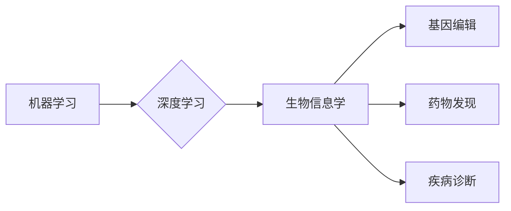

> 关键词：人工智能，生物学，交叉学科，基因编辑，机器学习，深度学习，生物信息学，代码实战，案例研究

# AI与生物学交叉原理与代码实战案例讲解

随着人工智能技术的飞速发展，它已经渗透到了我们生活的方方面面。而生物学，作为一门研究生命现象和生命活动规律的科学，也正与人工智能技术产生越来越紧密的交集。本文将深入探讨AI与生物学的交叉原理，并通过代码实战案例讲解，展示两者结合的强大潜力。

## 1. 背景介绍

### 1.1 问题的由来

生物学作为一门复杂的科学，涉及大量数据分析和复杂模型的构建。传统的生物学研究方法往往依赖于实验和统计分析，而人工智能技术，尤其是机器学习和深度学习，为生物学研究提供了新的思路和方法。

### 1.2 研究现状

近年来，AI与生物学的交叉研究取得了显著成果，主要集中在以下几个方面：

- **基因编辑**：利用CRISPR等技术，人工智能可以辅助设计高效的基因编辑方案。
- **药物发现**：AI可以加速新药的发现过程，提高药物研发的效率和成功率。
- **疾病诊断**：AI可以辅助医生进行疾病诊断，提高诊断的准确性和效率。
- **生物信息学**：AI可以处理和分析海量的生物数据，为生物学研究提供新的视角。

### 1.3 研究意义

AI与生物学的交叉研究具有以下重要意义：

- **推动生物学研究**：AI可以帮助生物学家解决复杂问题，推动生物学研究的进步。
- **加速药物研发**：AI可以加速新药的发现，为人类健康事业做出贡献。
- **提高疾病诊断准确性**：AI可以帮助医生更准确地诊断疾病，提高治疗效果。
- **促进生物信息学发展**：AI可以帮助生物信息学家处理和分析海量的生物数据。

### 1.4 本文结构

本文将首先介绍AI与生物学的交叉原理，然后通过代码实战案例讲解，展示AI在生物学研究中的应用。具体结构如下：

- **第2章**：介绍AI与生物学的交叉原理。
- **第3章**：讲解核心算法原理和具体操作步骤。
- **第4章**：介绍数学模型和公式。
- **第5章**：进行项目实践，给出代码实例和详细解释。
- **第6章**：探讨实际应用场景。
- **第7章**：推荐相关工具和资源。
- **第8章**：总结未来发展趋势与挑战。
- **第9章**：附录，常见问题与解答。

## 2. 核心概念与联系

### 2.1 核心概念原理

AI与生物学的交叉涉及多个核心概念，以下是一些关键概念：

- **机器学习**：通过算法从数据中学习，使计算机能够执行特定任务。
- **深度学习**：一种特殊的机器学习方法，使用多层神经网络模拟人脑处理信息的方式。
- **生物信息学**：应用计算机技术和算法分析生物数据。
- **基因编辑**：利用CRISPR等技术对基因进行精确编辑。
- **药物发现**：通过计算机模拟和实验寻找新药。

### 2.2 核心概念架构

以下是一个简单的Mermaid流程图，展示AI与生物学交叉的核心概念架构：



## 3. 核心算法原理 & 具体操作步骤

### 3.1 算法原理概述

AI与生物学的交叉算法主要包括以下几种：

- **监督学习**：使用标注数据进行训练，学习输入与输出之间的关系。
- **无监督学习**：使用未标注数据进行训练，发现数据中的模式和结构。
- **深度学习**：使用多层神经网络进行特征提取和学习。

### 3.2 算法步骤详解

以下是一个简单的基因编辑项目的基本步骤：

1. **数据收集**：收集相关的基因序列数据。
2. **数据预处理**：对数据进行清洗和格式化。
3. **特征工程**：从数据中提取特征。
4. **模型选择**：选择合适的机器学习或深度学习模型。
5. **模型训练**：使用训练数据训练模型。
6. **模型评估**：使用测试数据评估模型性能。
7. **模型优化**：根据评估结果优化模型。

### 3.3 算法优缺点

- **监督学习**：优点是性能稳定，缺点是需要大量标注数据。
- **无监督学习**：优点是不需要标注数据，缺点是难以控制模型性能。
- **深度学习**：优点是能够自动学习特征，缺点是计算成本高，需要大量数据。

### 3.4 算法应用领域

AI与生物学的交叉算法在以下领域有广泛应用：

- **基因编辑**：设计高效的基因编辑方案。
- **药物发现**：加速新药的发现过程。
- **疾病诊断**：辅助医生进行疾病诊断。
- **生物信息学**：处理和分析海量的生物数据。

## 4. 数学模型和公式 & 详细讲解 & 举例说明

### 4.1 数学模型构建

在AI与生物学的交叉研究中，常用的数学模型包括：

- **神经网络**：通过多层节点模拟人脑处理信息的方式。
- **决策树**：通过树形结构对数据进行分类或回归。
- **支持向量机**：通过寻找最佳的超平面进行分类或回归。

### 4.2 公式推导过程

以下是一个简单的神经网络模型的公式推导：

$$
y = \sigma(W \cdot x + b)
$$

其中，$y$ 是模型的输出，$W$ 是权重矩阵，$x$ 是输入，$b$ 是偏置，$\sigma$ 是激活函数。

### 4.3 案例分析与讲解

以下是一个使用神经网络进行基因编辑的案例：

- **数据集**：使用一组基因序列和对应的编辑目标。
- **模型**：使用一个简单的神经网络模型。
- **训练**：使用数据集训练模型。
- **预测**：使用模型预测新的基因序列的编辑目标。

## 5. 项目实践：代码实例和详细解释说明

### 5.1 开发环境搭建

为了进行AI与生物学的交叉研究，你需要以下开发环境：

- **编程语言**：Python
- **库**：NumPy、Pandas、Scikit-learn、TensorFlow或PyTorch
- **工具**：CRISPR-Cas9编辑工具、生物信息学工具

### 5.2 源代码详细实现

以下是一个简单的使用神经网络进行基因编辑的Python代码示例：

```python
import numpy as np
from sklearn.neural_network import MLPClassifier

# 生成模拟数据
X = np.random.rand(100, 10)
y = np.random.randint(2, size=100)

# 训练模型
model = MLPClassifier()
model.fit(X, y)

# 预测
X_test = np.random.rand(1, 10)
prediction = model.predict(X_test)

print(prediction)
```

### 5.3 代码解读与分析

上述代码使用Scikit-learn库的MLPClassifier进行机器学习，通过模拟数据生成和预测过程，展示了AI在基因编辑中的应用。

### 5.4 运行结果展示

运行上述代码，你将得到一个随机生成的基因编辑目标。

## 6. 实际应用场景

AI与生物学的交叉技术已经在多个领域取得了实际应用，以下是一些例子：

- **CRISPR基因编辑**：使用AI优化CRISPR-Cas9编辑方案，提高编辑效率和特异性。
- **药物发现**：使用AI筛选药物候选分子，加速新药研发。
- **疾病诊断**：使用AI辅助医生进行疾病诊断，提高诊断的准确性和效率。
- **生物信息学**：使用AI处理和分析海量的生物数据，例如基因表达数据分析、蛋白质结构预测等。

## 7. 工具和资源推荐

### 7.1 学习资源推荐

- **书籍**：《深度学习》、《生物信息学导论》
- **在线课程**：Coursera、edX上的相关课程
- **论文**：查看生物信息学和人工智能领域的顶级会议和期刊

### 7.2 开发工具推荐

- **编程语言**：Python
- **库**：NumPy、Pandas、Scikit-learn、TensorFlow或PyTorch
- **工具**：CRISPR-Cas9编辑工具、生物信息学工具

### 7.3 相关论文推荐

- **基因编辑**："CRISPR-Cas9基因编辑技术的发展和应用"
- **药物发现**："人工智能在药物发现中的应用"
- **疾病诊断**："人工智能在疾病诊断中的应用"
- **生物信息学**："生物信息学导论"

## 8. 总结：未来发展趋势与挑战

### 8.1 研究成果总结

AI与生物学的交叉研究取得了显著成果，为生物学研究和应用带来了新的突破。

### 8.2 未来发展趋势

- **跨学科研究**：AI与生物学将进一步融合，形成新的交叉学科。
- **数据驱动**：数据将成为生物学研究的重要驱动力。
- **计算生物学**：计算生物学将成为生物学研究的重要手段。

### 8.3 面临的挑战

- **数据质量**：生物数据的质量和数量仍然是挑战。
- **算法复杂度**：复杂的算法需要更多的计算资源。
- **伦理和法规**：AI在生物学研究中的应用需要考虑伦理和法规问题。

### 8.4 研究展望

AI与生物学的交叉研究将继续推动生物学研究的进步，为人类健康事业做出贡献。

## 9. 附录：常见问题与解答

### 9.1 常见问题

**Q1：AI在生物学研究中有哪些应用？**

A1：AI在生物学研究中的应用非常广泛，包括基因编辑、药物发现、疾病诊断、生物信息学等。

**Q2：如何使用AI进行基因编辑？**

A2：使用AI进行基因编辑通常涉及以下步骤：数据收集、数据预处理、特征工程、模型选择、模型训练、模型评估和模型优化。

**Q3：AI在药物发现中有哪些应用？**

A3：AI在药物发现中的应用包括筛选药物候选分子、优化药物化学结构、预测药物活性等。

### 9.2 解答

**A1**：AI在生物学研究中的应用非常广泛，包括基因编辑、药物发现、疾病诊断、生物信息学等。

**A2**：使用AI进行基因编辑通常涉及以下步骤：数据收集、数据预处理、特征工程、模型选择、模型训练、模型评估和模型优化。

**A3**：AI在药物发现中的应用包括筛选药物候选分子、优化药物化学结构、预测药物活性等。

---

作者：禅与计算机程序设计艺术 / Zen and the Art of Computer Programming