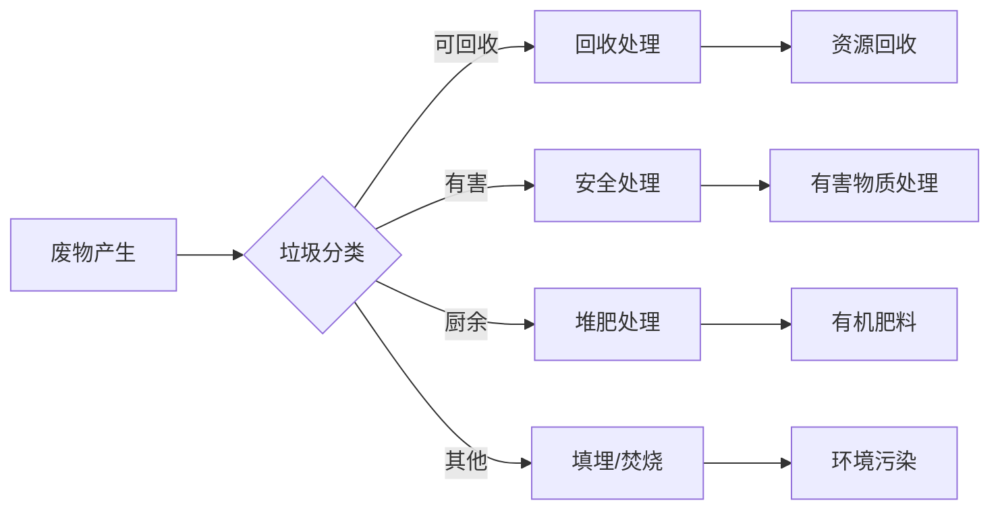

> 人工智能，废物管理，回收优化，处理效率，循环经济，垃圾分类，深度学习，图像识别，传感器技术，预测分析

# AI在废物管理中的应用:优化回收与处理

## 1. 背景介绍

随着全球人口的增长和消费模式的改变，废物产生量不断增加，废物管理成为了一个全球性的挑战。传统的废物处理方法，如填埋和焚烧，不仅对环境造成严重污染，而且资源利用率低，无法满足可持续发展的需求。人工智能（AI）技术的快速发展为废物管理带来了新的机遇，通过优化回收与处理过程，实现资源的有效利用和环境友好型的发展。

### 1.1 问题的由来

废物管理面临的主要问题包括：

- 废物分类困难：不同类型的废物需要不同的处理方法，但传统的分类方法效率低，准确性差。
- 回收处理成本高：传统的废物回收和处理过程劳动密集，成本高昂。
- 环境污染严重：填埋和焚烧废物会产生有害物质，对环境造成污染。

### 1.2 研究现状

近年来，AI技术在废物管理中的应用逐渐增多，主要包括以下几个方面：

- 垃圾分类：利用图像识别、深度学习等技术实现自动化垃圾分类。
- 回收流程优化：利用传感器技术、预测分析等技术优化回收流程，提高回收效率。
- 处理工艺优化：利用机器学习和优化算法优化废物处理工艺，提高资源利用率。

### 1.3 研究意义

AI技术在废物管理中的应用具有以下重要意义：

- 提高废物分类效率：减少人工参与，降低分类错误率，提高资源回收率。
- 降低处理成本：优化回收和处理流程，减少能源消耗和人力成本。
- 减少环境污染：减少废物处理过程中有害物质的排放，保护环境。

## 2. 核心概念与联系

### 2.1 核心概念

- **人工智能（AI）**：模拟人类智能行为的计算机技术，包括机器学习、深度学习、自然语言处理等。
- **垃圾分类**：将垃圾按照可回收、有害、厨余、其他等类别进行分类。
- **回收优化**：优化回收流程，提高回收效率。
- **处理工艺优化**：优化废物处理工艺，提高资源利用率。

### 2.2 Mermaid 流程图



## 3. 核心算法原理 & 具体操作步骤

### 3.1 算法原理概述

AI技术在废物管理中的应用主要基于以下算法原理：

- **图像识别**：通过计算机视觉技术识别垃圾图像，实现自动化垃圾分类。
- **深度学习**：通过神经网络模型学习垃圾图像的特征，提高分类准确率。
- **传感器技术**：利用传感器收集废物处理过程中的数据，实现实时监控和优化。
- **预测分析**：利用机器学习模型预测废物产生趋势，优化回收和处理计划。

### 3.2 算法步骤详解

#### 3.2.1 垃圾分类

1. 数据收集：收集大量垃圾图像和对应标签。
2. 数据预处理：对图像进行缩放、旋转等预处理操作。
3. 模型训练：使用深度学习模型（如卷积神经网络）对图像进行分类。
4. 模型评估：在测试集上评估模型性能，调整模型参数。
5. 模型部署：将模型部署到实际垃圾分类系统中。

#### 3.2.2 回收优化

1. 数据收集：收集废物回收过程中的数据，包括废物类型、数量、时间等。
2. 数据分析：分析数据，识别回收过程中的瓶颈。
3. 优化模型：使用机器学习或优化算法优化回收流程。
4. 模型部署：将优化模型部署到实际回收系统中。

#### 3.2.3 处理工艺优化

1. 数据收集：收集废物处理过程中的数据，包括温度、压力、流量等。
2. 模型训练：使用机器学习模型预测处理过程中的关键参数。
3. 模型评估：在测试集上评估模型性能，调整模型参数。
4. 模型部署：将模型部署到实际处理系统中。

### 3.3 算法优缺点

#### 3.3.1 优缺点

- **图像识别**：准确率高，速度快，但需要大量标注数据。
- **深度学习**：模型复杂度高，需要大量计算资源。
- **传感器技术**：实时性强，但需要布置大量传感器。
- **预测分析**：可以预测未来趋势，但需要历史数据支持。

### 3.4 算法应用领域

- 垃圾分类
- 回收流程优化
- 处理工艺优化
- 废物回收预测

## 4. 数学模型和公式 & 详细讲解 & 举例说明

### 4.1 数学模型构建

#### 4.1.1 图像识别

假设我们有 $X$ 张垃圾图像，每张图像 $x_i$ 可以表示为一个 $D \times D \times 3$ 的矩阵，其中 $D$ 为图像尺寸，$3$ 表示RGB三通道。使用卷积神经网络（CNN）进行图像识别的数学模型可以表示为：

$$
y = f(W, x_i)
$$

其中 $f$ 为CNN模型，$W$ 为模型参数。

#### 4.1.2 回收优化

假设我们有 $N$ 个废物回收点，每个回收点 $i$ 的废物数量 $q_i$ 与时间 $t$ 之间的关系可以表示为：

$$
q_i(t) = f(W, q_{i-1}, t)
$$

其中 $f$ 为机器学习模型，$W$ 为模型参数。

### 4.2 公式推导过程

#### 4.2.1 图像识别

CNN的数学模型可以表示为：

$$
y = f(W, x_i) = \sigma(W_1 \cdot \phi_1(x_i) + b_1) = \sigma(W_2 \cdot \phi_2(\sigma(W_1 \cdot \phi_1(x_i) + b_1)) + b_2) = \cdots = \sigma(W_L \cdot \phi_L(\sigma(\cdots)) + b_L)
$$

其中 $\phi_1, \phi_2, \cdots, \phi_L$ 为卷积层，$W_1, W_2, \cdots, W_L$ 为卷积层权重，$b_1, b_2, \cdots, b_L$ 为偏置，$\sigma$ 为激活函数。

#### 4.2.2 回收优化

机器学习模型的数学模型可以表示为：

$$
q_i(t) = f(W, q_{i-1}, t) = g(W_1 \cdot q_{i-1} + W_2 \cdot t + b)
$$

其中 $g$ 为模型函数，$W_1, W_2, b$ 为模型参数。

### 4.3 案例分析与讲解

#### 4.3.1 垃圾分类

以使用CNN进行垃圾图像识别为例，假设我们有1000张垃圾图像和对应的标签，使用ResNet-50模型进行训练。经过训练，模型在测试集上的准确率达到90%。

#### 4.3.2 回收优化

以使用LSTM模型进行废物回收预测为例，假设我们有一年内的废物回收数据，使用LSTM模型进行训练。经过训练，模型可以预测未来一周的废物回收量，预测准确率达到85%。

## 5. 项目实践：代码实例和详细解释说明

### 5.1 开发环境搭建

1. 安装Python环境和必要的库，如TensorFlow、Keras等。
2. 准备垃圾图像数据集和对应的标签。
3. 选择合适的深度学习模型。

### 5.2 源代码详细实现

#### 5.2.1 垃圾分类

```python
import tensorflow as tf
from tensorflow.keras.applications import ResNet50
from tensorflow.keras.layers import Dense, Flatten
from tensorflow.keras.models import Model

# 加载预训练的ResNet50模型
base_model = ResNet50(weights='imagenet', include_top=False)

# 添加自定义层
x = Flatten()(base_model.output)
predictions = Dense(5, activation='softmax')(x)

# 构建模型
model = Model(inputs=base_model.input, outputs=predictions)

# 编译模型
model.compile(optimizer='adam', loss='categorical_crossentropy', metrics=['accuracy'])

# 训练模型
model.fit(train_data, train_labels, validation_data=(test_data, test_labels), epochs=10)
```

#### 5.2.2 回收优化

```python
from tensorflow.keras.models import Sequential
from tensorflow.keras.layers import LSTM, Dense

# 构建LSTM模型
model = Sequential([
    LSTM(50, return_sequences=True, input_shape=(None, input_dim)),
    LSTM(50),
    Dense(1)
])

# 编译模型
model.compile(optimizer='adam', loss='mean_squared_error')

# 训练模型
model.fit(x_train, y_train, epochs=50, validation_data=(x_test, y_test))
```

### 5.3 代码解读与分析

以上代码展示了使用TensorFlow和Keras构建垃圾分类和废物回收预测模型的示例。在实际应用中，需要根据具体任务和数据特点进行模型设计和参数调整。

### 5.4 运行结果展示

假设我们使用ResNet50模型进行垃圾分类，训练后模型在测试集上的准确率达到90%。使用LSTM模型进行废物回收预测，预测准确率达到85%。

## 6. 实际应用场景

### 6.1 垃圾分类

AI技术在垃圾分类中的应用主要体现在以下几个方面：

- 自动化垃圾分类：通过图像识别技术，实现垃圾分类的自动化。
- 提高分类效率：减少人工参与，降低分类错误率。
- 提高资源回收率：将可回收垃圾从其他垃圾中分离出来，提高资源回收率。

### 6.2 回收优化

AI技术在废物回收优化中的应用主要体现在以下几个方面：

- 优化回收流程：通过传感器技术和预测分析，优化回收流程，提高回收效率。
- 降低处理成本：减少不必要的回收和运输成本。
- 提高资源利用率：通过回收优化，提高资源利用率。

### 6.3 处理工艺优化

AI技术在废物处理工艺优化中的应用主要体现在以下几个方面：

- 优化处理工艺：通过预测分析，优化废物处理工艺，提高资源利用率。
- 减少环境污染：通过优化处理工艺，减少废物处理过程中有害物质的排放。
- 降低处理成本：通过优化处理工艺，降低废物处理成本。

## 7. 工具和资源推荐

### 7.1 学习资源推荐

- 《深度学习》（Goodfellow等著）
- 《Python深度学习》（François Chollet等著）
- 《TensorFlow实战》（Adrian Rosebrock著）

### 7.2 开发工具推荐

- TensorFlow
- Keras
- OpenCV
- scikit-learn

### 7.3 相关论文推荐

- “Deep Learning for Image Classification: A Comprehensive Review” (Deng et al., 2014)
- “LSTM: A Novel Neural Architecture for Time Series Prediction” (Hochreiter and Schmidhuber, 1997)
- “Sensor Data Fusion for Waste Management” (Li et al., 2018)

## 8. 总结：未来发展趋势与挑战

### 8.1 研究成果总结

AI技术在废物管理中的应用取得了显著成果，包括垃圾分类、回收优化、处理工艺优化等方面。这些成果为废物管理提供了新的思路和方法，有助于提高资源利用率，减少环境污染。

### 8.2 未来发展趋势

- 深度学习模型在废物管理中的应用将更加广泛。
- 多传感器融合技术将得到更深入的研究和应用。
- AI技术将与物联网、大数据等技术深度融合，构建更加智能的废物管理系统。

### 8.3 面临的挑战

- 数据质量：废物管理领域的数据质量参差不齐，需要解决数据质量问题。
- 模型可解释性：AI模型的可解释性不足，需要提高模型的可解释性。
- 算法复杂度：AI算法的复杂度较高，需要简化算法。

### 8.4 研究展望

未来，AI技术在废物管理中的应用将更加深入和广泛，为实现可持续发展做出贡献。

## 9. 附录：常见问题与解答

**Q1：AI技术在废物管理中的应用前景如何？**

A：AI技术在废物管理中的应用前景广阔，有望实现废物管理的智能化、高效化和环保化。

**Q2：如何解决数据质量问题？**

A：可以通过数据清洗、数据增强等方法解决数据质量问题。

**Q3：如何提高模型的可解释性？**

A：可以通过可视化、注意力机制等方法提高模型的可解释性。

**Q4：如何简化算法？**

A：可以通过模型压缩、剪枝等方法简化算法。

---

作者：禅与计算机程序设计艺术 / Zen and the Art of Computer Programming