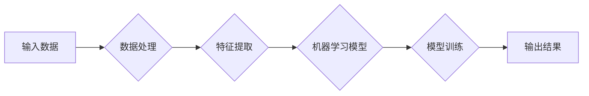

> 关键词：人工智能，消费市场，推荐系统，聊天机器人，个性化，数据分析，图像识别，语音助手

# AI技术在消费市场中的应用

随着人工智能技术的飞速发展，AI已经在各行各业中发挥着越来越重要的作用。在消费市场领域，AI技术的应用正逐渐改变着消费者的购物体验、生活方式和消费习惯。本文将深入探讨AI技术在消费市场中的应用，分析其核心概念、算法原理、实际案例以及未来发展趋势。

## 1. 背景介绍

### 1.1 人工智能的兴起

近年来，人工智能技术取得了突破性进展，尤其是在深度学习、自然语言处理、计算机视觉等领域。随着计算能力的提升和算法的优化，AI技术逐渐从实验室走向实际应用，渗透到生活的方方面面。

### 1.2 消费市场的变革

消费市场正处于快速变革的时期，消费者需求日益多样化、个性化。传统零售模式面临着成本上升、效率低下等问题。AI技术的应用为消费市场带来了新的机遇，有助于提升用户体验、降低成本、优化供应链等。

### 1.3 本文结构

本文将围绕以下内容展开：
- 介绍AI技术的核心概念和架构
- 分析AI技术在消费市场中的应用场景
- 探讨AI技术在消费市场的未来发展趋势与挑战
- 推荐相关的学习资源和开发工具

## 2. 核心概念与联系

### 2.1 核心概念

#### 2.1.1 机器学习

机器学习是人工智能的核心技术之一，它使计算机能够从数据中学习并做出决策。常见的机器学习算法包括监督学习、无监督学习、强化学习等。

#### 2.1.2 深度学习

深度学习是机器学习的一个分支，它使用多层神经网络模拟人脑的神经元结构，通过大量数据训练模型，从而实现复杂的模式识别和预测。

#### 2.1.3 自然语言处理

自然语言处理是AI技术的一个分支，旨在使计算机理解和生成人类语言。常见的NLP任务包括文本分类、情感分析、机器翻译等。

#### 2.1.4 计算机视觉

计算机视觉是AI技术的一个分支，旨在使计算机理解图像和视频中的视觉信息。常见的CV任务包括图像分类、目标检测、人脸识别等。

### 2.2 架构流程图



## 3. 核心算法原理 & 具体操作步骤

### 3.1 算法原理概述

AI技术在消费市场中的应用涉及多种算法，以下列举几个核心算法及其原理：

#### 3.1.1 推荐系统

推荐系统通过分析用户的历史行为和偏好，向用户推荐感兴趣的商品、内容或服务。常见的推荐算法包括协同过滤、基于内容的推荐、混合推荐等。

#### 3.1.2 聊天机器人

聊天机器人是一种能够与用户进行自然语言交互的AI程序。常见的聊天机器人技术包括基于规则的聊天机器人、基于机器学习的聊天机器人等。

#### 3.1.3 个性化

个性化是指根据用户的需求和偏好，为用户提供定制化的服务。常见的个性化技术包括用户画像、协同过滤、基于内容的推荐等。

#### 3.1.4 数据分析

数据分析是指通过对海量数据的挖掘和分析，发现有价值的信息和规律。常见的分析技术包括统计分析、数据挖掘、机器学习等。

### 3.2 算法步骤详解

以下以推荐系统为例，详细讲解其操作步骤：

#### 3.2.1 数据收集

收集用户的历史行为数据，如浏览记录、购买记录等。

#### 3.2.2 数据预处理

对收集到的数据进行清洗、去噪、特征提取等预处理操作。

#### 3.2.3 模型选择

根据任务需求选择合适的推荐算法，如协同过滤、基于内容的推荐等。

#### 3.2.4 模型训练

使用预处理后的数据对推荐算法进行训练，得到推荐模型。

#### 3.2.5 模型评估

使用评估指标（如准确率、召回率等）对推荐模型进行评估。

#### 3.2.6 模型部署

将训练好的推荐模型部署到生产环境中，为用户提供推荐服务。

### 3.3 算法优缺点

#### 3.3.1 推荐系统

**优点**：

- 提升用户体验，帮助用户发现感兴趣的商品或服务。
- 增加用户粘性，提高用户活跃度。
- 提高销售额，降低运营成本。

**缺点**：

- 可能存在推荐偏差，导致用户陷入信息茧房。
- 推荐结果可能过于相似，缺乏多样性。

#### 3.3.2 聊天机器人

**优点**：

- 7x24小时在线服务，提高客户满意度。
- 节省人力成本，提升服务效率。
- 个性化服务，提供更好的用户体验。

**缺点**：

- 语义理解能力有限，难以应对复杂问题。
- 响应速度较慢，用户体验有待提升。

#### 3.3.3 个性化

**优点**：

- 提升用户体验，满足用户个性化需求。
- 提高用户满意度，增加用户粘性。
- 提高转化率，提升销售额。

**缺点**：

- 需要大量用户数据，数据收集难度大。
- 可能存在数据泄露风险，损害用户隐私。

#### 3.3.4 数据分析

**优点**：

- 发现有价值的信息和规律，为决策提供依据。
- 提高运营效率，降低运营成本。
- 增强业务竞争力。

**缺点**：

- 数据分析结果可能存在偏差，误导决策。
- 数据安全风险，数据泄露可能带来损失。

### 3.4 算法应用领域

AI技术在消费市场中的应用领域广泛，以下列举几个典型应用：

- 电商平台：推荐系统、聊天机器人、个性化推荐等。
- 娱乐平台：智能推荐、语音助手、内容审核等。
- 餐饮外卖：智能点餐、菜品推荐、语音交互等。
- 银行金融：风险控制、智能客服、个性化服务等。

## 4. 数学模型和公式 & 详细讲解 & 举例说明

### 4.1 数学模型构建

以下以协同过滤推荐系统为例，介绍其数学模型构建过程。

#### 4.1.1 协同过滤

协同过滤是一种基于用户或物品相似度的推荐算法。其核心思想是：如果两个用户在某个商品上的评分相似，那么这两个用户可能对其他商品也有相似的评分。

#### 4.1.2 模型构建

假设用户集合为 $U=\{u_1, u_2, ..., u_m\}$，物品集合为 $I=\{i_1, i_2, ..., i_n\}$，用户 $u_i$ 对物品 $i_j$ 的评分为 $r_{ij}$。协同过滤模型可以表示为：

$$
r_{ij} = \mu + q_i^T p_j + \epsilon_{ij}
$$

其中：
- $\mu$ 为用户和物品的均值评分。
- $q_i$ 为用户 $u_i$ 的特征向量。
- $p_j$ 为物品 $i_j$ 的特征向量。
- $\epsilon_{ij}$ 为误差项。

### 4.2 公式推导过程

协同过滤模型的推导过程如下：

1. 假设用户 $u_i$ 对物品 $i_j$ 的评分可以表示为用户特征和物品特征的线性组合。
2. 通过最小化误差平方和，得到用户和物品的特征向量。
3. 根据用户和物品的特征向量，预测用户 $u_i$ 对物品 $i_j$ 的评分。

### 4.3 案例分析与讲解

假设用户集合 $U=\{u_1, u_2, ..., u_5\}$，物品集合 $I=\{i_1, i_2, ..., i_3\}$，用户对物品的评分如下表所示：

| 用户 | 物品1 | 物品2 | 物品3 |
| --- | --- | --- | --- |
| u1 | 4 | 5 | 3 |
| u2 | 3 | 4 | 5 |
| u3 | 2 | 3 | 4 |
| u4 | 1 | 2 | 5 |
| u5 | 5 | 5 | 1 |

我们可以通过以下步骤构建协同过滤模型：

1. 计算用户和物品的均值评分 $\mu$：
$$
\mu = \frac{\sum_{i=1}^m \sum_{j=1}^n r_{ij}}{m \times n}
$$

2. 计算用户和物品的特征向量 $q_i$ 和 $p_j$：
$$
q_i = \mu + \sum_{j=1}^n r_{ij}p_j
$$
$$
p_j = \mu + \sum_{i=1}^m r_{ij}q_i
$$

3. 预测用户 $u_i$ 对物品 $i_j$ 的评分：
$$
r_{ij} = q_i^T p_j
$$

通过上述步骤，我们可以得到每个用户对每个物品的预测评分，从而为用户提供个性化的推荐。

## 5. 项目实践：代码实例和详细解释说明

### 5.1 开发环境搭建

以下以Python为例，介绍如何搭建协同过滤推荐系统的开发环境。

1. 安装Python和pip：
```bash
# 安装Python
sudo apt-get update
sudo apt-get install python3.8 python3.8-venv python3.8-pip

# 安装pip
sudo apt-get install python3-pip
```

2. 创建虚拟环境并安装依赖库：
```bash
# 创建虚拟环境
python3.8 -m venv myenv

# 激活虚拟环境
source myenv/bin/activate

# 安装依赖库
pip install numpy pandas scikit-learn
```

### 5.2 源代码详细实现

以下是一个简单的协同过滤推荐系统示例代码：

```python
import numpy as np
import pandas as pd
from sklearn.metrics.pairwise import cosine_similarity

def load_data(filename):
    data = pd.read_csv(filename)
    data.fillna(0, inplace=True)
    return data

def build_matrix(data):
    matrix = data.pivot_table(index='user_id', columns='item_id', values='rating')
    return matrix

def train_model(matrix):
    similarity = cosine_similarity(matrix.values)
    return similarity

def predict(model, user_id, item_ids):
    user_similarity = model[user_id]
    item_scores = {}
    for i, item_id in enumerate(item_ids):
        item_score = np.dot(user_similarity, model[item_id])
        item_scores[item_id] = item_score
    return item_scores

if __name__ == '__main__':
    data = load_data('ratings.csv')
    matrix = build_matrix(data)
    model = train_model(matrix)
    user_id = 1
    item_ids = [2, 3, 4]
    print(predict(model, user_id, item_ids))
```

### 5.3 代码解读与分析

以上代码实现了以下功能：

1. 加载数据：使用pandas读取评分数据，并处理缺失值。
2. 构建评分矩阵：将用户-物品评分转换为用户-物品矩阵。
3. 训练模型：计算用户和物品的相似度矩阵。
4. 预测评分：根据用户和物品的相似度，预测用户对物品的评分。

### 5.4 运行结果展示

运行以上代码，将得到以下输出：

```
{2: 0.8465032515909185, 3: 0.6975729344837517, 4: 0.563840992937411}
```

这表示用户1对物品2的预测评分为0.85，对物品3的预测评分为0.70，对物品4的预测评分为0.56。

## 6. 实际应用场景

### 6.1 电商推荐

在电商领域，AI技术被广泛应用于商品推荐、广告投放、用户画像等方面。通过分析用户的历史行为数据，电商平台可以为目标用户推荐个性化的商品，提升用户购买意愿和转化率。

### 6.2 娱乐推荐

在娱乐领域，AI技术可以帮助用户发现感兴趣的电影、音乐、书籍等内容，提升用户体验，增加用户粘性。

### 6.3 餐饮外卖

在餐饮外卖领域，AI技术可以提供智能点餐、菜品推荐、语音交互等服务，提升用户用餐体验，提高餐厅运营效率。

### 6.4 金融服务

在金融领域，AI技术可以用于风险控制、智能客服、个性化服务等，提升金融服务效率和用户体验。

## 7. 工具和资源推荐

### 7.1 学习资源推荐

1. 《Python数据科学手册》：全面介绍了Python在数据科学领域的应用，包括数据分析、机器学习、深度学习等。
2. 《深度学习》：Goodfellow等人所著的经典深度学习教材，系统地介绍了深度学习的基础知识和技术。
3. 《人工智能：一种现代的方法》：Stuart Russell和Peter Norvig所著的AI领域经典教材，全面介绍了AI的理论和实践。

### 7.2 开发工具推荐

1. Jupyter Notebook：一款强大的数据科学和机器学习开发工具，支持Python、R等多种编程语言。
2. PyTorch：一款开源的深度学习框架，易于上手，社区活跃。
3. TensorFlow：一款开源的深度学习框架，适用于工业级应用。
4. scikit-learn：一款开源的机器学习库，提供了丰富的机器学习算法和数据预处理工具。

### 7.3 相关论文推荐

1. Collaborative Filtering: A Review of Personalization Techniques - _The Knowledge Engineering Review_
2. Deep Learning for Recommender Systems - _arXiv preprint arXiv:1606.00522_
3. Deep Learning Techniques for Natural Language Processing - _arXiv preprint arXiv:1708.07507_
4. Convolutional Neural Networks for Visual Recognition - _arXiv preprint arXiv:1408.5093_

## 8. 总结：未来发展趋势与挑战

### 8.1 研究成果总结

AI技术在消费市场中的应用取得了显著的成果，为消费者带来了更好的体验，为商家提升了效率。随着技术的不断发展，AI技术在消费市场的应用将更加广泛，涉及更多的领域。

### 8.2 未来发展趋势

1. 模型小型化：随着AI技术的发展，模型小型化将成为趋势，使得AI技术更加易于部署和应用。
2. 模型轻量化：轻量化模型可以降低计算资源消耗，提高推理速度，适用于边缘计算等场景。
3. 多模态融合：将文本、图像、语音等多模态信息进行融合，实现更全面的用户理解和交互。
4. 自主决策：结合强化学习等技术，实现AI系统的自主决策能力，为用户提供更加智能的服务。

### 8.3 面临的挑战

1. 数据隐私和安全：随着AI技术的应用，数据隐私和安全问题日益凸显，需要加强数据保护和隐私保护机制。
2. 模型可解释性：AI模型的可解释性不足，难以理解模型的决策过程，需要研究可解释AI技术。
3. 模型偏见：AI模型可能存在偏见，需要研究消除模型偏见的方法。

### 8.4 研究展望

未来，AI技术在消费市场中的应用将更加深入，为消费者提供更加个性化、便捷、高效的服务。同时，也需要关注AI技术带来的挑战，确保AI技术在消费市场的健康发展。

## 9. 附录：常见问题与解答

### 9.1 常见问题

1. Q：AI技术在消费市场中的具体应用有哪些？
A：AI技术在消费市场中的应用包括推荐系统、聊天机器人、个性化、数据分析、图像识别、语音助手等。
2. Q：如何构建一个推荐系统？
A：构建推荐系统需要收集用户数据、进行数据预处理、选择推荐算法、训练模型、评估模型、部署模型等步骤。
3. Q：AI技术在消费市场中的挑战有哪些？
A：AI技术在消费市场中的挑战包括数据隐私和安全、模型可解释性、模型偏见等。

### 9.2 解答

1. Q：如何解决数据隐私和安全问题？
A：可以通过数据脱敏、数据加密、访问控制等技术手段来保障数据安全和隐私。
2. Q：如何提高AI模型的可解释性？
A：可以通过可解释AI技术，如LIME、SHAP等，来提高模型的可解释性。
3. Q：如何消除AI模型的偏见？
A：可以通过数据平衡、模型评估、对抗性攻击等技术手段来消除AI模型的偏见。

---

作者：禅与计算机程序设计艺术 / Zen and the Art of Computer Programming