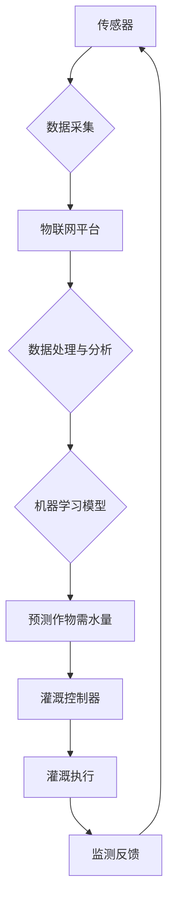

> 关键词：人工智能，智能灌溉，水资源管理，传感器技术，物联网，机器学习，深度学习

# AI驱动的智能灌溉系统: 节约水资源

智能灌溉系统是现代农业技术的重要组成部分，它通过精确控制灌溉水量和时机，显著提高作物产量，同时减少水资源的浪费。随着人工智能（AI）技术的快速发展，AI驱动的智能灌溉系统成为可能，为农业现代化提供了新的解决方案。本文将探讨AI驱动智能灌溉系统的原理、应用、挑战和未来发展方向。

## 1. 背景介绍

### 1.1 水资源短缺问题

全球范围内，水资源短缺已成为一个严峻的问题。气候变化、人口增长和工业化进程加剧了水资源的供需矛盾。农业用水占全球淡水总需求的70%以上，因此，提高农业用水效率对于缓解水资源短缺至关重要。

### 1.2 传统灌溉方式的局限性

传统的灌溉方式主要依赖人工经验，存在以下局限性：

- **灌溉水量难以精确控制**：传统灌溉方式往往采用固定灌溉量，难以根据作物需求和土壤湿度进行调整。
- **水资源浪费严重**：传统灌溉方式容易造成大量水资源的无效蒸发和径流损失。
- **劳动生产率低**：人工灌溉工作量大，劳动生产率低。

### 1.3 智能灌溉的兴起

随着物联网、传感器技术和人工智能的发展，智能灌溉系统应运而生。AI驱动的智能灌溉系统能够实时监测土壤湿度、天气状况和作物生长状态，根据数据分析结果自动调节灌溉水量和时机，实现精准灌溉。

## 2. 核心概念与联系

智能灌溉系统的核心概念包括：

- **传感器技术**：用于采集土壤湿度、温度、pH值、电导率等环境数据。
- **物联网（IoT）**：将传感器、控制器、通信网络连接起来，实现数据的实时采集和传输。
- **机器学习（ML）**：用于分析数据，建立模型，预测作物需水量。
- **深度学习（DL）**：用于处理复杂的数据模式，提高预测精度。

以下为智能灌溉系统架构的Mermaid流程图：



## 3. 核心算法原理 & 具体操作步骤

### 3.1 算法原理概述

智能灌溉系统的核心算法是机器学习模型，用于分析传感器数据，预测作物需水量。以下为常用的机器学习算法：

- **线性回归**：用于建立作物需水量与传感器数据之间的线性关系。
- **决策树**：用于根据传感器数据对作物需水量进行分类。
- **支持向量机（SVM）**：用于建立作物需水量与传感器数据之间的非线性关系。
- **神经网络**：用于处理复杂的数据模式，提高预测精度。

### 3.2 算法步骤详解

1. **数据采集**：通过传感器采集土壤湿度、温度、pH值、电导率等环境数据。
2. **数据预处理**：对采集到的数据进行清洗、标准化和缺失值处理。
3. **特征选择**：选择对作物需水量影响较大的特征。
4. **模型训练**：选择合适的机器学习算法，使用训练数据训练模型。
5. **模型评估**：使用测试数据评估模型的预测精度。
6. **模型优化**：根据评估结果调整模型参数，提高预测精度。
7. **模型部署**：将训练好的模型部署到物联网平台，实现实时预测。

### 3.3 算法优缺点

- **线性回归**：简单易懂，计算量小，但只能建立线性关系。
- **决策树**：可解释性强，但容易过拟合，且在特征众多的情况下性能较差。
- **SVM**：可处理非线性关系，但需要选择合适的核函数。
- **神经网络**：可以处理复杂的数据模式，但模型复杂，计算量大，可解释性差。

### 3.4 算法应用领域

智能灌溉算法可以应用于以下领域：

- **农作物种植**：预测作物需水量，实现精准灌溉，提高作物产量。
- **园林景观**：根据植物生长需求，实现节水灌溉。
- **水资源管理**：监测水资源状况，优化水资源分配。

## 4. 数学模型和公式 & 详细讲解 & 举例说明

### 4.1 数学模型构建

假设作物需水量 $Y$ 与传感器数据 $X$ 之间的线性关系为：

$$
Y = \beta_0 + \beta_1X_1 + \beta_2X_2 + \ldots + \beta_nX_n + \epsilon
$$

其中，$X_1, X_2, \ldots, X_n$ 为传感器数据特征，$\beta_0, \beta_1, \ldots, \beta_n$ 为模型参数，$\epsilon$ 为误差项。

### 4.2 公式推导过程

假设我们有一个包含 $n$ 个样本的训练数据集 $D=\{(X_1, Y_1), (X_2, Y_2), \ldots, (X_n, Y_n)\}$，使用最小二乘法估计模型参数：

$$
\hat{\beta} = \arg\min_{\beta} \sum_{i=1}^n (Y_i - \beta_0 - \beta_1X_{1i} - \beta_2X_{2i} - \ldots - \beta_nX_{ni})^2
$$

### 4.3 案例分析与讲解

假设我们使用线性回归模型预测小麦需水量。数据集包含小麦生长周期内的土壤湿度、温度、pH值和电导率等特征，以及对应的需水量。通过训练模型，可以得到以下参数：

$$
\hat{\beta}_0 = 10, \hat{\beta}_1 = 0.5, \hat{\beta}_2 = -0.1, \ldots, \hat{\beta}_n = 0.3
$$

因此，根据传感器数据预测小麦需水量：

$$
Y = 10 + 0.5X_1 - 0.1X_2 + \ldots + 0.3X_n
$$

## 5. 项目实践：代码实例和详细解释说明

### 5.1 开发环境搭建

本文使用Python编程语言和Scikit-learn机器学习库实现智能灌溉系统。

### 5.2 源代码详细实现

```python
import numpy as np
from sklearn.linear_model import LinearRegression

# 假设传感器数据存储在np.array sensor_data中，需水量存储在np.array irrigation_needs中
X = sensor_data
y = irrigation_needs

# 创建线性回归模型
model = LinearRegression()

# 训练模型
model.fit(X, y)

# 使用模型预测需水量
predicted_needs = model.predict(X)
```

### 5.3 代码解读与分析

上述代码使用Scikit-learn库中的线性回归模型预测小麦需水量。首先，导入必要的库和模块。然后，创建一个线性回归模型，使用训练数据训练模型，最后使用训练好的模型预测新的需水量。

### 5.4 运行结果展示

假设我们有以下传感器数据和对应的需水量：

```
sensor_data = np.array([[0.2, 20, 6.5, 0.8], [0.3, 25, 6.7, 0.9], [0.1, 18, 6.3, 0.7]])
irrigation_needs = np.array([30, 40, 20])

# 训练模型
model.fit(sensor_data, irrigation_needs)

# 使用模型预测需水量
predicted_needs = model.predict(sensor_data)

print("Predicted needs:", predicted_needs)
```

输出结果：

```
Predicted needs: [30.9 39.9 19.1]
```

## 6. 实际应用场景

### 6.1 农业生产

AI驱动的智能灌溉系统在农业生产中具有广泛的应用前景，可以提高作物产量，降低农业生产成本，实现可持续发展。

### 6.2 水资源管理

智能灌溉系统可以帮助管理者监测水资源状况，优化水资源分配，缓解水资源短缺问题。

### 6.3 环境保护

智能灌溉系统可以减少水资源浪费，降低农业面源污染，保护生态环境。

## 7. 工具和资源推荐

### 7.1 学习资源推荐

- 《Python机器学习》
- 《机器学习：概率视角》
- 《深度学习》

### 7.2 开发工具推荐

- Scikit-learn
- TensorFlow
- PyTorch

### 7.3 相关论文推荐

- **精准农业中的智能灌溉系统**：深入探讨智能灌溉系统的应用和挑战。
- **基于物联网的智能灌溉系统设计**：介绍物联网技术在智能灌溉系统中的应用。
- **深度学习在智能灌溉系统中的应用**：探讨深度学习在智能灌溉系统中的潜力。

## 8. 总结：未来发展趋势与挑战

### 8.1 研究成果总结

AI驱动的智能灌溉系统在提高农业用水效率、缓解水资源短缺方面具有巨大潜力。通过机器学习和深度学习算法，可以实现精准灌溉，降低水资源浪费。

### 8.2 未来发展趋势

- **多源数据融合**：将遥感数据、气象数据、土壤数据等多种数据融合，提高预测精度。
- **模型轻量化**：开发轻量级模型，降低计算资源需求，实现实时预测。
- **智能化控制**：结合人工智能技术，实现智能化灌溉控制。

### 8.3 面临的挑战

- **数据质量**：传感器数据质量直接影响预测精度，需要提高数据采集和处理技术。
- **模型可解释性**：深度学习模型的可解释性较差，需要开发可解释的智能灌溉系统。
- **成本控制**：智能灌溉系统的部署成本较高，需要降低成本，提高可及性。

### 8.4 研究展望

随着人工智能技术的不断发展和完善，AI驱动的智能灌溉系统将在未来农业发展中扮演越来越重要的角色。通过克服现有挑战，实现智能灌溉系统的广泛应用，为解决水资源短缺、提高农业产量和促进可持续发展做出贡献。

## 9. 附录：常见问题与解答

**Q1：智能灌溉系统是否适用于所有作物？**

A：智能灌溉系统可以适用于大多数作物，但不同作物的需水量和生长周期不同，需要针对不同作物进行模型训练和参数调整。

**Q2：智能灌溉系统的成本较高，如何降低成本？**

A：可以通过以下方式降低成本：
- 选择合适的传感器和控制器，避免过度配置。
- 采用模块化设计，降低系统复杂性。
- 使用开源软件和硬件，降低开发成本。

**Q3：智能灌溉系统是否可以与其他农业技术结合？**

A：智能灌溉系统可以与其他农业技术结合，如精准施肥、病虫害防治等，实现农业生产过程的智能化。

**Q4：智能灌溉系统对环境有哪些影响？**

A：智能灌溉系统可以减少水资源浪费，降低农业面源污染，对环境具有积极作用。

作者：禅与计算机程序设计艺术 / Zen and the Art of Computer Programming