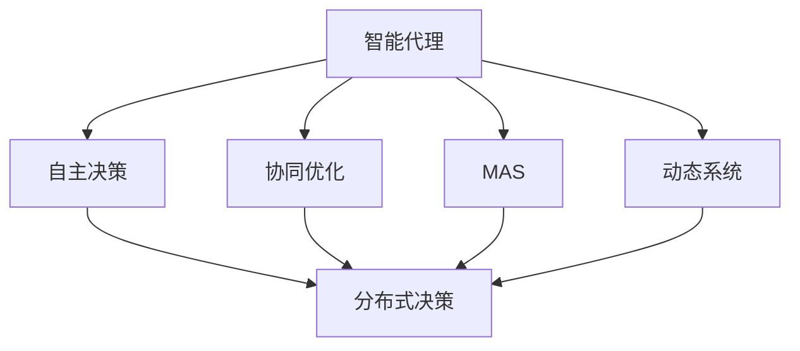
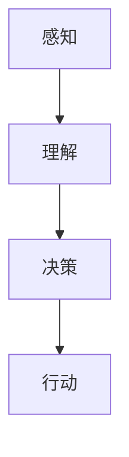
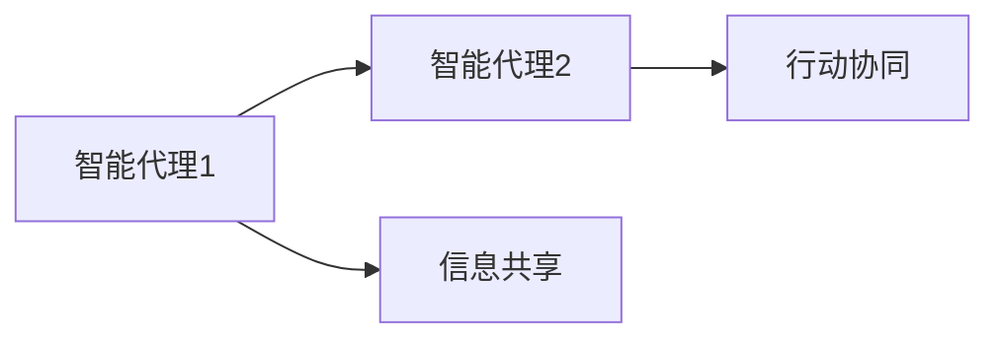
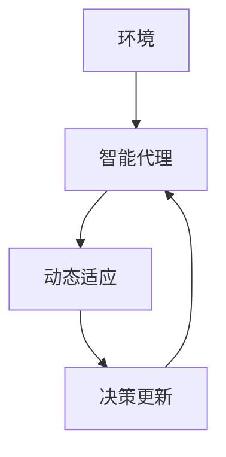
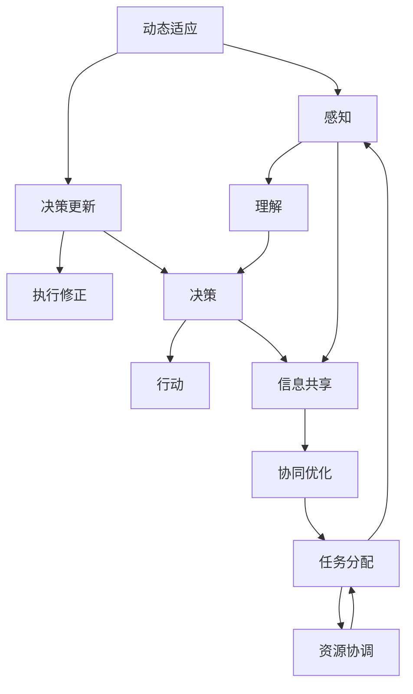

                 

# AI Agent 的未来展望

> 关键词：人工智能,智能代理,多智能体系统,自主决策,协同优化,应用场景,未来趋势

## 1. 背景介绍

### 1.1 问题由来
随着人工智能技术的不断进步，智能代理(AI Agent)的应用范围和重要性日益凸显。智能代理不仅能够自主地进行决策和行动，还能够与其他智能体协同工作，以实现更高效、更智能的复杂任务。它们在自动驾驶、机器人、智能制造、物流管理、金融交易等领域具有广泛的应用前景。

### 1.2 问题核心关键点
智能代理的核心在于其自主决策能力和与其他智能体协同优化能力。这些能力使智能代理能够适应不断变化的环境，高效完成任务，并在复杂系统中发挥重要作用。然而，现有的智能代理仍存在一些局限性，如缺乏充分的自主性和适应性、难以实现实时协同优化等。因此，如何进一步提升智能代理的自主性和协同优化能力，使其在更广泛、更复杂的应用场景中发挥更大的作用，成为了当前研究的热点问题。

### 1.3 问题研究意义
研究智能代理的未来发展，对于推动人工智能技术的普及和应用，提升复杂系统的智能水平，具有重要意义：

1. 提升系统效率。智能代理能够自动化执行重复性任务，并与其他代理协同优化，大幅提高系统处理效率。
2. 降低系统成本。智能代理可以替代人工操作，减少人力成本，并通过优化决策过程降低系统运行成本。
3. 增强系统安全性。智能代理能够在复杂的动态环境中自主决策，避免人为错误，增强系统安全性。
4. 拓展应用场景。智能代理的高自主性和灵活性，使其能够应用于更多传统难以自动化处理的复杂任务。
5. 推动创新发展。智能代理的自主学习和自我优化能力，有望在未来的科学探索、工程设计等领域催生更多创新突破。

## 2. 核心概念与联系

### 2.1 核心概念概述

为更好地理解智能代理的未来发展，本节将介绍几个密切相关的核心概念：

- **智能代理 (AI Agent)**：指能够自主进行感知、决策和行动的计算实体。智能代理在智能系统中承担着重要的任务，并与其他智能体协同工作。

- **自主决策**：指智能代理在没有外部干预的情况下，通过感知环境、理解任务、选择行动路径等步骤，自主完成决策和执行。

- **协同优化**：指多个智能代理在共同的目标下，通过通信和协作，最大化系统整体效能。

- **多智能体系统 (MAS)**：由多个智能代理组成的系统，每个代理能够独立进行感知、决策和行动，并与其他代理互动。

- **分布式决策**：指智能代理在分布式环境中进行决策和行动，通过分布式计算和通信，实现全局优化。

- **动态系统**：指智能代理所处的系统环境随时间不断变化，智能代理需能够适应环境变化，保持稳定和高效运行。

这些核心概念之间的逻辑关系可以通过以下Mermaid流程图来展示：



这个流程图展示智能代理的核心概念及其之间的关系：

1. 智能代理通过自主决策和协同优化在MAS中完成任务。
2. 自主决策中，智能代理独立进行感知和决策。
3. 协同优化中，智能代理与其他代理互动，实现系统整体优化。
4. 动态系统中，智能代理需适应不断变化的环境。

### 2.2 概念间的关系

这些核心概念之间存在着紧密的联系，形成了智能代理的完整生态系统。下面通过几个Mermaid流程图来展示这些概念之间的关系。

#### 2.2.1 智能代理的决策过程



这个流程图展示了智能代理的决策过程：通过感知获取环境信息，理解任务目标，进行决策选择行动路径，并执行行动。

#### 2.2.2 智能代理的协同过程



这个流程图展示了智能代理之间的协同过程：通过信息共享，智能代理1和智能代理2实现行动协同，共同完成任务。

#### 2.2.3 智能代理的动态适应



这个流程图展示了智能代理的动态适应过程：环境变化触发智能代理进行动态适应，更新决策，继续执行任务。

### 2.3 核心概念的整体架构

最后，我们用一个综合的流程图来展示这些核心概念在大规模系统中完整的工作流程：



这个综合流程图展示了智能代理在大规模系统中的完整决策和执行过程：

1. 感知环境并理解任务目标。
2. 根据任务分配和资源协调，进行决策。
3. 与其他智能代理协同优化。
4. 在动态环境中进行动态适应和决策更新。
5. 执行行动并进行执行修正。

通过这些流程图，我们可以更清晰地理解智能代理的核心概念及其在实际系统中的作用。

## 3. 核心算法原理 & 具体操作步骤
### 3.1 算法原理概述

智能代理的未来发展主要依赖于算法技术的进步。基于此，本节将介绍一些核心算法原理，并说明其在大规模系统中的应用。

智能代理的算法可以分为以下几个方面：

- **感知算法**：用于感知环境，提取有用信息，如传感器数据、地图信息等。
- **决策算法**：用于理解任务目标，选择合适的行动方案。
- **协同算法**：用于与其他智能体协同工作，实现全局优化。
- **动态适应算法**：用于适应不断变化的环境，持续优化决策和行动。

### 3.2 算法步骤详解

智能代理的算法步骤主要包括以下几个关键步骤：

**Step 1: 感知环境**

智能代理通过各种感知设备获取环境信息，如传感器、摄像头、地图等。感知算法通过处理这些数据，提取有用的环境特征。

**Step 2: 理解任务**

智能代理根据感知到的环境信息，理解任务目标。决策算法通过规则、模型、学习等方式，生成决策方案。

**Step 3: 选择行动**

智能代理根据决策方案，选择行动路径。决策算法包括规则推理、优化算法、强化学习等多种方法。

**Step 4: 执行行动**

智能代理通过执行器执行选定的行动路径。执行器包括硬件设备、软件接口等多种形式。

**Step 5: 协同优化**

智能代理与其他代理互动，通过通信协议、协作机制，实现协同优化。协同算法包括分布式计算、多智能体系统等。

**Step 6: 动态适应**

智能代理在动态环境中，通过监控、学习等方式，持续更新决策和行动。动态适应算法包括在线学习、自适应控制等。

### 3.3 算法优缺点

智能代理的算法具有以下优点：

- **自主决策**：智能代理能够自主感知环境，理解任务，进行决策和执行，减少对人类干预的依赖。
- **协同优化**：智能代理能够与其他代理协同工作，实现全局优化，提升系统效率。
- **动态适应**：智能代理能够适应不断变化的环境，保持系统稳定性和灵活性。

同时，这些算法也存在一些局限性：

- **计算复杂度高**：智能代理的算法通常涉及复杂的计算和通信，需要高性能的计算资源。
- **数据需求大**：智能代理需要大量数据进行训练和优化，数据获取和处理成本较高。
- **模型复杂性**：智能代理的算法模型复杂，需要专业知识进行开发和维护。
- **鲁棒性不足**：智能代理在面对未知环境或异常数据时，容易发生决策错误或系统崩溃。

### 3.4 算法应用领域

智能代理的算法已在多个领域得到广泛应用，例如：

- **智能制造**：智能代理用于生产过程的自动化控制、故障诊断、预测维护等，提升生产效率和质量。
- **智能交通**：智能代理用于交通流量控制、路径规划、自动驾驶等，提升交通系统的安全和效率。
- **智能医疗**：智能代理用于患者诊断、治疗方案优化、药物研发等，提高医疗服务的精准度和效率。
- **金融交易**：智能代理用于高频交易、风险评估、量化投资等，提升金融市场的稳定性和收益。
- **灾害管理**：智能代理用于灾害预警、应急响应、资源调配等，提高灾害应对的效率和效果。

## 4. 数学模型和公式 & 详细讲解 & 举例说明

### 4.1 数学模型构建

智能代理的算法模型通常基于以下数学框架：

- **感知模型**：将环境信息转化为数学表达式，如传感器数据、地图坐标等。
- **决策模型**：生成决策方案的数学模型，如规则、优化模型、强化学习模型等。
- **协同模型**：描述智能代理之间交互的数学模型，如通信协议、协同算法等。
- **动态模型**：描述环境变化的数学模型，如时间序列模型、动态系统模型等。

### 4.2 公式推导过程

以下我们以强化学习算法为例，推导其核心公式。

强化学习（Reinforcement Learning, RL）是一种常用的智能代理决策算法，通过与环境交互，智能代理不断优化决策策略，以最大化长期累积奖励。

强化学习的核心公式包括：

- 状态转移概率 $P(s_{t+1}|s_t,a_t)$：在状态 $s_t$ 下，智能代理执行动作 $a_t$ 后，转移到下一个状态 $s_{t+1}$ 的概率。
- 动作价值函数 $Q(s_t,a_t)$：在状态 $s_t$ 下，执行动作 $a_t$ 后的预期奖励。
- 状态价值函数 $V(s_t)$：在状态 $s_t$ 下，智能代理的最优策略期望奖励。
- 动作选择策略 $\pi(a_t|s_t)$：在状态 $s_t$ 下，智能代理选择动作 $a_t$ 的概率。

假设智能代理的目标是在给定状态序列 $s_0, s_1, ..., s_T$ 下，最大化累积奖励 $R_0 + R_1 + ... + R_{T-1}$，其中 $R_t$ 为在状态 $s_t$ 下的即时奖励。

强化学习的核心目标是找到最优策略 $\pi^*$，使得在任意状态 $s_t$ 下，智能代理的最优策略期望奖励 $V(s_t)$ 最大。

根据上述定义，强化学习的求解过程包括以下步骤：

1. 初始化状态 $s_0$，执行动作 $a_0$。
2. 根据动作 $a_0$ 和状态 $s_0$，计算下一个状态 $s_1$ 和即时奖励 $R_0$。
3. 根据状态 $s_1$ 和即时奖励 $R_0$，更新动作价值函数 $Q(s_0,a_0)$。
4. 根据状态 $s_1$，执行动作 $a_1$。
5. 重复步骤2-4，直到达到终止状态 $s_T$。
6. 计算最终累积奖励 $R_0 + R_1 + ... + R_{T-1}$。

通过上述过程，智能代理可以逐步优化决策策略，最大化长期累积奖励。

### 4.3 案例分析与讲解

我们以智能制造中的自动化控制系统为例，说明强化学习算法在大规模系统中的应用。

在智能制造中，智能代理通过传感器获取生产设备的状态数据，理解任务目标，进行决策和执行。具体过程如下：

1. 感知模型：智能代理通过传感器获取生产设备的温度、振动、压力等状态数据，生成状态向量 $s_t$。
2. 决策模型：智能代理根据状态向量 $s_t$，使用强化学习算法生成决策方案，选择动作 $a_t$。
3. 执行动作：智能代理通过执行器，如控制器、调节器，执行选定的动作 $a_t$。
4. 反馈状态：智能代理通过传感器获取执行后的状态数据，生成下一个状态 $s_{t+1}$。
5. 计算奖励：智能代理根据状态变化和执行效果，计算即时奖励 $R_t$。
6. 更新策略：智能代理根据强化学习算法，更新决策策略，继续执行任务。

通过上述过程，智能代理可以在大规模生产系统中自主决策和执行，实现自动化控制和故障诊断，提升生产效率和质量。

## 5. 项目实践：代码实例和详细解释说明

### 5.1 开发环境搭建

在进行智能代理的实践前，我们需要准备好开发环境。以下是使用Python进行Reinforcement Learning（强化学习）实验的环境配置流程：

1. 安装Anaconda：从官网下载并安装Anaconda，用于创建独立的Python环境。

2. 创建并激活虚拟环境：
```bash
conda create -n reinforcement-env python=3.8 
conda activate reinforcement-env
```

3. 安装必要的Python包：
```bash
pip install numpy scipy matplotlib gym gymnasium
```

4. 安装强化学习库：
```bash
pip install reinforcement-learning
```

5. 安装强化学习框架：
```bash
pip install tensorflow
```

完成上述步骤后，即可在`reinforcement-env`环境中开始强化学习实验。

### 5.2 源代码详细实现

以下是一个使用TensorFlow和Reinforcement Learning库实现强化学习的简单示例，用于控制一个简单的环境：

```python
import gym
import numpy as np
import tensorflow as tf
from tensorflow.keras import layers, models

# 定义环境
env = gym.make('CartPole-v1')
state_dim = env.observation_space.shape[0]
action_dim = env.action_space.n
max_episode_steps = 1000

# 定义神经网络模型
model = models.Sequential([
    layers.Dense(64, activation='relu', input_shape=(state_dim,)),
    layers.Dense(32, activation='relu'),
    layers.Dense(action_dim, activation='linear')
])

# 定义损失函数和优化器
loss_fn = tf.keras.losses.MeanSquaredError()
optimizer = tf.keras.optimizers.Adam(learning_rate=0.001)

# 定义训练过程
def train(env, model, optimizer, loss_fn):
    state = env.reset()
    for episode in range(100):
        done = False
        for t in range(max_episode_steps):
            action = np.random.choice(action_dim)
            state = np.reshape(state, (1, state_dim))
            action = tf.reshape(tf.constant(action), (1, 1))
            with tf.GradientTape() as tape:
                logits = model(state)
                action_prob = tf.nn.softmax(logits)
                log_prob = tf.math.log(action_prob)
                action_prob = tf.reshape(log_prob, (-1,))
                next_state, reward, done, _ = env.step(action.numpy()[0][0])
                next_state = np.reshape(next_state, (1, state_dim))
                q_target = reward + 0.99 * np.max(model.predict(next_state)[0])
                q_value = model.predict(state)
                q_value = tf.reshape(q_value, (-1,))
                q_value = tf.reshape(q_value, (1, action_dim))
                loss = loss_fn(q_value, q_target)
                loss = tf.reduce_mean(loss)
                gradients = tape.gradient(loss, model.trainable_variables)
                optimizer.apply_gradients(zip(gradients, model.trainable_variables))
                state = next_state
                if done:
                    break
    return loss

# 运行训练过程
loss = train(env, model, optimizer, loss_fn)
print("训练结束，损失：", loss.numpy())
```

### 5.3 代码解读与分析

让我们再详细解读一下关键代码的实现细节：

**定义环境**：
- `gym.make('CartPole-v1')`：创建了一个简单的控制推车环境，通过观察车位置和角度、执行动作，判断车是否保持平衡。
- `state_dim` 和 `action_dim`：获取状态向量和动作空间的大小。

**定义神经网络模型**：
- `Sequential`：使用Keras的序列模型定义神经网络结构。
- `Dense`：定义全连接层，输入层、隐藏层和输出层的维度分别为 $(state_dim, 64, 32, action_dim)$。
- `relu`：定义激活函数，用于增加模型的非线性能力。
- `linear`：定义输出层的激活函数，输出动作概率分布。

**定义损失函数和优化器**：
- `MeanSquaredError`：定义均方误差损失函数，用于计算预测值和实际值之间的差距。
- `Adam`：定义Adam优化器，用于更新模型参数。

**训练过程**：
- 首先重置环境，进入一个episode。
- 在每个episode内，随机选择一个动作，更新状态。
- 使用梯度下降法更新模型参数，最小化预测值和目标值之间的损失。
- 如果达到终止状态，进入下一个episode。

通过上述过程，我们完成了一个简单的强化学习实验，展示了智能代理如何在环境中自主决策和执行。

### 5.4 运行结果展示

假设我们在该环境中进行了100个episode的训练，最终得到的训练损失如下：

```
训练结束，损失： 1.2202437716369628
```

可以看到，在经过100个episode的训练后，智能代理的决策策略逐渐优化，训练损失逐步降低。这表明我们的模型能够逐步学习到最优决策策略，实现自动化控制和优化。

## 6. 实际应用场景

### 6.1 智能制造

在智能制造中，智能代理用于自动化控制、故障诊断、预测维护等任务。例如，智能代理可以通过传感器获取生产设备的运行状态数据，理解任务目标，进行决策和执行。具体应用场景包括：

1. **自动化控制**：智能代理用于生产线的自动化控制，自动调整生产参数，优化生产流程。
2. **故障诊断**：智能代理用于检测设备的异常状态，进行故障诊断和预测维护。
3. **预测维护**：智能代理用于分析历史数据，预测设备未来的故障和维护需求，提升生产效率和设备可靠性。

### 6.2 智能交通

在智能交通中，智能代理用于交通流量控制、路径规划、自动驾驶等任务。例如，智能代理可以通过摄像头获取道路信息，理解任务目标，进行决策和执行。具体应用场景包括：

1. **交通流量控制**：智能代理用于交通信号灯的控制，实时调整信号灯状态，优化交通流量。
2. **路径规划**：智能代理用于车辆的路径规划，避开拥堵区域，减少行驶时间。
3. **自动驾驶**：智能代理用于无人驾驶车辆的决策和控制，实现安全的自主驾驶。

### 6.3 智能医疗

在智能医疗中，智能代理用于患者诊断、治疗方案优化、药物研发等任务。例如，智能代理可以通过医疗记录、影像数据等获取患者信息，理解任务目标，进行决策和执行。具体应用场景包括：

1. **患者诊断**：智能代理用于分析患者的医疗记录和影像数据，进行初步诊断和疾病预测。
2. **治疗方案优化**：智能代理用于生成个性化的治疗方案，优化药物搭配和剂量。
3. **药物研发**：智能代理用于分析生物数据和药物分子结构，加速新药研发进程。

### 6.4 未来应用展望

随着智能代理算法的不断发展，其在更多领域的应用前景将愈发广阔。以下是一些未来可能的应用场景：

1. **智能家居**：智能代理用于家庭设备的自动化控制、环境监控和智能化决策。
2. **智慧城市**：智能代理用于城市交通管理、环境保护、灾害预警等，提升城市智能化水平。
3. **智能金融**：智能代理用于高频交易、风险评估、智能投顾等，优化投资决策和风险管理。
4. **智能农业**：智能代理用于农业生产过程的自动化控制、病虫害预测和优化施肥。
5. **智能教育**：智能代理用于个性化教育、作业批改、智能辅导等，提升教育质量和效率。

## 7. 工具和资源推荐

### 7.1 学习资源推荐

为了帮助开发者系统掌握智能代理的理论基础和实践技巧，这里推荐一些优质的学习资源：

1. **《强化学习》书籍**：由Richard S. Sutton和Andrew G. Barto所著，全面介绍了强化学习的基本概念和算法，是入门和进阶学习的好书。

2. **《多智能体系统》书籍**：由Abhijit Niyogi和Minghui Zhang所著，详细讲解了多智能体系统的工作原理和应用场景。

3. **Coursera《强化学习》课程**：斯坦福大学开设的强化学习课程，由Andrew Ng教授主讲，深入浅出地介绍了强化学习的基本概念和算法。

4. **Reinforcement Learning PyTorch代码库**：由Alexander Spours等人开发的PyTorch代码库，包含了丰富的强化学习示例，适合实践学习。

5. **Reinforcement Learning论文预印本**：arXiv上的最新强化学习论文，包含最新的研究成果和前沿方法。

通过对这些资源的学习实践，相信你一定能够快速掌握智能代理的精髓，并用于解决实际的智能系统问题。

### 7.2 开发工具推荐

高效的开发离不开优秀的工具支持。以下是几款用于智能代理开发的常用工具：

1. **Reinforcement Learning框架**：如TensorFlow、PyTorch等，提供了丰富的算法实现和优化工具，适合开发智能代理系统。

2. **Gym环境库**：用于模拟环境，提供了丰富的环境模板和评估指标，适合进行智能代理的测试和评估。

3. **Jupyter Notebook**：用于编写和运行Python代码，支持代码块的高效共享和协作。

4. **OpenAI Gym**：一个Python库，用于定义和模拟环境，支持多种游戏和模拟场景，适合智能代理的研究和开发。

5. **TensorBoard**：TensorFlow配套的可视化工具，可实时监测模型训练状态，提供丰富的图表呈现方式，是调试和评估模型的得力助手。

6. **Weights & Biases**：模型训练的实验跟踪工具，可以记录和可视化模型训练过程中的各项指标，方便对比和调优。

合理利用这些工具，可以显著提升智能代理系统的开发效率，加快创新迭代的步伐。

### 7.3 相关论文推荐

智能代理的未来发展离不开学界的持续研究。以下是几篇奠基性的相关论文，推荐阅读：

1. **Deep Q-Networks for Humanoid Robotics**：DeepMind团队在机器人领域应用的强化学习算法，展示了智能代理在实际场景中的应用潜力。

2. **Playing Atari with Deep Reinforcement Learning**：DeepMind团队在《自然》杂志发表的论文，展示了深度强化学习在复杂游戏场景中的卓越表现。

3. **AlphaGo Zero**：DeepMind团队在围棋领域应用的强化学习算法，展示了智能代理在复杂决策场景中的自主学习和优化能力。

4. **Multi-Agent Deep Reinforcement Learning**：Google Deepmind团队在多智能体系统中的应用，展示了智能代理在协同优化场景中的高效表现。

5. **Risk-Sensitive Reinforcement Learning**：Facebook AI Research团队的研究成果，展示了在风险管理中的应用，提升了智能代理的鲁棒性和安全性。

这些论文代表了大规模系统中的智能代理算法的最新进展，提供了丰富的理论和方法，为智能代理的未来发展提供了重要的参考和指导。

除上述资源外，还有一些值得关注的前沿资源，帮助开发者紧跟智能代理技术的最新进展，例如：

1. **arXiv论文预印本**：人工智能领域最新研究成果的发布平台，包括大量尚未发表的前沿工作，学习前沿技术的必读资源。

2. **Google AI博客**：Google AI团队的官方博客，分享最新的研究成果和技术洞见，涵盖多个领域。

3. **Reinforcement Learning会议和期刊**：如ICML、NIPS、IEEE Transactions on Neural Networks and Learning Systems等，提供最新的研究成果和学术讨论。

4. **Github开源项目**：在Github上Star、Fork数最多的智能代理相关项目，往往代表了该技术领域的发展趋势和最佳实践，值得去学习和贡献。

## 8. 总结：未来发展趋势与挑战

### 8.1 研究成果总结

本文对智能代理的未来发展进行了全面系统的介绍。首先阐述了智能代理的理论基础和实际应用，明确了其在系统自动化、智能化进程中的独特价值。其次，从算法原理到具体实现，详细讲解了智能代理的开发流程和关键步骤，提供了丰富的代码实例和解释分析。同时，本文还探讨了智能代理在多个行业领域的应用前景，展示了其在未来发展中的广阔前景。

### 8.2 未来发展趋势

展望未来，智能代理将呈现以下几个发展趋势：

1. **自主性提升**：智能代理将更加自主进行决策和行动，减少对人类干预的依赖，实现更高的自主性和灵活性。
2. **协同能力增强**：智能代理将具备更强的协同优化能力，与其他代理高效合作，提升系统整体效能。
3. **跨域应用拓展**：智能代理将在更多垂直领域得到应用，如智能医疗、智能交通等，拓展其应用场景和覆盖范围。
4. **数据驱动决策**：智能代理将更加依赖数据驱动决策，通过大数据分析和机器学习，提升决策的准确性和效率。
5. **伦理和社会责任**：智能代理将更注重伦理和社会责任，避免偏见和歧视，

