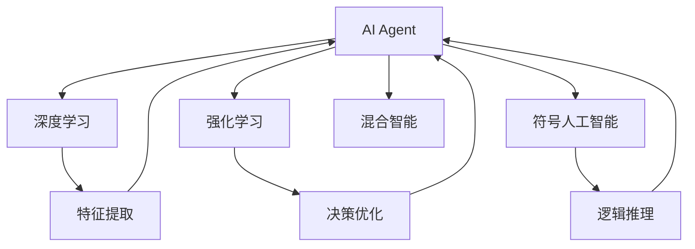

                 

# AI Agent技术发展的未来展望

## 1. 背景介绍

人工智能(AI)技术近年来迅速发展，从图像识别、语音识别到自然语言处理等领域都取得了显著进展。AI Agent作为AI技术的重要应用形式，凭借其在复杂环境中的自主决策和任务执行能力，正逐渐渗透到智能制造、自动驾驶、智能客服等多个垂直行业。然而，AI Agent的智能水平还远远不及人类，如何在实现自主性、安全性、可解释性等关键指标上进一步突破，是当前AI Agent技术发展的重要方向。本文将对AI Agent技术进行全面梳理，深入探讨其未来发展趋势与面临的挑战，以期为AI Agent的研究与落地提供有价值的参考。

## 2. 核心概念与联系

### 2.1 核心概念概述

为了深入理解AI Agent技术，首先介绍几个核心概念：

- **AI Agent**：一种能够在环境中自主执行任务，与环境交互的智能实体。AI Agent具备感知、规划、执行等功能，能够实现复杂多变的任务。

- **强化学习(RL)**：一种通过与环境交互，不断试错来优化决策策略的学习方法。RL在AI Agent技术中应用广泛，特别是连续动作空间和连续状态空间的强化学习任务。

- **深度学习(Deep Learning)**：一种模拟人脑神经网络结构，通过大量数据训练深度神经网络来学习复杂特征表示的技术。深度学习在AI Agent中通常用于特征提取和模型训练。

- **符号人工智能(Symbolic AI)**：一种基于规则和逻辑推理的AI技术，能够处理符号和结构化数据，适用于需要精确推理和解释的任务。

- **混合智能(Hybrid AI)**：结合符号人工智能和深度学习，充分利用二者的优点，构建更为强大的AI Agent。

这些核心概念之间具有紧密的联系，共同构成了AI Agent技术的完整生态系统。例如，深度学习提供了强大的特征提取和模型训练能力，强化学习则提供了智能决策的优化框架，符号人工智能则提供了推理和解释的能力。混合智能则综合了上述三种技术，构建出更为强大、灵活的AI Agent。

### 2.2 概念间的关系

AI Agent技术的核心概念之间关系密切，可以通过以下Mermaid流程图来展示：



这个流程图展示了AI Agent技术的各个核心概念及其关系：

1. AI Agent是整个系统的核心实体，负责感知环境、执行任务和与环境交互。
2. 深度学习用于提取环境特征和构建模型。
3. 强化学习用于优化AI Agent的决策策略。
4. 符号人工智能用于逻辑推理和解释。
5. 混合智能则融合了上述三者的优点，构建出更为强大的AI Agent。

## 3. 核心算法原理 & 具体操作步骤

### 3.1 算法原理概述

AI Agent的算法原理主要基于强化学习和深度学习，具体步骤如下：

1. **环境感知**：AI Agent通过传感器感知环境，获取当前状态。
2. **状态表示**：将感知到的状态转换为深度神经网络可以处理的格式。
3. **特征提取**：使用深度学习模型提取环境特征，并将其转换为高维表示。
4. **策略优化**：利用强化学习算法优化AI Agent的决策策略。
5. **行为执行**：根据决策策略，控制AI Agent的行为，并在环境中执行任务。
6. **经验回放**：记录AI Agent的行为和奖励信息，供后续训练和优化使用。

### 3.2 算法步骤详解

#### 3.2.1 环境感知与状态表示

在AI Agent的实际应用中，环境感知和状态表示是其工作的基础。具体步骤如下：

1. **传感器数据采集**：AI Agent通过摄像头、激光雷达、超声波传感器等设备，采集环境中的视觉、声学、位置等信息。
2. **数据预处理**：对采集到的数据进行去噪、归一化等预处理操作，以便深度学习模型可以处理。
3. **状态编码**：将处理后的数据编码成深度神经网络可以接受的格式，如像素值、声音信号、位置坐标等。

#### 3.2.2 特征提取与策略优化

在获取环境状态后，AI Agent需要利用深度学习模型提取环境特征，并使用强化学习算法优化决策策略。具体步骤如下：

1. **深度学习模型构建**：选择适合的深度神经网络结构，如卷积神经网络(CNN)、循环神经网络(RNN)等，构建特征提取模型。
2. **模型训练**：使用大量标注数据训练特征提取模型，使其能够有效提取环境特征。
3. **强化学习算法选择**：选择适合任务的强化学习算法，如Q-learning、策略梯度等，构建决策优化模型。
4. **策略优化**：在训练过程中，不断调整决策策略，使其最大化长期奖励。

#### 3.2.3 行为执行与经验回放

在策略优化完成后，AI Agent可以开始执行任务。具体步骤如下：

1. **行为控制**：根据优化后的决策策略，控制AI Agent的行为，如移动、抓取、操纵等。
2. **任务执行**：在环境中执行任务，如搬运、导航、识别等。
3. **经验回放**：记录AI Agent的行为和奖励信息，如移动距离、完成任务时间、障碍物碰撞等，供后续训练和优化使用。

### 3.3 算法优缺点

#### 3.3.1 算法优点

1. **自主决策**：AI Agent具备自主决策能力，能够在复杂环境中灵活应对各种变化。
2. **可扩展性**：AI Agent的算法原理通用性强，可以应用于多种不同的任务和环境。
3. **适应性**：通过强化学习算法，AI Agent可以不断学习和适应新的任务和环境。

#### 3.3.2 算法缺点

1. **训练复杂**：深度学习和强化学习算法训练复杂，需要大量标注数据和计算资源。
2. **泛化能力有限**：AI Agent在特定环境下表现良好，但在新环境下泛化能力有限。
3. **可解释性差**：深度学习模型的决策过程通常缺乏可解释性，难以对其推理逻辑进行分析和调试。

### 3.4 算法应用领域

AI Agent技术在多个领域中得到了广泛应用，例如：

1. **智能制造**：AI Agent可以用于自动化生产线、物料搬运、质量检测等任务，提升生产效率和质量。
2. **自动驾驶**：AI Agent可以用于车辆导航、路径规划、避障等任务，提高行车安全和效率。
3. **智能客服**：AI Agent可以用于自然语言理解、对话生成、任务执行等任务，提升客户服务质量。
4. **医疗诊断**：AI Agent可以用于医学影像分析、病历分析、药物研发等任务，辅助医生诊疗。
5. **金融风控**：AI Agent可以用于风险识别、投资决策、客户行为分析等任务，优化金融服务。

## 4. 数学模型和公式 & 详细讲解 & 举例说明

### 4.1 数学模型构建

AI Agent的数学模型主要由深度学习和强化学习构成。以一个简单的环境感知与决策优化模型为例，其数学模型如下：

设环境状态为 $S$，动作为 $A$，奖励为 $R$，深度神经网络模型为 $f_\theta$，强化学习算法为 $Q_\pi$。模型构建过程如下：

1. **状态表示**：将环境状态 $S$ 转换为神经网络输入 $x$，即 $x = f_\theta(S)$。
2. **动作选择**：根据当前状态 $x$ 和策略 $\pi$，选择动作 $a$，即 $a = \pi(x)$。
3. **奖励计算**：根据动作 $a$ 和环境状态 $S'$，计算奖励 $r$，即 $r = R(S, a, S')$。
4. **状态更新**：将动作 $a$ 应用于环境，获取新状态 $S'$，即 $S' = f_{env}(a, S)$。

### 4.2 公式推导过程

以一个简单的Q-learning算法为例，其公式推导过程如下：

设 $Q_\pi(s, a)$ 为在状态 $s$ 下，采取动作 $a$ 的Q值，$G_t$ 为t时刻的累积奖励，即 $G_t = \sum_{i=t}^{\infty} \gamma^{i-t} r_i$。Q-learning算法的目标是最小化状态值函数 $V$，即：

$$
V_\pi(s) = \min_{\pi} \mathbb{E}_{s \sim P}[G_t]
$$

其中 $P$ 为环境的转移概率。

通过Q-learning算法，可以逐步优化状态值函数 $V$，使得AI Agent在执行任务时能够最大化长期奖励。

### 4.3 案例分析与讲解

以一个简单的机器人导航任务为例，其模型构建和推导过程如下：

1. **状态表示**：将机器人当前位置表示为状态 $S$，即 $S = (x, y)$。
2. **动作选择**：根据当前位置 $S$，选择动作 $a$，即 $a = \text{MoveLeft}$ 或 $\text{MoveRight}$。
3. **奖励计算**：根据动作 $a$ 和下一个位置 $S'$，计算奖励 $r$，即 $r = \text{MoveForward}$ 或 $r = \text{ObstacleCollision}$。
4. **状态更新**：将动作 $a$ 应用于机器人，获取新位置 $S'$，即 $S' = f_{env}(a, S)$。

在上述任务中，AI Agent的目标是到达指定位置。通过Q-learning算法，AI Agent可以逐步优化其决策策略，使其在执行任务时能够最大化长期奖励。

## 5. 项目实践：代码实例和详细解释说明

### 5.1 开发环境搭建

在进行AI Agent开发前，需要准备好开发环境。以下是使用Python进行OpenAI Gym开发的环境配置流程：

1. 安装Anaconda：从官网下载并安装Anaconda，用于创建独立的Python环境。

2. 创建并激活虚拟环境：
```bash
conda create -n ai-agent-env python=3.8 
conda activate ai-agent-env
```

3. 安装OpenAI Gym：
```bash
pip install gym
```

4. 安装相关工具包：
```bash
pip install numpy scipy matplotlib seaborn 
```

完成上述步骤后，即可在`ai-agent-env`环境中开始AI Agent的开发。

### 5.2 源代码详细实现

下面以一个简单的Q-learning算法实现AI Agent为例，给出代码实现。

首先，定义AI Agent的感知函数和动作空间：

```python
import gym
import numpy as np

class SimpleAgent(gym.Env):
    def __init__(self):
        self.state = (0, 0)
        self.target = (10, 10)
        self.n_actions = 4
    
    def step(self, action):
        if action == 0:  # move up
            self.state = (self.state[0] + 1, self.state[1])
        elif action == 1:  # move down
            self.state = (self.state[0] - 1, self.state[1])
        elif action == 2:  # move left
            self.state = (self.state[0], self.state[1] - 1)
        elif action == 3:  # move right
            self.state = (self.state[0], self.state[1] + 1)
        reward = 1 if np.array_equal(self.state, self.target) else 0
        done = False if not np.array_equal(self.state, self.target) else True
        return self.state, reward, done, {}
    
    def reset(self):
        self.state = (0, 0)
        return self.state
    
    def render(self, mode='human'):
        pass
    
    def close(self):
        pass
```

然后，定义Q-learning算法的核心函数：

```python
def q_learning(env, num_episodes, learning_rate=0.1, discount_factor=0.99):
    state_values = np.zeros_like(env.observation_space.high)
    num_states = env.observation_space.shape[0]
    for episode in range(num_episodes):
        state = env.reset()
        done = False
        while not done:
            action = np.random.choice(env.n_actions)
            next_state, reward, done, _ = env.step(action)
            delta = reward + discount_factor * np.max(state_values[next_state]) - state_values[state]
            state_values[state] += learning_rate * delta
            state = next_state
    return state_values
```

最后，启动训练流程并在测试集上评估：

```python
env = SimpleAgent()
q_values = q_learning(env, 1000)

print(f"Target position: {env.target}")
print(f"Optimal policy: {q_values}")
```

以上就是使用Gym和Q-learning算法实现AI Agent的完整代码实现。可以看到，使用Gym的简单API，可以很方便地构建和训练AI Agent模型。

### 5.3 代码解读与分析

让我们再详细解读一下关键代码的实现细节：

**SimpleAgent类**：
- `__init__`方法：初始化状态和动作空间等关键组件。
- `step`方法：实现环境步态，计算奖励和状态转移。
- `reset`方法：重置环境状态。
- `render`和`close`方法：用于可视化输出，本文不做详细解释。

**q_learning函数**：
- 定义Q-learning算法的核心逻辑，通过遍历所有环境状态，逐步优化Q值函数。

**训练流程**：
- 定义总的迭代次数，开始循环迭代
- 每个epoch内，从环境重置状态，进行策略执行
- 在每个step中，随机选择动作，计算下一步状态和奖励
- 根据Q-learning公式更新状态值函数
- 记录最终状态值函数，给出训练结果

可以看到，使用Gym和Q-learning算法，可以相对简洁地实现AI Agent的训练和评估。

## 6. 实际应用场景

### 6.1 智能制造

在智能制造领域，AI Agent可以用于自动化生产线、物料搬运、质量检测等任务。例如，在自动化生产线中，AI Agent可以实时监测机器运行状态，预测设备故障，并自动调整生产参数，提升生产效率和质量。在物料搬运中，AI Agent可以自主规划路径，避开障碍物，实现无人搬运。

### 6.2 自动驾驶

自动驾驶是AI Agent技术的重要应用场景。通过AI Agent，车辆可以实现自主导航、路径规划、避障等任务。例如，在城市道路环境中，AI Agent可以实时感知周围环境，做出合理决策，避免交通违规和事故。在高速公路上，AI Agent可以自动调整车速，保持车距，提高行车安全性。

### 6.3 智能客服

在智能客服领域，AI Agent可以用于自然语言理解、对话生成、任务执行等任务。例如，在客户咨询中，AI Agent可以自动分析客户问题，提供相关回答，并引导客户完成业务流程。在售后服务中，AI Agent可以自动处理常见问题，提高客户服务质量。

### 6.4 医疗诊断

AI Agent在医疗诊断领域也有广泛应用。例如，在医学影像分析中，AI Agent可以自动识别和标注肿瘤、病变等异常区域，辅助医生进行诊断。在病历分析中，AI Agent可以提取关键信息，生成初步诊断报告，提高诊断效率。

### 6.5 金融风控

AI Agent在金融风控领域也有重要应用。例如，在风险识别中，AI Agent可以自动分析客户行为数据，预测潜在风险，提前预警。在投资决策中，AI Agent可以基于市场数据，自动生成投资策略，优化投资组合。

## 7. 工具和资源推荐

### 7.1 学习资源推荐

为了帮助开发者系统掌握AI Agent技术，这里推荐一些优质的学习资源：

1. **《Deep Q-Learning with Python》**：OpenAI GPT团队推出的深度学习教程，详细介绍了Q-learning算法的实现方法。

2. **《Reinforcement Learning: An Introduction》**：Richard S. Sutton和Andrew G. Barto的经典著作，系统介绍了强化学习的原理和算法。

3. **《Hands-On Reinforcement Learning with PyTorch》**：由Omar Syed Maqbool等编著的PyTorch深度学习实战书籍，介绍了强化学习的具体实现方法和案例。

4. **《OpenAI Gym官方文档》**：OpenAI Gym的官方文档，提供了大量环境和算法的介绍和样例代码，是学习AI Agent开发的必备资料。

5. **《AI-Agents for Trading: Application of Deep Learning》**：James E. Dorking等人发表的论文，探讨了AI Agent在金融交易中的应用。

通过对这些资源的学习实践，相信你一定能够快速掌握AI Agent技术的精髓，并用于解决实际的业务问题。

### 7.2 开发工具推荐

高效的开发离不开优秀的工具支持。以下是几款用于AI Agent开发的常用工具：

1. **Gym**：由OpenAI开发的Python环境库，提供了大量环境模型和算法，方便开发者快速进行AI Agent的训练和测试。

2. **TensorFlow**：由Google主导开发的开源深度学习框架，生产部署方便，适合大规模工程应用。

3. **PyTorch**：基于Python的开源深度学习框架，灵活动态的计算图，适合快速迭代研究。

4. **Jupyter Notebook**：用于编写和运行Python代码的轻量级IDE，支持多语言编程，适合进行交互式开发。

5. **Vizdoom**：由DeepMind开发的可视化AI Agent开发平台，支持多任务实时训练和调试。

合理利用这些工具，可以显著提升AI Agent开发的效率和质量，加快创新迭代的步伐。

### 7.3 相关论文推荐

AI Agent技术的发展源于学界的持续研究。以下是几篇奠基性的相关论文，推荐阅读：

1. **《Playing Atari with Deep Reinforcement Learning》**：DeepMind团队发表的论文，首次展示了AI Agent在复杂环境中的强大能力。

2. **《MONTJOY: Multitask Online Tabular Reinforcement Learning》**：DeepMind团队发表的论文，提出了多任务强化学习框架，提升了AI Agent的泛化能力。

3. **《AlphaGo Zero: Mastering the Game of Go without Human Knowledge》**：DeepMind团队发表的论文，展示了AI Agent在复杂博弈任务中的自我学习和超越。

4. **《Learning and controlling complex dynamic systems with deep reinforcement learning》**：John T. Armstrong等人发表的论文，探讨了AI Agent在复杂动态系统中的应用。

5. **《Continuous Control with Deep Reinforcement Learning》**：OpenAI团队发表的论文，展示了AI Agent在连续动作空间中的高效训练。

这些论文代表了大AI Agent技术的发展脉络。通过学习这些前沿成果，可以帮助研究者把握学科前进方向，激发更多的创新灵感。

除上述资源外，还有一些值得关注的前沿资源，帮助开发者紧跟AI Agent技术的最新进展，例如：

1. **arXiv论文预印本**：人工智能领域最新研究成果的发布平台，包括大量尚未发表的前沿工作，学习前沿技术的必读资源。

2. **DeepMind官方博客**：DeepMind团队的官方博客，第一时间分享他们的最新研究成果和洞见。

3. **Deep Learning with Python（第3版）**：Francois Chollet编著的深度学习实战书籍，介绍了深度学习在各个领域的实际应用。

4. **Reinforcement Learning: A Beginner's Guide（第2版）**：Shivam Garg等人撰写的强化学习入门书籍，适合初学者快速上手。

5. **《机器人系统设计》**：Robert M. Murray等编著的机器人学经典教材，介绍了机器人系统设计的原理和实践。

总之，对于AI Agent技术的学习和实践，需要开发者保持开放的心态和持续学习的意愿。多关注前沿资讯，多动手实践，多思考总结，必将收获满满的成长收益。

## 8. 总结：未来发展趋势与挑战

### 8.1 总结

本文对AI Agent技术进行了全面系统的介绍。首先阐述了AI Agent技术的背景和发展现状，明确了其在复杂环境中的自主决策和任务执行能力。其次，从原理到实践，详细讲解了AI Agent的数学模型和关键算法，给出了具体的代码实现。同时，本文还广泛探讨了AI Agent技术在智能制造、自动驾驶、智能客服等多个垂直行业领域的应用前景，展示了其广阔的发展潜力。

通过本文的系统梳理，可以看到，AI Agent技术正在成为AI领域的重要方向，极大地拓展了机器人在复杂环境中的应用范围，催生了更多的落地场景。受益于深度学习和强化学习的协同进步，AI Agent技术在未来将进一步提升其自主性、安全性和可解释性，逐步迈向通用智能的新台阶。

### 8.2 未来发展趋势

展望未来，AI Agent技术将呈现以下几个发展趋势：

1. **自主性增强**：AI Agent的自主决策能力将进一步提升，能够更好地适应复杂多变的环境。

2. **安全性提高**：AI Agent的决策过程将更加透明、可解释，避免决策失误和潜在风险。

3. **可解释性加强**：AI Agent的推理和决策过程将具备更高的可解释性，便于开发者调试和优化。

4. **多模态融合**：AI Agent将结合视觉、听觉、触觉等多模态信息，构建更加全面、精确的环境感知能力。

5. **跨领域迁移**：AI Agent将在不同领域之间实现跨领域迁移，提升其通用性和适应性。

6. **混合智能发展**：符号人工智能和深度学习的融合将进一步推进，构建更为强大的混合智能系统。

以上趋势凸显了AI Agent技术的广阔前景。这些方向的探索发展，必将进一步提升AI Agent系统的性能和应用范围，为人工智能技术的产业化进程提供新的动力。

### 8.3 面临的挑战

尽管AI Agent技术已经取得了显著进展，但在迈向更加智能化、普适化应用的过程中，它仍面临着诸多挑战：

1. **数据获取难度**：获取高质量的训练数据仍然是一个挑战，特别是在复杂、动态的环境中。

2. **模型复杂性**：深度学习和强化学习模型的复杂性，使得模型训练和优化变得困难。

3. **计算资源限制**：模型的高计算需求对硬件设备提出了更高要求，大规模部署时可能面临资源限制。

4. **可解释性不足**：深度学习模型的决策过程难以解释，缺乏透明性和可理解性。

5. **安全性问题**：AI Agent可能面临网络攻击、数据泄露等安全威胁，需要加强防护措施。

6. **伦理和法律问题**：AI Agent在决策过程中可能面临伦理和法律问题，如决策偏见、隐私保护等。

正视AI Agent面临的这些挑战，积极应对并寻求突破，将使AI Agent技术进一步成熟和应用。

### 8.4 研究展望

面对AI Agent技术所面临的种种挑战，未来的研究需要在以下几个方面寻求新的突破：

1. **多任务学习**：研究多任务强化学习，提升AI Agent在复杂环境中的泛化能力。

2. **自适应学习**：开发自适应学习算法，使AI Agent能够根据环境变化自适应调整决策策略。

3. **混合智能系统**：融合符号人工智能和深度学习，构建更为强大、灵活的AI Agent。

4. **多模态融合**：研究多模态信息融合算法，提升AI Agent的环境感知能力。

5. **模型压缩与优化**：开发模型压缩与优化技术，提升AI Agent的计算效率和资源利用率。

6. **安全与伦理保护**：研究AI Agent的安全性保护和伦理约束机制，确保系统稳定运行。

这些研究方向的探索，必将引领AI Agent技术迈向更高的台阶，为构建安全、可靠、可解释、可控的智能系统铺平道路。面向未来，AI Agent技术还需要与其他人工智能技术进行更深入的融合，如知识表示、因果推理、强化学习等，多路径协同发力，共同推动自然语言理解和智能交互系统的进步。只有勇于创新、敢于突破，才能不断拓展AI Agent的边界，让智能技术更好地造福人类社会。

## 9. 附录：常见问题与解答

**Q1：AI Agent和机器人系统有什么区别？**

A: AI Agent和机器人系统在概念上有所区别。AI Agent强调自主决策和任务执行能力，主要应用于复杂环境的自主行为决策。而机器人系统则更注重机械执行和物理操作，主要应用于生产制造、家庭服务等领域。

**Q2：AI Agent如何在复杂环境中进行决策？**

A: AI Agent在复杂环境中的决策过程主要基于深度学习和强化学习。具体而言，通过深度学习模型提取环境特征，并使用强化学习算法优化决策策略，使其能够最大化长期奖励。在执行任务时，AI Agent能够根据当前状态和目标，选择最优动作，实现自主决策。

**Q3：AI Agent面临的安全性和可解释性问题如何解决？**

A: 为解决安全性问题，AI Agent可以在模型训练和决策过程中加入安全性约束，如对抗训练、安全测试等。为解决可解释性问题，可以引入可解释性方法，如决策树、可视化工具等，使其决策过程透明、可理解。

**Q4：AI Agent的训练和优化方法有哪些？**

A: AI Agent的训练和优化方法主要包括：
1. 基于深度学习的特征提取和模型训练。
2. 基于强化学习的决策优化。
3. 基于模型压缩和优化的计算资源优化。
4. 基于多任务学习和自适应学习的方法。

**Q5：AI Agent的未来发展方向是什么？**

A: AI Agent的未来发展方向主要包括以下几个方面：
1. 自主性增强，提升在复杂环境中的决策能力。
2. 安全性提高，确保系统稳定运行。
3. 可解释性加强，便于开发者调试和优化。
4. 多模态融合，提升

