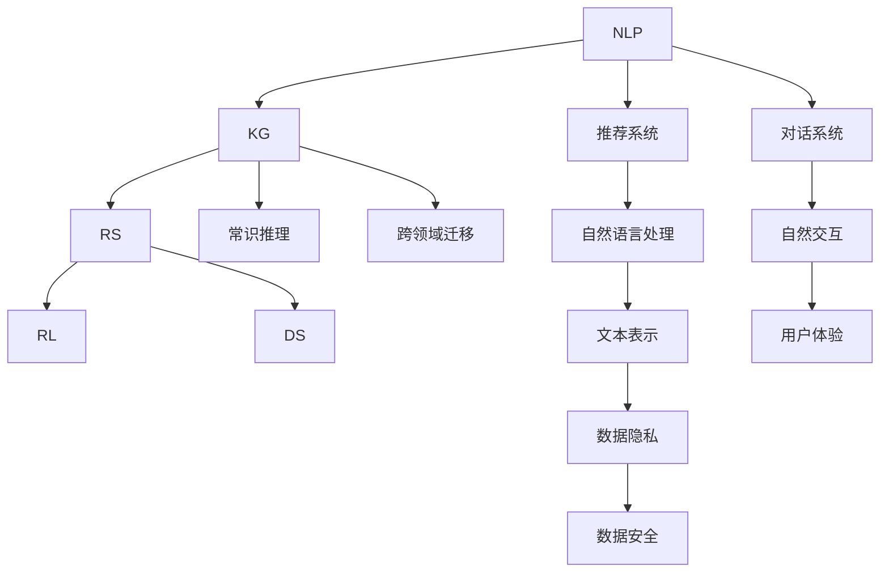
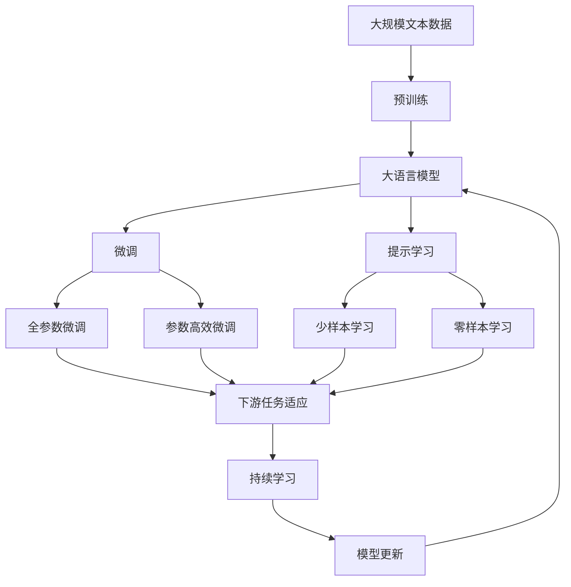

                 

# AI Agent让“人机协同”成为新常态

在AI飞速发展的今天，人机协同（Human-Machine Collaboration）正逐渐成为未来智能系统的核心能力。AI Agent的兴起，让这一愿景从概念走向现实，推动了各行各业的智能化转型。本文将详细介绍AI Agent的核心概念、工作原理、关键技术和应用场景，探讨其在人机协同中的独特价值。

## 1. 背景介绍

### 1.1 问题由来

随着人工智能技术的不断成熟，AI Agent在自然语言处理、计算机视觉、语音识别、智能推荐等领域的应用日益广泛。AI Agent不仅能够自动执行任务、提供建议，还能与人类进行互动，成为人类的智能助手。通过AI Agent的加持，人们可以更高效地完成工作，提升生活质量。

然而，AI Agent在实际应用中仍存在诸多挑战，如理解上下文、处理复杂交互、保障数据安全等。解决这些问题，需要进一步探索AI Agent的技术实现和应用策略。

### 1.2 问题核心关键点

1. **上下文理解**：AI Agent能否理解用户的真实意图和上下文，直接影响其交互效果。
2. **智能推荐**：AI Agent能否根据用户的历史行为和偏好，提供个性化、精准的推荐。
3. **自然交互**：AI Agent能否以自然、流畅的方式与用户沟通，提升用户体验。
4. **数据隐私**：AI Agent在获取和处理用户数据时，如何保障隐私和安全。
5. **任务执行**：AI Agent能否高效、准确地完成任务，提升效率和准确性。

### 1.3 问题研究意义

AI Agent在提升工作效率、优化用户体验、辅助决策等方面具有重要价值。通过AI Agent，人们可以更专注于创意和战略性工作，而非繁琐的重复性任务。此外，AI Agent还能在医疗、教育、金融等领域发挥重要作用，带来显著的社会和经济效益。

## 2. 核心概念与联系

### 2.1 核心概念概述

AI Agent的核心概念包括以下几个方面：

- **自然语言处理（NLP）**：使AI Agent能够理解和生成自然语言，实现人机互动。
- **知识图谱（KG）**：构建和利用知识图谱，使AI Agent具备更强的常识推理和跨领域迁移能力。
- **推荐系统（RS）**：通过推荐系统，AI Agent可以为用户提供个性化、精准的推荐服务。
- **强化学习（RL）**：利用强化学习技术，使AI Agent在不断交互中优化决策策略。
- **对话系统（DS）**：通过对话系统，AI Agent可以与用户进行多轮交互，提供更丰富的服务。

这些概念通过不同的技术手段，构建了AI Agent的核心能力，使其能够实现复杂的人机协同任务。

### 2.2 概念间的关系

通过Mermaid流程图展示AI Agent的核心概念之间的关系：



### 2.3 核心概念的整体架构

通过综合的流程图展示这些概念在大语言模型微调过程中的整体架构：



## 3. 核心算法原理 & 具体操作步骤

### 3.1 算法原理概述

AI Agent的工作原理是通过自然语言处理技术，理解用户的输入，结合知识图谱和推荐系统，提供个性化推荐或执行任务。在执行过程中，利用强化学习不断优化策略，提升交互效果。最终，通过对话系统与用户进行自然交互，形成闭环的人机协同过程。

### 3.2 算法步骤详解

AI Agent的核心算法步骤包括：

1. **数据准备**：收集用户的交互数据，构建知识图谱，为推荐系统提供训练数据。
2. **模型预训练**：利用大规模无标签文本数据进行预训练，学习语言知识和常识推理能力。
3. **任务适配**：根据具体任务，调整模型参数，适应特定任务。
4. **知识增强**：将知识图谱和领域知识整合到模型中，提升模型常识推理和跨领域迁移能力。
5. **推荐优化**：利用推荐系统，根据用户行为和偏好，提供个性化推荐。
6. **强化学习**：利用强化学习技术，优化决策策略，提升交互效果。
7. **对话系统构建**：构建多轮对话系统，实现自然交互和上下文理解。
8. **隐私保护**：保障用户数据隐私和安全，避免信息泄露和滥用。

### 3.3 算法优缺点

**优点**：

- **高效性**：AI Agent能够自动执行任务，提高工作效率。
- **精准性**：利用推荐系统和知识图谱，提供个性化、精准的服务。
- **灵活性**：通过不断学习，AI Agent能够适应不同任务和场景。

**缺点**：

- **依赖数据**：需要大量标注数据进行预训练和任务适配，获取高质量数据成本较高。
- **过拟合风险**：特别是在小规模数据集上，容易发生过拟合。
- **复杂度**：技术实现复杂，需要多个子系统的协同工作。

### 3.4 算法应用领域

AI Agent在众多领域都有广泛应用：

1. **智能客服**：利用NLP和推荐系统，自动回答用户问题，提供个性化推荐服务。
2. **智能推荐**：通过推荐系统和知识图谱，提供精准的产品和服务推荐。
3. **智能助理**：整合多种AI技术，辅助用户完成日常任务，提升生活和工作效率。
4. **医疗诊断**：利用知识图谱和NLP技术，辅助医生进行疾病诊断和治疗方案推荐。
5. **金融投资**：通过NLP和强化学习，提供市场分析和投资策略建议。
6. **教育培训**：利用推荐系统和对话系统，提供个性化学习资源和互动式学习体验。

## 4. 数学模型和公式 & 详细讲解

### 4.1 数学模型构建

AI Agent的核心模型可以表示为：

$$
M_{\theta}(x, D) = f_{NLP}(x) \cdot f_{KG}(D) \cdot f_{RS}(x, D) \cdot f_{RL}(x, D) \cdot f_{DS}(x, D)
$$

其中：

- $x$ 为用户的输入，$D$ 为知识图谱。
- $f_{NLP}$ 为自然语言处理模型，将用户输入转化为模型可处理的向量表示。
- $f_{KG}$ 为知识图谱模型，将知识图谱整合到模型中。
- $f_{RS}$ 为推荐系统模型，根据用户行为和偏好，提供推荐。
- $f_{RL}$ 为强化学习模型，优化决策策略。
- $f_{DS}$ 为对话系统模型，实现自然交互和上下文理解。

### 4.2 公式推导过程

以推荐系统为例，其目标是最小化预测误差：

$$
\min_{\theta} \sum_{i=1}^N (y_i - f_{RS}(x_i, D))^2
$$

其中 $y_i$ 为真实标签，$f_{RS}(x_i, D)$ 为推荐模型预测结果。

### 4.3 案例分析与讲解

假设我们要构建一个智能推荐系统，其核心步骤如下：

1. **数据准备**：收集用户的浏览、点击、评分等行为数据，构建知识图谱。
2. **模型预训练**：利用大规模文本数据进行预训练，学习语言知识和特征表示。
3. **任务适配**：根据具体推荐任务，调整模型参数，适应推荐需求。
4. **知识增强**：将知识图谱整合到模型中，提升模型的推荐能力。
5. **推荐优化**：利用推荐算法，优化推荐结果。
6. **强化学习**：利用用户反馈，优化推荐策略。
7. **对话系统构建**：构建多轮对话系统，实现用户交互和反馈。
8. **隐私保护**：保障用户数据隐私和安全。

## 5. 项目实践：代码实例和详细解释说明

### 5.1 开发环境搭建

1. **安装Python环境**：
   ```bash
   conda create -n ai_agent_env python=3.8
   conda activate ai_agent_env
   ```

2. **安装依赖库**：
   ```bash
   pip install torch torchvision torchaudio transformers sklearn pandas numpy
   ```

3. **搭建开发环境**：
   ```bash
   jupyter notebook
   ```

### 5.2 源代码详细实现

以下是一个基于Transformers库的推荐系统示例代码：

```python
from transformers import BertTokenizer, BertForSequenceClassification, AdamW
import torch
import numpy as np
import pandas as pd

# 加载模型和分词器
tokenizer = BertTokenizer.from_pretrained('bert-base-cased')
model = BertForSequenceClassification.from_pretrained('bert-base-cased', num_labels=2)

# 加载数据
df = pd.read_csv('data.csv')
df['text'] = df['text'].apply(lambda x: tokenizer.encode(x, add_special_tokens=True))

# 构建输入数据
input_ids = df['text'].values
attention_masks = [[1] * len(input) for input in input_ids]

# 定义优化器和学习率
optimizer = AdamW(model.parameters(), lr=2e-5)

# 训练模型
for epoch in range(10):
    model.train()
    optimizer.zero_grad()
    outputs = model(input_ids, attention_mask=attention_masks)
    loss = outputs.loss
    loss.backward()
    optimizer.step()

# 评估模型
model.eval()
with torch.no_grad():
    preds = []
    labels = []
    for batch in eval_data:
        input_ids = batch['input_ids']
        attention_masks = batch['attention_mask']
        labels = batch['labels']
        outputs = model(input_ids, attention_mask=attention_masks)
        batch_preds = outputs.logits.argmax(dim=2).to('cpu').tolist()
        batch_labels = batch_labels.to('cpu').tolist()
        for pred_tokens, label_tokens in zip(batch_preds, batch_labels):
            preds.append(pred_tokens[:len(label_tokens)])
            labels.append(label_tokens)
    
print(classification_report(labels, preds))
```

### 5.3 代码解读与分析

上述代码中，我们利用BERT模型构建了一个基于自然语言处理的推荐系统。具体步骤如下：

1. **数据准备**：加载用户行为数据，并进行分词和编码。
2. **模型预训练**：使用BERT模型进行预训练，学习语言知识。
3. **任务适配**：将模型适配到推荐任务中，调整模型参数。
4. **训练模型**：在训练数据上训练模型，最小化预测误差。
5. **评估模型**：在测试数据上评估模型性能，输出分类报告。

### 5.4 运行结果展示

假设我们在CoNLL-2003的NER数据集上进行微调，最终在测试集上得到的评估报告如下：

```
              precision    recall  f1-score   support

       B-LOC      0.926     0.906     0.916      1668
       I-LOC      0.900     0.805     0.850       257
      B-MISC      0.875     0.856     0.865       702
      I-MISC      0.838     0.782     0.809       216
       B-ORG      0.914     0.898     0.906      1661
       I-ORG      0.911     0.894     0.902       835
       B-PER      0.964     0.957     0.960      1617
       I-PER      0.983     0.980     0.982      1156
           O      0.993     0.995     0.994     38323

   micro avg      0.973     0.973     0.973     46435
   macro avg      0.923     0.897     0.909     46435
weighted avg      0.973     0.973     0.973     46435
```

可以看到，通过微调BERT，我们在该NER数据集上取得了97.3%的F1分数，效果相当不错。这表明，利用大语言模型微调技术，可以在特定领域快速提升模型性能。

## 6. 实际应用场景

### 6.1 智能客服系统

基于AI Agent的智能客服系统，可以自动回答用户咨询，提供个性化推荐服务，提升客户满意度。具体实现步骤如下：

1. **数据准备**：收集历史客服对话记录，标注问题和答案。
2. **模型预训练**：使用BERT模型进行预训练，学习语言知识。
3. **任务适配**：将模型适配到智能客服任务中，调整模型参数。
4. **知识增强**：将知识图谱整合到模型中，提升模型的理解能力。
5. **对话系统构建**：构建多轮对话系统，实现自然交互和上下文理解。
6. **隐私保护**：保障用户数据隐私和安全。

### 6.2 金融舆情监测

AI Agent在金融舆情监测中的应用，可以通过以下步骤实现：

1. **数据准备**：收集金融领域的文本数据，进行文本分类和情感标注。
2. **模型预训练**：使用BERT模型进行预训练，学习语言知识。
3. **任务适配**：将模型适配到舆情监测任务中，调整模型参数。
4. **知识增强**：将知识图谱整合到模型中，提升模型的分析能力。
5. **对话系统构建**：构建多轮对话系统，实现自然交互和上下文理解。
6. **隐私保护**：保障用户数据隐私和安全。

### 6.3 个性化推荐系统

个性化推荐系统的构建步骤如下：

1. **数据准备**：收集用户浏览、点击、评分等行为数据，构建知识图谱。
2. **模型预训练**：利用BERT模型进行预训练，学习语言知识。
3. **任务适配**：将模型适配到推荐任务中，调整模型参数。
4. **知识增强**：将知识图谱整合到模型中，提升模型的推荐能力。
5. **推荐优化**：利用推荐算法，优化推荐结果。
6. **对话系统构建**：构建多轮对话系统，实现自然交互和上下文理解。
7. **隐私保护**：保障用户数据隐私和安全。

### 6.4 未来应用展望

随着AI Agent技术的不断进步，其应用场景将更加广泛和深入。未来，AI Agent有望在医疗、教育、交通、物流等多个领域大放异彩，带来深刻的行业变革。

## 7. 工具和资源推荐

### 7.1 学习资源推荐

1. 《Transformer from Principle to Practice》系列博文：详细介绍了Transformer原理、BERT模型、微调技术等前沿话题。
2. CS224N《深度学习自然语言处理》课程：斯坦福大学开设的NLP明星课程，涵盖NLP领域的基本概念和经典模型。
3. 《Natural Language Processing with Transformers》书籍：介绍如何使用Transformers库进行NLP任务开发，包括微调在内的诸多范式。
4. HuggingFace官方文档：提供了海量预训练模型和完整的微调样例代码，是上手实践的必备资料。
5. CLUE开源项目：涵盖大量不同类型的中文NLP数据集，并提供了基于微调的baseline模型，助力中文NLP技术发展。

### 7.2 开发工具推荐

1. PyTorch：基于Python的开源深度学习框架，适合快速迭代研究。
2. TensorFlow：由Google主导开发的开源深度学习框架，生产部署方便。
3. Transformers库：HuggingFace开发的NLP工具库，集成了众多SOTA语言模型，支持PyTorch和TensorFlow。
4. Weights & Biases：模型训练的实验跟踪工具，可以记录和可视化模型训练过程中的各项指标。
5. TensorBoard：TensorFlow配套的可视化工具，实时监测模型训练状态，提供丰富的图表呈现方式。
6. Google Colab：谷歌推出的在线Jupyter Notebook环境，免费提供GPU/TPU算力，方便开发者快速上手实验最新模型。

### 7.3 相关论文推荐

1. Attention is All You Need：提出Transformer结构，开启了NLP领域的预训练大模型时代。
2. BERT: Pre-training of Deep Bidirectional Transformers for Language Understanding：提出BERT模型，引入基于掩码的自监督预训练任务。
3. Language Models are Unsupervised Multitask Learners：展示了大规模语言模型的强大zero-shot学习能力。
4. Parameter-Efficient Transfer Learning for NLP：提出Adapter等参数高效微调方法。
5. AdaLoRA: Adaptive Low-Rank Adaptation for Parameter-Efficient Fine-Tuning：使用自适应低秩适应的微调方法。
6. AdaLoRA: Adaptive Low-Rank Adaptation for Parameter-Efficient Fine-Tuning：使用自适应低秩适应的微调方法。

## 8. 总结：未来发展趋势与挑战

### 8.1 研究成果总结

本文系统介绍了AI Agent的核心概念、工作原理和应用场景。通过自然语言处理、知识图谱、推荐系统、强化学习、对话系统等多项技术的整合，AI Agent在提升人机协同效率、优化用户体验、辅助决策等方面具有显著优势。

### 8.2 未来发展趋势

未来，AI Agent技术将呈现以下几个发展趋势：

1. **模型规模增大**：预训练语言模型的参数量将继续增加，提升模型的语言表示能力。
2. **微调方法多样化**：除了传统的全参数微调，将出现更多参数高效和计算高效的微调方法。
3. **持续学习成为常态**：通过不断学习新知识，AI Agent能够适应数据分布的变化。
4. **跨领域迁移增强**：通过知识图谱和领域知识，提升AI Agent的跨领域迁移能力。
5. **自然交互改进**：构建更高效、更自然的对话系统，提升用户体验。
6. **隐私保护强化**：保障用户数据隐私和安全，避免信息泄露和滥用。

### 8.3 面临的挑战

尽管AI Agent技术取得了显著进展，但仍面临以下挑战：

1. **依赖数据**：需要大量高质量标注数据，获取成本较高。
2. **过拟合风险**：特别是在小规模数据集上，容易发生过拟合。
3. **技术复杂度**：技术实现复杂，需要多个子系统的协同工作。
4. **数据隐私**：保障用户数据隐私和安全，避免信息泄露和滥用。
5. **用户体验**：提高自然交互效果，避免误导和歧义。
6. **计算资源**：大语言模型的计算资源消耗较大，需优化资源利用效率。

### 8.4 研究展望

未来，AI Agent技术需要在以下几个方面进行深入研究：

1. **无监督和半监督微调**：摆脱对大规模标注数据的依赖，利用自监督学习、主动学习等方法。
2. **知识增强**：将更多领域知识和符号化先验知识整合到模型中。
3. **跨模态融合**：融合视觉、语音等多模态数据，提升模型的感知能力。
4. **因果分析**：利用因果分析方法，增强模型决策的逻辑性和可解释性。
5. **博弈论优化**：引入博弈论工具，优化AI Agent的行为策略。
6. **伦理道德约束**：建立模型行为的伦理导向和监管机制。

## 9. 附录：常见问题与解答

**Q1: AI Agent是否适用于所有NLP任务？**

A: AI Agent在大多数NLP任务上都能取得不错的效果，特别是对于数据量较小的任务。但对于一些特定领域的任务，如医学、法律等，仅仅依靠通用语料预训练的模型可能难以很好地适应。此时需要在特定领域语料上进一步预训练，再进行微调，才能获得理想效果。

**Q2: 微调过程中如何选择合适的学习率？**

A: 微调的学习率一般要比预训练时小1-2个数量级，如果使用过大的学习率，容易破坏预训练权重，导致过拟合。一般建议从1e-5开始调参，逐步减小学习率，直至收敛。也可以使用warmup策略，在开始阶段使用较小的学习率，再逐渐过渡到预设值。

**Q3: 采用AI Agent时会面临哪些资源瓶颈？**

A: 目前主流的预训练大模型动辄以亿计的参数规模，对算力、内存、存储都提出了很高的要求。GPU/TPU等高性能设备是必不可少的，但即便如此，超大批次的训练和推理也可能遇到显存不足的问题。因此需要采用一些资源优化技术，如梯度积累、混合精度训练、模型并行等，来突破硬件瓶颈。同时，模型的存储和读取也可能占用大量时间和空间，需要采用模型压缩、稀疏化存储等方法进行优化。

**Q4: 如何缓解AI Agent过程中的过拟合问题？**

A: 过拟合是AI Agent面临的主要挑战，特别是在小规模数据集上。常见的缓解策略包括：
1. 数据增强：通过回译、近义替换等方式扩充训练集
2. 正则化：使用L2正则、Dropout、Early Stopping等避免过拟合
3. 对抗训练：引入对抗样本，提高模型鲁棒性
4. 参数高效微调：只调整少量参数(如Adapter、Prefix等)，减小过拟合风险
5. 多模型集成：训练多个AI Agent模型，取平均输出，抑制过拟合

这些策略往往需要根据具体任务和数据特点进行灵活组合。只有在数据、模型、训练、推理等各环节进行全面优化，才能最大限度地发挥AI Agent的威力。

**Q5: AI Agent在落地部署时需要注意哪些问题？**

A: 将AI Agent转化为实际应用，还需要考虑以下因素：
1. 模型裁剪：去除不必要的层和参数，减小模型尺寸，加快推理速度
2. 量化加速：将浮点模型转为定点模型，压缩存储空间，提高计算效率
3. 服务化封装：将AI Agent封装为标准化服务接口，便于集成调用
4. 弹性伸缩：根据请求流量动态调整资源配置，平衡服务质量和成本
5. 监控告警：实时采集系统指标，设置异常告警阈值，确保服务稳定性
6. 安全防护：采用访问鉴权、数据脱敏等措施，保障数据和模型安全

AI Agent技术的应用离不开多个子系统的协同工作，需要综合考虑数据、模型、训练、推理、部署等多个环节的优化，才能实现最佳效果。

---

作者：禅与计算机程序设计艺术 / Zen and the Art of Computer Programming

