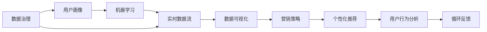
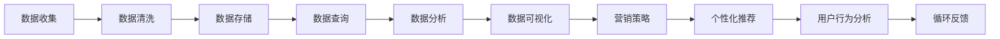
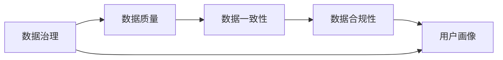
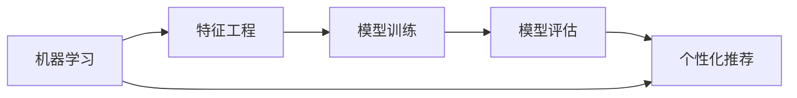
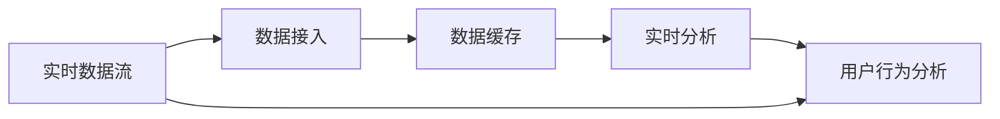

                 

# AI DMP 数据基建：构建数据驱动的营销生态

> 关键词：AI DMP, 数据基建, 数据驱动, 营销生态, 用户画像, 数据治理, 数据可视化, 用户行为分析

## 1. 背景介绍

### 1.1 问题由来

在当今数字化时代，企业营销面临着一个巨大挑战：如何在海量用户数据中挖掘出有价值的信息，并利用这些信息实现精准营销，从而提高投资回报率（ROI）。传统的数据驱动营销（Data-Driven Marketing）方法依赖于离线分析，成本高、周期长、效果难评估。为了解决这个问题，人工智能驱动的数据平台（AI Data Platform, DMP）应运而生。AI DMP通过对大规模用户数据进行智能分析，挖掘出有价值的消费者洞察，为营销决策提供强有力的数据支撑。

### 1.2 问题核心关键点

AI DMP的核心在于其能够通过先进的数据治理和分析技术，构建出高质量的用户画像，并提供实时、个性化、可解释的营销建议。其关键点包括：

- **数据治理**：确保数据质量、一致性和合规性，是构建高效AI DMP的前提。
- **用户画像**：通过数据挖掘和机器学习技术，刻画用户特征，实现精准营销。
- **营销建议**：基于用户画像和行为数据，生成个性化营销内容，提升用户体验和转化率。
- **可解释性**：保证算法的透明性和可解释性，帮助营销人员理解推荐结果。
- **实时更新**：实现实时数据接入和分析，快速响应市场变化。

### 1.3 问题研究意义

构建一个高效的AI DMP，对于优化营销策略、提升用户体验和增强客户忠诚度具有重要意义：

- **优化营销策略**：通过精准的用户画像，营销人员可以更好地理解目标用户，制定更加有效的营销策略。
- **提升用户体验**：个性化的推荐和内容，能显著提升用户满意度和互动率。
- **增强客户忠诚度**：持续的个性化互动，有助于建立深厚的用户关系，提升客户忠诚度。
- **降低成本**：精准营销减少了资源浪费，提高了投资回报率。
- **数据驱动**：AI DMP实现了从离线分析到实时响应的转变，使企业能够更灵活地应对市场变化。

## 2. 核心概念与联系

### 2.1 核心概念概述

AI DMP的构建涉及多个关键概念，包括数据治理、用户画像、实时数据流、机器学习、数据可视化和营销策略等。这些概念之间相互关联，共同构成了AI DMP的核心架构。

- **数据治理**：确保数据质量、一致性和合规性，是构建高效AI DMP的前提。
- **用户画像**：通过数据挖掘和机器学习技术，刻画用户特征，实现精准营销。
- **实时数据流**：实现实时数据接入和分析，快速响应市场变化。
- **机器学习**：利用机器学习算法，挖掘用户数据中的潜在价值，提供个性化推荐。
- **数据可视化**：通过可视化工具，帮助用户直观理解数据洞察，辅助决策。
- **营销策略**：基于用户画像和行为数据，生成个性化营销内容，提升用户体验和转化率。

这些概念之间的逻辑关系可以通过以下Mermaid流程图来展示：



这个流程图展示了AI DMP的各个组成部分及其相互关系。

### 2.2 概念间的关系

这些核心概念之间存在着紧密的联系，形成了AI DMP的完整生态系统。下面我们通过几个Mermaid流程图来展示这些概念之间的关系。

#### 2.2.1 AI DMP的架构



这个流程图展示了AI DMP的数据流和分析过程。从数据收集到个性化推荐，形成一个完整的闭环。

#### 2.2.2 数据治理与用户画像



这个流程图展示了数据治理与用户画像之间的关系。数据治理是构建高质量用户画像的前提。

#### 2.2.3 机器学习与个性化推荐



这个流程图展示了机器学习与个性化推荐之间的关系。机器学习模型是生成个性化推荐的基础。

#### 2.2.4 实时数据流与用户行为分析



这个流程图展示了实时数据流与用户行为分析之间的关系。实时数据流是用户行为分析的基础。

### 2.3 核心概念的整体架构

最后，我们用一个综合的流程图来展示这些核心概念在大数据平台（DMP）中的整体架构：


这个综合流程图展示了从数据治理到个性化推荐的完整过程。

## 3. 核心算法原理 & 具体操作步骤
### 3.1 算法原理概述

AI DMP的核心算法包括数据治理、用户画像、实时数据流、机器学习和个性化推荐等。这些算法共同作用，实现从数据采集、治理到个性化推荐的全流程自动化。

### 3.2 算法步骤详解

#### 3.2.1 数据治理

数据治理是构建高效AI DMP的前提。主要步骤包括：

1. **数据收集**：从多个渠道（如社交媒体、网站、移动应用等）收集用户数据。
2. **数据清洗**：去除噪声和重复数据，确保数据质量。
3. **数据标准化**：统一数据格式和单位，方便后续分析。
4. **数据加密**：确保数据隐私和安全。

#### 3.2.2 用户画像

用户画像通过数据挖掘和机器学习技术，刻画用户特征，实现精准营销。主要步骤包括：

1. **特征工程**：从原始数据中提取有意义的特征。
2. **模型训练**：使用机器学习算法（如K-means、PCA、SVM等）对用户特征进行建模。
3. **用户分群**：基于模型结果将用户分为不同群体。

#### 3.2.3 实时数据流

实时数据流实现实时数据接入和分析，快速响应市场变化。主要步骤包括：

1. **数据接入**：将数据流从各个渠道接入到AI DMP平台。
2. **数据缓存**：使用缓存技术（如Redis）存储实时数据。
3. **实时分析**：使用流式计算框架（如Apache Flink）对实时数据进行分析和处理。

#### 3.2.4 机器学习

机器学习算法挖掘用户数据中的潜在价值，提供个性化推荐。主要步骤包括：

1. **特征提取**：从用户行为数据中提取特征。
2. **模型训练**：使用机器学习算法（如深度学习、SVM、随机森林等）对特征进行建模。
3. **模型评估**：评估模型性能，调整模型参数。

#### 3.2.5 个性化推荐

基于用户画像和行为数据，生成个性化推荐。主要步骤包括：

1. **内容推荐**：根据用户画像和行为数据，生成推荐内容。
2. **效果评估**：评估推荐效果，调整推荐策略。
3. **用户反馈**：收集用户反馈，优化推荐算法。

### 3.3 算法优缺点

AI DMP算法具有以下优点：

1. **高效性**：实时数据流和机器学习算法能快速响应市场变化，提供实时推荐。
2. **个性化**：通过用户画像和行为数据，实现个性化推荐，提升用户体验。
3. **可解释性**：利用可解释性技术（如LIME、SHAP等），帮助用户理解推荐结果。
4. **自动化**：从数据治理到个性化推荐，实现全流程自动化，减少人工干预。

同时，AI DMP算法也存在一些缺点：

1. **数据隐私**：大量用户数据可能涉及隐私问题，需要采取严格的隐私保护措施。
2. **模型复杂性**：复杂的机器学习模型需要大量的计算资源和时间。
3. **过拟合风险**：模型可能会过拟合训练数据，导致泛化能力不足。
4. **技术门槛**：需要专业的数据工程师和算法工程师，对技术要求较高。

### 3.4 算法应用领域

AI DMP算法广泛应用于以下领域：

1. **电商**：通过用户画像和个性化推荐，提升销售额和客户满意度。
2. **金融**：通过实时数据分析，提供个性化的金融产品和服务。
3. **社交媒体**：通过用户行为分析，优化广告投放策略。
4. **旅游**：通过用户画像和推荐，提升旅游体验和客户忠诚度。
5. **医疗**：通过数据分析，提供个性化的医疗服务。

## 4. 数学模型和公式 & 详细讲解 & 举例说明
### 4.1 数学模型构建

AI DMP的数学模型主要包括以下几个部分：

1. **数据治理模型**：用于评估数据质量和一致性，确保数据符合合规性要求。
2. **用户画像模型**：通过聚类算法对用户进行分组，刻画用户特征。
3. **实时数据流模型**：基于流式计算框架，实现实时数据接入和分析。
4. **机器学习模型**：使用深度学习、SVM、随机森林等算法，挖掘用户数据中的潜在价值。
5. **个性化推荐模型**：使用协同过滤、深度学习等算法，生成个性化推荐。

### 4.2 公式推导过程

#### 4.2.1 数据治理模型

数据治理模型主要用来评估数据质量和一致性。假设数据集为 $D=\{d_i\}_{i=1}^N$，其中 $d_i=(x_i,y_i)$ 表示一个数据样本，$x_i$ 为原始数据，$y_i$ 为标签。数据治理模型的目标是最大化数据质量 $Q$ 和数据一致性 $C$。数据质量可以通过以下公式计算：

$$
Q = \frac{\sum_{i=1}^N \mathbf{1}[\text{DataClean}(x_i) == True]}{N}
$$

其中 $\text{DataClean}(x_i)$ 表示对数据 $x_i$ 进行清洗后的质量评估函数，$\mathbf{1}$ 表示示性函数，$True$ 表示数据清洗成功，$False$ 表示数据清洗失败。数据一致性可以通过以下公式计算：

$$
C = \frac{\sum_{i=1}^N \mathbf{1}[\text{DataConsistent}(x_i, y_i) == True]}{N}
$$

其中 $\text{DataConsistent}(x_i, y_i)$ 表示数据 $x_i$ 和标签 $y_i$ 是否一致。

#### 4.2.2 用户画像模型

用户画像模型通过聚类算法对用户进行分组，刻画用户特征。假设用户数据集为 $U=\{u_i\}_{i=1}^M$，其中 $u_i=(x_i, y_i)$ 表示一个用户样本，$x_i$ 为原始数据，$y_i$ 为用户标签。用户画像模型可以采用K-means聚类算法，计算用户的聚类中心 $c_k$ 和聚类个数 $K$。

K-means聚类算法的目标函数为：

$$
J = \sum_{k=1}^K \sum_{i=1}^M ||u_i - c_k||^2
$$

其中 $|| \cdot ||$ 表示欧几里得距离，$||u_i - c_k||^2$ 表示用户 $u_i$ 到聚类中心 $c_k$ 的距离的平方。

#### 4.2.3 实时数据流模型

实时数据流模型基于流式计算框架（如Apache Flink），实现实时数据接入和分析。假设实时数据流为 $D_t=\{d_{ti}\}_{i=1}^T$，其中 $d_{ti}=(x_{ti}, y_{ti})$ 表示时间戳为 $t$ 的数据样本，$x_{ti}$ 为原始数据，$y_{ti}$ 为标签。实时数据流模型的目标是在每个时间步 $t$ 内，实时计算数据流 $D_t$ 的平均质量 $Q_t$ 和平均一致性 $C_t$。

实时数据流模型的计算公式为：

$$
Q_t = \frac{\sum_{i=1}^T \mathbf{1}[\text{DataClean}(x_{ti}) == True]}{T}
$$

$$
C_t = \frac{\sum_{i=1}^T \mathbf{1}[\text{DataConsistent}(x_{ti}, y_{ti}) == True]}{T}
$$

#### 4.2.4 机器学习模型

机器学习模型使用深度学习、SVM、随机森林等算法，挖掘用户数据中的潜在价值。假设用户特征为 $X=\{x_i\}_{i=1}^M$，其中 $x_i$ 表示用户特征向量。机器学习模型的目标是通过训练数据 $D=\{(x_i, y_i)\}_{i=1}^M$，找到最优的模型参数 $\theta$。

机器学习模型的目标函数为：

$$
L(\theta) = \frac{1}{2N}\sum_{i=1}^N ||y_i - \hat{y}_i||^2 + \lambda ||\theta||^2
$$

其中 $\hat{y}_i$ 表示模型对样本 $x_i$ 的预测值，$\lambda$ 为正则化系数，$||\cdot||$ 表示L2范数。

#### 4.2.5 个性化推荐模型

个性化推荐模型使用协同过滤、深度学习等算法，生成个性化推荐。假设用户行为数据为 $B=\{(b_i, u_i)\}_{i=1}^N$，其中 $b_i$ 表示用户行为，$u_i$ 表示用户标识。个性化推荐模型的目标是通过用户行为数据 $B$ 和用户画像数据 $U$，生成个性化推荐列表 $R$。

个性化推荐模型的目标函数为：

$$
L(R) = \frac{1}{N}\sum_{i=1}^N \max_{r_i \in R} (y_i \cdot r_i) - \lambda ||R||^2
$$

其中 $r_i$ 表示推荐列表 $R$ 中的推荐项，$\max$ 表示推荐项的相关性排序，$y_i$ 表示用户对推荐项的评分。

### 4.3 案例分析与讲解

以电商平台的个性化推荐为例，分析其数据治理、用户画像、实时数据流、机器学习和个性化推荐的全流程。

#### 4.3.1 数据治理

电商平台从多个渠道收集用户数据，包括浏览历史、购买记录、评价反馈等。使用数据治理模型对数据进行清洗和标准化，去除噪声和重复数据，确保数据质量和一致性。

#### 4.3.2 用户画像

使用K-means聚类算法对用户进行分组，刻画用户特征。例如，将用户分为高价值用户、中价值用户和低价值用户。

#### 4.3.3 实时数据流

使用Apache Flink实现实时数据接入和分析，实时计算用户行为数据 $B$ 和用户画像数据 $U$。例如，实时计算用户的浏览记录、购买记录和评价反馈。

#### 4.3.4 机器学习

使用深度学习算法（如DNN、CNN等）对用户特征进行建模，挖掘用户数据中的潜在价值。例如，使用深度神经网络（DNN）对用户的浏览记录和购买记录进行建模，预测用户的购买意向。

#### 4.3.5 个性化推荐

使用协同过滤算法生成个性化推荐列表 $R$，例如，根据用户的历史购买记录和浏览记录，推荐用户可能感兴趣的商品。

## 5. 项目实践：代码实例和详细解释说明
### 5.1 开发环境搭建

在进行AI DMP项目实践前，我们需要准备好开发环境。以下是使用Python进行Scikit-learn开发的环境配置流程：

1. 安装Anaconda：从官网下载并安装Anaconda，用于创建独立的Python环境。

2. 创建并激活虚拟环境：
```bash
conda create -n pytorch-env python=3.8 
conda activate pytorch-env
```

3. 安装Scikit-learn：
```bash
pip install scikit-learn
```

4. 安装各类工具包：
```bash
pip install numpy pandas scikit-learn matplotlib tqdm jupyter notebook ipython
```

完成上述步骤后，即可在`pytorch-env`环境中开始AI DMP实践。

### 5.2 源代码详细实现

下面我们以电商平台个性化推荐为例，给出使用Scikit-learn对用户画像进行建模的Python代码实现。

首先，定义数据处理函数：

```python
from sklearn.cluster import KMeans
import numpy as np

def kmeans_clustering(X, k=3):
    # 对输入数据进行K-means聚类
    kmeans = KMeans(n_clusters=k, random_state=0).fit(X)
    return kmeans.labels_, kmeans.cluster_centers_
```

然后，定义用户画像模型：

```python
from sklearn.datasets import make_blobs

# 生成样本数据
X, _ = make_blobs(n_samples=100, centers=3, random_state=0)

# 对样本数据进行聚类
labels, centers = kmeans_clustering(X)

# 可视化聚类结果
import matplotlib.pyplot as plt
plt.scatter(X[:, 0], X[:, 1], c=labels, cmap='viridis')
plt.scatter(centers[:, 0], centers[:, 1], c='red', marker='*', s=200)
plt.show()
```

最后，运行代码并展示聚类结果：

```python
labels, centers = kmeans_clustering(X)

print(labels)
print(centers)
```

以上就是使用Scikit-learn进行用户画像建模的完整代码实现。可以看到，借助Scikit-learn，用户画像的建模变得简洁高效。

### 5.3 代码解读与分析

让我们再详细解读一下关键代码的实现细节：

**kmeans_clustering函数**：
- 输入参数为数据矩阵 $X$ 和聚类个数 $k$。
- 使用K-means算法对数据进行聚类，返回聚类标签和聚类中心。
- 使用Matplotlib可视化聚类结果。

**生成样本数据**：
- 使用make_blobs生成100个样本数据，并指定3个聚类中心。
- 数据矩阵 $X$ 为样本数据的特征，这里我们假设二维特征，即用户行为数据中的浏览记录和购买记录。

**可视化聚类结果**：
- 使用Matplotlib绘制聚类结果图，将样本数据和聚类中心分别用不同颜色和标记表示。

**运行代码并展示结果**：
- 调用kmeans_clustering函数对样本数据进行聚类，并输出聚类标签和聚类中心。

可以看到，通过使用Scikit-learn，我们能够快速实现用户画像的建模，并通过可视化工具帮助理解聚类结果。

当然，工业级的系统实现还需考虑更多因素，如模型的保存和部署、超参数的自动搜索、更灵活的任务适配层等。但核心的AI DMP构建流程基本与此类似。

## 6. 实际应用场景
### 6.1 智能客服系统

AI DMP在智能客服系统中的应用，可以显著提升客户服务体验和效率。通过收集客户的历史对话记录，构建用户画像，实时分析客户需求和行为，能够快速响应客户问题，提供个性化的服务建议。

在技术实现上，可以构建一个基于AI DMP的智能客服系统，通过客户画像和行为分析，自动推荐常见的客服问题和答案，提升客服人员的响应速度和准确性。

### 6.2 电商推荐系统

AI DMP在电商推荐系统中的应用，可以实现个性化推荐，提高用户满意度。通过收集用户的浏览、购买和评价数据，构建用户画像，实时分析用户行为和偏好，生成个性化的推荐商品列表，提升用户转化率和购买意愿。

在技术实现上，可以构建一个基于AI DMP的推荐系统，通过用户画像和行为分析，生成个性化的推荐商品列表，优化用户体验。

### 6.3 金融风险控制

AI DMP在金融风险控制中的应用，可以实现精准的风险评估和控制。通过收集用户的交易记录、信用记录和行为数据，构建用户画像，实时分析用户的风险行为和信用状况，及时发现和控制潜在风险。

在技术实现上，可以构建一个基于AI DMP的风险控制系统，通过用户画像和行为分析，识别高风险用户，实施有效的风险控制措施。

### 6.4 未来应用展望

随着AI DMP技术的不断演进，其在更多领域的应用前景将更加广阔。未来，AI DMP有望在以下领域得到更广泛的应用：

1. **医疗**：通过用户画像和行为分析，提供个性化的医疗服务，优化诊疗流程，提高医疗质量。
2. **教育**：通过用户画像和行为分析，提供个性化的学习内容和推荐，提升教育效果。
3. **旅游**：通过用户画像和行为分析，提供个性化的旅游服务和推荐，提升旅游体验。
4. **智慧城市**：通过用户画像和行为分析，提供个性化的城市服务和推荐，提升城市管理水平。
5. **安全监控**：通过用户画像和行为分析，提供个性化的安全监控和预警，提高安全保障水平。

## 7. 工具和资源推荐
### 7.1 学习资源推荐

为了帮助开发者系统掌握AI DMP的理论基础和实践技巧，这里推荐一些优质的学习资源：

1. **《数据治理与数据管理》课程**：多门在线课程（如Coursera、edX等）提供的数据治理和数据管理课程，涵盖数据质量、数据一致性、数据合规性等核心概念。

2. **《机器学习基础》课程**：多门在线课程提供机器学习基础课程，涵盖深度学习、SVM、随机森林等经典算法。

3. **《推荐系统》书籍**：推荐系统领域的多本经典书籍，如《推荐系统实践》、《推荐系统原理》等，提供系统的推荐算法和应用实践。

4. **《AI DMP技术白皮书》**：各大公司（如Google、Amazon、Facebook等）发布的AI DMP技术白皮书，提供详细的技术架构和应用案例。

5. **《数据科学与机器学习》博客**：多个知名数据科学家的博客（如Towards Data Science、KDnuggets等）提供大量的数据科学和机器学习文章，涵盖最新的技术和实践。

通过对这些资源的学习实践，相信你一定能够快速掌握AI DMP的精髓，并用于解决实际的业务问题。

### 7.2 开发工具推荐

高效的开发离不开优秀的工具支持。以下是几款用于AI DMP开发的常用工具：

1. **Jupyter Notebook**：Python的可视化开发环境，支持丰富的库和算法，方便数据科学家进行快速迭代和实验。

2. **PySpark**：基于Scala的分布式计算框架，支持大规模数据处理和机器学习算法，适合企业级数据治理和分析。

3. **Scikit-learn**：Python的机器学习库，提供丰富的算法和工具，适合快速原型设计和模型开发。

4. **TensorFlow**：Google开源的深度学习框架，支持各种深度学习算法，适合大规模模型训练和推理。

5. **Hadoop**：Apache Hadoop分布式计算框架，支持大规模数据存储和处理，适合海量数据治理和分析。

6. **Elasticsearch**：开源的分布式搜索引擎，支持大规模数据存储和实时搜索，适合数据治理和可视化。

合理利用这些工具，可以显著提升AI DMP的开发效率，加快创新迭代的步伐。

### 7.3 相关论文推荐

AI DMP技术的发展源于学界的持续研究。以下是几篇奠基性的相关论文，推荐阅读：

1. **《数据治理框架》**：提供数据治理的全面框架，涵盖数据质量、数据一致性、数据合规性等核心概念。

2. **《用户画像建模》**：介绍用户画像建模的方法和技术，涵盖聚类算法、深度学习等经典算法。

3. **《推荐系统》**：介绍推荐系统的原理和算法，涵盖协同过滤、基于内容的推荐、深度学习等经典算法。

4. **《实时数据流处理》**：介绍实时数据流处理的框架和技术，涵盖Apache Flink、Storm等经典框架。

5. **《深度学习在个性化推荐中的应用》**：介绍深度学习在个性化推荐中的应用，涵盖DNN、CNN等经典算法。

这些论文代表了大数据平台（DMP）的发展脉络。通过学习这些

