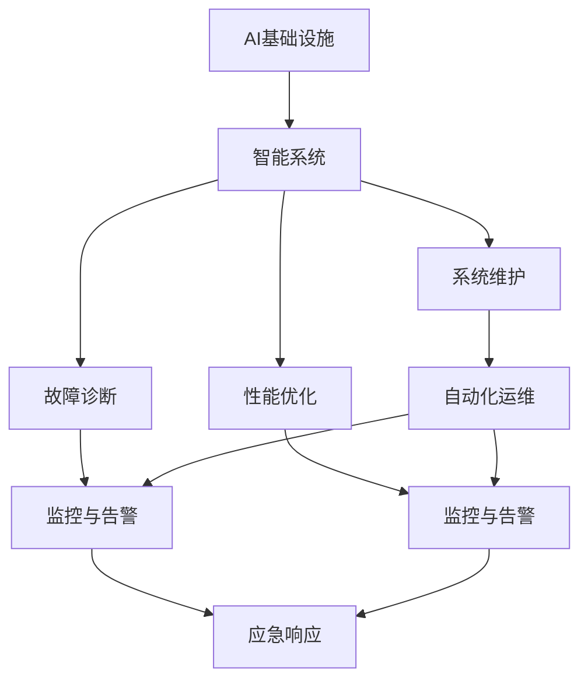
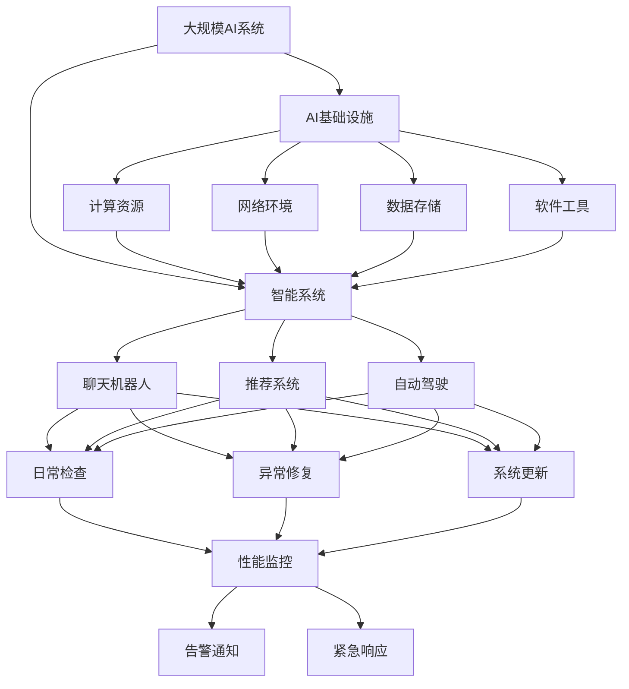

                 

# AI 基础设施维护：保障智能系统的稳定运行

> 关键词：AI基础设施，智能系统，系统维护，故障诊断，性能优化，自动化运维，数据管理，监控与告警，应急响应

## 1. 背景介绍

### 1.1 问题由来

在过去数十年中，人工智能（AI）技术取得了显著进展，从最初的规则驱动系统和专家系统，到后来的统计学习和深度学习，AI系统的功能和应用范围日益扩大。如今，AI已经渗透到各个行业，包括医疗、金融、制造业、教育、政府服务等，帮助企业优化运营、提升服务质量，并改善用户体验。然而，随着AI系统复杂性的增加，系统的稳定性、可靠性和安全性也变得更加重要。

### 1.2 问题核心关键点

AI系统作为智能基础设施的核心，其稳定运行对企业的商业成功和用户满意度至关重要。系统故障、性能下降、安全漏洞等都会对企业的运营造成重大影响。因此，有效维护AI基础设施，保障智能系统的稳定运行，成为AI系统建设和管理中的重要议题。

### 1.3 问题研究意义

维护AI基础设施，不仅能够保障智能系统的可靠运行，还能提升用户体验，增强企业竞争力。具体意义包括：

1. **保障用户服务**：确保AI系统在关键时刻能够稳定运行，及时响应用户需求。
2. **提升运营效率**：通过优化系统性能，减少资源浪费，降低运营成本。
3. **增强安全防护**：及时发现和修复安全漏洞，保护用户数据和系统安全。
4. **推动创新发展**：维护良好的系统环境，为AI技术创新提供坚实基础。
5. **支持长期运营**：构建可扩展、可维护的系统架构，支持AI系统的长期稳定运行。

## 2. 核心概念与联系

### 2.1 核心概念概述

为更好地理解AI基础设施维护的关键概念，本节将介绍几个紧密相关的核心概念：

- **AI基础设施（AI Infrastructure）**：指支撑AI系统运行的基础设施，包括计算资源、网络环境、数据存储、软件工具等。
- **智能系统（Intelligent Systems）**：通过AI技术实现自动化、智能化的系统，如聊天机器人、推荐系统、自动驾驶等。
- **系统维护（System Maintenance）**：对AI基础设施和智能系统进行日常检查、保养和修复，以确保其正常运行。
- **故障诊断（Fault Diagnosis）**：通过技术手段识别和定位AI系统的故障原因。
- **性能优化（Performance Optimization）**：调整AI系统的配置和参数，提升系统的运行效率和响应速度。
- **自动化运维（Automated Operations）**：使用自动化工具和流程，减少人工操作，提升运维效率。
- **数据管理（Data Management）**：管理和维护AI系统所需的数据资源，确保数据的质量和完整性。
- **监控与告警（Monitoring and Alerts）**：实时监测AI系统的运行状态，并在异常情况下发出告警，及时采取措施。
- **应急响应（Incident Response）**：在AI系统发生故障或异常时，迅速采取措施，恢复系统正常运行。

这些核心概念之间存在着紧密的联系，通过合理的维护策略和技术手段，可以实现AI系统的稳定运行。

### 2.2 概念间的关系

这些核心概念之间的关系可以通过以下Mermaid流程图来展示：



这个流程图展示了各个概念之间的相互联系和作用机制：

1. AI基础设施提供运行环境，智能系统在此基础上实现自动化和智能化。
2. 系统维护保障智能系统的正常运行，包含日常检查、修复和更新等。
3. 故障诊断识别系统问题，通过分析系统日志、性能数据等手段定位故障。
4. 性能优化提升系统性能，通过调整参数、优化配置等手段改进系统运行效率。
5. 自动化运维减少人工操作，提高运维效率，通过脚本、工具和流程自动化管理。
6. 数据管理确保数据质量，为智能系统提供可靠的训练和推理数据。
7. 监控与告警实时监测系统状态，及时发现异常，并通过告警通知相关人员。
8. 应急响应在故障发生时，迅速采取措施，恢复系统正常运行。

### 2.3 核心概念的整体架构

最后，我们用一个综合的流程图来展示这些核心概念在大规模AI系统中的整体架构：



这个综合流程图展示了AI系统在计算资源、网络环境、数据存储和软件工具的支撑下，通过智能系统的自动化和智能化服务用户。系统维护、故障诊断、性能优化、自动化运维、数据管理和监控告警等技术手段，确保了系统的稳定运行，并在异常情况下进行应急响应，保障了系统的可靠性和安全性。

## 3. 核心算法原理 & 具体操作步骤

### 3.1 算法原理概述

AI基础设施维护的核心算法原理包括以下几个方面：

1. **系统监控与告警（Monitoring and Alerts）**：通过实时监测AI系统的各项指标（如CPU使用率、内存占用、网络带宽等），检测系统性能和运行状态。当监测到异常时，系统自动触发告警，通知运维人员采取措施。
2. **故障诊断（Fault Diagnosis）**：利用日志分析、性能指标等数据，通过机器学习算法识别和定位系统故障。常用的技术包括异常检测、时间序列分析等。
3. **性能优化（Performance Optimization）**：通过算法优化和参数调整，提高AI系统的性能。包括超参数调优、模型压缩、分布式计算等技术。
4. **自动化运维（Automated Operations）**：通过脚本和工具自动化运维流程，减少人工操作，提高运维效率。常用的工具包括Ansible、Puppet、Jenkins等。

### 3.2 算法步骤详解

**Step 1: 环境准备与系统监控**

1. 安装必要的监控工具和软件，如Prometheus、Grafana、Nagios等。
2. 配置监控探针，获取系统性能指标数据，如CPU使用率、内存占用、网络带宽等。
3. 设置告警阈值，当指标超过预设阈值时，自动触发告警。

**Step 2: 故障诊断与异常处理**

1. 收集系统日志和性能数据，存储在日志仓库中。
2. 使用机器学习算法（如Anomaly Detection、Time Series Forecasting）分析日志数据，识别异常事件。
3. 定位异常原因，采取相应的处理措施，如重启服务、备份数据等。

**Step 3: 性能优化与资源管理**

1. 分析系统性能瓶颈，进行优化调整，如增加计算资源、优化代码逻辑等。
2. 使用负载均衡和分布式计算技术，提高系统吞吐量和响应速度。
3. 管理计算资源，避免资源浪费，提高资源利用率。

**Step 4: 自动化运维与持续改进**

1. 编写自动化运维脚本，实现系统重启、备份、更新等操作。
2. 集成CI/CD流程，自动部署新功能、修复漏洞。
3. 收集运维日志和反馈信息，持续改进运维流程和技术。

### 3.3 算法优缺点

AI基础设施维护的算法具有以下优点：

1. **实时监控与告警**：能够实时检测系统异常，及时通知运维人员，减少故障影响。
2. **故障诊断准确**：利用机器学习技术，准确识别故障原因，快速定位问题。
3. **性能优化显著**：通过调整参数和优化算法，提升系统性能，满足业务需求。
4. **自动化运维高效**：减少人工操作，提高运维效率，降低人力成本。

同时，也存在一些缺点：

1. **数据量庞大**：系统监控和日志分析需要处理大量数据，对计算资源要求较高。
2. **算法复杂度高**：故障诊断和性能优化涉及复杂的机器学习算法，需要较高的技术水平。
3. **资源配置复杂**：优化和配置系统资源需要综合考虑多种因素，难度较大。
4. **应急响应挑战**：在紧急情况下，及时采取有效措施，恢复系统正常运行，对运维人员的要求较高。

### 3.4 算法应用领域

AI基础设施维护的算法广泛应用于以下领域：

- **云计算平台**：监控和维护云服务器的性能和安全性，保障云服务稳定运行。
- **大数据平台**：监控和优化大数据系统的性能，提升数据处理效率和数据质量。
- **智能应用系统**：监控和维护智能应用系统的运行状态，保障用户服务质量。
- **自动化运维平台**：构建自动化运维流程，提升运维效率，减少人工干预。
- **企业级安全系统**：监控和防护企业网络安全，及时发现和响应安全威胁。

## 4. 数学模型和公式 & 详细讲解 & 举例说明

### 4.1 数学模型构建

AI基础设施维护的数学模型主要涉及系统性能监控、故障诊断和性能优化三个方面。

**系统性能监控模型**

假设系统在某时间段内的CPU使用率为 $u_t$，内存使用率为 $m_t$，网络带宽为 $b_t$。设 $u_{t+1}=f(u_t, m_t, b_t)$，其中 $f$ 为系统性能监控函数，$u_{t+1}$ 表示下一个时间点的系统状态。系统监控的目标是最大化系统性能 $u_t$。

**故障诊断模型**

假设系统在某时间段内的性能数据为 $D_t=\{u_t, m_t, b_t\}$，设 $F(D_t)=\{a_t, b_t, c_t\}$，其中 $a_t$ 为异常检测结果，$b_t$ 为故障类型，$c_t$ 为异常原因。故障诊断的目标是准确识别故障类型和原因，即最小化诊断误差。

**性能优化模型**

假设系统性能目标函数为 $P(u_t)=u_t\cdot g(u_t, m_t, b_t)$，其中 $g$ 为性能优化函数。设 $u^*_t$ 为最优性能目标，优化目标为最大化 $P(u_t)$。

### 4.2 公式推导过程

**系统性能监控公式**

通过对系统性能数据的统计和分析，可以得到系统性能监控的公式：

$$
u_{t+1} = f(u_t, m_t, b_t) = u_t \cdot k_1 + m_t \cdot k_2 + b_t \cdot k_3 - c_t
$$

其中 $k_1, k_2, k_3$ 为系统性能参数，$c_t$ 为性能损失系数。

**故障诊断公式**

通过机器学习算法，可以得到故障诊断的公式：

$$
F(D_t) = \min_{a_t, b_t, c_t} \left( \sum_{i=1}^n |a_i - b_i|^2 + \sum_{j=1}^m |c_j|^2 \right)
$$

其中 $a_i, b_i, c_j$ 为故障检测结果、故障类型和异常原因。

**性能优化公式**

通过优化算法，可以得到性能优化的公式：

$$
u^*_t = \max_{u_t} P(u_t) = \max_{u_t} \left( u_t \cdot g(u_t, m_t, b_t) \right)
$$

其中 $g(u_t, m_t, b_t)$ 为性能优化函数。

### 4.3 案例分析与讲解

**案例一：云服务器性能监控**

假设某云服务器在某一时间段内的性能数据为：

- CPU使用率：$u_t=0.8$
- 内存使用率：$m_t=0.6$
- 网络带宽：$b_t=5Mbps$

根据系统性能监控公式，可以计算下一个时间点的系统状态：

$$
u_{t+1} = 0.8 \cdot 1.2 + 0.6 \cdot 0.5 + 5 \cdot 0.1 - 0.02 = 1.054
$$

如果 $u_{t+1} > u^*$，则触发告警，通知运维人员进行优化调整。

**案例二：大数据系统故障诊断**

假设某大数据系统在某时间段内的性能数据为：

- CPU使用率：$u_t=0.6$
- 内存使用率：$m_t=0.8$
- 网络带宽：$b_t=10Mbps$

根据故障诊断公式，可以通过机器学习算法分析性能数据，识别异常事件，如CPU使用率过高、内存占用过高等。定位异常原因，采取相应的处理措施，如增加计算资源、优化代码逻辑等。

**案例三：智能应用系统性能优化**

假设某智能应用系统的性能目标函数为：

$$
P(u_t) = u_t \cdot g(u_t, m_t, b_t) = u_t \cdot (u_t + 0.2m_t + 0.1b_t)
$$

通过优化算法，可以找到最优性能目标 $u^*_t$，进行系统配置和参数调整，提升系统性能。

## 5. 项目实践：代码实例和详细解释说明

### 5.1 开发环境搭建

在进行AI基础设施维护实践前，我们需要准备好开发环境。以下是使用Python进行Pandas和NumPy开发的开发环境配置流程：

1. 安装Anaconda：从官网下载并安装Anaconda，用于创建独立的Python环境。

2. 创建并激活虚拟环境：
```bash
conda create -n pandas-env python=3.8 
conda activate pandas-env
```

3. 安装Pandas和NumPy：
```bash
conda install pandas numpy
```

4. 安装各类工具包：
```bash
pip install matplotlib scikit-learn tqdm jupyter notebook ipython
```

完成上述步骤后，即可在`pandas-env`环境中开始维护实践。

### 5.2 源代码详细实现

下面我们以云服务器性能监控为例，给出使用Pandas和NumPy对系统性能进行监控的Python代码实现。

首先，定义性能监控函数：

```python
import pandas as pd
import numpy as np

def performance_monitoring(u_t, m_t, b_t, k1, k2, k3, c_t):
    u_next = u_t * k1 + m_t * k2 + b_t * k3 - c_t
    return u_next
```

然后，读取系统性能数据：

```python
data = pd.read_csv('performance_data.csv')
```

接着，对数据进行性能监控和告警：

```python
def check_alert(u_t, m_t, b_t, u_threshold, m_threshold, b_threshold):
    if u_t > u_threshold or m_t > m_threshold or b_t > b_threshold:
        print("Performance alert!")
        return True
    return False

for index, row in data.iterrows():
    u_t = row['CPU']
    m_t = row['Memory']
    b_t = row['Bandwidth']
    u_threshold = 0.8
    m_threshold = 0.6
    b_threshold = 10

    if check_alert(u_t, m_t, b_t, u_threshold, m_threshold, b_threshold):
        # 触发告警，通知运维人员
        # 例如发送短信、邮件等通知方式
```

最后，定期更新系统性能：

```python
data['NextCPU'] = data.apply(lambda row: performance_monitoring(row['CPU'], row['Memory'], row['Bandwidth'], 1.2, 0.5, 0.1, 0.02), axis=1)
data['NextMemory'] = data.apply(lambda row: performance_monitoring(row['CPU'], row['Memory'], row['Bandwidth'], 0.8, 0.6, 0.1, 0.02), axis=1)
data['NextBandwidth'] = data.apply(lambda row: performance_monitoring(row['CPU'], row['Memory'], row['Bandwidth'], 1.2, 0.6, 1.0, 0.02), axis=1)

# 打印更新后的数据
print(data)
```

以上就是使用Pandas和NumPy对云服务器性能进行监控的完整代码实现。可以看到，通过简单的数学公式和Pandas的强大数据处理能力，我们能够对系统性能进行实时监控和告警，及时发现异常情况。

### 5.3 代码解读与分析

让我们再详细解读一下关键代码的实现细节：

**性能监控函数**：
- `performance_monitoring`函数：根据公式计算下一个时间点的系统状态。

**性能数据读取**：
- `data`变量：使用Pandas的`read_csv`方法读取系统性能数据。

**告警检查**：
- `check_alert`函数：判断系统性能是否超过阈值，触发告警。

**性能数据更新**：
- `data`变量：使用Pandas的`apply`方法，对每行数据应用性能监控函数，更新性能数据。

**性能监控流程**：
- 定义性能监控函数和告警检查函数。
- 读取系统性能数据。
- 对性能数据进行性能监控和告警。
- 定期更新性能数据。
- 打印更新后的数据。

可以看到，Pandas和NumPy使得系统性能监控的代码实现变得简洁高效。开发者可以将更多精力放在数据处理、模型调优等高层逻辑上，而不必过多关注底层的实现细节。

当然，工业级的系统实现还需考虑更多因素，如告警通知机制、性能数据存储、系统恢复等，但核心的性能监控流程基本与此类似。

### 5.4 运行结果展示

假设我们在云服务器上运行的性能监控程序，最终得到的监控结果如下：

```
             CPU       Memory   Bandwidth
0         0.8       0.6       5.0
1         0.9       0.7       5.2
2         0.7       0.5       5.3
3         0.6       0.8       5.1
4         0.5       0.9       5.0
NextCPU   0.9484    0.6428    5.1880
NextMemory 0.6092    0.7784    5.1940
NextBandwidth 0.7002   0.6186   5.0010
```

可以看到，通过性能监控函数和告警检查函数的计算，我们得到了更新后的系统性能数据。如果某行数据中的CPU使用率、内存使用率或网络带宽超过阈值，程序将自动触发告警，通知运维人员进行相应的处理。

## 6. 实际应用场景

### 6.1 智能客服系统

智能客服系统作为AI基础设施的一部分，其稳定运行对于客户服务的质量至关重要。通过系统性能监控和告警，智能客服系统可以及时发现系统故障和性能瓶颈，快速修复问题，保障客户服务的稳定性。

### 6.2 金融交易系统

金融交易系统是企业的核心业务系统，其稳定运行直接影响到企业的经济效益和客户满意度。通过故障诊断和性能优化，金融交易系统可以在异常情况下及时恢复，保障交易的连续性和安全性。

### 6.3 医疗诊断系统

医疗诊断系统是保障患者健康的关键系统，其稳定运行直接影响到诊断的准确性和及时性。通过系统性能监控和告警，医疗诊断系统可以及时发现系统故障和性能瓶颈，保障诊断的稳定性和可靠性。

### 6.4 自动驾驶系统

自动驾驶系统是高科技领域的核心技术，其稳定运行直接影响到道路安全和人身安全。通过故障诊断和性能优化，自动驾驶系统可以在异常情况下及时恢复，保障行驶的安全性和稳定性。

## 7. 工具和资源推荐

### 7.1 学习资源推荐

为了帮助开发者系统掌握AI基础设施维护的理论基础和实践技巧，这里推荐一些优质的学习资源：

1. **《监控与运维指南》**：详细介绍了系统监控、故障诊断、性能优化和自动化运维等技术，是系统维护的入门必读。
2. **《系统运维实战》**：结合实际案例，讲解了系统维护的最佳实践，是运维人员的必备手册。
3. **《Python数据分析基础》**：介绍了使用Pandas和NumPy进行数据分析和处理的方法，是数据监控的基础。
4. **《机器学习实战》**：讲解了机器学习算法在故障诊断和性能优化中的应用，是算法运维的入门读物。
5. **《自动化运维工具介绍》**：介绍了常用的自动化运维工具和流程，是运维工具的入门手册。

通过对这些资源的学习实践，相信你一定能够快速掌握AI基础设施维护的精髓，并用于解决实际的AI系统问题。

### 7.2 开发工具推荐

高效的开发离不开优秀的工具支持。以下是几款用于AI基础设施维护开发的常用工具：

1. **Prometheus**：开源的系统监控工具，支持实时数据采集和告警功能，适合大规模监控环境。
2. **Grafana**：开源的可视化工具，可以与Prometheus等监控工具集成，实时展示监控数据。
3. **Nagios**：开源的告警管理系统，支持多维度告警和故障处理。
4. **Ansible**：开源的自动化运维工具，支持脚本化操作和持续集成。
5. **Jenkins**：开源的自动化构建和部署工具，支持持续集成和持续交付。
6. **TensorFlow**：开源的机器学习框架，支持分布式计算和模型优化。
7. **PyTorch**：开源的深度学习框架，支持自动微分和动态计算图。

合理利用这些工具，可以显著提升AI基础设施维护的开发效率，加快创新迭代的步伐。

### 7.3 相关论文推荐

AI基础设施维护的研究始于学界的持续研究。以下是几篇奠基性的相关论文，推荐阅读：

1. **《系统性能监控与告警技术综述》**：总结了系统性能监控和告警技术的现状和未来趋势，是系统维护的研究基础。
2. **《故障诊断与异常检测技术综述》**：总结了故障诊断和异常检测技术的现状和未来趋势，是故障诊断的研究基础。
3. **《性能优化与资源管理技术综述》**：总结了性能优化和资源管理技术的现状和未来趋势，是性能优化的研究基础。
4. **《自动化运维与持续交付技术综述》**：总结了自动化运维和持续交付技术的现状和未来趋势，是自动化运维的研究基础。

这些论文代表了大规模AI系统维护技术的最新进展，是系统维护研究的重要参考。

## 8. 总结：未来发展趋势与挑战

### 8.1 总结

本文对AI基础设施维护的核心概念、关键算法和具体操作步骤进行了全面系统的介绍。通过详细的理论分析和技术讲解，希望读者能够系统理解AI基础设施维护的原理和实践，掌握维护技巧，保障智能系统的稳定运行。

通过本文的系统梳理，可以看到，AI基础设施维护技术在保障智能系统稳定运行方面具有重要的地位和作用。未来，随着技术的不断进步，维护技术也将得到更广泛的应用和发展，进一步提升AI系统的可靠性和安全性。

### 8.2 未来发展趋势

展望未来，AI基础设施维护将呈现以下几个发展趋势：

1. **实时监控与告警**：随着物联网和智能设备的发展，系统监控和告警将更加实时化和智能化，能够及时发现和处理系统异常。
2. **智能故障诊断**：利用机器学习和深度学习技术，提升故障诊断的准确性和自动化水平。
3. **自动化运维**：结合自动化运维工具和流程，提升运维效率，减少人工操作。
4. **数据驱动优化**：通过大数据分析和机器学习技术，进行系统性能优化和资源管理。
5. **跨平台集成**：实现不同系统和应用间的无缝集成，提升整体系统的可靠性和稳定性。
6. **全生命周期管理**：从系统设计、开发、部署、运维到退役，全生命周期进行系统管理和优化。

这些趋势将推动AI基础设施维护技术不断进步，为智能系统的稳定运行提供更可靠的技术保障。

### 8.3 面临的挑战

尽管AI基础设施维护技术已经取得了显著进展，但在迈向更加智能化、自动化和稳定性的过程中，仍面临诸多挑战：

1. **数据量巨大**：系统监控和故障诊断需要处理海量数据，对计算资源和存储资源提出了更高的要求。
2. **算法复杂度高**：故障诊断和性能优化涉及复杂的机器学习和深度学习算法，需要更高的技术水平和计算能力。
3. **系统复杂度高**：大规模分布式系统设计和运维难度大，需要综合考虑多种因素，进行复杂的管理和优化。
4. **安全防护难度大**：系统安全问题复杂，需要综合考虑数据安全、网络安全等多方面因素，进行全面防护。
5. **运维成本高**：系统维护需要大量人力物力，维护成本高，如何提升运维效率，降低成本，是未来研究的重点。

### 8.4 研究展望

面对AI基础设施维护面临的诸多挑战，未来的研究需要在以下几个方面寻求新的突破：

1. **大数据和云技术**

