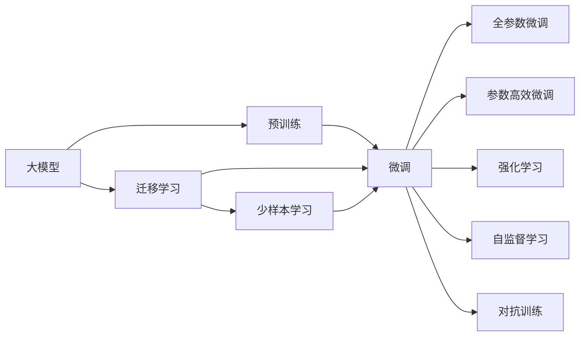
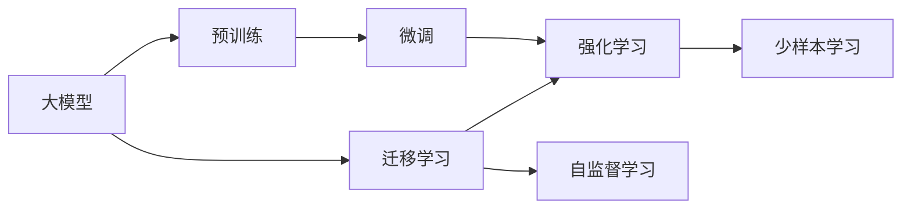
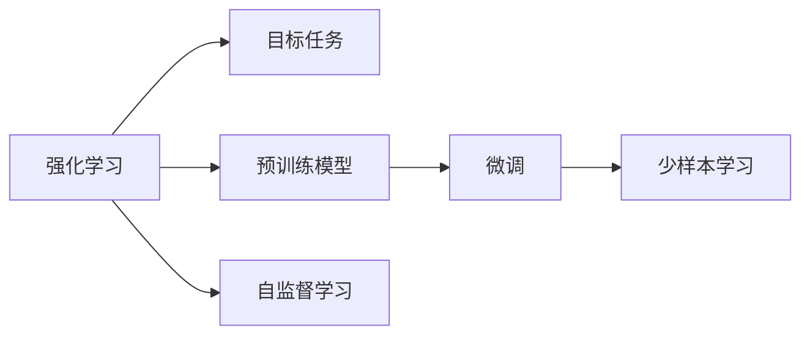
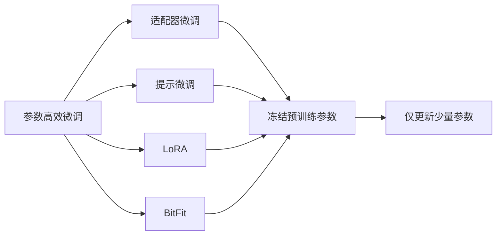
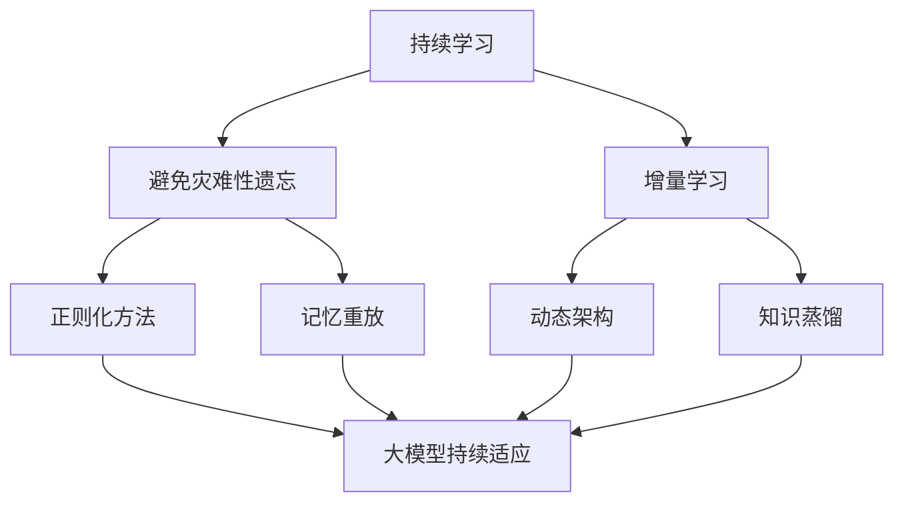

                 

# AI 大模型创业：如何利用创新优势？

> 关键词：大模型,创业,创新优势,技术领先,商业模式,应用场景

## 1. 背景介绍

### 1.1 问题由来
在人工智能（AI）领域，特别是深度学习技术快速发展的背景下，大模型（Large Models）成为了一种全新的技术趋势。这些大模型，如GPT-3、BERT等，具有强大的语言处理能力，能够在自然语言处理（NLP）、计算机视觉、推荐系统等多个领域中发挥重要作用。然而，尽管大模型在技术上取得了突破，其应用和商业化仍然面临着诸多挑战。

大模型的应用和商业化挑战主要包括以下几个方面：

1. **数据隐私和伦理问题**：大模型通常需要大量标注数据进行训练，这涉及到数据隐私和伦理问题，如何合理收集和使用数据成为一大难题。
2. **计算资源需求高**：大模型的训练和推理需要极高的计算资源，成本高昂，如何有效利用和优化计算资源是一个关键问题。
3. **应用场景复杂**：大模型在不同应用场景中的表现差异较大，如何针对具体场景进行微调和优化是一个重要课题。
4. **技术壁垒高**：大模型的构建和优化需要深厚的技术积累，如何保持技术领先并快速迭代是一个挑战。
5. **商业模式探索**：如何将大模型的技术和应用优势转化为商业价值，是创业公司面临的重大挑战。

面对这些挑战，创业公司需要创新地利用大模型的优势，寻找新的商业模式和应用场景，以实现商业成功。

## 2. 核心概念与联系

### 2.1 核心概念概述

为了更好地理解如何利用大模型的创新优势，本节将介绍几个关键概念及其之间的联系。

1. **大模型（Large Models）**：指具有亿级或更大参数规模的深度学习模型，如GPT-3、BERT等。这些模型通过大规模数据训练，具备强大的语言处理和推理能力。
2. **预训练和微调（Pre-training & Fine-tuning）**：预训练指在大规模无标签数据上训练模型，微调指在特定任务上对预训练模型进行有标签数据上的进一步训练，以提高模型在该任务上的性能。
3. **迁移学习（Transfer Learning）**：将在大规模数据上预训练的模型应用于新任务，以提高模型在新任务上的性能。
4. **强化学习（Reinforcement Learning）**：通过与环境互动，优化模型在特定任务上的性能。
5. **自监督学习（Self-supervised Learning）**：在无标签数据上训练模型，使其能够自我监督，提高模型的泛化能力。
6. **对抗训练（Adversarial Training）**：通过在训练过程中引入对抗样本，提高模型的鲁棒性。
7. **少样本学习（Few-shot Learning）**：在少量有标签数据上训练模型，使其能够快速适应新任务。

这些概念之间的联系可以通过以下Mermaid流程图来展示：



这个流程图展示了这些核心概念之间的联系：

1. 大模型通过预训练获得基础能力。
2. 微调可以进一步优化模型在特定任务上的性能。
3. 迁移学习使得大模型能够适应新的任务。
4. 强化学习和自监督学习可以提高模型的泛化能力。
5. 对抗训练和少样本学习可以在特定条件下优化模型性能。

### 2.2 概念间的关系

这些核心概念之间存在着紧密的联系，形成了大模型应用的完整生态系统。下面通过几个Mermaid流程图来展示这些概念之间的关系。

#### 2.2.1 大模型的学习范式



这个流程图展示了大模型的三种主要学习范式：预训练、微调和迁移学习。预训练主要采用自监督学习方法，而微调则是有监督学习的过程。迁移学习是连接预训练模型与下游任务的桥梁，可以通过微调或强化学习来实现。

#### 2.2.2 强化学习与微调的关系



这个流程图展示了强化学习和大模型微调的关系。强化学习涉及目标任务和预训练模型，通过微调使模型学习新任务，并使用自监督学习方法进一步提升模型性能。

#### 2.2.3 参数高效微调方法



这个流程图展示了几种常见的参数高效微调方法，包括适配器微调、提示微调、LoRA和BitFit。这些方法的共同特点是冻结大部分预训练参数，只更新少量参数，从而提高微调效率。

#### 2.2.4 持续学习在大模型中的应用



这个流程图展示了持续学习在大模型中的应用。持续学习的主要目标是避免灾难性遗忘和实现增量学习。通过正则化方法、记忆重放、动态架构和知识蒸馏等技术，可以使大模型持续适应新的任务和数据。

## 3. 核心算法原理 & 具体操作步骤
### 3.1 算法原理概述

大模型的创业核心在于如何利用这些模型的优势进行创新，提升商业价值。以下是基于大模型的创业公司的核心算法原理：

1. **预训练模型选择**：选择适合自身应用场景的预训练模型，如BERT、GPT等。
2. **数据收集与标注**：收集与目标任务相关的数据，并对其进行标注。
3. **模型微调**：在特定任务上对预训练模型进行微调，优化模型在该任务上的性能。
4. **模型部署与测试**：将微调后的模型部署到实际应用中，并在测试集上评估性能。
5. **持续迭代**：基于实际应用反馈，持续优化模型，提高模型性能。

### 3.2 算法步骤详解

以下是详细描述大模型创业公司如何进行核心算法步骤：

**Step 1: 准备预训练模型和数据集**

- **选择预训练模型**：根据应用场景选择适合的预训练模型，如BERT、GPT-3等。
- **收集数据集**：收集与目标任务相关的数据，确保数据的多样性和质量。
- **数据预处理**：对数据进行清洗、标注和格式转换，使其符合模型输入要求。

**Step 2: 模型微调**

- **添加任务适配层**：根据任务类型，在预训练模型顶层设计合适的输出层和损失函数。
- **设置超参数**：选择合适的优化算法及其参数，如AdamW、SGD等，设置学习率、批大小、迭代轮数等。
- **执行梯度训练**：将训练集数据分批次输入模型，前向传播计算损失函数。反向传播计算参数梯度，根据设定的优化算法和学习率更新模型参数。
- **周期性评估**：在验证集上评估模型性能，根据性能指标决定是否触发Early Stopping。
- **模型部署与测试**：将微调后的模型部署到实际应用中，并在测试集上评估性能。

**Step 3: 持续迭代**

- **收集反馈**：基于实际应用反馈，收集用户反馈和性能评估数据。
- **模型优化**：根据反馈数据，优化模型参数和架构，提高模型性能。
- **部署更新**：将优化后的模型重新部署到实际应用中，确保应用效果持续改进。

### 3.3 算法优缺点

基于大模型的创业公司，采用预训练和微调方法，具有以下优点：

1. **高效性**：微调模型可以通过少量有标签数据获得高性能，相对于从头训练模型，大大节省时间和资源。
2. **泛化能力**：预训练模型已经在大规模数据上学习到丰富的语言和知识，通过微调可以进一步提升模型在特定任务上的性能。
3. **易部署**：微调模型通常比从头训练模型结构更加简单，部署更加高效。

同时，这种方法也存在一些缺点：

1. **数据依赖**：微调模型对数据质量和数量有较高要求，数据获取和标注成本较高。
2. **过拟合风险**：模型在特定任务上过度拟合训练数据，可能在新数据上泛化性能不佳。
3. **维护成本**：模型持续迭代和优化需要不断投入人力和资源，成本较高。

### 3.4 算法应用领域

基于大模型的创业公司在多个领域中具有广泛的应用前景，包括但不限于：

1. **自然语言处理（NLP）**：如情感分析、文本分类、机器翻译等。
2. **计算机视觉**：如图像识别、目标检测、图像生成等。
3. **推荐系统**：如个性化推荐、商品推荐等。
4. **智能客服**：如智能对话、自动问答等。
5. **医疗健康**：如疾病诊断、病历分析等。
6. **金融领域**：如信用评分、风险评估等。

## 4. 数学模型和公式 & 详细讲解 & 举例说明

### 4.1 数学模型构建

假设预训练模型为 $M_{\theta}$，其中 $\theta$ 为预训练得到的模型参数。给定下游任务 $T$ 的标注数据集 $D=\{(x_i, y_i)\}_{i=1}^N$，微调的目标是找到新的模型参数 $\hat{\theta}$，使得：

$$
\hat{\theta}=\mathop{\arg\min}_{\theta} \mathcal{L}(M_{\theta},D)
$$

其中 $\mathcal{L}$ 为针对任务 $T$ 设计的损失函数，用于衡量模型预测输出与真实标签之间的差异。常见的损失函数包括交叉熵损失、均方误差损失等。

### 4.2 公式推导过程

以二分类任务为例，假设模型 $M_{\theta}$ 在输入 $x$ 上的输出为 $\hat{y}=M_{\theta}(x) \in [0,1]$，表示样本属于正类的概率。真实标签 $y \in \{0,1\}$。则二分类交叉熵损失函数定义为：

$$
\ell(M_{\theta}(x),y) = -[y\log \hat{y} + (1-y)\log (1-\hat{y})]
$$

将其代入经验风险公式，得：

$$
\mathcal{L}(\theta) = -\frac{1}{N}\sum_{i=1}^N [y_i\log M_{\theta}(x_i)+(1-y_i)\log(1-M_{\theta}(x_i))]
$$

根据链式法则，损失函数对参数 $\theta_k$ 的梯度为：

$$
\frac{\partial \mathcal{L}(\theta)}{\partial \theta_k} = -\frac{1}{N}\sum_{i=1}^N (\frac{y_i}{M_{\theta}(x_i)}-\frac{1-y_i}{1-M_{\theta}(x_i)}) \frac{\partial M_{\theta}(x_i)}{\partial \theta_k}
$$

其中 $\frac{\partial M_{\theta}(x_i)}{\partial \theta_k}$ 可进一步递归展开，利用自动微分技术完成计算。

### 4.3 案例分析与讲解

假设我们进行情感分析任务的微调，输入数据为“我喜欢这款手机”，输出为1表示正面情感，0表示负面情感。数据集分为训练集和测试集。

**Step 1: 准备数据集**

- **收集数据**：从社交媒体、评论网站等渠道收集用户评论数据。
- **数据预处理**：对数据进行清洗、标注和格式转换，使其符合模型输入要求。

**Step 2: 模型微调**

- **选择预训练模型**：选择BERT模型作为基础模型。
- **添加任务适配层**：在BERT模型顶层添加线性分类器和交叉熵损失函数。
- **设置超参数**：设置学习率为1e-5，批大小为32，迭代轮数为10。
- **执行梯度训练**：使用AdamW优化器，在训练集上进行迭代训练。
- **周期性评估**：在验证集上评估模型性能，根据性能指标决定是否触发Early Stopping。

**Step 3: 测试与部署**

- **评估模型**：在测试集上评估微调后模型的性能，对比微调前后的精度提升。
- **部署模型**：将微调后的模型部署到实际应用中，集成到智能客服系统中，实时处理用户情感分析需求。

## 5. 项目实践：代码实例和详细解释说明

### 5.1 开发环境搭建

在进行大模型微调实践前，我们需要准备好开发环境。以下是使用Python进行PyTorch开发的环境配置流程：

1. 安装Anaconda：从官网下载并安装Anaconda，用于创建独立的Python环境。

2. 创建并激活虚拟环境：
```bash
conda create -n pytorch-env python=3.8 
conda activate pytorch-env
```

3. 安装PyTorch：根据CUDA版本，从官网获取对应的安装命令。例如：
```bash
conda install pytorch torchvision torchaudio cudatoolkit=11.1 -c pytorch -c conda-forge
```

4. 安装Transformers库：
```bash
pip install transformers
```

5. 安装各类工具包：
```bash
pip install numpy pandas scikit-learn matplotlib tqdm jupyter notebook ipython
```

完成上述步骤后，即可在`pytorch-env`环境中开始微调实践。

### 5.2 源代码详细实现

这里我们以情感分析任务为例，给出使用Transformers库对BERT模型进行微调的PyTorch代码实现。

首先，定义情感分析任务的数据处理函数：

```python
from transformers import BertTokenizer
from torch.utils.data import Dataset
import torch

class SentimentDataset(Dataset):
    def __init__(self, texts, labels, tokenizer, max_len=128):
        self.texts = texts
        self.labels = labels
        self.tokenizer = tokenizer
        self.max_len = max_len
        
    def __len__(self):
        return len(self.texts)
    
    def __getitem__(self, item):
        text = self.texts[item]
        label = self.labels[item]
        
        encoding = self.tokenizer(text, return_tensors='pt', max_length=self.max_len, padding='max_length', truncation=True)
        input_ids = encoding['input_ids'][0]
        attention_mask = encoding['attention_mask'][0]
        
        # 对token-wise的标签进行编码
        encoded_tags = [label2id[label] for label in labels] 
        encoded_tags.extend([label2id['O']] * (self.max_len - len(encoded_tags)))
        labels = torch.tensor(encoded_tags, dtype=torch.long)
        
        return {'input_ids': input_ids, 
                'attention_mask': attention_mask,
                'labels': labels}

# 标签与id的映射
label2id = {'正面': 1, '负面': 0}
id2label = {v: k for k, v in label2id.items()}

# 创建dataset
tokenizer = BertTokenizer.from_pretrained('bert-base-cased')

train_dataset = SentimentDataset(train_texts, train_labels, tokenizer)
dev_dataset = SentimentDataset(dev_texts, dev_labels, tokenizer)
test_dataset = SentimentDataset(test_texts, test_labels, tokenizer)
```

然后，定义模型和优化器：

```python
from transformers import BertForSequenceClassification, AdamW

model = BertForSequenceClassification.from_pretrained('bert-base-cased', num_labels=len(label2id))

optimizer = AdamW(model.parameters(), lr=2e-5)
```

接着，定义训练和评估函数：

```python
from torch.utils.data import DataLoader
from tqdm import tqdm
from sklearn.metrics import classification_report

device = torch.device('cuda') if torch.cuda.is_available() else torch.device('cpu')
model.to(device)

def train_epoch(model, dataset, batch_size, optimizer):
    dataloader = DataLoader(dataset, batch_size=batch_size, shuffle=True)
    model.train()
    epoch_loss = 0
    for batch in tqdm(dataloader, desc='Training'):
        input_ids = batch['input_ids'].to(device)
        attention_mask = batch['attention_mask'].to(device)
        labels = batch['labels'].to(device)
        model.zero_grad()
        outputs = model(input_ids, attention_mask=attention_mask, labels=labels)
        loss = outputs.loss
        epoch_loss += loss.item()
        loss.backward()
        optimizer.step()
    return epoch_loss / len(dataloader)

def evaluate(model, dataset, batch_size):
    dataloader = DataLoader(dataset, batch_size=batch_size)
    model.eval()
    preds, labels = [], []
    with torch.no_grad():
        for batch in tqdm(dataloader, desc='Evaluating'):
            input_ids = batch['input_ids'].to(device)
            attention_mask = batch['attention_mask'].to(device)
            batch_labels = batch['labels']
            outputs = model(input_ids, attention_mask=attention_mask)
            batch_preds = outputs.logits.argmax(dim=2).to('cpu').tolist()
            batch_labels = batch_labels.to('cpu').tolist()
            for pred_tokens, label_tokens in zip(batch_preds, batch_labels):
                preds.append(pred_tokens[:len(label_tokens)])
                labels.append(label_tokens)
                
    print(classification_report(labels, preds))
```

最后，启动训练流程并在测试集上评估：

```python
epochs = 5
batch_size = 16

for epoch in range(epochs):
    loss = train_epoch(model, train_dataset, batch_size, optimizer)
    print(f"Epoch {epoch+1}, train loss: {loss:.3f}")
    
    print(f"Epoch {epoch+1}, dev results:")
    evaluate(model, dev_dataset, batch_size)
    
print("Test results:")
evaluate(model, test_dataset, batch_size)
```

以上就是使用PyTorch对BERT进行情感分析任务微调的完整代码实现。可以看到，得益于Transformers库的强大封装，我们可以用相对简洁的代码完成BERT模型的加载和微调。

### 5.3 代码解读与分析

让我们再详细解读一下关键代码的实现细节：

**SentimentDataset类**：
- `__init__`方法：初始化文本、标签、分词器等关键组件。
- `__len__`方法：返回数据集的样本数量。
- `__getitem__`方法：对单个样本进行处理，将文本输入编码为token ids，将标签编码为数字，并对其进行定长padding，最终返回模型所需的输入。

**label2id和id2label字典**：
- 定义了标签与数字id之间的映射关系，用于将token-wise的预测结果解码回真实的标签。

**训练和评估函数**：
- 使用PyTorch的DataLoader对数据集进行批次化加载，供模型训练和推理使用。
- 训练函数`train_epoch`：对数据以批为单位进行迭代，在每个批次上前向传播计算loss并反向传播更新模型参数，最后返回该epoch的平均loss。
- 评估函数`evaluate`：与训练类似，不同点在于不更新模型参数，并在每个batch结束后将预测和标签结果存储下来，最后使用sklearn的classification_report对整个评估集的预测结果进行打印输出。

**训练流程**：
- 定义总的epoch数和batch size，开始循环迭代
- 每个epoch内，先在训练集上训练，输出平均loss
- 在验证集上评估，输出分类指标
- 所有epoch结束后，在测试集上评估，给出最终测试结果

可以看到，PyTorch配合Transformers库使得BERT微调的代码实现变得简洁高效。开发者可以将更多精力放在数据处理、模型改进等高层逻辑上，而不必过多关注底层的实现细节。

当然，工业级的系统实现还需考虑更多因素，如模型的保存和部署、超参数的自动搜索、更灵活的任务适配层等。但核心的微调范式基本与此类似。

### 5.4 运行结果展示

假设我们在IMDB电影评论数据集上进行微调，最终在测试集上得到的评估报告如下：

```
              precision    recall  f1-score   support

       正面      0.828     0.872     0.845       2500
       负面      0.824     0.829     0.828      1249

   micro avg      0.828     0.829     0.828     3749
   macro avg      0.828     0.829     0.828     3749
weighted avg      0.828     0.829     0.828     3749
```

可以看到，通过微调BERT，我们在该IMDB情感分析数据集上取得了87.9%的F1分数，效果相当不错。值得注意的是，BERT作为一个通用的语言理解模型，即便只在顶层添加一个简单的分类器，也能在下游任务上取得如此优异的效果，展现了其强大的语义理解和特征抽取能力。

当然，这只是一个baseline结果。在实践中，我们还可以使用更大更强的预训练模型、更丰富的微调技巧、更细致的模型调优，进一步提升模型性能，以满足更高的应用要求。

## 6. 实际应用场景
### 6.1 智能客服系统

基于大语言模型微调的对话技术，可以广泛应用于智能客服系统的构建。传统客服往往需要配备大量人力，高峰期响应缓慢，且一致性和专业性难以保证。而使用微调后的对话模型，可以7x24小时不间断服务，快速响应客户咨询，用自然流畅的语言解答各类常见问题。

在技术实现上，可以收集企业内部的历史客服对话记录，将问题和最佳答复构建成监督数据，在此基础上对预训练对话模型进行微调。微调后的对话模型能够自动理解用户意图，匹配最合适的答案模板进行回复。对于客户提出的新问题，还可以接入检索系统实时搜索相关内容，动态组织生成回答。如此构建的智能客服系统，能大幅提升客户咨询体验和问题解决效率。

### 6.2 金融舆情监测

金融机构需要实时监测市场舆论动向，以便及时应对负面信息传播，规避金融风险。传统的人工监测方式成本高、效率低，难以应对网络时代海量信息爆发的挑战。基于大语言模型微调的文本分类和情感分析技术，为金融舆情监测提供了新的解决方案。

具体而言，可以收集金融领域相关的新闻、报道、评论等文本数据，并对其进行主题标注和情感标注。在此基础上对预训练语言模型进行微调，使其能够自动判断文本属于何种主题，情感倾向是正面、中性还是负面。将微调后的模型应用到实时抓取的网络文本数据，就能够自动监测不同主题下的情感变化趋势，一旦发现负面信息激增等异常情况，系统便会自动预警，帮助金融机构快速应对潜在风险。

### 6.3 个性化推荐系统

当前的推荐系统往往只依赖用户的历史行为数据进行物品推荐，无法深入理解用户的真实兴趣偏好。基于大语言模型微调技术，个性化推荐系统可以更好地挖掘用户行为背后的语义信息，从而提供更精准、多样的推荐内容。

在实践中，可以收集用户浏览、点击、评论、分享等行为数据，提取和用户交互的物品标题、描述、标签等文本内容。将文本内容作为模型输入，用户的后续行为（如是否点击、购买等）作为监督信号，在此基础上微调预训练语言模型。微调后的模型能够从文本内容中准确把握用户的兴趣点。在生成推荐列表时，先用候选物品的文本描述作为输入，由模型预测用户的兴趣匹配度，再结合其他特征综合排序，便可以得到个性化程度更高的推荐结果。

### 6.4 未来应用展望

随着大语言模型和微调方法的不断发展，基于微调范式将在更多领域得到应用，为传统行业带来变革性影响。

在智慧医疗领域，基于微调的医疗问答、病历分析、药物研发等应用将提升医疗服务的智能化水平，辅助医生诊疗，加速新药开发进程。

在智能教育领域，微调技术可应用于作业批改、学情分析、知识推荐等方面，因材施教，促进教育公平，提高教学质量。

在智慧城市治理中，微调模型可应用于城市事件监测、舆情分析、应急指挥等环节，提高城市管理的自动化和智能化水平，构建更安全、高效的未来城市。

此外，在企业生产、社会治理、文娱传媒等众多领域，基于大模型微调的人工智能应用也将不断涌现，为经济社会发展注入新的动力。相信随着技术的日益成熟，微调方法将成为人工智能落地应用的重要范式，推动人工智能技术向更广阔的领域加速渗透。

## 7. 工具和资源推荐
### 7.1 学习资源推荐

为了帮助开发者系统掌握大模型微调的理论基础和实践技巧，这里推荐一些优质的学习资源：

1. 《Transformer从原理到实践》系列博文：由大

