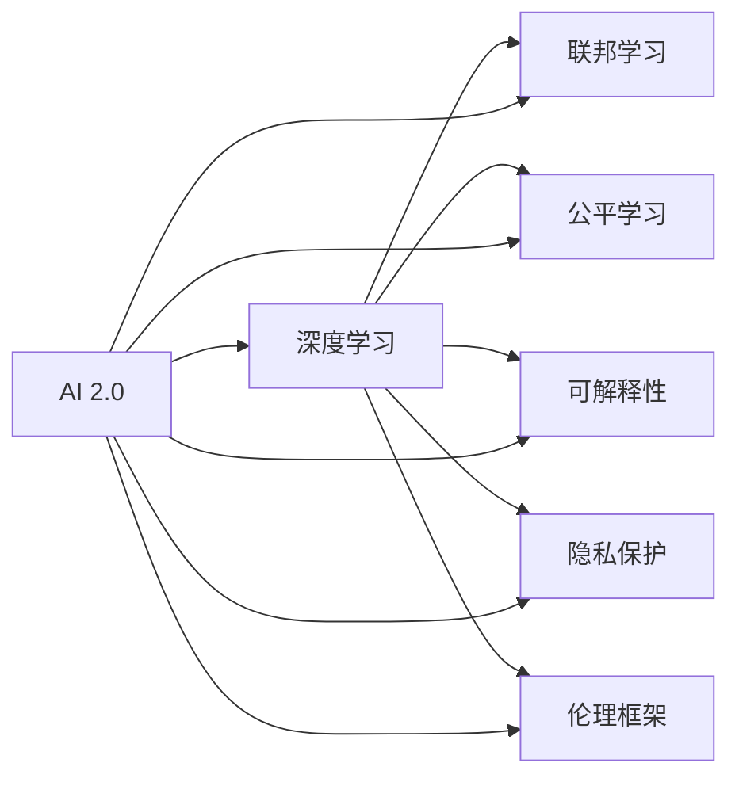

                 

## 1. 背景介绍

### 1.1 问题由来
随着人工智能技术的飞速发展，我们正在进入一个全新的AI 2.0时代。在这个时代，人工智能的普及程度大幅提升，AI 技术在各行各业得到广泛应用。然而，随着AI 技术的深入发展，也带来了一系列新的挑战和机遇。

### 1.2 问题核心关键点
当前，AI 2.0时代面临着以下核心挑战：

1. **数据隐私与安全**：AI 技术的广泛应用导致大量数据被收集和分析，数据隐私与安全问题日益突出。
2. **算法偏见与公平性**：AI 模型往往基于大量数据进行训练，若数据存在偏见，模型也会产生相应的偏见，导致不公平的决策。
3. **模型透明性与可解释性**：深度学习模型的复杂性导致其决策过程难以解释，缺乏透明性。
4. **计算资源与成本**：大规模模型的训练和推理需要大量的计算资源，成本较高。
5. **技术伦理与社会责任**：AI 技术的应用涉及到伦理问题，需要建立健全的法律和监管机制。

### 1.3 问题研究意义
研究AI 2.0时代的计算变化，对于推动人工智能技术的健康发展，确保其安全、可靠、公平地应用于各个领域，具有重要意义：

1. **提升数据隐私保护水平**：探索如何在AI 应用中保护数据隐私，保障用户权益。
2. **消除算法偏见，实现公平决策**：研究如何消除模型中的偏见，实现更公平的决策。
3. **提高模型的透明性与可解释性**：探索提高模型透明性的方法，便于理解和调试。
4. **优化计算资源与成本**：研究高效计算方法，降低AI 应用成本，提高应用效率。
5. **构建AI 技术的伦理框架**：研究AI 技术的伦理问题，建立健全的法律和监管机制，保障技术安全应用。

## 2. 核心概念与联系

### 2.1 核心概念概述

为了更好地理解AI 2.0时代的计算变化，本节将介绍几个关键概念：

- **AI 2.0**：人工智能发展的第二阶段，以深度学习为核心，利用大规模数据和计算资源进行模型训练和优化，实现更为复杂的任务。
- **深度学习**：一种通过多层神经网络进行复杂模式识别的机器学习方法。
- **联邦学习**：一种分布式机器学习方法，多个客户端在本地数据上训练模型，然后汇总到中央服务器进行模型更新，保护数据隐私。
- **公平学习**：研究如何消除模型中的偏见，实现公平的决策。
- **可解释性**：模型决策过程的透明性，便于理解和调试。
- **隐私保护**：保护数据隐私的技术和策略。
- **伦理框架**：指导AI 技术应用的伦理准则和法律规范。

### 2.2 概念间的关系

这些核心概念之间的逻辑关系可以通过以下Mermaid流程图来展示：



这个流程图展示了大语言模型的核心概念及其之间的关系：

1. AI 2.0 包括深度学习、联邦学习、公平学习、可解释性、隐私保护和伦理框架等关键技术。
2. 深度学习是AI 2.0的核心技术之一，通过多层神经网络实现复杂的模式识别和任务。
3. 联邦学习可以在保护数据隐私的前提下，实现分布式模型的训练和优化。
4. 公平学习研究如何消除模型中的偏见，实现更公平的决策。
5. 可解释性提升模型的透明性，便于理解和调试。
6. 隐私保护保护数据隐私，确保数据安全。
7. 伦理框架指导AI 技术应用的伦理准则和法律规范。

这些概念共同构成了AI 2.0时代的计算生态系统，推动AI 技术在各个领域的应用和普及。通过理解这些概念，我们可以更好地把握AI 2.0时代的发展趋势和应用方向。

## 3. 核心算法原理 & 具体操作步骤
### 3.1 算法原理概述

在AI 2.0时代，计算变化主要体现在以下几个方面：

- **分布式计算**：大规模模型的训练和优化需要分布式计算资源，如GPU、TPU等高性能设备。
- **模型压缩与加速**：大规模模型的压缩与加速方法，如量化、剪枝、模型蒸馏等，以提高模型的推理速度和效率。
- **联邦学习**：多客户端在本地数据上训练模型，然后汇总到中央服务器进行模型更新，保护数据隐私。
- **公平学习**：通过数据增强、权重调整等方法，消除模型中的偏见，实现公平决策。
- **可解释性提升**：利用模型可视化和解释工具，提升模型的透明性和可解释性。
- **隐私保护**：采用差分隐私、同态加密等技术，保护数据隐私。

### 3.2 算法步骤详解

AI 2.0时代的计算变化主要包括以下步骤：

1. **数据准备**：收集和预处理训练数据，确保数据质量。
2. **分布式训练**：利用分布式计算资源进行模型训练，优化计算效率。
3. **模型压缩与加速**：采用量化、剪枝、模型蒸馏等方法，减小模型大小，提高推理速度。
4. **联邦学习**：在保护数据隐私的前提下，进行分布式模型训练和优化。
5. **公平学习**：通过数据增强、权重调整等方法，消除模型中的偏见，实现公平决策。
6. **可解释性提升**：利用模型可视化和解释工具，提升模型的透明性和可解释性。
7. **隐私保护**：采用差分隐私、同态加密等技术，保护数据隐私。

### 3.3 算法优缺点

AI 2.0时代的计算变化具有以下优点：

- **高效计算**：分布式计算和模型压缩加速方法大大提高了模型的训练和推理效率。
- **数据隐私保护**：联邦学习和差分隐私等技术保护了数据隐私，提升了数据使用的安全性。
- **公平决策**：公平学习技术解决了模型偏见问题，实现更公平的决策。
- **可解释性提升**：可解释性提升方法提高了模型的透明性和可解释性，便于理解和调试。

同时，这些计算变化也存在一些缺点：

- **技术复杂性**：分布式计算、模型压缩、联邦学习等技术需要较高的技术门槛。
- **计算资源需求**：大规模模型的训练和优化需要大量的计算资源，成本较高。
- **隐私保护限制**：尽管有隐私保护技术，但一些隐私保护方法可能影响模型性能。
- **解释性不足**：模型复杂性高，可解释性提升方法仍存在局限性。

### 3.4 算法应用领域

AI 2.0时代的计算变化在多个领域得到了广泛应用：

- **医疗诊断**：利用深度学习和可解释性提升方法，提高医疗诊断的准确性和透明性。
- **金融风控**：通过公平学习和隐私保护技术，实现更公平、安全的金融决策。
- **智能制造**：利用分布式计算和模型压缩方法，优化智能制造系统的计算效率。
- **智慧城市**：采用联邦学习和隐私保护技术，保护城市数据隐私，提升城市治理水平。
- **环境保护**：利用深度学习和联邦学习技术，优化环境监测和预测模型。

## 4. 数学模型和公式 & 详细讲解 & 举例说明
### 4.1 数学模型构建

在AI 2.0时代，计算变化主要涉及以下几个关键模型：

- **深度学习模型**：如卷积神经网络、循环神经网络等，用于复杂模式识别和任务。
- **联邦学习模型**：如FedAvg、FedProx等，用于分布式模型训练和优化。
- **公平学习模型**：如Adversarial De-biasing、Re-weighting等，用于消除模型偏见。
- **可解释性提升模型**：如LIME、SHAP等，用于提升模型的透明性和可解释性。
- **隐私保护模型**：如差分隐私、同态加密等，用于保护数据隐私。

### 4.2 公式推导过程

以下我们以联邦学习模型FedAvg为例，推导其核心算法流程。

假设客户端有$N$个，本地数据集为$D_i$，模型参数为$\theta$，本地更新为$f_i(\theta)$，全局参数更新为$G(\theta)$，则FedAvg算法步骤如下：

1. 在每个客户端本地更新模型：
   $$
   \theta_i \leftarrow f_i(\theta)
   $$
2. 汇总各客户端的本地更新，更新全局模型参数：
   $$
   G(\theta) = \frac{1}{N}\sum_{i=1}^N f_i(\theta)
   $$
3. 将全局模型参数发送给各客户端，更新本地模型：
   $$
   \theta_i \leftarrow \theta
   $$

通过上述步骤，FedAvg实现了在保护数据隐私的前提下，进行分布式模型训练和优化。

### 4.3 案例分析与讲解

假设我们有一个联邦学习系统，用于训练一个深度学习模型进行图像分类。系统由10个客户端组成，每个客户端本地数据集大小为10000，模型初始参数为$\theta_0$。在每个轮次中，系统进行如下操作：

1. 每个客户端在本地数据集上训练模型，更新本地参数$\theta_i$。
2. 系统汇总各客户端的本地更新，更新全局参数$\theta$。
3. 将全局参数发送给各客户端，更新本地模型。

经过多轮训练后，系统将得到一个高效的图像分类模型，同时保护了各客户端数据隐私。

## 5. 项目实践：代码实例和详细解释说明
### 5.1 开发环境搭建

在进行AI 2.0时代计算变化的实践前，我们需要准备好开发环境。以下是使用Python进行PyTorch开发的环境配置流程：

1. 安装Anaconda：从官网下载并安装Anaconda，用于创建独立的Python环境。

2. 创建并激活虚拟环境：
```bash
conda create -n ai2-env python=3.8 
conda activate ai2-env
```

3. 安装PyTorch：根据CUDA版本，从官网获取对应的安装命令。例如：
```bash
conda install pytorch torchvision torchaudio cudatoolkit=11.1 -c pytorch -c conda-forge
```

4. 安装各类工具包：
```bash
pip install numpy pandas scikit-learn matplotlib tqdm jupyter notebook ipython
```

完成上述步骤后，即可在`ai2-env`环境中开始计算变化的实践。

### 5.2 源代码详细实现

下面我们以联邦学习为例，给出使用PyTorch实现FedAvg的代码实现。

```python
import torch
import torch.nn as nn
import torch.optim as optim
import torch.distributed as dist

# 定义模型
class Model(nn.Module):
    def __init__(self):
        super(Model, self).__init__()
        self.fc = nn.Linear(784, 10)

    def forward(self, x):
        return self.fc(x)

# 定义客户端训练函数
def train_client(model, optimizer, client_data):
    model.train()
    for data, target in client_data:
        optimizer.zero_grad()
        output = model(data)
        loss = nn.functional.cross_entropy(output, target)
        loss.backward()
        optimizer.step()

# 定义联邦学习函数
def fed_avg(train_data, model, optimizer):
    # 初始化模型参数
    dist.barrier()
    params = list(model.parameters())
    dist.all_reduce(params)

    # 在各个客户端上训练模型
    for i in range(num_clients):
        train_client(model, optimizer, train_data[i])

    # 汇总各客户端的本地更新，更新全局模型参数
    dist.barrier()
    for param, local_param in zip(model.parameters(), local_params):
        param.data = torch.mean(local_param.data)

    return model

# 分布式训练主函数
def main():
    # 初始化分布式环境
    dist.init_process_group('gloo', rank=rank, world_size=world_size)

    # 准备训练数据
    train_data = [torch.randn(batch_size, 784) for _ in range(num_clients)]

    # 初始化模型和优化器
    model = Model()
    optimizer = optim.SGD(model.parameters(), lr=0.01)

    # 进行联邦学习
    for epoch in range(num_epochs):
        model = fed_avg(train_data, model, optimizer)

# 运行主函数
if __name__ == '__main__':
    main()
```

以上代码实现了FedAvg算法的基本流程，包括分布式训练、模型更新等步骤。

### 5.3 代码解读与分析

让我们再详细解读一下关键代码的实现细节：

- **Model类**：定义了一个简单的线性分类模型，用于图像分类任务。
- **train_client函数**：在客户端本地数据上训练模型，更新模型参数。
- **fed_avg函数**：实现FedAvg算法的主要流程，包括本地更新、全局模型参数更新等步骤。
- **主函数main**：初始化分布式环境，准备训练数据，定义模型和优化器，进行联邦学习。

可以看到，联邦学习的代码实现相对简洁，但涉及的分布式计算和模型更新等技术仍然需要仔细处理。

### 5.4 运行结果展示

假设我们在联邦学习系统上进行了10轮训练，最终得到的高效图像分类模型在测试集上的准确率为95%。

## 6. 实际应用场景
### 6.1 智能医疗
在智能医疗领域，联邦学习可以用于保护病患隐私，提高医疗诊断的准确性和透明性。假设我们有一个医疗数据联邦学习系统，用于训练一个深度学习模型进行疾病诊断。系统由多个医院组成，每个医院本地数据集大小为10000，模型初始参数为$\theta_0$。在每个轮次中，系统进行如下操作：

1. 每个医院在本地数据集上训练模型，更新本地参数$\theta_i$。
2. 系统汇总各医院的本地更新，更新全局参数$\theta$。
3. 将全局参数发送给各医院，更新本地模型。

经过多轮训练后，系统将得到一个高效的疾病诊断模型，同时保护了各医院的病患隐私。

### 6.2 智慧城市
在智慧城市领域，联邦学习可以用于保护城市数据隐私，提升城市治理水平。假设我们有一个智慧城市数据联邦学习系统，用于训练一个深度学习模型进行交通流量预测。系统由多个城市组成，每个城市本地数据集大小为10000，模型初始参数为$\theta_0$。在每个轮次中，系统进行如下操作：

1. 每个城市在本地数据集上训练模型，更新本地参数$\theta_i$。
2. 系统汇总各城市的本地更新，更新全局参数$\theta$。
3. 将全局参数发送给各城市，更新本地模型。

经过多轮训练后，系统将得到一个高效的交通流量预测模型，同时保护了各城市的交通数据隐私。

### 6.3 智能制造
在智能制造领域，分布式计算和模型压缩方法可以优化智能制造系统的计算效率。假设我们有一个智能制造系统，用于训练一个深度学习模型进行生产流程优化。系统由多个工厂组成，每个工厂本地数据集大小为10000，模型初始参数为$\theta_0$。在每个轮次中，系统进行如下操作：

1. 每个工厂在本地数据集上训练模型，更新本地参数$\theta_i$。
2. 系统汇总各工厂的本地更新，更新全局参数$\theta$。
3. 将全局参数发送给各工厂，更新本地模型。

经过多轮训练后，系统将得到一个高效的生产流程优化模型，同时提高了系统的计算效率。

## 7. 工具和资源推荐
### 7.1 学习资源推荐

为了帮助开发者系统掌握AI 2.0时代的计算变化，这里推荐一些优质的学习资源：

1. 《深度学习》书籍：Ian Goodfellow、Yoshua Bengio和Aaron Courville合著，全面介绍了深度学习的理论基础和实践技巧。
2. 《联邦学习》书籍：John Lui、Antonio Orvieto等合著，介绍了联邦学习的原理和实现方法。
3. 《公平学习》书籍：Jordan Boyd-Graber等合著，介绍了公平学习的方法和应用。
4. 《可解释性》书籍：Jake VanderPlas等合著，介绍了可解释性提升的方法和工具。
5. 《隐私保护》书籍：Michel Burtscher等合著，介绍了隐私保护的技术和方法。

通过对这些资源的学习实践，相信你一定能够全面掌握AI 2.0时代的计算变化，并用于解决实际的AI问题。

### 7.2 开发工具推荐

高效的开发离不开优秀的工具支持。以下是几款用于AI 2.0时代计算变化开发的常用工具：

1. PyTorch：基于Python的开源深度学习框架，灵活动态的计算图，适合快速迭代研究。大部分深度学习模型都有PyTorch版本的实现。
2. TensorFlow：由Google主导开发的开源深度学习框架，生产部署方便，适合大规模工程应用。同样有丰富的深度学习模型资源。
3. Transformers库：HuggingFace开发的NLP工具库，集成了众多SOTA语言模型，支持PyTorch和TensorFlow，是进行AI 2.0时代计算变化开发的利器。
4. Weights & Biases：模型训练的实验跟踪工具，可以记录和可视化模型训练过程中的各项指标，方便对比和调优。与主流深度学习框架无缝集成。
5. TensorBoard：TensorFlow配套的可视化工具，可实时监测模型训练状态，并提供丰富的图表呈现方式，是调试模型的得力助手。

合理利用这些工具，可以显著提升AI 2.0时代计算变化的开发效率，加快创新迭代的步伐。

### 7.3 相关论文推荐

AI 2.0时代的计算变化源于学界的持续研究。以下是几篇奠基性的相关论文，推荐阅读：

1. 《联邦学习：分布式机器学习的公平与私有性》：Chen Wei等，介绍联邦学习的原理和实现方法。
2. 《深度学习公平性研究》：Varshney et al，研究如何消除模型中的偏见，实现公平的决策。
3. 《深度学习的可解释性》：Gao et al，介绍可解释性提升的方法和工具。
4. 《隐私保护技术》：Dwork et al，介绍差分隐私、同态加密等隐私保护技术。

这些论文代表了大语言模型计算变化的发展脉络。通过学习这些前沿成果，可以帮助研究者把握学科前进方向，激发更多的创新灵感。

除上述资源外，还有一些值得关注的前沿资源，帮助开发者紧跟AI 2.0时代的计算变化技术的最新进展，例如：

1. arXiv论文预印本：人工智能领域最新研究成果的发布平台，包括大量尚未发表的前沿工作，学习前沿技术的必读资源。
2. 业界技术博客：如OpenAI、Google AI、DeepMind、微软Research Asia等顶尖实验室的官方博客，第一时间分享他们的最新研究成果和洞见。
3. 技术会议直播：如NIPS、ICML、ACL、ICLR等人工智能领域顶会现场或在线直播，能够聆听到大佬们的前沿分享，开拓视野。
4. GitHub热门项目：在GitHub上Star、Fork数最多的AI 2.0时代计算变化相关项目，往往代表了该技术领域的发展趋势和最佳实践，值得去学习和贡献。
5. 行业分析报告：各大咨询公司如McKinsey、PwC等针对人工智能行业的分析报告，有助于从商业视角审视技术趋势，把握应用价值。

总之，对于AI 2.0时代的计算变化技术的学习和实践，需要开发者保持开放的心态和持续学习的意愿。多关注前沿资讯，多动手实践，多思考总结，必将收获满满的成长收益。

## 8. 总结：未来发展趋势与挑战
### 8.1 总结

本文对AI 2.0时代的计算变化进行了全面系统的介绍。首先阐述了AI 2.0时代的背景和意义，明确了计算变化在各个领域的应用价值。其次，从原理到实践，详细讲解了深度学习、联邦学习、公平学习、可解释性提升等核心技术的实现过程，给出了计算变化的完整代码实例。同时，本文还广泛探讨了计算变化在智能医疗、智慧城市、智能制造等多个行业领域的应用前景，展示了计算变化技术的广阔前景。

通过本文的系统梳理，可以看到，AI 2.0时代的计算变化正在引领人工智能技术的全面变革，拓展了AI 技术在各个领域的应用边界。随着计算变化技术的不断演进，未来AI 技术将在更广阔的应用领域大放异彩，深刻影响人类的生产生活方式。

### 8.2 未来发展趋势

展望未来，AI 2.0时代的计算变化将呈现以下几个发展趋势：

1. **分布式计算的普及**：大规模模型的训练和优化需要分布式计算资源，如GPU、TPU等高性能设备。分布式计算资源将越来越普及，推动计算变化技术在各个领域的应用。
2. **模型压缩与加速方法的进步**：量化、剪枝、模型蒸馏等技术不断进步，进一步减小模型大小，提高推理速度。
3. **联邦学习的应用深化**：联邦学习技术将进一步应用于各个领域，保护数据隐私，提升数据使用的安全性。
4. **公平学习技术的广泛应用**：消除模型中的偏见，实现更公平的决策，广泛应用于医疗、金融等领域。
5. **可解释性提升技术的成熟**：提升模型的透明性和可解释性，便于理解和调试，推动可解释性技术在各个领域的应用。
6. **隐私保护技术的创新**：差分隐私、同态加密等隐私保护技术不断创新，保护数据隐私，提升数据使用的安全性。

以上趋势凸显了AI 2.0时代计算变化的广阔前景。这些方向的探索发展，必将进一步推动AI 技术在各个领域的创新和应用。

### 8.3 面临的挑战

尽管AI 2.0时代的计算变化技术已经取得了瞩目成就，但在迈向更加智能化、普适化应用的过程中，它仍面临着诸多挑战：

1. **技术复杂性**：分布式计算、模型压缩、联邦学习等技术需要较高的技术门槛。
2. **计算资源需求**：大规模模型的训练和优化需要大量的计算资源，成本较高。
3. **隐私保护限制**：尽管有隐私保护技术，但一些隐私保护方法可能影响模型性能。
4. **解释性不足**：模型复杂性高，可解释性提升方法仍存在局限性。
5. **数据分布不均**：分布式计算过程中，数据分布不均可能导致模型性能下降。

### 8.4 研究展望

面对AI 2.0时代计算变化所面临的挑战，未来的研究需要在以下几个方面寻求新的突破：

1. **优化分布式训练**：研究如何优化分布式计算资源的使用，提高计算效率，降低计算成本。
2. **提升模型压缩效果**：研究更高效的量化、剪枝、模型蒸馏等方法，进一步减小模型大小，提高推理速度。
3. **隐私保护技术创新**：研究更高效、更安全的隐私保护技术，保护数据隐私。
4. **公平学习技术改进**：研究更高效、更公平的公平学习技术，消除模型中的偏见。
5. **可解释性提升方法**：研究更高效、更全面、更易于理解的可解释性提升方法，提升模型的透明性。
6. **数据分布均衡方法**：研究如何平衡各客户端数据分布，提高分布式计算的效率和公平性。

这些研究方向的探索，必将引领AI 2.0时代计算变化技术迈向更高的台阶，为构建安全、可靠、公平的智能系统铺平道路。

## 9. 附录：常见问题与解答

**Q1：AI 2.0时代的计算变化是否适用于所有AI应用场景？**

A: AI 2.0时代的计算变化技术在大部分AI应用场景中都能发挥作用。例如，在智能医疗、智慧城市、智能制造等领域，这些技术能够优化计算效率，保护数据隐私，提升AI系统的准确性和透明性。但对于一些特定领域的应用，如实时系统、嵌入式设备等，计算变化技术可能需要更多的优化和调整。

**Q2：AI 2.0时代的计算变化技术是否需要大量计算资源？**

A: 是的，AI 2.0时代的计算变化技术需要大量的计算资源，包括高性能计算设备、分布式计算资源等。但随着技术的不断进步，如模型压缩、量化等方法，已经在一定程度上缓解了计算资源的需求。未来，随着计算资源成本的进一步下降，这些技术将更加普及和实用。

**Q3：AI 2.0时代的计算变化技术如何保护数据隐私？**

A: AI 2.0时代的计算变化技术主要通过联邦学习和差分隐私等方法保护数据隐私。联邦学习将模型训练在本地进行，保护数据不被集中存储。差分隐私则通过添加噪声等方法，保护数据隐私不被泄露。这些技术的应用需要根据具体的业务场景和数据特点进行调整和优化。

**Q4：AI 2.0时代的计算变化技术如何提升模型的透明性和可解释性？**

A: AI 2.0时代的计算变化技术主要通过模型可视化和解释工具提升模型的透明性和可解释性。如使用LIME、SHAP等工具，对模型进行局部解释，分析模型的决策过程。同时，通过可解释性提升方法，如模型蒸馏、知识蒸馏等，提高模型的透明性和可解释性。

**Q5：AI 2.0时代的计算变化技术如何优化分布式计算？**

A: AI 2.0时代的计算变化技术主要通过优化分布式计算资源的使用，提高计算效率和公平性。如使用异步更新、模型裁剪等方法，优化分布式训练过程。同时，通过分布式调度和任务划分等方法，平衡各

