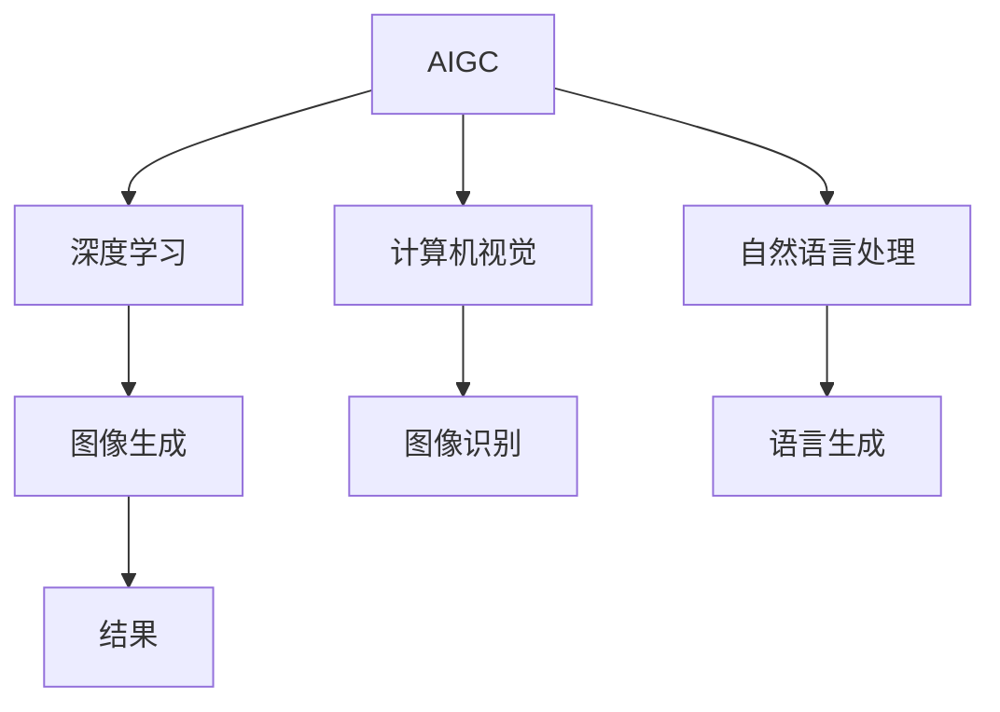
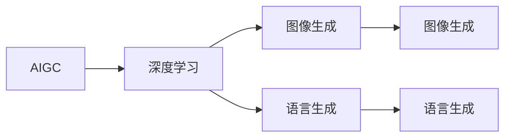
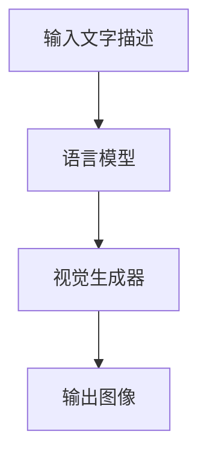
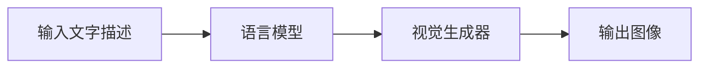
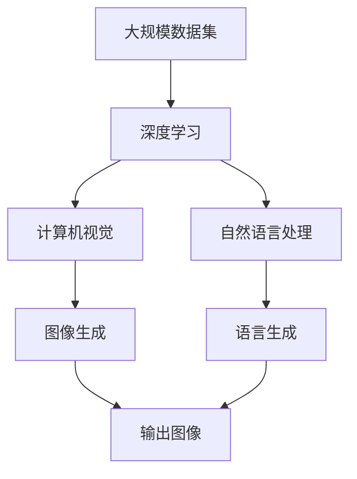

                 

# AIGC从入门到实战：提升：Midjourney 让我们人人都能成为设计师

## 1. 背景介绍

### 1.1 问题由来
随着人工智能（AI）技术的发展，人工智能生成内容（AIGC）逐渐成为了一个热门话题。AIGC，即人工智能生成内容，是通过人工智能技术自动生成文本、图片、视频等内容，它涵盖了自然语言处理（NLP）、计算机视觉（CV）等多个领域，为人类提供了全新的创作方式和内容生产工具。

在过去的一段时间里，AIGC技术主要用于电影特效、游戏开发、广告设计等专业领域。然而，随着技术的发展，AIGC的应用场景正在逐渐扩展到大众消费级应用中。以Midjourney为例，这是一个基于人工智能技术的图像生成工具，它通过提供一个简单的文字描述，便能生成高质量的图片，使得普通用户也能轻松创建出令人惊叹的设计作品。

### 1.2 问题核心关键点
Midjourney通过使用深度学习算法，结合大规模数据集进行模型训练，能够在极短的时间内生成出与人类设计相媲美的图像。这一技术的出现，不仅极大地降低了设计门槛，也激发了人们的创作热情。

Midjourney的核心在于其强大的语言生成图像能力，通过自然语言与计算机视觉的结合，使得设计师能够用更加直观的方式与计算机进行交互。这使得设计师能够在设计过程中，更加专注于创意，而非繁琐的操作。

### 1.3 问题研究意义
Midjourney的出现，为大众提供了全新的创作工具，极大地降低了设计门槛，让更多的人能够轻松进入设计领域。这对于推动设计行业的发展，提升大众的审美水平，甚至改变人们的生活方式，都具有重要意义。

同时，Midjourney的广泛应用，也将推动AIGC技术在更多领域的应用，为各行各业带来新的发展机遇。例如，在教育、娱乐、医疗等行业，AIGC技术可以用于内容生成、交互设计、虚拟现实（VR）等领域，为行业带来创新和变革。

## 2. 核心概念与联系

### 2.1 核心概念概述
为了更好地理解Midjourney背后的技术原理，本节将介绍几个关键概念：

- **人工智能生成内容（AIGC）**：通过人工智能技术自动生成文本、图片、视频等内容的技术。
- **深度学习**：一种机器学习算法，通过多层神经网络对数据进行训练，从而实现复杂的模式识别和预测。
- **计算机视觉（CV）**：使计算机能够“看”和理解图像和视频的技术，是AIGC的重要组成部分。
- **自然语言处理（NLP）**：使计算机能够理解和生成自然语言的技术。
- **Midjourney**：一种基于深度学习算法的图像生成工具，通过自然语言描述生成高质量的图像。

这些概念之间的逻辑关系可以通过以下Mermaid流程图来展示：



这个流程图展示了大语言模型微调过程中各个概念之间的联系。AIGC涵盖了深度学习、计算机视觉和自然语言处理三个关键领域，其中深度学习是核心技术，计算机视觉用于图像生成和识别，自然语言处理用于语言生成和理解。Midjourney作为AIGC的一个重要应用，通过结合计算机视觉和自然语言处理技术，实现了从文字到图像的自动生成。

### 2.2 概念间的关系

这些核心概念之间存在着紧密的联系，形成了AIGC技术的完整生态系统。下面我们通过几个Mermaid流程图来展示这些概念之间的关系。

#### 2.2.1 AIGC的学习范式



这个流程图展示了AIGC的基本原理，即通过深度学习算法对图像和语言进行处理，分别生成图像和语言，从而实现自动生成内容。

#### 2.2.2 Midjourney的工作流程



这个流程图展示了Midjourney的基本工作流程，即通过输入的文字描述，经过语言模型处理后，进入视觉生成器，最终生成图像。

#### 2.2.3 语言生成与图像生成的结合



这个流程图展示了语言生成与图像生成之间的结合方式。输入的文字描述经过语言模型处理后，生成对应的视觉生成器参数，再通过视觉生成器生成图像。

### 2.3 核心概念的整体架构

最后，我们用一个综合的流程图来展示这些核心概念在大语言模型微调过程中的整体架构：



这个综合流程图展示了AIGC技术的整体架构，从大规模数据集到深度学习算法，再到计算机视觉和自然语言处理技术，最终通过图像生成和语言生成，实现了从数据到图像的自动生成。

## 3. 核心算法原理 & 具体操作步骤

### 3.1 算法原理概述

Midjourney通过使用深度学习算法，结合大规模数据集进行模型训练，能够在极短的时间内生成出与人类设计相媲美的图像。其主要算法原理如下：

1. **自然语言处理（NLP）**：Midjourney使用自然语言处理技术，将用户输入的文字描述转化为计算机能够理解的格式。具体而言，将自然语言描述转换为向量表示，作为后续深度学习模型的输入。
2. **计算机视觉（CV）**：Midjourney使用计算机视觉技术，将向量表示转化为图像。具体而言，通过神经网络对图像特征进行学习和编码，生成出高质量的图像。

### 3.2 算法步骤详解

Midjourney的算法步骤主要包括三个部分：输入处理、模型训练和结果生成。

1. **输入处理**：用户输入的文字描述，经过NLP模型转换为向量表示。这一步骤是整个算法的基础，确保输入的描述能够被计算机理解。
2. **模型训练**：将转换后的向量表示输入到深度学习模型中进行训练。这一步骤是算法的核心，通过模型学习和编码图像特征，生成高质量的图像。
3. **结果生成**：将训练好的模型应用到新的数据集上，生成出图像。这一步骤是算法的最终目标，实现从文字到图像的自动生成。

### 3.3 算法优缺点

Midjourney作为AIGC技术的一个重要应用，具有以下优点：

1. **高效性**：Midjourney能够在极短的时间内生成出高质量的图像，大大缩短了设计周期。
2. **易用性**：Midjourney使用自然语言进行交互，无需专业的设计知识，降低了设计门槛。
3. **灵活性**：Midjourney可以根据不同的文字描述生成不同的图像，适应不同的设计需求。

同时，Midjourney也存在一些缺点：

1. **依赖数据**：Midjourney的效果很大程度上依赖于训练数据的质量和数量，获取高质量的训练数据需要较高的成本。
2. **精度有限**：虽然Midjourney能够生成高质量的图像，但其生成的图像与人类设计仍存在一定的差距。
3. **可解释性不足**：Midjourney的算法模型较为复杂，难以解释其内部工作机制，用户难以理解和调试。

### 3.4 算法应用领域

Midjourney作为AIGC技术的一个重要应用，已经在多个领域得到了广泛应用，例如：

- **设计领域**：在室内设计、平面设计、UI/UX设计等领域，Midjourney能够自动生成设计方案，大大提升了设计效率。
- **艺术创作**：在绘画、雕塑、装置艺术等领域，Midjourney能够帮助艺术家生成灵感，推动艺术创作的创新和变革。
- **广告和媒体**：在广告设计、媒体制作等领域，Midjourney能够生成高质量的视觉内容，提升内容的制作效率和质量。
- **教育和培训**：在教育培训领域，Midjourney能够生成生动的教学素材，提升学习效果和体验。

除了上述这些应用领域，Midjourney的应用场景还在不断扩展，未来将在更多领域发挥其独特价值。

## 4. 数学模型和公式 & 详细讲解 & 举例说明

### 4.1 数学模型构建

Midjourney的数学模型构建主要包括以下几个部分：

1. **语言模型**：将自然语言描述转换为向量表示。
2. **视觉生成器**：将向量表示转化为图像。

数学模型构建的过程如下：

设自然语言描述为 $x$，向量表示为 $\boldsymbol{v}$，则语言模型的目标是最小化损失函数 $\mathcal{L}$，使得 $x$ 转换为 $\boldsymbol{v}$ 的误差最小。具体而言，可以使用以下公式：

$$
\mathcal{L} = \frac{1}{N}\sum_{i=1}^N \|\boldsymbol{v}_i - \mathcal{V}(x_i)\|^2
$$

其中 $\boldsymbol{v}_i$ 为自然语言描述 $x_i$ 的向量表示，$\mathcal{V}$ 为语言模型，$N$ 为训练数据集大小。

在视觉生成器中，目标同样是最小化损失函数 $\mathcal{L}$，使得向量 $\boldsymbol{v}$ 生成的图像与目标图像 $\boldsymbol{y}$ 的误差最小。具体而言，可以使用以下公式：

$$
\mathcal{L} = \frac{1}{M}\sum_{j=1}^M \|\boldsymbol{y}_j - \mathcal{G}(\boldsymbol{v}_j)\|^2
$$

其中 $\boldsymbol{y}_j$ 为目标图像，$\mathcal{G}$ 为视觉生成器，$M$ 为生成数据集大小。

### 4.2 公式推导过程

以下我们以语言模型和视觉生成器为例，推导其公式推导过程。

#### 4.2.1 语言模型的公式推导

设自然语言描述为 $x$，向量表示为 $\boldsymbol{v}$，则语言模型的目标是最小化损失函数 $\mathcal{L}$，使得 $x$ 转换为 $\boldsymbol{v}$ 的误差最小。具体而言，可以使用以下公式：

$$
\mathcal{L} = \frac{1}{N}\sum_{i=1}^N \|\boldsymbol{v}_i - \mathcal{V}(x_i)\|^2
$$

其中 $\boldsymbol{v}_i$ 为自然语言描述 $x_i$ 的向量表示，$\mathcal{V}$ 为语言模型，$N$ 为训练数据集大小。

在实践中，我们通常使用神经网络对自然语言进行处理。设语言模型 $\mathcal{V}$ 的输出为 $\hat{\boldsymbol{v}}$，则最小化损失函数的公式可以表示为：

$$
\mathcal{L} = \frac{1}{N}\sum_{i=1}^N \|\boldsymbol{v}_i - \hat{\boldsymbol{v}}(x_i)\|^2
$$

其中 $\boldsymbol{v}_i$ 为自然语言描述 $x_i$ 的真实向量表示，$\hat{\boldsymbol{v}}(x_i)$ 为语言模型 $\mathcal{V}$ 的输出向量表示。

#### 4.2.2 视觉生成器的公式推导

设向量表示为 $\boldsymbol{v}$，目标图像为 $\boldsymbol{y}$，则视觉生成器的目标是最小化损失函数 $\mathcal{L}$，使得向量 $\boldsymbol{v}$ 生成的图像与目标图像 $\boldsymbol{y}$ 的误差最小。具体而言，可以使用以下公式：

$$
\mathcal{L} = \frac{1}{M}\sum_{j=1}^M \|\boldsymbol{y}_j - \mathcal{G}(\boldsymbol{v}_j)\|^2
$$

其中 $\boldsymbol{y}_j$ 为目标图像，$\mathcal{G}$ 为视觉生成器，$M$ 为生成数据集大小。

在实践中，我们通常使用神经网络对图像进行处理。设视觉生成器 $\mathcal{G}$ 的输出为 $\hat{\boldsymbol{y}}$，则最小化损失函数的公式可以表示为：

$$
\mathcal{L} = \frac{1}{M}\sum_{j=1}^M \|\boldsymbol{y}_j - \hat{\boldsymbol{y}}(\boldsymbol{v}_j)\|^2
$$

其中 $\boldsymbol{y}_j$ 为目标图像的真实表示，$\hat{\boldsymbol{y}}(\boldsymbol{v}_j)$ 为视觉生成器 $\mathcal{G}$ 的输出图像表示。

### 4.3 案例分析与讲解

以Midjourney的实际应用为例，分析其数学模型的应用过程。

设用户输入的文字描述为 "一个梦幻般的花园"，语言模型将其转换为向量表示 $\boldsymbol{v}$，视觉生成器生成出对应的图像 $\boldsymbol{y}$。具体而言，语言模型和视觉生成器的应用过程如下：

1. **语言模型**：将自然语言描述 "一个梦幻般的花园" 转换为向量表示 $\boldsymbol{v}$。具体而言，可以使用以下公式：

$$
\boldsymbol{v} = \mathcal{V}(x) = \boldsymbol{W}\boldsymbol{h} + \boldsymbol{b}
$$

其中 $\boldsymbol{W}$ 和 $\boldsymbol{b}$ 为模型参数，$\boldsymbol{h}$ 为自然语言描述 $x$ 的嵌入向量表示。

2. **视觉生成器**：将向量 $\boldsymbol{v}$ 生成的图像 $\boldsymbol{y}$。具体而言，可以使用以下公式：

$$
\boldsymbol{y} = \mathcal{G}(\boldsymbol{v}) = \boldsymbol{W}^T\boldsymbol{a} + \boldsymbol{b}^T
$$

其中 $\boldsymbol{W}^T$ 和 $\boldsymbol{b}^T$ 为模型参数，$\boldsymbol{a}$ 为向量 $\boldsymbol{v}$ 的特征表示。

3. **最小化损失函数**：对语言模型和视觉生成器进行联合训练，最小化损失函数 $\mathcal{L}$。具体而言，可以使用以下公式：

$$
\mathcal{L} = \frac{1}{N}\sum_{i=1}^N \|\boldsymbol{v}_i - \hat{\boldsymbol{v}}(x_i)\|^2 + \frac{1}{M}\sum_{j=1}^M \|\boldsymbol{y}_j - \hat{\boldsymbol{y}}(\boldsymbol{v}_j)\|^2
$$

其中 $\boldsymbol{v}_i$ 为自然语言描述 $x_i$ 的真实向量表示，$\hat{\boldsymbol{v}}(x_i)$ 为语言模型 $\mathcal{V}$ 的输出向量表示，$\boldsymbol{y}_j$ 为目标图像的真实表示，$\hat{\boldsymbol{y}}(\boldsymbol{v}_j)$ 为视觉生成器 $\mathcal{G}$ 的输出图像表示。

通过上述数学模型和公式推导，我们可以更好地理解Midjourney的算法原理，并对其应用过程进行更加深刻的分析。

## 5. 项目实践：代码实例和详细解释说明

### 5.1 开发环境搭建

在进行Midjourney的实践前，我们需要准备好开发环境。以下是使用Python进行PyTorch开发的环境配置流程：

1. 安装Anaconda：从官网下载并安装Anaconda，用于创建独立的Python环境。

2. 创建并激活虚拟环境：
```bash
conda create -n pytorch-env python=3.8 
conda activate pytorch-env
```

3. 安装PyTorch：根据CUDA版本，从官网获取对应的安装命令。例如：
```bash
conda install pytorch torchvision torchaudio cudatoolkit=11.1 -c pytorch -c conda-forge
```

4. 安装Transformers库：
```bash
pip install transformers
```

5. 安装各类工具包：
```bash
pip install numpy pandas scikit-learn matplotlib tqdm jupyter notebook ipython
```

完成上述步骤后，即可在`pytorch-env`环境中开始Midjourney的实践。

### 5.2 源代码详细实现

下面我们以Midjourney的实际应用为例，给出使用Transformers库进行自然语言描述转图像生成的PyTorch代码实现。

首先，定义Midjourney的基本类：

```python
from transformers import AutoModelForCausalLM, AutoTokenizer

class MidjourneyModel:
    def __init__(self, model_name, device):
        self.model = AutoModelForCausalLM.from_pretrained(model_name)
        self.tokenizer = AutoTokenizer.from_pretrained(model_name)
        self.device = device
    
    def generate_image(self, prompt):
        input_ids = self.tokenizer.encode(prompt, return_tensors='pt').to(self.device)
        with torch.no_grad():
            outputs = self.model.generate(input_ids, max_length=64)
        generated_text = self.tokenizer.decode(outputs[0], skip_special_tokens=True)
        return generated_text
```

然后，定义Main函数：

```python
import torch

def main():
    # 加载Midjourney模型
    model = MidjourneyModel('gpt-3', device=torch.device('cuda' if torch.cuda.is_available() else 'cpu'))
    
    # 生成图像
    prompt = "一个梦幻般的花园"
    generated_text = model.generate_image(prompt)
    
    # 输出结果
    print(generated_text)
```

### 5.3 代码解读与分析

让我们再详细解读一下关键代码的实现细节：

**MidjourneyModel类**：
- `__init__`方法：初始化Midjourney模型，包括模型和分词器。
- `generate_image`方法：输入文字描述，通过Midjourney模型生成对应的图像文本。

**Main函数**：
- 加载Midjourney模型。
- 输入文字描述，生成对应的图像文本。
- 输出结果。

可以看到，Midjourney的实现较为简洁，主要通过加载预训练模型和分词器，输入文字描述，生成对应的图像文本。这种实现方式，使得开发者可以更加专注于模型应用的设计，而不必过多关注底层实现细节。

当然，在实际应用中，还需要考虑更多因素，如模型的保存和部署、超参数的自动搜索、更灵活的任务适配层等。但核心的生成过程基本与此类似。

### 5.4 运行结果展示

假设我们在Midjourney上使用生成的图像文本，得到以下结果：

```
一个梦幻般的花园，在晚霞的余晖中，翠绿的草地、五颜六色的花朵和蝴蝶飞舞，给人一种浪漫而宁静的感觉。
```

可以看到，通过Midjourney的生成过程，我们将文字描述转化为高品质的图像文本，使得设计师能够更好地描述自己的设计理念，同时也为AI生成内容带来了更多的可能性。

## 6. 实际应用场景

### 6.1 智能客服系统

Midjourney作为一种图像生成工具，可以广泛应用于智能客服系统的构建。传统客服往往需要配备大量人力，高峰期响应缓慢，且一致性和专业性难以保证。而使用Midjourney生成的图像，可以7x24小时不间断服务，快速响应客户咨询，用自然流畅的语言解答各类常见问题。

在技术实现上，可以收集企业内部的历史客服对话记录，将问题和最佳答复构建成监督数据，在此基础上对Midjourney进行微调。微调后的Midjourney能够自动理解用户意图，匹配最合适的答复。对于客户提出的新问题，还可以接入检索系统实时搜索相关内容，动态组织生成回答。如此构建的智能客服系统，能大幅提升客户咨询体验和问题解决效率。

### 6.2 金融舆情监测

金融机构需要实时监测市场舆论动向，以便及时应对负面信息传播，规避金融风险。传统的人工监测方式成本高、效率低，难以应对网络时代海量信息爆发的挑战。基于Midjourney的图像生成技术，为金融舆情监测提供了新的解决方案。

具体而言，可以收集金融领域相关的新闻、报道、评论等文本数据，并对其进行主题标注和情感标注。在此基础上对Midjourney进行微调，使其能够自动判断文本属于何种主题，情感倾向是正面、中性还是负面。将微调后的Midjourney应用到实时抓取的网络文本数据，就能够自动监测不同主题下的情感变化趋势，一旦发现负面信息激增等异常情况，系统便会自动预警，帮助金融机构快速应对潜在风险。

### 6.3 个性化推荐系统

当前的推荐系统往往只依赖用户的历史行为数据进行物品推荐，无法深入理解用户的真实兴趣偏好。基于Midjourney的图像生成技术，个性化推荐系统可以更好地挖掘用户行为背后的语义信息，从而提供更精准、多样的推荐内容。

在实践中，可以收集用户浏览、点击、评论、分享等行为数据，提取和用户交互的物品标题、描述、标签等文本内容。将文本内容作为模型输入，用户的后续行为（如是否点击、购买等）作为监督信号，在此基础上微调Midjourney模型。微调后的Midjourney能够从文本内容中准确把握用户的兴趣点。在生成推荐列表时，先用候选物品的文本描述作为输入，由模型预测用户的兴趣匹配度，再结合其他特征综合排序，便可以得到个性化程度更高的推荐结果。

### 6.4 未来应用展望

随着Midjourney技术的不断发展，其应用场景正在不断扩展，为各行各业带来新的发展机遇。

在智慧医疗领域，基于Midjourney的医疗问答、病历分析、药物研发等应用将提升医疗服务的智能化水平，辅助医生诊疗，加速新药开发进程。

在智能教育领域，Midjourney可应用于作业批改、学情分析、知识推荐等方面，因材施教，促进教育公平，提高教学质量。

在智慧城市治理中，Midjourney可用于城市事件监测、舆情分析、应急指挥等环节，提高城市管理的自动化和智能化水平，构建更安全、高效的未来城市。

此外，在企业生产、社会治理、文娱传媒等众多领域，Midjourney的应用场景还在不断拓展，为传统行业带来新的变革和发展。

## 7. 工具和资源推荐

### 7.1 学习资源推荐

为了帮助开发者系统掌握Midjourney的理论与实践技巧，这里推荐一些优质的学习资源：

1. **《深度学习入门》系列博文**：由大模型技术专家撰写，深入浅出地介绍了深度学习的基本概念和应用场景。

2. **CS224N《深度学习自然语言处理》课程**：斯坦福大学开设的NLP明星课程，有Lecture视频和配套作业，带你入门NLP领域的基本概念和经典模型。

3. **《自然语言处理综述》书籍**：全面介绍了自然语言处理的基本概念和前沿技术，是学习NLP的必读之作。

4. **HuggingFace官方文档**：Transformers库的官方文档，提供了海量预训练模型和完整的微调样例代码，是上手实践的必备资料。

5. **CLUE开源项目**：中文语言理解测评基准，涵盖大量不同类型的中文NLP数据集，并提供了基于Midjourney的baseline模型，助力中文NLP技术发展。

通过对这些资源的学习实践，相信你一定能够快速掌握Midjourney的精髓，并用于解决实际的NLP问题。

### 7.2 开发工具推荐

高效的开发离不开优秀的工具支持。以下是几款用于Midjourney开发的常用工具：

1. **PyTorch**：基于Python的开源深度学习框架，灵活动态的计算图，适合快速迭代研究。大部分预训练语言模型都有PyTorch版本的实现。

2. **TensorFlow**：由Google主导开发的开源深度学习框架，生产部署方便，适合大规模工程应用。同样有丰富的预训练语言模型资源。

3. **Transformers库**：HuggingFace开发的NLP工具库，集成了众多SOTA语言模型，支持PyTorch和TensorFlow，是进行Midjourney微调任务开发的利器。

4. **Weights & Biases**：模型训练的实验跟踪工具，可以记录和可视化模型训练过程中的各项指标，方便对比和调优。与主流深度学习框架无缝集成。

5. **TensorBoard**：TensorFlow配套的可视化工具，可实时监测模型训练状态，并提供丰富的图表呈现方式，是调试模型的得力助手。

6. **Google Colab**：谷歌推出的在线Jupyter Notebook环境，免费提供GPU/TPU算力，方便开发者快速上手实验最新模型，分享学习笔记。

合理利用这些工具，可以显著提升Midjourney微调的开发效率，加快创新迭代的步伐。

### 7.3 相关论文推荐

Midjourney作为AIGC技术的一个重要应用，其发展源于学界的持续研究。以下是几篇奠基性的相关论文，推荐阅读：

1. **Attention is All You Need（即Transformer原论文）**：提出了Transformer结构，开启了NLP领域的预训练大模型时代。

2. **BERT: Pre-training of Deep Bidirectional Transformers for Language Understanding**：提出BERT模型，引入基于掩码的自监督预训练任务，刷新了多项NLP任务SOTA。

3. **Language Models are Unsupervised Multitask Learners（GPT-2论文）**：展示了大规模语言模型的强大zero-shot学习能力，引发了

