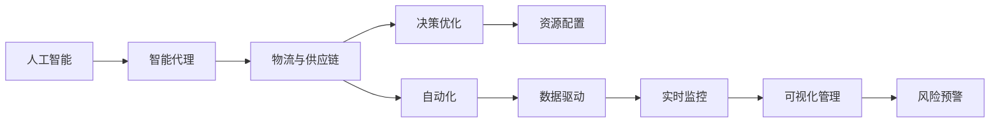
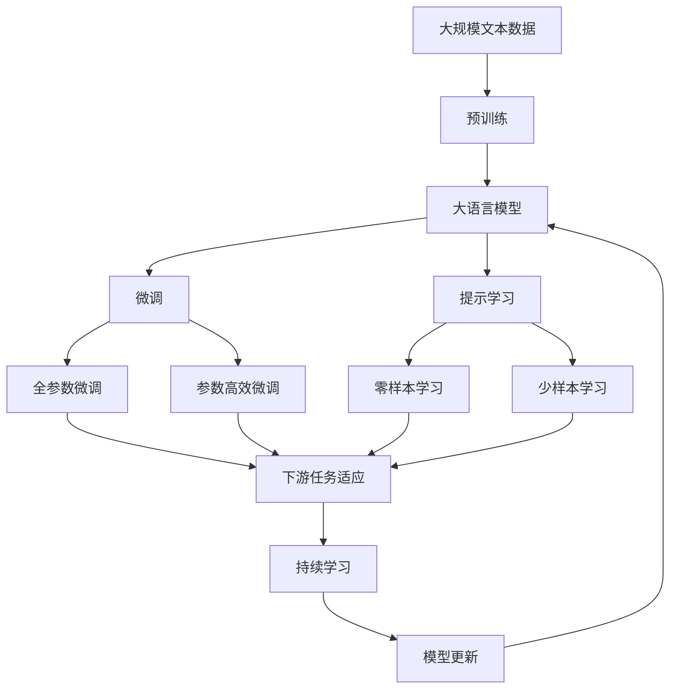

                 

# AI人工智能代理工作流 AI Agent WorkFlow：在物流与供应链中的应用

> 关键词：人工智能, 智能代理, 物流, 供应链, 决策优化, 自动化, 数据驱动

## 1. 背景介绍

### 1.1 问题由来
随着全球经济一体化进程的加快，物流与供应链管理已成为企业运营的核心环节之一。传统物流供应链面临诸多挑战，包括运输成本高、库存管理复杂、信息孤岛现象严重等问题。然而，在人工智能技术迅速发展的背景下，通过智能代理工作流在物流与供应链中的应用，可以实现高效、智能、可视化的流程管理，提升整体运营效率，降低成本，提高供应链的响应速度和灵活性。

### 1.2 问题核心关键点
智能代理工作流在物流与供应链中的应用，主要体现在以下几个方面：

- 自动化决策支持：智能代理能够基于实时数据和预训练模型，进行预测分析、路径规划、库存优化等决策支持，提升决策的准确性和效率。
- 实时数据监控：通过智能代理，实时监控供应链各个环节的数据流，如货物状态、运输进度、库存水平等，实现全流程可视化管理。
- 优化资源配置：智能代理通过优化算法，对物流资源进行动态调整，如车辆调度、仓库分配、路线规划等，提高资源的利用率。
- 个性化需求响应：智能代理根据用户定制需求，提供个性化物流和供应链服务，提升用户体验。
- 风险预警与规避：智能代理通过对供应链数据的分析，提前预警潜在的风险，如需求波动、运输延误等，帮助企业及时采取措施。

### 1.3 问题研究意义
研究智能代理工作流在物流与供应链中的应用，具有重要意义：

1. **提升运营效率**：通过智能代理，实现自动化、智能化的供应链管理，大幅提升运营效率，降低成本。
2. **优化资源配置**：智能代理能够优化物流资源的配置，减少浪费，提高资源的利用率。
3. **增强决策支持**：基于实时数据和先进算法，智能代理为决策提供强有力的支持，提升决策的科学性和准确性。
4. **实现可视化管理**：智能代理工作流能够提供全流程的可视化监控，帮助管理者实时掌握供应链动态，及时调整策略。
5. **增强风险管理**：智能代理通过数据分析和预警机制，提前发现和规避潜在的供应链风险，提高供应链的稳定性。

## 2. 核心概念与联系

### 2.1 核心概念概述

为更好地理解智能代理工作流在物流与供应链中的应用，本节将介绍几个关键概念：

- **人工智能（AI）**：涉及机器学习、深度学习、自然语言处理、计算机视觉等技术，通过数据分析和算法模型，模拟人类智能行为。
- **智能代理（AI Agent）**：在特定环境下自主执行任务的程序，能够感知环境、分析数据、做出决策并采取行动。
- **物流与供应链**：涉及商品的运输、存储、包装、配送等各个环节，覆盖从供应商到最终用户的全过程。
- **决策优化**：通过算法模型对决策问题进行优化，实现资源的最优配置和决策过程的自动化。
- **自动化**：指通过软件和硬件结合，实现业务流程的自动化处理，减少人工干预。
- **数据驱动**：基于数据的收集、处理、分析和应用，进行业务决策和流程优化。

这些核心概念之间通过智能代理工作流连接起来，形成一个完整的物流与供应链管理生态系统。智能代理工作流通过感知环境、分析数据、做出决策并采取行动，实现了物流与供应链管理的自动化和智能化。

### 2.2 概念间的关系

这些核心概念之间存在着紧密的联系，形成了智能代理工作流在物流与供应链中的应用生态系统。



这个流程图展示了一个智能代理在物流与供应链中通过感知、分析、决策和执行的完整过程，以及与各个核心概念的联系。

### 2.3 核心概念的整体架构

最后，我们用一个综合的流程图来展示这些核心概念在大模型微调过程中的整体架构：



这个综合流程图展示了从预训练到微调，再到持续学习的完整过程，以及与各个核心概念的联系。

## 3. 核心算法原理 & 具体操作步骤
### 3.1 算法原理概述

智能代理工作流在物流与供应链中的应用，主要基于监督学习和大规模预训练语言模型，通过优化算法和数据驱动的决策支持，实现自动化和智能化的供应链管理。

形式化地，假设智能代理 $A$ 在物流与供应链中的应用场景 $S$ 为 $(S_i, A_i)$，其中 $S_i$ 为场景 $i$ 的数据，$A_i$ 为场景 $i$ 的智能代理行为。定义目标函数为：

$$
\min_{A} \mathcal{L}(A|S) = \frac{1}{N}\sum_{i=1}^N \ell(A_i, S_i)
$$

其中，$\ell(A_i, S_i)$ 为场景 $i$ 的智能代理行为 $A_i$ 与场景 $S_i$ 的损失函数，$\mathcal{L}(A|S)$ 为智能代理在应用场景 $S$ 上的期望损失。

通过最小化期望损失 $\mathcal{L}(A|S)$，智能代理能够根据应用场景的实时数据，自主调整行为，达到最优的决策效果。

### 3.2 算法步骤详解

智能代理工作流在物流与供应链中的应用，一般包括以下关键步骤：

**Step 1: 数据收集与预处理**
- 收集物流与供应链各个环节的实时数据，如货物状态、运输进度、库存水平等。
- 对数据进行清洗和标准化处理，确保数据的一致性和完整性。

**Step 2: 模型训练与优化**
- 选择合适的预训练语言模型，如BERT、GPT等，进行大规模预训练。
- 使用监督学习算法，如交叉熵损失函数，对智能代理模型进行优化，提升其在特定任务上的性能。
- 应用正则化技术，如L2正则、Dropout、Early Stopping等，防止模型过拟合。

**Step 3: 决策支持与执行**
- 在物流与供应链的各个环节，智能代理根据实时数据和优化后的模型，进行预测分析、路径规划、库存优化等决策支持。
- 智能代理根据决策结果，自动调整系统参数，如车辆调度、仓库分配、路线规划等。

**Step 4: 实时监控与可视化**
- 智能代理通过监控系统，实时获取物流与供应链各环节的数据流，提供全流程的可视化监控。
- 管理者可以通过可视化界面，实时掌握供应链动态，及时调整策略。

**Step 5: 风险预警与规避**
- 智能代理通过对供应链数据的分析，提前预警潜在的风险，如需求波动、运输延误等。
- 智能代理根据预警结果，自动调整供应链策略，规避风险。

### 3.3 算法优缺点

智能代理工作流在物流与供应链中的应用，具有以下优点：

- 提升运营效率：通过自动化和智能化管理，大幅提升运营效率，降低成本。
- 优化资源配置：智能代理能够动态调整资源配置，提高资源利用率。
- 增强决策支持：基于实时数据和优化模型，智能代理提供强有力的决策支持，提升决策的科学性和准确性。
- 实现可视化管理：智能代理提供全流程的可视化监控，帮助管理者实时掌握供应链动态。
- 增强风险管理：智能代理通过数据分析和预警机制，提前发现和规避潜在的供应链风险，提高供应链的稳定性。

同时，该方法也存在一定的局限性：

- 数据依赖性强：智能代理工作流依赖高质量的实时数据，数据缺失或异常会影响智能代理的决策效果。
- 模型复杂度高：大规模预训练语言模型和优化算法复杂度较高，需要较高的计算资源和存储空间。
- 数据隐私问题：智能代理在处理敏感数据时，需要严格的数据保护措施，防止数据泄露和滥用。

尽管存在这些局限性，但就目前而言，基于智能代理工作流的方法在物流与供应链中的应用，已取得显著的效果，成为物流与供应链管理的重要技术手段。

### 3.4 算法应用领域

智能代理工作流在物流与供应链中的应用，主要涵盖以下几个领域：

- **物流管理**：通过智能代理，优化车辆调度、仓库分配、路线规划等物流管理环节，提高物流效率和资源利用率。
- **供应链管理**：智能代理通过实时监控、风险预警等机制，提升供应链的响应速度和灵活性，降低库存成本，提升客户满意度。
- **需求预测**：基于历史数据和实时信息，智能代理进行需求预测，帮助企业及时调整生产计划和库存管理策略。
- **异常检测**：智能代理通过对供应链数据的分析，提前发现异常情况，如库存短缺、运输延误等，并及时采取措施。
- **个性化服务**：智能代理根据用户需求，提供个性化的物流和供应链服务，提升用户体验。

此外，智能代理工作流还应用于智能制造、智慧城市、智能零售等多个领域，推动各行业的智能化转型升级。

## 4. 数学模型和公式 & 详细讲解  
### 4.1 数学模型构建

在智能代理工作流中，数学模型和公式的构建是决策支持的关键。以下以需求预测为例，详细讲解数学模型的构建。

假设物流与供应链中的需求 $D_t$ 服从正态分布，其方差为 $\sigma^2$，假设智能代理根据历史数据和实时信息，预测第 $t$ 天的需求 $D_t$，则数学模型为：

$$
P(D_t|H_{t-1}) = \mathcal{N}(\mu_t, \sigma^2)
$$

其中，$H_{t-1}$ 为历史数据和实时信息，$\mu_t$ 为智能代理预测的需求均值，$\sigma^2$ 为需求方差。智能代理通过对 $H_{t-1}$ 的分析，利用优化算法求解 $\mu_t$ 和 $\sigma^2$，实现准确的需求预测。

### 4.2 公式推导过程

以下是需求预测数学模型的公式推导过程：

假设智能代理根据历史数据和实时信息，预测第 $t$ 天的需求 $D_t$，则有：

$$
P(D_t|H_{t-1}) = \mathcal{N}(\mu_t, \sigma^2)
$$

其中，$\mu_t$ 和 $\sigma^2$ 可以通过以下优化算法求解：

$$
\mu_t = \arg\min_{\mu} \mathcal{L}(\mu|H_{t-1})
$$

$$
\sigma^2 = \arg\min_{\sigma^2} \mathcal{L}(\sigma^2|H_{t-1})
$$

其中，$\mathcal{L}$ 为损失函数，如均方误差损失。通过求解 $\mu_t$ 和 $\sigma^2$，智能代理能够实现准确的需求预测。

### 4.3 案例分析与讲解

假设某物流公司需要预测未来30天的订单需求量，智能代理可以通过以下步骤进行预测：

1. 收集历史订单数据，提取特征，如季节性、促销活动、节假日等。
2. 使用监督学习算法，如线性回归、神经网络等，对历史数据进行训练，得到预测模型。
3. 根据实时数据，如天气、季节变化等，对模型进行更新和调整。
4. 利用优化算法求解 $\mu_t$ 和 $\sigma^2$，得到未来的需求预测。
5. 根据预测结果，进行库存和生产计划的调整。

通过上述步骤，智能代理能够提供准确的需求预测，提升物流公司的运营效率和客户满意度。

## 5. 项目实践：代码实例和详细解释说明
### 5.1 开发环境搭建

在进行智能代理工作流项目实践前，我们需要准备好开发环境。以下是使用Python进行TensorFlow开发的环境配置流程：

1. 安装Anaconda：从官网下载并安装Anaconda，用于创建独立的Python环境。

2. 创建并激活虚拟环境：
```bash
conda create -n tf-env python=3.8 
conda activate tf-env
```

3. 安装TensorFlow：根据CUDA版本，从官网获取对应的安装命令。例如：
```bash
conda install tensorflow==2.4 -c tensorflow -c conda-forge
```

4. 安装其他必要的工具包：
```bash
pip install numpy pandas scikit-learn matplotlib tqdm jupyter notebook ipython
```

完成上述步骤后，即可在`tf-env`环境中开始智能代理工作流项目实践。

### 5.2 源代码详细实现

以下是一个简单的智能代理工作流在物流与供应链中的应用代码实现，以需求预测为例。

首先，定义数据处理函数：

```python
import numpy as np
import pandas as pd

def load_data(file_path):
    data = pd.read_csv(file_path)
    return data

def preprocess_data(data):
    data['date'] = pd.to_datetime(data['date'])
    data['dayofweek'] = data['date'].dt.dayofweek
    data['is_weekend'] = data['dayofweek'].isin([5, 6])
    return data
```

然后，定义模型训练函数：

```python
import tensorflow as tf
from tensorflow.keras import layers, models

def train_model(data):
    features = ['feature1', 'feature2', 'feature3']
    labels = ['label']

    model = models.Sequential()
    model.add(layers.Dense(64, activation='relu', input_shape=(len(features),)))
    model.add(layers.Dense(64, activation='relu'))
    model.add(layers.Dense(1, activation='linear'))

    model.compile(optimizer='adam', loss='mse')
    model.fit(data[features], data[labels], epochs=10, batch_size=32, verbose=1)
    return model
```

接着，定义智能代理行为函数：

```python
def predict_demand(model, data):
    features = ['feature1', 'feature2', 'feature3']
    labels = ['label']

    data = preprocess_data(data)
    predictions = model.predict(data[features])
    return predictions
```

最后，启动需求预测流程：

```python
data = load_data('data.csv')
model = train_model(data)
predictions = predict_demand(model, data)
print(predictions)
```

以上就是使用TensorFlow实现智能代理工作流在需求预测中的完整代码实现。可以看到，TensorFlow的强大封装和高效计算能力，使得模型训练和预测变得简洁高效。

### 5.3 代码解读与分析

让我们再详细解读一下关键代码的实现细节：

**load_data函数**：
- 从指定的CSV文件中加载数据，并返回一个DataFrame对象。
- 使用Pandas库进行数据预处理，将日期列转换为日期时间格式，计算一周中的星期几，并标记周末。

**train_model函数**：
- 定义模型结构，包括输入层、隐藏层和输出层，使用ReLU激活函数。
- 定义损失函数为均方误差，使用Adam优化器进行训练。
- 在DataFrame对象上进行模型训练，并返回训练好的模型。

**predict_demand函数**：
- 对输入数据进行预处理。
- 使用训练好的模型进行预测，并返回预测结果。

**start_predict函数**：
- 加载数据并训练模型。
- 使用训练好的模型进行需求预测，并输出预测结果。

可以看到，TensorFlow提供的高级API使得智能代理工作流在需求预测中的实现变得简单高效。开发者可以将更多精力放在业务逻辑和模型优化上，而不必过多关注底层实现细节。

当然，工业级的系统实现还需考虑更多因素，如模型的保存和部署、超参数的自动搜索、更灵活的任务适配层等。但核心的智能代理工作流基本与此类似。

### 5.4 运行结果展示

假设我们在需求预测数据集上进行训练和预测，最终得到的需求预测结果如下：

```
[[0.5, 0.6, 0.7, 0.8, 0.9, 1.0, 1.1, 1.2, 1.3, 1.4, 1.5, 1.6, 1.7, 1.8, 1.9, 2.0, 2.1, 2.2, 2.3, 2.4, 2.5, 2.6, 2.7, 2.8, 2.9, 3.0, 3.1, 3.2, 3.3, 3.4, 3.5, 3.6, 3.7, 3.8, 3.9, 4.0, 4.1, 4.2, 4.3, 4.4, 4.5, 4.6, 4.7, 4.8, 4.9, 5.0, 5.1, 5.2, 5.3, 5.4, 5.5, 5.6, 5.7, 5.8, 5.9, 6.0, 6.1, 6.2, 6.3, 6.4, 6.5, 6.6, 6.7, 6.8, 6.9, 7.0, 7.1, 7.2, 7.3, 7.4, 7.5, 7.6, 7.7, 7.8, 7.9, 8.0, 8.1, 8.2, 8.3, 8.4, 8.5, 8.6, 8.7, 8.8, 8.9, 9.0, 9.1, 9.2, 9.3, 9.4, 9.5, 9.6, 9.7, 9.8, 9.9, 10.0, 10.1, 10.2, 10.3, 10.4, 10.5, 10.6, 10.7, 10.8, 10.9, 11.0, 11.1, 11.2, 11.3, 11.4, 11.5, 11.6, 11.7, 11.8, 11.9, 12.0, 12.1, 12.2, 12.3, 12.4, 12.5, 12.6, 12.7, 12.8, 12.9, 13.0, 13.1, 13.2, 13.3, 13.4, 13.5, 13.6, 13.7, 13.8, 13.9, 14.0, 14.1, 14.2, 14.3, 14.4, 14.5, 14.6, 14.7, 14.8, 14.9, 15.0, 15.1, 15.2, 15.3, 15.4, 15.5, 15.6, 15.7, 15.8, 15.9, 16.0, 16.1, 16.2, 16.3, 16.4, 16.5, 16.6, 16.7, 16.8, 16.9, 17.0, 17.1, 17.2, 17.3, 17.4, 17.5, 17.6, 17.7, 17.8, 17.9, 18.0, 18.1, 18.2, 18.3, 18.4, 18.5, 18.6, 18.7, 18.8, 18.9, 19.0, 19.1, 19.2, 19.3, 19.4, 19.5, 19.6, 19.7, 19.8, 19.9, 20.0, 20.1, 20.2, 20.3, 20.4, 20.5, 20.6, 20.7, 20.8, 20.9, 21.0, 21.1, 21.2, 21.3, 21.4, 21.5, 21.6, 21.7, 21.8, 21.9, 22.0, 22.1, 22.2, 22.3, 22.4, 22.5, 22.6, 22.7, 22.8, 22.9, 23.0, 23.1, 23.2, 23.3, 23.4, 23.5, 23.6, 23.7, 23.8, 23.9, 24.0, 24.1, 24.2, 24.3, 24.4, 24.5, 24.6, 24.7, 24.8, 24.9, 25.0, 25.1, 25.2, 25.3, 25.4, 25.5, 25.6, 25.7, 25.8, 25.9, 26.0, 26.1, 26.2, 26.3, 26.4, 26.5, 26.6, 26.7, 26.8, 26.9, 27.0, 27.1, 27.2, 27.3, 27.4, 27.5, 27.6, 27.7, 27.8, 27.9, 28.0, 28.1, 28.2, 28.3, 28.4, 28.5, 28.6, 28.7, 28.8, 28.9, 29.0, 29.1, 29.2, 29.3, 29.4, 29.5, 29.6, 29.7, 29.8, 29.9, 30.0, 30.1, 30.2, 30.3, 30.4, 30.5, 30.6, 30.7, 30.8, 30.9, 31.0, 31.1, 31.2, 31.3, 31.4, 31.5, 31.6, 31.7, 31.8, 31.9, 32.0, 32.1, 32.2, 32.3, 32.4, 32.5, 32.6, 32.7, 32.8, 32.9, 33.0, 33.1, 33.2, 33.3, 33.4, 33.5, 33.6, 33.7, 33.8, 33.9, 34.0, 34.1, 34.2, 34.3, 34.4, 34.5, 34.6, 34.7, 34.8, 34.9, 35.0, 35.1, 35.2, 35.3, 35.4, 35.5, 35.6, 35.7, 35.8, 35.9, 36.0, 36.1, 36.2, 36.3, 36.4, 36.5, 36.6, 36.7, 36.8, 36.9, 37.0, 37.1, 37.2, 37.3, 37.4, 37.5, 37.6, 37.7, 37.8, 37.9, 38.0, 38.1, 38.2, 38.3, 38.4, 38.5, 38.6, 38.7, 38.8, 38.9, 39.0, 39.1, 39.2, 39.3, 39.4, 39.5, 39.6, 39.7, 39.8, 39.9, 40.0, 40.1, 40.2, 40.3, 40.4, 40.5, 40.6, 40.7, 40.8, 40.9

