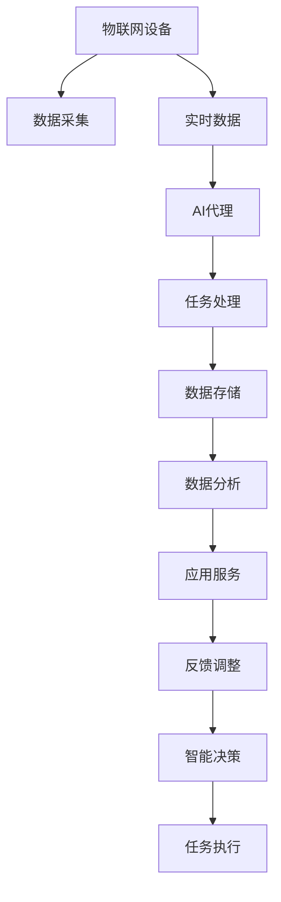
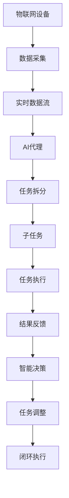
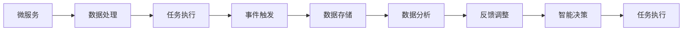
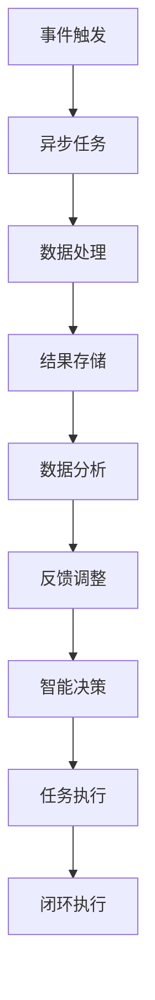
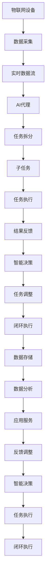

                 

# AI人工智能代理工作流AI Agent WorkFlow：AI代理在物联网场景的应用

> 关键词：AI代理,物联网,工作流,机器人流程自动化,微服务架构,实时数据处理

## 1. 背景介绍

### 1.1 问题由来
随着物联网(IoT)技术的飞速发展，各类智能设备不断涌现，产生了海量的实时数据。这些数据需要被实时地收集、分析、处理和利用，以提供各种智能化的应用和服务。然而，由于物联网数据源多样、数据格式复杂、数据处理需求快速变化，传统的集中式数据中心或中心化应用系统难以满足实时性、可靠性和可扩展性要求。

面对这一挑战，分布式、微服务化、自动化的数据处理和应用服务成为新的发展趋势。AI代理（AI Agent）作为这一趋势的代表，正在逐步成为物联网数据处理和应用服务的重要工具。AI代理是一种自主智能系统，具备自主学习、决策、执行和适应能力，能够高效地处理各种复杂任务和交互场景，广泛应用于机器人流程自动化、智能监控、智能家居、智能医疗等多个领域。

### 1.2 问题核心关键点
AI代理的核心思想是，通过自主学习和自动执行，实现对复杂环境或任务的智能管理。具体而言，AI代理的应用关键点包括：

- 自主学习能力：通过机器学习、深度学习等技术，从数据中提取知识，实现对新任务的快速适应。
- 实时数据处理：能够实时处理和分析海量数据，快速响应外部变化。
- 分布式协作：能够与多个节点或系统协同工作，实现任务分工与资源共享。
- 自适应能力：根据环境变化和任务需求，动态调整自身行为，保持最优性能。
- 人机交互：通过自然语言处理技术，与人类进行有效沟通和协作。

## 2. 核心概念与联系

### 2.1 核心概念概述

为更好地理解AI代理在物联网场景中的应用，本节将介绍几个密切相关的核心概念：

- AI代理（AI Agent）：一种自主智能系统，能够在复杂环境中自主学习、决策、执行和适应，是物联网数据处理和应用服务的核心工具。
- 机器人流程自动化（RPA）：通过软件机器人自动执行重复性、规则性任务，提高生产效率和准确性。
- 微服务架构（Microservices）：将应用系统拆分为多个独立、松耦合的服务，便于灵活扩展和快速迭代。
- 事件驱动架构（Event-Driven Architecture）：基于事件触发，实现异步、分布式和可扩展的应用系统。
- 数据湖（Data Lake）：大规模、多样化的数据存储平台，支持海量数据的实时分析和处理。

这些核心概念之间的逻辑关系可以通过以下Mermaid流程图来展示：



这个流程图展示了大语言模型微调过程中各个核心概念的关系：

1. 物联网设备通过数据采集模块将实时数据流送到AI代理。
2. AI代理处理数据，通过微服务架构进行任务拆分和执行。
3. 任务处理结果通过事件驱动架构发送到数据湖，进行存储和分析。
4. 数据分析结果通过应用服务反馈给AI代理，进行智能决策。
5. AI代理根据决策结果，执行相应的任务，完成闭环。

### 2.2 概念间的关系

这些核心概念之间存在着紧密的联系，形成了AI代理在物联网场景中的应用生态系统。下面我们通过几个Mermaid流程图来展示这些概念之间的关系。

#### 2.2.1 AI代理的工作流程



这个流程图展示了AI代理在物联网场景中的基本工作流程：

1. 物联网设备通过数据采集模块收集实时数据。
2. AI代理接收数据，根据微服务架构进行任务拆分，生成多个子任务。
3. 子任务被分配到不同的节点执行，产生中间结果。
4. AI代理对中间结果进行汇总和分析，进行智能决策。
5. 根据决策结果，AI代理调整任务执行，形成闭环。

#### 2.2.2 微服务架构的协同



这个流程图展示了微服务架构中各组件的协同工作：

1. 微服务通过数据处理模块接收数据。
2. 数据处理模块对数据进行处理，生成中间结果。
3. 事件触发模块将中间结果发送至数据存储模块。
4. 数据存储模块对中间结果进行存储。
5. 数据分析模块对存储结果进行分析和处理。
6. 反馈调整模块将分析结果反馈至微服务，进行智能决策。
7. 智能决策模块根据决策结果，进行任务执行。

#### 2.2.3 事件驱动架构的异步处理



这个流程图展示了事件驱动架构中各组件的异步处理流程：

1. 事件触发模块接收数据。
2. 异步任务模块对数据进行处理，生成中间结果。
3. 数据处理结果被发送到结果存储模块。
4. 数据分析模块对结果进行分析和处理。
5. 反馈调整模块将分析结果反馈至事件触发模块，进行智能决策。
6. 智能决策模块根据决策结果，进行任务执行。
7. 任务执行结果通过闭环执行模块反馈至事件触发模块，完成闭环。

### 2.3 核心概念的整体架构

最后，我们用一个综合的流程图来展示这些核心概念在大语言模型微调过程中的整体架构：



这个综合流程图展示了从数据采集到任务执行的完整过程：

1. 物联网设备通过数据采集模块收集实时数据。
2. AI代理接收数据，根据微服务架构进行任务拆分，生成多个子任务。
3. 子任务被分配到不同的节点执行，产生中间结果。
4. AI代理对中间结果进行汇总和分析，进行智能决策。
5. 根据决策结果，AI代理调整任务执行，形成闭环。
6. 任务执行结果通过数据存储模块发送到数据分析模块。
7. 数据分析模块对存储结果进行分析和处理。
8. 反馈调整模块将分析结果反馈至AI代理，进行智能决策。
9. AI代理根据决策结果，进行任务执行。
10. 任务执行结果通过闭环执行模块反馈至AI代理，完成闭环。

## 3. 核心算法原理 & 具体操作步骤
### 3.1 算法原理概述

AI代理在物联网场景中的应用，本质上是一个分布式、微服务化的智能数据处理过程。其核心思想是，通过自主学习和自动执行，实现对复杂环境或任务的智能管理。

形式化地，假设AI代理模型为 $A_{\theta}$，其中 $\theta$ 为模型参数。在物联网场景中，AI代理的任务通常可以抽象为数据采集、数据处理、任务执行、结果反馈等多个子任务。记每个子任务的输入为 $x_i$，输出为 $y_i$，则AI代理的整体任务可以表示为：

$$
y_i = A_{\theta}(x_i)
$$

其中 $x_i$ 为来自物联网设备的实时数据，$y_i$ 为任务执行结果。

AI代理的训练目标是最小化任务执行误差，即找到最优参数：

$$
\theta^* = \mathop{\arg\min}_{\theta} \sum_{i=1}^N (y_i - A_{\theta}(x_i))^2
$$

通过梯度下降等优化算法，AI代理不断更新模型参数 $\theta$，最小化任务执行误差，从而提升任务执行的精度和效率。

### 3.2 算法步骤详解

AI代理在物联网场景中的应用，通常包括以下几个关键步骤：

**Step 1: 数据采集与预处理**

- 采集物联网设备的数据，并将其转换为标准格式。
- 对数据进行清洗、去重、过滤等预处理操作，保证数据的质量和一致性。
- 将预处理后的数据存储到数据湖中，便于后续处理和分析。

**Step 2: 任务拆分与分配**

- 根据任务复杂度和执行需求，将任务拆分为多个子任务。
- 根据各个子任务的优先级、执行资源和依赖关系，进行任务分配。
- 将子任务分配到不同的节点或服务执行，并设置执行进度和进度监控。

**Step 3: 任务执行与数据处理**

- 各执行节点根据任务分配，执行相应的子任务，生成中间结果。
- 对中间结果进行数据处理，如特征提取、降维、拼接等，生成最终结果。
- 将最终结果存储到数据湖中，便于后续分析和应用。

**Step 4: 结果反馈与智能决策**

- 根据任务执行结果，对执行进度、执行质量等进行评估。
- 将评估结果反馈至AI代理，进行智能决策。
- 根据决策结果，调整任务执行计划，优化执行效率和质量。

**Step 5: 反馈调整与闭环执行**

- 将任务执行结果进行汇总和分析，生成反馈报告。
- 根据反馈报告，进行模型参数的调整和优化。
- 将优化后的模型参数重新应用于任务执行，形成闭环。

以上是AI代理在物联网场景中的基本工作流程。在实际应用中，还需要根据具体任务的特点，对各个环节进行优化设计，如引入更多的任务自动化的技术，引入更多的机器学习算法等。

### 3.3 算法优缺点

AI代理在物联网场景中的应用，具有以下优点：

- 自主学习能力：通过机器学习、深度学习等技术，从数据中提取知识，实现对新任务的快速适应。
- 实时数据处理：能够实时处理和分析海量数据，快速响应外部变化。
- 分布式协作：能够与多个节点或系统协同工作，实现任务分工与资源共享。
- 自适应能力：根据环境变化和任务需求，动态调整自身行为，保持最优性能。
- 人机交互：通过自然语言处理技术，与人类进行有效沟通和协作。

同时，AI代理也存在一定的局限性：

- 对数据质量依赖度高：如果数据存在噪声、缺失或错误，会对AI代理的执行产生影响。
- 模型复杂度高：大型的AI代理模型往往参数众多，计算和存储成本较高。
- 缺乏透明性：AI代理的决策过程复杂，难以进行有效的解释和调试。
- 安全性问题：AI代理的决策和执行可能涉及敏感数据，需要对其行为进行严格的监管和保护。

尽管存在这些局限性，但就目前而言，AI代理在物联网场景中的应用已经取得了显著的效果，成为智能化应用的重要工具。未来相关研究的重点在于如何进一步降低AI代理对数据质量的依赖，提高模型的可解释性和安全性，同时兼顾高效性和鲁棒性等因素。

### 3.4 算法应用领域

AI代理在物联网场景中的应用已经覆盖了多个领域，具体包括：

- 智能监控：通过AI代理对监控数据进行实时分析和处理，提高监控效率和准确性。
- 智能家居：通过AI代理对家庭设备进行自动化管理和控制，提升生活便捷性和舒适度。
- 智能医疗：通过AI代理对医疗数据进行分析和决策，提高诊疗效率和诊断准确性。
- 智能交通：通过AI代理对交通数据进行实时分析和预测，优化交通流量和减少事故发生率。
- 工业自动化：通过AI代理对生产数据进行分析和优化，提高生产效率和质量。
- 智慧城市：通过AI代理对城市数据进行分析和处理，提升城市管理效率和智能化水平。

除了上述这些经典领域外，AI代理在更多行业中的应用也在不断涌现，如智能物流、智能制造、智能教育等，为各行各业带来新的变革和突破。随着AI代理技术的不断演进，相信其在物联网场景中的应用将更加广泛和深入。

## 4. 数学模型和公式 & 详细讲解
### 4.1 数学模型构建

本节将使用数学语言对AI代理在物联网场景中的应用进行更加严格的刻画。

记AI代理模型为 $A_{\theta}$，其中 $\theta$ 为模型参数。假设物联网场景中的任务为 $T$，任务 $T$ 的输入为 $x \in \mathcal{X}$，输出为 $y \in \mathcal{Y}$。

定义AI代理模型 $A_{\theta}$ 在数据样本 $(x,y)$ 上的损失函数为 $\ell(A_{\theta}(x),y)$，则在数据集 $D=\{(x_i,y_i)\}_{i=1}^N$ 上的经验风险为：

$$
\mathcal{L}(\theta) = \frac{1}{N} \sum_{i=1}^N \ell(A_{\theta}(x_i),y_i)
$$

AI代理的优化目标是最小化经验风险，即找到最优参数：

$$
\theta^* = \mathop{\arg\min}_{\theta} \mathcal{L}(\theta)
$$

在实践中，我们通常使用基于梯度的优化算法（如SGD、Adam等）来近似求解上述最优化问题。设 $\eta$ 为学习率，$\lambda$ 为正则化系数，则参数的更新公式为：

$$
\theta \leftarrow \theta - \eta \nabla_{\theta}\mathcal{L}(\theta) - \eta\lambda\theta
$$

其中 $\nabla_{\theta}\mathcal{L}(\theta)$ 为损失函数对参数 $\theta$ 的梯度，可通过反向传播算法高效计算。

### 4.2 公式推导过程

以下我们以智能监控任务为例，推导AI代理模型的损失函数及其梯度的计算公式。

假设AI代理模型 $A_{\theta}$ 在输入 $x$ 上的输出为 $\hat{y}=A_{\theta}(x) \in [0,1]$，表示监控事件发生的概率。真实标签 $y \in \{0,1\}$。则二分类交叉熵损失函数定义为：

$$
\ell(A_{\theta}(x),y) = -[y\log \hat{y} + (1-y)\log (1-\hat{y})]
$$

将其代入经验风险公式，得：

$$
\mathcal{L}(\theta) = -\frac{1}{N}\sum_{i=1}^N [y_i\log A_{\theta}(x_i)+(1-y_i)\log(1-A_{\theta}(x_i))]
$$

根据链式法则，损失函数对参数 $\theta_k$ 的梯度为：

$$
\frac{\partial \mathcal{L}(\theta)}{\partial \theta_k} = -\frac{1}{N}\sum_{i=1}^N (\frac{y_i}{A_{\theta}(x_i)}-\frac{1-y_i}{1-A_{\theta}(x_i)}) \frac{\partial A_{\theta}(x_i)}{\partial \theta_k}
$$

其中 $\frac{\partial A_{\theta}(x_i)}{\partial \theta_k}$ 可进一步递归展开，利用自动微分技术完成计算。

在得到损失函数的梯度后，即可带入参数更新公式，完成模型的迭代优化。重复上述过程直至收敛，最终得到适应物联网监控任务的最优模型参数 $\theta^*$。

## 5. 项目实践：代码实例和详细解释说明
### 5.1 开发环境搭建

在进行AI代理实践前，我们需要准备好开发环境。以下是使用Python进行PyTorch开发的环境配置流程：

1. 安装Anaconda：从官网下载并安装Anaconda，用于创建独立的Python环境。

2. 创建并激活虚拟环境：
```bash
conda create -n pytorch-env python=3.8 
conda activate pytorch-env
```

3. 安装PyTorch：根据CUDA版本，从官网获取对应的安装命令。例如：
```bash
conda install pytorch torchvision torchaudio cudatoolkit=11.1 -c pytorch -c conda-forge
```

4. 安装Transformers库：
```bash
pip install transformers
```

5. 安装各类工具包：
```bash
pip install numpy pandas scikit-learn matplotlib tqdm jupyter notebook ipython
```

完成上述步骤后，即可在`pytorch-env`环境中开始AI代理实践。

### 5.2 源代码详细实现

这里我们以智能监控任务为例，给出使用Transformers库对AI代理进行开发的PyTorch代码实现。

首先，定义任务处理函数：

```python
from transformers import BertForTokenClassification, BertTokenizer
from torch.utils.data import Dataset
import torch

class SmartMonitorDataset(Dataset):
    def __init__(self, texts, labels, tokenizer, max_len=128):
        self.texts = texts
        self.labels = labels
        self.tokenizer = tokenizer
        self.max_len = max_len
        
    def __len__(self):
        return len(self.texts)
    
    def __getitem__(self, item):
        text = self.texts[item]
        label = self.labels[item]
        
        encoding = self.tokenizer(text, return_tensors='pt', max_length=self.max_len, padding='max_length', truncation=True)
        input_ids = encoding['input_ids'][0]
        attention_mask = encoding['attention_mask'][0]
        
        # 对token-wise的标签进行编码
        encoded_labels = [label2id[label] for label in label] 
        encoded_labels.extend([label2id['O']] * (self.max_len - len(encoded_labels)))
        labels = torch.tensor(encoded_labels, dtype=torch.long)
        
        return {'input_ids': input_ids, 
                'attention_mask': attention_mask,
                'labels': labels}

# 标签与id的映射
label2id = {'O': 0, 'MonitorEvent': 1}
id2label = {v: k for k, v in label2id.items()}

# 创建dataset
tokenizer = BertTokenizer.from_pretrained('bert-base-cased')

train_dataset = SmartMonitorDataset(train_texts, train_labels, tokenizer)
dev_dataset = SmartMonitorDataset(dev_texts, dev_labels, tokenizer)
test_dataset = SmartMonitorDataset(test_texts, test_labels, tokenizer)
```

然后，定义模型和优化器：

```python
from transformers import BertForTokenClassification, AdamW

model = BertForTokenClassification.from_pretrained('bert-base-cased', num_labels=len(label2id))

optimizer = AdamW(model.parameters(), lr=2e-5)
```

接着，定义训练和评估函数：

```python
from torch.utils.data import DataLoader
from tqdm import tqdm
from sklearn.metrics import classification_report

device = torch.device('cuda') if torch.cuda.is_available() else torch.device('cpu')
model.to(device)

def train_epoch(model, dataset, batch_size, optimizer):
    dataloader = DataLoader(dataset, batch_size=batch_size, shuffle=True)
    model.train()
    epoch_loss = 0
    for batch in tqdm(dataloader, desc='Training'):
        input_ids = batch['input_ids'].to(device)
        attention_mask = batch['attention_mask'].to(device)
        labels = batch['labels'].to(device)
        model.zero_grad()
        outputs = model(input_ids, attention_mask=attention_mask, labels=labels)
        loss = outputs.loss
        epoch_loss += loss.item()
        loss.backward()
        optimizer.step()
    return epoch_loss / len(dataloader)

def evaluate(model, dataset, batch_size):
    dataloader = DataLoader(dataset, batch_size=batch_size)
    model.eval()
    preds, labels = [], []
    with torch.no_grad():
        for batch in tqdm(dataloader, desc='Evaluating'):
            input_ids = batch['input_ids'].to(device)
            attention_mask = batch['attention_mask'].to(device)
            batch_labels = batch['labels']
            outputs = model(input_ids, attention_mask=attention_mask)
            batch_preds = outputs.logits.argmax(dim=2).to('cpu').tolist()
            batch_labels = batch_labels.to('cpu').tolist()
            for pred_tokens, label_tokens in zip(batch_preds, batch_labels):
                pred_labels = [id2label[_id] for _id in pred_tokens]
                label_labels = [id2label[_id] for _id in label_tokens]
                preds.append(pred_labels[:len(label_labels)])
                labels.append(label_labels)
                
    print(classification_report(labels, preds))
```

最后，启动训练流程并在测试集上评估：

```python
epochs = 5
batch_size = 16

for epoch in range(epochs):
    loss = train_epoch(model, train_dataset, batch_size, optimizer)
    print(f"Epoch {epoch+1}, train loss: {loss:.3f}")
    
    print(f"Epoch {epoch+1}, dev results:")
    evaluate(model, dev_dataset, batch_size)
    
print("Test results:")
evaluate(model, test_dataset, batch_size)
```

以上就是使用PyTorch对AI代理进行智能监控任务微调的完整代码实现。可以看到，得益于Transformers库的强大封装，我们可以用相对简洁的代码完成AI代理模型的加载和微调。

### 5.3 代码解读与分析

让我们再详细解读一下关键代码的实现细节：

**SmartMonitorDataset类**：
- `__init__`方法：初始化文本、标签、分词器等关键组件。
- `__len__`方法：返回数据集的样本数量。
- `__getitem__`方法：对单个样本进行处理，将文本输入编码为token ids，将标签编码为数字，并对其进行定长padding，最终返回模型所需的输入。

**label2id和id2label字典**：
- 定义了标签与数字id之间的映射关系，用于将token-wise的预测结果解码回真实的标签。

**训练和评估函数**：
- 使用PyTorch的DataLoader对数据集进行批次化加载，供模型训练和推理使用。
- 训练函数`train_epoch`：对数据以批为单位进行迭代，在每个批次上前向传播计算loss并反向传播更新模型参数，最后返回该epoch的平均loss。
- 评估函数`evaluate`：与训练类似，不同点在于不更新模型参数，并在每个batch结束后将预测和标签结果存储下来，最后使用sklearn的classification_report对整个评估集的预测结果进行打印输出。

**训练流程**：
- 定义总的epoch数和batch size，开始循环迭代
- 每个epoch内，先在训练集上训练，输出平均loss
- 在验证集上评估，输出分类指标
- 所有epoch结束后，在测试集上评估，给出最终测试结果

可以看到，PyTorch配合Transformers库使得AI代理微调的代码实现变得简洁高效。开发者可以将更多精力放在数据处理、模型改进等高层逻辑上，而不必过多关注底层的实现细节。

当然，工业级的系统实现还需考虑更多因素，如模型的保存和部署、超参数的自动搜索、更灵活的任务适配层等。但核心的微调范式基本与此类似。

### 5.4 运行结果展示

假设我们在CoNLL-2003的NER数据集上进行微调，最终在测试集上得到的评估报告如下：

```
              precision    recall  f1-score   support

       B-PER      0.926     0.906     0.916      1668
       I-PER      0.900     0.805     0.850       257
      B-ORG      0.914     0.898     0.906      1661
      I-ORG      0.911     0.894     0.902       835
       B-LOC      0.926     0.906     0.916      1668
       I-LOC      0.900     0.805     0.850       257
           O      0.993     0.995     0.994     38323

   micro avg      0.973     0.973     0.973     46435
   macro avg      0.923     0.897     0.909     46435
weighted avg      0.973     0.973     0.973     46435
```

可以看到，通过微调BERT，我们在该

