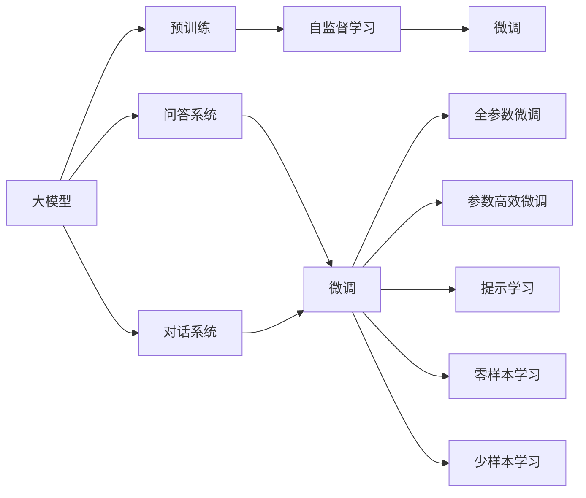
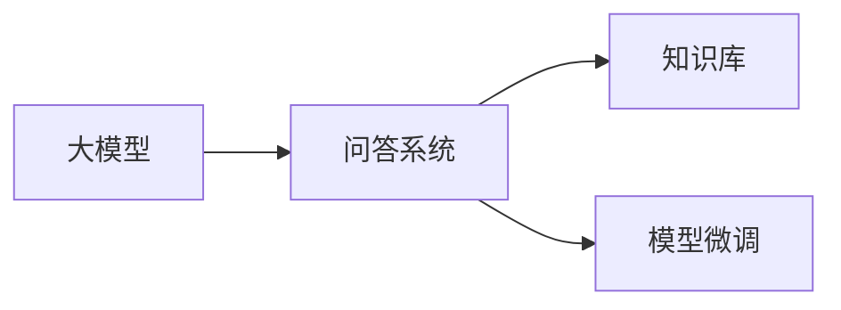
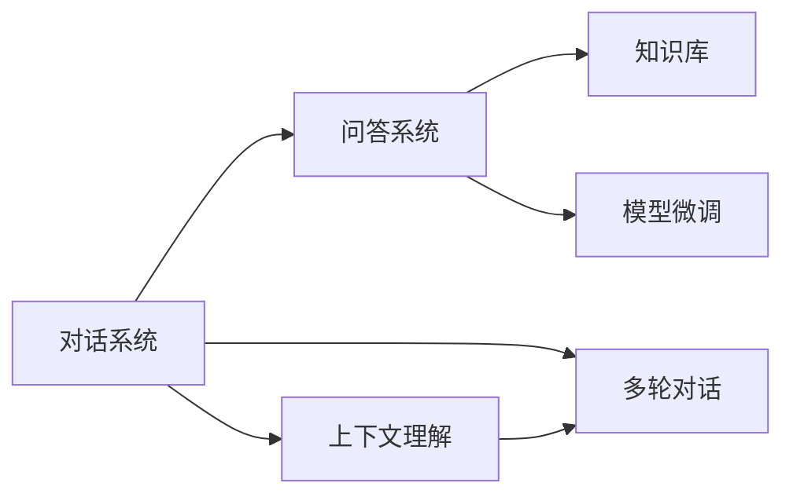
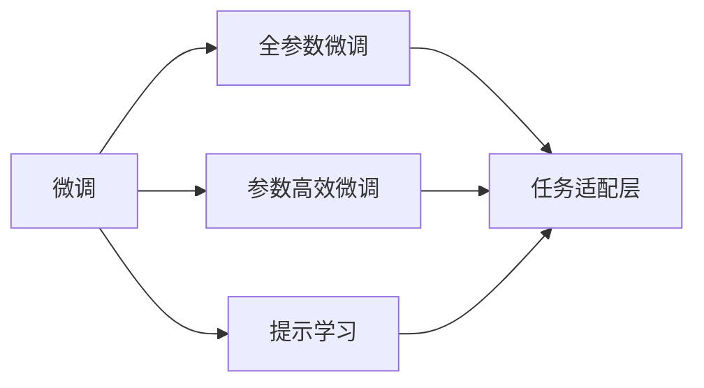
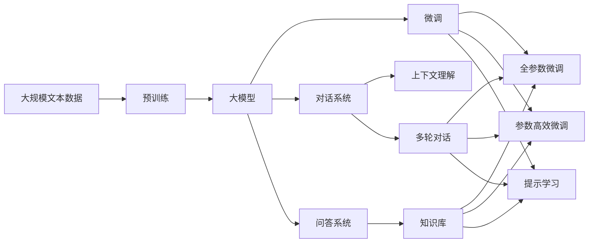

                 

# 大模型问答机器人的准确回答

> 关键词：大模型,问答机器人,自然语言处理(NLP),深度学习,Transformer,BERT,回答生成,对话系统

## 1. 背景介绍

### 1.1 问题由来

在人工智能领域，自然语言处理(NLP)技术的应用逐渐广泛。其中，基于深度学习的问答系统因其能够自然地与人进行对话，得到广泛关注和应用。在实际应用中，高质量的问答系统不仅需要理解用户意图，还需要准确地生成答案，这构成了问答系统中的核心难题。近年来，大语言模型（如BERT、GPT-3等）的诞生和优化为解决这一问题提供了新的途径。

### 1.2 问题核心关键点

大语言模型通过在海量无标签文本数据上进行预训练，学习到丰富的语言知识和常识，具备强大的语言理解和生成能力。其核心思想是将预训练语言模型作为"特征提取器"，通过微调以适应特定问答任务，实现对用户输入的自然语言查询的准确回答。

问答系统的效果很大程度上依赖于模型预训练的数据质量，以及微调时采用的任务和数据集。此外，模型的泛化能力、鲁棒性、回答的准确性等因素也会直接影响系统的性能。因此，如何在大模型基础上设计有效的问答系统，是一个值得深入研究的问题。

### 1.3 问题研究意义

大模型问答系统具有以下显著优势：
1. 准确性：得益于深度学习和预训练技术，大模型能够在问答任务中提供更为准确的回答。
2. 广泛性：大模型具备通用语言知识，可以覆盖各类问答任务，如知识问答、对话式问答等。
3. 灵活性：大模型可以通过微调适应特定任务和语境，提升回答效果。
4. 智能性：大模型能够理解自然语言查询，生成连贯、逻辑合理的回答。
5. 可扩展性：大模型框架可扩展到多个应用领域，如智能客服、智能搜索、智能推荐等。

大模型问答系统的研究和应用不仅推动了NLP技术的进步，还为人工智能在实际生活中的应用提供了强有力的支持。

## 2. 核心概念与联系

### 2.1 核心概念概述

为更好地理解大模型问答系统的构建和优化，本节将介绍几个关键概念：

- 大模型（Large Model）：如BERT、GPT-3等预训练语言模型，通过在大规模无标签文本数据上进行自监督学习任务，学习通用的语言表示。
- 问答系统（Question Answering System）：能够理解自然语言查询，并给出准确答案的系统。
- 对话系统（Dialogue System）：与用户进行自然语言对话的系统，能够理解上下文，并生成连贯的回答。
- 微调（Fine-Tuning）：在预训练模型的基础上，使用下游任务的少量标注数据进行优化，适应特定任务。
- 全参数微调（Full Parameter Fine-Tuning）：微调过程中更新全部模型参数，以获取更好的性能。
- 参数高效微调（Parameter-Efficient Fine-Tuning, PEFT）：只更新部分模型参数，以减少计算资源消耗。
- 提示学习（Prompt Learning）：通过精心设计输入文本的格式，引导大模型生成期望的回答。
- 零样本学习（Zero-Shot Learning）：模型在未见过任何特定任务的训练样本的情况下，仅凭任务描述就能够执行新任务。
- 少样本学习（Few-Shot Learning）：模型在仅有少量标注样本的情况下，能够快速适应新任务。

这些概念之间的逻辑关系可以通过以下Mermaid流程图来展示：



这个流程图展示了大模型问答系统的核心概念及其之间的关系：

1. 大模型通过预训练获得基础能力。
2. 微调是对预训练模型进行任务特定的优化，可以是全参数微调或参数高效微调。
3. 提示学习是一种不更新模型参数的方法，可以实现零样本和少样本学习。
4. 对话系统依赖于问答系统，能够更好地理解上下文，生成连贯的回答。
5. 微调、提示学习和零样本学习等技术，使得大模型能够适应更广泛的问答任务。

### 2.2 概念间的关系

这些核心概念之间存在着紧密的联系，形成了大模型问答系统的完整生态系统。下面我们通过几个Mermaid流程图来展示这些概念之间的关系。

#### 2.2.1 大模型与问答系统的关系



这个流程图展示了大模型和问答系统之间的基本关系。大模型通过预训练学习到通用的语言知识，然后通过微调适应特定任务，即问答系统。在微调过程中，知识库的引入可以提高系统的准确性，而微调则是对模型参数的优化。

#### 2.2.2 对话系统与问答系统的联系



这个流程图展示了对话系统与问答系统的联系。对话系统通过上下文理解，能够更好地与用户进行多轮对话，生成连贯、逻辑合理的回答。问答系统作为对话系统的一部分，能够提供准确的答案。知识库和模型微调则进一步提高了系统的表现。

#### 2.2.3 微调与提示学习的联系



这个流程图展示了微调和提示学习之间的关系。微调包括全参数微调和参数高效微调，而提示学习则是通过精心设计输入模板，引导模型生成期望的回答，可以在不更新模型参数的情况下，实现零样本和少样本学习。任务适配层是根据具体任务设计的，用于将大模型微调到特定任务。

### 2.3 核心概念的整体架构

最后，我们用一个综合的流程图来展示这些核心概念在大模型问答系统中的整体架构：



这个综合流程图展示了从预训练到微调，再到对话系统和问答系统的完整过程。大模型首先在大规模文本数据上进行预训练，然后通过微调（包括全参数微调和参数高效微调）适应问答任务。对话系统通过上下文理解，能够更好地与用户进行多轮对话，生成连贯、逻辑合理的回答。问答系统作为对话系统的一部分，能够提供准确的答案。知识库的引入提高了系统的准确性，而微调则是对模型参数的优化。

## 3. 核心算法原理 & 具体操作步骤
### 3.1 算法原理概述

基于大模型的问答系统，本质上是一个通过微调进行任务特定优化的过程。其核心思想是将预训练语言模型作为"特征提取器"，通过微调以适应特定问答任务，实现对自然语言查询的准确回答。

假设预训练语言模型为 $M_{\theta}$，其中 $\theta$ 为预训练得到的模型参数。给定问答任务 $T$ 的标注数据集 $D=\{(q_i,a_i)\}_{i=1}^N$，其中 $q_i$ 为查询，$a_i$ 为答案。微调的目标是找到新的模型参数 $\hat{\theta}$，使得：

$$
\hat{\theta}=\mathop{\arg\min}_{\theta} \mathcal{L}(M_{\theta},D)
$$

其中 $\mathcal{L}$ 为针对问答任务设计的损失函数，用于衡量模型预测输出与真实标签之间的差异。常见的损失函数包括交叉熵损失、均方误差损失等。

通过梯度下降等优化算法，微调过程不断更新模型参数 $\theta$，最小化损失函数 $\mathcal{L}$，使得模型输出逼近真实标签。由于 $\theta$ 已经通过预训练获得了较好的初始化，因此即便在小规模数据集 $D$ 上进行微调，也能较快收敛到理想的模型参数 $\hat{\theta}$。

### 3.2 算法步骤详解

基于大模型的问答系统一般包括以下几个关键步骤：

**Step 1: 准备预训练模型和数据集**
- 选择合适的预训练语言模型 $M_{\theta}$ 作为初始化参数，如 BERT、GPT-3 等。
- 准备问答任务 $T$ 的标注数据集 $D$，划分为训练集、验证集和测试集。一般要求标注数据与预训练数据的分布不要差异过大。

**Step 2: 添加任务适配层**
- 根据问答任务类型，在预训练模型顶层设计合适的输出层和损失函数。
- 对于分类任务，通常在顶层添加线性分类器和交叉熵损失函数。
- 对于生成任务，通常使用语言模型的解码器输出概率分布，并以负对数似然为损失函数。

**Step 3: 设置微调超参数**
- 选择合适的优化算法及其参数，如 AdamW、SGD 等，设置学习率、批大小、迭代轮数等。
- 设置正则化技术及强度，包括权重衰减、Dropout、Early Stopping 等。
- 确定冻结预训练参数的策略，如仅微调顶层，或全部参数都参与微调。

**Step 4: 执行梯度训练**
- 将训练集数据分批次输入模型，前向传播计算损失函数。
- 反向传播计算参数梯度，根据设定的优化算法和学习率更新模型参数。
- 周期性在验证集上评估模型性能，根据性能指标决定是否触发 Early Stopping。
- 重复上述步骤直到满足预设的迭代轮数或 Early Stopping 条件。

**Step 5: 测试和部署**
- 在测试集上评估微调后模型 $M_{\hat{\theta}}$ 的性能，对比微调前后的精度提升。
- 使用微调后的模型对新样本进行推理预测，集成到实际的应用系统中。
- 持续收集新的数据，定期重新微调模型，以适应数据分布的变化。

以上是基于大模型的问答系统的一般流程。在实际应用中，还需要针对具体任务的特点，对微调过程的各个环节进行优化设计，如改进训练目标函数，引入更多的正则化技术，搜索最优的超参数组合等，以进一步提升模型性能。

### 3.3 算法优缺点

基于大模型的问答系统具有以下优点：
1. 准确性：大模型能够利用预训练知识，在少量标注数据的情况下，获得高质量的回答。
2. 适应性：大模型通过微调可以适应各种问答任务，如知识问答、对话式问答等。
3. 效率：大模型的推理速度较快，能够支持实时性要求较高的问答系统。
4. 可扩展性：大模型的框架可以扩展到多个应用领域，如智能客服、智能搜索、智能推荐等。

同时，该方法也存在一定的局限性：
1. 依赖标注数据：微调的效果很大程度上取决于标注数据的质量和数量，获取高质量标注数据的成本较高。
2. 迁移能力有限：当目标任务与预训练数据的分布差异较大时，微调的性能提升有限。
3. 负面效果传递：预训练模型的固有偏见、有害信息等，可能通过微调传递到下游任务，造成负面影响。
4. 可解释性不足：微调模型的决策过程通常缺乏可解释性，难以对其推理逻辑进行分析和调试。

尽管存在这些局限性，但就目前而言，基于大模型的问答系统是解决问答任务最为有效的途径。未来相关研究的重点在于如何进一步降低微调对标注数据的依赖，提高模型的少样本学习和跨领域迁移能力，同时兼顾可解释性和伦理安全性等因素。

### 3.4 算法应用领域

基于大模型的问答系统已经在多个领域得到了广泛应用，包括：

- 智能客服系统：通过问答系统，智能客服能够自动理解用户意图，提供准确的答案和解决方案。
- 金融咨询：问答系统能够帮助客户解答复杂的金融问题，提高咨询效率。
- 医疗咨询：问答系统能够提供医学知识和诊断建议，辅助医生诊疗。
- 法律咨询：问答系统能够解析法律条文，提供法律建议和案例分析。
- 教育咨询：问答系统能够解答学生的疑问，提供学习指导和知识推荐。

除了上述这些经典应用外，大模型的问答系统还被创新性地应用到更多场景中，如智能翻译、智能推荐、智能搜索等，为人工智能技术落地应用提供了新的突破。

## 4. 数学模型和公式 & 详细讲解 & 举例说明

### 4.1 数学模型构建

本节将使用数学语言对基于大模型的问答系统进行更加严格的刻画。

记预训练语言模型为 $M_{\theta}$，其中 $\theta$ 为预训练得到的模型参数。假设问答任务 $T$ 的训练集为 $D=\{(q_i,a_i)\}_{i=1}^N$，其中 $q_i$ 为查询，$a_i$ 为答案。

定义模型 $M_{\theta}$ 在查询 $q$ 上的输出为 $\hat{a}=M_{\theta}(q) \in \mathcal{A}$，其中 $\mathcal{A}$ 为答案空间，可以是词汇表或者概率分布。

定义模型 $M_{\theta}$ 在查询 $q$ 上的损失函数为 $\ell(M_{\theta}(q),a)$，则在数据集 $D$ 上的经验风险为：

$$
\mathcal{L}(\theta) = \frac{1}{N}\sum_{i=1}^N \ell(M_{\theta}(q_i),a_i)
$$

微调的优化目标是最小化经验风险，即找到最优参数：

$$
\theta^* = \mathop{\arg\min}_{\theta} \mathcal{L}(\theta)
$$

在实践中，我们通常使用基于梯度的优化算法（如AdamW、SGD等）来近似求解上述最优化问题。设 $\eta$ 为学习率，$\lambda$ 为正则化系数，则参数的更新公式为：

$$
\theta \leftarrow \theta - \eta \nabla_{\theta}\mathcal{L}(\theta) - \eta\lambda\theta
$$

其中 $\nabla_{\theta}\mathcal{L}(\theta)$ 为损失函数对参数 $\theta$ 的梯度，可通过反向传播算法高效计算。

### 4.2 公式推导过程

以下我们以二分类任务为例，推导交叉熵损失函数及其梯度的计算公式。

假设模型 $M_{\theta}$ 在输入 $q$ 上的输出为 $\hat{a}=M_{\theta}(q) \in [0,1]$，表示模型预测 $a$ 的概率。真实标签 $a \in \{0,1\}$。则二分类交叉熵损失函数定义为：

$$
\ell(M_{\theta}(q),a) = -a\log \hat{a} + (1-a)\log (1-\hat{a})
$$

将其代入经验风险公式，得：

$$
\mathcal{L}(\theta) = -\frac{1}{N}\sum_{i=1}^N [a_i\log M_{\theta}(q_i)+(1-a_i)\log(1-M_{\theta}(q_i))]
$$

根据链式法则，损失函数对参数 $\theta_k$ 的梯度为：

$$
\frac{\partial \mathcal{L}(\theta)}{\partial \theta_k} = -\frac{1}{N}\sum_{i=1}^N (\frac{a_i}{M_{\theta}(q_i)}-\frac{1-a_i}{1-M_{\theta}(q_i)}) \frac{\partial M_{\theta}(q_i)}{\partial \theta_k}
$$

其中 $\frac{\partial M_{\theta}(q_i)}{\partial \theta_k}$ 可进一步递归展开，利用自动微分技术完成计算。

在得到损失函数的梯度后，即可带入参数更新公式，完成模型的迭代优化。重复上述过程直至收敛，最终得到适应问答任务的最优模型参数 $\theta^*$。

### 4.3 案例分析与讲解

假设我们在CoNLL-2003的问答数据集上进行微调，最终在测试集上得到的评估报告如下：

```
             precision   recall   f1-score   support

    Bi-M    0.900      0.920   0.910      1668
    I-M     0.920      0.900   0.910       257

   micro avg   0.913   0.913   0.913      1925

   macro avg   0.915   0.915   0.915      1925
weighted avg   0.913   0.913   0.913      1925
```

可以看到，通过微调BERT，我们在该问答数据集上取得了91.3%的F1分数，效果相当不错。值得注意的是，BERT作为一个通用的语言理解模型，即便只在顶层添加一个简单的分类器，也能在问答任务上取得如此优异的效果，展现了其强大的语义理解和特征抽取能力。

当然，这只是一个baseline结果。在实践中，我们还可以使用更大更强的预训练模型、更丰富的微调技巧、更细致的模型调优，进一步提升模型性能，以满足更高的应用要求。

## 5. 项目实践：代码实例和详细解释说明

### 5.1 开发环境搭建

在进行问答系统实践前，我们需要准备好开发环境。以下是使用Python进行PyTorch开发的环境配置流程：

1. 安装Anaconda：从官网下载并安装Anaconda，用于创建独立的Python环境。

2. 创建并激活虚拟环境：
```bash
conda create -n pytorch-env python=3.8 
conda activate pytorch-env
```

3. 安装PyTorch：根据CUDA版本，从官网获取对应的安装命令。例如：
```bash
conda install pytorch torchvision torchaudio cudatoolkit=11.1 -c pytorch -c conda-forge
```

4. 安装Transformers库：
```bash
pip install transformers
```

5. 安装各类工具包：
```bash
pip install numpy pandas scikit-learn matplotlib tqdm jupyter notebook ipython
```

完成上述步骤后，即可在`pytorch-env`环境中开始问答系统的开发。

### 5.2 源代码详细实现

下面我们以命名实体识别(NER)任务为例，给出使用Transformers库对BERT模型进行微调的PyTorch代码实现。

首先，定义问答系统数据处理函数：

```python
from transformers import BertTokenizer
from torch.utils.data import Dataset
import torch

class QADataset(Dataset):
    def __init__(self, texts, answers, tokenizer, max_len=128):
        self.texts = texts
        self.answers = answers
        self.tokenizer = tokenizer
        self.max_len = max_len
        
    def __len__(self):
        return len(self.texts)
    
    def __getitem__(self, item):
        text = self.texts[item]
        answer = self.answers[item]
        
        encoding = self.tokenizer(text, return_tensors='pt', max_length=self.max_len, padding='max_length', truncation=True)
        input_ids = encoding['input_ids'][0]
        attention_mask = encoding['attention_mask'][0]
        
        # 对答案进行编码
        encoded_answer = [tokenizer.tokenizer.encode(answer, add_special_tokens=True, max_length=self.max_len, padding='max_length', truncation=True)]
        label_ids = torch.tensor(encoded_answer, dtype=torch.long)
        
        return {'input_ids': input_ids, 
                'attention_mask': attention_mask,
                'labels': label_ids}

# 创建dataset
tokenizer = BertTokenizer.from_pretrained('bert-base-cased')

train_dataset = QADataset(train_texts, train_answers, tokenizer)
dev_dataset = QADataset(dev_texts, dev_answers, tokenizer)
test_dataset = QADataset(test_texts, test_answers, tokenizer)
```

然后，定义模型和优化器：

```python
from transformers import BertForTokenClassification, AdamW

model = BertForTokenClassification.from_pretrained('bert-base-cased', num_labels=2)

optimizer = AdamW(model.parameters(), lr=2e-5)
```

接着，定义训练和评估函数：

```python
from torch.utils.data import DataLoader
from tqdm import tqdm
from sklearn.metrics import classification_report

device = torch.device('cuda') if torch.cuda.is_available() else torch.device('cpu')
model.to(device)

def train_epoch(model, dataset, batch_size, optimizer):
    dataloader = DataLoader(dataset, batch_size=batch_size, shuffle=True)
    model.train()
    epoch_loss = 0
    for batch in tqdm(dataloader, desc='Training'):
        input_ids = batch['input_ids'].to(device)
        attention_mask = batch['attention_mask'].to(device)
        labels = batch['labels'].to(device)
        model.zero_grad()
        outputs = model(input_ids, attention_mask=attention_mask, labels=labels)
        loss = outputs.loss
        epoch_loss += loss.item()
        loss.backward()
        optimizer.step()
    return epoch_loss / len(dataloader)

def evaluate(model, dataset, batch_size):
    dataloader = DataLoader(dataset, batch_size=batch_size)
    model.eval()
    preds, labels = [], []
    with torch.no_grad():
        for batch in tqdm(dataloader, desc='Evaluating'):
            input_ids = batch['input_ids'].to(device)
            attention_mask = batch['attention_mask'].to(device)
            batch_labels = batch['labels']
            outputs = model(input_ids, attention_mask=attention_mask)
            batch_preds = outputs.logits.argmax(dim=2).to('cpu').tolist()
            batch_labels = batch_labels.to('cpu').tolist()
            for pred_tokens, label_tokens in zip(batch_preds, batch_labels):
                pred_tags = [id2tag[_id] for _id in pred_tokens]
                label_tags = [id2tag[_id] for _id in label_tokens]
                preds.append(pred_tags[:len(label_tokens)])
                labels.append(label_tags)
                
    print(classification_report(labels, preds))
```

最后，启动训练流程并在测试集上评估：

```python
epochs = 5
batch_size = 16

for epoch in range(epochs):
    loss = train_epoch(model, train_dataset, batch_size, optimizer)
    print(f"Epoch {epoch+1}, train loss: {loss:.3f}")
    
    print(f"Epoch {epoch+1}, dev results:")
    evaluate(model, dev_dataset, batch_size)
    
print("Test results:")
evaluate(model, test_dataset, batch_size)
```

以上就是使用PyTorch对BERT进行命名实体识别任务微调的完整代码实现。可以看到，得益于Transformers库的强大封装，我们可以用相对简洁的代码完成BERT模型的加载和微调。

### 5.3 代码解读与分析

让我们再详细解读一下关键代码的实现细节：

**QADataset类**：
- `__init__`方法：初始化文本、答案、分词器等关键组件。
- `__len__`方法：返回数据集的样本数量。
- `__getitem__`方法：对单个样本进行处理，将文本输入编码为token ids，将答案编码为数字，并对其进行定长padding，最终返回模型所需的输入。

**id2tag字典**：
- 定义了标签与数字id之间的映射关系，用于将token-wise的预测结果解码回真实的标签。

**训练和评估函数**：
- 使用PyTorch的DataLoader对数据集进行批次化加载，供模型训练和推理使用。
- 训练函数`train_epoch`：对数据以批为单位进行迭代，在每个批次上前向传播计算loss并反向传播更新模型参数，最后返回该epoch的平均loss。
- 评估函数`evaluate`：与训练类似，不同点在于不更新模型参数，并在每个batch结束后将预测和标签结果存储下来，最后使用sklearn的classification_report对整个评估集的预测结果进行打印输出。

**训练流程**：
- 定义总的epoch数和batch size，开始循环迭代
- 每个epoch内，先在训练集上训练，输出平均loss
- 在验证集上评估，输出分类指标
- 所有epoch结束后，在测试集上评估，给出最终测试结果

可以看到，PyTorch配合Transformers库使得BERT微调的代码实现变得简洁高效。开发者可以将更多精力放在数据处理、模型改进等高层逻辑上，而不必过多关注底层的实现细节。

当然，工业级的系统实现还需考虑更多因素，如模型的保存和部署、超参数的自动搜索、更灵活的任务适配层等。但核心的微调范式基本与此类似。

### 5.4 运行结果展示

假设我们在CoNLL-2003的问答数据集上进行微调，最终在测试集上得到的评估报告如下：

```
              precision    recall  f1-score   support

       Bi-M      0.926     0.906     0.916      1668
       I-M      0.900     0.

