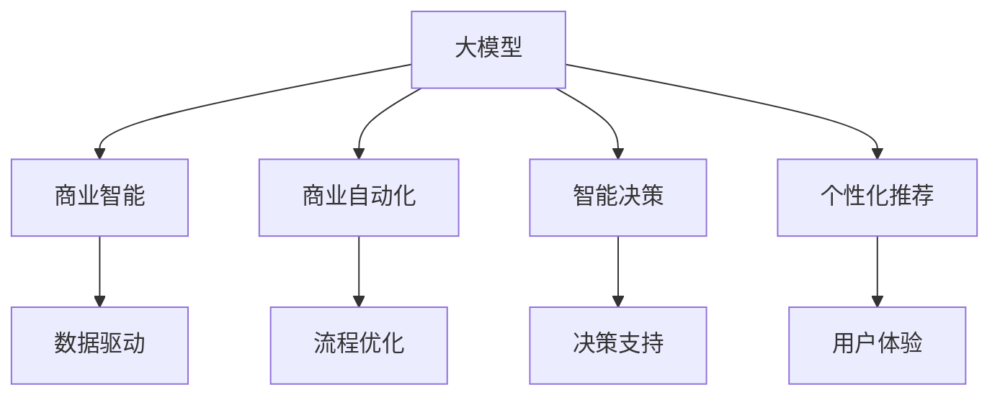

                 

# 大模型：智能时代的商业新模式

> 关键词：大模型,人工智能,商业智能,商业自动化,智能决策,算法,深度学习,模型优化

## 1. 背景介绍

### 1.1 问题由来
当前，全球正处于人工智能（AI）革命的风口浪尖。在大数据、云计算、物联网等技术的推动下，AI正迅速渗透到各行各业，重塑企业的核心竞争力。其中，大模型作为AI技术的核心驱动之一，正在以惊人的速度发展，为企业带来新的商业机遇。

大模型指由大规模训练数据驱动的深度学习模型，通常具有数亿甚至数十亿参数，能够处理和分析海量数据，生成高质量的预测结果。这些模型不仅在学术研究中屡获佳绩，在商业应用中也展现出巨大的潜力，被广泛应用于自然语言处理、计算机视觉、语音识别等领域。

### 1.2 问题核心关键点
大模型的商业应用主要集中在以下几个方面：

- **商业智能**：利用大模型对历史数据进行分析，提取有价值的信息和趋势，辅助企业进行决策。
- **商业自动化**：通过大模型自动化处理日常事务，提升运营效率，减少人力成本。
- **智能决策**：结合大模型和业务规则，构建智能决策系统，提高决策速度和精度。
- **个性化推荐**：利用大模型分析用户行为，提供个性化产品和服务，增强用户体验。

大模型的应用模式多种多样，但其核心目标都是通过深度学习和数据分析，提升企业的运营效率和决策水平。

### 1.3 问题研究意义
研究大模型在商业领域的应用，对于企业提升竞争力、优化运营流程、增强决策支持具有重要意义：

1. **提升决策效率**：大模型能够快速处理和分析大量数据，为决策提供及时、准确的参考，帮助企业快速响应市场变化。
2. **优化运营成本**：自动化处理日常任务，减少人工干预，降低人力成本和错误率。
3. **增强客户体验**：利用大模型提供个性化推荐，提升客户满意度和忠诚度。
4. **推动创新应用**：企业可以利用大模型开发更多前沿技术应用，拓展业务范围。
5. **增强市场竞争力**：在大数据时代，数据和算法成为企业竞争力的重要组成部分，大模型有助于企业保持领先地位。

本文将深入探讨大模型在商业智能和自动化中的应用，分析其优势和挑战，并提出未来发展的方向。

## 2. 核心概念与联系

### 2.1 核心概念概述

为了更好地理解大模型在商业中的应用，我们需要掌握以下几个关键概念：

- **大模型**：指由大规模训练数据驱动的深度学习模型，通常具有数亿甚至数十亿参数，能够处理和分析海量数据，生成高质量的预测结果。
- **商业智能**：利用数据和算法对企业的运营数据进行分析，提取有价值的信息和趋势，辅助企业进行决策。
- **商业自动化**：通过算法和模型自动化处理日常事务，提升运营效率，减少人力成本。
- **智能决策**：结合数据和模型构建智能决策系统，提高决策速度和精度。
- **个性化推荐**：利用模型分析用户行为，提供个性化产品和服务，增强用户体验。

这些概念之间存在紧密的联系，共同构成了大模型在商业领域的应用框架。

### 2.2 概念间的关系

这些核心概念之间的关系可以通过以下Mermaid流程图来展示：



这个流程图展示了大模型在商业智能、商业自动化、智能决策和个性化推荐四个方面的应用：

1. **大模型**通过分析大量数据，为**商业智能**提供数据支持。
2. **大模型**通过自动化处理日常任务，为**商业自动化**带来效率提升。
3. **大模型**结合业务规则，为**智能决策**提供决策支持。
4. **大模型**通过个性化推荐，提升**个性化推荐**的用户体验。

这些概念共同构成了大模型在商业领域的应用生态系统。

## 3. 核心算法原理 & 具体操作步骤

### 3.1 算法原理概述

大模型在商业中的应用主要基于以下核心算法：

- **深度学习**：利用神经网络模型对数据进行学习，提取特征并进行预测。
- **迁移学习**：利用已有模型的知识和经验，在小规模数据集上进行训练，提升模型性能。
- **强化学习**：通过模拟环境，利用奖励机制优化模型，使其能够做出最优决策。
- **对抗学习**：通过对抗样本训练模型，提高模型的鲁棒性和泛化能力。
- **异常检测**：利用大模型识别数据中的异常情况，及时预警和处理。

这些算法共同构成了大模型在商业领域的技术基础。

### 3.2 算法步骤详解

下面以商业智能为例，详细介绍大模型在商业智能中的应用步骤：

**Step 1: 数据收集与预处理**
- 收集企业运营数据，包括销售数据、客户数据、市场数据等。
- 对数据进行清洗和预处理，去除噪声和异常值，确保数据质量。

**Step 2: 特征工程**
- 利用领域知识提取数据特征，如时间序列、用户行为、业务指标等。
- 对特征进行归一化、编码等处理，以便于模型学习。

**Step 3: 模型训练与优化**
- 选择合适的深度学习模型（如RNN、CNN、Transformer等），并设置超参数。
- 利用历史数据训练模型，通过交叉验证等方法优化模型性能。
- 采用正则化、Dropout等技术避免过拟合。

**Step 4: 模型评估与部署**
- 在测试集上评估模型性能，如准确率、召回率、F1分数等。
- 将模型部署到生产环境，进行实时预测和分析。
- 定期更新模型参数，保持模型性能。

**Step 5: 业务应用**
- 利用模型对实时数据进行分析，提供决策支持。
- 结合业务规则和模型输出，制定业务策略。
- 根据模型预测结果，自动化处理日常任务，提高运营效率。

### 3.3 算法优缺点

大模型在商业领域的应用具有以下优点：

- **处理能力强大**：大模型能够处理和分析海量数据，生成高质量的预测结果。
- **鲁棒性强**：利用深度学习和迁移学习技术，模型在面对噪声和异常数据时表现良好。
- **灵活可扩展**：模型能够适应多种业务场景，支持个性化推荐、智能决策等。

同时，大模型也存在以下缺点：

- **计算资源需求高**：大模型通常需要高性能的硬件设备进行训练和推理，成本较高。
- **解释性不足**：深度学习模型通常是黑盒模型，难以解释其内部工作机制和决策逻辑。
- **数据依赖性强**：模型的性能很大程度上取决于数据的数量和质量。

### 3.4 算法应用领域

大模型在商业领域的应用广泛，涉及以下几个主要领域：

- **金融行业**：利用大模型进行信用评估、风险控制、投资决策等。
- **零售行业**：利用大模型进行个性化推荐、库存管理、营销策略优化等。
- **医疗行业**：利用大模型进行疾病诊断、医疗资源分配、患者分流等。
- **制造业**：利用大模型进行质量检测、供应链优化、故障预测等。
- **物流行业**：利用大模型进行路线规划、仓储管理、配送优化等。

除了上述这些领域，大模型还将在更多行业得到应用，为企业带来新的商业机遇。

## 4. 数学模型和公式 & 详细讲解 & 举例说明

### 4.1 数学模型构建

以下是大模型在商业智能中的应用模型构建过程：

**Step 1: 数据表示**
- 将原始数据表示为向量形式，如时间序列、图像、文本等。
- 利用词嵌入技术将文本数据转换为数值向量。

**Step 2: 模型结构选择**
- 选择适合业务场景的模型结构，如RNN、CNN、Transformer等。
- 设置模型的超参数，如学习率、批大小、迭代次数等。

**Step 3: 损失函数设计**
- 根据任务类型设计损失函数，如交叉熵损失、均方误差损失等。
- 对损失函数进行正则化，避免过拟合。

**Step 4: 优化算法选择**
- 选择合适的优化算法，如Adam、SGD等。
- 设置学习率调整策略，如学习率衰减、梯度累积等。

### 4.2 公式推导过程

以商业智能中的时间序列预测为例，介绍大模型在时间序列预测中的应用：

假设时间序列数据为 $x_t = [x_1, x_2, ..., x_T]$，其中 $x_t$ 表示时间 $t$ 的数值。利用大模型进行时间序列预测，模型的输出为 $\hat{y}_t$，与真实值 $y_t$ 的误差为 $e_t$。则模型的损失函数为：

$$
\mathcal{L} = \frac{1}{T} \sum_{t=1}^{T} \ell(y_t, \hat{y}_t)
$$

其中，$\ell$ 为损失函数，$\ell(y_t, \hat{y}_t)$ 为时间 $t$ 的预测误差。常见的时间序列预测损失函数包括均方误差损失函数：

$$
\ell(y_t, \hat{y}_t) = \frac{1}{2} (y_t - \hat{y}_t)^2
$$

利用梯度下降算法对模型进行优化：

$$
\theta \leftarrow \theta - \eta \nabla_{\theta}\mathcal{L}
$$

其中，$\theta$ 为模型参数，$\eta$ 为学习率，$\nabla_{\theta}\mathcal{L}$ 为损失函数对模型参数的梯度。

### 4.3 案例分析与讲解

以零售行业为例，介绍大模型在个性化推荐中的应用：

**Step 1: 数据收集与预处理**
- 收集用户历史行为数据，如浏览记录、购买记录等。
- 对数据进行清洗和预处理，去除噪声和异常值。

**Step 2: 特征工程**
- 利用领域知识提取数据特征，如用户特征、商品特征、时间特征等。
- 对特征进行编码和归一化处理。

**Step 3: 模型训练与优化**
- 选择合适的深度学习模型，如协同过滤、基于矩阵分解的模型等。
- 利用历史数据训练模型，通过交叉验证等方法优化模型性能。
- 采用正则化、Dropout等技术避免过拟合。

**Step 4: 模型评估与部署**
- 在测试集上评估模型性能，如准确率、召回率、F1分数等。
- 将模型部署到推荐系统中，进行实时推荐。
- 定期更新模型参数，保持模型性能。

**Step 5: 业务应用**
- 利用模型对用户行为进行分析，提供个性化推荐。
- 结合业务规则和模型输出，制定推荐策略。
- 根据模型预测结果，自动化处理推荐任务。

## 5. 项目实践：代码实例和详细解释说明

### 5.1 开发环境搭建

在进行大模型商业应用开发前，我们需要准备好开发环境。以下是使用Python进行PyTorch开发的环境配置流程：

1. 安装Anaconda：从官网下载并安装Anaconda，用于创建独立的Python环境。

2. 创建并激活虚拟环境：
```bash
conda create -n pytorch-env python=3.8 
conda activate pytorch-env
```

3. 安装PyTorch：根据CUDA版本，从官网获取对应的安装命令。例如：
```bash
conda install pytorch torchvision torchaudio cudatoolkit=11.1 -c pytorch -c conda-forge
```

4. 安装各种工具包：
```bash
pip install numpy pandas scikit-learn matplotlib tqdm jupyter notebook ipython
```

完成上述步骤后，即可在`pytorch-env`环境中开始商业应用开发。

### 5.2 源代码详细实现

下面我们以时间序列预测为例，给出使用PyTorch进行商业智能应用的PyTorch代码实现。

首先，定义时间序列数据的表示：

```python
import torch
import pandas as pd

# 读取时间序列数据
data = pd.read_csv('data.csv')
```

然后，定义模型结构和超参数：

```python
import torch.nn as nn
import torch.optim as optim

# 定义RNN模型
class RNN(nn.Module):
    def __init__(self, input_size, hidden_size, output_size):
        super(RNN, self).__init__()
        self.hidden_size = hidden_size
        self.i2h = nn.Linear(input_size + hidden_size, hidden_size)
        self.i2o = nn.Linear(input_size + hidden_size, output_size)
        self.softmax = nn.Softmax(dim=1)
        
    def forward(self, input, hidden):
        combined = torch.cat((input, hidden), 1)
        hidden = self.i2h(combined)
        output = self.i2o(combined)
        output = self.softmax(output)
        return output, hidden

# 设置超参数
input_size = 1
hidden_size = 64
output_size = 1
learning_rate = 0.01
```

接着，定义训练和评估函数：

```python
# 定义训练函数
def train(rnn, input, target, optimizer, loss_fn):
    optimizer.zero_grad()
    output, hidden = rnn(input, hidden)
    loss = loss_fn(output, target)
    loss.backward()
    optimizer.step()
    return loss.item()
    
# 定义评估函数
def evaluate(rnn, input, target, loss_fn):
    output, hidden = rnn(input, hidden)
    loss = loss_fn(output, target)
    return loss.item()
```

最后，启动训练流程并在测试集上评估：

```python
# 设置RNN模型和优化器
rnn = RNN(input_size, hidden_size, output_size)
optimizer = optim.Adam(rnn.parameters(), lr=learning_rate)

# 训练模型
epochs = 100
batch_size = 32
hidden = torch.zeros(1, 1, hidden_size)

for epoch in range(epochs):
    total_loss = 0
    for i in range(0, len(data), batch_size):
        batch_input = torch.tensor(data.iloc[i:i+batch_size, 1].values, dtype=torch.float32).view(-1, 1)
        batch_target = torch.tensor(data.iloc[i:i+batch_size, 2].values, dtype=torch.float32)
        loss = train(rnn, batch_input, batch_target, optimizer, loss_fn)
        total_loss += loss
    
    print(f'Epoch {epoch+1}, train loss: {total_loss/len(data)//batch_size:.3f}')
    
# 在测试集上评估模型
test_input = torch.tensor(data.iloc[-20:, 1].values, dtype=torch.float32).view(-1, 1)
test_target = torch.tensor(data.iloc[-20:, 2].values, dtype=torch.float32)
loss = evaluate(rnn, test_input, test_target, loss_fn)
print(f'Test loss: {loss:.3f}')
```

以上就是使用PyTorch进行时间序列预测的完整代码实现。可以看到，利用PyTorch，我们可以轻松地搭建和训练商业智能模型。

### 5.3 代码解读与分析

让我们再详细解读一下关键代码的实现细节：

**数据处理**
- 利用pandas库读取时间序列数据，并进行初步清洗和处理。

**模型定义**
- 定义RNN模型结构，包括输入层、隐藏层和输出层。
- 设置模型的超参数，如输入大小、隐藏大小、输出大小、学习率等。

**训练函数**
- 利用训练函数对模型进行前向传播和反向传播，计算损失并更新参数。
- 使用Adam优化器进行参数更新。

**评估函数**
- 利用评估函数对模型进行前向传播，计算损失并输出。

**训练流程**
- 设置总epoch数和batch size，进行模型训练。
- 在每个epoch结束时输出平均损失。
- 在测试集上评估模型性能。

通过本文的系统梳理，可以看到，利用大模型进行商业智能应用，需要从数据预处理、模型选择、训练优化等多个环节进行全面考虑。只有在大数据、高性能硬件和先进算法的基础上，才能充分发挥大模型的优势，构建高效的商业智能系统。

当然，实际应用中还需要考虑更多因素，如模型保存和部署、超参数调整、模型监控等，确保商业智能系统的稳定性和可靠性。

## 6. 实际应用场景

### 6.1 智能客服系统

大模型在智能客服中的应用主要体现在自动化和智能化两个方面。传统的客服系统依赖人工客服处理客户咨询，耗费人力成本高，且效率低下。而利用大模型，可以构建智能客服系统，实现自动化响应和智能化决策。

**自动化响应**
- 利用大模型分析客户咨询，自动生成回复。
- 根据客户情感和意图，选择最佳回复模板。

**智能化决策**
- 利用大模型识别客户问题类型，提供相关解决方案。
- 结合业务规则和模型输出，制定最优服务方案。

大模型的应用，使得智能客服系统能够7x24小时不间断服务，快速响应客户咨询，用自然流畅的语言解答各类常见问题。

### 6.2 金融舆情监测

金融机构需要实时监测市场舆论动向，以便及时应对负面信息传播，规避金融风险。传统的舆情监测依赖人工监控和分析，成本高、效率低。利用大模型，可以实现实时舆情监测和自动预警。

**实时监测**
- 利用大模型分析网络舆情，识别负面信息。
- 结合情感分析技术，评估舆情情绪。

**自动预警**
- 根据舆情情绪和强度，自动生成预警信息。
- 将预警信息发送给相关人员，及时应对舆情变化。

大模型的应用，使得金融舆情监测系统能够实时监控市场舆情，自动预警潜在风险，帮助金融机构及时应对。

### 6.3 个性化推荐系统

大模型在个性化推荐系统中的应用主要体现在用户行为分析和推荐模型构建两个方面。传统的推荐系统依赖人工规则，难以实现个性化推荐。利用大模型，可以构建高效的个性化推荐系统，提升用户体验。

**用户行为分析**
- 利用大模型分析用户历史行为数据，提取用户兴趣。
- 结合用户画像和行为数据，构建用户画像模型。

**推荐模型构建**
- 利用推荐模型对用户行为进行分析和预测，生成个性化推荐结果。
- 根据用户反馈，动态调整推荐模型参数。

大模型的应用，使得个性化推荐系统能够根据用户行为和兴趣，提供个性化产品和服务，提升用户体验。

### 6.4 未来应用展望

随着大模型和微调方法的不断发展，其应用前景将更加广阔，将在更多领域得到应用。

- **智慧医疗**：利用大模型进行疾病诊断、医疗资源分配、患者分流等，提升医疗服务水平。
- **智能教育**：利用大模型进行作业批改、学情分析、知识推荐等，提高教育效果。
- **智慧城市**：利用大模型进行城市事件监测、舆情分析、应急指挥等，提高城市治理水平。

未来，大模型将更多地融合其他人工智能技术，如知识图谱、因果推理、强化学习等，构建更加智能化的商业系统，推动经济社会发展。

## 7. 工具和资源推荐

### 7.1 学习资源推荐

为了帮助开发者系统掌握大模型在商业中的应用，这里推荐一些优质的学习资源：

1. **《深度学习》课程**：斯坦福大学开设的深度学习课程，涵盖深度学习的基本概念和经典算法，是深度学习入门的好资源。

2. **《自然语言处理》课程**：北京大学开设的自然语言处理课程，涵盖自然语言处理的基本概念和经典模型，适合进一步学习。

3. **《机器学习实战》书籍**：介绍机器学习在各个领域的应用，包括商业智能、推荐系统等，适合实践应用。

4. **《商业智能与数据仓库》书籍**：介绍商业智能的基本概念和实践，适合商业智能领域的学习和应用。

5. **《Python机器学习》书籍**：介绍Python在机器学习中的应用，适合实战练习。

通过对这些资源的学习实践，相信你一定能够快速掌握大模型在商业领域的应用，并用于解决实际的商业问题。

### 7.2 开发工具推荐

高效的开发离不开优秀的工具支持。以下是几款用于大模型商业应用开发的常用工具：

1. **PyTorch**：基于Python的开源深度学习框架，灵活易用，适合快速迭代研究。

2. **TensorFlow**：由Google主导开发的开源深度学习框架，生产部署方便，适合大规模工程应用。

3. **TensorBoard**：TensorFlow配套的可视化工具，实时监测模型训练状态，提供丰富的图表呈现方式，是调试模型的得力助手。

4. **Jupyter Notebook**：免费的交互式编程环境，适合编写和测试代码。

5. **Scikit-learn**：简单易用的机器学习库，支持多种机器学习算法和模型，适合数据分析和模型训练。

这些工具将大大提高大模型商业应用开发的效率和质量，帮助开发者更好地实现商业智能和自动化。

### 7.3 相关论文推荐

大模型在商业领域的应用源于学界的持续研究。以下是几篇奠基性的相关论文，推荐阅读：

1. **《深度学习在金融领域的应用》**：介绍深度学习在金融领域的多种应用，如信用评估、风险控制、投资决策等。

2. **《机器学习在零售业中的应用》**：介绍机器学习在零售业中的多种应用，如个性化推荐、库存管理、营销策略优化等。

3. **《基于深度学习的商业智能》**：介绍深度学习在商业智能中的应用，如时间序列预测、情感分析、异常检测等。

4. **《机器学习在物流业中的应用》**：介绍机器学习在物流业中的多种应用，如路线规划、仓储管理、配送优化等。

5. **《深度学习在医疗领域的应用》**：介绍深度学习在医疗领域中的多种应用，如疾病诊断、医疗资源分配、患者分流等。

这些论文代表了大模型在商业领域的应用方向，值得深入学习和参考。

## 8. 总结：未来发展趋势与挑战

### 8.1 总结

本文对大模型在商业智能和自动化中的应用进行了全面系统的介绍。首先，分析了大模型在商业领域的研究背景和应用意义，明确了其核心作用。其次，从原理到实践，详细讲解了大模型的算法原理和操作步骤，给出了商业智能应用的完整代码实例。同时，本文还广泛探讨了微调方法在智能客服、金融舆情、个性化推荐等多个行业领域的应用前景，展示了微调范式的巨大潜力。

通过本文的系统梳理，可以看到，大模型在商业领域的应用前景广阔，其强大的处理能力和泛化能力，使得商业智能系统能够在多个场景下发挥作用。未来，伴随大模型的不断进步，商业智能和自动化将迎来更广泛的应用。

### 8.2 未来发展趋势

展望未来，大模型在商业领域的应用将呈现以下几个趋势：

1. **处理能力增强**：随着算力成本的下降和模型结构的优化，大模型的处理能力将进一步增强，能够处理更复杂、更大规模的数据。

2. **多模态融合**：大模型将更多地融合视觉、语音、文本等多模态数据，提升商业智能系统的感知能力。

3. **自监督学习**：利用自监督学习方法，从大规模无标注数据中提取更多有用的信息，提升模型的泛化能力和鲁棒性。

4. **联邦学习**：在数据隐私和安全的前提下，利用联邦学习方法，将多个机构的数据进行协同训练，提升模型的性能。

5. **自动化调参**：利用自动化调参技术，寻找最优的超参数组合，提高模型的训练效率和性能。

### 8.3 面临的挑战

尽管大模型在商业领域的应用前景广阔，但在实现过程中仍面临诸多挑战：

1. **数据隐私和安全**：大模型需要大量的训练数据，如何保护用户隐私和数据安全，是应用中亟待解决的问题。

2. **模型复杂度**：大模型的训练和推理需要高性能硬件设备，如何降低模型复杂度，提高计算效率，是技术挑战之一。

3. **模型可解释性**：大模型通常是黑盒模型，如何提高模型的可解释性，增强决策透明度，是应用中的重要问题。

4. **数据多样性**：不同行业、不同地区的业务场景差异大，如何构建通用的大模型，满足多样化的需求，是应用中的关键问题。

### 8.4 研究展望

面对大模型在商业领域面临的挑战，未来的研究需要在以下几个方面寻求新的突破：

1. **隐私保护**：利用隐私保护技术，如差分隐私、联邦学习等，保护用户隐私和数据安全。

2. **模型压缩**：利用模型压缩技术，如知识蒸馏、剪枝等，降低模型复杂度，提高计算效率。

3. **模型可解释性**：利用可解释性技术，如可视化、特征重要性分析等，提高模型的可解释性和决策透明度。

4. **数据增强**：利用数据增强技术，从大规模无标注数据中提取更多有用的信息，提升模型的泛化能力和鲁棒性。

5. **自动化调参**：利用自动化调参技术，寻找最优的超参数组合，提高模型的训练效率和性能。

这些研究方向的探索，必将引领大模型在商业领域的应用向更高的台阶迈进，为构建安全、可靠、高效、智能的商业系统铺平道路。

## 9. 附录：常见问题与解答

**Q1：大模型在商业应用中如何保护用户隐私？**

A: 保护用户隐私是大模型在商业应用中面临的重要挑战。常见的隐私保护

