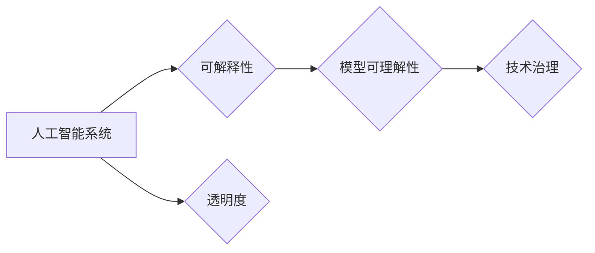

> 人工智能, 生态系统透明度, 可解释性, 伦理, 信任, 模型可理解性, 技术治理

# 提高AI生态系统透明度的重要性

随着人工智能技术的飞速发展，AI系统正在渗透到我们生活的方方面面。从医疗诊断到金融决策，从智能助手到自动驾驶，AI的应用几乎无处不在。然而，随着AI系统变得越来越复杂，它们背后的决策过程变得越来越难以理解，这引发了对AI生态系统透明度的高度关注。

## 1. 背景介绍

### 1.1 AI发展的现状

人工智能技术已经取得了显著的进步，特别是在深度学习、强化学习等领域。然而，这些进步也带来了一系列挑战，其中之一就是AI系统的透明度问题。AI系统的决策过程往往被复杂的算法和大量的数据所掩盖，导致人们难以理解AI是如何做出决策的。

### 1.2 透明度的重要性

AI生态系统的透明度对于以下几个关键方面至关重要：

- **信任**：透明度是建立公众对AI系统信任的基础。当用户能够理解AI的决策过程时，他们更有可能信任AI系统。
- **责任**：透明度有助于明确AI系统的责任归属。如果AI系统出现错误，透明度可以帮助确定责任方。
- **伦理**：透明度对于确保AI系统遵循伦理原则至关重要。它有助于识别和解决AI系统中的潜在偏见和歧视。
- **监管**：透明度对于监管机构来说至关重要，因为它有助于监管机构评估AI系统的合规性和风险。

### 1.3 本文结构

本文将探讨AI生态系统透明度的重要性，分析透明度所涉及的核心概念，介绍提高透明度的技术和方法，并展望未来透明度技术的发展趋势。

## 2. 核心概念与联系

为了更好地理解AI生态系统透明度，我们需要了解以下几个核心概念：

- **可解释性**：可解释性是指AI系统的决策过程可以被理解或解释的程度。可解释的AI系统使得人们能够理解AI是如何做出特定决策的。
- **模型可理解性**：模型可理解性是指AI模型的结构和参数可以被理解的程度。这通常涉及到模型的简化、可视化和解释。
- **技术治理**：技术治理是指管理、指导和控制技术发展的一种体系。在AI领域，技术治理涉及到如何确保AI系统的透明度、公平性和安全性。

以下是一个Mermaid流程图，展示了这些概念之间的联系：



## 3. 核心算法原理 & 具体操作步骤

### 3.1 算法原理概述

提高AI生态系统透明度的核心在于提高AI系统的可解释性和模型可理解性。这通常涉及到以下几种方法：

- **模型简化**：通过简化模型结构，使其更加直观和易于理解。
- **特征重要性分析**：通过分析模型中不同特征的贡献，帮助理解模型的决策过程。
- **可视化**：通过可视化模型的结构和决策过程，使得人们能够直观地理解AI系统。
- **解释性算法**：使用特定的算法来解释AI系统的决策过程。

### 3.2 算法步骤详解

提高AI生态系统透明度的具体步骤如下：

1. **选择可解释性算法**：选择适合特定AI任务的解释性算法，如LIME、SHAP等。
2. **数据预处理**：对数据进行预处理，包括数据清洗、归一化等。
3. **模型训练**：使用解释性算法对AI模型进行训练。
4. **解释和可视化**：分析模型的决策过程，并使用可视化工具展示决策过程。
5. **反馈和迭代**：根据反馈对模型进行调整和优化。

### 3.3 算法优缺点

- **优点**：提高透明度有助于建立信任、明确责任、遵循伦理原则和满足监管要求。
- **缺点**：提高透明度可能会增加计算成本和复杂性，并可能泄露敏感信息。

### 3.4 算法应用领域

提高AI生态系统透明度的技术可以在以下领域应用：

- **金融**：提高信贷评分模型的可解释性，减少歧视性决策。
- **医疗**：提高医疗诊断模型的可解释性，提高患者信任。
- **司法**：提高法律风险评估模型的可解释性，确保公平正义。
- **交通**：提高自动驾驶系统的可解释性，提高公众对自动驾驶的接受度。

## 4. 数学模型和公式 & 详细讲解 & 举例说明

### 4.1 数学模型构建

提高AI生态系统透明度的数学模型通常涉及到机器学习中的解释性算法。以下是一些常用的解释性算法的数学模型：

- **LIME (Local Interpretable Model-agnostic Explanations)**: LIME通过在局部区域内拟合一个简单的模型来解释AI系统的决策过程。

$$
L(x,y) = \sum_{i=1}^{N} w_i f_i(x)
$$

其中，$x$是输入数据，$y$是模型的预测，$f_i(x)$是局部拟合模型的输出，$w_i$是权重。

- **SHAP (SHapley Additive exPlanations)**: SHAP通过计算每个特征对模型输出的贡献来解释AI系统的决策过程。

$$
\phi(x_i) = \frac{1}{N!} \sum_{\sigma \in S_N} \prod_{j \neq i} \frac{\sum_{k \in S_N \setminus \{i\}} \phi_k(x_k)}{N-|S_N \setminus \{i\}|!}
$$

其中，$x_i$是特征，$S_N$是所有特征的集合，$\phi(x_i)$是特征$x_i$的SHAP值。

### 4.2 公式推导过程

由于解释性算法的数学推导过程较为复杂，这里不再详细展开。但可以通过查阅相关论文和文献来深入了解。

### 4.3 案例分析与讲解

以下是一个使用LIME进行模型解释的例子：

```python
import lime
from lime import lime_text
import pandas as pd

# 加载数据
data = pd.read_csv('data.csv')

# 创建LIME解释器
explainer = lime_text.LimeTextExplainer(class_names=['class 0', 'class 1'], discretize_continuous=True)

# 解释第100个样本
idx = 100
exp = explainer.explain_instance(data.iloc[idx], model.predict, num_features=5)

# 显示解释结果
exp.show_in_notebook(text=True)
```

这段代码使用LIME解释了模型在数据集中第100个样本上的预测。解释结果显示了每个特征的贡献以及它们对模型预测的影响。

## 5. 项目实践：代码实例和详细解释说明

### 5.1 开发环境搭建

为了进行AI生态系统透明度的实践，你需要以下开发环境：

- Python 3.x
- NumPy
- Pandas
- Scikit-learn
- LIME

### 5.2 源代码详细实现

以下是一个使用LIME解释模型预测的完整代码实例：

```python
import lime
from lime.lime_text import LimeTextExplainer
from sklearn.feature_extraction.text import TfidfVectorizer
from sklearn.model_selection import train_test_split
from sklearn.linear_model import LogisticRegression

# 加载数据
data = pd.read_csv('data.csv')

# 分割数据
X_train, X_test, y_train, y_test = train_test_split(data['text'], data['label'], test_size=0.2)

# 创建TF-IDF特征提取器
tfidf = TfidfVectorizer()

# 训练模型
model = LogisticRegression()
model.fit(tfidf.fit_transform(X_train), y_train)

# 创建LIME解释器
explainer = LimeTextExplainer(class_names=['class 0', 'class 1'], discretize_continuous=True)

# 解释第100个样本
idx = 100
exp = explainer.explain_instance(X_test[idx], model.predict_proba, num_features=5)

# 显示解释结果
exp.show_in_notebook(text=True)
```

### 5.3 代码解读与分析

这段代码首先加载了文本数据，并使用TF-IDF向量化器和Logistic回归模型进行了训练。然后，使用LIME解释了模型对测试集中第100个样本的预测。解释结果显示了每个特征对模型预测的影响，有助于理解模型的决策过程。

### 5.4 运行结果展示

运行上述代码后，你将看到一个交互式的可视化界面，显示了模型的决策过程和每个特征的贡献。

## 6. 实际应用场景

### 6.1 金融领域

在金融领域，提高AI系统的透明度有助于提高信贷评分模型的公平性和可解释性，减少歧视性决策。通过解释性算法，金融机构可以了解模型的决策过程，并识别和解决潜在的偏见。

### 6.2 医疗领域

在医疗领域，提高AI系统的透明度有助于提高患者对诊断结果的信任度。医生可以理解AI的决策过程，并解释给患者听，从而提高患者对AI系统的接受度。

### 6.3 交通领域

在交通领域，提高自动驾驶系统的透明度有助于提高公众对自动驾驶的接受度。通过解释性算法，人们可以了解自动驾驶系统的决策过程，并理解为什么系统会做出特定的决策。

## 7. 工具和资源推荐

### 7.1 学习资源推荐

- 《AI Ethics by Ajay Agrawal, Joshua Gans, Avi Goldfarb》
- 《The Hundred-Page Machine Learning Book by Andriy Burkov》
- 《The Most Human Human: What Artificial Intelligence Teaches Us About Being Alive by Brian Christian》

### 7.2 开发工具推荐

- LIME
- SHAP
- Scikit-learn
- Pandas

### 7.3 相关论文推荐

- Ribeiro, Marco Tulio, Sameer Singh, and Carlos Guestrin. "Why should I trust you?: Explaining the predictions of any classifier." arXiv preprint arXiv:1602.04938 (2016).
- Oliva, Daniel, et al. "A tutorial on interpretable machine learning." arXiv preprint arXiv:1902.08375 (2019).

## 8. 总结：未来发展趋势与挑战

### 8.1 研究成果总结

本文探讨了AI生态系统透明度的重要性，分析了透明度所涉及的核心概念，介绍了提高透明度的技术和方法，并展望了未来透明度技术的发展趋势。

### 8.2 未来发展趋势

未来，AI生态系统透明度的发展趋势包括：

- **更加简单易用的解释性工具**：随着技术的进步，将会有更多简单易用的解释性工具出现，使得更多的人能够理解和解释AI系统。
- **跨学科的融合**：AI生态系统透明度的研究将与其他学科，如心理学、认知科学等领域的知识进行融合，以提供更全面的解释框架。
- **标准化和规范化**：随着AI技术的广泛应用，将会有更多的标准和规范出现，以确保AI系统的透明度和可解释性。

### 8.3 面临的挑战

AI生态系统透明度面临的挑战包括：

- **计算成本**：提高透明度可能会增加计算成本和复杂性。
- **数据隐私**：在解释AI系统时，需要保护用户隐私和数据安全。
- **技术复杂度**：解释性算法通常比较复杂，需要专业的知识和技术。

### 8.4 研究展望

未来的研究需要解决以下问题：

- **开发更加高效和易于使用的解释性算法**。
- **建立跨学科的解释框架**。
- **制定AI生态系统透明度的标准和规范**。

## 9. 附录：常见问题与解答

**Q1：为什么AI系统的透明度很重要？**

A1：AI系统的透明度对于建立信任、明确责任、遵循伦理原则和满足监管要求至关重要。

**Q2：如何提高AI系统的可解释性？**

A2：提高AI系统的可解释性可以通过以下方法实现：

- **模型简化**：简化模型结构，使其更加直观和易于理解。
- **特征重要性分析**：分析模型中不同特征的贡献，帮助理解模型的决策过程。
- **可视化**：通过可视化模型的结构和决策过程，使得人们能够直观地理解AI系统。
- **解释性算法**：使用特定的算法来解释AI系统的决策过程。

**Q3：提高AI生态系统透明度的挑战有哪些？**

A3：提高AI生态系统透明度的挑战包括计算成本、数据隐私和技术复杂度。

**Q4：AI生态系统透明度的发展趋势是什么？**

A4：AI生态系统透明度的发展趋势包括更加简单易用的解释性工具、跨学科的融合和标准化和规范化。

作者：禅与计算机程序设计艺术 / Zen and the Art of Computer Programming