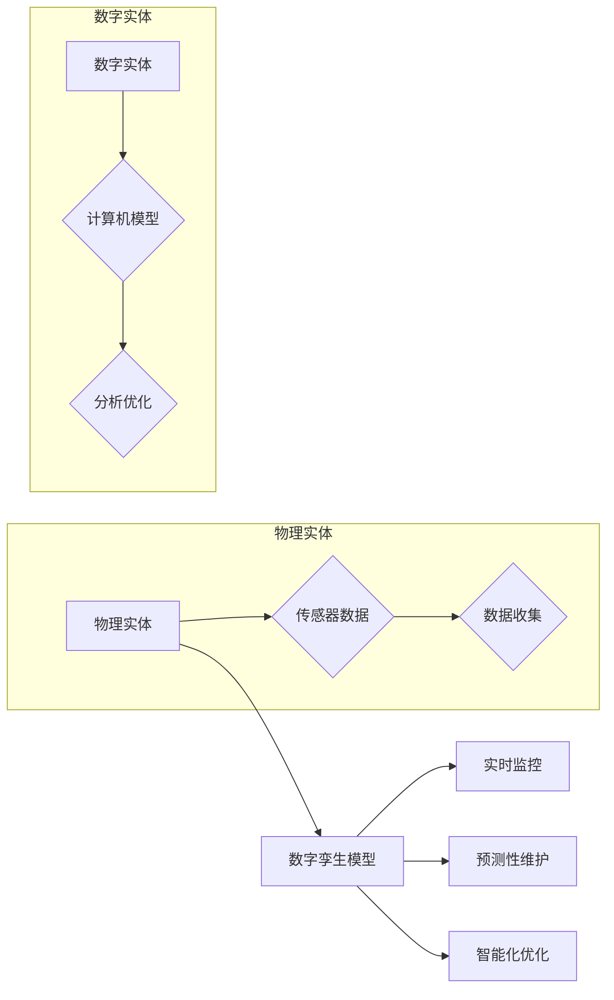

# 数字实体与物理实体的自动化方向

> 关键词：数字孪生，物理实体，自动化，物联网，机器学习，仿真，工业4.0，智能优化

## 1. 背景介绍

随着物联网（IoT）和大数据技术的飞速发展，现实世界中的物理实体正越来越多地被数字化。数字孪生（Digital Twin）作为一种新兴技术，将物理实体的数字化模型与其实时数据相结合，为物理实体的监测、分析和优化提供了强大的工具。本文将探讨数字实体与物理实体的自动化方向，分析其核心概念、算法原理、应用场景以及未来发展趋势。

### 1.1 问题的由来

物理实体在工业、医疗、交通等各个领域扮演着至关重要的角色。然而，传统的人工监测和维护方式存在着效率低下、成本高昂、风险难以控制等问题。随着物联网和大数据技术的发展，通过构建数字孪生模型，实现对物理实体的实时监控、预测性维护和智能化优化，成为提高生产效率、降低成本、保障安全的重要途径。

### 1.2 研究现状

数字孪生技术的研究和应用已经取得了显著的成果。目前，数字孪生主要应用于以下几个方面：

- 工业制造：通过数字孪生模型对生产设备和生产线进行实时监控，预测性维护，优化生产流程。
- 医疗健康：利用数字孪生技术对医疗器械和患者进行模拟，提高手术成功率，优化治疗方案。
- 智能交通：通过数字孪生模型对交通状况进行实时监控，优化交通流量，减少拥堵。
- 能源管理：利用数字孪生模型对能源设备进行监控和优化，提高能源利用效率。

### 1.3 研究意义

数字孪生技术的研究和应用具有以下重要意义：

- 提高生产效率：通过实时监控和预测性维护，减少设备故障停机时间，提高生产效率。
- 降低成本：减少人工维护成本，降低能源消耗，提高资源利用效率。
- 保障安全：提前发现潜在的安全隐患，保障人员安全和设备稳定运行。
- 促进创新：为新产品研发、新工艺探索提供有力支持。

### 1.4 本文结构

本文将分为以下几个部分：

- 第2部分，介绍数字孪生技术涉及的核心概念与联系。
- 第3部分，阐述数字孪生技术的核心算法原理和具体操作步骤。
- 第4部分，讲解数字孪生技术的数学模型和公式。
- 第5部分，给出数字孪生技术的项目实践案例。
- 第6部分，探讨数字孪生技术的实际应用场景。
- 第7部分，展望数字孪生技术的未来发展趋势与挑战。
- 第8部分，总结全文，并对研究展望。

## 2. 核心概念与联系

### 2.1 核心概念

以下是数字孪生技术涉及的核心概念：

- 物理实体：现实世界中存在的有形物体，如工厂设备、交通工具、建筑物等。
- 数字实体：物理实体的虚拟表示，通常由计算机模型、传感器数据和虚拟现实技术等组成。
- 数字孪生模型：将物理实体与数字实体进行映射，实现对物理实体的实时监控、分析和优化的模型。
- 物联网（IoT）：将物理实体通过网络连接，收集和传输数据的系统。

### 2.2 核心概念联系

数字实体与物理实体的联系如图所示：



图中，物理实体通过传感器收集数据，并将数据传输到数字实体。数字孪生模型将物理实体与数字实体进行映射，实现对物理实体的实时监控、预测性维护和智能化优化。

## 3. 核心算法原理 & 具体操作步骤

### 3.1 算法原理概述

数字孪生技术的核心算法主要包括以下三个方面：

- 数据采集与处理：通过传感器、摄像头等设备收集物理实体的数据，并进行数据清洗、转换和预处理。
- 数字孪生建模：建立物理实体的数字模型，包括几何模型、物理模型、行为模型等。
- 智能分析与优化：利用机器学习、深度学习等技术对数字孪生模型进行分析，实现对物理实体的预测性维护和智能化优化。

### 3.2 算法步骤详解

数字孪生技术的具体操作步骤如下：

1. **数据采集与预处理**：通过传感器、摄像头等设备收集物理实体的数据，并进行数据清洗、转换和预处理。
2. **建立数字孪生模型**：根据物理实体的特性，建立几何模型、物理模型、行为模型等，实现对物理实体的完整映射。
3. **实时数据同步**：将实时采集到的物理实体数据同步到数字孪生模型，保持模型的实时性。
4. **智能分析与优化**：利用机器学习、深度学习等技术对数字孪生模型进行分析，实现对物理实体的预测性维护和智能化优化。
5. **模型反馈与迭代**：将优化后的结果反馈到物理实体，并根据实际情况对数字孪生模型进行迭代优化。

### 3.3 算法优缺点

数字孪生技术的优点如下：

- 提高生产效率：通过实时监控和预测性维护，减少设备故障停机时间，提高生产效率。
- 降低成本：减少人工维护成本，降低能源消耗，提高资源利用效率。
- 保障安全：提前发现潜在的安全隐患，保障人员安全和设备稳定运行。

数字孪生技术的缺点如下：

- 数据采集成本高：传感器、摄像头等设备的部署和维护需要较高的成本。
- 模型建立难度大：需要专业知识和技能来建立物理实体的数字模型。
- 技术门槛高：需要掌握物联网、大数据、机器学习等技术。

### 3.4 算法应用领域

数字孪生技术可应用于以下领域：

- 工业制造：如生产线监控、设备维护、生产流程优化等。
- 医疗健康：如医疗器械监测、疾病预测、治疗方案优化等。
- 智能交通：如交通流量监控、交通事故预测、交通信号优化等。
- 能源管理：如能源设备监控、能源消耗预测、能源优化等。

## 4. 数学模型和公式 & 详细讲解 & 举例说明

### 4.1 数学模型构建

数字孪生技术的数学模型主要包括以下两个方面：

- 几何模型：描述物理实体的几何形状和尺寸。
- 物理模型：描述物理实体的物理特性和行为。

以下是一个简单的几何模型示例：

$$
\text{几何模型} = \text{点集} \times \text{几何变换}
$$

其中，点集表示物理实体的几何形状，几何变换表示物理实体的几何变换关系。

以下是一个简单的物理模型示例：

$$
\text{物理模型} = F = m \times a
$$

其中，$F$ 表示作用在物理实体上的力，$m$ 表示物理实体的质量，$a$ 表示物理实体的加速度。

### 4.2 公式推导过程

以几何模型为例，假设物理实体的几何形状由点集 $P = \{p_1, p_2, ..., p_n\}$ 表示，几何变换为 $T$，则几何模型可以表示为：

$$
\text{几何模型} = T(P)
$$

其中，$T(P)$ 表示将点集 $P$ 进行几何变换后的结果。

### 4.3 案例分析与讲解

以下以工业制造领域为例，讲解数字孪生技术的应用。

假设一个工厂有一台机器，其几何模型可以表示为：

$$
\text{几何模型} = T(P)
$$

其中，点集 $P$ 包含了机器的各个关键部件的位置和尺寸信息，几何变换 $T$ 表示机器的几何变换关系。

机器的物理模型可以表示为：

$$
\text{物理模型} = F = m \times a
$$

其中，$F$ 表示作用在机器上的力，$m$ 表示机器的质量，$a$ 表示机器的加速度。

通过传感器收集到的数据，可以更新机器的几何模型和物理模型，实现对机器的实时监控和预测性维护。

## 5. 项目实践：代码实例和详细解释说明

### 5.1 开发环境搭建

以下是使用Python进行数字孪生技术开发的开发环境配置流程：

1. 安装Anaconda：从官网下载并安装Anaconda，用于创建独立的Python环境。
2. 创建并激活虚拟环境：
```bash
conda create -n digital-twin-env python=3.8
conda activate digital-twin-env
```
3. 安装必要的库：
```bash
conda install numpy pandas scikit-learn matplotlib scipy
pip install pyserial
```

### 5.2 源代码详细实现

以下是一个简单的数字孪生项目实例，使用Python和Pyserial库实现传感器数据采集和实时监控。

```python
import serial
import time

# 创建串口连接
ser = serial.Serial('/dev/ttyUSB0', 9600, timeout=1)

while True:
    # 读取传感器数据
    data = ser.readline().decode('utf-8').strip()
    print(data)
    time.sleep(1)
```

### 5.3 代码解读与分析

上述代码使用Pyserial库创建了一个串口连接，从串口设备读取传感器数据，并打印输出。在实际应用中，可以根据需要对读取到的数据进行处理和分析。

### 5.4 运行结果展示

运行上述代码，将看到串口设备读取到的传感器数据实时打印输出。

## 6. 实际应用场景

### 6.1 工业制造

数字孪生技术在工业制造领域的应用主要包括：

- 生产线监控：实时监控生产线运行状态，及时发现并处理异常情况。
- 设备维护：根据设备运行数据，预测性维护，减少设备故障停机时间。
- 生产流程优化：优化生产流程，提高生产效率。

### 6.2 医疗健康

数字孪生技术在医疗健康领域的应用主要包括：

- 医疗器械监测：实时监测医疗器械的工作状态，保障医疗安全。
- 疾病预测：根据患者的健康数据，预测疾病风险，提前采取预防措施。
- 治疗方案优化：根据患者的病情和治疗方案，优化治疗方案。

### 6.3 智能交通

数字孪生技术在智能交通领域的应用主要包括：

- 交通流量监控：实时监控交通流量，优化交通信号灯控制。
- 交通事故预测：根据交通数据，预测交通事故风险，提前采取措施。
- 交通导航：根据实时交通状况，为驾驶员提供最优导航路线。

### 6.4 能源管理

数字孪生技术在能源管理领域的应用主要包括：

- 能源设备监控：实时监控能源设备运行状态，保障能源安全。
- 能源消耗预测：根据能源消耗数据，预测能源消耗趋势，优化能源使用。
- 能源优化：根据能源消耗数据和设备运行状态，优化能源使用策略。

## 7. 工具和资源推荐

### 7.1 学习资源推荐

- 《数字孪生：构建现实世界的虚拟映射》
- 《物联网技术：原理与实践》
- 《机器学习：一种算法视角》
- 《深度学习：原理与算法》

### 7.2 开发工具推荐

- Python：Python是一种广泛应用于数据科学和人工智能领域的编程语言。
- Pyserial：Pyserial是一个开源的串口通信库，用于读取和写入串口设备。
- OpenCV：OpenCV是一个开源的计算机视觉库，用于图像和视频处理。
- TensorFlow：TensorFlow是一个开源的深度学习框架，用于构建和训练机器学习模型。

### 7.3 相关论文推荐

- 《Digital Twin：A New Big Data Application Scenario》
- 《Digital Twin Platform Architecture for Industrial Internet of Things》
- 《A Survey on Digital Twin: Definitions, Architecture, and Applications》
- 《A Digital Twin-based Approach for Predictive Maintenance in Industrial Internet of Things》

## 8. 总结：未来发展趋势与挑战

### 8.1 研究成果总结

数字孪生技术作为一种新兴技术，在工业制造、医疗健康、智能交通、能源管理等领域展现出巨大的应用潜力。通过构建数字孪生模型，实现对物理实体的实时监控、预测性维护和智能化优化，为提高生产效率、降低成本、保障安全提供了有力支持。

### 8.2 未来发展趋势

未来，数字孪生技术将呈现以下发展趋势：

- 技术融合：数字孪生技术将与人工智能、物联网、大数据等技术深度融合，形成更加完善的技术体系。
- 标准化：数字孪生技术将逐步走向标准化，为不同领域的应用提供统一的技术规范。
- 应用拓展：数字孪生技术将在更多领域得到应用，如农业、环境监测、城市规划等。

### 8.3 面临的挑战

数字孪生技术在实际应用中仍面临以下挑战：

- 数据采集：如何高效、低成本地采集物理实体的数据，是数字孪生技术发展的关键。
- 模型构建：如何构建准确、高效的数字孪生模型，是数字孪生技术能否发挥作用的决定因素。
- 安全性：如何保障数字孪生系统的安全性，防止数据泄露和恶意攻击，是数字孪生技术面临的重大挑战。

### 8.4 研究展望

未来，数字孪生技术的研究重点将集中在以下几个方面：

- 开发高效、低成本的数据采集方法，如无线传感器网络、边缘计算等。
- 研究更加精确、高效的数字孪生模型构建方法，如深度学习、强化学习等。
- 加强数字孪生系统的安全性研究，确保数据安全和系统稳定运行。

相信随着技术的不断进步和应用的不断拓展，数字孪生技术必将在未来发挥更加重要的作用，为人类社会的发展带来更多便利。

## 9. 附录：常见问题与解答

**Q1：数字孪生技术与虚拟现实（VR）和增强现实（AR）有何区别？**

A：数字孪生技术和虚拟现实（VR）和增强现实（AR）都属于虚拟现实技术范畴，但它们的应用场景和目标有所不同。VR和AR主要用于创造虚拟环境，提供沉浸式体验；而数字孪生技术则是将物理实体数字化，实现对物理实体的实时监控、分析和优化。

**Q2：数字孪生技术需要哪些关键技术支撑？**

A：数字孪生技术需要以下关键技术支撑：

- 物联网：用于采集物理实体的实时数据。
- 大数据：用于存储和处理大量数据。
- 机器学习：用于分析数字孪生模型，实现预测性维护和智能化优化。
- 深度学习：用于构建更加精确的数字孪生模型。

**Q3：数字孪生技术有哪些应用场景？**

A：数字孪生技术可应用于以下场景：

- 工业制造：生产线监控、设备维护、生产流程优化等。
- 医疗健康：医疗器械监测、疾病预测、治疗方案优化等。
- 智能交通：交通流量监控、交通事故预测、交通信号优化等。
- 能源管理：能源设备监控、能源消耗预测、能源优化等。

**Q4：如何保障数字孪生系统的安全性？**

A：保障数字孪生系统的安全性需要从以下几个方面入手：

- 数据安全：采用加密、访问控制等技术保障数据安全。
- 系统安全：采用防火墙、入侵检测等技术保障系统安全。
- 物理安全：确保物理设备的物理安全，防止恶意破坏。

**Q5：数字孪生技术如何与人工智能技术结合？**

A：数字孪生技术可以与人工智能技术结合，实现以下功能：

- 预测性维护：利用机器学习技术对物理实体的运行状态进行预测，提前发现潜在故障。
- 智能化优化：利用强化学习技术对物理实体的运行参数进行优化，提高生产效率。

作者：禅与计算机程序设计艺术 / Zen and the Art of Computer Programming