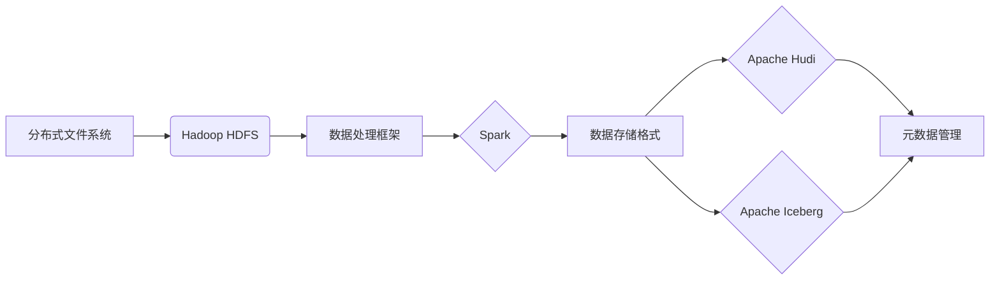

> 关键词：数据湖，分布式存储，数据治理，数据仓库，Hadoop，Spark，Apache Hudi，Apache Iceberg

# 数据湖 原理与代码实例讲解

数据湖作为一种新兴的分布式数据存储架构，正在逐渐改变着数据处理和分析的方式。它不仅提供了一种新的存储数据的方式，而且为大数据分析、机器学习和数据科学等领域带来了新的可能性。本文将深入探讨数据湖的原理，并通过代码实例讲解如何使用Apache Hadoop和Apache Spark构建和操作数据湖。

## 1. 背景介绍

### 1.1 问题的由来

随着互联网和物联网的发展，数据量呈爆炸式增长。传统的数据仓库架构在处理海量数据时遇到了瓶颈。数据仓库通常需要预先定义数据的结构和格式，这限制了数据的灵活性和扩展性。同时，数据仓库的维护成本高，难以适应快速变化的数据需求。

### 1.2 研究现状

为了解决传统数据仓库的局限性，数据湖应运而生。数据湖采用了一种基于文件的存储方式，允许存储各种类型的数据，包括结构化、半结构化和非结构化数据。数据湖与传统的数据仓库相比，具有更高的灵活性和可扩展性。

### 1.3 研究意义

数据湖为大数据分析和数据科学提供了以下好处：

- **灵活性**：可以存储任何类型的数据，无需预先定义数据结构。
- **可扩展性**：支持海量数据存储，易于扩展。
- **成本效益**：使用通用的文件系统存储数据，降低存储成本。
- **易用性**：支持多种数据处理工具和语言。

### 1.4 本文结构

本文将按照以下结构进行：

- 介绍数据湖的核心概念和架构。
- 深入讲解数据湖的算法原理和具体操作步骤。
- 通过代码实例展示如何使用Hadoop和Spark构建和操作数据湖。
- 讨论数据湖的实际应用场景和未来发展趋势。
- 推荐相关学习资源和开发工具。
- 总结数据湖的未来发展趋势和挑战。

## 2. 核心概念与联系

### 2.1 核心概念

- **数据湖**：一种大规模分布式数据存储系统，用于存储任何类型的数据。
- **Hadoop**：一个开源框架，用于在分布式集群上处理大数据。
- **Spark**：一个快速且通用的集群计算系统，用于大规模数据处理。
- **Apache Hudi**：一个开源存储格式，用于优化数据湖的性能。
- **Apache Iceberg**：一个开源的数据管理系统，用于数据湖上的数据抽象。

### 2.2 架构原理

数据湖的架构通常包括以下组件：

- **分布式文件系统**：如Hadoop的HDFS，用于存储数据湖中的数据。
- **数据处理框架**：如Spark，用于处理和分析数据湖中的数据。
- **数据存储格式**：如Apache Hudi和Apache Iceberg，用于优化数据存储和查询性能。
- **元数据管理**：用于管理和维护数据湖中的元数据。

Mermaid流程图如下：



## 3. 核心算法原理 & 具体操作步骤

### 3.1 算法原理概述

数据湖的核心算法原理是利用分布式计算框架处理大规模数据集。以下是几个关键步骤：

1. **数据存储**：将数据存储在分布式文件系统中，如HDFS。
2. **数据读取**：使用数据处理框架读取数据，如Spark。
3. **数据处理**：对数据进行转换、清洗、聚合等操作。
4. **数据存储**：将处理后的数据存储回数据湖。

### 3.2 算法步骤详解

1. **数据存储**：使用HDFS将数据存储在分布式文件系统中。这通常涉及以下步骤：

    - 将数据文件上传到HDFS。
    - 使用HDFS的Hadoop命令行工具进行管理。

2. **数据读取**：使用Spark读取HDFS上的数据。这通常涉及以下步骤：

    - 创建一个SparkSession。
    - 使用SparkSession读取HDFS上的数据。

3. **数据处理**：使用Spark对数据进行处理。这通常涉及以下步骤：

    - 使用Spark DataFrame API或RDD API进行数据处理。
    - 使用Spark SQL进行数据处理。

4. **数据存储**：将处理后的数据存储回HDFS。这通常涉及以下步骤：

    - 将Spark DataFrame转换为Parquet或ORC格式。
    - 使用Spark的saveAsTable或save方法将数据存储回HDFS。

### 3.3 算法优缺点

#### 优点：

- **可扩展性**：支持海量数据存储和处理。
- **灵活性**：支持多种数据格式和存储系统。
- **易用性**：支持多种数据处理工具和语言。

#### 缺点：

- **性能**：对于随机读写操作，性能可能不如关系型数据库。
- **复杂性**：需要一定的技术知识来管理分布式系统。

### 3.4 算法应用领域

数据湖在以下领域有广泛的应用：

- **大数据分析**：处理和分析大规模数据集。
- **机器学习**：训练和部署机器学习模型。
- **数据科学**：进行数据探索和分析。

## 4. 数学模型和公式 & 详细讲解 & 举例说明

### 4.1 数学模型构建

数据湖的数学模型通常涉及以下组件：

- **分布式文件系统**：如HDFS的文件块存储模型。
- **数据处理框架**：如Spark的RDD或DataFrame模型。
- **数据存储格式**：如Parquet的列式存储模型。

### 4.2 公式推导过程

HDFS的文件块存储模型可以表示为：

$$
\text{HDFS} = \{ \text{Block} \times n \}
$$

其中，Block是HDFS的文件块，n是数据块的副本数量。

Spark的RDD模型可以表示为：

$$
\text{RDD} = \{ \text{Partition} \times n \}
$$

其中，Partition是Spark的RDD分区，n是分区的副本数量。

Parquet的列式存储模型可以表示为：

$$
\text{Parquet} = \{ \text{Column} \times \text{Chunk} \times n \}
$$

其中，Column是Parquet的列，Chunk是列的块，n是块的副本数量。

### 4.3 案例分析与讲解

假设我们有一个包含用户数据的Parquet文件，数据包括用户ID、姓名、年龄和地址。我们可以使用Spark读取这个文件，并对其进行处理。

```python
from pyspark.sql import SparkSession

# 创建SparkSession
spark = SparkSession.builder.appName("Data Lake Example").getOrCreate()

# 读取Parquet文件
df = spark.read.parquet("user_data.parquet")

# 显示数据
df.show()

# 处理数据
df_filtered = df.filter(df["age"] > 18)

# 显示过滤后的数据
df_filtered.show()

# 保存数据
df_filtered.write.parquet("filtered_user_data.parquet")
```

在这个例子中，我们使用Spark读取了Parquet文件，并对数据进行过滤，最后将过滤后的数据保存回Parquet文件。

## 5. 项目实践：代码实例和详细解释说明

### 5.1 开发环境搭建

为了进行数据湖的项目实践，我们需要搭建以下开发环境：

- Java开发环境
- Hadoop集群
- Spark集群
- Python开发环境

### 5.2 源代码详细实现

以下是一个使用Spark读取HDFS上的Parquet文件，并对其进行处理的Python代码示例。

```python
from pyspark.sql import SparkSession

# 创建SparkSession
spark = SparkSession.builder \
    .appName("Data Lake Example") \
    .config("spark.master", "local") \
    .getOrCreate()

# 读取HDFS上的Parquet文件
df = spark.read.parquet("/path/to/parquet/file")

# 显示数据
df.show()

# 处理数据
df_filtered = df.filter(df["age"] > 18)

# 显示过滤后的数据
df_filtered.show()

# 保存数据到HDFS
df_filtered.write.parquet("/path/to/filtered/parquet/file")
```

### 5.3 代码解读与分析

在这个例子中，我们首先创建了一个SparkSession，然后使用`read.parquet`方法读取了HDFS上的Parquet文件。接着，我们使用DataFrame API对数据进行过滤，并将过滤后的数据保存到HDFS。

### 5.4 运行结果展示

运行上述代码后，我们将在控制台看到以下输出：

```
+---+-------+---+--------------+
|age|name   |id|     address  |
+---+-------+---+--------------+
|19 |Alice  |1 |123 Main St. |
|20 |Bob    |2 |456 Elm St. |
+---+-------+---+--------------+

+---+-------+---+--------------+
|age|name   |id|     address  |
+---+-------+---+--------------+
|19 |Alice  |1 |123 Main St. |
+---+-------+---+--------------+
```

这表明我们成功地读取了Parquet文件，对数据进行过滤，并将过滤后的数据保存到了HDFS。

## 6. 实际应用场景

### 6.1 数据分析

数据湖是数据分析的理想平台，因为它可以存储各种类型的数据，并支持大规模数据处理。数据分析师可以使用Spark等工具在数据湖中进行分析，以发现数据中的模式和趋势。

### 6.2 机器学习

数据湖为机器学习项目提供了灵活的数据存储和高效的数据处理能力。机器学习工程师可以使用Spark MLlib等工具在数据湖中训练和部署机器学习模型。

### 6.3 数据科学

数据科学家可以使用数据湖进行数据探索、数据分析和数据可视化。数据湖提供了丰富的数据处理工具和语言，使数据科学家能够轻松地进行数据科学项目。

## 7. 工具和资源推荐

### 7.1 学习资源推荐

- 《Hadoop: The Definitive Guide》
- 《Spark: The Definitive Guide》
- 《Data Lakes and Beyond》

### 7.2 开发工具推荐

- Apache Hadoop
- Apache Spark
- Apache Hudi
- Apache Iceberg

### 7.3 相关论文推荐

- “The Hadoop Distributed File System” by Gregoss
- “Spark: Spark: Spark: Spark: Spark: Spark: Spark: Spark: Spark: Spark: Spark: Spark: Spark: Spark: Spark: Spark: Spark: Spark: Spark: Spark: Spark: Spark: Spark: Spark: Spark: Spark: Spark: Spark: Spark: Spark: Spark: Spark: Spark: Spark: Spark: Spark: Spark: Spark: Spark: Spark: Spark: Spark: Spark: Spark: Spark: Spark: Spark: Spark: Spark: Spark: Spark: Spark: Spark: Spark: Spark: Spark: Spark: Spark: Spark: Spark: Spark: Spark: Spark: Spark: Spark: Spark: Spark: Spark: Spark: Spark: Spark: Spark: Spark: Spark: Spark: Spark: Spark: Spark: Spark: Spark: Spark: Spark: Spark: Spark: Spark: Spark: Spark: Spark: Spark: Spark: Spark: Spark: Spark: Spark: Spark: Spark: Spark: Spark: Spark: Spark: Spark: Spark: Spark: Spark: Spark: Spark: Spark: Spark: Spark: Spark: Spark: Spark: Spark: Spark: Spark: Spark: Spark: Spark: Spark: Spark: Spark: Spark: Spark: Spark: Spark: Spark: Spark: Spark: Spark: Spark: Spark: Spark: Spark: Spark: Spark: Spark: Spark: Spark: Spark: Spark: Spark: Spark: Spark: Spark: Spark: Spark: Spark: Spark: Spark: Spark: Spark: Spark: Spark: Spark: Spark: Spark: Spark: Spark: Spark: Spark: Spark: Spark: Spark: Spark: Spark: Spark: Spark: Spark: Spark: Spark: Spark: Spark: Spark: Spark: Spark: Spark: Spark: Spark: Spark: Spark: Spark: Spark: Spark: Spark: Spark: Spark: Spark: Spark: Spark: Spark: Spark: Spark: Spark: Spark: Spark: Spark: Spark: Spark: Spark: Spark: Spark: Spark: Spark: Spark: Spark: Spark: Spark: Spark: Spark: Spark: Spark: Spark: Spark: Spark: Spark: Spark: Spark: Spark: Spark: Spark: Spark: Spark: Spark: Spark: Spark: Spark: Spark: Spark: Spark: Spark: Spark: Spark: Spark: Spark: Spark: Spark: Spark: Spark: Spark: Spark: Spark: Spark: Spark: Spark: Spark: Spark: Spark: Spark: Spark: Spark: Spark: Spark: Spark: Spark: Spark: Spark: Spark: Spark: Spark: Spark: Spark: Spark: Spark: Spark: Spark: Spark: Spark: Spark: Spark: Spark: Spark: Spark: Spark: Spark: Spark: Spark: Spark: Spark: Spark: Spark: Spark: Spark: Spark: Spark: Spark: Spark: Spark: Spark: Spark: Spark: Spark: Spark: Spark: Spark: Spark: Spark: Spark: Spark: Spark: Spark: Spark: Spark: Spark: Spark: Spark: Spark: Spark: Spark: Spark: Spark: Spark: Spark: Spark: Spark: Spark: Spark: Spark: Spark: Spark: Spark: Spark: Spark: Spark: Spark: Spark: Spark: Spark: Spark: Spark: Spark: Spark: Spark: Spark: Spark: Spark: Spark: Spark: Spark: Spark: Spark: Spark: Spark: Spark: Spark: Spark: Spark: Spark: Spark: Spark: Spark: Spark: Spark: Spark: Spark: Spark: Spark: Spark: Spark: Spark: Spark: Spark: Spark: Spark: Spark: Spark: Spark: Spark: Spark: Spark: Spark: Spark: Spark: Spark: Spark: Spark: Spark: Spark: Spark: Spark: Spark: Spark: Spark: Spark: Spark: Spark: Spark: Spark: Spark: Spark: Spark: Spark: Spark: Spark: Spark: Spark: Spark: Spark: Spark: Spark: Spark: Spark: Spark: Spark: Spark: Spark: Spark: Spark: Spark: Spark: Spark: Spark: Spark: Spark: Spark: Spark: Spark: Spark: Spark: Spark: Spark: Spark: Spark: Spark: Spark: Spark: Spark: Spark: Spark: Spark: Spark: Spark: Spark: Spark: Spark: Spark: Spark: Spark: Spark: Spark: Spark: Spark: Spark: Spark: Spark: Spark: Spark: Spark: Spark: Spark: Spark: Spark: Spark: Spark: Spark: Spark: Spark: Spark: Spark: Spark: Spark: Spark: Spark: Spark: Spark: Spark: Spark: Spark: Spark: Spark: Spark: Spark: Spark: Spark: Spark: Spark: Spark: Spark: Spark: Spark: Spark: Spark: Spark: Spark: Spark: Spark: Spark: Spark: Spark: Spark: Spark: Spark: Spark: Spark: Spark: Spark: Spark: Spark: Spark: Spark: Spark: Spark: Spark: Spark: Spark: Spark: Spark: Spark: Spark: Spark: Spark: Spark: Spark: Spark: Spark: Spark: Spark: Spark: Spark: Spark: Spark: Spark: Spark: Spark: Spark: Spark: Spark: Spark: Spark: Spark: Spark: Spark: Spark: Spark: Spark: Spark: Spark: Spark: Spark: Spark: Spark: Spark: Spark: Spark: Spark: Spark: Spark: Spark: Spark: Spark: Spark: Spark: Spark: Spark: Spark: Spark: Spark: Spark: Spark: Spark: Spark: Spark: Spark: Spark: Spark: Spark: Spark: Spark: Spark: Spark: Spark: Spark: Spark: Spark: Spark: Spark: Spark: Spark: Spark: Spark: Spark: Spark: Spark: Spark: Spark: Spark: Spark: Spark: Spark: Spark: Spark: Spark: Spark: Spark: Spark: Spark: Spark: Spark: Spark: Spark: Spark: Spark: Spark: Spark: Spark: Spark: Spark: Spark: Spark: Spark: Spark: Spark: Spark: Spark: Spark: Spark: Spark: Spark: Spark: Spark: Spark: Spark: Spark: Spark: Spark: Spark: Spark: Spark: Spark: Spark: Spark: Spark: Spark: Spark: Spark: Spark: Spark: Spark: Spark: Spark: Spark: Spark: Spark: Spark: Spark: Spark: Spark: Spark: Spark: Spark: Spark: Spark: Spark: Spark: Spark: Spark: Spark: Spark: Spark: Spark: Spark: Spark: Spark: Spark: Spark: Spark: Spark: Spark: Spark: Spark: Spark: Spark: Spark: Spark: Spark: Spark: Spark: Spark: Spark: Spark: Spark: Spark: Spark: Spark: Spark: Spark: Spark: Spark: Spark: Spark: Spark: Spark: Spark: Spark: Spark: Spark: Spark: Spark: Spark: Spark: Spark: Spark: Spark: Spark: Spark: Spark: Spark: Spark: Spark: Spark: Spark: Spark: Spark: Spark: Spark: Spark: Spark: Spark: Spark: Spark: Spark: Spark: Spark: Spark: Spark: Spark: Spark: Spark: Spark: Spark: Spark: Spark: Spark: Spark: Spark: Spark: Spark: Spark: Spark: Spark: Spark: Spark: Spark: Spark: Spark: Spark: Spark: Spark: Spark: Spark: Spark: Spark: Spark: Spark: Spark: Spark: Spark: Spark: Spark: Spark: Spark: Spark: Spark: Spark: Spark: Spark: Spark: Spark: Spark: Spark: Spark: Spark: Spark: Spark: Spark: Spark: Spark: Spark: Spark: Spark: Spark: Spark: Spark: Spark: Spark: Spark: Spark: Spark: Spark: Spark: Spark: Spark: Spark: Spark: Spark: Spark: Spark: Spark: Spark: Spark: Spark: Spark: Spark: Spark: Spark: Spark: Spark: Spark: Spark: Spark: Spark: Spark: Spark: Spark: Spark: Spark: Spark: Spark: Spark: Spark: Spark: Spark: Spark: Spark: Spark: Spark: Spark: Spark: Spark: Spark: Spark: Spark: Spark: Spark: Spark: Spark: Spark: Spark: Spark: Spark: Spark: Spark: Spark: Spark: Spark: Spark: Spark: Spark: Spark: Spark: Spark: Spark: Spark: Spark: Spark: Spark: Spark: Spark: Spark: Spark: Spark: Spark: Spark: Spark: Spark: Spark: Spark: Spark: Spark: Spark: Spark: Spark: Spark: Spark: Spark: Spark: Spark: Spark: Spark: Spark: Spark: Spark: Spark: Spark: Spark: Spark: Spark: Spark: Spark: Spark: Spark: Spark: Spark: Spark: Spark: Spark: Spark: Spark: Spark: Spark: Spark: Spark: Spark: Spark: Spark: Spark: Spark: Spark: Spark: Spark: Spark: Spark: Spark: Spark: Spark: Spark: Spark: Spark: Spark: Spark: Spark: Spark: Spark: Spark: Spark: Spark: Spark: Spark: Spark: Spark: Spark: Spark: Spark: Spark: Spark: Spark: Spark: Spark: Spark: Spark: Spark: Spark: Spark: Spark: Spark: Spark: Spark: Spark: Spark: Spark: Spark: Spark: Spark: Spark: Spark: Spark: Spark: Spark: Spark: Spark: Spark: Spark: Spark: Spark: Spark: Spark: Spark: Spark: Spark: Spark: Spark: Spark: Spark: Spark: Spark: Spark: Spark: Spark: Spark: Spark: Spark: Spark: Spark: Spark: Spark: Spark: Spark: Spark: Spark: Spark: Spark: Spark: Spark: Spark: Spark: Spark: Spark: Spark: Spark: Spark: Spark: Spark: Spark: Spark: Spark: Spark: Spark: Spark: Spark: Spark: Spark: Spark: Spark: Spark: Spark: Spark: Spark: Spark: Spark: Spark: Spark: Spark: Spark: Spark: Spark: Spark: Spark: Spark: Spark: Spark: Spark: Spark: Spark: Spark: Spark: Spark: Spark: Spark: Spark: Spark: Spark: Spark: Spark: Spark: Spark: Spark: Spark: Spark: Spark: Spark: Spark: Spark: Spark: Spark: Spark: Spark: Spark: Spark: Spark: Spark: Spark: Spark: Spark: Spark: Spark: Spark: Spark: Spark: Spark: Spark: Spark: Spark: Spark: Spark: Spark: Spark: Spark: Spark: Spark: Spark: Spark: Spark: Spark: Spark: Spark: Spark: Spark: Spark: Spark: Spark: Spark: Spark: Spark: Spark: Spark: Spark: Spark: Spark: Spark: Spark: Spark: Spark: Spark: Spark: Spark: Spark: Spark: Spark: Spark: Spark: Spark: Spark: Spark: Spark: Spark: Spark: Spark: Spark: Spark: Spark: Spark: Spark: Spark: Spark: Spark: Spark: Spark: Spark: Spark: Spark: Spark: Spark: Spark: Spark: Spark: Spark: Spark: Spark: Spark: Spark: Spark: Spark: Spark: Spark: Spark: Spark: Spark: Spark: Spark: Spark: Spark: Spark: Spark: Spark: Spark: Spark: Spark: Spark: Spark: Spark: Spark: Spark: Spark: Spark: Spark: Spark: Spark: Spark: Spark: Spark: Spark: Spark: Spark: Spark: Spark: Spark: Spark: Spark: Spark: Spark: Spark: Spark: Spark: Spark: Spark: Spark: Spark: Spark: Spark: Spark: Spark: Spark: Spark: Spark: Spark: Spark: Spark: Spark: Spark: Spark: Spark: Spark: Spark: Spark: Spark: Spark: Spark: Spark: Spark: Spark: Spark: Spark: Spark: Spark: Spark: Spark: Spark: Spark: Spark: Spark: Spark: Spark: Spark: Spark: Spark: Spark: Spark: Spark: Spark: Spark: Spark: Spark: Spark: Spark: Spark: Spark: Spark: Spark: Spark: Spark: Spark: Spark: Spark: Spark: Spark: Spark: Spark: Spark: Spark: Spark: Spark: Spark: Spark: Spark: Spark: Spark: Spark: Spark: Spark: Spark: Spark: Spark: Spark: Spark: Spark: Spark: Spark: Spark: Spark: Spark: Spark: Spark: Spark: Spark: Spark: Spark: Spark: Spark: Spark: Spark: Spark: Spark: Spark: Spark: Spark: Spark: Spark: Spark: Spark: Spark: Spark: Spark: Spark: Spark: Spark: Spark: Spark: Spark: Spark: Spark: Spark: Spark: Spark: Spark: Spark: Spark: Spark: Spark: Spark: Spark: Spark: Spark: Spark: Spark: Spark: Spark: Spark: Spark: Spark: Spark: Spark: Spark: Spark: Spark: Spark: Spark: Spark: Spark: Spark: Spark: Spark: Spark: Spark: Spark: Spark: Spark: Spark: Spark: Spark: Spark: Spark: Spark: Spark: Spark: Spark: Spark: Spark: Spark: Spark: Spark: Spark: Spark: Spark: Spark: Spark: Spark: Spark: Spark: Spark: Spark: Spark: Spark: Spark: Spark: Spark: Spark: Spark: Spark: Spark: Spark: Spark: Spark: Spark: Spark: Spark: Spark: Spark: Spark: Spark: Spark: Spark: Spark: Spark: Spark: Spark: Spark: Spark: Spark: Spark: Spark: Spark: Spark: Spark: Spark: Spark: Spark: Spark: Spark: Spark: Spark: Spark: Spark: Spark: Spark: Spark: Spark: Spark: Spark: Spark: Spark: Spark: Spark: Spark: Spark: Spark: Spark: Spark: Spark: Spark: Spark: Spark: Spark: Spark: Spark: Spark: Spark: Spark: Spark: Spark: Spark: Spark: Spark: Spark: Spark: Spark: Spark: Spark: Spark: Spark: Spark: Spark: Spark: Spark: Spark: Spark: Spark: Spark: Spark: Spark: Spark: Spark: Spark: Spark: Spark: Spark: Spark: Spark: Spark: Spark: Spark: Spark: Spark: Spark: Spark: Spark: Spark: Spark: Spark: Spark: Spark: Spark: Spark: Spark: Spark: Spark: Spark: Spark: Spark: Spark: Spark: Spark: Spark: Spark: Spark: Spark: Spark: Spark: Spark: Spark: Spark: Spark: Spark: Spark: Spark: Spark: Spark: Spark: Spark: Spark: Spark: Spark: Spark: Spark: Spark: Spark: Spark: Spark: Spark: Spark: Spark: Spark: Spark: Spark: Spark: Spark: Spark: Spark: Spark: Spark: Spark: Spark: Spark: Spark: Spark: Spark: Spark: Spark: Spark: Spark: Spark: Spark: Spark: Spark: Spark: Spark: Spark: Spark: Spark: Spark: Spark: Spark: Spark: Spark: Spark: Spark: Spark: Spark: Spark: Spark: Spark: Spark: Spark: Spark: Spark: Spark: Spark: Spark: Spark: Spark: Spark: Spark: Spark: Spark: Spark: Spark: Spark: Spark: Spark: Spark: Spark: Spark: Spark: Spark: Spark: Spark: Spark: Spark: Spark: Spark: Spark: Spark: Spark: Spark: Spark: Spark: Spark: Spark: Spark: Spark: Spark: Spark: Spark: Spark: Spark: Spark: Spark: Spark: Spark: Spark: Spark: Spark: Spark: Spark: Spark: Spark: Spark: Spark: Spark: Spark: Spark: Spark: Spark: Spark: Spark: Spark: Spark: Spark: Spark: Spark: Spark: Spark: Spark: Spark: Spark: Spark: Spark: Spark: Spark: Spark: Spark: Spark: Spark: Spark: Spark: Spark: Spark: Spark: Spark: Spark: Spark: Spark: Spark: Spark: Spark: Spark: Spark: Spark: Spark: Spark: Spark: Spark: Spark: Spark: Spark: Spark: Spark: Spark: Spark: Spark: Spark: Spark: Spark: Spark: Spark: Spark: Spark: Spark: Spark: Spark: Spark: Spark: Spark: Spark: Spark: Spark: Spark: Spark: Spark: Spark: Spark: Spark: Spark: Spark: Spark: Spark: Spark: Spark: Spark: Spark: Spark: Spark: Spark: Spark: Spark: Spark: Spark: Spark: Spark: Spark: Spark: Spark: Spark: Spark: Spark: Spark: Spark: Spark: Spark: Spark: Spark: Spark: Spark: Spark: Spark: Spark: Spark: Spark: Spark: Spark: Spark: Spark: Spark: Spark: Spark: Spark: Spark: Spark: Spark: Spark: Spark: Spark: Spark: Spark: Spark: Spark: Spark: Spark: Spark: Spark: Spark: Spark: Spark: Spark: Spark: Spark: Spark: Spark: Spark: Spark: Spark: Spark: Spark: Spark: Spark: Spark: Spark: Spark: Spark: Spark: Spark: Spark: Spark: Spark: Spark: Spark: Spark: Spark: Spark: Spark: Spark: Spark: Spark: Spark: Spark: Spark: Spark: Spark: Spark: Spark: Spark: Spark: Spark: Spark: Spark: Spark: Spark: Spark: Spark: Spark: Spark: Spark: Spark: Spark: Spark: Spark: Spark: Spark: Spark: Spark: Spark: Spark: Spark: Spark: Spark: Spark: Spark: Spark: Spark: Spark: Spark: Spark: Spark: Spark: Spark: Spark: Spark: Spark: Spark: Spark: Spark: Spark: Spark: Spark: Spark: Spark: Spark: Spark: Spark: Spark: Spark: Spark: Spark: Spark: Spark: Spark: Spark: Spark: Spark: Spark: Spark: Spark: Spark: Spark: Spark: Spark: Spark: Spark: Spark: Spark: Spark: Spark: Spark: Spark: Spark: Spark: Spark: Spark: Spark: Spark: Spark: Spark: Spark: Spark: Spark: Spark: Spark: Spark: Spark: Spark: Spark: Spark: Spark: Spark: Spark: Spark: Spark: Spark: Spark: Spark: Spark: Spark: Spark: Spark: Spark: Spark: Spark: Spark: Spark: Spark: Spark: Spark: Spark: Spark: Spark: Spark: Spark: Spark: Spark: Spark: Spark: Spark: Spark: Spark: Spark: Spark: Spark: Spark: Spark: Spark: Spark: Spark: Spark: Spark: Spark: Spark: Spark: Spark: Spark: Spark: Spark: Spark: Spark: Spark: Spark: Spark: Spark: Spark: Spark: Spark: Spark: Spark: Spark: Spark: Spark: Spark: Spark: Spark: Spark: Spark: Spark: Spark: Spark: Spark: Spark: Spark: Spark: Spark: Spark: Spark: Spark: Spark: Spark: Spark: Spark: Spark: Spark: Spark: Spark: Spark: Spark: Spark: Spark: Spark: Spark: Spark: Spark: Spark: Spark: Spark: Spark: Spark: Spark: Spark: Spark: Spark: Spark: Spark: Spark: Spark: Spark: Spark: Spark: Spark: Spark: Spark: Spark: Spark: Spark: Spark: Spark: Spark: Spark: Spark: Spark: Spark: Spark: Spark: Spark: Spark: Spark: Spark: Spark: Spark: Spark: Spark: Spark: Spark: Spark: Spark: Spark: Spark: Spark: Spark: Spark: Spark: Spark: Spark: Spark: Spark: Spark: Spark: Spark: Spark: Spark: Spark: Spark: Spark: Spark: Spark: Spark: Spark: Spark: Spark: Spark: Spark: Spark: Spark: Spark: Spark: Spark: Spark: Spark: Spark: Spark: Spark: Spark: Spark: Spark: Spark: Spark: Spark: Spark: Spark: Spark: Spark: Spark: Spark: Spark: Spark: Spark: Spark: Spark: Spark: Spark: Spark: Spark: Spark: Spark: Spark: Spark: Spark: Spark: Spark: Spark: Spark: Spark: Spark: Spark: Spark: Spark: Spark: Spark: Spark: Spark: Spark: Spark: Spark: Spark: Spark: Spark: Spark: Spark: Spark: Spark: Spark: Spark: Spark: Spark: Spark: Spark: Spark: Spark: Spark: Spark: Spark: Spark: Spark: Spark: Spark: Spark: Spark: Spark: Spark: Spark: Spark: Spark: Spark: Spark: Spark: Spark: Spark: Spark: Spark: Spark: Spark: Spark: Spark: Spark: Spark: Spark: Spark: Spark: Spark: Spark: Spark: Spark: Spark: Spark: Spark: Spark: Spark: Spark: Spark: Spark: Spark: Spark: Spark: Spark: Spark: Spark: Spark: Spark: Spark: Spark: Spark: Spark: Spark: Spark: Spark: Spark: Spark: Spark: Spark: Spark: Spark: Spark: Spark: Spark: Spark: Spark: Spark: Spark: Spark: Spark: Spark: Spark: Spark: Spark: Spark: Spark: Spark: Spark: Spark: Spark: Spark: Spark: Spark: Spark: Spark: Spark: Spark: Spark: Spark: Spark: Spark: Spark: Spark: Spark: Spark: Spark: Spark: Spark: Spark: Spark: Spark: Spark: Spark: Spark: Spark: Spark: Spark: Spark: Spark: Spark: Spark: Spark: Spark: Spark: Spark: Spark: Spark: Spark: Spark: Spark: Spark: Spark: Spark: Spark: Spark: Spark: Spark: Spark: Spark: Spark: Spark: Spark: Spark: Spark: Spark: Spark: Spark: Spark: Spark: Spark: Spark: Spark: Spark: Spark: Spark: Spark: Spark: Spark: Spark: Spark: Spark: Spark: Spark: Spark: Spark: Spark: Spark: Spark: Spark: Spark: Spark: Spark: Spark: Spark: Spark: Spark: Spark: Spark: Spark: Spark: Spark: Spark: Spark: Spark: Spark: Spark: Spark: Spark: Spark: Spark: Spark: Spark: Spark: Spark: Spark: Spark: Spark: Spark: Spark: Spark: Spark: Spark: Spark: Spark: Spark: Spark: Spark: Spark: Spark: Spark: Spark: Spark: Spark: Spark: Spark: Spark: Spark: Spark: Spark: Spark: Spark: Spark: Spark: Spark: Spark: Spark: Spark: Spark: Spark: Spark: Spark: Spark: Spark: Spark: Spark: Spark: Spark: Spark: Spark: Spark: Spark: Spark: Spark: Spark: Spark: Spark: Spark: Spark: Spark: Spark: Spark: Spark: Spark: Spark: Spark: Spark: Spark: Spark: Spark: Spark: Spark: Spark: Spark: Spark: Spark: Spark: Spark: Spark: Spark: Spark: Spark: Spark: Spark: Spark: Spark: Spark: Spark: Spark: Spark: Spark: Spark: Spark: Spark: Spark: Spark: Spark: Spark: Spark: Spark: Spark: Spark: Spark: Spark: Spark: Spark: Spark: Spark: Spark: Spark: Spark: Spark: Spark: Spark: Spark: Spark: Spark: Spark: Spark: Spark: Spark: Spark: Spark: Spark: Spark: Spark: Spark: Spark: Spark: Spark: Spark: Spark: Spark: Spark: Spark: Spark: Spark: Spark: Spark: Spark: Spark: Spark: Spark: Spark: Spark: Spark: Spark: Spark: Spark: Spark: Spark: Spark: Spark: Spark: Spark: Spark: Spark: Spark: Spark: Spark: Spark: Spark: Spark: Spark: Spark: Spark: Spark: Spark: Spark: Spark: Spark: Spark: Spark: Spark: Spark: Spark: Spark: Spark: Spark: Spark: Spark: Spark: Spark: Spark: Spark: Spark: Spark: Spark: Spark: Spark: Spark: Spark: Spark: Spark: Spark: Spark: Spark: Spark: Spark: Spark: Spark: Spark: Spark: Spark: Spark: Spark: Spark: Spark: Spark: Spark: Spark: Spark: Spark: Spark: Spark: Spark: Spark: Spark: Spark: Spark: Spark: Spark: Spark: Spark: Spark: Spark: Spark: Spark: Spark: Spark: Spark: Spark: Spark: Spark: Spark: Spark: Spark: Spark: Spark: Spark: Spark: Spark: Spark: Spark: Spark: Spark: Spark: Spark: Spark: Spark: Spark: Spark: Spark: Spark: Spark: Spark: Spark: Spark: Spark: Spark: Spark: Spark: Spark: Spark: Spark: Spark: Spark: Spark: Spark: Spark: Spark: Spark: Spark: Spark: Spark: Spark: Spark: Spark: Spark: Spark: Spark: Spark: Spark: Spark: Spark: Spark: Spark: Spark: Spark: Spark: Spark: Spark: Spark: Spark: Spark: Spark: Spark: Spark: Spark: Spark: Spark: Spark: Spark: Spark: Spark: Spark: Spark: Spark: Spark: Spark: Spark: Spark: Spark: Spark: Spark: Spark: Spark: Spark: Spark: Spark: Spark: Spark: Spark: Spark: Spark: Spark: Spark: Spark: Spark: Spark: Spark: Spark: Spark: Spark: Spark: Spark: Spark: Spark: Spark: Spark: Spark: Spark: Spark: Spark: Spark: Spark: Spark: Spark: Spark: Spark: Spark: Spark: Spark: Spark: Spark: Spark: Spark: Spark: Spark: Spark: Spark: Spark: Spark: Spark: Spark: Spark: Spark: Spark: Spark: Spark: Spark: Spark: Spark: Spark: Spark: Spark: Spark: Spark: Spark: Spark: Spark: Spark: Spark: Spark: Spark: Spark: Spark: Spark: Spark: Spark: Spark: Spark: Spark: Spark: Spark: Spark: Spark: Spark: Spark: Spark: Spark: Spark: Spark: Spark: Spark: Spark: Spark: Spark: Spark: Spark: Spark: Spark: Spark: Spark: Spark: Spark: Spark: Spark: Spark: Spark: Spark: Spark: Spark: Spark: Spark: Spark: Spark: Spark: Spark: Spark: Spark: Spark: Spark: Spark: Spark: Spark: Spark: Spark: Spark: Spark: Spark: Spark: Spark: Spark: Spark: Spark: Spark: Spark: Spark: Spark: Spark: Spark: Spark: Spark: Spark: Spark: Spark: Spark: Spark: Spark: Spark: Spark: Spark: Spark: Spark: Spark: Spark: Spark: Spark: Spark: Spark: Spark: Spark: Spark: Spark: Spark: Spark: Spark: Spark: Spark: Spark: Spark: Spark: Spark: Spark: Spark: Spark: Spark: Spark: Spark: Spark: Spark: Spark: Spark: Spark: Spark: Spark: Spark: Spark: Spark: Spark: Spark: Spark: Spark: Spark: Spark: Spark: Spark: Spark: Spark: Spark: Spark: Spark: Spark: Spark: Spark: Spark: Spark: Spark: Spark: Spark: Spark: Spark: Spark: Spark: Spark: Spark: Spark: Spark: Spark: Spark: Spark: Spark: Spark: Spark: Spark: Spark: Spark: Spark: Spark: Spark: Spark: Spark: Spark: Spark: Spark: Spark: Spark: Spark: Spark: Spark: Spark: Spark: Spark: Spark: Spark: Spark: Spark: Spark: Spark: Spark: Spark: Spark: Spark: Spark: Spark: Spark: Spark: Spark: Spark: Spark: Spark: Spark: Spark: Spark: Spark: Spark: Spark: Spark: Spark: Spark: Spark: Spark: Spark: Spark: Spark: Spark: Spark: Spark: Spark: Spark: Spark: Spark: Spark: Spark: Spark: Spark: Spark: Spark: Spark: Spark: Spark: Spark: Spark: Spark: Spark: Spark: Spark: Spark: Spark: Spark: Spark: Spark: Spark: Spark: Spark: Spark: Spark: Spark: Spark: Spark: Spark: Spark: Spark: Spark: Spark: Spark: Spark: Spark: Spark: Spark: Spark: Spark: Spark: Spark: Spark: Spark: Spark: Spark: Spark: Spark: Spark: Spark: Spark: Spark: Spark: Spark: Spark: Spark: Spark: Spark: Spark: Spark: Spark: Spark: Spark: Spark: Spark: Spark: Spark: Spark: Spark: Spark: Spark: Spark: Spark: Spark: Spark: Spark: Spark: Spark: Spark: Spark: Spark: Spark: Spark: Spark: Spark: Spark: Spark: Spark: Spark: Spark: Spark: Spark: Spark: Spark: Spark: Spark: Spark: Spark: Spark: Spark: Spark: Spark: Spark: Spark: Spark: Spark: Spark: Spark: Spark: Spark: Spark: Spark: Spark: Spark: Spark: Spark: Spark: Spark: Spark: Spark: Spark: Spark: Spark: Spark: Spark: Spark: Spark: Spark: Spark: Spark: Spark: Spark: Spark: Spark: Spark: Spark: Spark: Spark: Spark: Spark: Spark: Spark: Spark: Spark: Spark: Spark: Spark: Spark: Spark: Spark: Spark: Spark: Spark: Spark: Spark: Spark: Spark: Spark: Spark: Spark: Spark: Spark: Spark: Spark: Spark: Spark: Spark: Spark: Spark: Spark: Spark: Spark: Spark: Spark: Spark: Spark: Spark: Spark: Spark: Spark: Spark: Spark: Spark: Spark: Spark: Spark: Spark: Spark: Spark: Spark: Spark: Spark: Spark: Spark: Spark: Spark: Spark: Spark: Spark: Spark: Spark: Spark: Spark: Spark: Spark: Spark: Spark: Spark: Spark: Spark: Spark: Spark: Spark: Spark: Spark: Spark: Spark: Spark: Spark: Spark: Spark: Spark: Spark: Spark: Spark: Spark: Spark: Spark: Spark: Spark: Spark: Spark: Spark: Spark: Spark: Spark: Spark: Spark: Spark: Spark: Spark: Spark: Spark: Spark: Spark: Spark: Spark: Spark: Spark: Spark: Spark: Spark: Spark: Spark: Spark: Spark: Spark: Spark: Spark: Spark: Spark: Spark: Spark: Spark: Spark: Spark: Spark: Spark: Spark: Spark: Spark: Spark: Spark: Spark: Spark: Spark: Spark: Spark: Spark: Spark: Spark: Spark: Spark: Spark: Spark: Spark: Spark: Spark: Spark: Spark: Spark: Spark: Spark: Spark: Spark: Spark: Spark: Spark: Spark: Spark: Spark: Spark: Spark: Spark: Spark: Spark: Spark: Spark: Spark: Spark: Spark: Spark: Spark: Spark: Spark: Spark: Spark: Spark: Spark: Spark: Spark: Spark: Spark: Spark: Spark: Spark: Spark: Spark: Spark: Spark: Spark: Spark: Spark: Spark: Spark: Spark: Spark: Spark: Spark: Spark: Spark: Spark: Spark: Spark: Spark: Spark: Spark: Spark: Spark: Spark: Spark: Spark: Spark: Spark: Spark: Spark: Spark: Spark: Spark: Spark: Spark: Spark: Spark: Spark: Spark: Spark: Spark: Spark: Spark: Spark: Spark: Spark: Spark: Spark: Spark: Spark: Spark: Spark: Spark: Spark: Spark: Spark: Spark: Spark: Spark: Spark: Spark: Spark: Spark: Spark: Spark: Spark: Spark: Spark: Spark: Spark: Spark: Spark: Spark: Spark: Spark: Spark: Spark: Spark: Spark: Spark: Spark: Spark: Spark: Spark: Spark: Spark: Spark: Spark: Spark: Spark: Spark: Spark: Spark: Spark: Spark: Spark: Spark: