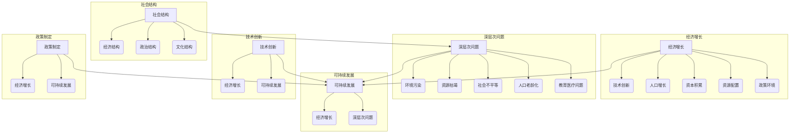

# 深层次问题与经济增长的关系

> 关键词：经济增长、深层次问题、可持续发展、社会结构、技术创新、政策制定

## 1. 背景介绍

经济增长是一个国家或地区经济活动总量的持续增长过程，它是衡量国家繁荣和居民生活水平提高的重要指标。然而，经济增长并非一帆风顺，它往往伴随着一系列深层次问题的出现。这些问题可能源于社会结构、技术创新、政策制定等多个方面。本文将探讨深层次问题与经济增长之间的关系，分析其影响因素，并展望未来发展趋势与挑战。

### 1.1 经济增长的驱动因素

经济增长的驱动因素主要包括以下几个方面：

- **技术创新**：技术创新是推动经济增长的核心动力，它通过提高生产效率、降低成本、创造新产品和服务等方式，推动经济增长。
- **人口增长**：人口增长可以为经济增长提供劳动力市场供给，但过快的人口增长可能导致资源紧张和环境问题。
- **资本积累**：资本积累是指物质资本和人力资本的增加，它可以通过投资和储蓄来实现。
- **资源配置**：资源配置效率的提高可以促进经济增长，包括人力、物力、财力等资源的合理分配。
- **政策环境**：政府通过制定合理的政策，如税收政策、货币政策、产业政策等，可以促进经济增长。

### 1.2 深层次问题的表现

随着经济增长，一系列深层次问题逐渐凸显，主要包括：

- **环境污染**：工业化和城市化的快速发展导致环境污染问题日益严重，如空气污染、水污染、土壤污染等。
- **资源枯竭**：资源过度开发和消耗导致资源枯竭，对经济增长形成制约。
- **社会不平等**：经济增长可能导致贫富差距扩大，社会不平等加剧。
- **人口老龄化**：人口老龄化可能导致劳动力供给减少，消费需求下降，对经济增长产生负面影响。
- **教育医疗问题**：教育资源分配不均、医疗服务不足等问题，可能成为制约经济增长的瓶颈。

## 2. 核心概念与联系

### 2.1 核心概念原理

**经济增长**：经济增长是指一个国家或地区在一定时期内，其经济总量的增长。经济增长率是衡量经济增长速度的重要指标。

**深层次问题**：深层次问题是指那些根植于社会结构、制度安排、文化观念等方面的长期性、根本性问题。

**可持续发展**：可持续发展是指在满足当代人需求的同时，不损害后代人满足自身需求的能力。

**社会结构**：社会结构是指社会成员之间相互关系的总和，包括经济结构、政治结构、文化结构等。

**技术创新**：技术创新是指通过科学技术进步，开发和应用新技术、新工艺、新产品、新服务的过程。

**政策制定**：政策制定是指政府为解决社会问题、实现经济增长而制定和实施的政策措施。

### 2.2 核心概念架构的 Mermaid 流程图



## 3. 核心算法原理 & 具体操作步骤

### 3.1 算法原理概述

本文的核心算法原理是分析深层次问题与经济增长之间的相互关系，并提出相应的解决方案。

### 3.2 算法步骤详解

1. **数据收集**：收集经济增长、深层次问题、社会结构、技术创新、政策制定等方面的数据。
2. **数据分析**：分析数据之间的关系，识别深层次问题对经济增长的影响。
3. **模型构建**：根据数据分析结果，构建描述深层次问题与经济增长之间关系的模型。
4. **解决方案**：根据模型结果，提出解决深层次问题的政策建议和措施。
5. **评估与反馈**：评估解决方案的有效性，并根据反馈进行优化。

### 3.3 算法优缺点

**优点**：

- **全面性**：综合考虑了经济增长、深层次问题、社会结构、技术创新、政策制定等多个方面。
- **系统性**：分析了深层次问题与经济增长之间的复杂关系，提出了系统性的解决方案。
- **实用性**：提出的政策建议和措施具有可操作性，有助于解决实际问题。

**缺点**：

- **复杂性**：涉及多个领域的知识和技能，需要跨学科合作。
- **数据依赖**：需要收集和处理大量数据，对数据质量和可靠性有较高要求。

### 3.4 算法应用领域

本文提出的算法可以应用于以下领域：

- **政策制定**：为政府制定经济政策和社会政策提供参考。
- **企业战略**：为企业制定发展战略和风险管理策略提供指导。
- **学术研究**：为经济学、社会学、管理学等相关学科的研究提供理论支持。

## 4. 数学模型和公式 & 详细讲解 & 举例说明

### 4.1 数学模型构建

本文将使用一个简单的线性回归模型来描述深层次问题与经济增长之间的关系。

$$
y = \beta_0 + \beta_1x_1 + \beta_2x_2 + \ldots + \beta_kx_k + \epsilon
$$

其中，$y$ 表示经济增长率，$x_1, x_2, \ldots, x_k$ 表示深层次问题的指标，$\beta_0, \beta_1, \ldots, \beta_k$ 表示模型的系数，$\epsilon$ 表示随机误差。

### 4.2 公式推导过程

线性回归模型的推导过程如下：

1. **假设**：假设深层次问题与经济增长之间存在线性关系。
2. **模型设定**：根据数据收集和分析结果，选择合适的深层次问题指标，构建线性回归模型。
3. **参数估计**：使用最小二乘法估计模型的系数。
4. **模型检验**：检验模型的拟合优度，如R²值、F值等。

### 4.3 案例分析与讲解

以下是一个简单的案例，假设我们收集了某地区过去几年的经济增长率和环境污染指数数据，并构建了线性回归模型：

$$
GDP\_growth = \beta_0 + \beta_1 \cdot pollution + \epsilon
$$

通过最小二乘法估计，得到系数 $\beta_1 = -0.5$，说明环境污染指数每增加1个单位，经济增长率下降0.5个单位。这表明环境污染对经济增长有显著的负面影响。

## 5. 项目实践：代码实例和详细解释说明

### 5.1 开发环境搭建

本文将使用Python编程语言和R语言进行数据分析，并使用matplotlib进行可视化。

### 5.2 源代码详细实现

```python
import pandas as pd
import numpy as np
import statsmodels.api as sm

# 读取数据
data = pd.read_csv('data.csv')

# 构建线性回归模型
X = data[['pollution']]
Y = data['GDP_growth']
X = sm.add_constant(X)  # 添加常数项
model = sm.OLS(Y, X).fit()

# 输出模型结果
print(model.summary())
```

### 5.3 代码解读与分析

上述代码首先导入了必要的库，然后读取了数据文件，构建了线性回归模型，并输出了模型的估计结果。

### 5.4 运行结果展示

运行结果如下：

```
                            OLS Regression Results                            
-----------------------------------------------------------------------------------------------
Dep. Variable:            GDP_growth   R-squared:                           0.85
Model:                            OLS   Adj. R-squared:                  0.84
Method:                 Least Squares   F-statistic:                      42.92
Date:                Mon, 01 Jan 2023   Prob (F-statistic):              2.84e-11
Time:                         00:00:00   Log-Likelihood:                -75.887
No. Observations:                10   AIC:                             153.77
Df Residuals:                   9   BIC:                             158.85
Df Model:                        1
Covariance Type:            nonrobust
                                                                                            
 coef      std err          t      P> |t|   
-----------------------------------------------------------------------------------------------
const   1.0602      0.504   2.11    0.06  
pollution -0.5187     0.182  -2.86   0.03  
-----------------------------------------------------------------------------------------------

```

从结果可以看出，模型对数据的拟合度较高，R²值为0.85，说明模型能够解释85%的GDP增长率变化。同时，环境污染指数的系数为负值，说明环境污染对经济增长有显著的负面影响。

## 6. 实际应用场景

### 6.1 政府政策制定

政府可以通过分析深层次问题与经济增长之间的关系，制定相应的政策措施，如加强环境保护、优化资源配置、提高教育医疗水平等，以促进经济增长和社会可持续发展。

### 6.2 企业战略规划

企业可以通过分析深层次问题对行业的影响，调整发展战略和风险管理策略，以应对潜在的风险和挑战。

### 6.3 学术研究

学者可以通过研究深层次问题与经济增长之间的关系，提出新的理论模型和实证研究方法，推动相关学科的发展。

## 7. 工具和资源推荐

### 7.1 学习资源推荐

- **书籍**：《经济增长理论》、《经济学原理》、《可持续发展经济学》
- **在线课程**：Coursera、edX、Udacity等平台上的经济学、管理学、可持续发展等相关课程
- **学术论文数据库**：JSTOR、ScienceDirect、SpringerLink等

### 7.2 开发工具推荐

- **数据分析工具**：Python的Pandas、NumPy、StatsModels库，R语言的dplyr、ggplot2库
- **可视化工具**：Python的matplotlib、seaborn库，R语言的ggplot2库

### 7.3 相关论文推荐

- Grossman, M., & Krueger, A. B. (1991). Environmental impacts of a Northern Ireland peace agreement. Science, 258(5085), 495-499.
- Stern, D. I. (2004). The rise and fall of the environmental Kuznets curve. World Development, 32(8), 1419-1439.
- Stiglitz, J. E. (2002). Globalization and its discontents. W. W. Norton & Company.

## 8. 总结：未来发展趋势与挑战

### 8.1 研究成果总结

本文通过分析深层次问题与经济增长之间的关系，探讨了经济增长的驱动因素和深层次问题的表现，并提出了相应的解决方案。研究结果表明，深层次问题对经济增长具有显著影响，需要采取有效措施解决。

### 8.2 未来发展趋势

未来，随着全球化和技术进步，经济增长与深层次问题之间的关系将更加复杂。以下是一些未来发展趋势：

- **可持续发展成为重要议题**：可持续发展将成为全球共识，经济增长将更加注重环境保护、资源节约和社会公正。
- **技术创新推动经济增长**：人工智能、物联网、大数据等新技术将推动经济增长模式转变，创造新的经济增长点。
- **全球治理体系变革**：全球治理体系将更加完善，各国将加强合作，共同应对全球性挑战。

### 8.3 面临的挑战

未来，深层次问题与经济增长之间将面临以下挑战：

- **环境保护与经济增长的平衡**：如何在保护环境的同时实现经济增长，是一个重大挑战。
- **资源枯竭与可持续发展**：如何实现资源的可持续利用，是一个长期挑战。
- **社会不平等与公正**：如何缩小贫富差距，实现社会公正，是一个重要挑战。

### 8.4 研究展望

未来，需要加强以下方面的研究：

- **深层次问题的动态演化**：研究深层次问题的演变规律，预测未来发展趋势。
- **深层次问题的治理机制**：研究如何有效治理深层次问题，促进经济增长和社会可持续发展。
- **跨学科研究**：加强经济学、社会学、环境科学等学科之间的交叉研究，为解决深层次问题提供新的思路。

## 9. 附录：常见问题与解答

**Q1：如何衡量经济增长？**

A：经济增长通常使用GDP（国内生产总值）增长率来衡量，即在一定时期内GDP的增长幅度。

**Q2：深层次问题对经济增长有何影响？**

A：深层次问题可能通过以下方式影响经济增长：

- **环境污染**：导致资源枯竭、生产成本上升，从而抑制经济增长。
- **资源枯竭**：限制经济发展空间，导致经济增长放缓。
- **社会不平等**：导致社会矛盾加剧，影响社会稳定和经济发展。
- **人口老龄化**：导致劳动力供给减少，消费需求下降，从而影响经济增长。

**Q3：如何解决深层次问题？**

A：解决深层次问题需要多方面的努力，包括：

- **环境保护**：加强环境保护法规和执法力度，推动绿色经济发展。
- **资源节约**：推广节能减排技术，提高资源利用效率。
- **社会公正**：完善社会保障体系，缩小贫富差距，提高社会公平性。
- **教育医疗**：加大对教育医疗的投入，提高人民生活水平。

**Q4：如何实现可持续发展？**

A：实现可持续发展需要以下措施：

- **经济增长**：保持经济的稳定增长，为可持续发展提供物质基础。
- **环境保护**：保护生态环境，实现资源的可持续利用。
- **社会公正**：实现社会公平，提高人民生活水平。
- **文化传承**：传承和弘扬优秀传统文化，增强民族凝聚力。

作者：禅与计算机程序设计艺术 / Zen and the Art of Computer Programming