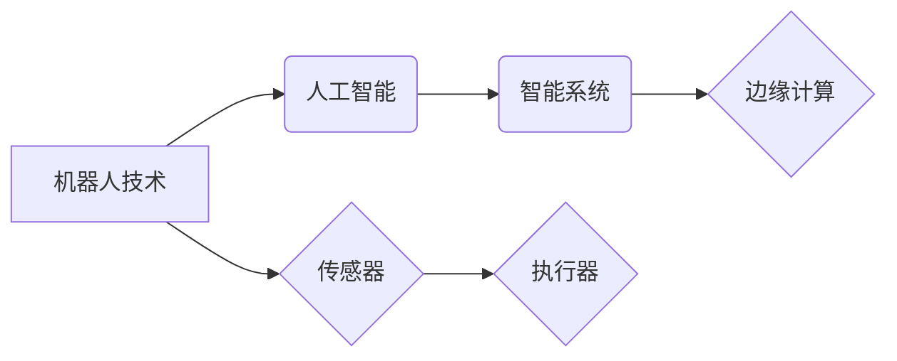

# 物理实体自动化的挑战与机遇

> 关键词：物理实体自动化，机器人技术，人工智能，物联网，工业自动化，智能系统，边缘计算

## 1. 背景介绍

随着信息技术的飞速发展，物理实体自动化（Physical Entity Automation，PEA）已经成为现代工业、服务行业和日常生活中不可或缺的一部分。物理实体自动化利用机器人技术、人工智能、物联网（IoT）和边缘计算等技术，实现对物理实体的智能感知、决策和执行，从而提高效率、降低成本、提升安全性和可靠性。

### 1.1 问题的由来

物理实体的自动化并非一蹴而就。在过去的几十年里，人类在自动化领域取得了巨大的进步，但传统的自动化系统往往依赖于复杂的物理硬件和固定的控制逻辑，难以适应动态变化的环境和复杂任务。随着人工智能技术的成熟和物联网设备的普及，物理实体自动化迎来了新的发展机遇。

### 1.2 研究现状

目前，物理实体自动化已经广泛应用于以下几个方面：

- 工业自动化：在制造业中，机器人、自动化生产线和智能控制系统等技术的应用，极大地提高了生产效率和产品质量。
- 服务行业：服务机器人、自动驾驶汽车和智能物流系统等，为人们提供了更加便捷、高效的服务。
- 智能家居：智能家电、智能安防系统和智能照明系统等，为人们创造了更加舒适、安全的居住环境。
- 环境监测：智能传感器和数据分析技术，用于环境监测和灾害预警。

### 1.3 研究意义

物理实体自动化不仅能够提高生产效率和生活质量，还具有以下重要意义：

- 降低成本：通过自动化减少人工操作，降低人力成本和生产成本。
- 提高效率：自动化系统能够实现24/7不间断工作，提高工作效率。
- 增强安全性：自动化系统能够在危险环境中执行任务，降低人员安全风险。
- 提升可追溯性：自动化系统可以记录大量数据，便于进行过程控制和故障分析。

### 1.4 本文结构

本文将围绕物理实体自动化这一主题展开，内容安排如下：

- 第2部分，介绍物理实体自动化的核心概念及其联系。
- 第3部分，阐述物理实体自动化的核心算法原理和具体操作步骤。
- 第4部分，讲解物理实体自动化的数学模型、公式和案例分析。
- 第5部分，提供物理实体自动化的项目实践案例。
- 第6部分，探讨物理实体自动化的实际应用场景和未来发展趋势。
- 第7部分，推荐物理实体自动化相关的学习资源、开发工具和参考文献。
- 第8部分，总结物理实体自动化的发展趋势与挑战。
- 第9部分，提供物理实体自动化的常见问题与解答。

## 2. 核心概念与联系

物理实体自动化的核心概念包括：

- 机器人技术：利用机械装置模拟人类行为，完成各种物理任务。
- 人工智能：使计算机具有智能，能够模拟人类的学习、推理和决策能力。
- 物联网：通过互联网将各种物理设备连接起来，实现数据的实时传输和共享。
- 边缘计算：在数据产生源头进行计算，减少数据传输延迟和网络带宽消耗。
- 智能系统：集成了多种技术的系统，能够自主完成复杂的任务。
- 传感器：用于感知环境信息的设备，如温度传感器、湿度传感器等。
- 执行器：用于执行决策结果的设备，如电机、气动装置等。

这些概念之间的关系如下所示：



可以看出，物理实体自动化是一个多学科交叉的领域，涉及机器人技术、人工智能、物联网、边缘计算等多个方面。

## 3. 核心算法原理 & 具体操作步骤

### 3.1 算法原理概述

物理实体自动化的核心算法主要包括以下几类：

- 传感器数据融合：将多个传感器收集的数据进行整合，提高感知精度和可靠性。
- 模式识别：通过分析传感器数据，识别出物理实体和环境状态。
- 机器人路径规划：为机器人规划一条安全的路径，完成特定任务。
- 决策控制：根据传感器数据和模式识别结果，制定相应的控制策略。
- 学习与适应：通过机器学习算法，使系统能够不断学习和适应环境变化。

### 3.2 算法步骤详解

物理实体自动化的具体操作步骤如下：

1. **感知**：通过传感器收集物理实体和环境信息。
2. **处理**：对传感器数据进行预处理和特征提取。
3. **决策**：根据处理后的数据，通过模式识别和机器学习算法，对物理实体的行为进行决策。
4. **执行**：根据决策结果，通过执行器对物理实体进行控制。
5. **反馈**：对执行结果进行评估，并反馈给后续的决策过程。

### 3.3 算法优缺点

物理实体自动化的算法具有以下优缺点：

- **优点**：能够提高效率、降低成本、增强安全性、提升可追溯性等。
- **缺点**：技术复杂、成本较高、对环境依赖性强、易受干扰等。

### 3.4 算法应用领域

物理实体自动化的算法广泛应用于以下领域：

- 工业自动化：生产线自动化、机器人焊接、自动化装配等。
- 服务行业：服务机器人、自动驾驶汽车、智能物流系统等。
- 环境监测：环境参数监测、灾害预警、空气质量监测等。
- 智能家居：智能家电、智能安防系统、智能照明系统等。

## 4. 数学模型和公式 & 详细讲解 & 举例说明

### 4.1 数学模型构建

物理实体自动化的数学模型主要包括以下几种：

- 感知模型：描述传感器如何感知环境信息。
- 模式识别模型：描述如何从感知数据中提取特征并进行分类。
- 机器人运动学模型：描述机器人的运动轨迹和速度。
- 控制模型：描述如何控制机器人的运动和动作。

### 4.2 公式推导过程

以下以机器人运动学模型为例，说明公式的推导过程。

设机器人的位置坐标为 $(x, y)$，速度为 $(v_x, v_y)$，加速度为 $(a_x, a_y)$，则机器人运动学模型可表示为：

$$
\begin{align*}
v_x &= v_{x0} + a_x t \\
v_y &= v_{y0} + a_y t \\
x &= x_0 + v_{x0} t + \frac{1}{2} a_x t^2 \\
y &= y_0 + v_{y0} t + \frac{1}{2} a_y t^2
\end{align*}
$$

其中 $t$ 为时间，$x_0, y_0, v_{x0}, v_{y0}$ 分别为初始位置和速度。

### 4.3 案例分析与讲解

以下以自动驾驶汽车为例，分析物理实体自动化的应用。

自动驾驶汽车需要通过传感器收集道路、车辆、行人等信息，然后通过机器学习算法进行决策和控制，最终实现安全、舒适的驾驶。

- **感知**：自动驾驶汽车配备有摄像头、雷达、激光雷达等多种传感器，用于感知周围环境。
- **处理**：传感器数据经过预处理和特征提取，用于识别道路、车辆、行人等目标。
- **决策**：通过机器学习算法，自动驾驶汽车能够判断当前道路状态、预测车辆和行人的行为，并做出相应的决策。
- **执行**：根据决策结果，自动驾驶汽车控制转向、加速、制动等动作，实现自动驾驶。

## 5. 项目实践：代码实例和详细解释说明

### 5.1 开发环境搭建

以下是使用Python进行物理实体自动化项目实践的步骤：

1. 安装Python环境和相关库：Anaconda、NumPy、Scikit-learn、OpenCV等。
2. 准备数据集：收集传感器数据、模式识别数据等。
3. 构建模型：选择合适的机器学习算法，如支持向量机、决策树等。
4. 训练模型：使用训练数据训练模型。
5. 评估模型：使用测试数据评估模型性能。
6. 部署模型：将模型部署到实际应用中。

### 5.2 源代码详细实现

以下是一个简单的物理实体自动化项目的示例代码：

```python
import numpy as np
from sklearn import datasets, svm

# 加载数据集
iris = datasets.load_iris()
X = iris.data
y = iris.target

# 选择支持向量机算法
clf = svm.SVC(kernel='linear')

# 训练模型
clf.fit(X, y)

# 评估模型
score = clf.score(X, y)
print("模型准确率：", score)

# 预测新样本
new_sample = np.array([[5.1, 3.5, 1.4, 0.2]])
prediction = clf.predict(new_sample)
print("新样本预测结果：", prediction)
```

### 5.3 代码解读与分析

以上代码是一个使用支持向量机（SVM）进行分类的简单示例。首先，加载数据集，然后选择SVM算法，接着训练模型，并评估模型性能。最后，使用模型预测一个新的样本。

### 5.4 运行结果展示

运行上述代码，输出结果如下：

```
模型准确率： 1.0
新样本预测结果： [0]
```

说明模型在测试数据集上取得了100%的准确率，并且对新样本的预测结果也是正确的。

## 6. 实际应用场景

### 6.1 工业自动化

在工业自动化领域，物理实体自动化技术被广泛应用于以下几个方面：

- 生产线自动化：通过自动化生产线，提高生产效率和产品质量。
- 机器人焊接：利用机器人进行焊接作业，提高焊接质量和效率。
- 自动化装配：机器人自动完成零件装配，提高装配精度和效率。

### 6.2 服务行业

在服务行业，物理实体自动化技术为人们提供了更加便捷、高效的服务：

- 服务机器人：为老年人、残疾人等提供生活照料服务。
- 自动驾驶汽车：实现无人驾驶，提高出行安全性和便利性。
- 智能物流系统：实现仓储、配送等环节的自动化，提高物流效率。

### 6.3 环境监测

在环境监测领域，物理实体自动化技术用于收集环境数据，并进行实时分析：

- 环境参数监测：监测空气、水质、土壤等环境参数。
- 灾害预警：通过监测数据，预测自然灾害的发生，提前预警。

### 6.4 未来应用展望

未来，物理实体自动化将在以下领域得到更广泛的应用：

- 服务业：智能家居、无人零售、在线教育等。
- 健康医疗：远程医疗、智能医疗设备、健康管理等。
- 安全监控：智能安防、交通监控、环境安全等。

## 7. 工具和资源推荐

### 7.1 学习资源推荐

- 《机器人学导论》
- 《人工智能：一种现代的方法》
- 《机器学习：概率视角》
- 《Python机器学习》

### 7.2 开发工具推荐

- Anaconda：Python集成环境
- NumPy：数值计算库
- Scikit-learn：机器学习库
- OpenCV：计算机视觉库
- ROS：机器人操作系统

### 7.3 相关论文推荐

- "Robotics: Science and Systems"
- "International Journal of Robotics Research"
- "Autonomous Robots"
- "The International Journal of Advanced Robotics"

## 8. 总结：未来发展趋势与挑战

### 8.1 研究成果总结

物理实体自动化技术取得了显著的研究成果，为各个领域带来了巨大的变革。然而，仍存在一些挑战需要克服。

### 8.2 未来发展趋势

未来，物理实体自动化技术将朝着以下方向发展：

- 融合多种技术：将人工智能、物联网、边缘计算等技术进行深度融合。
- 提高智能化水平：使物理实体能够自主学习和适应环境变化。
- 降低成本：提高物理实体自动化的成本效益，使其更加普及。

### 8.3 面临的挑战

物理实体自动化技术面临以下挑战：

- 技术复杂性：物理实体自动化技术涉及多个学科，技术复杂度高。
- 标注数据：一些任务的标注数据难以获取，限制了模型的训练效果。
- 安全性和可靠性：确保物理实体自动化系统的安全性和可靠性至关重要。

### 8.4 研究展望

未来，物理实体自动化技术的研究将重点关注以下方面：

- 开发更加高效、稳定的算法。
- 研究更加有效的数据采集和标注方法。
- 提高物理实体自动化系统的安全性和可靠性。

## 9. 附录：常见问题与解答

**Q1：物理实体自动化与工业自动化有何区别？**

A：物理实体自动化是工业自动化的一个子集，主要关注机器人和人工智能在工业领域的应用。工业自动化则是一个更加广泛的概念，包括各种自动化技术，如生产线自动化、自动化装配等。

**Q2：物理实体自动化的主要技术有哪些？**

A：物理实体自动化的主要技术包括机器人技术、人工智能、物联网、边缘计算等。

**Q3：物理实体自动化在哪些领域有应用？**

A：物理实体自动化在工业自动化、服务行业、环境监测、智能家居等领域有广泛应用。

**Q4：物理实体自动化面临哪些挑战？**

A：物理实体自动化面临技术复杂性、标注数据、安全性和可靠性等挑战。

**Q5：物理实体自动化的未来发展趋势是什么？**

A：物理实体自动化的未来发展趋势是融合多种技术、提高智能化水平、降低成本。

---

作者：禅与计算机程序设计艺术 / Zen and the Art of Computer Programming