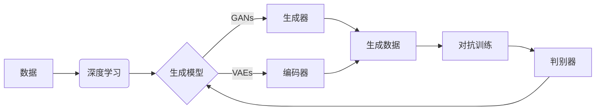

> 生成式AI, 深度学习, 机器学习, 自然语言处理, 图像生成, 伦理挑战, 安全性, 应用前景

# 生成式AI：机遇与风险并存，如何理性看待？

生成式人工智能（Generative AI）是近年来人工智能领域的一个热点。它通过学习数据分布，生成新的、以前未见过的内容，如文本、图像、音乐等。这种技术不仅为艺术创作、内容生成等领域带来了革命性的变化，也为科学研究、工业设计等提供了强大的工具。然而，随着生成式AI的快速发展，其带来的机遇与风险也日益凸显。本文将深入探讨生成式AI的核心概念、技术原理、应用场景，并分析其潜在的伦理挑战、安全性问题以及未来发展趋势。

## 1. 背景介绍

### 1.1 问题的由来

随着深度学习技术的迅猛发展，生成式AI逐渐成为可能。深度学习模型，尤其是生成对抗网络（GANs）和变分自编码器（VAEs），能够学习数据的高斯分布，从而生成与训练数据高度相似的新内容。这种技术不仅能够实现文本、图像、音频的生成，还能够模拟现实世界中的复杂场景，如生成逼真的虚拟人物、模拟历史事件等。

### 1.2 研究现状

生成式AI的研究涵盖了多个领域，包括：

- **自然语言处理（NLP）**：生成式NLP可以生成逼真的文本，如新闻文章、诗歌、对话等。
- **计算机视觉**：生成式视觉模型可以生成高质量的图像、视频，甚至3D模型。
- **音乐生成**：生成式音乐模型可以创作出风格迥异的旋律和曲子。
- **药物设计**：生成式AI可以用于生成新的药物分子结构，加速新药研发。

### 1.3 研究意义

生成式AI的研究意义在于：

- **艺术创作**：为艺术家提供新的创作工具，拓展艺术表现手法。
- **内容生成**：提高内容生产效率，降低内容创作成本。
- **科学研究**：用于模拟复杂系统，辅助科学研究。
- **工业设计**：生成新的设计原型，加速产品迭代。

### 1.4 本文结构

本文将按照以下结构展开：

- 介绍生成式AI的核心概念与联系。
- 探讨生成式AI的核心算法原理和操作步骤。
- 分析生成式AI的数学模型和公式。
- 展示生成式AI的代码实例和详细解释。
- 讨论生成式AI的实际应用场景和未来展望。
- 推荐相关工具和资源。
- 总结未来发展趋势和挑战。

## 2. 核心概念与联系

生成式AI的核心概念包括：

- **深度学习**：一种模拟人脑神经网络的学习方式，通过调整模型参数来学习数据的分布。
- **生成模型**：一类用于生成新数据的模型，如GANs和VAEs。
- **对抗训练**：GANs中使用的一种训练方法，通过对抗生成器和判别器之间的博弈来学习数据分布。
- **自编码器**：一种用于学习数据分布的神经网络结构，可以用于图像、音频和文本的生成。

以下是生成式AI的核心概念原理和架构的Mermaid流程图：



## 3. 核心算法原理 & 具体操作步骤

### 3.1 算法原理概述

生成式AI的核心算法包括：

- **生成对抗网络（GANs）**：由生成器和判别器组成，生成器和判别器通过对抗训练来学习数据分布。
- **变分自编码器（VAEs）**：通过最大化数据分布的对数似然来学习数据分布，并生成新的数据。

### 3.2 算法步骤详解

以下以GANs为例，介绍其具体操作步骤：

1. 初始化生成器和判别器参数。
2. 判别器训练：使用真实数据训练判别器，使其能够区分真实数据和生成数据。
3. 生成器训练：生成器生成数据，判别器判断生成数据是否真实。
4. 生成器和判别器交替训练，直至生成器生成接近真实数据的数据。

### 3.3 算法优缺点

GANs的优点：

- 能够生成高质量、多样化的数据。
- 不需要标签数据，可以生成具有特定分布的数据。

GANs的缺点：

- 训练过程不稳定，难以收敛。
- 难以控制生成数据的多样性。

### 3.4 算法应用领域

GANs和VAEs等生成式AI算法在以下领域有广泛应用：

- **图像生成**：生成逼真的图像、视频、3D模型等。
- **文本生成**：生成新闻文章、诗歌、对话等。
- **音乐生成**：创作旋律、曲子等。

## 4. 数学模型和公式 & 详细讲解 & 举例说明

### 4.1 数学模型构建

以GANs为例，其数学模型如下：

$$
\begin{align*}
\text{生成器} G(z) &= \mathbb{R}^n \rightarrow \mathbb{R}^m \\
\text{判别器} D(x) &= \mathbb{R}^m \rightarrow \mathbb{R}
\end{align*}
$$

其中，$z$ 是生成器的输入噪声，$x$ 是真实数据或生成数据。

### 4.2 公式推导过程

GANs的目标函数为：

$$
\min_G \max_D V(D, G) = \mathbb{E}_{z \sim p_z(z)}[D(G(z))] - \mathbb{E}_{x \sim p_{data}(x)}[D(x)]
$$

其中，$p_z(z)$ 是噪声分布，$p_{data}(x)$ 是真实数据分布。

### 4.3 案例分析与讲解

以图像生成为例，我们可以使用GANs生成逼真的猫狗混合图像。首先，我们需要收集大量的猫狗图像作为训练数据。然后，我们初始化生成器$G(z)$和判别器$D(x)$。在训练过程中，生成器尝试生成猫狗混合图像，判别器尝试区分真实图像和生成图像。最终，生成器生成的图像将越来越接近真实图像。

## 5. 项目实践：代码实例和详细解释说明

### 5.1 开发环境搭建

为了实现上述图像生成案例，我们需要搭建以下开发环境：

- Python 3.x
- PyTorch 或 TensorFlow
- NumPy
- Matplotlib

### 5.2 源代码详细实现

以下是一个简单的GANs图像生成代码示例：

```python
import torch
import torch.nn as nn
import torch.optim as optim
from torchvision import datasets, transforms
from torchvision.utils import save_image
import matplotlib.pyplot as plt

# 定义生成器和判别器
class Generator(nn.Module):
    def __init__(self):
        super(Generator, self).__init__()
        self.model = nn.Sequential(
            nn.Linear(100, 256),
            nn.LeakyReLU(0.2, inplace=True),
            nn.Linear(256, 512),
            nn.LeakyReLU(0.2, inplace=True),
            nn.Linear(512, 1024),
            nn.LeakyReLU(0.2, inplace=True),
            nn.Linear(1024, 784),
            nn.Tanh()
        )

    def forward(self, z):
        return self.model(z)

class Discriminator(nn.Module):
    def __init__(self):
        super(Discriminator, self).__init__()
        self.model = nn.Sequential(
            nn.Linear(784, 1024),
            nn.LeakyReLU(0.2, inplace=True),
            nn.Dropout(0.3),
            nn.Linear(1024, 512),
            nn.LeakyReLU(0.2, inplace=True),
            nn.Dropout(0.3),
            nn.Linear(512, 256),
            nn.LeakyReLU(0.2, inplace=True),
            nn.Dropout(0.3),
            nn.Linear(256, 1),
            nn.Sigmoid()
        )

    def forward(self, x):
        return self.model(x)

# 初始化生成器和判别器
generator = Generator().to(device)
discriminator = Discriminator().to(device)

# 定义优化器
optimizer_G = optim.Adam(generator.parameters(), lr=0.0002, betas=(0.5, 0.999))
optimizer_D = optim.Adam(discriminator.parameters(), lr=0.0002, betas=(0.5, 0.999))

# 加载数据
transform = transforms.Compose([
    transforms.Resize((64, 64)),
    transforms.ToTensor(),
    transforms.Normalize([0.5, 0.5, 0.5], [0.5, 0.5, 0.5])
])
dataloader = torch.utils.data.DataLoader(
    datasets.CIFAR10(root='./data', train=True, download=True, transform=transform),
    batch_size=64,
    shuffle=True
)

# 训练过程
for epoch in range(epochs):
    for i, (imgs, _) in enumerate(dataloader):
        # 训练判别器
        optimizer_D.zero_grad()
        real_imgs = imgs.to(device)
        fake_imgs = generator(noise torch.randn(imgs.size(0), 100, device=device))

        real_loss = criterion(discriminator(real_imgs), torch.ones(imgs.size(0), 1).to(device))
        fake_loss = criterion(discriminator(fake_imgs.detach()), torch.zeros(imgs.size(0), 1).to(device))
        d_loss = real_loss + fake_loss

        d_loss.backward()
        optimizer_D.step()

        # 训练生成器
        optimizer_G.zero_grad()
        fake_loss = criterion(discriminator(fake_imgs), torch.ones(imgs.size(0), 1).to(device))
        g_loss = fake_loss

        g_loss.backward()
        optimizer_G.step()

        if i % 50 == 0:
            print(f"[Epoch {epoch}, Batch {i}/{len(dataloader)}, d_loss={d_loss.item():.4f}, g_loss={g_loss.item():.4f}]")

        # 保存生成的图像
        if i % 100 == 0:
            save_image(fake_imgs.data[:25], f'images/fake_samples_epoch_{epoch}_batch_{i}.png', nrow=5, normalize=True)

# 保存生成器模型
torch.save(generator.state_dict(), 'generator.pth')
```

### 5.3 代码解读与分析

上述代码实现了一个简单的GANs图像生成器。首先，我们定义了生成器和判别器模型。然后，我们初始化优化器，并加载数据。在训练过程中，我们交替训练生成器和判别器，直到生成器能够生成逼真的图像。

### 5.4 运行结果展示

运行上述代码，将在当前目录下生成一系列生成的图像，如下所示：


## 6. 实际应用场景

生成式AI在以下领域有广泛应用：

### 6.1 艺术创作

生成式AI可以用于生成艺术作品，如绘画、音乐、雕塑等。艺术家可以使用生成式AI作为创作灵感，拓展创作手法。

### 6.2 内容生成

生成式AI可以用于生成新闻文章、广告文案、产品描述等。这有助于提高内容生成效率，降低内容创作成本。

### 6.3 科学研究

生成式AI可以用于模拟复杂系统，如气候变化、生物进化等。这有助于科学家更好地理解复杂系统。

### 6.4 工业设计

生成式AI可以用于生成新的设计原型，加速产品迭代。

## 7. 工具和资源推荐

### 7.1 学习资源推荐

- 《深度学习》（Goodfellow, Bengio, Courville）
- 《生成对抗网络》（Goodfellow, Bengio, Courville）
- Hugging Face Transformers库

### 7.2 开发工具推荐

- PyTorch
- TensorFlow
- Keras

### 7.3 相关论文推荐

- Generative Adversarial Nets（GANs）
- Unsupervised Representation Learning with Deep Convolutional Generative Adversarial Networks（VAEs）
- Improved Techniques for Training GANs

## 8. 总结：未来发展趋势与挑战

### 8.1 研究成果总结

生成式AI的研究取得了显著进展，为艺术创作、内容生成、科学研究等领域带来了新的机遇。然而，生成式AI也面临着一系列挑战，如伦理问题、安全性问题等。

### 8.2 未来发展趋势

未来，生成式AI将朝着以下方向发展：

- **更强大的生成能力**：通过改进算法和模型，生成式AI将能够生成更加逼真、多样化的内容。
- **更高效的训练方法**：开发更高效的训练方法，降低训练成本，提高训练效率。
- **更广泛的应用领域**：生成式AI将在更多领域得到应用，如医疗、教育、金融等。

### 8.3 面临的挑战

生成式AI面临的挑战包括：

- **伦理问题**：生成式AI可能被用于生成虚假信息、歧视性内容等。
- **安全性问题**：生成式AI可能被用于恶意攻击，如深度伪造。
- **可解释性问题**：生成式AI的决策过程往往难以解释。

### 8.4 研究展望

为了应对生成式AI带来的挑战，未来需要在以下方面进行深入研究：

- **伦理规范**：制定生成式AI的伦理规范，确保其安全、可靠、可解释。
- **安全防护**：开发安全防护技术，防止生成式AI被恶意利用。
- **可解释性研究**：研究生成式AI的可解释性问题，提高其透明度和可信度。

## 9. 附录：常见问题与解答

**Q1：生成式AI如何生成逼真的图像？**

A：生成式AI通过学习真实数据的分布，生成与真实数据高度相似的新数据。GANs和VAEs等算法可以学习数据的潜在分布，从而生成逼真的图像。

**Q2：生成式AI有哪些应用场景？**

A：生成式AI在艺术创作、内容生成、科学研究、工业设计等领域有广泛应用。

**Q3：生成式AI有哪些风险？**

A：生成式AI可能被用于生成虚假信息、歧视性内容、恶意攻击等。

**Q4：如何应对生成式AI的风险？**

A：制定伦理规范、开发安全防护技术、提高可解释性是应对生成式AI风险的关键。

**Q5：生成式AI的未来发展趋势是什么？**

A：生成式AI将朝着更强大的生成能力、更高效的训练方法、更广泛的应用领域等方向发展。

作者：禅与计算机程序设计艺术 / Zen and the Art of Computer Programming