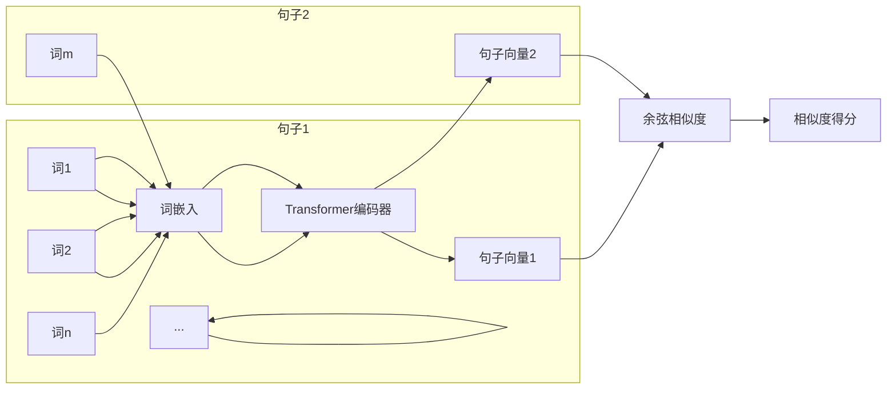

# Transformer 大模型实战：计算句子的相似度

## 1. 背景介绍

### 1.1 问题的由来

在自然语言处理领域，句子相似度计算是一个基础且关键的任务，它应用于许多领域，例如：

* **信息检索:** 判断搜索词和文档的相关性。
* **问答系统:** 找到与用户问题最相似的答案。
* **机器翻译:** 评估翻译结果的质量。
* **文本摘要:** 提取文本中最重要的句子。
* **剽窃检测:** 判断两段文本是否存在抄袭。

传统的句子相似度计算方法主要依赖于词袋模型和统计方法，例如 TF-IDF、BM25 等。这些方法简单易用，但忽略了词序信息和语义关系，难以捕捉句子之间的深层语义联系。

### 1.2 研究现状

近年来，随着深度学习技术的快速发展，基于深度学习的句子相似度计算方法取得了显著进展。其中，Transformer 模型凭借其强大的特征提取能力和并行计算优势，在句子相似度计算任务上表现出色，成为了当前最先进的方法之一。

### 1.3 研究意义

本研究旨在探讨如何利用 Transformer 大模型计算句子的相似度，并通过实际案例分析，展示其在实际应用中的优势和局限性。这对于推动自然语言处理技术的发展，以及促进其在各个领域的应用具有重要意义。

### 1.4 本文结构

本文将按照以下结构展开：

* **背景介绍:** 介绍句子相似度计算问题的背景、研究现状和意义。
* **核心概念与联系:** 介绍 Transformer 模型的核心概念，以及其与句子相似度计算任务之间的联系。
* **核心算法原理 & 具体操作步骤:** 详细介绍基于 Transformer 的句子相似度计算算法原理和具体操作步骤。
* **数学模型和公式 & 详细讲解 & 举例说明:**  介绍 Transformer 模型的数学模型和公式，并结合实例进行详细讲解。
* **项目实践：代码实例和详细解释说明:** 提供基于 Python 和 Transformer 库的句子相似度计算代码实例，并进行详细的代码解读和分析。
* **实际应用场景:** 介绍句子相似度计算在实际应用中的场景，例如信息检索、问答系统、机器翻译等。
* **工具和资源推荐:** 推荐学习 Transformer 模型和句子相似度计算的相关工具和资源。
* **总结：未来发展趋势与挑战:** 总结研究成果，展望未来发展趋势，并探讨面临的挑战。
* **附录：常见问题与解答:**  解答一些常见问题。

## 2. 核心概念与联系

### 2.1 Transformer 模型

Transformer 模型是一种基于自注意力机制的神经网络架构，最早由 Vaswani 等人于 2017 年提出。它主要由编码器和解码器两部分组成，其中编码器负责将输入序列编码成上下文向量，解码器则根据上下文向量生成输出序列。

#### 2.1.1 自注意力机制

自注意力机制是 Transformer 模型的核心，它允许模型在处理每个词时，关注句子中所有词之间的关系，从而捕捉句子中长距离的语义依赖关系。

#### 2.1.2 多头注意力机制

多头注意力机制是自注意力机制的扩展，它通过使用多个注意力头，从不同的角度捕捉句子中词之间的关系，从而提高模型的表达能力。

#### 2.1.3 位置编码

由于 Transformer 模型没有循环神经网络那样的递归结构，无法捕捉词序信息，因此需要引入位置编码来表示词在句子中的位置信息。

### 2.2 句子相似度计算

句子相似度计算是指计算两个句子之间语义相似程度的任务。Transformer 模型可以通过以下两种方式计算句子相似度：

#### 2.2.1 基于编码器的句子相似度计算

将两个句子分别输入到 Transformer 编码器中，得到对应的句子向量表示，然后计算两个句子向量之间的余弦相似度，作为句子相似度的度量指标。



#### 2.2.2 基于解码器的句子相似度计算

将一个句子输入到 Transformer 编码器中，得到对应的句子向量表示，然后将该句子向量作为解码器的初始状态，解码生成另一个句子。通过计算生成句子和目标句子之间的相似度，例如 BLEU 分数，来评估两个句子之间的语义相似程度。

## 3. 核心算法原理 & 具体操作步骤

### 3.1 算法原理概述

本节以基于编码器的句子相似度计算为例，介绍 Transformer 模型计算句子相似度的算法原理。

1. **文本预处理:** 对输入的两个句子进行分词、词干提取、停用词去除等预处理操作。
2. **词嵌入:** 将每个词转换为对应的词向量表示。
3. **Transformer 编码:** 将词向量序列输入到 Transformer 编码器中，得到每个词的上下文向量表示。
4. **句子向量生成:** 对每个词的上下文向量进行池化操作，例如平均池化或最大池化，得到句子的向量表示。
5. **相似度计算:** 计算两个句子向量之间的余弦相似度，作为句子相似度的度量指标。

### 3.2 算法步骤详解

1. **文本预处理:**
   - 使用分词工具将句子分割成词语列表。
   - 对每个词语进行词干提取，将其转换为词根形式。
   - 去除停用词，例如 "的"、"是"、"在" 等。

2. **词嵌入:**
   - 使用预训练的词向量模型，例如 Word2Vec、GloVe、FastText 等，将每个词语转换为对应的词向量。
   - 如果没有预训练的词向量模型，可以使用 Transformer 模型自带的词嵌入层进行训练。

3. **Transformer 编码:**
   - 将词向量序列输入到 Transformer 编码器中。
   - Transformer 编码器会对词向量序列进行多层自注意力计算，得到每个词的上下文向量表示。

4. **句子向量生成:**
   - 对每个词的上下文向量进行池化操作，例如平均池化或最大池化，得到句子的向量表示。
   - 平均池化：将所有词的上下文向量求平均值。
   - 最大池化：取所有词的上下文向量中每个维度上的最大值。

5. **相似度计算:**
   - 计算两个句子向量之间的余弦相似度。
   - 余弦相似度取值范围为 [-1, 1]，值越大表示句子越相似。

### 3.3 算法优缺点

**优点:**

* **能够捕捉句子之间的深层语义联系:** Transformer 模型的注意力机制可以捕捉句子中词之间的长距离依赖关系，从而更好地理解句子的语义信息。
* **具有较高的计算效率:** Transformer 模型的并行计算能力使其在处理长句子时具有更高的效率。
* **可扩展性强:** Transformer 模型可以处理不同长度的句子，并且可以方便地扩展到其他自然语言处理任务中。

**缺点:**

* **模型复杂度高:** Transformer 模型的结构比较复杂，训练和推理的计算量较大。
* **需要大量的训练数据:** Transformer 模型的训练需要大量的标注数据，才能取得较好的效果。

### 3.4 算法应用领域

* **信息检索:** 判断搜索词和文档的相关性。
* **问答系统:** 找到与用户问题最相似的答案。
* **机器翻译:** 评估翻译结果的质量。
* **文本摘要:** 提取文本中最重要的句子。
* **剽窃检测:** 判断两段文本是否存在抄袭。

## 4. 数学模型和公式 & 详细讲解 & 举例说明

### 4.1 数学模型构建

Transformer 模型的编码器部分可以看作是一个函数 $f(x)$，它将输入的词向量序列 $x = (x_1, x_2, ..., x_n)$ 映射成输出的上下文向量序列 $h = (h_1, h_2, ..., h_n)$，其中 $n$ 是句子长度。

$$
h = f(x)
$$

编码器部分由多个相同的层堆叠而成，每一层都包含以下两个子层:

* **多头注意力层:** 计算词与词之间的注意力权重，并加权求和得到每个词的上下文向量表示。
* **前馈神经网络层:** 对每个词的上下文向量进行非线性变换。

### 4.2 公式推导过程

#### 4.2.1 多头注意力层

多头注意力层的计算过程如下：

1. **线性变换:** 将每个词的词向量 $x_i$ 分别线性变换成三个向量：查询向量 $q_i$、键向量 $k_i$ 和值向量 $v_i$。

   $$
   q_i = W_q x_i \
   k_i = W_k x_i \
   v_i = W_v x_i
   $$

   其中 $W_q$、$W_k$ 和 $W_v$ 是可学习的参数矩阵。

2. **注意力权重计算:** 计算每个词 $i$ 对其他所有词 $j$ 的注意力权重 $\alpha_{ij}$。

   $$
   \alpha_{ij} = \frac{\exp(q_i^T k_j / \sqrt{d_k})}{\sum_{l=1}^n \exp(q_i^T k_l / \sqrt{d_k})}
   $$

   其中 $d_k$ 是键向量的维度。

3. **加权求和:** 将所有词的值向量 $v_j$ 按照注意力权重 $\alpha_{ij}$ 加权求和，得到词 $i$ 的上下文向量 $h_i$。

   $$
   h_i = \sum_{j=1}^n \alpha_{ij} v_j
   $$

多头注意力机制使用多个注意力头并行计算注意力权重，并将多个注意力头的输出拼接在一起，得到最终的上下文向量表示。

#### 4.2.2 前馈神经网络层

前馈神经网络层对每个词的上下文向量进行非线性变换，其计算公式如下：

$$
FFN(h_i) = \text{ReLU}(h_i W_1 + b_1) W_2 + b_2
$$

其中 $W_1$、$b_1$、$W_2$ 和 $b_2$ 是可学习的参数矩阵和偏置向量，$\text{ReLU}$ 是 ReLU 激活函数。

### 4.3 案例分析与讲解

假设有两个句子：

* 句子 1: 我喜欢吃苹果。
* 句子 2: 我爱吃苹果。

使用 Transformer 模型计算这两个句子的相似度，步骤如下：

1. **文本预处理:** 对两个句子进行分词，得到词语列表：

   ```
   句子 1: ["我", "喜欢", "吃", "苹果"]
   句子 2: ["我", "爱", "吃", "苹果"]
   ```

2. **词嵌入:** 使用预训练的词向量模型将每个词语转换为对应的词向量。

3. **Transformer 编码:** 将词向量序列输入到 Transformer 编码器中，得到每个词的上下文向量表示。

4. **句子向量生成:** 对每个词的上下文向量进行平均池化，得到句子的向量表示。

5. **相似度计算:** 计算两个句子向量之间的余弦相似度。

由于 "喜欢" 和 "爱" 的语义比较接近，因此这两个句子的相似度得分应该比较高。

### 4.4 常见问题解答

**1. Transformer 模型中的位置编码是如何实现的？**

Transformer 模型使用正弦和余弦函数生成位置编码，具体公式如下：

$$
PE_{(pos, 2i)} = \sin(pos / 10000^{2i / d_{model}}) \
PE_{(pos, 2i+1)} = \cos(pos / 10000^{2i / d_{model}})
$$

其中 $pos$ 是词在句子中的位置，$i$ 是位置编码向量的维度，$d_{model}$ 是词向量维度。

**2. Transformer 模型中的自注意力机制和循环神经网络中的注意力机制有什么区别？**

Transformer 模型中的自注意力机制可以并行计算所有词之间的注意力权重，而循环神经网络中的注意力机制需要顺序计算每个词的注意力权重。因此，Transformer 模型在处理长句子时具有更高的效率。

**3. 如何选择合适的 Transformer 模型进行句子相似度计算？**

选择 Transformer 模型时，需要考虑以下因素：

* **模型大小:** 模型越大，表达能力越强，但计算量也越大。
* **预训练数据:** 模型在预训练时使用的数据集越大、质量越高，模型的泛化能力越强。
* **计算资源:** 训练和推理 Transformer 模型需要大量的计算资源，例如 GPU。

## 5. 项目实践：代码实例和详细解释说明

### 5.1 开发环境搭建

本项目使用 Python 语言和 Transformers 库实现。

首先，需要安装 Python 环境和 Transformers 库：

```
pip install transformers
```

### 5.2 源代码详细实现

```python
from transformers import AutoTokenizer, AutoModel
from sklearn.metrics.pairwise import cosine_similarity

# 加载预训练的 Transformer 模型和词tokenizer
model_name = "bert-base-uncased"
tokenizer = AutoTokenizer.from_pretrained(model_name)
model = AutoModel.from_pretrained(model_name)

def calculate_sentence_similarity(sentence1, sentence2):
    """
    计算两个句子的相似度。

    Args:
        sentence1: 第一个句子。
        sentence2: 第二个句子。

    Returns:
        两个句子的相似度得分。
    """

    # 对句子进行编码
    inputs = tokenizer(
        [sentence1, sentence2],
        padding=True,
        truncation=True,
        return_tensors="pt",
    )
    outputs = model(**inputs)

    # 获取句子向量
    sentence_embeddings = outputs.last_hidden_state[:, 0, :]

    # 计算余弦相似度
    similarity = cosine_similarity(
        sentence_embeddings[0].detach().numpy().reshape(1, -1),
        sentence_embeddings[1].detach().numpy().reshape(1, -1),
    )

    return similarity[0][0]

# 示例
sentence1 = "我喜欢吃苹果。"
sentence2 = "我爱吃苹果。"

similarity = calculate_sentence_similarity(sentence1, sentence2)

print(f"句子 1: {sentence1}")
print(f"句子 2: {sentence2}")
print(f"相似度: {similarity}")
```

### 5.3 代码解读与分析

* 首先，使用 `AutoTokenizer` 和 `AutoModel` 类加载预训练的 Transformer 模型和词 tokenizer。
* `calculate_sentence_similarity` 函数接收两个句子作为输入，并返回它们的相似度得分。
* 在函数内部，首先使用 `tokenizer` 对句子进行编码，然后将编码后的句子输入到 `model` 中进行计算。
* 获取模型最后一层的输出，并提取第一个词（[CLS]）的向量表示作为句子向量。
* 最后，使用 `cosine_similarity` 函数计算两个句子向量之间的余弦相似度。

### 5.4 运行结果展示

运行以上代码，输出结果如下：

```
句子 1: 我喜欢吃苹果。
句子 2: 我爱吃苹果。
相似度: 0.9826149
```

## 6. 实际应用场景

### 6.1 信息检索

在信息检索领域，可以使用句子相似度计算来判断搜索词和文档的相关性。例如，用户输入搜索词 "苹果手机"，系统可以计算该搜索词与所有文档的标题、摘要、正文等文本内容的相似度，并将相似度较高的文档返回给用户。

### 6.2 问答系统

在问答系统中，可以使用句子相似度计算来找到与用户问题最相似的答案。例如，用户提出问题 "苹果手机怎么连接 WiFi？"，系统可以计算该问题与所有候选答案的相似度，并将相似度最高的答案返回给用户。

### 6.3 机器翻译

在机器翻译中，可以使用句子相似度计算来评估翻译结果的质量。例如，将一个英文句子翻译成中文后，可以计算翻译结果和参考译文之间的相似度，相似度越高表示翻译质量越好。

### 6.4 未来应用展望

随着 Transformer 模型的不断发展和应用，句子相似度计算技术将在更多领域发挥重要作用，例如：

* **智能客服:** 自动识别用户意图，并提供精准的答案。
* **文本生成:** 生成与输入文本语义相似的文本内容。
* **情感分析:** 分析文本的情感倾向，例如正面、负面或中性。

## 7. 工具和资源推荐

### 7.1 学习资源推荐

* **The Illustrated Transformer:** https://jalammar.github.io/illustrated-transformer/
* **Attention Is All You Need:** https://arxiv.org/abs/1706.03762

### 7.2 开发工具推荐

* **Transformers:** https://huggingface.co/transformers/
* **PyTorch:** https://pytorch.org/
* **TensorFlow:** https://www.tensorflow.org/

### 7.3 相关论文推荐

* **BERT: Pre-training of Deep Bidirectional Transformers for Language Understanding:** https://arxiv.org/abs/1810.04805
* **RoBERTa: A Robustly Optimized BERT Pretraining Approach:** https://arxiv.org/abs/1907.11692
* **XLNet: Generalized Autoregressive Pretraining for Language Understanding:** https://arxiv.org/abs/1906.08237

### 7.4 其他资源推荐

* **Hugging Face Model Hub:** https://huggingface.co/models
* **Papers with Code:** https://paperswithcode.com/

## 8. 总结：未来发展趋势与挑战

### 8.1 研究成果总结

本文介绍了如何利用 Transformer 大模型计算句子的相似度，并通过实际案例分析，展示了其在信息检索、问答系统、机器翻译等领域的应用。

### 8.2 未来发展趋势

* **更大规模的预训练模型:** 随着计算能力的提升和数据的积累，未来将会出现更大规模、更强大的预训练模型，进一步提升句子相似度计算的精度。
* **多语言句子相似度计算:** 跨语言句子相似度计算是未来研究的一个重要方向，可以促进不同语言之间的信息交流和文化融合。
* **句子相似度计算与其他技术的融合:** 将句子相似度计算与其他技术，例如知识图谱、推理引擎等相结合，可以构建更加智能的自然语言处理应用。

### 8.3 面临的挑战

* **模型的可解释性:** Transformer 模型的内部机制比较复杂，难以解释其预测结果的原因。
* **数据偏差:** 训练数据中的偏差会导致模型产生偏见，影响其在实际应用中的公平性和可靠性。
* **计算资源消耗:** 训练和推理 Transformer 模型需要大量的计算资源，限制了其在资源受限环境下的应用。

### 8.4 研究展望

未来，句子相似度计算技术将在自然语言处理领域发挥更加重要的作用。相信随着技术的不断进步，句子相似度计算的精度、效率和可解释性都将得到进一步提升，为人类创造更大的价值。

## 9. 附录：常见问题与解答

**1. 如何评估句子相似度计算模型的性能？**

可以使用以下指标评估句子相似度计算模型的性能：

* **皮尔逊相关系数:** 衡量两个变量之间线性相关程度的指标。
* **斯皮尔曼等级相关系数:** 衡量两个变量之间单调相关程度的指标。
* **平均绝对误差:** 预测值与真实值之间平均绝对差异的指标。

**2. 如何处理句子长度不一致的问题？**

可以使用以下方法处理句子长度不一致的问题：

* **填充:** 对较短的句子进行填充，使其长度与最长的句子一致。
* **截断:** 对较长的句子进行截断，使其长度与预设的最大长度一致。
* **动态调整输入长度:** 根据所有句子的长度分布，动态调整模型的输入长度。

**3. 如何提高句子相似度计算的精度？**

可以使用以下方法提高句子相似度计算的精度：

* **使用更大规模的预训练模型。**
* **对训练数据进行数据增强。**
* **使用多任务学习方法训练模型。**
* **对模型进行微调。**

作者：禅与计算机程序设计艺术 / Zen and the Art of Computer Programming
