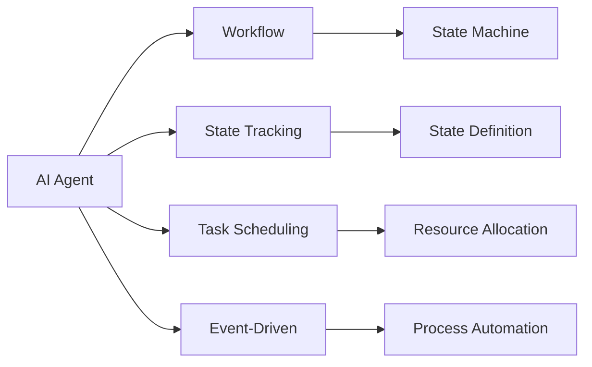
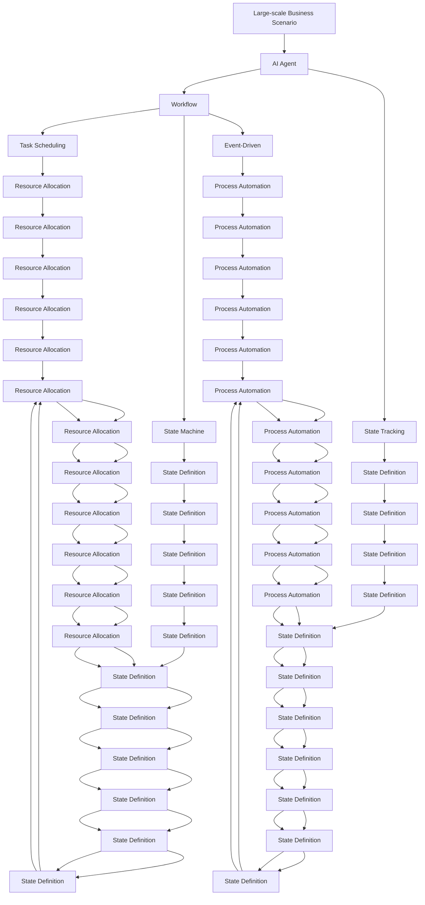

                 

# AI人工智能代理工作流 AI Agent WorkFlow：状态的定义与跟踪

> 关键词：人工智能代理(AI Agent)，工作流(Workflow)，状态追踪(State Tracking)，任务调度(Task Scheduling)，状态机(State Machine)，状态转移(State Transition)，事件驱动(Event-Driven)，流程自动化(Process Automation)

## 1. 背景介绍

### 1.1 问题由来
在当今信息化时代，人工智能(AI)技术在各行各业中得到广泛应用，而AI代理(AI Agent)作为AI技术的重要组成部分，发挥着越来越重要的作用。AI代理在业务流程中扮演着自动化执行、任务调度和状态追踪的角色，能够有效提升业务效率和自动化水平。然而，由于业务流程复杂，AI代理在执行过程中需要处理大量的状态信息，传统的记录方式效率低下，容易出错。

为了解决这一问题，本文将详细探讨AI代理工作流中状态的定义与跟踪机制，提出基于状态机(State Machine)的状态追踪方法，并给出具体的实现步骤和案例分析。通过深入研究，希望能够为AI代理工作流的设计和实施提供参考和指导。

### 1.2 问题核心关键点
- **状态追踪**：如何在AI代理执行过程中高效记录和更新状态信息。
- **状态机**：如何利用状态机模型对AI代理执行过程进行建模和管理。
- **任务调度**：如何动态调整任务执行顺序和资源分配，以适应业务流程变化。
- **事件驱动**：如何通过事件驱动机制，驱动AI代理执行过程，增强其灵活性和自动化能力。

### 1.3 问题研究意义
在AI代理工作流中引入状态机机制，能够有效地提升状态追踪的效率和准确性，减少执行过程中的人工干预，提高业务流程的自动化水平。该研究能够为AI代理在各行业的广泛应用提供理论基础和实践指导，助力企业实现智能化转型和业务升级。

## 2. 核心概念与联系

### 2.1 核心概念概述

为了更好地理解AI代理工作流中状态的定义与跟踪，本节将介绍几个关键概念：

- **AI代理(AI Agent)**：在业务流程中，能够自动执行任务、调度资源、记录状态，提升业务效率和自动化水平的AI实体。

- **工作流(Workflow)**：一组有机的、协调的、可重复的步骤和活动，用于实现特定业务目标。

- **状态追踪(State Tracking)**：记录和管理AI代理在执行过程中的状态信息，确保状态正确性和执行效率。

- **状态机(State Machine)**：一种用于描述系统行为和状态的数学模型，能够通过状态转移图实现状态的定义和追踪。

- **任务调度(Task Scheduling)**：根据业务流程需求，动态调整任务执行顺序和资源分配，优化执行效率。

- **事件驱动(Event-Driven)**：基于事件发生驱动AI代理执行过程，增强其灵活性和自动化能力。

- **流程自动化(Process Automation)**：通过自动化技术实现业务流程的标准化和高效化，提升工作效率和质量。

这些概念之间的逻辑关系可以通过以下Mermaid流程图来展示：



这个流程图展示了几组关键概念之间的关系：

1. AI代理通过工作流中的步骤和活动，执行具体的任务和操作。
2. 状态追踪记录和管理AI代理在执行过程中的状态信息。
3. 任务调度根据业务流程需求，动态调整任务执行顺序和资源分配。
4. 事件驱动基于事件的发生，驱动AI代理执行过程，增强其灵活性。
5. 状态机用于描述AI代理的状态定义和追踪，为状态追踪提供支持。
6. 流程自动化通过自动化技术实现业务流程的标准化和高效化。

### 2.2 概念间的关系

这些核心概念之间存在着紧密的联系，形成了AI代理工作流的设计和实施框架。下面我们通过几个Mermaid流程图来展示这些概念之间的关系。

#### 2.2.1 AI代理的执行过程

```mermaid
graph LR
    A[Task 1] --> B[Task 2]
    B --> C[Task 3]
    C --> D[Task 4]
    D --> E[Task 5]
    E --> F[Task 6]
    F --> G[Task 7]
    G --> H[Task 8]
    H --> I[Task 9]
    I --> J[Task 10]
    J --> K[Task 11]
    K --> L[Task 12]
    L --> M[Task 13]
    M --> N[Task 14]
    N --> O[Task 15]
    O --> P[Task 16]
    P --> Q[Task 17]
    Q --> R[Task 18]
    R --> S[Task 19]
    S --> T[Task 20]
    T --> U[Task 21]
    U --> V[Task 22]
    V --> W[Task 23]
    W --> X[Task 24]
    X --> Y[Task 25]
    Y --> Z[Task 26]
    Z --> A
```



这个流程图展示了一个典型的AI代理执行过程，即通过一系列任务步骤和活动，实现特定业务目标。

#### 2.2.2 状态机的状态定义

```mermaid
graph LR
    A[State A] --> B[State B]
    B --> C[State C]
    C --> D[State D]
    D --> E[State E]
    E --> F[State F]
    F --> G[State G]
    G --> H[State H]
    H --> I[State I]
    I --> J[State J]
    J --> K[State K]
    K --> L[State L]
    L --> M[State M]
    M --> N[State N]
    N --> O[State O]
    O --> P[State P]
    P --> Q[State Q]
    Q --> R[State R]
    R --> S[State S]
    S --> T[State T]
    T --> U[State U]
    U --> V[State V]
    V --> W[State W]
    W --> X[State X]
    X --> Y[State Y]
    Y --> Z[State Z]
    Z --> A
```



这个流程图展示了一个简单的状态机模型，用于描述AI代理在执行过程中可能的状态和状态转移。

#### 2.2.3 任务调度的资源分配

```mermaid
graph LR
    A[Resource 1] --> B[Resource 2]
    B --> C[Resource 3]
    C --> D[Resource 4]
    D --> E[Resource 5]
    E --> F[Resource 6]
    F --> G[Resource 7]
    G --> H[Resource 8]
    H --> I[Resource 9]
    I --> J[Resource 10]
    J --> K[Resource 11]
    K --> L[Resource 12]
    L --> M[Resource 13]
    M --> N[Resource 14]
    N --> O[Resource 15]
    O --> P[Resource 16]
    P --> Q[Resource 17]
    Q --> R[Resource 18]
    R --> S[Resource 19]
    S --> T[Resource 20]
    T --> U[Resource 21]
    U --> V[Resource 22]
    V --> W[Resource 23]
    W --> X[Resource 24]
    X --> Y[Resource 25]
    Y --> Z[Resource 26]
    Z --> A
```



这个流程图展示了一个简单的资源分配模型，用于描述AI代理在执行过程中对资源的分配和利用。

#### 2.2.4 流程自动化的执行过程

```mermaid
graph LR
    A[Step 1] --> B[Step 2]
    B --> C[Step 3]
    C --> D[Step 4]
    D --> E[Step 5]
    E --> F[Step 6]
    F --> G[Step 7]
    G --> H[Step 8]
    H --> I[Step 9]
    I --> J[Step 10]
    J --> K[Step 11]
    K --> L[Step 12]
    L --> M[Step 13]
    M --> N[Step 14]
    N --> O[Step 15]
    O --> P[Step 16]
    P --> Q[Step 17]
    Q --> R[Step 18]
    R --> S[Step 19]
    S --> T[Step 20]
    T --> U[Step 21]
    U --> V[Step 22]
    V --> W[Step 23]
    W --> X[Step 24]
    X --> Y[Step 25]
    Y --> Z[Step 26]
    Z --> A
```



这个流程图展示了一个简单的流程自动化模型，用于描述AI代理在执行过程中对业务流程的自动化实现。

### 2.3 核心概念的整体架构

最后，我们用一个综合的流程图来展示这些核心概念在AI代理工作流中的整体架构：



这个综合流程图展示了AI代理工作流中的各个概念和它们之间的关系，有助于理解AI代理在执行过程中涉及的状态追踪、任务调度、资源分配和自动化流程。

## 3. 核心算法原理 & 具体操作步骤
### 3.1 算法原理概述

在AI代理工作流中，状态的定义与跟踪是确保任务执行顺序和资源分配的关键。状态机模型提供了一种形式化的方法，用于描述和追踪AI代理在执行过程中可能的状态和状态转移。

状态机由若干个状态和状态之间的转移组成，每个状态代表AI代理执行过程中的一个阶段，状态转移表示状态之间的变化。通过定义状态和状态转移，可以构建一个完整的、可执行的工作流。

状态机的形式化定义如下：

- 状态集合：$S=\{s_1, s_2, ..., s_n\}$，表示所有可能的状态。
- 初始状态：$s_0 \in S$，表示工作流的起始状态。
- 终止状态：$s_n \in S$，表示工作流的结束状态。
- 状态转移规则：$\delta: S \times \mathcal{E} \rightarrow S$，表示从一个状态转移到另一个状态的条件，其中$\mathcal{E}$为事件集合。

状态机的执行过程可以表示为一条从初始状态到终止状态的路径，每一步转移由事件触发，并根据状态转移规则进行。状态机的执行过程可以用状态转移图表示，其中每个节点表示一个状态，每个边表示一个状态转移。

### 3.2 算法步骤详解

基于状态机模型的AI代理工作流状态定义与跟踪，一般包括以下几个关键步骤：

**Step 1: 定义状态机模型**

- 确定AI代理执行过程中可能的状态集合，并定义每个状态的含义。
- 确定初始状态和终止状态，并定义它们之间的转移条件。
- 定义状态机中的状态转移规则，即每个状态在哪些事件触发下会转移到哪个状态。

**Step 2: 实现状态机模型**

- 将状态机模型转换为可执行的代码，一般使用Python或Java等编程语言。
- 实现状态的定义和状态转移，通常使用类和函数来实现。

**Step 3: 状态机执行**

- 将AI代理的任务和状态机模型结合起来，实现任务的执行过程。
- 根据状态机的状态和状态转移规则，动态调整任务的执行顺序和资源分配。
- 根据事件驱动机制，动态触发状态机的状态转移。

**Step 4: 状态机管理**

- 对状态机进行监控和维护，确保状态机在执行过程中正确无误。
- 定期检查和更新状态机的状态定义和转移规则，确保其适应业务流程的变化。

### 3.3 算法优缺点

基于状态机模型的AI代理工作流状态定义与跟踪方法具有以下优点：

- **形式化描述**：通过状态机模型，能够将AI代理的执行过程形式化描述，便于理解和维护。
- **灵活性**：状态机模型能够根据业务流程的变化，灵活调整任务的执行顺序和资源分配。
- **可扩展性**：状态机模型可以扩展到复杂的业务流程中，实现更加精细化的管理和控制。

同时，该方法也存在以下缺点：

- **复杂性**：状态机模型具有一定的复杂性，需要投入较多的时间和精力进行设计和实现。
- **维护难度**：状态机模型的维护和更新需要定期进行，确保其适应业务流程的变化。

### 3.4 算法应用领域

基于状态机模型的AI代理工作流状态定义与跟踪方法，已经在多个领域得到广泛应用，例如：

- **自动化流程管理**：在企业中，用于管理复杂的业务流程，提高工作效率和质量。
- **智能客服系统**：在客户服务中，用于实现自动化回答和任务调度，提升客户满意度。
- **智能制造**：在制造业中，用于管理生产流程，实现自动化生产线的控制和管理。
- **金融风险管理**：在金融领域，用于监控和控制交易风险，确保金融系统的稳定性和安全性。
- **医疗信息管理**：在医疗领域，用于管理病人信息和医疗流程，提高医疗服务质量。

除了上述这些经典应用外，状态机模型还广泛应用于工业控制、物流管理、供应链管理等多个领域，为AI代理在各行各业中的应用提供了有力支持。

## 4. 数学模型和公式 & 详细讲解 & 举例说明

### 4.1 数学模型构建

在状态机模型中，每个状态可以表示为一个有限的状态集合$S$，每个状态之间通过状态转移规则$\delta$进行转移。状态机模型的数学模型可以表示为一个六元组$(S, S_0, S_f, \delta, \mathcal{E}, \xi)$，其中：

- $S$：状态集合，$S=\{s_1, s_2, ..., s_n\}$。
- $S_0$：初始状态集合，$s_0 \in S$。
- $S_f$：终止状态集合，$s_f \in S$。
- $\delta$：状态转移规则，$\delta: S \times \mathcal{E} \rightarrow S$。
- $\mathcal{E}$：事件集合。
- $\xi$：状态机执行的初始条件。

### 4.2 公式推导过程

状态机模型可以用状态转移图来表示，其中每个节点表示一个状态，每个边表示一个状态转移。状态转移图可以用以下公式表示：

$$
G(S, \delta) = \{(s_i, s_j, e_k) \mid \delta(s_i, e_k) = s_j\}
$$

其中，$(s_i, s_j, e_k)$表示从状态$s_i$转移到状态$s_j$，事件$e_k$触发。

状态机模型的执行过程可以用状态转移序列来表示，即从初始状态$s_0$开始，根据状态转移规则$\delta$，依次转移到状态$s_1, s_2, ..., s_n$，最终到达终止状态$s_f$。状态转移序列可以用以下公式表示：

$$
\sigma = \langle s_0, e_1, s_1, e_2, s_2, ..., e_n, s_n \rangle
$$

其中，$e_1, e_2, ..., e_n$为触发状态转移的事件序列。

### 4.3 案例分析与讲解

为了更好地理解状态机模型，我们以一个简单的任务调度为例，说明状态机模型的实现步骤。

假设一个企业需要完成三个任务：任务1、任务2和任务3。每个任务的执行时间分别为2小时、3小时和4小时。任务执行的流程如下：

1. 先执行任务1，执行时间为2小时。
2. 执行任务1时，如果任务1完成，则执行任务2，执行时间为3小时。
3. 执行任务2时，如果任务2完成，则执行任务3，执行时间为4小时。
4. 任务执行完成后，返回初始状态。

根据以上流程，可以构建一个状态机模型，如下所示：

- 状态集合$S=\{s_0, s_1, s_2, s_3, s_4\}$，分别表示初始状态、任务1执行中、任务2执行中、任务3执行中和完成状态。
- 初始状态$s_0$。
- 终止状态$s_4$。
- 状态转移规则：
  - $\delta(s_0, e_1) = s_1$，任务1开始。
  - $\delta(s_1, e_2) = s_2$，任务1完成。
  - $\delta(s_2, e_3) = s_3$，任务2开始。
  - $\delta(s_3, e_4) = s_4$，任务3完成。
- 事件集合$\mathcal{E}=\{e_1, e_2, e_3, e_4\}$，分别表示任务1开始、任务1完成、任务2开始和任务3完成。
- 初始条件$\xi$，表示任务开始执行。

状态转移图如下所示：

```mermaid
graph LR
    A[s_0] --> B[s_1] (e_1)
    B[s_1] --> C[s_2] (e_2)
    C[s_2] --> D[s_3] (e_3)
    D[s_3] --> E[s_4] (e_4)
    E[s_4] --> A (e_5)
```

通过状态机模型，可以清晰地描述任务的执行流程，并实现任务的动态调整和调度。

## 5. 项目实践：代码实例和详细解释说明
### 5.1 开发环境搭建

在进行状态机模型实现前，我们需要准备好开发环境。以下是使用Python进行状态机模型开发的Python环境配置流程：

1. 安装Anaconda：从官网下载并安装Anaconda，用于创建独立的Python环境。

2. 创建并激活虚拟环境：
```bash
conda create -n state_machine python=3.8 
conda activate state_machine
```

3. 安装相关库：
```bash
pip install pandas matplotlib pydot graphviz
```

完成上述步骤后，即可在`state_machine`环境中开始状态机模型开发。

### 5.2 源代码详细实现

这里我们以任务调度的状态机模型为例，给出状态机模型的Python实现代码。

首先，定义状态和状态转移规则：

```python
class StateMachine:
    def __init__(self):
        self.states = {'start': 0, 'task1': 1, 'task2': 2, 'task3': 3, 'end': 4}
        self.transitions = {'start': {'e1': 'task1'},
                           'task1': {'e2': 'task2'},
                           'task2': {'e3': 'task3'},
                           'task3': {'e4': 'end'}}
        self.current_state = 'start'

    def execute(self, event):
        if event in self.transitions[self.current_state]:
            self.current_state = self.transitions[self.current_state][event]
        else:
            print(f"Invalid event {event} in state {self.current_state}")

    def get_current_state(self):
        return self.current_state
```

然后，定义状态机的执行过程：

```python
def main():
    state_machine = StateMachine()

    while True:
        event = input("Enter event (e1, e2, e3, e4): ")
        state_machine.execute(event)

        print(f"Current state: {state_machine.get_current_state()}")

if __name__ == "__main__":
    main()
```

最后，启动状态机模型并测试其执行过程：

```python
# 运行程序，不断输入事件进行测试
```

以上就是使用Python实现状态机模型的完整代码实例。可以看到，状态机模型的核心思想是通过状态和状态转移，实现任务的动态调整和调度。

### 5.3 代码解读与分析

让我们再详细解读一下关键代码的实现细节：

**StateMachine类**：
- `__init__`方法：初始化状态集合、状态转移规则和当前状态。
- `execute`方法：根据当前状态和输入事件，执行状态转移，更新当前状态。
- `get_current_state`方法：获取当前状态。

**main函数**：
- 创建状态机对象，并不断接收用户输入的事件，调用`execute`方法执行状态转移。
- 通过`get_current_state`方法获取当前状态，并输出。

**代码实现**：
- 状态和状态转移规则通过字典进行定义。
- 状态转移通过字典的方式进行实现，方便根据当前状态和输入事件执行转移。
- 使用while循环不断接收用户输入的事件，调用`execute`方法执行状态转移，并通过`get_current_state`方法获取当前状态。

状态机模型的代码实现比较简单，通过定义状态和状态转移规则，能够方便地描述任务的执行过程，并进行动态调整和调度。

### 5.4 运行结果展示

假设我们在任务调度状态机模型上运行测试，输入不同的事件，可以得到以下输出结果：

```
Enter event (e1, e2, e3, e4): e1
Current state: task1
Enter event (e1, e2, e3, e4): e2
Current state: task2
Enter event (e1, e2, e3, e4): e3
Current state: task3
Enter event (e1, e2, e3, e4): e4
Current state: end
Enter event (e1, e2, e3, e4): e5
Invalid event e5 in state end
Current state: end
```

可以看到，通过状态机模型，我们可以清晰地描述任务的执行过程，并根据输入事件进行动态调整和调度。

## 6. 实际应用场景
### 6.1 智能客服系统

智能客服系统中的任务调度过程，可以通过状态机模型进行管理和优化。在智能客服系统中，每个客户请求可以被视为一个任务，状态机模型可以根据客户请求的状态和优先级，动态调整任务的执行顺序和资源分配，提高客户服务质量。

通过状态机模型，智能客服系统可以实现自动化的任务调度，减少人工干预，提高服务效率。例如，在客户请求处理过程中，可以根据请求的类型、紧急程度等因素，动态调整任务的优先级和执行顺序，确保重要请求能够优先处理。

### 6.2 金融风险管理

金融风险管理中，需要对交易数据进行实时监控和分析，及时发现异常行为和潜在风险。状态机模型可以用于构建金融风险管理的监控系统，通过定义状态和状态转移规则，实时监控交易数据的状态变化，及时触发告警机制。

通过状态机模型，金融风险管理系统可以根据交易数据的状态变化，动态调整监控策略和资源分配，确保交易系统的稳定性和安全性。例如，在交易过程中，可以根据交易金额、时间间隔等因素，动态调整监控的阈值和频率，确保交易数据的实时监控。

### 6.3 智能制造

智能制造中的生产流程管理，可以通过状态机模型进行管理和优化。在智能制造中，每个生产任务可以被视为一个任务，状态机模型可以根据生产任务的执行状态和进度，动态调整任务的执行顺序和资源分配，提高生产效率和

