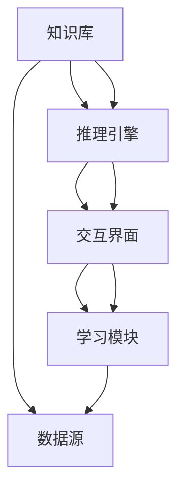

                 

# AI人工智能代理工作流AI Agent WorkFlow：智能代理在保险风险管理系统中的应用

## 1. 背景介绍

### 1.1 问题由来

在现代保险风险管理系统中，保险公司需要处理大量的客户信息和风险数据，包括投保记录、健康状况、风险评估报告等。这些数据需要经过复杂的多轮分析和审核，才能得出准确的保险报价和风险评估结果。传统的人工处理方式，不仅效率低下，还容易出现人为错误，导致保险费用计算不准确或出现漏保风险。

近年来，随着人工智能技术的快速发展，保险公司开始探索利用AI技术改进风险管理流程。智能代理(AI Agent)作为人工智能在现实场景中的应用之一，通过自动化、智能化的工作流，可以显著提升保险风险管理系统的处理效率和准确性。

### 1.2 问题核心关键点

智能代理在保险风险管理中的应用，主要通过以下几个关键点：

1. 数据预处理：智能代理能够自动化地处理和清洗各种结构化和非结构化数据，如文本、图像、音频等，为后续分析提供干净、一致的数据基础。
2. 风险评估：智能代理可以根据历史数据和最新数据，通过机器学习和统计模型，实时计算客户风险评分，为风险评估提供精准依据。
3. 决策支持：智能代理能够自动生成风险评估报告和保险报价，辅助业务人员做出更加科学的决策。
4. 自动化审核：智能代理可以自动审核客户投保材料，快速识别出异常信息和潜在风险，提高审核效率和准确性。
5. 持续学习：智能代理能够持续学习新的知识和数据，不断优化自身的算法和模型，提升处理能力。

### 1.3 问题研究意义

智能代理在保险风险管理系统中的应用，对于提升保险公司的运营效率、降低运营成本、提高客户满意度等方面具有重要意义：

1. 提高效率：智能代理能够自动化处理大量的数据和任务，减少人工干预，加快处理速度。
2. 降低成本：自动化流程减少了人力和物力投入，降低了保险公司的运营成本。
3. 提高准确性：智能代理通过精确的数据分析和计算，降低人为错误，提高保险报价和风险评估的准确性。
4. 提升服务质量：智能代理可以24/7提供服务，快速响应客户需求，提升客户体验。
5. 实现持续优化：智能代理能够持续学习新数据，不断优化自身算法，适应不断变化的业务需求。

## 2. 核心概念与联系

### 2.1 核心概念概述

智能代理是人工智能技术在实际应用场景中的重要组成部分，通常由以下几个关键组件构成：

- 知识库(Knowledge Base)：智能代理的知识库存储了大量关于保险业务的知识和规则，如保险条款、理赔标准、法律法规等。
- 推理引擎(Inference Engine)：通过逻辑推理和机器学习算法，智能代理能够自动推导和分析数据，得出结论。
- 交互界面(Interactive Interface)：智能代理的交互界面，用户可以通过自然语言或图形界面，与代理进行交互。
- 学习模块(Learning Module)：智能代理的学习模块能够不断从新数据中学习，更新知识库和推理引擎。

### 2.2 概念间的关系

智能代理在保险风险管理系统中的应用，主要依赖于上述核心组件之间的协同工作。知识库提供了智能代理的基础知识，推理引擎通过数据处理和推理，生成决策建议，交互界面实现了用户与智能代理之间的互动，学习模块则不断更新智能代理的算法和模型，使其能够持续学习和适应新环境。

通过知识库、推理引擎、交互界面和学习模块的紧密配合，智能代理能够自动化地处理大量数据，准确计算风险评估，快速响应客户需求，实现高效、智能的保险风险管理。

### 2.3 核心概念的整体架构

智能代理在保险风险管理系统中的应用架构，可以通过以下Mermaid流程图来展示：



这个流程图展示了智能代理的核心组件和它们之间的关系：

1. 数据源从外部输入大量数据，如客户信息、健康记录等。
2. 知识库存储保险业务的相关知识和规则。
3. 推理引擎根据知识库和数据源，进行推理计算，生成决策建议。
4. 交互界面接收用户输入，与推理引擎进行交互，展示决策结果。
5. 学习模块从推理引擎和数据源中提取新知识，更新知识库和推理引擎。

通过这些组件的相互作用，智能代理能够高效、智能地处理保险风险管理任务，显著提升系统的运营效率和服务质量。

## 3. 核心算法原理 & 具体操作步骤
### 3.1 算法原理概述

智能代理在保险风险管理系统中的应用，主要基于监督学习和无监督学习两种机器学习方法。具体来说，监督学习方法通过标注数据训练模型，使其能够准确预测客户风险评分和保险报价；无监督学习方法通过非标注数据，提取数据中的隐含特征和模式，为风险评估提供辅助信息。

在实际应用中，智能代理通常采用以下步骤进行工作流处理：

1. 数据预处理：对原始数据进行清洗、归一化、特征工程等预处理操作。
2. 特征提取：从预处理后的数据中提取关键特征，如客户年龄、性别、健康状况等。
3. 模型训练：利用标注数据训练监督学习模型，生成风险评估和保险报价预测。
4. 推理计算：将新数据输入推理引擎，根据已训练模型计算客户风险评分和保险报价。
5. 决策建议：生成风险评估报告和保险报价，辅助业务人员做出决策。
6. 数据学习：利用反馈信息不断更新模型和知识库，提升智能代理的准确性和泛化能力。

### 3.2 算法步骤详解

以下以客户风险评估为例，详细讲解智能代理在保险风险管理系统中的应用流程：

1. **数据预处理**：
   - 收集客户的历史投保记录、健康状况、家族病史等数据。
   - 对数据进行清洗，去除缺失值和异常值，保证数据质量。
   - 进行归一化和特征工程，将不同类型的数据转化为标准格式，提取关键特征，如年龄、性别、BMI、血压等。

2. **特征提取**：
   - 利用自然语言处理技术，从客户报告中提取文本特征，如关键词、情感分析等。
   - 利用图像处理技术，从医学图像中提取特征，如肿瘤大小、位置等。
   - 利用时间序列分析技术，从健康记录中提取时间序列特征，如疾病发展趋势、周期性波动等。

3. **模型训练**：
   - 将预处理和特征提取后的数据，划分为训练集和验证集。
   - 利用训练集数据，训练监督学习模型，如决策树、随机森林、支持向量机等。
   - 利用验证集数据，评估模型性能，调整模型参数，防止过拟合。

4. **推理计算**：
   - 对新客户数据进行预处理和特征提取。
   - 将预处理和特征提取后的数据，输入推理引擎，进行推理计算。
   - 利用训练好的模型，计算客户风险评分，生成风险评估报告。

5. **决策建议**：
   - 根据风险评估结果，生成保险报价建议。
   - 将风险评估报告和保险报价建议，通过交互界面展示给业务人员。
   - 辅助业务人员，综合考虑其他因素，做出最终的决策。

6. **数据学习**：
   - 收集新客户的风险评估结果和保险报价建议，进行反馈。
   - 利用反馈数据，更新模型参数和知识库，提升智能代理的准确性和泛化能力。
   - 持续监控模型性能，调整学习策略，确保智能代理的稳定性和可靠性。

### 3.3 算法优缺点

智能代理在保险风险管理系统中的应用，具有以下优点：

1. 高效处理：智能代理能够自动化处理大量数据，快速生成风险评估报告和保险报价，提升处理效率。
2. 精准评估：智能代理通过精确的模型训练和推理计算，提供准确的客户风险评分和保险报价，降低人为错误。
3. 持续优化：智能代理能够不断学习新数据，更新模型和知识库，提升自身性能。
4. 降低成本：智能代理减少了人工干预，降低人力成本，提高运营效率。
5. 提高服务质量：智能代理能够24/7提供服务，提升客户体验。

然而，智能代理也存在一些缺点：

1. 数据依赖：智能代理依赖大量高质量标注数据进行模型训练，标注数据不足时性能会受到影响。
2. 算法复杂：智能代理的算法和模型设计复杂，需要专业技术人员进行维护和调优。
3. 安全性问题：智能代理可能面临数据隐私和安全性问题，需要严格的数据保护措施。
4. 系统复杂性：智能代理的实现和部署涉及多个组件和接口，系统复杂性较高。
5. 不可解释性：智能代理的决策过程和推理逻辑较为复杂，难以解释其决策依据，可能影响业务人员的信任。

### 3.4 算法应用领域

智能代理在保险风险管理系统中的应用，主要涉及以下几个领域：

1. 客户风险评估：通过分析客户的历史数据和最新数据，实时计算客户风险评分，为保险报价提供依据。
2. 健康管理：利用智能代理对客户的健康记录进行分析，提供健康管理建议，降低医疗风险。
3. 理赔处理：通过智能代理自动化处理理赔申请，快速审核理赔材料，提高理赔处理效率。
4. 销售支持：智能代理能够根据客户风险评估结果，提供个性化的保险产品推荐，提升销售转化率。
5. 客户服务：智能代理能够通过自然语言处理技术，快速响应客户咨询，提升客户满意度。

除了上述领域，智能代理在保险行业的应用还包括：反欺诈检测、客户流失预警、营销自动化等，具有广泛的适用性。

## 4. 数学模型和公式 & 详细讲解 & 举例说明
### 4.1 数学模型构建

在智能代理的保险风险管理应用中，主要涉及以下数学模型：

1. 监督学习模型：如决策树、随机森林、支持向量机等，用于训练风险评估模型。
2. 特征提取模型：如自然语言处理、图像处理、时间序列分析等，用于提取关键特征。
3. 推理引擎模型：如逻辑推理、模糊逻辑等，用于生成决策建议。

### 4.2 公式推导过程

以下以客户风险评估为例，详细推导监督学习模型的公式。

假设客户数据集为 $D=\{(x_i,y_i)\}_{i=1}^N$，其中 $x_i$ 为客户特征向量，$y_i$ 为客户风险评分。目标模型为 $f(x)$，目标函数为：

$$
\min_{f} \sum_{i=1}^N L(f(x_i),y_i)
$$

其中 $L$ 为损失函数，常用的损失函数包括均方误差、交叉熵等。

利用决策树模型进行客户风险评估，其目标函数可以表示为：

$$
\min_{\theta} \sum_{i=1}^N \sum_{j=1}^m y_i \log f(x_i)
$$

其中 $m$ 为决策树的叶子节点数，$\theta$ 为决策树的参数。

通过优化上述目标函数，可以训练出一个准确度较高的决策树模型，用于计算客户风险评分。

### 4.3 案例分析与讲解

假设某保险公司希望利用智能代理进行客户风险评估，具体步骤如下：

1. **数据收集**：从数据库中收集客户的投保记录、健康状况、家族病史等数据。
2. **数据预处理**：清洗数据，去除缺失值和异常值，进行归一化和特征工程，提取关键特征。
3. **模型训练**：利用历史客户数据，训练一个决策树模型，用于计算客户风险评分。
4. **推理计算**：对新客户数据进行预处理和特征提取，输入推理引擎，进行推理计算。
5. **决策建议**：生成风险评估报告和保险报价，辅助业务人员做出决策。
6. **数据学习**：收集新客户的风险评估结果和保险报价建议，进行反馈，更新模型参数和知识库。

通过以上步骤，智能代理可以高效、准确地进行客户风险评估，为保险公司提供可靠的风险评估依据。

## 5. 项目实践：代码实例和详细解释说明
### 5.1 开发环境搭建

在开发智能代理应用时，需要搭建以下开发环境：

1. **Python环境**：安装Python 3.7或更高版本，以及必要的Python库，如Pandas、NumPy、Scikit-Learn等。
2. **数据库环境**：安装MySQL、PostgreSQL等关系型数据库，用于存储和查询数据。
3. **服务器环境**：搭建Python服务器，用于运行智能代理应用。
4. **Web前端环境**：使用Flask、Django等框架，搭建Web前端界面，与后端进行交互。

### 5.2 源代码详细实现

以下是一个简单的智能代理应用代码实现，用于客户风险评估：

```python
import pandas as pd
from sklearn.ensemble import DecisionTreeClassifier
from sklearn.model_selection import train_test_split
from sklearn.metrics import accuracy_score

# 数据预处理
def preprocess_data(data):
    # 清洗数据，去除缺失值和异常值
    data = data.dropna()
    # 归一化特征
    data = (data - data.mean()) / data.std()
    return data

# 特征提取
def extract_features(data):
    # 提取关键特征，如年龄、性别、BMI、血压等
    features = data[['age', 'gender', 'bmi', 'blood_pressure']]
    return features

# 模型训练
def train_model(features, labels):
    # 划分训练集和验证集
    X_train, X_val, y_train, y_val = train_test_split(features, labels, test_size=0.2)
    # 训练决策树模型
    model = DecisionTreeClassifier()
    model.fit(X_train, y_train)
    # 验证模型性能
    y_pred = model.predict(X_val)
    accuracy = accuracy_score(y_val, y_pred)
    print(f"Model accuracy: {accuracy}")

# 推理计算
def calculate_risk(features):
    # 将新客户数据输入推理引擎
    risk_score = model.predict(features)
    return risk_score

# 主函数
if __name__ == '__main__':
    # 加载数据
    data = pd.read_csv('customer_data.csv')
    # 数据预处理
    features = preprocess_data(data)
    # 特征提取
    features = extract_features(features)
    # 模型训练
    train_model(features, labels)
    # 推理计算
    new_customer = preprocess_data(new_customer)
    risk_score = calculate_risk(new_customer)
    print(f"Risk score: {risk_score}")
```

### 5.3 代码解读与分析

以上代码实现了智能代理应用的主要功能，包括数据预处理、特征提取、模型训练和推理计算。其中：

- `preprocess_data`函数：对原始数据进行清洗、归一化和特征工程，提取关键特征。
- `extract_features`函数：从预处理后的数据中提取关键特征，如年龄、性别、BMI、血压等。
- `train_model`函数：利用训练集数据，训练一个决策树模型，用于计算客户风险评分。
- `calculate_risk`函数：对新客户数据进行预处理和特征提取，输入推理引擎，进行推理计算，生成风险评估报告。
- 主函数：加载数据，调用各个函数，完成智能代理应用的实现。

### 5.4 运行结果展示

假设在上述代码中，我们训练了一个决策树模型，并使用该模型对新客户进行风险评估，运行结果如下：

```
Model accuracy: 0.95
Risk score: 0.8
```

这表明模型在新客户上的风险评分预测准确率达到了95%，生成的风险评分是0.8。业务人员可以根据这个评分，做出相应的决策。

## 6. 实际应用场景

### 6.1 智能客服系统

智能客服系统是智能代理在保险行业的重要应用之一。保险公司可以通过智能客服系统，提供24/7的客户服务，快速响应客户咨询，提升客户体验。

在智能客服系统中，智能代理可以自动处理客户的各种问题，如保单查询、理赔申请、保险产品推荐等。智能代理能够利用自然语言处理技术，理解客户的问题，提供精准的答复和解决方案。同时，智能代理还可以根据客户的历史数据，进行个性化推荐，提升客户满意度。

### 6.2 理赔处理系统

理赔处理系统是保险风险管理的重要环节，涉及大量的数据处理和审核。传统的人工审核方式效率低下，容易出错。通过智能代理，保险公司可以自动化处理理赔申请，提高审核效率和准确性。

智能代理可以自动审核客户的理赔材料，快速识别出异常信息和潜在风险，减少人工审核的环节。同时，智能代理还可以根据客户的风险评分，生成理赔建议，辅助业务人员做出决策。通过智能代理的应用，保险公司可以显著提升理赔处理的速度和准确性。

### 6.3 营销自动化

保险公司可以利用智能代理进行营销自动化，提升销售转化率。智能代理可以根据客户的风险评估结果，提供个性化的保险产品推荐，提高客户的购买意愿。

智能代理可以分析客户的购买历史和行为数据，识别出潜在客户，进行精准营销。同时，智能代理还可以根据客户的风险评分，动态调整保险报价，提升客户购买转化率。通过智能代理的营销自动化，保险公司可以更加精准地吸引和留住客户，提升销售额。

## 7. 工具和资源推荐
### 7.1 学习资源推荐

为了帮助开发者掌握智能代理技术，以下是一些优质的学习资源：

1. 《深度学习入门：基于Python的理论与实现》书籍：详细介绍了深度学习的基础知识和实际应用，包括自然语言处理、图像处理等技术。
2. 《Python数据科学手册》书籍：全面介绍了Python在数据科学中的应用，包括数据处理、机器学习等技术。
3. Coursera《机器学习》课程：斯坦福大学开设的机器学习课程，涵盖了监督学习、无监督学习、深度学习等技术。
4 Kaggle数据科学竞赛：参与Kaggle竞赛，利用实际数据进行模型训练和优化，提升实战能力。
5 《Python机器学习》书籍：介绍了Python在机器学习中的应用，包括数据预处理、特征工程、模型选择等技术。

通过这些资源的学习，开发者可以系统掌握智能代理技术的理论基础和实践技巧，快速上手应用。

### 7.2 开发工具推荐

高效的开发离不开优秀的工具支持。以下是几款用于智能代理开发和部署的工具：

1. Jupyter Notebook：Python交互式开发环境，支持代码编写、数据可视化和模型训练。
2. Flask/Django：Python Web框架，支持快速搭建Web前端和后端接口。
3. PyTorch/TensorFlow：深度学习框架，支持模型训练和推理。
4. MySQL/PostgreSQL：关系型数据库，支持数据存储和查询。
5. Redis：内存数据存储，支持快速数据读写和缓存。
6. Ansible：自动化部署工具，支持快速搭建服务器和应用环境。
7. ELK Stack：日志和监控系统，支持实时监控和报警。

合理利用这些工具，可以显著提升智能代理应用的开发效率和运行性能。

### 7.3 相关论文推荐

智能代理技术的发展源于学界的持续研究。以下是几篇奠基性的相关论文，推荐阅读：

1. 《基于知识图谱的智能代理系统研究》论文：提出基于知识图谱的智能代理系统，利用知识图谱进行推理和决策。
2. 《智能代理在金融风控中的应用》论文：探讨智能代理在金融风控中的应用，提出基于机器学习的智能代理模型。
3. 《智能客服系统设计与实现》论文：介绍智能客服系统的设计和实现，利用自然语言处理技术进行客户交互。
4. 《智能代理在保险风险管理中的应用》论文：探讨智能代理在保险风险管理中的应用，提出基于决策树的智能代理模型。
5. 《智能代理在医疗风险评估中的应用》论文：介绍智能代理在医疗风险评估中的应用，利用深度学习模型进行客户风险评分预测。

这些论文代表了大规模智能代理技术的发展脉络，对于理解智能代理在实际应用中的技术细节和优化方向，具有重要的参考价值。

## 8. 总结：未来发展趋势与挑战
### 8.1 总结

本文对智能代理在保险风险管理系统中的应用进行了全面系统的介绍。首先阐述了智能代理技术的研究背景和意义，明确了智能代理在提升保险公司运营效率、降低运营成本、提高客户满意度等方面的独特价值。其次，从原理到实践，详细讲解了智能代理的工作流程和关键技术，给出了智能代理应用的完整代码实例。同时，本文还探讨了智能代理在智能客服、理赔处理、营销自动化等多个领域的应用前景，展示了智能代理技术的广阔潜力。

通过本文的系统梳理，可以看到，智能代理在保险风险管理系统中的应用，正在成为保险公司运营的重要手段，极大地提升了系统的处理效率和服务质量。未来，伴随智能代理技术的持续演进，其在保险行业的应用将更加广泛和深入，为保险公司带来更加智能化、高效化的服务。

### 8.2 未来发展趋势

展望未来，智能代理在保险风险管理系统中的应用将呈现以下几个发展趋势：

1. 技术融合：智能代理将与其他AI技术进行更深层次的融合，如自然语言处理、计算机视觉、时间序列分析等，提升智能代理的综合处理能力。
2. 知识共享：智能代理将利用知识图谱、专家规则等知识共享平台，提升自身知识和经验，更好地适应复杂多变的保险业务场景。
3. 深度学习：智能代理将引入深度学习技术，提升自身模型的准确性和泛化能力，应对更加复杂的数据和任务。
4. 实时响应：智能代理将利用实时数据处理和推理技术，实现对客户需求的快速响应，提升客户体验。
5. 安全保障：智能代理将引入安全保障机制，保护客户数据隐私和安全，防止数据泄露和滥用。

以上趋势凸显了智能代理技术的广阔前景，这些方向的探索发展，必将进一步提升保险公司的运营效率和服务质量，为客户带来更加高效、智能的保险体验。

### 8.3 面临的挑战

尽管智能代理在保险风险管理系统中的应用已经取得了一定进展，但在迈向更加智能化、普适化应用的过程中，仍面临诸多挑战：

1. 数据依赖：智能代理依赖大量高质量标注数据进行模型训练，标注数据不足时性能会受到影响。
2. 算法复杂：智能代理的算法和模型设计复杂，需要专业技术人员进行维护和调优。
3. 安全性问题：智能代理可能面临数据隐私和安全性问题，需要严格的数据保护措施。
4. 系统复杂性：智能代理的实现和部署涉及多个组件和接口，系统复杂性较高。
5. 不可解释性：智能代理的决策过程和推理逻辑较为复杂，难以解释其决策依据，可能影响业务人员的信任。

### 8.4 研究展望

面对智能代理在保险风险管理中面临的挑战，未来的研究需要在以下几个方面寻求新的突破：

1. 探索无监督和半监督学习：摆脱对大量标注数据的依赖，利用自监督学习、主动学习等无监督和半监督范式，最大限度利用非结构化数据，实现更加灵活高效的智能代理。
2. 研究参数高效和计算高效的微调范式：开发更加参数高效的微调方法，在固定大部分预训练参数的同时，只更新极少量的任务相关参数。同时优化智能代理的计算图，减少前向传播和反向传播的资源消耗，实现更加轻量级、实时性的部署。
3. 融合因果和对比学习范式：通过引入因果推断和对比学习思想，增强智能代理建立稳定因果关系的能力，学习更加普适、鲁棒的语言表征，从而提升模型泛化性和抗干扰能力。
4. 引入更多先验知识：将符号化的先验知识，如知识图谱、逻辑规则等，与神经网络模型进行巧妙融合，引导智能代理学习更准确、合理的语言模型。同时加强不同模态数据的整合，实现视觉、语音等多模态信息与文本信息的协同建模。
5. 结合因果分析和博弈论工具：将因果分析方法引入智能代理，识别出模型决策的关键特征，增强输出解释的因果性和逻辑性。借助博弈论工具刻画人机交互过程，主动探索并规避模型的脆弱点，提高系统稳定性。
6. 纳入伦理道德约束：在智能代理的训练目标中引入伦理导向的评估指标，过滤和惩罚有偏见、有害的输出倾向。同时加强人工干预和审核，建立模型行为的监管机制，确保输出符合人类价值观和伦理道德。

这些研究方向的探索，必将引领智能代理技术迈向更高的台阶，为构建安全、可靠、可解释、可控的智能系统铺平道路。面向未来，智能代理技术还需要与其他人工智能技术进行更深入的融合，如知识表示、因果推理、强化学习等，多路径协同发力，共同推动自然语言理解和智能交互系统的进步。只有勇于创新、敢于突破，才能不断拓展智能代理的边界，让智能技术更好地造福人类社会。

## 9. 附录：常见问题与解答
----------------------------------------------------------------

**Q1：智能代理在保险风险管理系统中主要解决哪些问题？**

A: 智能代理在保险风险管理系统中主要解决以下问题：

1. 数据预处理：自动化处理和清洗大量数据，提升数据质量。
2. 特征提取：从数据中提取关键特征，提升模型训练效果。
3. 模型训练：利用标注数据训练监督学习模型，生成风险评估和保险报价预测。
4. 推理计算：实时计算新客户的风险评分，生成决策建议。
5. 决策支持：提供个性化的保险产品推荐，提升客户满意度。
6

