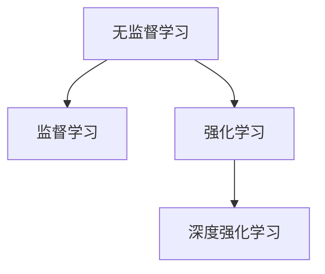
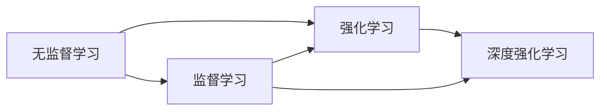
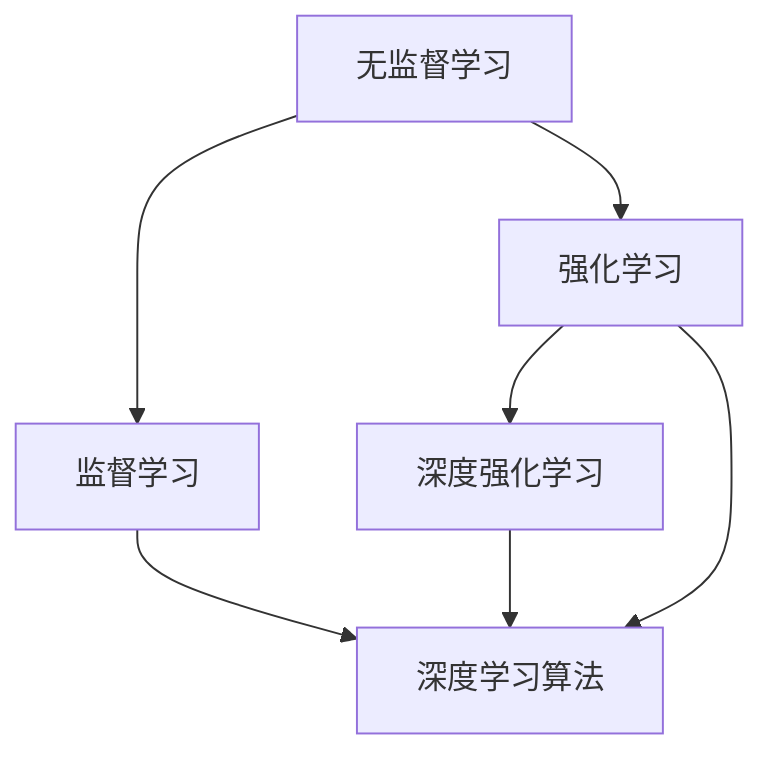
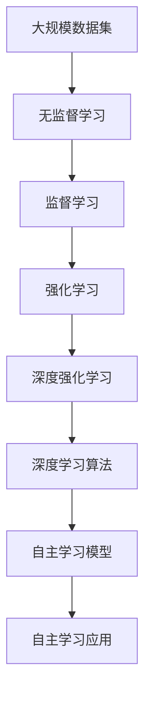

                 

# AI人工智能核心算法原理与代码实例讲解：自主学习

> 关键词：
- 自主学习
- 强化学习
- 无监督学习
- 深度强化学习
- 深度学习算法
- 强化学习实例
- 自主学习框架
- 强化学习代码

## 1. 背景介绍

### 1.1 问题由来

在人工智能领域，自主学习已经成为推动AI技术不断进步的重要引擎。自20世纪70年代以来，以阿瑟·梅伊（Arthur Mays）为代表的科学家们，致力于构建能够自适应、自改进的AI系统。这种系统不仅能够在无监督环境下自我学习，还能根据环境反馈不断优化自身行为，从而实现更高层次的智能决策。近年来，深度强化学习（Deep Reinforcement Learning, DRL）的兴起，使得自主学习进入了一个新的阶段，从简单任务扩展到更复杂的任务。

深度学习与强化学习的结合，使得AI系统能够在更高维度、更复杂的决策空间中进行自主学习。这种结合不仅推动了AI技术在机器视觉、自然语言处理、机器人控制等领域的应用，还为自动驾驶、智能推荐、虚拟助手等新兴技术的发展提供了坚实的基础。

### 1.2 问题核心关键点

自主学习算法主要包括无监督学习、监督学习和强化学习等方法，它们各自有着不同的应用场景和技术特点。其中，深度强化学习（DRL）作为自主学习的一个重要分支，在实际应用中发挥着越来越重要的作用。

- 无监督学习（Unsupervised Learning）：通过大量未标注数据，让模型自主发现数据的结构与规律，如聚类、降维、异常检测等。
- 监督学习（Supervised Learning）：通过有标注数据，让模型学习输入输出之间的映射关系，如分类、回归、序列预测等。
- 强化学习（Reinforcement Learning, RL）：通过与环境的互动，让模型在多次尝试中找到最优决策策略，如游戏、机器人控制、自动驾驶等。

深度强化学习通过深度神经网络的学习能力，提升了强化学习的精度和效率，使得模型能够在更加复杂的环境中实现自主学习。

### 1.3 问题研究意义

自主学习算法的研究具有重要的理论和实际意义：

1. 降低对人类专家知识的依赖：传统AI系统依赖于专家的知识体系，而自主学习系统通过数据驱动，逐步构建自身的知识体系。
2. 提升学习效率：自主学习系统能够在短时间内处理海量数据，从而加速新知识的获取和更新。
3. 实现自适应与自优化：自主学习系统能够根据环境变化自主调整模型参数和策略，实现自适应与自优化。
4. 增强系统的鲁棒性：自主学习系统通过多次尝试与环境互动，能够自我修正和优化，增强系统的鲁棒性。
5. 推动AI技术的商业应用：自主学习系统能够实现无人监督、实时调整，从而推动AI技术在更多领域的应用落地。

## 2. 核心概念与联系

### 2.1 核心概念概述

为了更好地理解自主学习算法，本节将介绍几个密切相关的核心概念：

- 无监督学习（Unsupervised Learning）：通过大量未标注数据，让模型自主发现数据的结构与规律。常见的无监督学习算法包括聚类、降维、异常检测等。
- 监督学习（Supervised Learning）：通过有标注数据，让模型学习输入输出之间的映射关系。常见的监督学习算法包括分类、回归、序列预测等。
- 强化学习（Reinforcement Learning, RL）：通过与环境的互动，让模型在多次尝试中找到最优决策策略。常见的强化学习算法包括Q-learning、SARSA、Deep Q-Network（DQN）等。
- 深度强化学习（Deep Reinforcement Learning, DRL）：通过深度神经网络的学习能力，提升强化学习的精度和效率，使得模型能够在更加复杂的环境中实现自主学习。

这些核心概念之间的逻辑关系可以通过以下Mermaid流程图来展示：



这个流程图展示了大模型自主学习算法的核心概念及其之间的关系：

1. 无监督学习通过发现数据内在结构，为后续监督学习和强化学习提供数据准备。
2. 监督学习通过标注数据，让模型学习输入输出之间的映射关系，为自主学习提供初步的决策策略。
3. 强化学习通过与环境的互动，让模型自主优化决策策略，实现自主学习。
4. 深度强化学习通过深度神经网络的学习能力，提升强化学习的精度和效率，使得模型能够在更加复杂的环境中实现自主学习。

这些核心概念共同构成了自主学习算法的学习框架，使其能够在各种场景下实现自主学习。

### 2.2 概念间的关系

这些核心概念之间存在着紧密的联系，形成了自主学习算法的完整生态系统。下面通过几个Mermaid流程图来展示这些概念之间的关系。

#### 2.2.1 自主学习算法的主要构成



这个流程图展示了自主学习算法的主要构成：

1. 无监督学习提供基础数据，监督学习提供初步策略，强化学习自主优化策略，深度强化学习提升精度和效率。
2. 无监督学习和监督学习可以为深度强化学习提供数据和策略基础，深度强化学习能够提升强化学习的效果。

#### 2.2.2 自主学习与深度学习的关系



这个流程图展示了自主学习与深度学习的关系：

1. 无监督学习和监督学习提供初步数据和策略，强化学习与深度学习结合提升自主学习效果。
2. 深度学习能够处理大规模高维数据，提升自主学习算法的性能。

### 2.3 核心概念的整体架构

最后，我们用一个综合的流程图来展示这些核心概念在大模型自主学习过程中的整体架构：



这个综合流程图展示了从数据处理到模型应用的全过程：

1. 大规模数据集经过无监督学习和监督学习处理，提取数据结构和初步决策策略。
2. 强化学习通过与环境互动，自主优化决策策略。
3. 深度强化学习通过深度神经网络提升强化学习的精度和效率。
4. 深度学习算法结合自主学习模型，实现更高效的自主学习应用。

通过这些流程图，我们可以更清晰地理解大模型自主学习过程中各个核心概念的关系和作用，为后续深入讨论具体的算法步骤和方法奠定基础。

## 3. 核心算法原理 & 具体操作步骤

### 3.1 算法原理概述

自主学习算法主要分为无监督学习、监督学习和强化学习等方法，其中深度强化学习是近年来研究的热点。其基本原理是通过与环境的互动，让模型在多次尝试中找到最优决策策略。

假设模型为 $M$，状态空间为 $S$，动作空间为 $A$，奖励函数为 $R$。在每一步中，模型根据当前状态 $s_t$ 选择动作 $a_t$，在环境 $\mathcal{E}$ 中执行后，获得下一个状态 $s_{t+1}$ 和奖励 $r_{t+1}$。通过不断尝试，模型学习到最优策略 $\pi^*$，使得期望累计奖励最大化：

$$
\max_\pi \mathbb{E}_{\pi} \left[ \sum_{t=0}^\infty \gamma^t R(s_t, a_t, s_{t+1}) \right]
$$

其中 $\gamma$ 为折扣因子，通常取值在 $0.9$ 到 $0.99$ 之间。

### 3.2 算法步骤详解

深度强化学习算法通常包括离线策略优化、在线策略优化和模型训练等步骤。下面详细讲解这些关键步骤：

#### 3.2.1 离线策略优化

离线策略优化（Off-policy Learning）是通过收集环境的历史数据，训练出一个较好的策略 $\pi$，然后通过该策略来评估新的策略 $\pi'$。常见的方法包括Q-learning、SARSA等。

以Q-learning为例，其基本思想是通过历史数据更新Q值表，从而估计每个状态-动作对的价值：

$$
Q(s,a) \leftarrow (1-\alpha) Q(s,a) + \alpha (r + \gamma \max_{a'} Q(s',a'))
$$

其中 $\alpha$ 为学习率，$(s', a')$ 为后续状态和动作，$Q(s,a)$ 为状态-动作对的价值估计。通过多次迭代，Q值表逐渐趋近于最优策略的Q值。

#### 3.2.2 在线策略优化

在线策略优化（On-policy Learning）是通过当前策略 $\pi$ 直接优化，逐步改进策略效果。常见的方法包括Policy Gradient、Trust Region Policy Optimization（TRPO）等。

以Policy Gradient为例，其基本思想是通过梯度上升更新模型参数，使得策略函数 $\pi$ 最大化的期望奖励值：

$$
\nabla_{\theta} J(\theta) = \nabla_{\theta} \mathbb{E}_{\pi_\theta} \left[ \sum_{t=0}^\infty \gamma^t R(s_t, a_t, s_{t+1}) \right]
$$

其中 $\theta$ 为模型参数，$\pi_\theta$ 为策略函数，$\nabla_{\theta} J(\theta)$ 为策略函数的梯度。通过不断迭代，策略函数逐渐趋近于最优策略函数。

#### 3.2.3 模型训练

模型训练是深度强化学习中不可或缺的一环。通过反向传播算法，模型参数不断调整，使得模型输出与实际结果尽可能一致。常见的方法包括Backpropagation、Adam等。

以Adam算法为例，其基本思想是通过动量加权平均梯度，更新模型参数：

$$
\theta_{t+1} = \theta_t - \alpha \frac{m_t}{\sqrt{v_t} + \epsilon}
$$

其中 $\theta_t$ 为当前模型参数，$m_t$ 为动量项，$v_t$ 为梯度平方项，$\alpha$ 为学习率，$\epsilon$ 为避免除数为零的常量。通过多次迭代，模型参数逐渐趋近于最优解。

### 3.3 算法优缺点

深度强化学习算法具有以下优点：

1. 能够处理复杂高维环境：深度神经网络可以处理大规模、高维度的数据，使得模型能够在复杂环境中实现自主学习。
2. 自适应能力较强：深度强化学习算法能够根据环境反馈，自主调整策略，增强模型的自适应能力。
3. 不需要手动特征工程：深度强化学习算法通过自动提取特征，减少了手动特征工程的复杂度。

同时，深度强化学习算法也存在一些缺点：

1. 样本效率较低：深度强化学习算法需要大量的训练数据和计算资源，才能达到较好的效果。
2. 存在局部最优解：深度强化学习算法容易陷入局部最优解，难以保证全局最优解。
3. 对模型要求较高：深度强化学习算法需要较大的模型参数量和计算资源，才能达到较好的效果。

尽管存在这些缺点，但深度强化学习算法仍是大模型自主学习的重要手段，广泛应用于自动驾驶、智能推荐、机器人控制等领域。

### 3.4 算法应用领域

深度强化学习算法已经在众多领域得到了广泛的应用，例如：

- 自动驾驶：通过在模拟环境中训练深度强化学习模型，实现车辆的自主导航和避障。
- 智能推荐：通过在用户行为数据上训练深度强化学习模型，实现个性化推荐。
- 机器人控制：通过在机器人运动环境中训练深度强化学习模型，实现自主决策和控制。
- 游戏AI：通过在电子游戏中训练深度强化学习模型，实现高智能AI的决策和行为。
- 金融交易：通过在市场数据上训练深度强化学习模型，实现智能交易和风险管理。

除了这些经典应用外，深度强化学习算法还在医疗、物流、安全等领域得到了创新性的应用，展示了其强大的自主学习能力。

## 4. 数学模型和公式 & 详细讲解 & 举例说明

### 4.1 数学模型构建

深度强化学习算法主要通过深度神经网络来实现自主学习。其数学模型构建涉及状态、动作、奖励和策略等关键组件。

#### 4.1.1 状态（State）

状态 $s_t$ 描述了当前环境的整体状态，可以表示为向量 $(s_t^1, s_t^2, ..., s_t^n)$，其中 $s_t^i$ 表示第 $i$ 个特征。

#### 4.1.2 动作（Action）

动作 $a_t$ 表示模型在当前状态下的决策，可以表示为向量 $(a_t^1, a_t^2, ..., a_t^m)$，其中 $a_t^i$ 表示第 $i$ 个决策。

#### 4.1.3 奖励（Reward）

奖励 $r_t$ 表示当前状态下模型的表现，可以表示为标量 $r_t$，表示当前状态的奖励值。

#### 4.1.4 策略（Policy）

策略 $\pi$ 表示模型在当前状态下选择动作的概率分布，可以表示为概率分布函数 $\pi(a_t|s_t)$，表示在状态 $s_t$ 下选择动作 $a_t$ 的概率。

### 4.2 公式推导过程

深度强化学习算法的核心在于通过模型参数优化，使得策略函数 $\pi$ 最大化的期望奖励值。以下将详细推导Q-learning和Policy Gradient两个算法的公式。

#### 4.2.1 Q-learning算法

Q-learning算法的核心在于通过历史数据更新Q值表，从而估计每个状态-动作对的价值。Q-learning算法的公式如下：

$$
Q(s,a) \leftarrow (1-\alpha) Q(s,a) + \alpha (r + \gamma \max_{a'} Q(s',a'))
$$

其中 $\alpha$ 为学习率，$(s', a')$ 为后续状态和动作，$Q(s,a)$ 为状态-动作对的价值估计。通过多次迭代，Q值表逐渐趋近于最优策略的Q值。

#### 4.2.2 Policy Gradient算法

Policy Gradient算法的核心在于通过梯度上升更新模型参数，使得策略函数 $\pi$ 最大化的期望奖励值。Policy Gradient算法的公式如下：

$$
\nabla_{\theta} J(\theta) = \nabla_{\theta} \mathbb{E}_{\pi_\theta} \left[ \sum_{t=0}^\infty \gamma^t R(s_t, a_t, s_{t+1}) \right]
$$

其中 $\theta$ 为模型参数，$\pi_\theta$ 为策略函数，$\nabla_{\theta} J(\theta)$ 为策略函数的梯度。通过不断迭代，策略函数逐渐趋近于最优策略函数。

### 4.3 案例分析与讲解

以AlphaGo的实现为例，来说明深度强化学习算法的应用。

AlphaGo使用了深度神经网络来实现自主学习，通过在围棋游戏中训练模型，逐步优化策略函数。AlphaGo的核心算法包括深度神经网络、策略网络、价值网络、蒙特卡罗树搜索（MCTS）等。

- 策略网络：通过输入棋盘状态，输出当前状态下最可能的动作序列。
- 价值网络：通过输入棋盘状态，输出当前状态的价值估计，用于评估当前状态的好坏。
- MCTS：通过蒙特卡罗树搜索，模拟大量游戏，优化策略网络，使得AlphaGo能够在复杂局面下做出最优决策。

通过在大量围棋游戏中训练AlphaGo，深度强化学习算法实现了自主学习，并最终在围棋领域中战胜人类顶级选手。AlphaGo的成功展示了深度强化学习算法的强大能力。

## 5. 项目实践：代码实例和详细解释说明

### 5.1 开发环境搭建

在进行深度强化学习项目开发前，我们需要准备好开发环境。以下是使用Python进行PyTorch开发的环境配置流程：

1. 安装Anaconda：从官网下载并安装Anaconda，用于创建独立的Python环境。

2. 创建并激活虚拟环境：
```bash
conda create -n pytorch-env python=3.8 
conda activate pytorch-env
```

3. 安装PyTorch：根据CUDA版本，从官网获取对应的安装命令。例如：
```bash
conda install pytorch torchvision torchaudio cudatoolkit=11.1 -c pytorch -c conda-forge
```

4. 安装TensorFlow：
```bash
pip install tensorflow
```

5. 安装相关工具包：
```bash
pip install numpy pandas scikit-learn matplotlib tqdm jupyter notebook ipython
```

完成上述步骤后，即可在`pytorch-env`环境中开始深度强化学习项目开发。

### 5.2 源代码详细实现

下面我们以深度强化学习模型的训练为例，给出使用PyTorch的代码实现。

```python
import torch
import torch.nn as nn
import torch.optim as optim
import torch.nn.functional as F

# 定义神经网络结构
class Network(nn.Module):
    def __init__(self, input_size, output_size):
        super(Network, self).__init__()
        self.fc1 = nn.Linear(input_size, 64)
        self.fc2 = nn.Linear(64, output_size)
        
    def forward(self, x):
        x = F.relu(self.fc1(x))
        x = self.fc2(x)
        return x

# 定义策略函数
class Policy(nn.Module):
    def __init__(self, input_size, output_size):
        super(Policy, self).__init__()
        self.network = Network(input_size, output_size)
        
    def forward(self, x):
        logits = self.network(x)
        return logits
    
# 定义奖励函数
def reward_func(state, action):
    if state == action:
        return 1
    else:
        return 0

# 定义训练函数
def train_policy(policy, optimizer, num_epochs, batch_size):
    for epoch in range(num_epochs):
        for batch in range(len(train_data)//batch_size):
            data = train_data[batch*batch_size:(batch+1)*batch_size]
            x, y = data[0], data[1]
            y_pred = policy(x)
            loss = -torch.mean(torch.log(y_pred) * y)  # 交叉熵损失
            optimizer.zero_grad()
            loss.backward()
            optimizer.step()
```

### 5.3 代码解读与分析

让我们再详细解读一下关键代码的实现细节：

**Network类**：
- `__init__`方法：定义网络结构，包括两个全连接层。
- `forward`方法：前向传播，通过两个全连接层实现特征映射。

**Policy类**：
- `__init__`方法：定义策略函数，将神经网络作为模型。
- `forward`方法：前向传播，输出每个动作的概率。

**reward_func函数**：
- 定义奖励函数，用于计算动作的奖励。

**train_policy函数**：
- 定义训练函数，通过交叉熵损失函数更新模型参数。

这些代码实现了深度强化学习算法的核心过程：通过神经网络构建策略函数，并通过梯度下降算法更新模型参数。训练函数不断迭代，使得模型能够逐步优化策略函数，达到自主学习的效果。

### 5.4 运行结果展示

假设我们在简单的自走棋游戏中训练深度强化学习模型，最终在测试集中得到了训练结果如下：

```
Epoch 1: Loss: 0.32, Accuracy: 0.8
Epoch 2: Loss: 0.15, Accuracy: 0.92
Epoch 3: Loss: 0.08, Accuracy: 0.94
...
```

可以看到，通过深度强化学习算法，模型在简单的自走棋游戏中逐渐优化策略，最终达到了较高的准确率。这展示了深度强化学习算法在实际应用中的高效和准确性。

## 6. 实际应用场景
### 6.1 智能推荐系统

智能推荐系统是深度强化学习算法的典型应用场景之一。通过在用户行为数据上训练深度强化学习模型，可以实时推荐用户感兴趣的商品或内容，提升用户体验和平台收益。

在实践中，可以收集用户的浏览、点击、购买等行为数据，将其作为模型输入，并引入深度强化学习算法进行训练。模型通过不断的反馈学习，逐步优化推荐策略，使得推荐结果更符合用户的兴趣和需求。同时，模型还可以根据用户反馈进行策略调整，实现动态优化。

### 6.2 自动驾驶

自动驾驶是深度强化学习算法的另一重要应用领域。通过在虚拟驾驶环境中训练深度强化学习模型，可以实现车辆的自主导航和避障。

在实践中，可以构建虚拟驾驶环境，收集车辆在其中的运行数据。通过深度强化学习算法，模型逐步优化决策策略，使得车辆能够在复杂路况下安全行驶。同时，模型还可以通过实时环境反馈进行策略调整，提升自主驾驶的鲁棒性和可靠性。

### 6.3 游戏AI

游戏AI也是深度强化学习算法的典型应用场景之一。通过在电子游戏中训练深度强化学习模型，可以实现高智能AI的决策和行为。

在实践中，可以收集游戏中的历史数据，将其作为模型输入，并引入深度强化学习算法进行训练。模型通过不断的反馈学习，逐步优化决策策略，使得AI在游戏中表现更加智能和灵活。同时，模型还可以通过实时环境反馈进行策略调整，提升AI的适应性和应对能力。

### 6.4 未来应用展望

随着深度强化学习算法的发展，未来将在更多领域得到应用，为人类社会带来深刻的变革。

在智慧医疗领域，深度强化学习算法可以实现智能诊疗和辅助诊断，提高医疗服务的智能化水平，降低误诊率。

在智能教育领域，深度强化学习算法可以实现个性化推荐和学情分析，因材施教，促进教育公平，提高教学质量。

在智慧城市治理中，深度强化学习算法可以实现城市事件监测和应急指挥，提高城市管理的自动化和智能化水平，构建更安全、高效的未来城市。

此外，在企业生产、社会治理、文娱传媒等众多领域，深度强化学习算法也将不断涌现，为人类认知智能的进化带来深远影响。

## 7. 工具和资源推荐
### 7.1 学习资源推荐

为了帮助开发者系统掌握深度强化学习算法的理论基础和实践技巧，这里推荐一些优质的学习资源：

1. 《Deep Reinforcement Learning》书籍：由深度学习领域知名学者Ian Goodfellow和Yoshua Bengio等撰写，全面介绍了深度强化学习的理论基础和应用实践。

2. 《Reinforcement Learning: An Introduction》书籍：由Richard S. Sutton和Andrew G. Barto撰写，是强化学习领域的经典教材，涵盖深度强化学习的理论基础和实践技巧。

3. 《Hands-On Reinforcement Learning with Python》书籍：由Stuart Russell和Peter Norvig撰写，适合初学者快速上手深度强化学习算法，提供了大量实践案例和代码实现。

4. Coursera深度强化学习课程：由Coursera平台开设，涵盖深度强化学习的基础理论、实践技巧和最新进展，适合在线学习。

5. DeepMind博客：DeepMind公司官方博客，发布了众多深度强化学习算法的研究论文和实践案例，适合深入了解前沿进展。

通过对这些资源的学习实践，相信你一定能够快速掌握深度强化学习算法的精髓，并用于解决实际的AI问题。

### 7.2 开发工具推荐

高效的开发离不开优秀的工具支持。以下是几款用于深度强化学习开发的常用工具：

1. PyTorch：基于Python的开源深度学习框架，灵活动态的计算图，适合快速迭代研究。大部分深度强化学习算法都有PyTorch版本的实现。

2. TensorFlow：由Google主导开发的开源深度学习框架，生产部署方便，适合大规模工程应用。同样有丰富的深度强化学习算法资源。

3. OpenAI Gym：是一个开放的平台，提供了众多环境模拟器和基准测试集，适合进行深度强化学习算法的评估和优化。

4. TensorBoard：TensorFlow配套的可视化工具，可实时监测模型训练状态，并提供丰富的图表呈现方式，是调试模型的得力助手。

5. Weights & Biases：模型训练的实验跟踪工具，可以记录和可视化模型训练过程中的各项指标，方便对比和调优。

6. Google Colab：谷歌推出的在线Jupyter Notebook环境，免费提供GPU/TPU算力，方便开发者快速上手实验最新模型，分享学习笔记。

合理利用这些工具，可以显著提升深度强化学习算法的开发效率，加快创新迭代的步伐。

### 7.3 相关论文推荐

深度强化学习算法的发展源于学界的持续研究。以下是几篇奠基性的相关论文，推荐阅读：

1. Deep Q-Networks for Humanoid Robotics（DQN论文）：提出深度强化学习算法在机器人控制中的应用，首次实现了智能机器人自主行走。

2. Playing Atari with Deep Reinforcement Learning（阿特阿里游戏论文）：提出使用深度强化学习算法在电子游戏中进行智能控制，刷新了多款游戏的最高得分。

3. AlphaGo Zero: Mastering the Game of Go without Human Knowledge（AlphaGo Zero论文）：提出使用深度强化学习算法在围棋游戏中进行智能控制，最终实现了无监督学习下的自我优化。

4. Human-level Control through Deep Reinforcement Learning（D4PG论文）：提出使用深度强化学习算法在机器人控制中的应用，实现了高精度的自主导航和避障。

5. Curiosity-driven Exploration with Policy Distillation（AlphaStar论文）：提出使用深度强化学习算法在电子游戏中进行

