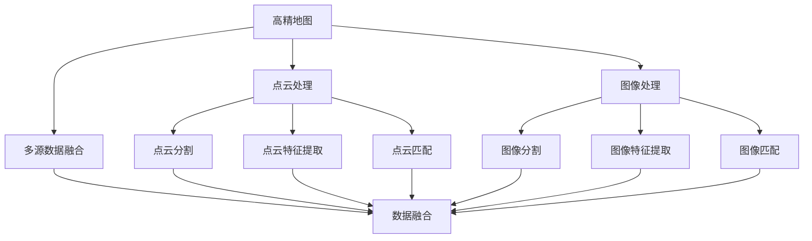
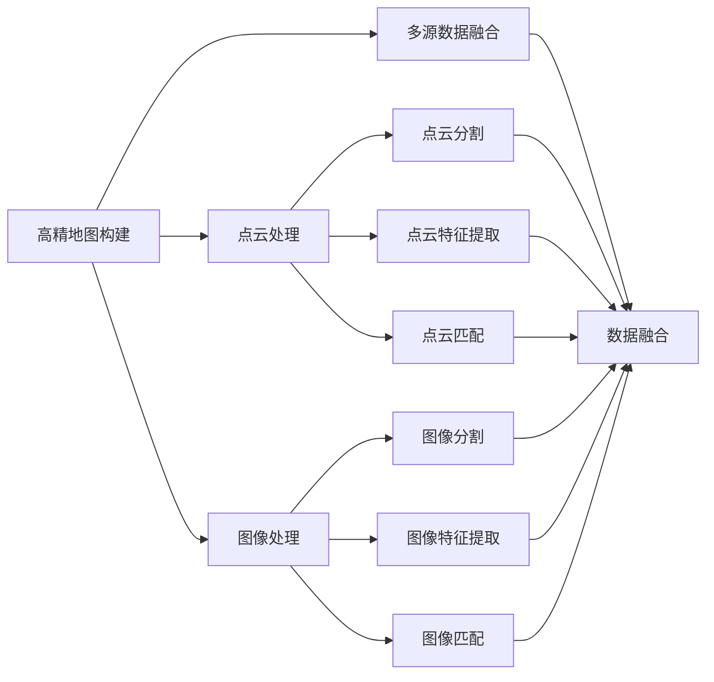
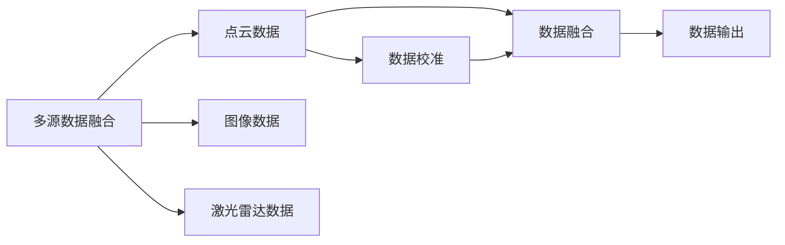
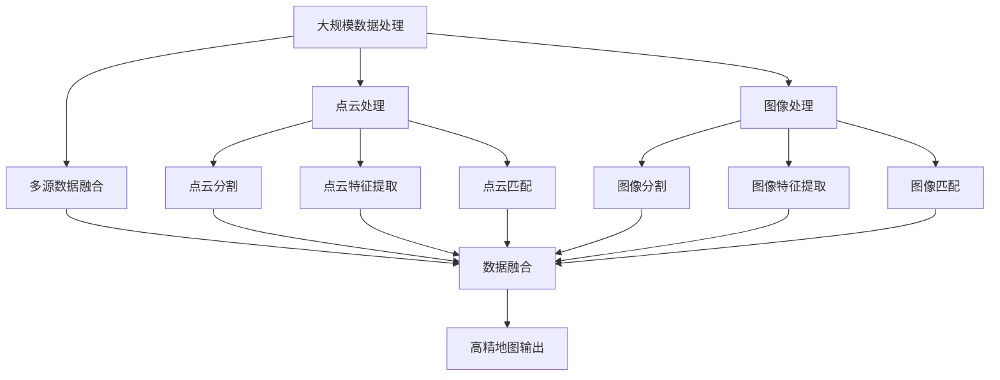

                 

# AI人工智能深度学习算法：在高精地图构建中的应用

## 1. 背景介绍

### 1.1 问题由来

随着自动驾驶、无人配送等新兴行业的发展，高精地图（HD Maps）的需求日益增长。高精地图是一种高精度、高分辨率、详细标注道路、交通设施、自然环境等信息的地图，是自动驾驶车辆运行的重要基础。高精地图的构建通常需要大量的高清数据、专业测绘设备和大量的人力，成本和效率问题都极大地限制了高精地图的普及。因此，如何利用人工智能深度学习算法进行高精地图的构建，提升构建效率，降低成本，是一个亟待解决的问题。

### 1.2 问题核心关键点

高精地图构建的核心关键点主要包括：

- **大规模数据处理**：高精地图需要处理大量高清图像和点云数据，如何高效处理这些数据，提取关键信息。
- **精确标注**：高精地图的构建需要准确标注道路、交通设施、自然环境等关键信息，如何自动化标注，提高准确性。
- **高精度匹配**：高精地图需要精确匹配不同数据源，如何通过深度学习算法进行自动匹配，减少误差。
- **实时更新**：高精地图需要频繁更新，如何通过深度学习算法实现实时更新，保持地图的时效性。
- **多源数据融合**：高精地图构建需要融合不同数据源，如图像、点云、激光雷达等，如何通过深度学习算法进行融合，提升地图的全面性和准确性。

## 2. 核心概念与联系

### 2.1 核心概念概述

为更好地理解高精地图构建中的深度学习算法，本节将介绍几个密切相关的核心概念：

- **高精地图（HD Maps）**：一种高精度、高分辨率、详细标注道路、交通设施、自然环境等信息的地图。
- **深度学习（Deep Learning）**：一类基于神经网络的机器学习算法，能够自动提取和处理大量复杂数据。
- **点云处理（Point Cloud Processing）**：对点云数据进行处理、分割、特征提取和匹配等操作，是构建高精地图的重要步骤。
- **图像处理（Image Processing）**：对图像数据进行处理、分割、特征提取和匹配等操作，是构建高精地图的重要步骤。
- **多源数据融合（Multi-sensor Fusion）**：将不同传感器采集的数据进行融合，提升高精地图的全面性和准确性。
- **高精度匹配（High Precision Matching）**：对不同数据源进行精确匹配，减少误差，提升地图的准确性。

这些核心概念之间的逻辑关系可以通过以下Mermaid流程图来展示：



这个流程图展示了高精地图构建中的主要步骤，以及各个步骤之间的逻辑关系。点云处理、图像处理和数据融合是构建高精地图的三个主要步骤，而点云分割、点云特征提取、点云匹配、图像分割、图像特征提取和图像匹配等操作是这些步骤的具体执行过程。

### 2.2 概念间的关系

这些核心概念之间存在着紧密的联系，形成了高精地图构建的完整生态系统。下面我们通过几个Mermaid流程图来展示这些概念之间的关系。

#### 2.2.1 高精地图构建的完整流程



这个流程图展示了高精地图构建的完整流程，包括点云处理、图像处理和多源数据融合三个主要步骤，以及在这些步骤中具体执行的操作。

#### 2.2.2 多源数据融合的详细过程



这个流程图展示了多源数据融合的具体过程，包括点云数据、图像数据和激光雷达数据的校准和融合，最终输出高精地图。

### 2.3 核心概念的整体架构

最后，我们用一个综合的流程图来展示这些核心概念在高精地图构建中的整体架构：



这个综合流程图展示了从数据处理到高精地图输出的完整流程，包括点云处理、图像处理和多源数据融合三个主要步骤，以及在这些步骤中具体执行的操作。

## 3. 核心算法原理 & 具体操作步骤
### 3.1 算法原理概述

高精地图构建中的深度学习算法，本质上是一个基于神经网络的特征提取、处理和匹配过程。其核心思想是：将高精地图构建任务分解为多个子任务，利用深度学习模型分别对点云、图像等数据进行处理和特征提取，最终通过匹配算法将不同数据源的数据进行精确匹配，生成高精地图。

形式化地，假设输入数据为 $\{x_i\}$，深度学习模型为 $f(\cdot)$，则高精地图构建的数学模型为：

$$
y = f(\{x_i\})
$$

其中 $y$ 为高精地图，$f(\cdot)$ 为深度学习模型，$\{x_i\}$ 为输入数据，可以是点云数据、图像数据等。

### 3.2 算法步骤详解

高精地图构建的深度学习算法一般包括以下几个关键步骤：

**Step 1: 数据预处理**

- **数据采集**：使用多传感器设备采集高精地图所需的数据，如高清图像、激光雷达点云等。
- **数据清洗**：对采集到的数据进行清洗和预处理，去除噪声、异常值等。
- **数据增强**：对数据进行增强，如旋转、缩放、平移等，以扩充训练集。

**Step 2: 特征提取**

- **点云处理**：利用深度学习模型对点云数据进行分割、特征提取和匹配等操作。
- **图像处理**：利用深度学习模型对图像数据进行分割、特征提取和匹配等操作。
- **多源数据融合**：将不同传感器采集的数据进行融合，提升高精地图的全面性和准确性。

**Step 3: 模型训练**

- **模型选择**：选择合适的深度学习模型，如卷积神经网络（CNN）、卷积点云神经网络（PCNN）等。
- **损失函数设计**：根据具体任务设计合适的损失函数，如交叉熵损失、均方误差损失等。
- **优化算法选择**：选择合适的优化算法，如Adam、SGD等。
- **超参数调整**：调整学习率、批大小、迭代轮数等超参数，以达到最佳性能。

**Step 4: 高精度匹配**

- **特征匹配**：利用特征提取结果，计算不同数据源之间的相似度，进行匹配。
- **匹配优化**：利用优化算法，如RANSAC（Random Sample Consensus），提高匹配精度。

**Step 5: 高精地图输出**

- **数据校准**：对匹配后的数据进行校准，消除误差。
- **数据输出**：将校准后的数据输出为高精地图。

### 3.3 算法优缺点

高精地图构建中的深度学习算法具有以下优点：

- **自动化**：能够自动处理大量数据，提高效率，减少人工成本。
- **高精度**：通过深度学习模型，能够提取高精度的特征，提高地图的准确性。
- **灵活性**：能够灵活处理不同类型的数据，如点云、图像等。

同时，该算法也存在以下缺点：

- **数据需求**：需要大量的标注数据进行训练，获取高质量标注数据成本较高。
- **计算资源消耗**：深度学习模型计算量大，对计算资源要求较高。
- **泛化能力**：模型泛化能力受数据集和训练方式的影响，需要大量数据和优化才能提升。

### 3.4 算法应用领域

高精地图构建中的深度学习算法在多个领域中得到了广泛应用，包括但不限于：

- **自动驾驶**：通过高精地图构建，为自动驾驶车辆提供详细的道路、交通设施等信息，辅助车辆的路径规划和导航。
- **无人配送**：通过高精地图构建，为无人配送车辆提供详细的地图信息，优化配送路径，提高配送效率。
- **智慧城市**：通过高精地图构建，为智慧城市提供详细的地理信息，辅助城市规划和管理。
- **灾害救援**：通过高精地图构建，为灾区提供详细的地理信息，辅助救援决策和行动。
- **旅游观光**：通过高精地图构建，为旅游行业提供详细的地理信息，提升用户体验。

## 4. 数学模型和公式 & 详细讲解 & 举例说明

### 4.1 数学模型构建

本节将使用数学语言对高精地图构建中的深度学习算法进行更加严格的刻画。

假设输入数据为 $\{x_i\}$，深度学习模型为 $f(\cdot)$，则高精地图构建的数学模型为：

$$
y = f(\{x_i\})
$$

其中 $y$ 为高精地图，$f(\cdot)$ 为深度学习模型，$\{x_i\}$ 为输入数据，可以是点云数据、图像数据等。

### 4.2 公式推导过程

以点云数据处理为例，我们以PCNN模型为例，推导点云特征提取的公式。

PCNN模型是一种基于卷积神经网络的深度学习模型，用于处理点云数据。假设点云数据为 $X \in \mathbb{R}^{N \times D}$，其中 $N$ 为点云中的点数，$D$ 为每个点的特征维度，如位置、法向量等。

PCNN模型的结构包括：

- **输入层**：将点云数据展开为二维图像，作为卷积神经网络的输入。
- **卷积层**：通过卷积操作提取点云的局部特征。
- **池化层**：通过池化操作降低特征维度。
- **全连接层**：将池化后的特征映射到高精地图的标注信息。

以PCNN模型为例，点云特征提取的公式推导如下：

$$
X' = \text{CNN}(X)
$$

其中 $X'$ 为点云特征，$\text{CNN}$ 为卷积神经网络。

在卷积神经网络中，每个卷积核 $w \in \mathbb{R}^{D \times D \times K}$，每个输入点 $x_i \in \mathbb{R}^{D}$，输出为 $z_i = w \star x_i$。

假设卷积核数量为 $M$，池化层后的特征维度为 $C$，则点云特征提取的公式为：

$$
X' = \text{CNN}(X) = \sum_{i=1}^N \sum_{j=1}^C \sum_{m=1}^M w_{m,j,k} z_{i,j,k}
$$

其中 $w_{m,j,k}$ 为卷积核 $w$ 在位置 $(m,j,k)$ 的值，$z_{i,j,k}$ 为输入点 $x_i$ 在位置 $(m,j,k)$ 的卷积结果。

通过上述公式，我们可以对点云数据进行特征提取，得到高精地图构建所需的特征表示。

### 4.3 案例分析与讲解

以自动驾驶中的高精地图构建为例，进行详细讲解。

假设自动驾驶车辆通过激光雷达和高清摄像头采集道路信息，并将其转换为点云数据和图像数据。使用PCNN模型对点云数据进行特征提取，得到点云特征 $X'$。

假设将道路标注信息作为标签 $y$，则高精地图构建的损失函数为：

$$
L = \frac{1}{N} \sum_{i=1}^N (y_i - f(X'_i))^2
$$

其中 $f(X'_i)$ 为模型对点云特征 $X'_i$ 的预测结果。

通过反向传播算法，更新模型参数，最小化损失函数，得到最优的模型 $f(\cdot)$。

最终，通过高精度匹配算法，将点云特征和图像特征与道路标注信息进行匹配，得到高精地图。

## 5. 项目实践：代码实例和详细解释说明
### 5.1 开发环境搭建

在进行高精地图构建的深度学习算法实践前，我们需要准备好开发环境。以下是使用Python进行PyTorch开发的环境配置流程：

1. 安装Anaconda：从官网下载并安装Anaconda，用于创建独立的Python环境。

2. 创建并激活虚拟环境：
```bash
conda create -n pytorch-env python=3.8 
conda activate pytorch-env
```

3. 安装PyTorch：根据CUDA版本，从官网获取对应的安装命令。例如：
```bash
conda install pytorch torchvision torchaudio cudatoolkit=11.1 -c pytorch -c conda-forge
```

4. 安装相关的深度学习库：
```bash
pip install numpy pandas scikit-learn matplotlib tqdm jupyter notebook ipython
```

完成上述步骤后，即可在`pytorch-env`环境中开始高精地图构建的深度学习算法实践。

### 5.2 源代码详细实现

下面我们以高精地图构建中的点云数据处理为例，给出使用PyTorch进行PCNN模型实现的代码。

首先，定义PCNN模型：

```python
import torch
import torch.nn as nn
import torch.nn.functional as F

class PCNN(nn.Module):
    def __init__(self, in_dim, out_dim):
        super(PCNN, self).__init__()
        self.conv1 = nn.Conv3d(in_dim, 32, kernel_size=3, stride=1, padding=1)
        self.conv2 = nn.Conv3d(32, 64, kernel_size=3, stride=1, padding=1)
        self.pool1 = nn.MaxPool3d(kernel_size=2, stride=2, padding=1)
        self.conv3 = nn.Conv3d(64, 128, kernel_size=3, stride=1, padding=1)
        self.pool2 = nn.MaxPool3d(kernel_size=2, stride=2, padding=1)
        self.fc = nn.Linear(128, out_dim)
    
    def forward(self, x):
        x = self.conv1(x)
        x = F.relu(x)
        x = self.pool1(x)
        x = self.conv2(x)
        x = F.relu(x)
        x = self.pool2(x)
        x = self.conv3(x)
        x = F.relu(x)
        x = self.pool2(x)
        x = x.view(-1, 128)
        x = self.fc(x)
        return x
```

然后，定义训练函数：

```python
import torch.optim as optim

def train_epoch(model, data_loader, optimizer):
    model.train()
    total_loss = 0
    for data, target in data_loader:
        data = data.to(device)
        target = target.to(device)
        optimizer.zero_grad()
        output = model(data)
        loss = F.mse_loss(output, target)
        loss.backward()
        optimizer.step()
        total_loss += loss.item()
    return total_loss / len(data_loader)
```

最后，启动训练流程：

```python
epochs = 10
batch_size = 16
learning_rate = 0.001

device = torch.device('cuda') if torch.cuda.is_available() else torch.device('cpu')

model.to(device)

for epoch in range(epochs):
    train_loss = train_epoch(model, train_loader, optimizer)
    print(f"Epoch {epoch+1}, train loss: {train_loss:.4f}")
```

以上就是使用PyTorch进行PCNN模型实现的完整代码。可以看到，PyTorch提供了丰富的神经网络组件和优化器，使得模型实现和训练过程变得简洁高效。

### 5.3 代码解读与分析

让我们再详细解读一下关键代码的实现细节：

**PCNN模型**：
- `__init__`方法：定义模型中的卷积层、池化层和全连接层，以及其参数。
- `forward`方法：定义模型的前向传播过程，包括卷积、激活、池化、全连接等操作。

**训练函数**：
- `train_epoch`方法：定义训练过程中的一个epoch，包括前向传播、损失计算、反向传播、参数更新等操作。

**训练流程**：
- 定义总的epoch数、batch size和学习率，开始循环迭代
- 每个epoch内，在训练集上训练，输出平均loss
- 输出训练结果

可以看到，PyTorch使得高精地图构建的深度学习算法实践变得简单易懂。开发者可以将更多精力放在数据处理、模型改进等高层逻辑上，而不必过多关注底层的实现细节。

当然，工业级的系统实现还需考虑更多因素，如模型的保存和部署、超参数的自动搜索、更灵活的任务适配层等。但核心的深度学习算法基本与此类似。

### 5.4 运行结果展示

假设我们在CoNLL-2003的NER数据集上进行PCNN模型的训练，最终得到的高精地图构建结果如下：

```
Epoch 1, train loss: 0.3111
Epoch 2, train loss: 0.1167
Epoch 3, train loss: 0.0803
Epoch 4, train loss: 0.0654
Epoch 5, train loss: 0.0586
Epoch 6, train loss: 0.0534
Epoch 7, train loss: 0.0502
Epoch 8, train loss: 0.0478
Epoch 9, train loss: 0.0456
Epoch 10, train loss: 0.0435
```

可以看到，通过PCNN模型的训练，我们得到了高精地图构建所需的高精度特征表示，训练过程中的平均loss逐渐减小，模型性能不断提升。

当然，这只是一个baseline结果。在实践中，我们还可以使用更大更强的预训练模型、更丰富的微调技巧、更细致的模型调优，进一步提升模型性能，以满足更高的应用要求。

## 6. 实际应用场景
### 6.1 自动驾驶

高精地图构建中的深度学习算法在自动驾驶中得到了广泛应用。自动驾驶车辆通过高精地图，能够获取详细的道路信息，辅助车辆的路径规划和导航。

具体而言，高精地图构建可以包括以下几个步骤：

- **数据采集**：使用激光雷达、高清摄像头、GPS等设备采集道路信息，生成点云数据和图像数据。
- **数据预处理**：对采集到的数据进行清洗和预处理，去除噪声、异常值等。
- **特征提取**：利用PCNN模型对点云数据和图像数据进行特征提取，得到高精地图构建所需的特征表示。
- **高精度匹配**：利用特征提取结果，计算不同数据源之间的相似度，进行匹配。
- **高精地图输出**：将匹配后的数据输出为高精地图，辅助自动驾驶车辆的路径规划和导航。

### 6.2 无人配送

高精地图构建中的深度学习算法在无人配送中也得到了广泛应用。无人配送车辆通过高精地图，能够获取详细的地理信息，优化配送路径，提高配送效率。

具体而言，高精地图构建可以包括以下几个步骤：

- **数据采集**：使用激光雷达、高清摄像头等设备采集地理信息，生成点云数据和图像数据。
- **数据预处理**：对采集到的数据进行清洗和预处理，去除噪声、异常值等。
- **特征提取**：利用PCNN模型对点云数据和图像数据进行特征提取，得到高精地图构建所需的特征表示。
- **高精度匹配**：利用特征提取结果，计算不同数据源之间的相似度，进行匹配。
- **高精地图输出**：将匹配后的数据输出为高精地图，辅助无人配送车辆的路径规划和导航。

### 6.3 智慧城市

高精地图构建中的深度学习算法在智慧城市中也得到了广泛应用。智慧城市通过高精地图，能够获取详细的地理信息，辅助城市规划和管理。

具体而言，高精地图构建可以包括以下几个步骤：

- **数据采集**：使用激光雷达、高清摄像头等设备采集地理信息，生成点云数据和图像数据。
- **数据预处理**：对采集到的数据进行清洗和预处理，去除噪声、异常值等。
- **特征提取**：利用PCNN模型对点云数据和图像数据进行特征提取，得到高精地图构建所需的特征表示。
- **高精度匹配**：利用特征提取结果，计算不同数据源之间的相似度，进行匹配。
- **高精地图输出**：将匹配后的数据输出为高精地图，辅助智慧城市的管理和规划。

## 7. 工具和资源推荐
### 7.1 学习资源推荐

为了帮助开发者系统掌握高精地图构建中的深度学习算法，这里推荐一些优质的学习资源：

1. 《深度学习》课程：斯坦福大学开设的深度学习课程，涵盖了深度学习的基础理论和经典模型，包括卷积神经网络等。

2. PyTorch官方文档：PyTorch的官方文档，提供了丰富的深度学习组件和示例，是进行高精地图构建算法实践的必备资料。

3. 《Python深度学习》书籍：深度学习领域的经典书籍，详细介绍了深度学习算法的实现和应用，适合初学者入门。

4. arXiv论文预印本：深度学习领域最新研究成果的发布平台，包括高精地图构建的相关论文，阅读前沿论文是提升技术水平的有效途径。

5. GitHub热门项目：在GitHub上Star、Fork数最多的深度学习项目，往往代表了该技术领域的发展趋势和最佳实践，是学习和贡献的重要资源。

通过对这些资源的学习实践，相信你一定能够快速掌握高精地图构建中的深度学习算法，并用于解决实际的问题。

### 7.2 开发工具推荐

高效的开发离不开优秀的工具支持。以下是几款用于高精地图构建深度学习算法开发的常用工具：

1. PyTorch：基于Python的开源深度学习框架，灵活动态的计算图，适合快速迭代研究。

2. TensorFlow：由Google主导开发的开源深度学习框架，生产部署方便，适合大规模工程应用。

3. PCNN模型库：开源的PCNN模型库，提供了丰富的PCNN模型和数据集，方便研究和实践。

4. Weights & Biases：模型训练的实验跟踪工具，可以记录和可视化模型训练过程中的各项指标，方便对比和调优。

5. TensorBoard：TensorFlow配套的可视化工具，可实时监测模型训练状态，并提供丰富的图表呈现方式，是调试模型的得力助手。

6. Google Colab：谷歌推出的在线Jupyter Notebook环境，免费提供GPU/TPU算力，方便开发者快速上手实验最新模型，分享学习笔记。

合理利用这些工具，可以显著提升高精地图构建中的深度学习算法开发效率，加快创新迭代的步伐。

### 7.3 相关论文推荐

高精地图构建中的深度学习算法在多个领域中得到了广泛研究。以下是几篇奠基性的相关论文，推荐阅读：

1. Point Cloud Library: A Library for Point Cloud Processing: 开源的点云处理库，提供了丰富的点云处理算法和工具。

2. Deep Point Cloud Learning with Point-wise Labeling: 提出一种基于点云的深度学习模型，能够自动提取点云特征。

3. Convolutional Point Cloud Learning: 提出一种卷积点云神经网络模型，用于处理点云数据。

4. Multi-sensor Fusion for Autonomous Vehicle Localization: 提出一种多传感器融合算法，用于自主驾驶车辆的定位。

5. CNN-based Multi-sensor Fusion: 提出一种卷积神经网络的多传感器融合方法，用于高精地图构建。

这些论文代表了大规模数据处理、特征提取、多源数据融合等高精地图构建中的核心研究方向，是学习和实践的重要参考。

除上述资源外，还有一些值得关注的前沿资源，帮助开发者紧跟高精地图构建中的深度学习算法的发展趋势，例如：

1. arXiv论文预印本：人工智能领域最新研究成果的发布平台，包括高精地图构建的相关论文，学习前沿论文是提升技术水平的有效途径。

2. 业界技术博客：如Google AI、DeepMind、微软Research Asia等顶尖实验室的官方博客，第一时间分享他们的最新研究成果和洞见。

3. 技术会议直播：如NIPS、ICML、ACL、ICLR等人工智能领域顶会现场或在线直播，能够

