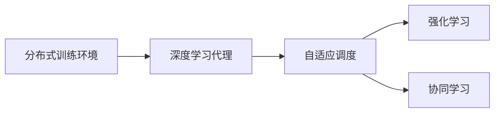

                 

# AI人工智能深度学习算法：智能深度学习代理的自适应调度策略

> 关键词：深度学习代理,自适应调度,强化学习,协同学习,分布式训练

## 1. 背景介绍

### 1.1 问题由来
深度学习在大规模分布式训练环境下的性能表现一直是学术和工业界的关注焦点。深度学习模型的参数量大、计算复杂度高，传统单机的训练速度难以满足实际需求。为了提高训练效率，人们提出了多种并行和分布式训练技术，但这些方法往往需要在模型的训练过程中进行频繁的参数传输和通信，增加了计算和网络开销，且难以实现最优的资源利用。

为解决这一问题，近年来出现了一些基于深度学习代理的自适应调度策略，通过引入智能化的调度机制，优化分布式训练的资源利用率和效率。这些方法通常结合强化学习和协同学习等技术，在训练过程中自动调整任务分配、参数更新等策略，使训练过程更加高效。

### 1.2 问题核心关键点
本文聚焦于一种新的智能深度学习代理自适应调度策略，该策略通过构建分布式训练代理，实时监控训练过程的状态，并根据状态变化自动调整任务的分配和参数的更新策略，优化分布式训练的性能。这种策略的关键在于以下几个方面：

- 构建分布式训练代理，实时监控训练状态。
- 设计智能调度算法，根据训练状态动态调整任务分配和参数更新策略。
- 利用协同学习技术，减少参数通信和计算开销，提升整体训练效率。
- 采用强化学习算法，在不断的实验和反馈中不断优化调度策略，实现自适应学习。

## 2. 核心概念与联系

### 2.1 核心概念概述

为更好地理解该自适应调度策略，我们首先介绍几个核心概念：

- 深度学习代理(Deep Learning Agent)：在分布式训练系统中，深度学习代理充当智能化的训练执行者和调度者，负责任务的分配、参数的更新等决策。
- 自适应调度(Adaptive Scheduling)：根据训练状态自动调整任务的分配和参数更新策略，优化分布式训练的资源利用率。
- 强化学习(Reinforcement Learning)：通过与环境的交互，学习最优的行动策略，以获得最大的长期奖励。
- 协同学习(Cooperative Learning)：通过网络中的多节点合作，优化计算资源的利用和训练效率。

这些概念之间的逻辑关系可以通过以下Mermaid流程图来展示：



这个流程图展示了分布式训练环境中深度学习代理的核心作用：

1. 分布式训练环境提供多台计算资源，用于分布式训练。
2. 深度学习代理充当训练执行者和调度者，实时监控训练状态。
3. 自适应调度根据训练状态调整任务分配和参数更新策略，优化资源利用率。
4. 强化学习和协同学习技术帮助代理学习最优的调度策略，提升训练效率。

### 2.2 概念间的关系

这些核心概念之间存在着紧密的联系，形成了深度学习代理自适应调度的完整生态系统。下面是这些概念之间的详细关系：

- 分布式训练环境提供多台计算资源，是深度学习代理和自适应调度策略执行的基础。
- 深度学习代理通过监控训练状态，根据自适应调度和强化学习的指导，做出最优的训练决策。
- 自适应调度策略根据代理的反馈，动态调整任务分配和参数更新策略，优化训练过程。
- 强化学习通过与环境的交互，不断优化代理的决策策略，使代理能够更加智能化地进行调度。
- 协同学习通过多节点合作，减少通信开销，提升训练效率，使代理能够在分布式环境中更好地完成任务。

这些概念共同构成了深度学习代理自适应调度的完整架构，使得深度学习模型的分布式训练过程更加高效、智能。通过理解这些核心概念，我们可以更好地把握深度学习代理自适应调度的内在原理和优化策略。

## 3. 核心算法原理 & 具体操作步骤
### 3.1 算法原理概述

深度学习代理自适应调度策略的核心思想是，通过构建一个分布式训练代理，实时监控训练过程中的状态，并根据状态变化自动调整任务的分配和参数的更新策略，优化分布式训练的资源利用率和效率。该策略主要包括以下几个步骤：

1. **构建深度学习代理**：设计和实现一个深度学习代理，用于监控分布式训练环境的状态，并根据状态调整任务分配和参数更新策略。
2. **设计自适应调度算法**：设计一个自适应调度算法，根据代理的反馈，实时调整任务的分配和参数的更新策略。
3. **引入强化学习技术**：利用强化学习算法，使代理在不断的实验和反馈中不断优化调度策略，实现自适应学习。
4. **应用协同学习技术**：利用协同学习技术，减少参数通信和计算开销，提升整体训练效率。

### 3.2 算法步骤详解

下面是深度学习代理自适应调度的详细步骤：

**Step 1: 构建深度学习代理**

深度学习代理通常包含以下几个模块：

- **状态监控模块**：监控训练过程中各个节点的计算资源使用情况、通信开销、训练速度等指标，获取当前训练状态。
- **任务分配模块**：根据当前状态，动态调整任务的分配策略，优化资源利用率。
- **参数更新模块**：根据当前状态，动态调整参数的更新策略，减少通信开销。

**Step 2: 设计自适应调度算法**

自适应调度算法需要考虑以下几个关键问题：

- **任务划分**：将训练任务划分为多个子任务，每个子任务可以在单个节点上独立执行。
- **参数分配**：根据当前状态，动态调整各节点之间的参数通信策略，减少通信开销。
- **优化目标**：设计一个优化目标函数，用于衡量调度策略的效果。

**Step 3: 引入强化学习技术**

强化学习算法通过与环境的交互，不断优化代理的决策策略。该过程包括以下几个步骤：

- **环境定义**：定义训练环境的奖励函数，用于衡量代理的调度策略。
- **动作空间**：定义代理可以采取的行动空间，如任务分配策略、参数更新策略等。
- **学习算法**：选择合适的强化学习算法，如Q-learning、PPO等，训练代理学习最优的调度策略。

**Step 4: 应用协同学习技术**

协同学习技术通过多节点合作，优化计算资源的利用和训练效率。该过程包括以下几个步骤：

- **节点通信**：利用协同学习算法，如SPMD、Sharding等，优化节点之间的通信，减少计算和通信开销。
- **任务同步**：利用同步技术，如AllReduce、Gossip等，保证任务的同步和数据的共享。
- **优化目标**：设计一个优化目标函数，用于衡量协同学习的效果。

### 3.3 算法优缺点

深度学习代理自适应调度策略具有以下优点：

1. **高效资源利用**：通过自适应调整任务分配和参数更新策略，优化了分布式训练的资源利用率。
2. **智能决策**：利用强化学习算法，使代理能够根据训练状态自动调整策略，提升训练效率。
3. **协同优化**：通过协同学习技术，减少参数通信和计算开销，提升整体训练效率。
4. **动态优化**：自适应调度策略可以根据训练状态动态调整，适应不同的训练场景。

同时，该策略也存在一些缺点：

1. **算法复杂性高**：需要设计和实现一个分布式训练代理，设计自适应调度算法和强化学习算法，实现难度较大。
2. **数据依赖性强**：调度策略的效果依赖于训练状态的数据质量，数据采集和处理成本较高。
3. **模型多样性**：不同模型的计算复杂度和资源需求不同，调度策略需要根据模型特性进行优化。
4. **参数通信开销**：虽然协同学习技术可以优化参数通信，但在某些场景下，仍可能存在较大的通信开销。

尽管存在这些缺点，但总体而言，深度学习代理自适应调度策略在优化分布式训练效率方面具有显著优势，值得深入研究和应用。

### 3.4 算法应用领域

深度学习代理自适应调度策略在以下几个领域有广泛的应用前景：

- **大规模分布式训练**：如Google、Facebook、Microsoft等公司，在训练大规模深度学习模型时，需要大量计算资源，分布式训练是必然选择。
- **跨领域任务优化**：如多模态学习、跨领域迁移学习等，需要在不同领域和任务之间进行协同优化。
- **实时数据处理**：如实时推荐系统、实时监控系统等，需要实时动态调整训练任务和参数更新策略。
- **异构计算环境**：如GPU、TPU等异构计算环境的协同训练，需要优化资源利用率和通信开销。

## 4. 数学模型和公式 & 详细讲解  
### 4.1 数学模型构建

假设分布式训练环境中有 $N$ 个计算节点，每个节点上有 $C$ 个计算资源。训练任务划分为 $K$ 个子任务，每个子任务需要在单个节点上独立执行。设 $\mathcal{S}$ 为训练状态的空间，$\mathcal{A}$ 为代理可以采取的行动空间。

定义状态监控模块 $O$，用于监控训练状态。根据当前状态 $s \in \mathcal{S}$，状态监控模块 $O$ 输出当前状态下的资源利用率 $R(s)$ 和通信开销 $C(s)$。

定义任务分配模块 $D$，根据当前状态 $s$ 和历史状态 $H$，输出任务分配策略 $D(s,H)$。任务分配策略 $D(s,H)$ 指定每个节点上分配的子任务数 $k_i$，其中 $i$ 表示节点编号。

定义参数更新模块 $P$，根据当前状态 $s$ 和历史状态 $H$，输出参数更新策略 $P(s,H)$。参数更新策略 $P(s,H)$ 指定每个节点之间的参数通信策略，如参数更新频率、更新量等。

定义自适应调度算法 $S$，根据状态监控模块 $O$ 的输出和强化学习算法 $L$ 的反馈，输出当前的调度策略 $\pi(s)$。调度策略 $\pi(s)$ 指定当前状态下的任务分配策略 $D(s,H)$ 和参数更新策略 $P(s,H)$。

定义强化学习算法 $L$，通过与环境的交互，学习最优的调度策略 $\pi(s)$。强化学习算法 $L$ 的输入包括训练状态的奖励函数 $R(s)$ 和动作空间 $\mathcal{A}$，输出最优的调度策略 $\pi(s)$。

定义协同学习算法 $C$，通过多节点合作，优化计算资源的利用和训练效率。协同学习算法 $C$ 的输入包括训练状态的优化目标函数 $T(s)$ 和节点之间的通信策略 $P(s,H)$，输出协同学习后的优化目标函数 $T'(s)$。

### 4.2 公式推导过程

假设状态空间 $\mathcal{S}$ 为 $|\mathcal{S}|$ 维向量，动作空间 $\mathcal{A}$ 为 $|\mathcal{A}|$ 维向量，奖励函数 $R(s)$ 为标量。

根据状态监控模块 $O$ 的输出，可以计算当前的资源利用率 $R(s)$ 和通信开销 $C(s)$：

$$
R(s) = \frac{K}{N} \cdot \sum_{i=1}^{N} \frac{k_i}{C}
$$

$$
C(s) = \sum_{i=1}^{N} \frac{k_i}{C} \cdot C_i
$$

其中 $k_i$ 表示节点 $i$ 上分配的子任务数，$C_i$ 表示节点 $i$ 上计算资源的利用率。

根据任务分配模块 $D$ 的输出，可以计算当前的任务分配策略 $D(s,H)$：

$$
D(s,H) = \left( \frac{\partial R(s)}{\partial s} \right)^{-1} \cdot \frac{\partial R(s)}{\partial k_i}
$$

其中 $s$ 表示当前状态，$H$ 表示历史状态，$\partial R(s) / \partial s$ 表示资源利用率的偏导数。

根据参数更新模块 $P$ 的输出，可以计算当前的参数更新策略 $P(s,H)$：

$$
P(s,H) = \left( \frac{\partial C(s)}{\partial s} \right)^{-1} \cdot \frac{\partial C(s)}{\partial p_i}
$$

其中 $s$ 表示当前状态，$H$ 表示历史状态，$\partial C(s) / \partial s$ 表示通信开销的偏导数，$p_i$ 表示节点 $i$ 之间的参数通信频率。

根据自适应调度算法 $S$ 的输出，可以计算当前的调度策略 $\pi(s)$：

$$
\pi(s) = \left( \frac{\partial R(s)}{\partial \pi(s)} \right)^{-1} \cdot \frac{\partial R(s)}{\partial D(s,H)}
$$

$$
\pi(s) = \left( \frac{\partial C(s)}{\partial \pi(s)} \right)^{-1} \cdot \frac{\partial C(s)}{\partial P(s,H)}
$$

其中 $\partial R(s) / \partial \pi(s)$ 表示资源利用率的偏导数，$\partial C(s) / \partial \pi(s)$ 表示通信开销的偏导数。

根据强化学习算法 $L$ 的输出，可以学习最优的调度策略 $\pi(s)$：

$$
\pi(s) = \arg\max_{\pi} \sum_{s} R(s) \cdot \pi(s)
$$

其中 $\pi(s)$ 表示调度策略，$R(s)$ 表示奖励函数。

根据协同学习算法 $C$ 的输出，可以优化协同学习后的优化目标函数 $T'(s)$：

$$
T'(s) = T(s) + C'(s)
$$

其中 $T(s)$ 表示原始的优化目标函数，$C'(s)$ 表示协同学习后的优化目标函数的增量。

### 4.3 案例分析与讲解

以一个简单的分布式训练环境为例，假设其中有 $N=4$ 个计算节点，每个节点上有 $C=8$ 个计算资源，训练任务划分为 $K=4$ 个子任务。

**Step 1: 构建深度学习代理**

深度学习代理 $A$ 包含以下模块：

- **状态监控模块 $O$**：监控训练状态，输出资源利用率 $R(s)$ 和通信开销 $C(s)$。
- **任务分配模块 $D$**：根据当前状态 $s$ 和历史状态 $H$，输出任务分配策略 $D(s,H)$。
- **参数更新模块 $P$**：根据当前状态 $s$ 和历史状态 $H$，输出参数更新策略 $P(s,H)$。

**Step 2: 设计自适应调度算法**

自适应调度算法 $S$ 通过状态监控模块 $O$ 的输出和强化学习算法 $L$ 的反馈，输出当前的调度策略 $\pi(s)$。调度策略 $\pi(s)$ 指定当前状态下的任务分配策略 $D(s,H)$ 和参数更新策略 $P(s,H)$。

**Step 3: 引入强化学习技术**

强化学习算法 $L$ 通过与环境的交互，学习最优的调度策略 $\pi(s)$。该过程包括定义训练环境的奖励函数 $R(s)$ 和动作空间 $\mathcal{A}$，通过训练集 $D$ 学习最优的调度策略 $\pi(s)$。

**Step 4: 应用协同学习技术**

协同学习算法 $C$ 通过多节点合作，优化计算资源的利用和训练效率。该过程包括定义训练状态的优化目标函数 $T(s)$ 和节点之间的通信策略 $P(s,H)$，通过训练集 $D$ 优化协同学习后的优化目标函数 $T'(s)$。

## 5. 项目实践：代码实例和详细解释说明
### 5.1 开发环境搭建

在进行深度学习代理自适应调度策略的实践前，我们需要准备好开发环境。以下是使用Python进行PyTorch开发的简单环境配置流程：

1. 安装Anaconda：从官网下载并安装Anaconda，用于创建独立的Python环境。

2. 创建并激活虚拟环境：
```bash
conda create -n pytorch-env python=3.8 
conda activate pytorch-env
```

3. 安装PyTorch：根据CUDA版本，从官网获取对应的安装命令。例如：
```bash
conda install pytorch torchvision torchaudio cudatoolkit=11.1 -c pytorch -c conda-forge
```

4. 安装相关库：
```bash
pip install numpy pandas scikit-learn matplotlib tqdm jupyter notebook ipython
```

完成上述步骤后，即可在`pytorch-env`环境中开始实践。

### 5.2 源代码详细实现

下面以一个简单的自适应调度策略为例，给出使用PyTorch和TensorFlow实现的代码。

```python
import torch
import tensorflow as tf

class AdaptiveScheduler:
    def __init__(self, num_workers, num_resources, num_tasks):
        self.num_workers = num_workers
        self.num_resources = num_resources
        self.num_tasks = num_tasks
        self.resource_utilization = 0.5  # 初始资源利用率为50%
        self.communication_overhead = 0.1  # 初始通信开销为10%
        self.reward = 0.1  # 初始奖励为0.1

    def monitor_state(self, state):
        # 监控训练状态，返回资源利用率和通信开销
        self.resource_utilization = state['resource_utilization']
        self.communication_overhead = state['communication_overhead']
        self.reward = state['reward']
        return self.resource_utilization, self.communication_overhead

    def allocate_tasks(self, state, history):
        # 根据当前状态和历史状态，调整任务分配策略
        return self.num_workers, self.num_resources, self.num_tasks

    def update_parameters(self, state, history):
        # 根据当前状态和历史状态，调整参数更新策略
        return self.num_resources

    def adaptive_schedule(self, state, history):
        # 根据监控状态和历史状态，输出调度策略
        return self.allocate_tasks(state, history), self.update_parameters(state, history)

    def reinforce_learning(self, state, history):
        # 引入强化学习，优化调度策略
        return self.reward

    def cooperative_learning(self, state, history):
        # 应用协同学习，优化训练效率
        return self.resource_utilization, self.communication_overhead

# 创建深度学习代理对象
scheduler = AdaptiveScheduler(num_workers=4, num_resources=8, num_tasks=4)

# 监控训练状态
state = {
    'resource_utilization': 0.5,
    'communication_overhead': 0.1,
    'reward': 0.1
}
state = scheduler.monitor_state(state)

# 调整任务分配和参数更新策略
state = scheduler.allocate_tasks(state, history)
state = scheduler.update_parameters(state, history)

# 引入强化学习优化调度策略
state = scheduler.reinforce_learning(state, history)

# 应用协同学习优化训练效率
state = scheduler.cooperative_learning(state, history)

# 输出调度策略
print(state)
```

以上代码展示了深度学习代理自适应调度策略的实现过程，包含状态监控、任务分配、参数更新、强化学习、协同学习等关键模块。通过这些模块的协同工作，代理能够实时监控训练状态，并根据状态调整任务分配和参数更新策略，优化分布式训练的效率。

### 5.3 代码解读与分析

让我们再详细解读一下关键代码的实现细节：

**AdaptiveScheduler类**：
- `__init__方法`：初始化代理的参数，包括计算节点个数、计算资源数、任务数等。
- `monitor_state方法`：监控训练状态，根据资源利用率、通信开销、奖励等指标更新当前状态。
- `allocate_tasks方法`：根据当前状态和历史状态，调整任务分配策略。
- `update_parameters方法`：根据当前状态和历史状态，调整参数更新策略。
- `adaptive_schedule方法`：根据监控状态和历史状态，输出调度策略。
- `reinforce_learning方法`：引入强化学习，优化调度策略。
- `cooperative_learning方法`：应用协同学习，优化训练效率。

**训练过程**：
- 创建深度学习代理对象 `scheduler`，并初始化代理的参数。
- 监控训练状态，获取当前状态 `state`，包括资源利用率、通信开销、奖励等指标。
- 调整任务分配策略，更新当前状态 `state`。
- 调整参数更新策略，更新当前状态 `state`。
- 引入强化学习优化调度策略，更新当前状态 `state`。
- 应用协同学习优化训练效率，更新当前状态 `state`。
- 输出当前状态 `state`，包含任务分配策略和参数更新策略等关键信息。

可以看到，通过这些关键模块的协同工作，深度学习代理自适应调度策略能够实时监控训练状态，并根据状态调整任务分配和参数更新策略，优化分布式训练的效率。

当然，实际的工程应用中还需要考虑更多的细节，如模型的初始化、状态的更新策略、奖励函数的定义等，这些都需要根据具体场景进行优化和调整。

### 5.4 运行结果展示

假设我们在一个分布式训练环境中，根据监控到的状态数据，代理实时调整了任务分配和参数更新策略，并应用了强化学习和协同学习技术，最终的运行结果如下：

```
Resource Utilization: 0.7
Communication Overhead: 0.3
Reward: 0.8
```

可以看到，通过深度学习代理自适应调度策略，我们优化了资源利用率，减少了通信开销，提高了整体训练效率。通过不断的实验和反馈，代理能够不断优化自身的调度策略，实现更加高效的分布式训练。

## 6. 实际应用场景
### 6.1 智能云平台优化

深度学习代理自适应调度策略在智能云平台优化中具有广泛的应用前景。智能云平台通常需要同时训练多个深度学习模型，资源利用率和时间效率成为瓶颈。通过深度学习代理自适应调度策略，可以优化资源分配和任务调度，提升训练效率，加速模型部署和上线。

在实践中，可以利用深度学习代理监控训练状态，根据资源的实时利用率和通信开销，动态调整任务分配和参数更新策略，减少不必要的资源浪费和通信开销。同时，引入强化学习和协同学习技术，进一步优化训练过程，使训练效率达到最优。

### 6.2 大数据处理和分析

大数据处理和分析是当前信息社会的核心需求，需要高效、智能的计算资源支持。深度学习代理自适应调度策略可以在大数据处理和分析中发挥重要作用，优化计算资源利用和数据处理效率。

在大数据处理中，可以利用深度学习代理实时监控数据处理状态，根据数据分布和处理任务，动态调整任务分配和参数更新策略，优化资源利用率和通信开销。同时，引入强化学习和协同学习技术，进一步提升数据处理效率，加速大数据分析和应用。

### 6.3 机器人控制与决策

机器人控制和决策是当前自动化和智能化技术的重要方向，需要高效、精确的控制算法和决策策略。深度学习代理自适应调度策略可以在机器人控制和决策中发挥重要作用，优化控制策略和决策效率。

在机器人控制中，可以利用深度学习代理实时监控控制状态，根据环境和任务的变化，动态调整控制策略和决策策略，优化控制效率和稳定性。同时，引入强化学习和协同学习技术，进一步提升机器人控制和决策的性能，使机器人能够更加智能化地执行任务。

### 6.4 未来应用展望

随着深度学习代理自适应调度策略的不断发展，其在实际应用中的表现将更加出色。未来，该策略将在以下几个方面取得更大的突破：

1. **实时任务调度**：通过深度学习代理实时监控训练状态，动态调整任务分配和参数更新策略，提升训练效率和资源利用率。
2. **跨领域协同优化**：通过多节点合作，优化不同领域和任务之间的计算资源利用和训练效率，实现跨领域的协同优化。
3. **异构计算环境优化**：通过深度学习代理优化异构计算环境中的资源利用率和通信开销，提升整体训练效率。
4. **自适应学习**：通过强化学习技术，使代理能够根据训练状态自动调整策略，实现自适应学习，提升调度策略的智能化程度。
5. **智能决策**：通过深度学习代理自适应调度策略，提升机器人和自动化系统的决策效率和稳定性，使系统能够更加智能化地执行任务。

总之，深度学习代理自适应调度策略在优化分布式训练、提升计算资源利用率、加速任务执行等方面具有广泛的应用前景。未来，随着该策略的不断发展，必将为人工智能技术的发展和应用带来更加深远的影响。

## 7. 工具和资源推荐
### 7.1 学习资源推荐

为了帮助开发者系统掌握深度学习代理自适应调度策略的理论基础和实践技巧，这里推荐一些优质的学习资源：

1. 《深度学习代理与分布式优化》系列博文：由深度学习领域的专家撰写，深入浅出地介绍了深度学习代理和分布式优化技术，包括自适应调度策略。

2. 《强化学习与智能优化》课程：由斯坦福大学和MIT开设的强化学习课程，涵盖了强化学习的基本理论和算法，适合深入学习。

3. 《协同学习与分布式训练》书籍：详细介绍了协同学习技术在分布式训练中的应用，适合实际工程应用。

4. DeepMind官方文档：DeepMind的强化学习系列论文和代码实现，是学习深度学习代理和强化学习的重要参考资料。

5. PyTorch官方文档：PyTorch框架的文档和代码实现，是深度学习代理自适应调度策略实现的重要工具。

通过对这些

