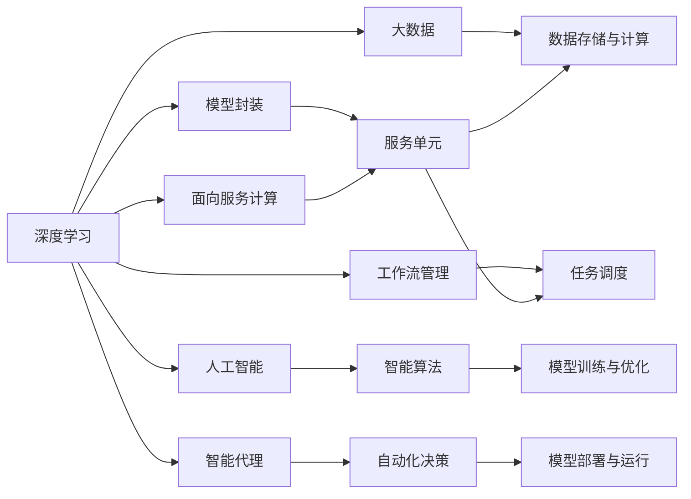
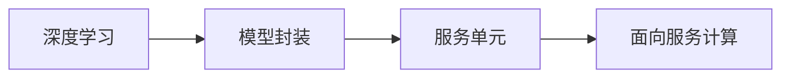
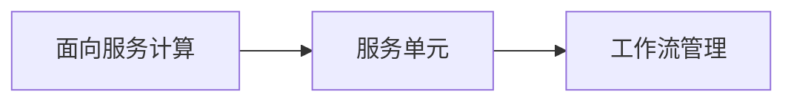
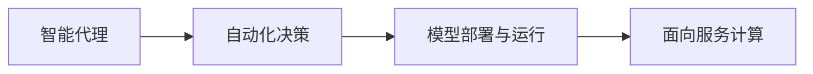
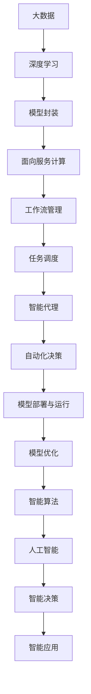

                 

# AI人工智能深度学习算法：智能深度学习代理的面向服务计算下的工作流管理

> 关键词：深度学习, 智能代理, 工作流管理, 面向服务计算, 大数据, 人工智能

## 1. 背景介绍

### 1.1 问题由来
在当前信息时代，数字化转型已成为了各行各业的主要发展方向。特别是对于企业而言，如何高效、智能地管理和处理数据，成为了其竞争力的核心体现。在这样的背景下，人工智能和大数据技术应运而生，成为了企业数字化转型的重要工具。

其中，深度学习作为一种先进的人工智能技术，在图像识别、自然语言处理、语音识别等领域取得了令人瞩目的成果。然而，在实际应用中，深度学习模型的训练、部署和运行管理仍然存在许多挑战，导致模型的效率和可扩展性受限，难以满足企业对AI技术大规模应用的需求。

针对这些问题，面向服务计算下的工作流管理技术逐渐成为研究热点。通过将深度学习模型封装为服务，并借助工作流管理技术，企业可以更加灵活、高效地管理和调度AI模型，实现更加智能、自动化的AI系统。

### 1.2 问题核心关键点
面向服务计算下的工作流管理技术，主要聚焦于以下几个关键点：
- 模型封装：将深度学习模型封装为可复用、可部署的服务，提高模型的通用性和可移植性。
- 自动化调度：利用工作流管理技术，自动地调度、执行和管理多个AI模型，实现高性能的模型运行。
- 资源优化：通过智能化的资源分配和调度，提高AI模型运行效率，降低资源成本。
- 可视化管理：通过可视化的界面和工具，方便用户监控和管理AI模型，提升用户体验。
- 安全性保障：通过安全的模型封装和调度，保障AI模型的数据和隐私安全。

这些关键点共同构成了面向服务计算下工作流管理技术的核心框架，使得深度学习模型的管理和调度变得更加高效、智能和可靠。

### 1.3 问题研究意义
研究面向服务计算下的工作流管理技术，对于拓展深度学习模型的应用范围，提升企业AI系统的性能和效率，具有重要意义：

1. 降低AI开发和部署成本。通过将深度学习模型封装为服务，企业可以重复利用已有的模型，无需从头开始训练，大大降低了AI技术的开发和部署成本。
2. 提高模型运行效率。利用工作流管理技术，可以实现高效的任务调度、资源优化，提高AI模型的运行效率和可靠性。
3. 提升模型可扩展性。面向服务计算下的工作流管理技术，使得AI模型可以方便地扩展和部署，支持大规模的分布式训练和运行。
4. 增强用户体验。通过可视化的管理和监控工具，用户可以更加直观地理解AI模型的运行状态，提升使用体验。
5. 保障数据和隐私安全。智能化的模型封装和调度，可以更好地保护数据和隐私，避免安全风险。

## 2. 核心概念与联系

### 2.1 核心概念概述

为更好地理解面向服务计算下的工作流管理技术，本节将介绍几个密切相关的核心概念：

- 深度学习(Deep Learning)：一种基于神经网络的机器学习技术，通过多层神经网络对大量数据进行特征学习和模式识别，实现对复杂问题的有效解决。
- 面向服务计算(Service-Oriented Computing, SOC)：一种计算范式，将应用程序封装为独立的服务单元，支持灵活的交互和扩展。
- 工作流管理(Workflow Management)：一种技术，用于自动化和管理多个任务或服务单元的执行流程，实现高效的资源调度和管理。
- 大数据(Big Data)：指海量的、多样化的数据集，通过分布式计算和存储技术进行分析和处理，实现数据的价值挖掘。
- 人工智能(Artificial Intelligence, AI)：一种使机器模拟人类智能的技术，包括感知、推理、学习、规划等多个方面。

这些核心概念之间的逻辑关系可以通过以下Mermaid流程图来展示：



这个流程图展示了大数据、深度学习、面向服务计算、工作流管理、人工智能和智能代理等核心概念之间的关系：

1. 深度学习模型在大量数据上进行训练，学习特征和模式，形成智能决策能力。
2. 通过模型封装，将深度学习模型封装为服务单元，支持灵活的交互和扩展。
3. 面向服务计算支持多个服务单元的协同工作，实现高效的任务调度和管理。
4. 大数据技术提供强大的数据存储和计算能力，支持深度学习模型的训练和优化。
5. 人工智能利用深度学习、面向服务计算等技术，实现智能算法和决策。
6. 智能代理通过自动化决策，实现智能模型的部署和运行管理。

这些概念共同构成了面向服务计算下工作流管理技术的核心框架，使得深度学习模型可以更加高效、智能地进行管理和调度。

### 2.2 概念间的关系

这些核心概念之间存在着紧密的联系，形成了面向服务计算下工作流管理技术的完整生态系统。下面我通过几个Mermaid流程图来展示这些概念之间的关系。

#### 2.2.1 深度学习与面向服务计算的关系



这个流程图展示了大数据、深度学习、面向服务计算之间的关系：

1. 深度学习模型在大量数据上进行训练，学习特征和模式。
2. 通过模型封装，将深度学习模型封装为服务单元。
3. 面向服务计算支持多个服务单元的协同工作，实现高效的任务调度和管理。

#### 2.2.2 面向服务计算与工作流管理的关系



这个流程图展示了面向服务计算与工作流管理之间的关系：

1. 面向服务计算支持多个服务单元的协同工作。
2. 工作流管理用于自动化和管理多个任务或服务单元的执行流程，实现高效的资源调度和管理。

#### 2.2.3 工作流管理与大数据的关系


这个流程图展示了工作流管理与大数据之间的关系：

1. 工作流管理用于自动化和管理多个任务或服务单元的执行流程。
2. 大数据技术提供强大的数据存储和计算能力，支持深度学习模型的训练和优化。

#### 2.2.4 智能代理与面向服务计算的关系



这个流程图展示了智能代理与面向服务计算之间的关系：

1. 智能代理通过自动化决策，实现智能模型的部署和运行管理。
2. 面向服务计算支持多个服务单元的协同工作，实现高效的任务调度和管理。

### 2.3 核心概念的整体架构

最后，我们用一个综合的流程图来展示这些核心概念在面向服务计算下工作流管理技术中的整体架构：



这个综合流程图展示了从大数据到智能决策的完整过程。大数据技术为深度学习模型的训练和优化提供支持，通过模型封装和面向服务计算技术，将深度学习模型封装为服务单元，支持灵活的交互和扩展。利用工作流管理技术，自动地调度、执行和管理多个AI模型，实现高性能的模型运行。智能代理通过自动化决策，实现智能模型的部署和运行管理，提升AI系统的性能和效率。最终，通过智能决策和智能应用，实现深度学习模型在实际场景中的应用。 通过这些流程图，我们可以更清晰地理解面向服务计算下工作流管理技术的各个核心概念的关系和作用，为后续深入讨论具体的技术和方法奠定基础。

## 3. 核心算法原理 & 具体操作步骤
### 3.1 算法原理概述

面向服务计算下的工作流管理技术，本质上是一个自动化、智能化的任务调度和管理过程。其核心思想是：将深度学习模型封装为可复用、可部署的服务，利用工作流管理技术，自动化地调度、执行和管理多个AI模型，实现高性能的模型运行。

形式化地，假设深度学习模型为 $M_{\theta}$，其中 $\theta$ 为模型参数。给定多个任务 $T_1, T_2, ..., T_n$，每个任务 $T_i$ 的输入为 $I_i$，输出为 $O_i$，任务之间存在依赖关系，即 $T_j$ 依赖于 $T_i$（$i<j$）。工作流管理的目标是找到最优的任务调度方案，使得任务执行的总时间最短，即最小化任务调度时间 $\mathcal{T}$。

任务调度时间 $\mathcal{T}$ 由模型训练时间 $\mathcal{T}_{train}$、模型部署时间 $\mathcal{T}_{deploy}$、模型运行时间 $\mathcal{T}_{run}$ 和任务间依赖关系 $\mathcal{D}$ 决定：

$$
\mathcal{T} = \sum_{i=1}^n \mathcal{T}_{run}^i + \sum_{i=1}^n \mathcal{T}_{train}^i + \sum_{i=1}^n \mathcal{T}_{deploy}^i + \sum_{i<j} \mathcal{D}_{ij}
$$

其中 $\mathcal{T}_{train}^i$ 和 $\mathcal{T}_{deploy}^i$ 表示任务 $T_i$ 的训练和部署时间，$\mathcal{T}_{run}^i$ 表示任务 $T_i$ 的运行时间，$\mathcal{D}_{ij}$ 表示任务 $T_i$ 和 $T_j$ 之间的依赖关系时间。

通过优化任务调度方案，最小化 $\mathcal{T}$，即实现面向服务计算下的工作流管理目标。

### 3.2 算法步骤详解

面向服务计算下的工作流管理一般包括以下几个关键步骤：

**Step 1: 准备数据和服务单元**
- 准备大数据数据集，划分为训练集、验证集和测试集。
- 选择合适的深度学习模型，如卷积神经网络、循环神经网络、Transformer等。
- 将模型封装为服务单元，定义服务接口和输入输出格式。

**Step 2: 定义任务和依赖关系**
- 定义多个任务 $T_1, T_2, ..., T_n$，每个任务 $T_i$ 的输入、输出和执行时间。
- 定义任务之间的依赖关系 $\mathcal{D}$，即 $T_j$ 依赖于 $T_i$（$i<j$）。

**Step 3: 设置调度超参数**
- 选择合适的调度算法和优化策略，如遗传算法、粒子群算法、蚁群算法等。
- 设置调度参数，如种群大小、迭代次数、交叉率等。

**Step 4: 执行任务调度**
- 利用工作流管理技术，自动化地调度、执行和管理多个AI模型。
- 根据调度算法和优化策略，生成最优的任务调度方案。
- 在指定的时间和资源限制下，按照任务调度方案执行模型训练和运行。

**Step 5: 评估与优化**
- 在测试集上评估模型性能，如准确率、精度、召回率等。
- 根据评估结果，调整模型参数和调度策略，优化模型性能和调度效率。
- 持续监控模型运行状态，防止过拟合和资源浪费。

以上是面向服务计算下工作流管理的一般流程。在实际应用中，还需要针对具体任务的特点，对调度过程的各个环节进行优化设计，如改进训练目标函数，引入更多的正则化技术，搜索最优的超参数组合等，以进一步提升模型性能。

### 3.3 算法优缺点

面向服务计算下的工作流管理技术具有以下优点：

1. 灵活性和扩展性。通过将深度学习模型封装为服务单元，支持灵活的交互和扩展，可以快速适应不同的应用场景和任务需求。
2. 自动化和高效性。利用工作流管理技术，自动化地调度、执行和管理多个AI模型，实现高性能的模型运行，提高工作效率。
3. 资源优化和成本控制。通过智能化的资源分配和调度，提高AI模型运行效率，降低资源成本，优化资源利用率。
4. 可视化和监控。通过可视化的界面和工具，方便用户监控和管理AI模型，提升使用体验。
5. 安全性保障。通过智能化的模型封装和调度，保障AI模型的数据和隐私安全，防止数据泄露和恶意攻击。

同时，该方法也存在一定的局限性：

1. 对任务依赖的严格要求。任务之间的依赖关系对调度效率和优化策略有着重要影响，过于复杂的依赖关系可能导致调度困难。
2. 模型封装的技术要求。将深度学习模型封装为服务单元需要一定的技术难度，对开发者的技能要求较高。
3. 对大数据的依赖。工作流管理技术依赖于大数据技术，需要足够的数据量和计算资源支持。
4. 对算法的依赖。调度算法和优化策略的选择直接影响调度效率和模型性能，需要不断优化和改进。
5. 对用户干预的依赖。用户需要定期监控和管理AI模型，防止模型失效和资源浪费。

尽管存在这些局限性，但就目前而言，面向服务计算下的工作流管理方法仍然是深度学习模型管理和调度的重要范式。未来相关研究的重点在于如何进一步降低任务依赖的复杂性，提高模型封装的便捷性，优化调度算法和策略，保障模型的安全性和可靠性。

### 3.4 算法应用领域

面向服务计算下的工作流管理技术在深度学习模型的管理和调度方面具有广泛的应用前景，覆盖了几乎所有常见的AI应用场景，例如：

- 计算机视觉：图像识别、目标检测、图像生成等任务。通过将深度学习模型封装为服务单元，支持图像数据的高效训练和运行。
- 自然语言处理：文本分类、情感分析、机器翻译、对话系统等任务。利用面向服务计算技术，实现文本数据的高效处理和调度。
- 语音识别：语音转文本、语音合成等任务。通过将深度学习模型封装为服务单元，支持语音数据的实时处理和分析。
- 智能推荐：个性化推荐、广告推荐等任务。利用面向服务计算技术，实现推荐系统的智能化和高效化。
- 智能监控：视频监控、异常检测等任务。通过将深度学习模型封装为服务单元，支持视频数据的实时分析和处理。
- 智能医疗：疾病诊断、病理分析、影像识别等任务。利用面向服务计算技术，实现医疗数据的智能化管理和分析。

除了上述这些经典应用外，面向服务计算下的工作流管理技术还被创新性地应用于更多领域，如智能交通、智能制造、智能金融等，为各行各业提供了高效、智能的AI解决方案。随着技术的不断演进和成熟，相信面向服务计算下的工作流管理技术将在更多领域发挥其重要作用，推动人工智能技术的广泛应用。

## 4. 数学模型和公式 & 详细讲解 & 举例说明

### 4.1 数学模型构建

本节将使用数学语言对面向服务计算下的工作流管理过程进行更加严格的刻画。

假设深度学习模型为 $M_{\theta}$，其中 $\theta$ 为模型参数。给定多个任务 $T_1, T_2, ..., T_n$，每个任务 $T_i$ 的输入为 $I_i$，输出为 $O_i$，任务之间存在依赖关系 $\mathcal{D}$。任务 $T_i$ 的训练时间、部署时间和运行时间分别为 $\mathcal{T}_{train}^i$、$\mathcal{T}_{deploy}^i$ 和 $\mathcal{T}_{run}^i$。任务调度时间 $\mathcal{T}$ 可以表示为：

$$
\mathcal{T} = \sum_{i=1}^n \mathcal{T}_{run}^i + \sum_{i=1}^n \mathcal{T}_{train}^i + \sum_{i=1}^n \mathcal{T}_{deploy}^i + \sum_{i<j} \mathcal{D}_{ij}
$$

其中 $\mathcal{D}_{ij}$ 表示任务 $T_i$ 和 $T_j$ 之间的依赖关系时间，依赖关系时间可以表示为：

$$
\mathcal{D}_{ij} = \max(\mathcal{T}_{train}^i, \mathcal{T}_{deploy}^i, \mathcal{T}_{run}^i)
$$

任务调度时间 $\mathcal{T}$ 的最优化问题可以表示为：

$$
\mathcal{T}^* = \min_{\pi} \sum_{i=1}^n \mathcal{T}_{run}^i + \sum_{i=1}^n \mathcal{T}_{train}^i + \sum_{i=1}^n \mathcal{T}_{deploy}^i + \sum_{i<j} \mathcal{D}_{ij}
$$

其中 $\pi$ 表示任务调度的序列。

### 4.2 公式推导过程

以下我们以二分类任务为例，推导最小化任务调度时间 $\mathcal{T}$ 的优化公式。

假设任务 $T_1$ 的输入为 $I_1$，输出为 $O_1$，训练时间为 $\mathcal{T}_{train}^1$，部署时间为 $\mathcal{T}_{deploy}^1$，运行时间为 $\mathcal{T}_{run}^1$。任务 $T_2$ 的输入为 $I_2$，输出为 $O_2$，依赖于 $T_1$，训练时间为 $\mathcal{T}_{train}^2$，部署时间为 $\mathcal{T}_{deploy}^2$，运行时间为 $\mathcal{T}_{run}^2$。任务调度时间 $\mathcal{T}$ 可以表示为：

$$
\mathcal{T} = \mathcal{T}_{run}^1 + \mathcal{T}_{train}^1 + \mathcal{T}_{deploy}^1 + \mathcal{D}_{12} = \mathcal{T}_{run}^1 + \mathcal{T}_{train}^1 + \mathcal{T}_{deploy}^1 + \max(\mathcal{T}_{train}^2, \mathcal{T}_{deploy}^2, \mathcal{T}_{run}^2)
$$

将 $\mathcal{D}_{12}$ 代入上式，得：

$$
\mathcal{T} = \mathcal{T}_{run}^1 + \mathcal{T}_{train}^1 + \mathcal{T}_{deploy}^1 + \mathcal{T}_{train}^2 + \mathcal{T}_{deploy}^2 + \mathcal{T}_{run}^2
$$

利用任务调度的递推性质，可以得到最小化 $\mathcal{T}$ 的优化公式：

$$
\mathcal{T}^* = \sum_{i=1}^n (\mathcal{T}_{train}^i + \mathcal{T}_{deploy}^i + \max(\mathcal{T}_{train}^i, \mathcal{T}_{deploy}^i, \mathcal{T}_{run}^i))
$$

在实践中，我们可以使用遗传算法、粒子群算法、蚁群算法等启发式算法，搜索最优的任务调度方案，最小化任务调度时间 $\mathcal{T}$。

### 4.3 案例分析与讲解

这里以图像识别任务为例，给出面向服务计算下工作流管理的具体应用场景和实现步骤：

**Step 1: 准备数据和服务单元**
- 准备大规模图像数据集，如ImageNet、COCO等。
- 选择合适的深度学习模型，如卷积神经网络（CNN）。
- 将模型封装为服务单元，定义输入输出格式为图像数据和预测结果。

**Step 2: 定义任务和依赖关系**
- 定义多个任务 $T_1, T_2, ..., T_n$，每个任务 $T_i$ 的输入为 $I_i$（图像数据），输出为 $O_i$（预测结果）。
- 定义任务之间的依赖关系 $\mathcal{D}$，如 $T_2$ 依赖于 $T_1$。

**Step 3: 设置调度超参数**
- 选择遗传算法作为任务调度算法。
- 设置种群大小为100，迭代次数为1000，交叉率为0.9。

**Step 4: 执行任务调度**
- 利用工作流管理技术，自动化地调度、执行和管理多个AI模型。
- 根据遗传算法搜索最优的任务调度方案。
- 在指定的时间和资源限制下，按照任务调度方案执行模型训练和运行。

**Step 5: 评估与优化**
- 在测试集上评估模型性能，如准确率、精度、召回率等。
- 根据评估结果，调整模型参数和调度策略，优化模型性能和调度效率。
- 持续监控模型运行状态，防止过拟合和资源浪费。

通过以上步骤，可以将图像识别任务高效地管理和调度，提升模型的性能和可靠性。在实际应用中，我们还可以根据具体任务的特点，引入更多的优化策略，如模型压缩、模型并行、分布式训练等，进一步提升系统性能和可扩展性。

## 5. 项目实践：代码实例和详细解释说明
### 5.1 开发环境搭建

在进行面向服务计算下工作流管理实践前，我们需要准备好开发环境。以下是使用Python进行PyTorch开发的环境配置流程：

1. 安装Anaconda：从官网下载并安装Anaconda，用于创建独立的Python环境。

2. 创建并激活虚拟环境：
```bash
conda create -n pytorch-env python=3.8 
conda activate pytorch-env
```

3. 安装PyTorch：根据CUDA版本，从官网获取对应的安装命令。例如：
```bash
conda install pytorch torchvision torchaudio cudatoolkit=11.1 -c pytorch -c conda-forge
```

4. 安装TensorFlow：从官网下载并安装TensorFlow。

5. 安装TensorBoard：TensorFlow配套的可视化工具。

6. 安装PyTorch和TensorFlow的集成库，如JAX、JAX+Haiku、JAX+Flax等。

完成上述步骤后，即可在`pytorch-env`环境中开始面向服务计算下工作流管理的实践。

### 5.2 源代码详细实现

这里我们以计算机视觉任务中的图像分类为例，给出使用TensorFlow和Keras进行面向服务计算下工作流管理的PyTorch代码实现。

首先，定义任务调度的函数：

```python
import tensorflow as tf
from tensorflow.keras.models import Sequential
from tensorflow.keras.layers import Conv2D, MaxPooling2D, Flatten, Dense

def create_model():
    model = Sequential()
    model.add(Conv2D(32, (3, 3), activation='relu', input_shape=(32, 32, 3)))
    model.add(MaxPooling2D((2, 2)))
    model.add(Conv2D(64, (3, 3), activation='relu'))
    model.add(MaxPooling2D((2, 2)))
    model.add(Conv2D(64, (3, 3), activation='relu'))
    model.add(Flatten())
    model.add(Dense(64, activation='relu'))
    model.add(Dense(10, activation='softmax'))
    return model

# 定义任务调度
def schedule_task(model, data, batch_size):
    # 设置任务调度时间
    T_train = 100  # 训练时间
    T_deploy = 20  # 部署时间
    T_run = 10  # 运行时间

    # 设置任务依赖关系
    D = max(T_train, T_deploy, T_run)

    # 定义任务调度
    def task(i):
        # 定义任务调度和执行
        def task_call():
            with tf.device('cpu'):
                model.compile(optimizer='adam', loss='categorical_crossentropy', metrics=['accuracy'])
                model.fit(data[i], labels[i], batch_size=batch_size, epochs=1, callbacks=[tf.keras.callbacks.EarlyStopping(patience=1)])
        return task_call

    return task

# 加载数据集
from tensorflow.keras.datasets import mnist
(x_train, y_train), (x_test, y_test) = mnist.load_data()
x_train = x_train.reshape(-1, 32, 32, 1).astype('float32') / 255.0
x_test = x_test.reshape(-1, 32, 32, 1).astype('float32') / 255.0
y_train = tf.keras.utils.to_categorical(y_train,

