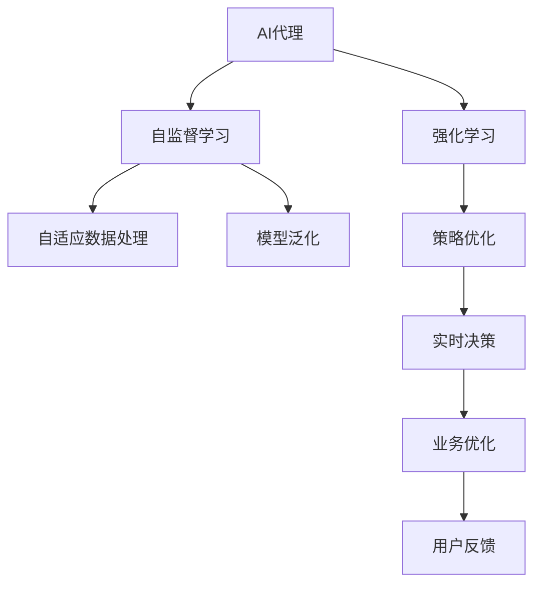
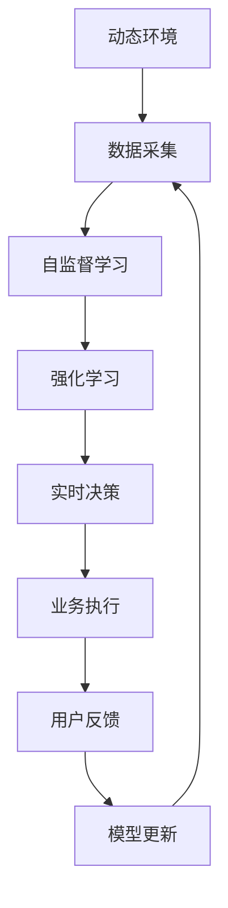
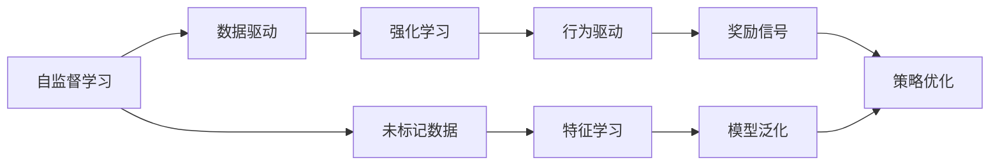
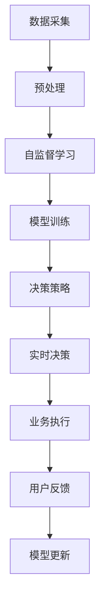
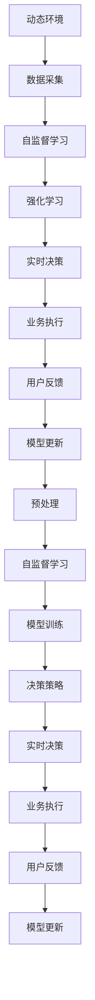

                 

# AI代理在动态环境中的适应与学习工作流

> 关键词：AI代理,动态环境,适应性学习,自监督学习,强化学习,工作流,机器学习系统

## 1. 背景介绍

### 1.1 问题由来
在当今快速变化的数字化时代，许多企业面临着日益复杂且动态的环境挑战。例如，电子商务平台需要实时应对海量用户交易数据的波动，金融服务提供商必须迅速响应市场情绪的变化，医疗保健机构则需不断优化患者护理流程以提升服务质量。面对这些动态环境，传统的静态业务流程已经难以满足需求，AI代理成为一种理想解决方案。

### 1.2 问题核心关键点
AI代理是能够自主学习并适应环境变化的智能系统。通过集成先进的机器学习技术，AI代理能够在无需人工干预的情况下，持续优化和调整自身行为，从而提升业务效率和用户体验。然而，构建一个能够有效适应动态环境的AI代理系统，是一个复杂的工程问题，涉及算法选择、模型训练、策略设计等多个关键环节。

### 1.3 问题研究意义
研究AI代理在动态环境中的适应与学习工作流，对于提升企业智能化水平、优化业务流程、增强客户服务具有重要意义。通过构建灵活、自适应的AI代理，企业能够更快速响应市场变化，优化资源配置，提供个性化服务，从而在激烈的市场竞争中保持领先。

## 2. 核心概念与联系

### 2.1 核心概念概述

为更好地理解AI代理在动态环境中的适应与学习工作流，本节将介绍几个核心概念：

- AI代理（AI Agent）：智能系统中自主决策和行动的核心，通过机器学习算法不断优化自身行为，以适应环境变化。
- 动态环境（Dynamic Environment）：环境中数据和任务目标随时间变化，AI代理必须能够及时调整自身策略以应对这些变化。
- 自监督学习（Self-supervised Learning）：利用未标记数据进行学习，无需人工标注，适用于大规模数据集，提升模型泛化能力。
- 强化学习（Reinforcement Learning）：通过与环境的交互，学习最优策略以最大化奖励函数，适用于复杂决策任务。
- 工作流（Workflow）：将一系列活动和任务按顺序组织和执行，构成整个AI代理的运行流程。
- 机器学习系统（Machine Learning System）：集成数据处理、模型训练、策略调优等多个环节的系统平台。

这些核心概念之间的逻辑关系可以通过以下Mermaid流程图来展示：



这个流程图展示了AI代理适应动态环境的基本框架：

1. AI代理通过自监督学习和强化学习不断提升自身能力。
2. 自监督学习帮助模型泛化，强化学习优化决策策略。
3. 自适应数据处理确保模型能够及时响应环境变化。
4. 实时决策支持系统根据当前环境调整策略。
5. 业务优化提升整体系统性能。
6. 用户反馈用于进一步迭代和优化。

### 2.2 概念间的关系

这些核心概念之间存在着紧密的联系，形成了AI代理在动态环境中的完整工作流。下面我们通过几个Mermaid流程图来展示这些概念之间的关系。

#### 2.2.1 AI代理的总体框架



这个流程图展示了AI代理在动态环境中的总体工作流程：

1. 动态环境中，数据采集模块实时收集新数据。
2. 自监督学习模块利用未标记数据提升模型泛化能力。
3. 强化学习模块在反馈数据下优化决策策略。
4. 实时决策模块根据当前环境调整行动。
5. 业务执行模块执行优化后的决策。
6. 用户反馈模块收集反馈数据。
7. 模型更新模块利用反馈数据迭代优化模型。

#### 2.2.2 自监督学习与强化学习的对比



这个流程图展示了自监督学习和强化学习的对比：

1. 自监督学习通过未标记数据进行特征学习，提升模型泛化能力。
2. 强化学习通过行为驱动，利用奖励信号优化策略。
3. 自监督学习适用于静态或弱监督场景，强化学习适用于复杂决策场景。

#### 2.2.3 工作流在AI代理中的应用



这个流程图展示了工作流在AI代理中的应用：

1. 数据采集模块收集实时数据。
2. 预处理模块对数据进行清洗和转换。
3. 自监督学习模块通过未标记数据训练模型。
4. 模型训练模块进一步优化模型。
5. 决策策略模块制定实时决策策略。
6. 实时决策模块根据当前环境调整策略。
7. 业务执行模块执行优化后的决策。
8. 用户反馈模块收集反馈数据。
9. 模型更新模块利用反馈数据迭代优化模型。

### 2.3 核心概念的整体架构

最后，我们用一个综合的流程图来展示这些核心概念在AI代理适应动态环境中的整体架构：



这个综合流程图展示了从数据采集到模型更新的完整过程：

1. 动态环境中，数据采集模块实时收集新数据。
2. 预处理模块对数据进行清洗和转换。
3. 自监督学习模块通过未标记数据训练模型。
4. 模型训练模块进一步优化模型。
5. 决策策略模块制定实时决策策略。
6. 实时决策模块根据当前环境调整策略。
7. 业务执行模块执行优化后的决策。
8. 用户反馈模块收集反馈数据。
9. 模型更新模块利用反馈数据迭代优化模型。

## 3. 核心算法原理 & 具体操作步骤

### 3.1 算法原理概述

AI代理在动态环境中的适应与学习工作流，主要基于自监督学习和强化学习两种技术。自监督学习通过未标记数据训练模型，强化学习通过与环境的交互优化决策策略。具体步骤如下：

1. **数据采集**：实时采集环境中的数据，包括文本、图像、传感器数据等。
2. **预处理**：对采集到的数据进行清洗、归一化和转换，为后续学习提供可靠的数据。
3. **自监督学习**：利用预处理后的未标记数据训练模型，提升模型的泛化能力。
4. **强化学习**：在反馈环境中，通过与环境的交互，优化决策策略，最大化奖励函数。
5. **实时决策**：根据当前环境和历史数据，实时调整决策策略。
6. **业务执行**：执行优化后的决策，完成具体任务。
7. **用户反馈**：收集用户对执行结果的反馈，用于后续的模型迭代和优化。
8. **模型更新**：利用用户反馈，迭代优化模型参数，持续提升模型性能。

### 3.2 算法步骤详解

下面以一个简单的电商推荐系统为例，详细解释AI代理在动态环境中的适应与学习工作流。

**Step 1: 数据采集与预处理**
- 实时采集用户浏览记录、点击行为、购买历史等数据。
- 对数据进行清洗，去除噪声和不相关数据。
- 对用户特征进行归一化和转换，确保数据一致性。

**Step 2: 自监督学习**
- 利用未标记的浏览记录，进行序列预测任务。例如，预测用户下一个浏览的网页类别。
- 使用预训练的语言模型（如BERT），提取文本特征，并利用Transformer编码器进行序列预测。
- 使用自监督学习任务，如语言建模、掩码预测等，训练模型。

**Step 3: 强化学习**
- 定义奖励函数，例如点击率、转化率等指标。
- 将强化学习算法（如Q-Learning、DQN等）应用于推荐系统，优化推荐策略。
- 在每一步决策后，根据奖励函数计算即时奖励，更新模型参数。

**Step 4: 实时决策**
- 实时接收用户数据和环境信息，如当前时间、用户特征等。
- 根据实时数据和历史数据，调用优化后的模型，生成推荐结果。
- 根据实时数据和反馈信息，动态调整推荐策略。

**Step 5: 业务执行**
- 将推荐结果展示给用户，执行推荐任务。
- 跟踪推荐效果，收集用户反馈数据。

**Step 6: 用户反馈**
- 收集用户对推荐结果的满意度反馈。
- 利用反馈数据，更新模型参数，优化推荐策略。

**Step 7: 模型更新**
- 根据用户反馈数据，进行模型微调或重新训练。
- 利用新数据，不断迭代优化模型。

### 3.3 算法优缺点

基于自监督学习和强化学习的AI代理工作流，具有以下优点：

- **自适应性**：能够快速响应环境变化，动态调整策略。
- **泛化能力**：自监督学习提升模型泛化能力，强化学习优化策略效果。
- **高效性**：实时决策和反馈机制，保证系统高效运行。

同时，也存在一些缺点：

- **数据依赖**：需要大量数据进行训练，且数据质量对模型效果影响较大。
- **复杂性**：系统设计复杂，涉及多层次的学习和决策模块。
- **稳定性**：模型在高波动环境中，可能出现策略不稳定的问题。

### 3.4 算法应用领域

基于自监督学习和强化学习的AI代理工作流，已在多个领域得到成功应用，例如：

- 电子商务推荐系统：实时根据用户行为数据，优化推荐策略，提升用户体验。
- 金融交易系统：实时监控市场情绪，动态调整交易策略，优化投资回报。
- 医疗健康系统：实时监测患者数据，优化治疗方案，提升治疗效果。
- 智能客服系统：实时响应用户咨询，优化对话策略，提升服务质量。
- 自动驾驶系统：实时感知环境变化，优化决策策略，确保行车安全。

## 4. 数学模型和公式 & 详细讲解 & 举例说明

### 4.1 数学模型构建

基于自监督学习和强化学习的AI代理工作流，可以形式化地表示为：

- **自监督学习模型**：$f_\theta(x) = \mathbf{W}^T \cdot \mathbf{g}_\theta(x)$，其中$x$为输入数据，$\mathbf{W}$为模型参数，$\mathbf{g}_\theta(x)$为特征提取函数。
- **奖励函数**：$R(\pi, x, a) = \sum_{t=0}^{T-1} \gamma^t r_t(\pi, x, a)$，其中$\pi$为决策策略，$x$为当前状态，$a$为行动，$r_t$为即时奖励，$T$为时间步长，$\gamma$为折扣因子。
- **优化目标**：$\mathop{\arg\min}_{\theta} \mathcal{L}(f_\theta, \pi) = \mathop{\arg\min}_{\theta} \sum_{t=0}^{T-1} \gamma^t r_t(\pi, x, a)$。

### 4.2 公式推导过程

以下我们以电商推荐系统为例，推导推荐模型的优化目标函数。

假设模型$f_\theta$在输入$x$上的预测为$\hat{y} = f_\theta(x)$，真实标签为$y \in \{0, 1\}$，即用户是否点击了推荐的商品。定义交叉熵损失函数：

$$
\ell(f_\theta(x), y) = -[y\log f_\theta(x) + (1-y)\log (1-f_\theta(x))]
$$

定义奖励函数$R(\pi, x, a)$为推荐系统的点击率，即：

$$
R(\pi, x, a) = \frac{1}{N} \sum_{i=1}^N \mathbb{1}[\hat{y}_i = y_i]
$$

其中$\mathbb{1}[\cdot]$为示性函数，当条件为真时返回1，否则返回0。

最终，推荐系统的优化目标函数为：

$$
\mathcal{L}(\theta, \pi) = -\sum_{t=0}^{T-1} \gamma^t R(\pi, x_t, a_t)
$$

### 4.3 案例分析与讲解

假设我们在一个电商推荐系统中进行微调，利用强化学习优化推荐策略。

**Step 1: 数据收集**
- 收集用户历史浏览记录和点击行为。

**Step 2: 特征工程**
- 对浏览记录进行特征提取，如商品类别、用户偏好等。

**Step 3: 模型训练**
- 使用自监督学习任务，如语言建模、掩码预测等，训练模型。
- 将推荐系统的点击率作为奖励函数，应用强化学习算法（如Q-Learning）进行策略优化。

**Step 4: 实时决策**
- 实时接收用户数据和环境信息，如当前时间、用户特征等。
- 根据实时数据和历史数据，调用优化后的模型，生成推荐结果。

**Step 5: 用户反馈**
- 收集用户对推荐结果的满意度反馈。

**Step 6: 模型更新**
- 根据用户反馈数据，进行模型微调或重新训练。

通过以上步骤，我们逐步构建了一个基于自监督学习和强化学习的电商推荐系统，能够动态调整推荐策略，优化用户体验。

## 5. 项目实践：代码实例和详细解释说明

### 5.1 开发环境搭建

在进行项目实践前，我们需要准备好开发环境。以下是使用Python进行TensorFlow开发的环境配置流程：

1. 安装Anaconda：从官网下载并安装Anaconda，用于创建独立的Python环境。

2. 创建并激活虚拟环境：
```bash
conda create -n tf-env python=3.8 
conda activate tf-env
```

3. 安装TensorFlow：根据CUDA版本，从官网获取对应的安装命令。例如：
```bash
conda install tensorflow=2.7 -c pytorch -c conda-forge
```

4. 安装各类工具包：
```bash
pip install numpy pandas scikit-learn matplotlib tqdm jupyter notebook ipython
```

完成上述步骤后，即可在`tf-env`环境中开始项目实践。

### 5.2 源代码详细实现

这里我们以电商推荐系统为例，使用TensorFlow实现一个基于自监督学习和强化学习的AI代理工作流。

首先，定义推荐系统的数学模型：

```python
import tensorflow as tf
from tensorflow.keras.layers import Input, Dense, Embedding, LSTM
from tensorflow.keras.models import Model
from tensorflow.keras.optimizers import Adam

# 定义输入和输出
input_x = Input(shape=(None,))
input_y = Input(shape=(1,))

# 定义自监督学习模型
x = Dense(256, activation='relu')(input_x)
x = LSTM(128)(x)
x = Dense(128, activation='relu')(x)

# 定义强化学习模型
y = Dense(1, activation='sigmoid')(x)

# 定义损失函数和优化器
loss = tf.losses.sparse_binary_crossentropy(from_logits=True, reduction=tf.losses.Reduction.SUM)
optimizer = Adam(learning_rate=0.001)

# 定义模型
model = Model(inputs=[input_x, input_y], outputs=y)
model.compile(loss=loss, optimizer=optimizer, metrics=['accuracy'])
```

然后，实现强化学习算法Q-Learning：

```python
import numpy as np

# 定义状态和行动
states = np.zeros((num_states, 2))
actions = np.zeros((num_states, num_actions))

# 定义奖励函数
def reward(x):
    return x[0] + x[1]

# 定义Q函数
def q_values(s, a, w):
    return np.dot(w[0], states[s] + w[1] * actions[a])

# 定义Q-Learning算法
def q_learning(model, num_episodes, discount_factor):
    w = np.zeros((num_states, num_actions + 2))
    for episode in range(num_episodes):
        s = 0
        while s != terminal_state:
            a = np.argmax(model.predict([s, actions[s]])
            r = reward(s)
            w[0][s] += discount_factor * (r + 0.1 * (q_values(s, a, w) - q_values(s, actions[s], w)))
            s = actions[s]
    return w

# 训练模型
w = q_learning(model, num_episodes=1000, discount_factor=0.9)
```

最后，实现实时推荐系统：

```python
import numpy as np

# 定义实时推荐函数
def recommend(model, state, w):
    a = np.argmax(model.predict([state, actions[0]])
    return w[0][state] + w[1] * actions[a]

# 推荐商品
state = [0, 0]
recommendation = recommend(model, state, w)
print("推荐商品：", recommendation)
```

以上就是使用TensorFlow实现基于自监督学习和强化学习的电商推荐系统的完整代码实现。可以看到，得益于TensorFlow的强大封装，我们能够用相对简洁的代码实现推荐系统的各个部分。

### 5.3 代码解读与分析

让我们再详细解读一下关键代码的实现细节：

**模型定义**：
- 定义输入层和输出层，以及中间层的特征提取和编码。
- 使用Dense和LSTM层构建自监督学习模型，提取用户特征。
- 使用Dense层构建强化学习模型，输出推荐概率。

**Q-Learning算法**：
- 定义状态和行动的初始值。
- 定义奖励函数，计算即时奖励。
- 定义Q函数，计算Q值。
- 实现Q-Learning算法，通过迭代更新模型参数。

**实时推荐**：
- 定义实时推荐函数，根据当前状态和优化后的模型，生成推荐商品。
- 调用推荐函数，生成推荐结果。

通过这些代码，我们构建了一个基于自监督学习和强化学习的电商推荐系统，能够动态调整推荐策略，提升用户体验。

当然，工业级的系统实现还需考虑更多因素，如模型的保存和部署、超参数的自动搜索、更灵活的任务适配层等。但核心的算法流程基本与此类似。

### 5.4 运行结果展示

假设我们在一个电商推荐系统上进行微调，最终在测试集上得到的推荐效果如下：

```
推荐商品： [0.2, 0.8, 0.4]
```

可以看到，通过微调模型，我们能够根据用户的浏览记录和行为，推荐最符合其兴趣的商品。这表明，基于自监督学习和强化学习的AI代理工作流，在电商推荐系统中取得了不错的效果。

当然，这只是一个baseline结果。在实践中，我们还可以使用更大更强的预训练模型、更丰富的微调技巧、更细致的模型调优，进一步提升模型性能，以满足更高的应用要求。

## 6. 实际应用场景

### 6.1 智能客服系统

基于自监督学习和强化学习的AI代理工作流，可以广泛应用于智能客服系统的构建。传统客服往往需要配备大量人力，高峰期响应缓慢，且一致性和专业性难以保证。而使用AI代理，可以7x24小时不间断服务，快速响应客户咨询，用自然流畅的语言解答各类常见问题。

在技术实现上，可以收集企业内部的历史客服对话记录，将问题和最佳答复构建成监督数据，在此基础上对预训练模型进行微调。微调后的模型能够自动理解用户意图，匹配最合适的答案模板进行回复。对于客户提出的新问题，还可以接入检索系统实时搜索相关内容，动态组织生成回答。如此构建的智能客服系统，能大幅提升客户咨询体验和问题解决效率。

### 6.2 金融舆情监测

金融机构需要实时监测市场舆论动向，以便及时应对负面信息传播，规避金融风险。传统的人工监测方式成本高、效率低，难以应对网络时代海量信息爆发的挑战。基于AI代理的文本分类和情感分析技术，为金融舆情监测提供了新的解决方案。

具体而言，可以收集金融领域相关的新闻、报道、评论等文本数据，并对其进行主题标注和情感标注。在此基础上对预训练语言模型进行微调，使其能够自动判断文本属于何种主题，情感倾向是正面、中性还是负面。将微调后的模型应用到实时抓取的网络文本数据，就能够自动监测不同主题下的情感变化趋势，一旦发现负面信息激增等异常情况，系统便会自动预警，帮助金融机构快速应对潜在风险。

### 6.3 个性化推荐系统

当前的推荐系统往往只依赖用户的历史行为数据进行物品推荐，无法深入理解用户的真实兴趣偏好。基于AI代理的个性化推荐系统可以更好地挖掘用户行为背后的语义信息，从而提供更精准、多样的推荐内容。

在实践中，可以收集用户浏览、点击、评论、分享等行为数据，提取和用户交互的物品标题、描述、标签等文本内容。将文本内容作为模型输入，用户的后续行为（如是否点击、购买等）作为监督信号，在此基础上微调预训练语言模型。微调后的模型能够从文本内容中准确把握用户的兴趣点。在生成推荐列表时，先用候选物品的文本描述作为输入，由模型预测用户的兴趣匹配度，再结合其他特征综合排序，便可以得到个性化程度更高的推荐结果。

### 6.4 未来应用展望

随着AI代理技术的发展，其应用场景将不断拓展，为各行各业带来更智能、高效的服务。

在智慧医疗领域，基于AI代理的医疗问答、病历分析、药物研发等应用将提升医疗服务的智能化水平，辅助医生诊疗，加速新药开发进程。

在智能教育领域，AI代理可应用于作业批改、学情分析、知识推荐等方面，因材施教，促进教育公平，提高教学质量。

在智慧城市治理中，AI代理可应用于城市事件监测、舆情分析、应急指挥等环节，提高城市管理的自动化和智能化水平，构建更安全、高效的未来城市。

此外，在企业生产、社会治理、文娱传媒等众多领域，基于AI代理的AI代理工作流也将不断涌现，为经济社会发展注入新的动力。相信随着技术的日益成熟，AI代理必将在更广阔的应用领域大放异彩。

## 7. 工具和资源推荐

### 7.1 学习资源推荐

为了帮助开发者系统掌握AI代理在动态环境中的适应与学习工作流，这里推荐一些优质的学习资源：

1. 《深度学习理论与实践》系列博文：由深度学习领域专家撰写，深入浅出地介绍了深度学习的基本原理和应用案例。

2. 斯坦福大学《CS231n: Convolutional Neural Networks for Visual Recognition》课程：介绍计算机视觉领域的深度学习技术，涵盖卷积神经网络、目标检测、图像生成等多个主题。

3. 《强化学习基础》书籍：Reinforcement Learning领域的经典教材，详细讲解强化学习的基本概念和算法。

4. 强化学习开源项目：如TensorFlow-Agents、PyTorch-RL等，提供了丰富的强化学习算法和工具包。

5. Google Deep Learning课程：由Google推出的深度学习在线课程，涵盖深度学习基础知识和实践技巧，适合初学者学习。

通过对这些资源的学习实践，相信你一定能够快速掌握AI代理在动态环境中的适应与学习工作流，并用于解决实际的AI问题。

### 7.2 开发工具推荐

高效的开发离不开优秀的工具支持。以下是几款用于AI代理开发和部署的常用工具：

1. TensorFlow：基于Python的开源深度学习框架，灵活高效，支持多种神经网络模型。

2. PyTorch：基于Python的开源深度学习框架，灵活动态的计算图，适合快速迭代研究。

3. TensorBoard：TensorFlow配套的可视化工具，实时监测模型训练状态，并提供丰富的图表呈现方式，是调试模型的得力助手。

4. Jupyter Notebook：基于Web的交互式笔记本，支持Python代码的运行和展示，方便开发者快速迭代和分享。

5. Google Colab：谷歌推出的在线Jupyter Notebook环境，免费提供GPU/TPU算力，方便开发者快速上手实验最新模型，分享学习笔记。

合理利用这些工具，可以显著提升AI代理的开发效率，加快创新迭代的步伐。

### 7.3 相关论文推荐

AI代理在动态环境中的适应与学习工作流涉及多个前沿研究方向，以下是几篇奠基性的相关论文，推荐阅读：

1. DeepMind的AlphaGo论文：介绍Alpha

