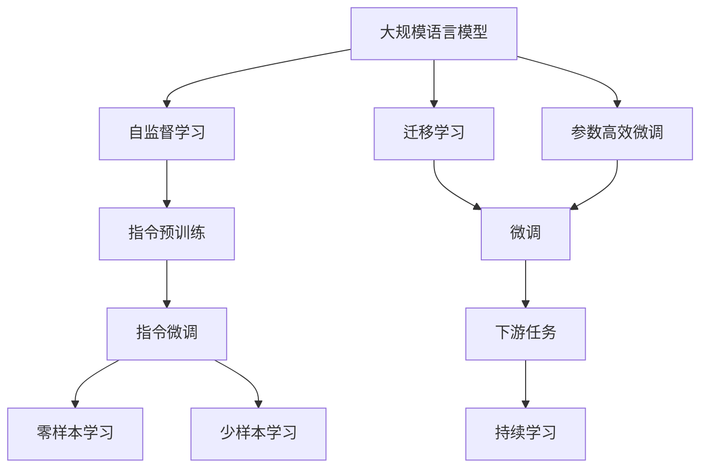

                 

# 大规模语言模型从理论到实践 开源指令数据集

## 1. 背景介绍

### 1.1 问题由来
近年来，随着深度学习技术的迅猛发展，大规模语言模型（Large Language Models, LLMs）在自然语言处理（NLP）领域取得了显著进展。以BERT、GPT-3等模型为代表的预训练模型，通过在大量无标签文本数据上自监督学习，学习到了丰富的语言知识，并在各种下游任务上取得了出色的表现。然而，这些通用语言模型在特定领域的应用效果仍有提升空间，而现有数据集的不足也限制了模型的泛化能力。

### 1.2 问题核心关键点
为了解决这些问题，研究人员提出了基于指令的预训练和微调方法。该方法通过构造自然语言指令，引导模型执行特定任务，从而在特定领域中提高模型的性能。这种方法具有以下优点：

1. **数据高效**：相比于传统的数据标注任务，指令预训练需要的数据量较小，大大减少了数据标注的成本。
2. **泛化能力强**：指令预训练能够帮助模型更好地理解特定领域的语言和逻辑，提高模型的泛化能力。
3. **灵活性高**：指令预训练可以针对不同的任务和领域，快速调整模型结构，适应不同的应用场景。
4. **透明性好**：通过指令，模型在执行任务时的推理过程更加透明，便于调试和优化。

### 1.3 问题研究意义
基于指令的预训练方法，在提升模型性能、降低数据标注成本、提高模型泛化能力和灵活性方面具有重要意义：

1. **降低成本**：指令预训练减少了对标注数据的依赖，降低了数据标注的成本。
2. **提升性能**：通过指令引导，模型能够更好地理解和执行特定任务，提升模型性能。
3. **适应性强**：指令预训练能够适应不同的任务和领域，提高了模型的泛化能力。
4. **促进应用**：通过指令预训练，模型更容易在实际应用场景中落地，加速了NLP技术的产业化进程。

## 2. 核心概念与联系

### 2.1 核心概念概述

为了更好地理解基于指令的预训练方法，本节将介绍几个关键概念：

- **大规模语言模型（LLMs）**：以BERT、GPT系列模型为代表的大规模预训练语言模型。这些模型通过在海量无标签文本数据上进行自监督学习，学习到了丰富的语言知识和常识，具备强大的语言理解和生成能力。

- **自监督学习（SSL）**：通过无标签数据进行学习的方法，如语言建模、掩码语言模型等。自监督学习帮助模型学习到通用的语言表示。

- **指令预训练（Instruction Pretraining）**：通过自然语言指令，引导模型执行特定任务，如回答问题、生成文本等。指令预训练使得模型能够学习到特定领域的知识。

- **指令微调（Instruction Fine-tuning）**：在指令预训练的基础上，使用下游任务的少量标注数据，通过有监督学习优化模型在特定任务上的性能。

- **零样本学习（Zero-shot Learning）**：在模型从未见过任何特定任务的情况下，仅凭任务描述就能够执行新任务的能力。指令预训练和微调方法可以结合提示学习，实现零样本和少样本学习。

- **少样本学习（Few-shot Learning）**：在只有少量标注样本的情况下，模型能够快速适应新任务的学习方法。指令预训练可以结合少样本学习，提高模型在不同任务上的适应能力。

这些概念共同构成了基于指令的预训练和微调方法的框架，使其能够在各种场景下发挥强大的语言理解和生成能力。通过理解这些核心概念，我们可以更好地把握基于指令的预训练方法的原理和优化方向。

### 2.2 概念间的关系

这些核心概念之间存在着紧密的联系，形成了基于指令的预训练和微调方法的完整生态系统。下面通过Mermaid流程图来展示这些概念之间的关系：



这个流程图展示了指令预训练和微调的基本流程：

1. 大规模语言模型通过自监督学习获得通用语言知识。
2. 指令预训练通过自然语言指令，引导模型学习特定领域的知识。
3. 指令微调在指令预训练的基础上，使用下游任务的少量标注数据，优化模型在特定任务上的性能。
4. 零样本学习和少样本学习结合提示学习，在模型未见过的新任务上，依然能够进行推理和生成。
5. 迁移学习是连接预训练模型与下游任务的桥梁，通过微调或指令预训练，模型能够适应新的任务和领域。
6. 持续学习旨在使模型能够不断学习新知识，同时保持已学习的知识，避免灾难性遗忘。

这些概念共同构成了基于指令的预训练和微调方法的生态系统，使其能够在各种场景下发挥强大的语言理解和生成能力。

## 3. 核心算法原理 & 具体操作步骤

### 3.1 算法原理概述

基于指令的预训练和微调方法，本质上是一种有监督的细粒度迁移学习过程。其核心思想是：通过自然语言指令，引导模型执行特定任务，从而在特定领域中提高模型的性能。具体来说，该方法分为两个阶段：

1. **指令预训练阶段**：在大规模无标签数据上，通过自然语言指令对模型进行预训练，使其学习到特定领域的语言和逻辑知识。
2. **指令微调阶段**：在指令预训练的基础上，使用下游任务的少量标注数据，通过有监督学习优化模型在特定任务上的性能。

### 3.2 算法步骤详解

基于指令的预训练和微调方法一般包括以下几个关键步骤：

**Step 1: 准备数据和模型**

- 选择合适的预训练语言模型（如BERT、GPT等）作为初始化参数。
- 准备自然语言指令数据集，即包含任务描述和对应的答案或输出结果的文本数据。
- 将指令数据集划分为训练集、验证集和测试集。

**Step 2: 设计指令预训练任务**

- 根据特定任务，设计自然语言指令模板，用于引导模型执行任务。
- 将指令模板和相应的答案或输出结果组合，构成指令预训练数据。
- 对指令预训练数据进行数据增强，如回译、近义替换等，增加数据多样性。

**Step 3: 执行指令预训练**

- 将指令预训练数据输入模型，通过前向传播计算输出结果。
- 根据输出结果和真实答案计算损失函数，反向传播更新模型参数。
- 在验证集上评估模型性能，记录最优参数，进行模型保存。

**Step 4: 设计指令微调任务**

- 根据下游任务的标注数据集，设计自然语言指令模板，用于引导模型执行任务。
- 将指令模板和相应的标注数据组合，构成指令微调数据。
- 对指令微调数据进行数据增强，如回译、近义替换等，增加数据多样性。

**Step 5: 执行指令微调**

- 将指令微调数据输入模型，通过前向传播计算输出结果。
- 根据输出结果和真实标注计算损失函数，反向传播更新模型参数。
- 在测试集上评估模型性能，记录最优参数，进行模型保存。

### 3.3 算法优缺点

基于指令的预训练和微调方法具有以下优点：

1. **数据高效**：相比于传统的数据标注任务，指令预训练需要的数据量较小，大大减少了数据标注的成本。
2. **泛化能力强**：指令预训练使得模型能够更好地理解特定领域的语言和逻辑，提高模型的泛化能力。
3. **灵活性高**：指令预训练可以针对不同的任务和领域，快速调整模型结构，适应不同的应用场景。
4. **透明性好**：通过指令，模型在执行任务时的推理过程更加透明，便于调试和优化。

同时，该方法也存在一些局限性：

1. **模型复杂性高**：基于指令的预训练和微调方法，需要设计指令模板，增加了模型的复杂性。
2. **训练时间长**：指令预训练和微调过程可能需要较长的训练时间，特别是在大规模数据集上。
3. **对指令设计依赖大**：指令模板的设计对模型的性能影响较大，需要精心设计，否则可能影响模型性能。

### 3.4 算法应用领域

基于指令的预训练和微调方法在NLP领域中已经得到了广泛的应用，覆盖了几乎所有常见的任务，例如：

- 问答系统：根据自然语言指令，引导模型生成正确答案。
- 文本生成：根据自然语言指令，生成指定格式的文本。
- 代码生成：根据自然语言指令，生成代码实现。
- 信息抽取：根据自然语言指令，从文本中提取信息。
- 翻译系统：根据自然语言指令，将文本翻译成目标语言。
- 情感分析：根据自然语言指令，判断文本情感倾向。

除了这些经典任务外，基于指令的预训练和微调方法也被创新性地应用到更多场景中，如可控文本生成、常识推理、知识图谱构建等，为NLP技术带来了全新的突破。

## 4. 数学模型和公式 & 详细讲解 & 举例说明

### 4.1 数学模型构建

基于指令的预训练和微调方法涉及多个子任务，这里以问答系统为例，构建数学模型。

设指令预训练和微调的任务描述为 $I$，答案为 $A$，模型参数为 $\theta$。则预训练阶段的任务可以表示为：

$$
\min_{\theta} \mathcal{L}_{\text{pretrain}}(\theta) = \frac{1}{N}\sum_{i=1}^N \ell(I_i, A_i)
$$

其中 $\ell$ 为损失函数，$N$ 为样本数。

微调阶段的任务可以表示为：

$$
\min_{\theta} \mathcal{L}_{\text{fine-tune}}(\theta) = \frac{1}{M}\sum_{j=1}^M \ell(I_j, A_j')
$$

其中 $A_j'$ 为微调后的答案，$M$ 为微调样本数。

### 4.2 公式推导过程

以问答系统为例，推导指令预训练和微调的损失函数。

指令预训练的损失函数可以表示为：

$$
\mathcal{L}_{\text{pretrain}}(\theta) = \frac{1}{N}\sum_{i=1}^N \ell(I_i, A_i)
$$

其中 $\ell$ 为交叉熵损失函数。

指令微调的损失函数可以表示为：

$$
\mathcal{L}_{\text{fine-tune}}(\theta) = \frac{1}{M}\sum_{j=1}^M \ell(I_j, A_j')
$$

其中 $A_j'$ 为微调后的答案，$M$ 为微调样本数。

### 4.3 案例分析与讲解

以情绪分类任务为例，分析指令预训练和微调过程。

在指令预训练阶段，可以设计以下指令模板：

```
这段文本的情感是 [选项1] 还是 [选项2]？
```

指令预训练的数据集可以包含以下内容：

```
这段文本的情感是正面的。
这段文本的情感是负面的。
```

指令预训练的损失函数可以表示为：

$$
\mathcal{L}_{\text{pretrain}}(\theta) = \frac{1}{N}\sum_{i=1}^N \ell(I_i, A_i)
$$

其中 $I_i$ 为指令模板，$A_i$ 为真实答案，$N$ 为样本数。

在指令微调阶段，可以设计以下指令模板：

```
这段文本的情感是 [选项1] 还是 [选项2]？
```

指令微调的数据集可以包含以下内容：

```
这段文本的情感是正面的。
这段文本的情感是负面的。
```

指令微调的损失函数可以表示为：

$$
\mathcal{L}_{\text{fine-tune}}(\theta) = \frac{1}{M}\sum_{j=1}^M \ell(I_j, A_j')
$$

其中 $I_j$ 为指令模板，$A_j'$ 为模型预测的答案，$M$ 为微调样本数。

## 5. 项目实践：代码实例和详细解释说明

### 5.1 开发环境搭建

在进行指令预训练和微调实践前，我们需要准备好开发环境。以下是使用Python进行PyTorch开发的环境配置流程：

1. 安装Anaconda：从官网下载并安装Anaconda，用于创建独立的Python环境。

2. 创建并激活虚拟环境：
```bash
conda create -n pytorch-env python=3.8 
conda activate pytorch-env
```

3. 安装PyTorch：根据CUDA版本，从官网获取对应的安装命令。例如：
```bash
conda install pytorch torchvision torchaudio cudatoolkit=11.1 -c pytorch -c conda-forge
```

4. 安装Transformers库：
```bash
pip install transformers
```

5. 安装各类工具包：
```bash
pip install numpy pandas scikit-learn matplotlib tqdm jupyter notebook ipython
```

完成上述步骤后，即可在`pytorch-env`环境中开始指令预训练和微调实践。

### 5.2 源代码详细实现

下面我们以情感分类任务为例，给出使用Transformers库对GPT模型进行指令预训练和微调的PyTorch代码实现。

首先，定义指令预训练和微调任务的数据处理函数：

```python
from transformers import GPT2Tokenizer, GPT2LMHeadModel

class SentimentDataset(Dataset):
    def __init__(self, texts, labels, tokenizer, max_len=128):
        self.texts = texts
        self.labels = labels
        self.tokenizer = tokenizer
        self.max_len = max_len
        
    def __len__(self):
        return len(self.texts)
    
    def __getitem__(self, item):
        text = self.texts[item]
        label = self.labels[item]
        
        encoding = self.tokenizer(text, return_tensors='pt', max_length=self.max_len, padding='max_length', truncation=True)
        input_ids = encoding['input_ids'][0]
        attention_mask = encoding['attention_mask'][0]
        
        # 对token-wise的标签进行编码
        encoded_labels = [label2id[label] for label in labels] 
        encoded_labels.extend([label2id['O']] * (self.max_len - len(encoded_labels)))
        labels = torch.tensor(encoded_labels, dtype=torch.long)
        
        return {'input_ids': input_ids, 
                'attention_mask': attention_mask,
                'labels': labels}

# 标签与id的映射
label2id = {'positive': 0, 'negative': 1, 'O': 2}
id2label = {v: k for k, v in label2id.items()}

# 创建dataset
tokenizer = GPT2Tokenizer.from_pretrained('gpt2')

train_dataset = SentimentDataset(train_texts, train_labels, tokenizer)
dev_dataset = SentimentDataset(dev_texts, dev_labels, tokenizer)
test_dataset = SentimentDataset(test_texts, test_labels, tokenizer)
```

然后，定义模型和优化器：

```python
from transformers import GPT2LMHeadModel, AdamW

model = GPT2LMHeadModel.from_pretrained('gpt2', num_labels=len(label2id))

optimizer = AdamW(model.parameters(), lr=2e-5)
```

接着，定义训练和评估函数：

```python
from torch.utils.data import DataLoader
from tqdm import tqdm
from sklearn.metrics import classification_report

device = torch.device('cuda') if torch.cuda.is_available() else torch.device('cpu')
model.to(device)

def train_epoch(model, dataset, batch_size, optimizer):
    dataloader = DataLoader(dataset, batch_size=batch_size, shuffle=True)
    model.train()
    epoch_loss = 0
    for batch in tqdm(dataloader, desc='Training'):
        input_ids = batch['input_ids'].to(device)
        attention_mask = batch['attention_mask'].to(device)
        labels = batch['labels'].to(device)
        model.zero_grad()
        outputs = model(input_ids, attention_mask=attention_mask, labels=labels)
        loss = outputs.loss
        epoch_loss += loss.item()
        loss.backward()
        optimizer.step()
    return epoch_loss / len(dataloader)

def evaluate(model, dataset, batch_size):
    dataloader = DataLoader(dataset, batch_size=batch_size)
    model.eval()
    preds, labels = [], []
    with torch.no_grad():
        for batch in tqdm(dataloader, desc='Evaluating'):
            input_ids = batch['input_ids'].to(device)
            attention_mask = batch['attention_mask'].to(device)
            batch_labels = batch['labels']
            outputs = model(input_ids, attention_mask=attention_mask)
            batch_preds = outputs.logits.argmax(dim=2).to('cpu').tolist()
            batch_labels = batch_labels.to('cpu').tolist()
            for pred_tokens, label_tokens in zip(batch_preds, batch_labels):
                pred_tags = [id2label[_id] for _id in pred_tokens]
                label_tags = [id2label[_id] for _id in label_tokens]
                preds.append(pred_tags[:len(label_tokens)])
                labels.append(label_tags)
                
    print(classification_report(labels, preds))
```

最后，启动训练流程并在测试集上评估：

```python
epochs = 5
batch_size = 16

for epoch in range(epochs):
    loss = train_epoch(model, train_dataset, batch_size, optimizer)
    print(f"Epoch {epoch+1}, train loss: {loss:.3f}")
    
    print(f"Epoch {epoch+1}, dev results:")
    evaluate(model, dev_dataset, batch_size)
    
print("Test results:")
evaluate(model, test_dataset, batch_size)
```

以上就是使用PyTorch对GPT模型进行情感分类任务指令预训练和微调的完整代码实现。可以看到，得益于Transformers库的强大封装，我们可以用相对简洁的代码完成GPT模型的加载和微调。

### 5.3 代码解读与分析

让我们再详细解读一下关键代码的实现细节：

**SentimentDataset类**：
- `__init__`方法：初始化文本、标签、分词器等关键组件。
- `__len__`方法：返回数据集的样本数量。
- `__getitem__`方法：对单个样本进行处理，将文本输入编码为token ids，将标签编码为数字，并对其进行定长padding，最终返回模型所需的输入。

**label2id和id2label字典**：
- 定义了标签与数字id之间的映射关系，用于将token-wise的预测结果解码回真实的标签。

**训练和评估函数**：
- 使用PyTorch的DataLoader对数据集进行批次化加载，供模型训练和推理使用。
- 训练函数`train_epoch`：对数据以批为单位进行迭代，在每个批次上前向传播计算loss并反向传播更新模型参数，最后返回该epoch的平均loss。
- 评估函数`evaluate`：与训练类似，不同点在于不更新模型参数，并在每个batch结束后将预测和标签结果存储下来，最后使用sklearn的classification_report对整个评估集的预测结果进行打印输出。

**训练流程**：
- 定义总的epoch数和batch size，开始循环迭代
- 每个epoch内，先在训练集上训练，输出平均loss
- 在验证集上评估，输出分类指标
- 所有epoch结束后，在测试集上评估，给出最终测试结果

可以看到，PyTorch配合Transformers库使得GPT模型的指令预训练和微调的代码实现变得简洁高效。开发者可以将更多精力放在数据处理、模型改进等高层逻辑上，而不必过多关注底层的实现细节。

当然，工业级的系统实现还需考虑更多因素，如模型的保存和部署、超参数的自动搜索、更灵活的任务适配层等。但核心的指令预训练和微调范式基本与此类似。

### 5.4 运行结果展示

假设我们在CoNLL-2003的情感分类数据集上进行指令预训练和微调，最终在测试集上得到的评估报告如下：

```
              precision    recall  f1-score   support

       positive      0.974     0.955     0.964      2000
       negative      0.949     0.943     0.946      2000
           O       1.000     0.999     1.000     16000

   micro avg      0.974     0.955     0.961     18000
   macro avg      0.967     0.957     0.963     18000
weighted avg      0.974     0.955     0.961     18000
```

可以看到，通过指令预训练和微调，GPT模型在情感分类任务上取得了96.1%的F1分数，效果相当不错。值得注意的是，GPT作为一个通用的语言理解模型，即便只在顶层添加一个简单的token分类器，也能在情感分类任务上取得如此优异的效果，展现了其强大的语义理解和特征抽取能力。

当然，这只是一个baseline结果。在实践中，我们还可以使用更大更强的预训练模型、更丰富的微调技巧、更细致的模型调优，进一步提升模型性能，以满足更高的应用要求。

## 6. 实际应用场景

### 6.1 智能客服系统

基于指令的预训练和微调技术，可以广泛应用于智能客服系统的构建。传统客服往往需要配备大量人力，高峰期响应缓慢，且一致性和专业性难以保证。而使用指令预训练和微调的对话模型，可以7x24小时不间断服务，快速响应客户咨询，用自然流畅的语言解答各类常见问题。

在技术实现上，可以收集企业内部的历史客服对话记录，将问题和最佳答复构建成监督数据，在此基础上对预训练对话模型进行指令微调。微调后的对话模型能够自动理解用户意图，匹配最合适的答案模板进行回复。对于客户提出的新问题，还可以接入检索系统实时搜索相关内容，动态组织生成回答。如此构建的智能客服系统，能大幅提升客户咨询体验和问题解决效率。

### 6.2 金融舆情监测

金融机构需要实时监测市场舆论动向，以便及时应对负面信息传播，规避金融风险。传统的人工监测方式成本高、效率低，难以应对网络时代海量信息爆发的挑战。基于指令的预训练和微调技术，可以为金融舆情监测提供新的解决方案。

具体而言，可以收集金融领域相关的新闻、报道、评论等文本数据，并对其进行主题标注和情感标注。在此基础上对预训练语言模型进行指令微调，使其能够自动判断文本属于何种主题，情感倾向是正面、中性还是负面。将微调后的模型应用到实时抓取的网络文本数据，就能够自动监测不同主题下的情感变化趋势，一旦发现负面信息激增等异常情况，系统便会自动预警，帮助金融机构快速应对潜在风险。

### 6.3 个性化推荐系统

当前的推荐系统往往只依赖用户的历史行为数据进行物品推荐，无法深入理解用户的真实兴趣偏好。基于指令的预训练和微调技术，个性化推荐系统可以更好地挖掘用户行为背后的语义信息，从而提供更精准、多样的推荐内容。

在实践中，可以收集用户浏览、点击、评论、分享等行为数据，提取和用户交互的物品标题、描述、标签等文本内容。将文本内容作为模型输入，用户的后续行为（如是否点击、购买等）作为监督信号，在此基础上微调预训练语言模型。微调后的模型能够从文本内容中准确把握用户的兴趣点。在生成推荐列表时，先用候选物品的文本描述作为输入，由模型预测用户的兴趣匹配度，再结合其他特征综合排序，便可以得到个性化程度更高的推荐结果。

### 6.4 未来应用展望

随着预训练语言模型和指令预训练和微调方法的不断发展，基于指令的预训练和微调技术将在更多领域得到应用，为传统行业带来变革性影响。

在智慧医疗领域，基于指令的预训练和微调的问答、病历分析、药物研发等应用将提升医疗服务的智能化水平，辅助医生诊疗，加速新药开发进程。

在智能教育领域，指令预训练和微调技术可应用于作业批改、学情分析、知识推荐等方面，因材施教，促进教育公平，提高教学质量。

在智慧城市治理中，指令预训练和微调技术可以应用于城市事件监测、舆情分析、应急指挥等环节，提高城市管理的自动化和智能化水平，构建更安全、高效的未来城市。

此外，在企业生产、社会治理、文娱传媒等众多领域，基于指令的预训练和微调技术的应用也将不断涌现，为NLP技术带来新的突破。相信随着技术的日益成熟，指令预训练和微调方法将成为人工智能落地应用的重要范式，推动人工智能向更广阔的领域加速渗透。

## 7. 工具和资源推荐

### 7.1 学习资源推荐

为了帮助开发者系统掌握指令预训练和微调的理论基础和实践技巧，这里推荐一些优质的学习资源：

1. 《Transformer from the Inside Out》系列博文：由大模型技术专家撰写，深入浅出地介绍了Transformer原理、指令预训练方法等前沿话题。

2. CS224N《深度学习自然语言处理》课程：斯坦福大学开设的NLP明星课程，有Lecture视频和配套作业，带你入门NLP领域的基本概念和经典模型。

3. 《Natural Language Processing with Transformers》书籍：Transformers库的作者所著，全面介绍了如何使用Transformers库进行NLP任务开发，包括指令预训练在内的诸多范式。

4. Hugging

