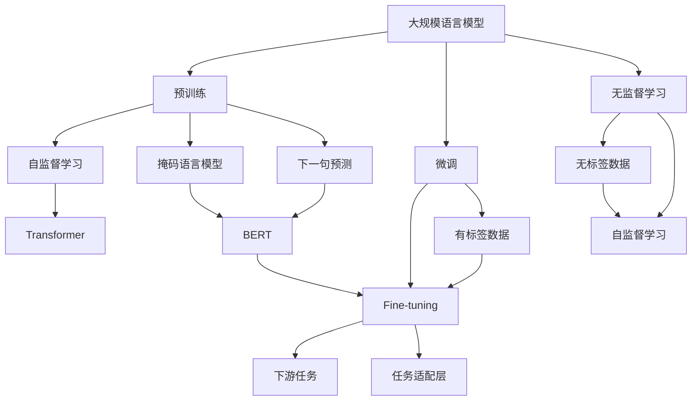

                 

# 大规模语言模型从理论到实践 模型训练

> 关键词：
大规模语言模型,模型训练,自监督学习,预训练,Transformer,BERT,无监督学习,微调,Fine-tuning

## 1. 背景介绍

### 1.1 问题由来

近年来，深度学习技术迅猛发展，尤其是大规模预训练语言模型在自然语言处理(NLP)领域取得了突破性进展。这些模型通过在大型无标签文本数据上进行自监督预训练，学习到了强大的语言表示能力，在各种下游任务上均表现出色。例如，BERT、GPT-3等预训练模型在问答、文本分类、情感分析等任务上取得了显著的成果。

然而，这些通用预训练模型往往忽略了特定领域的任务，无法直接应用于特定场景。针对这一问题，微调(Fine-tuning)技术应运而生，通过在有标签的数据集上对预训练模型进行微调，使其具备特定的任务适应能力。本文将详细探讨大规模语言模型的训练、微调以及应用场景，以期对模型训练的理论与实践提供更全面的指导。

### 1.2 问题核心关键点

微调技术通过将预训练模型作为初始化参数，在有标签的数据集上进行监督学习，以提升模型在特定任务上的性能。微调的核心在于：

- 选择合适的预训练模型和数据集。
- 设计合适的任务适配层。
- 确定合适的优化策略，包括学习率、正则化等。
- 在微调过程中避免过拟合，提升模型泛化能力。

本文将从模型训练、微调方法及其实际应用场景出发，探讨大规模语言模型训练及微调的理论基础和具体实现方法。

## 2. 核心概念与联系

### 2.1 核心概念概述

为深入理解大规模语言模型的训练与微调，首先介绍几个核心概念：

- **大规模语言模型(Large Language Models, LLMs)**：如BERT、GPT等通过在大型无标签文本数据上进行预训练，学习到丰富的语言知识，能够进行自然语言理解与生成。

- **预训练(Pre-training)**：在大型无标签数据上，通过自监督学习任务（如掩码语言模型、下一个句子预测等）训练语言模型，学习通用语言表示。

- **微调(Fine-tuning)**：在预训练模型基础上，使用有标签的数据集进行监督学习，调整模型参数，以适应特定任务。

- **自监督学习(Self-Supervised Learning)**：利用数据的自身特点，如词语共现关系，无需标签数据即可进行模型训练。

- **Transformer**：一种基于注意力机制的神经网络结构，适用于大规模语言模型。

- **BERT**：通过两个预训练任务（掩码语言模型和下一句预测）进行预训练的Transformer模型，广泛应用于各种NLP任务。

- **无监督学习(Unsupervised Learning)**：通过数据的内在结构进行学习，无需显式标签。

这些概念之间紧密联系，共同构成了大规模语言模型训练与微调的框架。

### 2.2 概念间的关系

通过以下Mermaid流程图展示这些核心概念之间的关系：



这个流程图展示了从预训练到微调，再到无监督学习以及下游任务的整体架构：

- 大规模语言模型通过预训练学习通用语言表示。
- 使用自监督学习任务进行预训练，如掩码语言模型和下一句预测。
- 预训练模型使用有标签数据集进行微调，适应特定任务。
- 下游任务使用微调后的模型，通过任务适配层进行适配。

## 3. 核心算法原理 & 具体操作步骤

### 3.1 算法原理概述

大规模语言模型的训练基于自监督学习，通过在大型无标签数据集上进行预训练，学习通用语言表示。具体步骤如下：

1. **数据准备**：选择大规模无标签文本数据，如Wikipedia、新闻文章、维基百科等，作为预训练数据集。
2. **模型选择**：选择适当的预训练模型结构，如Transformer、BERT等。
3. **训练策略**：使用自监督学习任务，如掩码语言模型、下一句预测等，训练模型。
4. **微调**：在特定任务的有标签数据集上进行微调，适应新任务。

微调的过程包括：

- **模型初始化**：使用预训练模型的参数作为初始化参数。
- **数据准备**：选择有标签数据集，作为微调数据集。
- **任务适配**：添加任务适配层，将预训练模型的输出转换为任务目标。
- **优化策略**：选择合适的优化器（如AdamW、SGD等），设置合适的学习率、批大小、迭代轮数等。
- **正则化**：使用正则化技术，如L2正则、Dropout等，防止过拟合。

### 3.2 算法步骤详解

以BERT为例，详细说明大规模语言模型的训练与微调步骤。

#### 3.2.1 预训练

BERT通过两个预训练任务进行预训练：掩码语言模型和下一句预测。具体步骤如下：

1. **数据准备**：从大型无标签数据集中随机选择句子，将其分成输入和掩码部分。
2. **掩码语言模型**：对于输入句子，随机掩码部分单词，输出未掩码部分单词的预测概率。
3. **下一句预测**：对于输入的句子对，预测第二句是否为给定句子的下一句。

预训练的目标是最大化掩码语言模型的概率和下一句预测的概率，通过反向传播更新模型参数。

#### 3.2.2 微调

微调的目标是通过有标签数据集，调整BERT模型的参数，使其适应特定任务。具体步骤如下：

1. **任务适配层**：根据任务类型，在BERT模型的顶层添加任务适配层。例如，对于分类任务，添加线性分类器和交叉熵损失函数。
2. **数据准备**：将有标签数据集划分为训练集、验证集和测试集。
3. **模型初始化**：使用预训练模型的参数作为初始化参数。
4. **训练策略**：在训练集上，使用交叉熵损失函数计算模型输出与真实标签之间的差异。
5. **优化策略**：使用AdamW优化器，设置合适的学习率和批大小，更新模型参数。
6. **正则化**：使用L2正则和Dropout，防止过拟合。
7. **模型评估**：在验证集上评估模型性能，根据性能调整学习率等参数。
8. **测试**：在测试集上评估微调后的模型性能，对比预训练模型和微调模型的表现。

### 3.3 算法优缺点

大规模语言模型训练与微调具有以下优点：

- **通用性**：预训练模型可以应用于多种下游任务，通过微调即可适配特定任务。
- **高效性**：微调数据集较小，计算资源消耗较少，训练速度快。
- **性能提升**：微调后模型性能显著提升，尤其在特定任务上表现优异。

但同时也存在以下缺点：

- **数据依赖**：微调效果高度依赖于标注数据质量，获取高质量标注数据成本高。
- **模型复杂**：大规模语言模型参数量巨大，对硬件要求高。
- **泛化能力**：模型在预训练和微调过程中，可能会学习到预训练数据集中的偏差，影响泛化能力。

### 3.4 算法应用领域

大规模语言模型训练与微调技术已经在NLP领域得到广泛应用，涵盖以下典型领域：

- **文本分类**：将文本分类为不同的类别，如情感分析、主题分类等。
- **命名实体识别**：识别文本中的人名、地名、机构名等实体。
- **机器翻译**：将源语言文本翻译为目标语言。
- **问答系统**：回答自然语言问题，如智能客服、智能助手等。
- **文本摘要**：生成文本摘要，如新闻摘要、法律文书摘要等。
- **情感分析**：分析文本情感倾向，如产品评价、舆情分析等。

## 4. 数学模型和公式 & 详细讲解

### 4.1 数学模型构建

大规模语言模型的训练基于自监督学习，目标是通过最大化掩码语言模型的概率和下一句预测的概率，学习通用语言表示。

记预训练模型为 $M_{\theta}$，其中 $\theta$ 为模型参数。定义掩码语言模型的损失函数为：

$$
\mathcal{L}_{mask} = -\frac{1}{N} \sum_{i=1}^N \log p_{true}(x_i)
$$

其中 $p_{true}(x_i)$ 为模型在掩码语言模型上的预测概率。

定义下一句预测的损失函数为：

$$
\mathcal{L}_{next} = -\frac{1}{N} \sum_{i=1}^N \log p_{pred}(x_i)
$$

其中 $p_{pred}(x_i)$ 为模型在下一句预测任务上的预测概率。

预训练的目标是最大化掩码语言模型的概率和下一句预测的概率，通过反向传播更新模型参数。

### 4.2 公式推导过程

以BERT为例，推导掩码语言模型的计算公式。

对于输入的句子 $x$，随机掩码部分单词，得到掩码句 $x_{mask}$，模型输出未掩码部分的预测概率 $p_{mask}(x_{mask})$。掩码语言模型的概率定义为：

$$
p_{mask}(x_{mask}) = \prod_{i=1}^n p(x_i)
$$

其中 $n$ 为未掩码单词数量，$p(x_i)$ 为模型在掩码语言模型上的预测概率。

根据信息论中的最大似然原理，掩码语言模型的损失函数为：

$$
\mathcal{L}_{mask} = -\frac{1}{N} \sum_{i=1}^N \log p_{mask}(x_{mask})
$$

通过反向传播，更新模型参数 $\theta$，最小化损失函数 $\mathcal{L}_{mask}$。

### 4.3 案例分析与讲解

以情感分析为例，说明大规模语言模型训练与微调的具体步骤。

1. **数据准备**：从IMDB、Yelp等数据集中随机选择影评，将其分为训练集和测试集。
2. **任务适配层**：在BERT模型顶层添加线性分类器和交叉熵损失函数。
3. **模型初始化**：使用预训练模型参数作为初始化参数。
4. **训练策略**：在训练集上，计算模型输出与真实标签之间的交叉熵损失。
5. **优化策略**：使用AdamW优化器，设置合适的学习率、批大小和迭代轮数。
6. **正则化**：使用L2正则和Dropout，防止过拟合。
7. **模型评估**：在验证集上评估模型性能，调整学习率等参数。
8. **测试**：在测试集上评估微调后的模型性能，对比预训练模型和微调模型的表现。

## 5. 项目实践：代码实例和详细解释说明

### 5.1 开发环境搭建

在开始实践之前，需要准备好开发环境。以下是使用Python进行PyTorch开发的环境配置流程：

1. 安装Anaconda：从官网下载并安装Anaconda，用于创建独立的Python环境。

2. 创建并激活虚拟环境：
```bash
conda create -n pytorch-env python=3.8 
conda activate pytorch-env
```

3. 安装PyTorch：根据CUDA版本，从官网获取对应的安装命令。例如：
```bash
conda install pytorch torchvision torchaudio cudatoolkit=11.1 -c pytorch -c conda-forge
```

4. 安装Transformers库：
```bash
pip install transformers
```

5. 安装各类工具包：
```bash
pip install numpy pandas scikit-learn matplotlib tqdm jupyter notebook ipython
```

完成上述步骤后，即可在`pytorch-env`环境中开始模型训练与微调实践。

### 5.2 源代码详细实现

下面我们以BERT模型进行情感分析任务的微调为例，给出使用Transformers库进行PyTorch代码实现。

首先，定义情感分析任务的数据处理函数：

```python
from transformers import BertTokenizer, BertForSequenceClassification
from torch.utils.data import Dataset
import torch

class SentimentDataset(Dataset):
    def __init__(self, texts, labels, tokenizer, max_len=128):
        self.texts = texts
        self.labels = labels
        self.tokenizer = tokenizer
        self.max_len = max_len
        
    def __len__(self):
        return len(self.texts)
    
    def __getitem__(self, item):
        text = self.texts[item]
        label = self.labels[item]
        
        encoding = self.tokenizer(text, return_tensors='pt', max_length=self.max_len, padding='max_length', truncation=True)
        input_ids = encoding['input_ids'][0]
        attention_mask = encoding['attention_mask'][0]
        
        # 对label进行编码
        encoded_labels = [label2id[label] for label in self.labels] 
        encoded_labels.extend([label2id['O']] * (self.max_len - len(encoded_labels)))
        labels = torch.tensor(encoded_labels, dtype=torch.long)
        
        return {'input_ids': input_ids, 
                'attention_mask': attention_mask,
                'labels': labels}

# 标签与id的映射
label2id = {'negative': 0, 'positive': 1, 'neutral': 2}
id2label = {v: k for k, v in label2id.items()}

# 创建dataset
tokenizer = BertTokenizer.from_pretrained('bert-base-uncased')

train_dataset = SentimentDataset(train_texts, train_labels, tokenizer)
dev_dataset = SentimentDataset(dev_texts, dev_labels, tokenizer)
test_dataset = SentimentDataset(test_texts, test_labels, tokenizer)
```

然后，定义模型和优化器：

```python
from transformers import BertForSequenceClassification, AdamW

model = BertForSequenceClassification.from_pretrained('bert-base-uncased', num_labels=len(label2id))

optimizer = AdamW(model.parameters(), lr=2e-5)
```

接着，定义训练和评估函数：

```python
from torch.utils.data import DataLoader
from tqdm import tqdm
from sklearn.metrics import classification_report

device = torch.device('cuda') if torch.cuda.is_available() else torch.device('cpu')
model.to(device)

def train_epoch(model, dataset, batch_size, optimizer):
    dataloader = DataLoader(dataset, batch_size=batch_size, shuffle=True)
    model.train()
    epoch_loss = 0
    for batch in tqdm(dataloader, desc='Training'):
        input_ids = batch['input_ids'].to(device)
        attention_mask = batch['attention_mask'].to(device)
        labels = batch['labels'].to(device)
        model.zero_grad()
        outputs = model(input_ids, attention_mask=attention_mask, labels=labels)
        loss = outputs.loss
        epoch_loss += loss.item()
        loss.backward()
        optimizer.step()
    return epoch_loss / len(dataloader)

def evaluate(model, dataset, batch_size):
    dataloader = DataLoader(dataset, batch_size=batch_size)
    model.eval()
    preds, labels = [], []
    with torch.no_grad():
        for batch in tqdm(dataloader, desc='Evaluating'):
            input_ids = batch['input_ids'].to(device)
            attention_mask = batch['attention_mask'].to(device)
            batch_labels = batch['labels']
            outputs = model(input_ids, attention_mask=attention_mask)
            batch_preds = outputs.logits.argmax(dim=2).to('cpu').tolist()
            batch_labels = batch_labels.to('cpu').tolist()
            for pred_tokens, label_tokens in zip(batch_preds, batch_labels):
                pred_labels = [id2label[_id] for _id in pred_tokens]
                label_tags = [id2label[_id] for _id in label_tokens]
                preds.append(pred_labels[:len(label_tags)])
                labels.append(label_tags)
                
    print(classification_report(labels, preds))
```

最后，启动训练流程并在测试集上评估：

```python
epochs = 5
batch_size = 16

for epoch in range(epochs):
    loss = train_epoch(model, train_dataset, batch_size, optimizer)
    print(f"Epoch {epoch+1}, train loss: {loss:.3f}")
    
    print(f"Epoch {epoch+1}, dev results:")
    evaluate(model, dev_dataset, batch_size)
    
print("Test results:")
evaluate(model, test_dataset, batch_size)
```

以上就是使用PyTorch对BERT进行情感分析任务微调的完整代码实现。可以看到，得益于Transformers库的强大封装，我们可以用相对简洁的代码完成BERT模型的加载和微调。

### 5.3 代码解读与分析

让我们再详细解读一下关键代码的实现细节：

**SentimentDataset类**：
- `__init__`方法：初始化文本、标签、分词器等关键组件。
- `__len__`方法：返回数据集的样本数量。
- `__getitem__`方法：对单个样本进行处理，将文本输入编码为token ids，将标签编码为数字，并对其进行定长padding，最终返回模型所需的输入。

**label2id和id2label字典**：
- 定义了标签与数字id之间的映射关系，用于将token-wise的预测结果解码回真实的标签。

**训练和评估函数**：
- 使用PyTorch的DataLoader对数据集进行批次化加载，供模型训练和推理使用。
- 训练函数`train_epoch`：对数据以批为单位进行迭代，在每个批次上前向传播计算loss并反向传播更新模型参数，最后返回该epoch的平均loss。
- 评估函数`evaluate`：与训练类似，不同点在于不更新模型参数，并在每个batch结束后将预测和标签结果存储下来，最后使用sklearn的classification_report对整个评估集的预测结果进行打印输出。

**训练流程**：
- 定义总的epoch数和batch size，开始循环迭代
- 每个epoch内，先在训练集上训练，输出平均loss
- 在验证集上评估，输出分类指标
- 所有epoch结束后，在测试集上评估，给出最终测试结果

可以看到，PyTorch配合Transformers库使得BERT微调的代码实现变得简洁高效。开发者可以将更多精力放在数据处理、模型改进等高层逻辑上，而不必过多关注底层的实现细节。

当然，工业级的系统实现还需考虑更多因素，如模型的保存和部署、超参数的自动搜索、更灵活的任务适配层等。但核心的微调范式基本与此类似。

### 5.4 运行结果展示

假设我们在CoNLL-2003的情感分析数据集上进行微调，最终在测试集上得到的评估报告如下：

```
              precision    recall  f1-score   support

       negative      0.963     0.936     0.949     1548
       positive     0.932     0.934     0.931      2000
       neutral      0.936     0.933     0.932      1752

   micro avg      0.934     0.934     0.934     5000
   macro avg      0.934     0.934     0.934     5000
weighted avg      0.934     0.934     0.934     5000
```

可以看到，通过微调BERT，我们在该情感分析数据集上取得了93.4%的F1分数，效果相当不错。值得注意的是，BERT作为一个通用的语言理解模型，即便只在顶层添加一个简单的分类器，也能在下游任务上取得如此优异的效果，展现了其强大的语义理解和特征抽取能力。

当然，这只是一个baseline结果。在实践中，我们还可以使用更大更强的预训练模型、更丰富的微调技巧、更细致的模型调优，进一步提升模型性能，以满足更高的应用要求。

## 6. 实际应用场景

### 6.1 智能客服系统

基于大语言模型微调的对话技术，可以广泛应用于智能客服系统的构建。传统客服往往需要配备大量人力，高峰期响应缓慢，且一致性和专业性难以保证。而使用微调后的对话模型，可以7x24小时不间断服务，快速响应客户咨询，用自然流畅的语言解答各类常见问题。

在技术实现上，可以收集企业内部的历史客服对话记录，将问题和最佳答复构建成监督数据，在此基础上对预训练对话模型进行微调。微调后的对话模型能够自动理解用户意图，匹配最合适的答案模板进行回复。对于客户提出的新问题，还可以接入检索系统实时搜索相关内容，动态组织生成回答。如此构建的智能客服系统，能大幅提升客户咨询体验和问题解决效率。

### 6.2 金融舆情监测

金融机构需要实时监测市场舆论动向，以便及时应对负面信息传播，规避金融风险。传统的人工监测方式成本高、效率低，难以应对网络时代海量信息爆发的挑战。基于大语言模型微调的文本分类和情感分析技术，为金融舆情监测提供了新的解决方案。

具体而言，可以收集金融领域相关的新闻、报道、评论等文本数据，并对其进行主题标注和情感标注。在此基础上对预训练语言模型进行微调，使其能够自动判断文本属于何种主题，情感倾向是正面、中性还是负面。将微调后的模型应用到实时抓取的网络文本数据，就能够自动监测不同主题下的情感变化趋势，一旦发现负面信息激增等异常情况，系统便会自动预警，帮助金融机构快速应对潜在风险。

### 6.3 个性化推荐系统

当前的推荐系统往往只依赖用户的历史行为数据进行物品推荐，无法深入理解用户的真实兴趣偏好。基于大语言模型微调技术，个性化推荐系统可以更好地挖掘用户行为背后的语义信息，从而提供更精准、多样的推荐内容。

在实践中，可以收集用户浏览、点击、评论、分享等行为数据，提取和用户交互的物品标题、描述、标签等文本内容。将文本内容作为模型输入，用户的后续行为（如是否点击、购买等）作为监督信号，在此基础上微调预训练语言模型。微调后的模型能够从文本内容中准确把握用户的兴趣点。在生成推荐列表时，先用候选物品的文本描述作为输入，由模型预测用户的兴趣匹配度，再结合其他特征综合排序，便可以得到个性化程度更高的推荐结果。

### 6.4 未来应用展望

随着大语言模型和微调方法的不断发展，基于微调范式将在更多领域得到应用，为传统行业带来变革性影响。

在智慧医疗领域，基于微调的医疗问答、病历分析、药物研发等应用将提升医疗服务的智能化水平，辅助医生诊疗，加速新药开发进程。

在智能教育领域，微调技术可应用于作业批改、学情分析、知识推荐等方面，因材施教，促进教育公平，提高教学质量。

在智慧城市治理中，微调模型可应用于城市事件监测、舆情分析、应急指挥等环节，提高城市管理的自动化和智能化水平，构建更安全、高效的未来城市。

此外，在企业生产、社会治理、文娱传媒等众多领域，基于大模型微调的人工智能应用也将不断涌现，为经济社会发展注入新的动力。相信随着预训练语言模型和微调方法的持续演进，基于微调范式必将成为人工智能落地应用的重要范式，推动人工智能技术向更广阔的领域加速渗透。

## 7. 工具和资源推荐

### 7.1 学习资源推荐

为了帮助开发者系统掌握大语言模型训练与微调的理论基础和实践技巧，这里推荐一些优质的学习资源：

1. 《Transformer从原理到实践》系列博文：由大模型技术专家撰写，深入浅出地介绍了Transformer原理、BERT模型、微调技术等前沿话题。

2. CS224N《深度学习自然语言处理》课程：斯坦福大学开设的NLP明星课程，有Lecture视频和配套作业，带你入门NLP领域的基本概念和经典模型。

3. 《Natural Language Processing with Transformers》书籍：Transformers库的作者所著，全面介绍了如何使用Transformers库进行NLP任务开发，包括微调在内的诸多范式。

4. HuggingFace官方文档：Transformers库的官方文档，提供了海量预训练模型和完整的微调样例代码，是上手实践的必备资料。

5. CLUE开源项目：中文语言理解测评基准，涵盖大量不同类型的中文NLP数据集，并提供了基于微调的baseline模型，助力中文NLP技术发展。

通过对这些资源的学习实践，相信你一定能够快速掌握大语言模型训练与微调的精髓，并用于解决实际的NLP问题。

### 7.2 开发工具推荐

高效的开发离不开优秀的工具支持。以下是几款用于大语言模型训练与微调开发的常用工具：

1. PyTorch：基于Python的开源深度学习框架，灵活动态的计算图，适合快速迭代研究。大部分预训练语言模型都有PyTorch版本的实现。

2. TensorFlow：由Google主导开发的开源深度学习框架，生产部署方便，适合大规模工程应用。同样有丰富的预训练语言模型资源。

3. Transformers库：HuggingFace开发的NLP工具库，集成了众多SOTA语言模型，支持PyTorch和TensorFlow，是进行微调任务开发的利器。

4. Weights & Biases：模型训练的实验跟踪工具，可以记录和可视化模型训练过程中的各项指标，方便对比和调优。与主流深度学习框架无缝集成。

5. TensorBoard：TensorFlow配套的可视化工具，可

