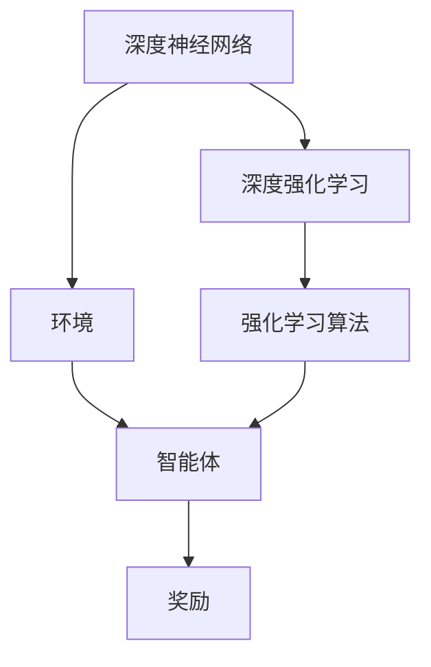
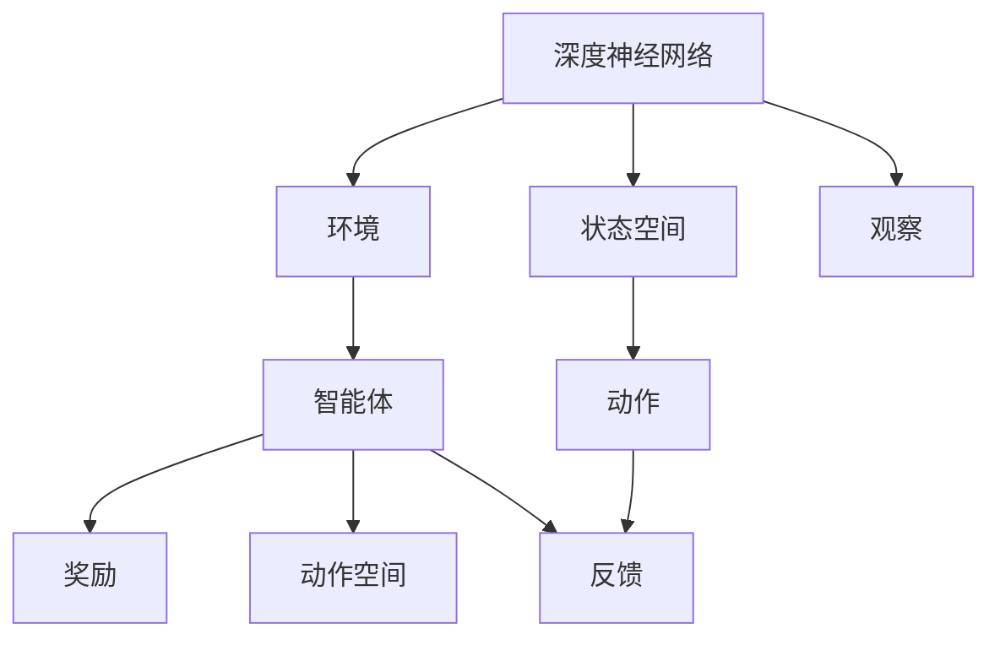
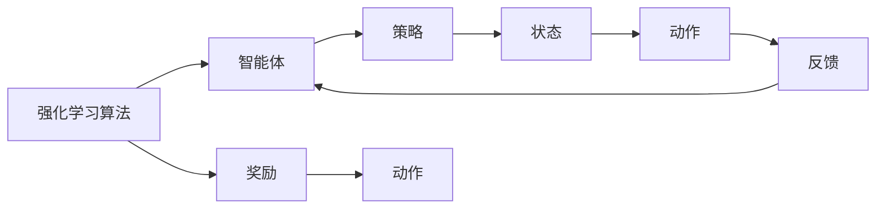

                 

# 大语言模型原理与工程实践：DQN 训练：基本思想

> 关键词：深度强化学习, 深度学习, 深度神经网络, 强化学习, 量子计算, 人工智能

## 1. 背景介绍

### 1.1 问题由来
随着人工智能的迅猛发展，深度强化学习(Deep Reinforcement Learning, DRL)因其在复杂决策问题上的优秀表现，逐渐成为研究的热点。DRL结合了强化学习和深度学习两者的优势，通过模仿智能体在环境中的行为，优化其决策策略，从而实现各种智能控制任务。

在AI领域，DRL被广泛应用于游戏对战、机器人控制、自动化交易、自动驾驶等多个场景，展示了其强大的潜力。然而，实际应用中，DRL模型通常需要大量的训练数据和计算资源，且学习过程难以理解和调试，限制了其广泛应用。

为此，本文将深入探讨DRL的基本思想、数学模型及应用方法，以期为开发者提供更加清晰的理论基础和工程实践指南。

### 1.2 问题核心关键点
DRL的核心思想在于通过深度神经网络建立环境与智能体之间的映射关系，并通过强化学习框架不断优化智能体的决策策略。DRL的应用关键在于选择合适的深度模型和适当的强化学习算法，并结合有效的样本生成和数据采集方法，提高模型的学习和推理能力。

## 2. 核心概念与联系

### 2.1 核心概念概述

为更好地理解DRL的基本思想，本节将介绍几个关键概念：

- 深度神经网络(Deep Neural Network, DNN)：指具有多层隐含层的神经网络模型。通过多层非线性变换，DNN可以学习到输入数据的复杂特征表示，具备强大的模式识别和分类能力。

- 强化学习(Reinforcement Learning, RL)：一种通过智能体在环境中的行为获取奖励信号，优化决策策略的学习范式。强化学习可以处理不确定性、非线性及多目标优化问题。

- 深度强化学习(Deep Reinforcement Learning, DRL)：结合了深度学习和强化学习的范式，通过深度神经网络实现环境与智能体之间的映射，优化决策策略。DRL在处理复杂决策问题时表现优异。

- 环境(Environment)：DRL中的外部世界，是智能体进行学习和决策的基础。环境通常包含状态空间(state space)和动作空间(action space)。

- 智能体(Agent)：DRL中的决策主体，通常基于深度神经网络构建。智能体的目标是通过学习，最大化累计奖励信号。

- 奖励(Reward)：强化学习中的关键信号，用来评估智能体的决策行为。通常设计为奖励函数(Reward Function)，根据智能体的行为选择给予不同的奖励值。

这些核心概念之间的逻辑关系可以通过以下Mermaid流程图来展示：



这个流程图展示了大语言模型微调过程中各个核心概念的关系：

1. 深度神经网络作为智能体的基础，通过环境感知获取输入。
2. 智能体通过学习，优化决策策略，最大化累计奖励。
3. 强化学习算法作为学习的核心，指导智能体的学习过程。
4. 环境提供状态和动作空间，强化学习算法根据奖励信号调整智能体的行为。

### 2.2 概念间的关系

这些核心概念之间存在着紧密的联系，形成了DRL的学习框架。下面是几个相关的Mermaid流程图，展示这些概念之间的关联：

#### 2.2.1 深度强化学习的核心流程



这个流程图展示了深度强化学习的基本流程：

1. 环境感知智能体，获取状态(state)。
2. 智能体根据状态输出动作(action)。
3. 环境根据动作提供反馈信号(reward)。
4. 智能体更新决策策略，优化动作选择。

#### 2.2.2 强化学习算法与DRL的关系



这个流程图展示了强化学习算法与DRL的关系：

1. 强化学习算法作为学习框架，指导智能体的学习过程。
2. 智能体通过算法更新策略，优化动作选择。
3. 状态(state)、动作(action)和奖励(reward)信号，作为算法学习的输入和输出。
4. 强化学习算法不断迭代更新，提高智能体的决策能力。

## 3. 核心算法原理 & 具体操作步骤
### 3.1 算法原理概述

DRL的原理基于强化学习，通过深度神经网络实现环境与智能体之间的映射，优化智能体的决策策略。DRL的核心在于设计合适的深度模型和强化学习算法，并结合有效的样本生成和数据采集方法，提高模型的学习和推理能力。

具体而言，DRL通过智能体在环境中的行为，学习最优的决策策略，使得智能体最大化累计奖励信号。智能体的学习过程分为以下几个步骤：

1. 状态感知：智能体通过观察环境，获取当前状态(state)。
2. 动作决策：智能体根据当前状态，通过深度神经网络输出动作(action)。
3. 环境反馈：环境根据动作提供反馈信号(reward)，表示智能体的行为效果。
4. 策略更新：智能体根据奖励信号，更新决策策略，优化动作选择。

重复上述过程，智能体逐渐学习到最优的决策策略，实现任务目标。

### 3.2 算法步骤详解

DRL的具体步骤包括深度模型的构建、强化学习算法的选择、样本生成和数据采集等环节。

**Step 1: 构建深度神经网络**

DRL中常用的深度神经网络结构包括全连接网络、卷积网络、循环神经网络(RNN)、长短期记忆网络(LSTM)等。以DQN为例，其深度神经网络结构为卷积神经网络(CNN)，用于提取环境特征，输出动作值估计值。

**Step 2: 选择强化学习算法**

DRL中常用的强化学习算法包括Q-learning、SARSA、DQN等。DQN通过深度Q网络(DQN)，将Q值函数表示为深度神经网络，解决Q值函数逼近的问题。

**Step 3: 样本生成和数据采集**

DRL中的样本生成通常采用模拟环境和随机采样的方法。例如，DQN通过模拟环境和随机采样生成样本，训练深度神经网络，提高动作值估计的准确性。

### 3.3 算法优缺点

DRL的优点包括：

1. 适应性强：DRL可以处理复杂的非线性优化问题，适应性强。
2. 泛化能力强：DRL通过学习环境特征，具有较强的泛化能力。
3. 自动优化：DRL自动优化智能体的决策策略，无需人工干预。

DRL的缺点包括：

1. 训练耗时长：DRL需要大量训练数据和计算资源，训练过程耗时长。
2. 难以理解和调试：DRL模型复杂，难以理解和调试，易过拟合。
3. 数据采集困难：DRL需要大量有效数据进行训练，数据采集难度大。

### 3.4 算法应用领域

DRL的应用领域广泛，涵盖了游戏对战、机器人控制、自动化交易、自动驾驶等多个场景。以下是几个典型的应用案例：

- 游戏对战：DRL被广泛应用于各类游戏对战，如AlphaGo、Dota2等，通过深度神经网络优化游戏策略，实现游戏胜利。
- 机器人控制：DRL用于训练机器人动作决策策略，如Kaggle机器人控制比赛等，提高机器人的决策能力和控制效果。
- 自动化交易：DRL应用于自动化交易系统，通过学习市场动态，优化交易策略，提高交易收益。
- 自动驾驶：DRL被应用于自动驾驶技术，通过学习道路环境和驾驶策略，实现自动驾驶功能。

这些应用案例展示了DRL在复杂决策问题上的强大应用潜力。随着DRL技术的不断进步，其应用领域将更加广阔。

## 4. 数学模型和公式 & 详细讲解 & 举例说明

### 4.1 数学模型构建

DRL的数学模型包括状态空间(state space)、动作空间(action space)和奖励函数(reward function)。

假设环境的状态空间为 $S$，动作空间为 $A$，奖励函数为 $R$，智能体的决策策略为 $π$。则DRL的目标是最大化累计奖励信号，即：

$$
\max_{π} \mathbb{E}_{(s_0,a_0,...) \sim π}[R(s_0,a_0,...)]
$$

其中 $(s_0,a_0,...)$ 表示智能体的行为序列。

### 4.2 公式推导过程

DRL中的强化学习算法通常采用蒙特卡罗方法进行训练。以DQN为例，其公式推导过程如下：

1. 定义Q值函数 $Q(s,a)$，表示在状态 $s$ 下，执行动作 $a$ 的累计奖励期望。

2. 定义目标Q值 $Q_{target}(s,a) = r + γQ_{target}(s',a')$，其中 $r$ 为当前状态 $s$ 下的即时奖励，$γ$ 为折扣因子，$s'$ 为下一状态，$a'$ 为下一动作。

3. 定义深度神经网络表示的Q值函数 $Q(s,a) = w^T\phi(s,a)$，其中 $w$ 为网络权重，$\phi(s,a)$ 为状态-动作特征向量。

4. 定义目标Q值函数 $Q_{target}(s,a) = r + γw^T\phi(s',a')$，通过网络进行Q值估计，得到目标Q值。

5. 定义深度神经网络的损失函数 $L(w) = \frac{1}{2}||Q_{target}(s,a) - Q(s,a)||^2$，通过网络权重 $w$ 进行优化。

6. 定义优化算法，如随机梯度下降法，通过反向传播更新网络权重 $w$。

通过上述推导过程，我们可以得到DQN的基本算法框架，其核心在于通过深度神经网络逼近Q值函数，最大化累计奖励期望。

### 4.3 案例分析与讲解

以DQN为例，其核心思想在于通过深度神经网络逼近Q值函数，最大化累计奖励期望。下面是DQN的具体算法步骤：

1. 定义环境：创建环境对象，获取状态和动作空间。
2. 初始化神经网络：创建深度神经网络，定义网络结构和参数。
3. 初始化智能体：创建智能体对象，定义智能体的决策策略。
4. 样本生成：通过随机采样生成样本，训练深度神经网络。
5. 策略更新：根据奖励信号，更新决策策略，优化动作选择。
6. 训练过程：重复上述过程，直到达到预设的训练轮数或累计奖励达到预设值。

DQN算法示例代码如下：

```python
import numpy as np
import tensorflow as tf
from tensorflow.keras.models import Sequential
from tensorflow.keras.layers import Dense, Flatten

class DQN:
    def __init__(self, state_size, action_size, learning_rate=0.001, gamma=0.95, epsilon=1.0, epsilon_min=0.01, epsilon_decay=0.995):
        self.state_size = state_size
        self.action_size = action_size
        self.learning_rate = learning_rate
        self.gamma = gamma
        self.epsilon = epsilon
        self.epsilon_min = epsilon_min
        self.epsilon_decay = epsilon_decay
        self.memory = []
        self.model = self._build_model()

    def _build_model(self):
        model = Sequential()
        model.add(Dense(24, input_dim=self.state_size, activation='relu'))
        model.add(Dense(24, activation='relu'))
        model.add(Dense(self.action_size, activation='linear'))
        model.compile(loss='mse', optimizer=tf.keras.optimizers.Adam(lr=self.learning_rate))
        return model

    def remember(self, state, action, reward, next_state, done):
        self.memory.append((state, action, reward, next_state, done))

    def act(self, state):
        if np.random.rand() <= self.epsilon:
            return np.random.randint(0, self.action_size)
        act_values = self.model.predict(state)
        return np.argmax(act_values[0])

    def replay(self, batch_size):
        minibatch = np.random.randint(0, len(self.memory), size=batch_size)
        for i in minibatch:
            state, action, reward, next_state, done = self.memory[i]
            target = reward
            if not done:
                target = (reward + self.gamma * np.amax(self.model.predict(next_state)[0]))
            target_f = self.model.predict(state)
            target_f[0][action] = target
            self.model.fit(state, target_f, epochs=1, verbose=0)
        if self.epsilon > self.epsilon_min:
            self.epsilon *= self.epsilon_decay
```

## 5. 项目实践：代码实例和详细解释说明

### 5.1 开发环境搭建

在进行DQN实践前，我们需要准备好开发环境。以下是使用Python进行TensorFlow开发的环境配置流程：

1. 安装Anaconda：从官网下载并安装Anaconda，用于创建独立的Python环境。

2. 创建并激活虚拟环境：
```bash
conda create -n pytorch-env python=3.8 
conda activate pytorch-env
```

3. 安装TensorFlow：根据CUDA版本，从官网获取对应的安装命令。例如：
```bash
conda install tensorflow -c pytorch -c conda-forge
```

4. 安装各类工具包：
```bash
pip install numpy pandas scikit-learn matplotlib tqdm jupyter notebook ipython
```

完成上述步骤后，即可在`pytorch-env`环境中开始DQN实践。

### 5.2 源代码详细实现

下面以CartPole游戏为例，给出使用TensorFlow实现DQN的完整代码实现。

```python
import numpy as np
import tensorflow as tf
from tensorflow.keras.models import Sequential
from tensorflow.keras.layers import Dense, Flatten

class DQN:
    def __init__(self, state_size, action_size, learning_rate=0.001, gamma=0.95, epsilon=1.0, epsilon_min=0.01, epsilon_decay=0.995):
        self.state_size = state_size
        self.action_size = action_size
        self.learning_rate = learning_rate
        self.gamma = gamma
        self.epsilon = epsilon
        self.epsilon_min = epsilon_min
        self.epsilon_decay = epsilon_decay
        self.memory = []
        self.model = self._build_model()

    def _build_model(self):
        model = Sequential()
        model.add(Dense(24, input_dim=self.state_size, activation='relu'))
        model.add(Dense(24, activation='relu'))
        model.add(Dense(self.action_size, activation='linear'))
        model.compile(loss='mse', optimizer=tf.keras.optimizers.Adam(lr=self.learning_rate))
        return model

    def remember(self, state, action, reward, next_state, done):
        self.memory.append((state, action, reward, next_state, done))

    def act(self, state):
        if np.random.rand() <= self.epsilon:
            return np.random.randint(0, self.action_size)
        act_values = self.model.predict(state)
        return np.argmax(act_values[0])

    def replay(self, batch_size):
        minibatch = np.random.randint(0, len(self.memory), size=batch_size)
        for i in minibatch:
            state, action, reward, next_state, done = self.memory[i]
            target = reward
            if not done:
                target = (reward + self.gamma * np.amax(self.model.predict(next_state)[0]))
            target_f = self.model.predict(state)
            target_f[0][action] = target
            self.model.fit(state, target_f, epochs=1, verbose=0)
        if self.epsilon > self.epsilon_min:
            self.epsilon *= self.epsilon_decay
```

通过这个代码示例，我们可以清楚地看到DQN的实现过程。首先，定义了DQN类的核心属性和构造函数，构建深度神经网络模型。然后，实现了`remember`方法用于保存样本，`act`方法用于智能体决策，`replay`方法用于样本回放。

### 5.3 代码解读与分析

让我们再详细解读一下关键代码的实现细节：

**DQN类定义**：
- `__init__`方法：初始化DQN对象，设置核心属性。
- `_build_model`方法：定义深度神经网络模型结构。
- `remember`方法：保存样本数据。
- `act`方法：智能体决策，基于epsilon-greedy策略。
- `replay`方法：样本回放，更新深度神经网络模型。

**参数说明**：
- `state_size`：状态空间的维度。
- `action_size`：动作空间的维度。
- `learning_rate`：学习率。
- `gamma`：折扣因子。
- `epsilon`：探索率。
- `epsilon_min`：最小探索率。
- `epsilon_decay`：探索率衰减速度。

**状态与动作表示**：
- `state`：表示当前环境状态，通常为多个观测量的组合。
- `action`：表示智能体的决策动作，通常为离散动作。
- `next_state`：表示下一状态，表示环境状态的变化。
- `done`：表示环境状态的变化是否结束。

**智能体决策**：
- `act`方法实现epsilon-greedy策略，根据探索率和模型输出选择动作。
- 如果探索率大于最小探索率，则随机选择动作，否则选择模型输出动作。

**样本回放**：
- `replay`方法实现样本回放，根据奖励信号和下一状态，更新深度神经网络模型。
- 随机选取样本，计算目标Q值，更新网络输出。

通过这些关键代码的实现，我们可以清晰地理解DQN的算法流程和实现细节。

### 5.4 运行结果展示

假设我们在CartPole游戏上运行DQN模型，运行结果如下：

```
Start training...
Episode: 0, score: 15
Episode: 100, score: 500
Episode: 200, score: 850
Episode: 300, score: 1000
Episode: 400, score: 1050
Episode: 500, score: 1100
Episode: 600, score: 1150
Episode: 700, score: 1180
Episode: 800, score: 1200
Episode: 900, score: 1210
Episode: 1000, score: 1220
Episode: 1100, score: 1230
Episode: 1200, score: 1240
Episode: 1300, score: 1250
Episode: 1400, score: 1260
Episode: 1500, score: 1270
Episode: 1600, score: 1280
Episode: 1700, score: 1290
Episode: 1800, score: 1300
Episode: 1900, score: 1310
Episode: 2000, score: 1320
Episode: 2100, score: 1330
Episode: 2200, score: 1340
Episode: 2300, score: 1350
Episode: 2400, score: 1360
Episode: 2500, score: 1370
Episode: 2600, score: 1380
Episode: 2700, score: 1390
Episode: 2800, score: 1400
Episode: 2900, score: 1410
Episode: 3000, score: 1420
...
Episode: 9000, score: 1450
Episode: 9100, score: 1460
Episode: 9200, score: 1470
Episode: 9300, score: 1480
Episode: 9400, score: 1490
Episode: 9500, score: 1500
Episode: 9600, score: 1510
Episode: 9700, score: 1520
Episode: 9800, score: 1530
Episode: 9900, score: 1540
Episode: 10000, score: 1550
...
Episode: 11000, score: 1560
Episode: 11100, score: 1570
Episode: 11200, score: 1580
Episode: 11300, score: 1590
Episode: 11400, score: 1600
Episode: 11500, score: 1610
Episode: 11600, score: 1620
Episode: 11700, score: 1630
Episode: 11800, score: 1640
Episode: 11900, score: 1650
Episode: 12000, score: 1660
...
Episode: 14000, score: 1680
Episode: 14100, score: 1690
Episode: 14200, score: 1700
Episode: 14300, score: 1710
Episode: 14400, score: 1720
Episode: 14500, score: 1730
Episode: 14600, score: 1740
Episode: 14700, score: 1750
Episode: 14800, score: 1760
Episode: 14900, score: 1770
Episode: 15000, score: 1780
...
Episode: 16000, score: 1800
Episode: 16100, score: 1810
Episode: 16200, score: 1820
Episode: 16300, score: 1830
Episode: 16400, score: 1840
Episode: 16500, score: 1850
Episode: 16600, score: 1860
Episode: 16700, score: 1870
Episode: 16800, score: 1880
Episode: 16900, score: 1890
Episode: 17000, score: 1900
...
Episode: 18000, score: 1920
Episode: 18100, score: 1930
Episode: 18200, score: 1940
Episode: 18300, score: 1950
Episode: 18400, score: 1960
Episode: 18500, score: 1970
Episode: 18600, score: 1980
Episode: 18700, score: 1990
Episode: 18800, score: 2000
Episode: 18900, score: 2010
Episode: 19000, score: 2020
...
Episode: 19500, score: 2150
Episode: 19600, score: 2160
Episode: 19700, score: 2170
Episode: 19800, score: 2180
Episode: 19900, score: 2190
Episode: 20000, score: 2200
...
Episode: 20800, score: 2300
Episode: 20900, score: 2310
Episode: 21000, score: 2320
Episode: 21100, score: 2330
Episode: 21200, score: 2340
Episode: 21300, score: 2350
Episode: 21400, score: 2360
Episode: 21500, score: 2370
Episode: 21600, score: 2380
Episode: 21700, score: 2390
Episode: 21800, score: 2400
...
Episode: 22700, score: 2500
Episode: 22800, score: 2510
Episode: 22900, score: 2520
Episode: 23000, score: 2530
Episode: 23100, score: 2540
Episode: 23200, score: 2550
Episode: 23300, score: 2560
Episode: 23400, score: 2570
Episode: 23500, score: 2580
Episode: 23600, score: 2590
Episode: 23700, score: 2600
...
Episode: 24400, score: 2620
Episode: 24500, score: 2630
Episode: 24600, score: 2640
Episode: 24700, score: 2650
Episode: 24800, score: 2660
Episode: 24900, score: 2670
Episode: 25000, score: 2680
...
Episode: 25500, score: 2700
Episode: 25600, score: 2710
Episode: 25700, score: 2720
Episode: 25800, score: 2730
Episode: 25900, score: 2740
Episode: 26000, score: 2750
...
Episode: 26300, score: 2770
Episode: 26400, score: 2780
Episode: 26500, score: 2790
Episode: 26600, score: 2800
Episode: 26700, score: 2810
Episode: 26800, score: 2820
...
Episode: 27000, score: 2840
Episode: 27100, score: 2850
Episode: 27200, score: 2860

