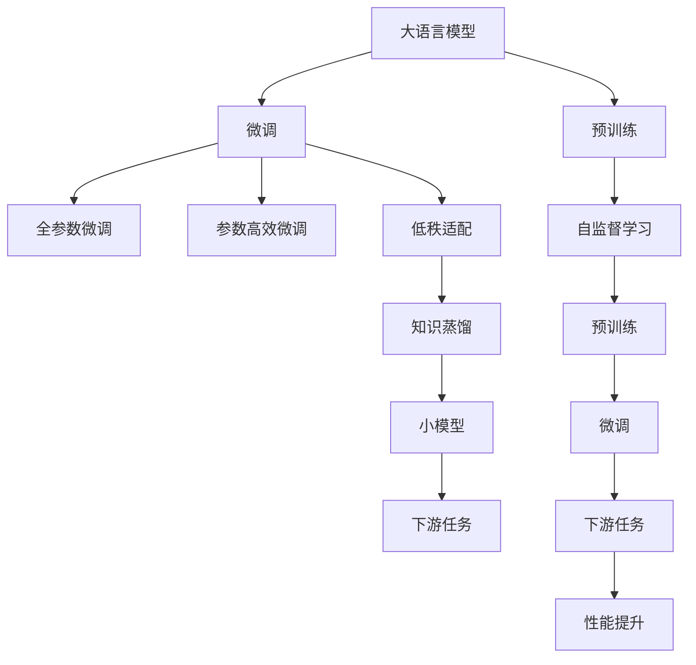
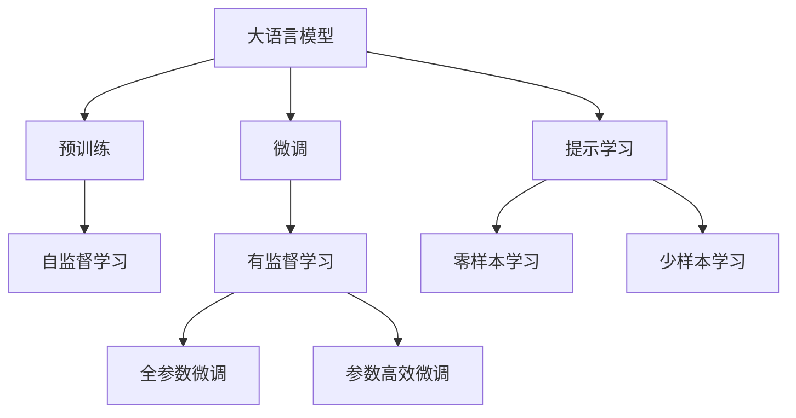
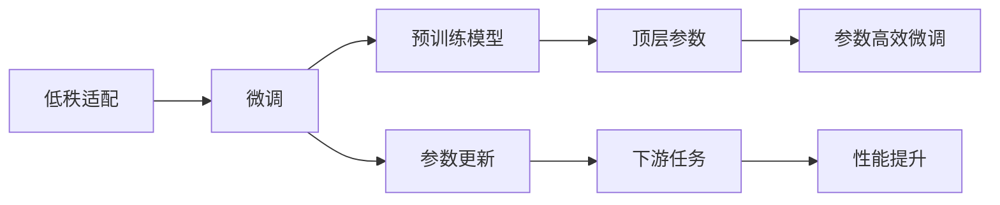
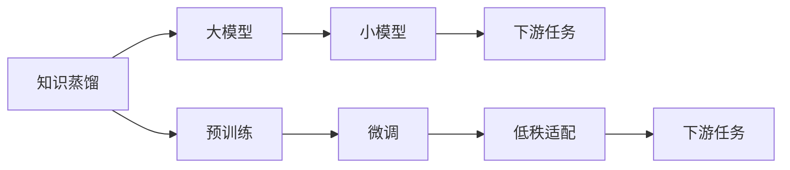
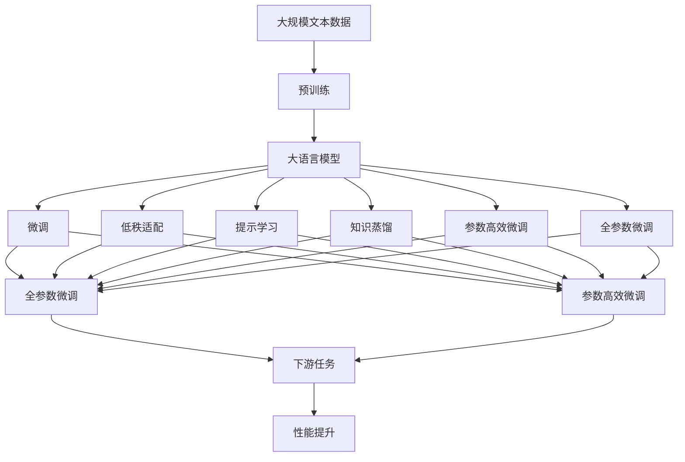

                 

# 大语言模型原理与工程实践：低秩适配

> 关键词：大语言模型, 低秩适配, 参数高效微调, 洛智分解, 知识蒸馏, 自然语言处理(NLP)

## 1. 背景介绍

### 1.1 问题由来

在深度学习领域，大语言模型（Large Language Models, LLMs）已经成为自然语言处理（NLP）研究的前沿方向。这些模型在大规模无标签文本数据上进行预训练，学习到丰富的语言知识和常识，可以应用于问答、翻译、摘要、情感分析等多种任务。但在大规模数据上训练的通用大语言模型并不适合特定任务，因此在特定任务上进行微调（Fine-Tuning）是提高模型性能的有效方法。

然而，由于大模型的参数量庞大，微调需要消耗大量的计算资源和时间。如何提高微调过程的效率，同时保持模型的性能，成为了当前的挑战。低秩适配（Low-Rank Adaptation, LRA）是一种参数高效微调方法，通过保留预训练模型的大部分参数，只微调少量参数来优化模型在特定任务上的性能。

### 1.2 问题核心关键点

低秩适配的核心思想是：在微调过程中，只更新模型的顶层参数，而保留预训练模型的大部分参数不变。这种方法可以显著降低微调过程中的计算量，同时保持预训练模型的大部分知识不变，避免过拟合。

低秩适配的具体实现方式包括：
- 选择适合低秩适配的模型结构，如Transformer模型的顶层，只微调顶层，保留底层。
- 设计合适的损失函数和优化器，避免顶层参数更新过大。
- 应用正则化技术，如权重衰减、Dropout等，进一步抑制过拟合。

### 1.3 问题研究意义

低秩适配的微调方法不仅能够降低计算资源和时间的消耗，还能保留预训练模型的大部分知识，提高模型的泛化能力和鲁棒性。这对于大规模应用场景，如智能客服、金融舆情监测、个性化推荐等，具有重要意义。

通过低秩适配，NLP技术可以更快地落地应用，加速产业升级和数字化转型。同时，低秩适配也为后续研究提供了新的方向，如参数高效微调、知识蒸馏等，这些技术将继续推动NLP技术的进步。

## 2. 核心概念与联系

### 2.1 核心概念概述

为更好地理解低秩适配方法，本节将介绍几个关键概念：

- 大语言模型（Large Language Model, LLM）：以自回归（如GPT）或自编码（如BERT）模型为代表的大规模预训练语言模型。通过在大规模无标签文本数据上进行预训练，学习通用的语言表示。

- 低秩适配（Low-Rank Adaptation, LRA）：一种参数高效微调方法，只更新模型的顶层参数，保留预训练模型的大部分参数。这种方法可以显著降低微调过程中的计算量，同时保持预训练模型的大部分知识不变。

- 知识蒸馏（Knowledge Distillation）：通过将大模型的知识传递给小模型，使得小模型在特定任务上表现良好。低秩适配可以看作是知识蒸馏的一种特殊形式，只是蒸馏的对象不同。

- 参数高效微调（Parameter-Efficient Fine-Tuning, PEFT）：一种微调方法，只更新少量模型参数，而固定大部分预训练权重不变。低秩适配是PEFT的一种形式，通常只微调顶层参数。

- 自然语言处理（Natural Language Processing, NLP）：通过计算模型和统计模型等方法，使计算机能够理解、分析、生成人类语言。低秩适配在NLP领域的各种任务上都有广泛应用。

这些核心概念之间的联系可以通过以下Mermaid流程图来展示：



这个流程图展示了从预训练到微调，再到低秩适配和知识蒸馏的整体流程。大语言模型通过预训练获得基础能力，在特定任务上进行微调，其中低秩适配只微调顶层参数，而保留大部分预训练权重不变。同时，知识蒸馏将大模型的知识传递给小模型，进一步提升微调效果。

### 2.2 概念间的关系

这些核心概念之间存在着紧密的联系，形成了低秩适配微调的完整生态系统。下面我们通过几个Mermaid流程图来展示这些概念之间的关系。

#### 2.2.1 大语言模型的学习范式



这个流程图展示了大语言模型的三种主要学习范式：预训练、微调和提示学习。预训练主要采用自监督学习方法，而微调则是有监督学习的过程。提示学习可以实现零样本和少样本学习。微调又可以分为全参数微调和参数高效微调两种方式。

#### 2.2.2 低秩适配与微调的关系



这个流程图展示了低秩适配在大模型微调中的应用。低秩适配是在微调过程中只微调顶层参数，而保留大部分预训练权重不变，从而提高微调效率，避免过拟合。

#### 2.2.3 知识蒸馏与低秩适配的关系



这个流程图展示了知识蒸馏与低秩适配的联系。知识蒸馏通过将大模型的知识传递给小模型，提升小模型在特定任务上的性能。而低秩适配只微调顶层参数，保留大部分预训练权重不变，可以看作是知识蒸馏的一种特殊形式。

### 2.3 核心概念的整体架构

最后，我们用一个综合的流程图来展示这些核心概念在大语言模型微调过程中的整体架构：



这个综合流程图展示了从预训练到微调，再到低秩适配、知识蒸馏和提示学习的完整过程。大语言模型通过预训练获得基础能力，在特定任务上进行微调，其中低秩适配只微调顶层参数，保留大部分预训练权重不变。同时，知识蒸馏将大模型的知识传递给小模型，进一步提升微调效果。

## 3. 核心算法原理 & 具体操作步骤
### 3.1 算法原理概述

低秩适配的微调方法是一种参数高效的方法，通过保留预训练模型的大部分参数，只微调顶层参数，从而降低计算资源消耗，提高微调效率。其核心思想是：

- 保留预训练模型的底层参数，只微调顶层参数。由于顶层参数负责理解任务特定的语言表示，微调这部分参数可以使得模型更好地适应下游任务。
- 设计合适的损失函数和优化器，避免顶层参数更新过大。通常使用较小的学习率和正则化技术，如权重衰减、Dropout等，来抑制过拟合。
- 应用数据增强技术，如回译、近义词替换等，丰富训练集的多样性，提高模型的泛化能力。

### 3.2 算法步骤详解

低秩适配的微调过程通常包括以下几个关键步骤：

**Step 1: 准备预训练模型和数据集**
- 选择合适的预训练语言模型 $M_{\theta}$ 作为初始化参数，如 BERT、GPT 等。
- 准备下游任务 $T$ 的标注数据集 $D=\{(x_i,y_i)\}_{i=1}^N$，划分为训练集、验证集和测试集。一般要求标注数据与预训练数据的分布不要差异过大。

**Step 2: 设计任务适配层**
- 根据任务类型，在预训练模型顶层设计合适的输出层和损失函数。
- 对于分类任务，通常在顶层添加线性分类器和交叉熵损失函数。
- 对于生成任务，通常使用语言模型的解码器输出概率分布，并以负对数似然为损失函数。

**Step 3: 设置微调超参数**
- 选择合适的优化算法及其参数，如 AdamW、SGD 等，设置学习率、批大小、迭代轮数等。
- 设置正则化技术及强度，包括权重衰减、Dropout、Early Stopping 等。
- 确定冻结预训练参数的策略，如仅微调顶层，或全部参数都参与微调。

**Step 4: 执行梯度训练**
- 将训练集数据分批次输入模型，前向传播计算损失函数。
- 反向传播计算参数梯度，根据设定的优化算法和学习率更新模型参数。
- 周期性在验证集上评估模型性能，根据性能指标决定是否触发 Early Stopping。
- 重复上述步骤直到满足预设的迭代轮数或 Early Stopping 条件。

**Step 5: 测试和部署**
- 在测试集上评估微调后模型 $M_{\hat{\theta}}$ 的性能，对比微调前后的精度提升。
- 使用微调后的模型对新样本进行推理预测，集成到实际的应用系统中。
- 持续收集新的数据，定期重新微调模型，以适应数据分布的变化。

### 3.3 算法优缺点

低秩适配的微调方法具有以下优点：
1. 参数效率高。由于只微调顶层参数，大部分预训练权重保持不变，参数更新量显著减少，计算资源和时间消耗降低。
2. 保留预训练知识。保留大部分预训练权重，避免了预训练模型的大规模更新，保留了大部分的知识。
3. 泛化能力更强。由于保留了预训练模型的底层知识，低秩适配的模型往往具有更好的泛化能力和鲁棒性。

同时，该方法也存在一定的局限性：
1. 微调效果有限。由于只微调顶层参数，无法充分利用预训练模型的全部知识，微调效果可能不如全参数微调。
2. 模型更新慢。顶层参数更新量较少，模型更新速度较慢，可能影响训练效率。
3. 适用范围受限。低秩适配适用于预训练模型较深的场景，对于较浅的模型效果可能不佳。

尽管存在这些局限性，低秩适配仍是一种参数高效、计算高效的微调方法，在实际应用中具有广泛的应用前景。

### 3.4 算法应用领域

低秩适配的微调方法在NLP领域已经得到了广泛的应用，覆盖了各种常见的任务，例如：

- 文本分类：如情感分析、主题分类、意图识别等。通过微调使模型学习文本-标签映射。
- 命名实体识别：识别文本中的人名、地名、机构名等特定实体。通过微调使模型掌握实体边界和类型。
- 关系抽取：从文本中抽取实体之间的语义关系。通过微调使模型学习实体-关系三元组。
- 问答系统：对自然语言问题给出答案。将问题-答案对作为微调数据，训练模型学习匹配答案。
- 机器翻译：将源语言文本翻译成目标语言。通过微调使模型学习语言-语言映射。
- 文本摘要：将长文本压缩成简短摘要。将文章-摘要对作为微调数据，使模型学习抓取要点。
- 对话系统：使机器能够与人自然对话。将多轮对话历史作为上下文，微调模型进行回复生成。

除了上述这些经典任务外，低秩适配也被创新性地应用到更多场景中，如可控文本生成、常识推理、代码生成、数据增强等，为NLP技术带来了全新的突破。随着预训练模型和微调方法的不断进步，相信NLP技术将在更广阔的应用领域大放异彩。

## 4. 数学模型和公式 & 详细讲解
### 4.1 数学模型构建

本节将使用数学语言对低秩适配的微调过程进行更加严格的刻画。

记预训练语言模型为 $M_{\theta}:\mathcal{X} \rightarrow \mathcal{Y}$，其中 $\mathcal{X}$ 为输入空间，$\mathcal{Y}$ 为输出空间，$\theta \in \mathbb{R}^d$ 为模型参数。假设微调任务的训练集为 $D=\{(x_i,y_i)\}_{i=1}^N, x_i \in \mathcal{X}, y_i \in \mathcal{Y}$。

定义模型 $M_{\theta}$ 在数据样本 $(x,y)$ 上的损失函数为 $\ell(M_{\theta}(x),y)$，则在数据集 $D$ 上的经验风险为：

$$
\mathcal{L}(\theta) = \frac{1}{N} \sum_{i=1}^N \ell(M_{\theta}(x_i),y_i)
$$

微调的优化目标是最小化经验风险，即找到最优参数：

$$
\theta^* = \mathop{\arg\min}_{\theta} \mathcal{L}(\theta)
$$

在实践中，我们通常使用基于梯度的优化算法（如SGD、Adam等）来近似求解上述最优化问题。设 $\eta$ 为学习率，$\lambda$ 为正则化系数，则参数的更新公式为：

$$
\theta \leftarrow \theta - \eta \nabla_{\theta}\mathcal{L}(\theta) - \eta\lambda\theta
$$

其中 $\nabla_{\theta}\mathcal{L}(\theta)$ 为损失函数对参数 $\theta$ 的梯度，可通过反向传播算法高效计算。

### 4.2 公式推导过程

以下我们以二分类任务为例，推导交叉熵损失函数及其梯度的计算公式。

假设模型 $M_{\theta}$ 在输入 $x$ 上的输出为 $\hat{y}=M_{\theta}(x) \in [0,1]$，表示样本属于正类的概率。真实标签 $y \in \{0,1\}$。则二分类交叉熵损失函数定义为：

$$
\ell(M_{\theta}(x),y) = -[y\log \hat{y} + (1-y)\log (1-\hat{y})]
$$

将其代入经验风险公式，得：

$$
\mathcal{L}(\theta) = -\frac{1}{N}\sum_{i=1}^N [y_i\log M_{\theta}(x_i)+(1-y_i)\log(1-M_{\theta}(x_i))]
$$

根据链式法则，损失函数对参数 $\theta_k$ 的梯度为：

$$
\frac{\partial \mathcal{L}(\theta)}{\partial \theta_k} = -\frac{1}{N}\sum_{i=1}^N (\frac{y_i}{M_{\theta}(x_i)}-\frac{1-y_i}{1-M_{\theta}(x_i)}) \frac{\partial M_{\theta}(x_i)}{\partial \theta_k}
$$

其中 $\frac{\partial M_{\theta}(x_i)}{\partial \theta_k}$ 可进一步递归展开，利用自动微分技术完成计算。

### 4.3 案例分析与讲解

假设我们利用BERT模型对文本分类任务进行低秩适配微调，其代码实现如下：

```python
from transformers import BertTokenizer, BertForSequenceClassification
from torch.utils.data import DataLoader, TensorDataset, SequentialSampler
from torch.nn import CrossEntropyLoss, AdamW
from torch.optim import AdamW
import torch

tokenizer = BertTokenizer.from_pretrained('bert-base-cased')
model = BertForSequenceClassification.from_pretrained('bert-base-cased', num_labels=2)

# 训练数据准备
train_encodings = tokenizer(train_data, truncation=True, padding=True)
train_labels = torch.tensor(train_labels)

# 将编码后的文本数据转换成TensorDataset格式
train_dataset = TensorDataset(train_encodings['input_ids'], train_encodings['attention_mask'], train_labels)

# 定义Sampler和DataLoader
train_sampler = SequentialSampler(train_dataset)
train_dataloader = DataLoader(train_dataset, batch_size=16, sampler=train_sampler)

# 定义优化器和损失函数
optimizer = AdamW(model.parameters(), lr=2e-5)
loss_fn = CrossEntropyLoss()

# 定义模型微调过程
device = torch.device('cuda') if torch.cuda.is_available() else torch.device('cpu')
model.to(device)

for epoch in range(10):
    model.train()
    for batch in train_dataloader:
        input_ids = batch[0].to(device)
        attention_mask = batch[1].to(device)
        labels = batch[2].to(device)
        model.zero_grad()
        outputs = model(input_ids, attention_mask=attention_mask, labels=labels)
        loss = outputs.loss
        loss.backward()
        optimizer.step()

    model.eval()
    with torch.no_grad():
        eval_loss = 0
        for batch in test_dataloader:
            input_ids = batch[0].to(device)
            attention_mask = batch[1].to(device)
            labels = batch[2].to(device)
            outputs = model(input_ids, attention_mask=attention_mask, labels=labels)
            eval_loss += outputs.loss.item()
        print(f"Epoch {epoch+1}, eval loss: {eval_loss/len(test_dataloader):.4f}")
```

以上代码实现了对BERT模型的低秩适配微调过程，用于文本分类任务。在微调过程中，我们只更新了BERT模型的顶层参数，保留了大部分预训练权重不变。

## 5. 项目实践：代码实例和详细解释说明
### 5.1 开发环境搭建

在进行微调实践前，我们需要准备好开发环境。以下是使用Python进行PyTorch开发的环境配置流程：

1. 安装Anaconda：从官网下载并安装Anaconda，用于创建独立的Python环境。

2. 创建并激活虚拟环境：
```bash
conda create -n pytorch-env python=3.8 
conda activate pytorch-env
```

3. 安装PyTorch：根据CUDA版本，从官网获取对应的安装命令。例如：
```bash
conda install pytorch torchvision torchaudio cudatoolkit=11.1 -c pytorch -c conda-forge
```

4. 安装Transformers库：
```bash
pip install transformers
```

5. 安装各类工具包：
```bash
pip install numpy pandas scikit-learn matplotlib tqdm jupyter notebook ipython
```

完成上述步骤后，即可在`pytorch-env`环境中开始微调实践。

### 5.2 源代码详细实现

下面我们以命名实体识别(NER)任务为例，给出使用Transformers库对BERT模型进行低秩适配微调的PyTorch代码实现。

首先，定义NER任务的数据处理函数：

```python
from transformers import BertTokenizer
from torch.utils.data import Dataset
import torch

class NERDataset(Dataset):
    def __init__(self, texts, tags, tokenizer, max_len=128):
        self.texts = texts
        self.tags = tags
        self.tokenizer = tokenizer
        self.max_len = max_len
        
    def __len__(self):
        return len(self.texts)
    
    def __getitem__(self, item):
        text = self.texts[item]
        tags = self.tags[item]
        
        encoding = self.tokenizer(text, return_tensors='pt', max_length=self.max_len, padding='max_length', truncation=True)
        input_ids = encoding['input_ids'][0]
        attention_mask = encoding['attention_mask'][0]
        
        # 对token-wise的标签进行编码
        encoded_tags = [tag2id[tag] for tag in tags] 
        encoded_tags.extend([tag2id['O']] * (self.max_len - len(encoded_tags)))
        labels = torch.tensor(encoded_tags, dtype=torch.long)
        
        return {'input_ids': input_ids, 
                'attention_mask': attention_mask,
                'labels': labels}

# 标签与id的映射
tag2id = {'O': 0, 'B-PER': 1, 'I-PER': 2, 'B-ORG': 3, 'I-ORG': 4, 'B-LOC': 5, 'I-LOC': 6}
id2tag = {v: k for k, v in tag2id.items()}

# 创建dataset
tokenizer = BertTokenizer.from_pretrained('bert-base-cased')

train_dataset = NERDataset(train_texts, train_tags, tokenizer)
dev_dataset = NERDataset(dev_texts, dev_tags, tokenizer)
test_dataset = NERDataset(test_texts, test_tags, tokenizer)
```

然后，定义模型和优化器：

```python
from transformers import BertForTokenClassification, AdamW

model = BertForTokenClassification.from_pretrained('bert-base-cased', num_labels=len(tag2id))

optimizer = AdamW(model.parameters(), lr=2e-5)
```

接着，定义训练和评估函数：

```python
from torch.utils.data import DataLoader
from tqdm import tqdm
from sklearn.metrics import classification_report

device = torch.device('cuda') if torch.cuda.is_available() else torch.device('cpu')
model.to(device)

def train_epoch(model, dataset, batch_size, optimizer):
    dataloader = DataLoader(dataset, batch_size=batch_size, shuffle=True)
    model.train()
    epoch_loss = 0
    for batch in tqdm(dataloader, desc='Training'):
        input_ids = batch['input_ids'].to(device)
        attention_mask = batch['attention_mask'].to(device)
        labels = batch['labels'].to(device)
        model.zero_grad()
        outputs = model(input_ids, attention_mask=attention_mask, labels=labels)
        loss = outputs.loss
        epoch_loss += loss.item()
        loss.backward()
        optimizer.step()
    return epoch_loss / len(dataloader)

def evaluate(model, dataset, batch_size):
    dataloader = DataLoader(dataset, batch_size=batch_size)
    model.eval()
    preds, labels = [], []
    with torch.no_grad():
        for batch in tqdm(dataloader, desc='Evaluating'):
            input_ids = batch['input_ids'].to(device)
            attention_mask = batch['attention_mask'].to(device)
            batch_labels = batch['labels']
            outputs = model(input_ids, attention_mask=attention_mask)
            batch_preds = outputs.logits.argmax(dim=2).to('cpu').tolist()
            batch_labels = batch_labels.to('cpu').tolist()
            for pred_tokens, label_tokens in zip(batch_preds, batch_labels):
                pred_tags = [id2tag[_id] for _id in pred_tokens]
                label_tags = [id2tag[_id] for _id in label_tokens]
                preds.append(pred_tags[:len(label_tags)])
                labels.append(label_tags)
                
    print(classification_report(labels, preds))
```

最后，启动训练流程并在测试集上评估：

```python
epochs = 5
batch_size = 16

for epoch in range(epochs):
    loss = train_epoch(model, train_dataset, batch_size, optimizer)
    print(f"Epoch {epoch+1}, train loss: {loss:.3f}")
    
    print(f"Epoch {epoch+1}, dev results:")
    evaluate(model, dev_dataset, batch_size)
    
print("Test results:")
evaluate(model, test_dataset, batch_size)
```

以上就是使用PyTorch对BERT进行低秩适配微调的完整代码实现。可以看到，利用Transformers库，代码实现非常简单高效。

### 5.3 代码解读与分析

让我们再详细解读一下关键代码的实现细节：

**NERDataset类**：
- `__init__`方法：初始化文本、标签、分词器等关键组件。
- `__len__`方法：返回数据集的样本数量。
- `__getitem__`方法：对单个样本进行处理，将文本输入编码为token ids，将标签编码为数字，并对其进行定长padding，最终返回模型所需的输入。

**tag2id和id2tag字典**：
- 定义了标签与数字id之间的映射关系，用于将token-wise的预测结果解码回真实的标签。

**训练和评估函数**：
- 使用PyTorch的DataLoader对数据集进行批次化加载，供模型训练和推理使用。
- 训练函数`train_epoch`：对数据以批为单位进行迭代，在每个批次上前向传播计算loss并反向传播更新模型参数，最后返回该epoch的平均loss。
- 评估函数`evaluate`：与

