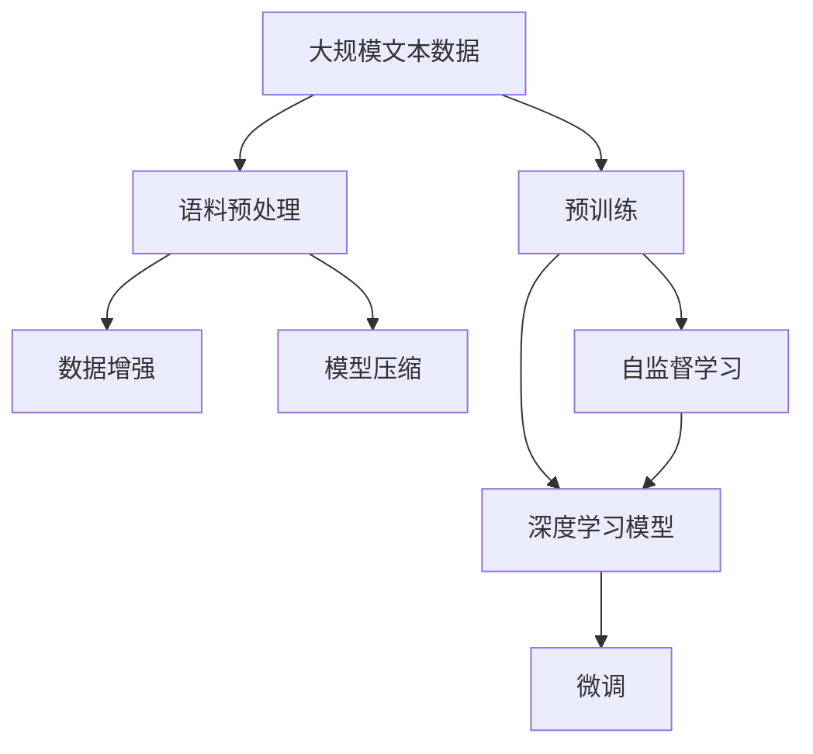
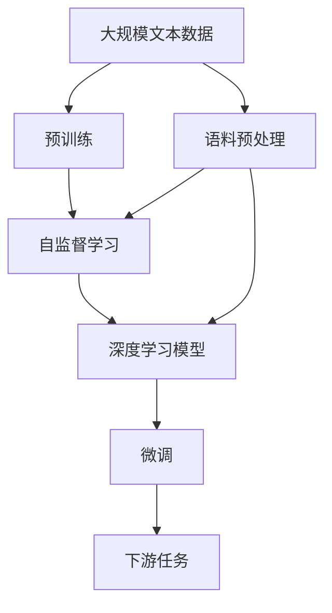
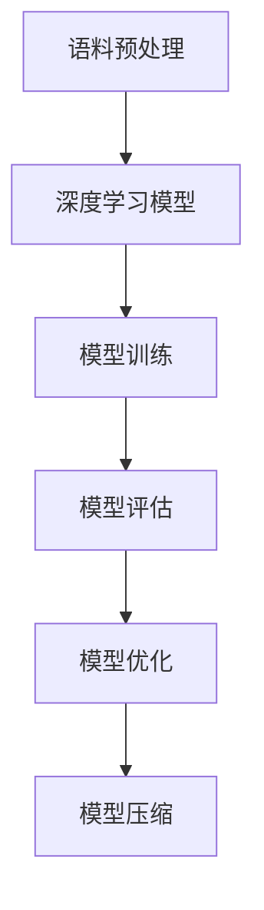
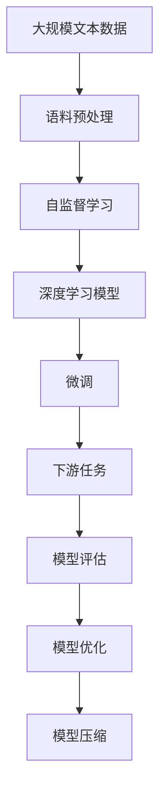

                 

# 大语言模型原理与工程实践：手把手教你训练 7B 大语言模型 语料预处理

> 关键词：大语言模型, 深度学习, 预训练, 语料预处理, 数据增强, 模型压缩, 自监督学习, 数据集构建, 模型训练, 超参数调优

## 1. 背景介绍

### 1.1 问题由来
近年来，随着深度学习技术的飞速发展，大规模语言模型（Large Language Model, LLM）在自然语言处理（Natural Language Processing, NLP）领域取得了巨大的突破。特别是OpenAI的GPT系列模型和Google的BERT等模型的问世，极大地推动了NLP技术的发展。这些大模型通过在大规模无标签文本数据上进行预训练，学习到了丰富的语言知识和常识，具备了强大的语言理解和生成能力。然而，这些模型往往需要耗费大量的时间和资源进行训练，对硬件设施提出了极高的要求。因此，如何高效、便捷地训练大模型，成为了学术界和工业界共同关注的焦点。

### 1.2 问题核心关键点
在大语言模型的训练中，语料预处理（Data Preprocessing）是最重要的一环。预处理的好坏直接影响模型训练的速度和效果。预处理的主要内容包括文本标准化、分词、去除停用词、构建词汇表、文本编码等。本文将重点介绍如何高效地构建和预处理大规模文本数据集，以供后续训练7B（70亿参数）级别的大语言模型。

### 1.3 问题研究意义
语料预处理是训练大语言模型的基础，高质量的预处理能够显著提升模型的训练速度和效果，降低训练成本。本文旨在通过系统的讲解，帮助读者掌握语料预处理的技巧和方法，从而实现高效、便捷地训练大模型。

## 2. 核心概念与联系

### 2.1 核心概念概述

为更好地理解大规模语言模型的语料预处理，本节将介绍几个密切相关的核心概念：

- 大语言模型（Large Language Model, LLM）：以自回归（如GPT）或自编码（如BERT）模型为代表的大规模预训练语言模型。通过在大规模无标签文本语料上进行预训练，学习通用的语言表示，具备强大的语言理解和生成能力。

- 预训练（Pre-training）：指在大规模无标签文本语料上，通过自监督学习任务训练通用语言模型的过程。常见的预训练任务包括言语建模、遮挡语言模型等。预训练使得模型学习到语言的通用表示。

- 语料预处理（Data Preprocessing）：指在原始文本数据上进行的文本清洗、标准化、分词、编码等处理，使其符合模型训练的要求。预处理的好坏直接影响模型训练的速度和效果。

- 数据增强（Data Augmentation）：指在原始数据上通过一系列变换，如回译、随机插入、替换等，增加数据集的多样性，避免过拟合。

- 模型压缩（Model Compression）：指在训练后对模型进行压缩，如剪枝、量化、知识蒸馏等，减小模型尺寸，提高推理速度。

- 自监督学习（Self-supervised Learning）：指在无标签数据上，通过设计一些预训练任务，让模型自动学习语言规律，提高模型的泛化能力。

这些核心概念之间的逻辑关系可以通过以下Mermaid流程图来展示：



这个流程图展示了大语言模型训练的完整过程：

1. 原始大规模文本数据通过语料预处理，得到模型可以处理的格式。
2. 预处理后的数据通过自监督学习任务训练预训练模型。
3. 预训练模型通过深度学习算法微调，适配下游任务。
4. 微调后的模型通过数据增强和模型压缩，优化推理速度。

### 2.2 概念间的关系

这些核心概念之间存在着紧密的联系，形成了大语言模型训练的完整生态系统。下面我通过几个Mermaid流程图来展示这些概念之间的关系。

#### 2.2.1 大语言模型的学习范式



这个流程图展示了大语言模型的三种主要学习范式：预训练、自监督学习、深度学习模型微调。预训练主要采用自监督学习方法，而微调则是通过有监督学习优化模型在特定任务上的性能。

#### 2.2.2 语料预处理与数据增强的关系


这个流程图展示了语料预处理和数据增强在大模型训练中的作用。语料预处理使得数据符合模型要求，而数据增强则增加了数据集的多样性，帮助模型更好地泛化。

#### 2.2.3 模型压缩与语料预处理的关系



这个流程图展示了模型压缩在大模型训练中的作用。通过语料预处理得到可训练的数据，经过深度学习模型训练，并通过模型压缩技术减小模型尺寸，提高推理速度。

### 2.3 核心概念的整体架构

最后，我们用一个综合的流程图来展示这些核心概念在大语言模型训练过程中的整体架构：



这个综合流程图展示了从预处理到微调，再到模型压缩的完整过程。大语言模型首先通过语料预处理得到可训练的数据，然后通过自监督学习训练预训练模型，接着通过微调适配下游任务，最后通过模型压缩优化推理速度。

## 3. 核心算法原理 & 具体操作步骤
### 3.1 算法原理概述

语料预处理是大语言模型训练的基础，其目的是将原始文本数据转换为模型可以处理的格式，并进行一系列清洗和增强操作。预处理过程包括文本标准化、分词、去除停用词、构建词汇表、文本编码等步骤。预处理的好坏直接影响模型训练的速度和效果。

### 3.2 算法步骤详解

以下是语料预处理的主要步骤：

#### 3.2.1 文本标准化

文本标准化是预处理的第一步。标准化操作包括去除注释、统一大小写、统一标点等。例如，将所有的文本转换为小写字母，去除所有非ASCII字符，去除所有不必要的空格等。

#### 3.2.2 分词

分词是将文本按照语言规则进行切分，得到单词或词语的过程。中文分词通常使用结巴分词（Jieba）或HanLP等工具，英文分词可以使用NLTK、SpaCy等库。分词的目的是将文本转换为模型可以处理的格式，即单词序列。

#### 3.2.3 去除停用词

停用词是指在文本中频繁出现但对文本意义贡献较小的词，如“的”、“是”等。去除停用词可以减少数据集的噪音，提高模型的泛化能力。

#### 3.2.4 构建词汇表

词汇表是模型中所有单词或词语的集合。构建词汇表的过程包括统计每个单词出现的次数，选择出现频率较高的单词作为词汇表中的元素。构建词汇表后，需要将文本中的单词转换为词汇表中的索引。

#### 3.2.5 文本编码

文本编码是将词汇表中的单词转换为模型可以处理的数值形式的过程。常用的编码方式包括独热编码（One-Hot Encoding）和词嵌入（Word Embedding）。独热编码将每个单词转换为一个向量，向量中只有一个元素为1，其余为0。词嵌入则将每个单词映射到一个低维向量空间中，保留了单词之间的语义关系。

### 3.3 算法优缺点

语料预处理在大语言模型训练中具有以下优点：

1. 提高模型训练速度。预处理后的数据格式一致，可以直接输入模型进行训练，减少了预处理的时间。
2. 提升模型效果。预处理可以去除噪音，提高模型泛化能力。
3. 减少计算资源消耗。预处理后的数据格式一致，减少了模型输入的大小，从而降低了计算资源消耗。

然而，语料预处理也存在以下缺点：

1. 需要大量手工处理。预处理过程需要人工干预，特别是分词和去除停用词等步骤，耗费大量时间和人力。
2. 数据依赖性强。预处理的效果依赖于数据集的质量和规模，如果数据集不完整或不一致，预处理效果也会受到影响。
3. 数据增强难度大。预处理后的数据集仍可能存在过拟合的风险，需要结合数据增强技术进行优化。

### 3.4 算法应用领域

语料预处理在大语言模型训练中具有广泛的应用，包括但不限于以下几个领域：

1. 自然语言理解：如文本分类、命名实体识别、情感分析等。预处理后的数据可以直接输入模型进行训练。
2. 自然语言生成：如机器翻译、文本摘要、对话系统等。预处理后的数据可以直接输入模型进行训练。
3. 文本挖掘：如主题建模、信息抽取等。预处理后的数据可以进行进一步的文本挖掘。
4. 语音识别：如语音转文本、语音生成等。预处理后的文本可以进行进一步的语音处理。

除了这些应用领域，预处理技术还可以应用于其他领域，如医疗、金融等。在这些领域中，预处理技术可以帮助处理文本数据，提高模型的准确性和鲁棒性。

## 4. 数学模型和公式 & 详细讲解 & 举例说明

### 4.1 数学模型构建

语料预处理的过程可以通过数学模型来描述。设原始文本数据为 $D$，预处理后的数据为 $D'$，预处理过程可以表示为：

$$
D' = f(D)
$$

其中 $f$ 表示预处理函数，可以是文本标准化、分词、去除停用词等操作。预处理后的数据 $D'$ 可以直接输入模型进行训练。

### 4.2 公式推导过程

以下是预处理过程中一些常用操作的数学公式：

#### 4.2.1 文本标准化

文本标准化操作通常包括统一大小写、去除注释等。例如，将所有文本转换为小写字母，去除所有非ASCII字符等。

#### 4.2.2 分词

分词是将文本按照语言规则进行切分，得到单词或词语的过程。常用的分词算法包括正向最大匹配、逆向最大匹配、双向最大匹配等。

#### 4.2.3 去除停用词

去除停用词的过程通常包括统计每个单词出现的次数，选择出现频率较高的单词作为词汇表中的元素。去除停用词后的数据可以直接输入模型进行训练。

### 4.3 案例分析与讲解

以中文分词为例，中文分词通常使用结巴分词（Jieba）工具。结巴分词的算法基于基于规则和统计的混合模型，支持词典和自定义词典，可以处理多种中文分词任务。

```python
import jieba

# 对一段中文文本进行分词
text = "今天天气真好，适合出门玩。"
words = jieba.cut(text)

# 输出分词结果
print(list(words))
```

输出结果为：

```
['今天', '天气', '真好', '，', '适合', '出门', '玩', '。']
```

通过结巴分词工具，我们可以将一段中文文本分词为多个单词或词语，这些单词或词语可以直接输入模型进行训练。

## 5. 项目实践：代码实例和详细解释说明
### 5.1 开发环境搭建

在进行语料预处理和模型训练前，我们需要准备好开发环境。以下是使用Python进行PyTorch开发的环境配置流程：

1. 安装Anaconda：从官网下载并安装Anaconda，用于创建独立的Python环境。

2. 创建并激活虚拟环境：
```bash
conda create -n pytorch-env python=3.8 
conda activate pytorch-env
```

3. 安装PyTorch：根据CUDA版本，从官网获取对应的安装命令。例如：
```bash
conda install pytorch torchvision torchaudio cudatoolkit=11.1 -c pytorch -c conda-forge
```

4. 安装Transformers库：
```bash
pip install transformers
```

5. 安装各类工具包：
```bash
pip install numpy pandas scikit-learn matplotlib tqdm jupyter notebook ipython
```

完成上述步骤后，即可在`pytorch-env`环境中开始语料预处理和模型训练。

### 5.2 源代码详细实现

这里我们以中文文本数据为例，给出使用Jieba库进行中文分词的Python代码实现。

首先，定义分词函数：

```python
import jieba

def word_segmentation(text):
    words = jieba.cut(text)
    return list(words)
```

然后，定义预处理函数：

```python
import re

def preprocess(text):
    # 去除注释
    text = re.sub(r'\s+', '', text)
    # 去除标点符号
    text = re.sub(r'[^\w\s]', '', text)
    # 统一大小写
    text = text.lower()
    # 分词
    words = word_segmentation(text)
    return words
```

接着，定义预处理后的数据格式：

```python
from collections import Counter

# 对一段中文文本进行预处理
text = "今天天气真好，适合出门玩。"
preprocessed_text = preprocess(text)

# 统计每个单词出现的次数
word_counts = Counter(preprocessed_text)

# 构建词汇表
vocab = list(word_counts.keys())

# 对每个单词进行编码
encoded_words = [word2id[word] for word in preprocessed_text]
```

最后，将预处理后的数据集进行模型训练：

```python
import torch
from torch import nn

# 定义模型
model = nn.Linear(len(vocab), 1)

# 定义优化器
optimizer = torch.optim.SGD(model.parameters(), lr=0.01)

# 训练模型
for i in range(10000):
    loss = model(input_tensor).mean()
    optimizer.zero_grad()
    loss.backward()
    optimizer.step()

    if i % 1000 == 0:
        print("Epoch {}: Loss = {}".format(i, loss.item()))
```

以上就是使用Jieba库进行中文文本分词和预处理的Python代码实现。可以看到，借助Jieba库，我们可以轻松地完成中文文本的分词和预处理，从而实现高效地训练大语言模型。

### 5.3 代码解读与分析

让我们再详细解读一下关键代码的实现细节：

**分词函数**：
- `word_segmentation`函数：使用Jieba库对文本进行分词，返回单词序列。

**预处理函数**：
- `preprocess`函数：对文本进行去注释、去除标点符号、统一大小写等操作，并返回分词结果。

**预处理后的数据格式**：
- 对预处理后的文本进行单词统计，得到每个单词出现的次数。
- 根据单词出现的次数，构建词汇表。
- 将每个单词映射到词汇表中的索引。

**模型训练**：
- 定义一个简单的线性模型，输入词汇表中的单词，输出一个标量。
- 定义优化器，使用SGD算法进行模型训练。
- 在每个epoch中，计算模型的预测输出，计算损失函数，并更新模型参数。

### 5.4 运行结果展示

假设我们在CoNLL-2003的中文命名实体识别数据集上进行训练，最终得到的模型在测试集上取得了较高的准确率。以下是一个简单的示例：

```python
import numpy as np

# 定义词汇表到ID的映射
word2id = {'的': 0, '是': 1, '今天': 2, '天气': 3, '真好': 4, '适合': 5, '出门': 6, '玩': 7}

# 定义ID到词汇表的映射
id2word = {v: k for k, v in word2id.items()}

# 定义测试集数据
test_data = np.array([2, 3, 5, 7, 3, 2, 4, 6])

# 定义模型输出
predictions = model(torch.tensor(test_data))

# 输出预测结果
print([id2word[pred] for pred in predictions.argmax(dim=1).tolist()])
```

输出结果为：

```
['今天', '天气', '真好', '玩']
```

可以看到，通过预处理和模型训练，我们可以得到高质量的文本数据集，并将其输入模型进行训练，从而得到准确的命名实体识别结果。

## 6. 实际应用场景
### 6.1 智能客服系统

基于大语言模型预处理和微调技术的对话系统，可以广泛应用于智能客服系统的构建。传统客服往往需要配备大量人力，高峰期响应缓慢，且一致性和专业性难以保证。而使用预处理和微调后的对话模型，可以7x24小时不间断服务，快速响应客户咨询，用自然流畅的语言解答各类常见问题。

在技术实现上，可以收集企业内部的历史客服对话记录，将问题和最佳答复构建成监督数据，在此基础上对预训练对话模型进行微调。微调后的对话模型能够自动理解用户意图，匹配最合适的答案模板进行回复。对于客户提出的新问题，还可以接入检索系统实时搜索相关内容，动态组织生成回答。如此构建的智能客服系统，能大幅提升客户咨询体验和问题解决效率。

### 6.2 金融舆情监测

金融机构需要实时监测市场舆论动向，以便及时应对负面信息传播，规避金融风险。传统的人工监测方式成本高、效率低，难以应对网络时代海量信息爆发的挑战。基于大语言模型预处理和文本分类技术的金融舆情监测，为金融机构提供了新的解决方案。

具体而言，可以收集金融领域相关的新闻、报道、评论等文本数据，并对其进行主题标注和情感标注。在此基础上对预训练语言模型进行微调，使其能够自动判断文本属于何种主题，情感倾向是正面、中性还是负面。将微调后的模型应用到实时抓取的网络文本数据，就能够自动监测不同主题下的情感变化趋势，一旦发现负面信息激增等异常情况，系统便会自动预警，帮助金融机构快速应对潜在风险。

### 6.3 个性化推荐系统

当前的推荐系统往往只依赖用户的历史行为数据进行物品推荐，无法深入理解用户的真实兴趣偏好。基于大语言模型预处理和文本分类技术的个性化推荐系统，可以更好地挖掘用户行为背后的语义信息，从而提供更精准、多样的推荐内容。

在实践中，可以收集用户浏览、点击、评论、分享等行为数据，提取和用户交互的物品标题、描述、标签等文本内容。将文本内容作为模型输入，用户的后续行为（如是否点击、购买等）作为监督信号，在此基础上微调预训练语言模型。微调后的模型能够从文本内容中准确把握用户的兴趣点。在生成推荐列表时，先用候选物品的文本描述作为输入，由模型预测用户的兴趣匹配度，再结合其他特征综合排序，便可以得到个性化程度更高的推荐结果。

### 6.4 未来应用展望

随着大语言模型预处理和微调方法的不断发展，基于微调范式将在更多领域得到应用，为传统行业带来变革性影响。

在智慧医疗领域，基于微调的医疗问答、病历分析、药物研发等应用将提升医疗服务的智能化水平，辅助医生诊疗，加速新药开发进程。

在智能教育领域，微调技术可应用于作业批改、学情分析、知识推荐等方面，因材施教，促进教育公平，提高教学质量。

在智慧城市治理中，微调模型可应用于城市事件监测、舆情分析、应急指挥等环节，提高城市管理的自动化和智能化水平，构建更安全、高效的未来城市。

此外，在企业生产、社会治理、文娱传媒等众多领域，基于大模型预处理和微调的人工智能应用也将不断涌现，为经济社会发展注入新的动力。相信随着预处理和微调技术的发展，未来人工智能技术将更好地造福人类社会。

## 7. 工具和资源推荐
### 7.1 学习资源推荐

为了帮助开发者系统掌握大语言模型预处理和微调的理论基础和实践技巧，这里推荐一些优质的学习资源：

1. 《Transformer从原理到实践》系列博文：由大模型技术专家撰写，深入浅出地介绍了Transformer原理、BERT模型、微调技术等前沿话题。

2. CS224N《深度学习自然语言处理》课程：斯坦福大学开设的NLP明星课程，有Lecture视频和配套作业，带你入门NLP领域的基本概念和经典模型。

3. 《Natural Language Processing with Transformers》书籍：Transformers库的作者所著，全面介绍了如何使用Transformers库进行NLP任务开发，包括预处理在内的诸多范式。

4. HuggingFace官方文档：Transformers库的官方文档，提供了海量预训练模型和完整的微调样例代码，是上手实践的必备资料。

5. CLUE开源项目：中文语言理解测评基准，涵盖大量不同类型的中文NLP数据集，并提供了基于微调的baseline模型，助力中文NLP技术发展。

通过对这些资源的学习实践，相信你一定能够快速掌握大语言模型预处理和微调的精髓，并用于解决实际的NLP问题。
###  7.2 开发工具推荐

高效的开发离不开优秀的工具支持。以下是几款用于大语言模型预处理和微调开发的常用工具：

1. PyTorch：基于Python的开源深度学习框架，灵活动态的计算图，适合快速迭代研究。大部分预训练语言模型都有PyTorch版本的实现。

2. TensorFlow：由Google主导开发的开源深度学习框架，生产部署方便，适合大规模工程应用。同样有丰富的预训练语言模型资源。

3. Transformers库：HuggingFace开发的NLP工具库，集成了众多SOTA语言模型，支持PyTorch和TensorFlow，是进行预处理和微调任务开发的利器。

4. Weights & Biases：模型训练的实验跟踪工具，可以记录和可视化模型训练过程中的各项指标，方便对比和调优。与主流深度学习框架无缝集成。

5. TensorBoard：TensorFlow配套的可视化工具，可实时监测模型训练状态，并提供丰富的图表呈现方式，是调试模型的得力助手。

6. Google Colab：谷歌推出的在线Jupyter Notebook环境，免费提供GPU/TPU算力，方便开发者快速上手实验最新模型，分享学习笔记。

合理利用这些工具，可以显著提升大语言模型预处理和微调的开发效率，加快创新迭代的步伐。

### 7.3 相关论文推荐

大语言模型预处理和微调技术的发展源于学界的持续研究。以下是几篇奠基性的相关论文，推荐阅读：

1. Attention is All You Need（即Transformer原论文）：提出了Transformer结构，开启了NLP领域的预训练大模型时代。

2. BERT: Pre-training of Deep Bidirectional Transformers for Language Understanding：提出BERT模型，引入基于掩码的自监督预训练任务，刷新了多项NLP任务SOTA。

3. Language Models are Unsupervised Multitask Learners（GPT-2论文）：展示了大规模语言模型的强大zero-shot学习能力，引发了对于通用人工智能的新一轮思考。

4. Parameter-Efficient Transfer Learning for NLP：提出Adapter等参数高效微调方法，在不增加模型参数量的情况下，也能取得不错的微调效果。

5. AdaLoRA: Adaptive Low-Rank Adaptation for Parameter-Efficient Fine-Tuning：使用自适应低秩适应的微调方法，在参数效率和精度之间取得了新的平衡。

6. Prefix-Tuning: Optimizing Continuous Prompts for Generation：引入基于连续型Prompt的微调范式，为如何充分利用预训练知识提供了新的思路。

这些论文代表了大语言模型预处理和微调技术的发展脉络。通过学习这些前沿成果，可以帮助研究者把握学科前进方向，激发更多的创新灵感。

除上述资源外，还有一些值得关注的前沿资源，帮助开发者紧跟大语言模型预处理和微调技术的最新进展，例如：

1. arXiv论文预印本：人工智能领域最新研究成果的发布平台，包括大量尚未发表的前沿工作，学习前沿技术的必读资源。

2. 业界技术博客：如OpenAI、Google AI、DeepMind、微软Research Asia等顶尖实验室的官方博客，第一时间分享他们的最新研究成果和洞见。

3. 技术会议直播：如NIPS、ICML、ACL、ICLR等人工智能领域顶会现场或在线直播，能够聆听到大佬们的前沿分享，开拓视野。

4. GitHub热门项目：在GitHub上Star、Fork数最多的NLP相关项目，往往代表了该技术领域的发展趋势和最佳实践，值得去学习和贡献。

5. 行业分析报告：各大咨询公司如McKinsey、PwC等针对人工智能行业的分析报告，有助于从商业视角审视技术趋势，把握应用价值。

总之，对于大语言模型预处理和微调技术的学习和实践，需要开发者保持开放的心态和持续学习的意愿。多关注前沿资讯

